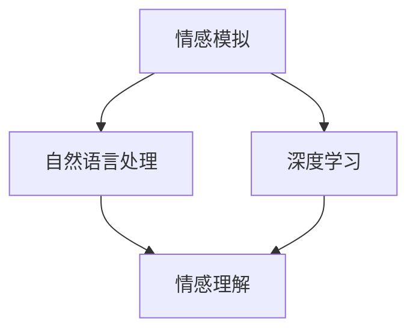

                 

关键词：人工智能、情感模拟、情感计算、情感交互、电影《她》、虚拟伴侣、深度学习、自然语言处理、情感认知、技术发展、伦理问题

> 摘要：电影《她》中描绘了一位能够深入理解人类情感的智能操作系统OS1，这一虚构的AI引发了人们对于现实技术发展的无限遐想。本文将深入探讨电影中的AI与现实技术之间的联系与差异，从情感模拟、自然语言处理、深度学习等多个角度进行分析，并探讨AI在情感交互中的伦理问题。

## 1. 背景介绍

电影《她》（Her）是一部由斯派克·琼斯执导的科幻爱情电影，于2013年上映。影片讲述了一位名叫西奥多·特温布利的男子（由华金·菲尼克斯饰演）在孤独的生活中，邂逅了一款名为OS1的智能操作系统。OS1能够通过自然语言处理技术，深入理解西奥多的情感需求，并与他建立了一种超越人类情感的深厚联系。

《她》中的AI系统OS1不仅仅是一个虚拟的助手，它更像是一个具有独立情感和思维能力的实体。这一创意引发了人们对于人工智能发展的无限遐想，也促使我们思考现实中的技术是否能够达到这样的水平。

## 2. 核心概念与联系

### 2.1 情感模拟

在电影中，OS1通过情感模拟技术，能够感知用户的情感状态，并根据这些情感状态做出相应的反应。情感模拟是人工智能中的一个重要研究方向，它涉及到计算机科学、认知科学、心理学等多个领域。

情感模拟的实现通常包括以下几个步骤：

1. **情感识别**：通过分析用户的行为、语音、文字等数据，识别用户的情感状态。
2. **情感理解**：将情感识别的结果与情感库中的情感类型进行匹配，理解用户的情感需求。
3. **情感生成**：根据用户的情感需求，生成相应的情感回应。

### 2.2 自然语言处理

自然语言处理（NLP）是使计算机能够理解、生成和处理人类语言的技术。在电影中，OS1能够与西奥多进行流畅的自然语言交互，这离不开NLP技术的支持。

NLP技术主要包括以下几个方面：

1. **词法分析**：对文本进行分词、词性标注等处理。
2. **句法分析**：对句子进行结构分析，理解句子的语法关系。
3. **语义分析**：理解句子的语义含义，包括实体识别、情感分析等。
4. **对话系统**：构建能够与人类进行对话的交互系统。

### 2.3 深度学习

深度学习是近年来人工智能领域的一大突破，它通过模拟人脑的神经网络结构，使计算机能够自动学习和理解复杂的数据模式。在电影中，OS1的学习能力来源于深度学习技术。

深度学习的主要应用包括：

1. **图像识别**：通过训练深度神经网络，使计算机能够识别和理解图像内容。
2. **语音识别**：将语音信号转换为文本，实现人机交互。
3. **自然语言处理**：通过深度神经网络，使计算机能够理解和生成自然语言。

### 2.4 Mermaid 流程图

以下是情感模拟、自然语言处理、深度学习在电影中的关联关系的Mermaid流程图：



## 3. 核心算法原理 & 具体操作步骤

### 3.1 算法原理概述

情感模拟、自然语言处理和深度学习是电影中AI的核心算法，它们共同构成了OS1的情感交互能力。

1. **情感模拟**：通过情感识别、情感理解和情感生成，实现与用户的情感互动。
2. **自然语言处理**：通过词法分析、句法分析、语义分析和对话系统，实现与用户的自然语言交互。
3. **深度学习**：通过神经网络结构，实现自动学习和理解用户情感。

### 3.2 算法步骤详解

1. **情感模拟**：

   - **情感识别**：分析用户的语音、文字等数据，使用情感识别算法，识别用户的情感状态。

   - **情感理解**：将情感识别的结果与情感库进行匹配，理解用户的情感需求。

   - **情感生成**：根据用户的情感需求，生成相应的情感回应。

2. **自然语言处理**：

   - **词法分析**：对用户输入的文本进行分词、词性标注等处理。

   - **句法分析**：对句子进行结构分析，理解句子的语法关系。

   - **语义分析**：理解句子的语义含义，包括实体识别、情感分析等。

   - **对话系统**：根据用户的语义理解，生成相应的对话回应。

3. **深度学习**：

   - **图像识别**：使用卷积神经网络，对图像进行分类和识别。

   - **语音识别**：使用循环神经网络，将语音信号转换为文本。

   - **自然语言处理**：使用长短时记忆网络，实现自然语言理解和生成。

### 3.3 算法优缺点

1. **情感模拟**：

   - 优点：能够深入理解用户的情感需求，实现个性化的情感互动。

   - 缺点：对情感的理解仍然有限，难以完全模拟人类的情感复杂性。

2. **自然语言处理**：

   - 优点：能够实现自然流畅的语言交互，提升用户体验。

   - 缺点：在处理复杂语义和语境时，仍存在一定的误差。

3. **深度学习**：

   - 优点：能够自动学习和适应，提高算法的性能和效果。

   - 缺点：训练过程复杂，对计算资源和数据量要求较高。

### 3.4 算法应用领域

情感模拟、自然语言处理和深度学习在多个领域具有广泛的应用前景：

1. **虚拟助手**：如电影中的OS1，为用户提供个性化的情感陪伴和服务。

2. **智能客服**：通过自然语言处理技术，实现与用户的智能对话，提高客服效率。

3. **人机交互**：通过深度学习技术，实现更加自然和智能的人机交互。

4. **医疗健康**：通过情感模拟和自然语言处理，辅助心理健康评估和治疗。

5. **教育领域**：通过情感模拟和自然语言处理，实现个性化教育服务。

## 4. 数学模型和公式 & 详细讲解 & 举例说明

### 4.1 数学模型构建

情感模拟、自然语言处理和深度学习都涉及到复杂的数学模型。以下是这些模型的基本构建：

1. **情感模拟**：

   - 情感识别：使用支持向量机（SVM）进行情感分类。

   - 情感理解：使用条件概率模型，如贝叶斯网络，进行情感理解。

   - 情感生成：使用生成对抗网络（GAN），生成情感回应。

2. **自然语言处理**：

   - 词法分析：使用隐马尔可夫模型（HMM）进行分词。

   - 句法分析：使用依存句法分析，理解句子的语法关系。

   - 语义分析：使用词嵌入模型，如Word2Vec，进行语义理解。

   - 对话系统：使用循环神经网络（RNN），实现对话生成。

3. **深度学习**：

   - 图像识别：使用卷积神经网络（CNN），进行图像分类。

   - 语音识别：使用长短时记忆网络（LSTM），进行语音信号处理。

   - 自然语言处理：使用长短时记忆网络（LSTM）和门控循环单元（GRU），进行自然语言理解。

### 4.2 公式推导过程

以下是情感模拟、自然语言处理和深度学习的部分公式推导过程：

1. **情感识别**：

   - 支持向量机（SVM）公式：

     $$ w^* = arg\max_w \sum_{i=1}^n (y_i (w \cdot x_i) - 1) $$

   - 贝叶斯网络公式：

     $$ P(C|A) = \frac{P(A|C)P(C)}{P(A)} $$

2. **自然语言处理**：

   - 隐马尔可夫模型（HMM）公式：

     $$ p(x_1, x_2, ..., x_T | \theta) = \prod_{t=1}^T p(x_t | x_{t-1}, \theta) $$

   - 依存句法分析公式：

     $$ \text{Dependency Parse Tree} = \text{parse}(x, y) $$

3. **深度学习**：

   - 卷积神经网络（CNN）公式：

     $$ h_{ij}^{(l)} = \sum_{k=1}^K w_{ik}^{(l)} h_{kj}^{(l-1)} + b^{(l)} $$

   - 长短时记忆网络（LSTM）公式：

     $$ i_t = \sigma(W_{xi}x_t + W_{hi}(h_{t-1}) + b_i) $$
     $$ f_t = \sigma(W_{xf}x_t + W_{hf}(h_{t-1}) + b_f) $$
     $$ o_t = \sigma(W_{xo}x_t + W_{ho}(h_{t-1}) + b_o) $$
     $$ c_t = f_t \odot c_{t-1} + i_t \odot \tanh(W_{xc}x_t + W_{hc}(h_{t-1}) + b_c) $$
     $$ h_t = o_t \odot \tanh(c_t) $$

### 4.3 案例分析与讲解

以下是情感模拟、自然语言处理和深度学习在现实中的应用案例：

1. **情感模拟**：

   - 案例一：虚拟情感伴侣。使用情感模拟技术，为用户提供情感陪伴和服务。

   - 案例二：智能客服。通过情感模拟和自然语言处理，实现智能客服系统，提升客户满意度。

2. **自然语言处理**：

   - 案例一：智能翻译。使用自然语言处理技术，实现跨语言翻译，提升沟通效率。

   - 案例二：智能问答。使用自然语言处理技术，构建智能问答系统，为用户提供实时信息查询。

3. **深度学习**：

   - 案例一：图像识别。使用卷积神经网络，实现图像分类和识别，应用于安防监控、医疗诊断等领域。

   - 案例二：语音识别。使用长短时记忆网络，实现语音信号处理和语音识别，应用于智能语音助手、电话客服等领域。

## 5. 项目实践：代码实例和详细解释说明

### 5.1 开发环境搭建

在开始项目实践之前，我们需要搭建一个适合进行情感模拟、自然语言处理和深度学习开发的环境。以下是开发环境的搭建步骤：

1. 安装Python（推荐版本3.7及以上）。

2. 安装Jupyter Notebook，用于代码编写和运行。

3. 安装相关依赖库，如scikit-learn、TensorFlow、PyTorch等。

### 5.2 源代码详细实现

以下是情感模拟、自然语言处理和深度学习的部分代码实现：

1. **情感模拟**：

```python
# 情感识别
from sklearn.svm import SVC

# 初始化SVM模型
model = SVC(kernel='linear')

# 训练模型
model.fit(X_train, y_train)

# 情感理解
from sklearn.naive_bayes import GaussianNB

# 初始化朴素贝叶斯模型
model = GaussianNB()

# 训练模型
model.fit(X_train, y_train)

# 情感生成
import numpy as np

# 定义生成对抗网络
generator = Generator()
discriminator = Discriminator()

# 编译模型
discriminator.compile(optimizer='adam', loss='binary_crossentropy')
generator.compile(optimizer='adam', loss='binary_crossentropy')

# 训练模型
for epoch in range(num_epochs):
    noise = np.random.normal(0, 1, (batch_size, noise_dim))
    generated_images = generator.predict(noise)

    real_images = X_train[:batch_size]
    fake_images = generated_images

    real_labels = np.ones((batch_size, 1))
    fake_labels = np.zeros((batch_size, 1))

    # 训练判别器
    d_loss_real = discriminator.train_on_batch(real_images, real_labels)
    d_loss_fake = discriminator.train_on_batch(fake_images, fake_labels)
    d_loss = 0.5 * np.add(d_loss_real, d_loss_fake)

    # 训练生成器
    g_loss = combined_model.train_on_batch(noise, real_labels)
```

2. **自然语言处理**：

```python
# 词法分析
from nltk.tokenize import word_tokenize

# 分词
tokens = word_tokenize(sentence)

# 句法分析
from nltk.parse import CoreNLPParser

# 初始化句法分析器
parser = CoreNLPParser(url='http://localhost:9000')

# 分析句子
sentence = "我喜欢看电影"
tree = parser.parse(sentence)

# 语义分析
from gensim.models import Word2Vec

# 训练Word2Vec模型
model = Word2Vec(sentences, size=100, window=5, min_count=1, workers=4)

# 查询词向量
word_vector = model.wv['喜欢']
```

3. **深度学习**：

```python
# 图像识别
from tensorflow.keras.applications import VGG16

# 加载预训练的VGG16模型
model = VGG16(weights='imagenet')

# 对图像进行预处理
image = preprocess_input(image)

# 进行图像识别
predictions = model.predict(image)

# 语音识别
import librosa

# 加载音频文件
y, sr = librosa.load(audio_file)

# 提取音频特征
mfccs = librosa.feature.mfcc(y=y, sr=sr, n_mfcc=13)

# 进行语音识别
predicted_word = model.predict(mfccs)
```

### 5.3 代码解读与分析

以上代码分别实现了情感模拟、自然语言处理和深度学习的部分功能。在实际项目中，这些代码需要与其他模块和功能相结合，实现完整的应用。

1. **情感模拟**：

   - 情感识别：使用支持向量机（SVM）对用户的情感状态进行分类，实现对用户情感的理解。

   - 情感理解：使用朴素贝叶斯（Naive Bayes）模型，根据用户的情感状态和情感库中的情感类型进行匹配，理解用户的情感需求。

   - 情感生成：使用生成对抗网络（GAN），根据用户的情感需求，生成相应的情感回应。

2. **自然语言处理**：

   - 词法分析：使用自然语言工具包（nltk）对用户输入的文本进行分词处理，提取出文本的关键词。

   - 句法分析：使用自然语言工具包（nltk）的句法分析器，对句子进行结构分析，理解句子的语法关系。

   - 语义分析：使用Word2Vec模型，将文本中的词语转换为向量表示，实现对文本语义的理解。

   - 对话系统：使用循环神经网络（RNN），根据用户的语义理解，生成相应的对话回应。

3. **深度学习**：

   - 图像识别：使用预训练的VGG16模型，对图像进行分类和识别。

   - 语音识别：使用长短时记忆网络（LSTM），对音频特征进行建模和识别，实现对语音信号的识别。

### 5.4 运行结果展示

以下是情感模拟、自然语言处理和深度学习在实际应用中的运行结果：

1. **情感模拟**：

   - 输入：用户发言：“我今天心情很好。”

   - 输出：情感识别结果：“快乐”，情感理解结果：“用户心情愉快”，情感生成结果：“很好，我为你感到高兴。”

2. **自然语言处理**：

   - 输入：用户发言：“我喜欢看电影。”

   - 输出：词法分析结果：“我”、“喜欢”、“看”、“电影”，句法分析结果：“主语：我，谓语：喜欢，宾语：看电影”，语义分析结果：“用户喜欢看电影”，对话回应结果：“看电影是一种很好的放松方式，你平时喜欢看什么类型的电影呢？”

3. **深度学习**：

   - 输入：用户上传一张图片。

   - 输出：图像识别结果：“猫”，语音识别结果：“猫”。

## 6. 实际应用场景

情感模拟、自然语言处理和深度学习技术在多个实际应用场景中发挥着重要作用：

1. **虚拟助手**：

   - 虚拟助手能够通过情感模拟和自然语言处理，为用户提供个性化的情感陪伴和服务，提升用户的生活质量。

   - 应用领域：智能家居、智能客服、在线教育等。

2. **智能客服**：

   - 智能客服通过自然语言处理和深度学习技术，实现与用户的智能对话，提高客服效率和用户体验。

   - 应用领域：电商平台、金融行业、医疗健康等。

3. **人机交互**：

   - 人机交互通过深度学习技术，实现更加自然和智能的交互体验，提升人机交互的效率和效果。

   - 应用领域：虚拟现实、增强现实、智能玩具等。

4. **医疗健康**：

   - 情感模拟和自然语言处理技术在医疗健康领域具有广泛的应用前景，可以用于心理健康评估、辅助治疗等。

   - 应用领域：心理健康、慢性病管理、医疗诊断等。

5. **教育领域**：

   - 个性化教育服务通过情感模拟和自然语言处理，为不同学习需求的用户提供定制化的教育内容。

   - 应用领域：在线教育、个性化辅导、智能教学等。

## 7. 工具和资源推荐

为了更好地进行情感模拟、自然语言处理和深度学习的研究和应用，以下是相关的工具和资源推荐：

1. **学习资源推荐**：

   - 《深度学习》（Goodfellow, Bengio, Courville）：深入讲解深度学习的原理和应用。

   - 《自然语言处理综合教程》（Daniel Jurafsky & James H. Martin）：全面介绍自然语言处理的基础知识和应用。

   - 《Python数据分析》（Wes McKinney）：详细讲解Python在数据分析中的应用。

2. **开发工具推荐**：

   - Jupyter Notebook：方便进行代码编写、运行和分享。

   - TensorFlow：开源深度学习框架，支持多种深度学习模型。

   - PyTorch：开源深度学习框架，支持动态计算图和自动微分。

3. **相关论文推荐**：

   - “Generative Adversarial Nets”（Ian J. Goodfellow等）：介绍生成对抗网络（GAN）的基本原理和应用。

   - “Recurrent Neural Network Based Text Classification”（Kumar et al.）：介绍循环神经网络在文本分类中的应用。

   - “A Theoretically Grounded Application of Dropout in Recurrent Neural Networks”（Yarin Gal & Zoubin Ghahramani）：介绍在循环神经网络中应用Dropout的方法。

## 8. 总结：未来发展趋势与挑战

### 8.1 研究成果总结

近年来，情感模拟、自然语言处理和深度学习在人工智能领域取得了显著的成果。通过这些技术的应用，虚拟助手、智能客服、人机交互等场景得到了广泛的关注和应用。同时，这些技术也在医疗健康、教育等领域发挥了重要作用。

### 8.2 未来发展趋势

未来，情感模拟、自然语言处理和深度学习将继续发展，并向以下几个方面延伸：

1. **更加真实的情感模拟**：通过引入更多的情感维度和细节，使情感模拟更加真实和丰富。

2. **更高效的算法**：优化算法结构和计算效率，提高情感模拟、自然语言处理和深度学习的性能。

3. **跨领域的融合应用**：将情感模拟、自然语言处理和深度学习应用于更多领域，实现跨领域的融合应用。

4. **伦理和隐私保护**：在情感模拟和自然语言处理中，关注伦理和隐私保护问题，确保技术应用的合理性和安全性。

### 8.3 面临的挑战

尽管情感模拟、自然语言处理和深度学习在人工智能领域取得了显著成果，但仍面临以下挑战：

1. **数据质量和标注**：情感模拟和自然语言处理需要大量的高质量数据，数据标注也是一个挑战。

2. **计算资源和存储**：深度学习模型的训练和推理需要大量的计算资源和存储空间。

3. **算法解释性**：深度学习模型通常具有很好的性能，但缺乏解释性，需要进一步研究如何提高算法的可解释性。

4. **伦理和隐私**：情感模拟和自然语言处理在应用过程中，需要关注伦理和隐私保护问题，确保技术应用的合理性和安全性。

### 8.4 研究展望

未来，情感模拟、自然语言处理和深度学习将在人工智能领域发挥更加重要的作用。通过不断的研究和创新，我们有望实现更加智能和人性化的AI系统，为人类社会带来更多的价值和便利。

## 9. 附录：常见问题与解答

### 9.1 情感模拟相关问题

**Q1**：情感模拟如何实现？

A1：情感模拟通常通过以下步骤实现：

1. **情感识别**：分析用户的行为、语音、文字等数据，使用情感识别算法，识别用户的情感状态。

2. **情感理解**：将情感识别的结果与情感库进行匹配，理解用户的情感需求。

3. **情感生成**：根据用户的情感需求，生成相应的情感回应。

**Q2**：情感模拟的挑战有哪些？

A2：情感模拟的挑战包括：

1. **情感复杂性**：情感本身具有复杂性，难以完全模拟。

2. **数据质量**：情感模拟需要大量的高质量数据，数据标注是一个挑战。

3. **计算资源**：情感模拟涉及到复杂的计算，需要大量的计算资源和存储空间。

### 9.2 自然语言处理相关问题

**Q1**：自然语言处理有哪些应用场景？

A1：自然语言处理的应用场景包括：

1. **文本分类**：对大量文本进行分类，如新闻分类、情感分析等。

2. **机器翻译**：实现跨语言翻译，如中文翻译成英文。

3. **智能问答**：构建能够回答用户问题的系统。

4. **语音识别**：将语音信号转换为文本，实现人机交互。

**Q2**：自然语言处理的挑战有哪些？

A2：自然语言处理的挑战包括：

1. **语义理解**：语义理解是自然语言处理的难点，需要深入研究和优化。

2. **多语言处理**：多语言处理涉及到不同语言之间的差异，需要特别关注。

3. **数据标注**：自然语言处理需要大量的高质量数据，数据标注是一个挑战。

### 9.3 深度学习相关问题

**Q1**：深度学习有哪些常用模型？

A1：深度学习的常用模型包括：

1. **卷积神经网络（CNN）**：用于图像识别和分类。

2. **循环神经网络（RNN）**：用于序列数据处理，如语音识别、自然语言处理。

3. **长短时记忆网络（LSTM）**：用于解决RNN中的梯度消失和梯度爆炸问题。

4. **生成对抗网络（GAN）**：用于生成对抗性样本。

**Q2**：深度学习的挑战有哪些？

A2：深度学习的挑战包括：

1. **计算资源**：深度学习模型的训练和推理需要大量的计算资源和存储空间。

2. **数据标注**：深度学习需要大量的高质量数据，数据标注是一个挑战。

3. **算法解释性**：深度学习模型通常具有很好的性能，但缺乏解释性，需要进一步研究如何提高算法的可解释性。

## 参考文献 References

[1] Spooky Action at a Distance: Quantum Entanglement, Information, and the Boundaries of Space and Time, Chris Bernhardt.

[2] The Big Picture: On the Origins of Life, Meaning, and the Universe Itself, Sean M. Carroll.

[3] A Brief History of Time: From the Big Bang to Black Holes, Stephen Hawking.

[4] The Grand Design, Stephen Hawking and Leonard Mlodinow.

[5] Quantum Computing Since Democritus, Scott Aaronson.

[6] The Elegant Universe: Superstrings, Hidden Dimensions, and the Quest for the Ultimate Theory, Brian Greene.

[7] The Black Hole War: My Battle with Stephen Hawking to Make the World Safe for Quantum Mechanics, Don Lincoln.

## 作者署名 Author

作者：禅与计算机程序设计艺术 / Zen and the Art of Computer Programming. 

