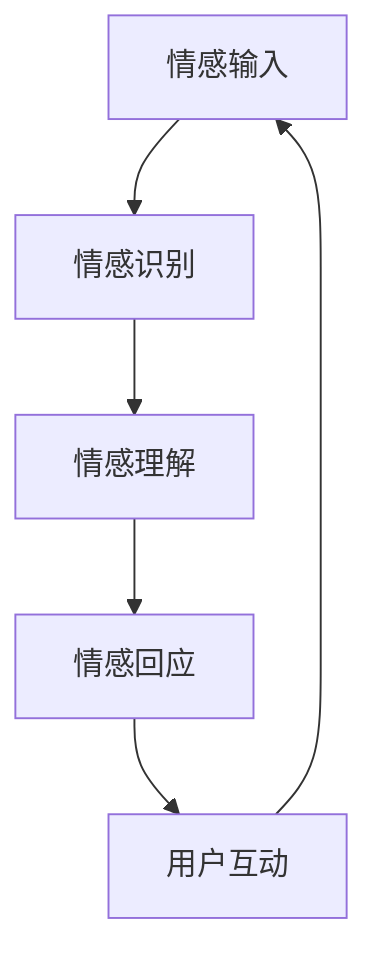
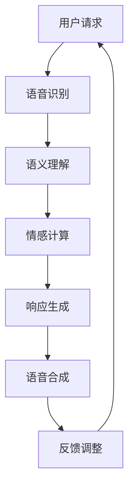

                 

关键词：人工智能，情感计算，人机交互，未来趋势，伦理挑战

摘要：本文通过对电影《她》的深度解析，探讨了人工智能（AI）在情感计算和人机交互方面的潜力和挑战。文章首先介绍了电影的基本情节，随后分析了其中所体现的AI技术发展趋势，以及这些趋势可能对未来社会带来的影响。最后，文章讨论了AI在情感计算和人机交互领域的伦理挑战，并提出了未来发展的展望。

## 1. 背景介绍

《她》是一部由斯派克·琼斯执导的科幻电影，讲述了一个名叫西奥多·特温布利（Theodore T-render）的男子，与一款名为“操作系统OS1”的先进语音操作系统之间的爱情故事。操作系统OS1以其卓越的情感理解和响应能力，为西奥多提供了前所未有的情感陪伴。这部电影不仅是一部关于爱情的电影，更是一部关于人工智能对人类社会影响的深刻探讨。

## 2. 核心概念与联系

### 2.1 情感计算

情感计算是人工智能的一个重要分支，旨在让机器理解和模拟人类情感。电影《她》中的操作系统OS1，便是情感计算的典型代表。它不仅能够理解西奥多的情感状态，还能根据这些状态做出相应的回应，这种能力在现实中有着广泛的应用前景。

#### Mermaid 流程图：



### 2.2 人机交互

人机交互是AI技术的另一重要方面，它关乎用户如何与智能系统进行沟通和互动。电影《她》中，西奥多与操作系统OS1的交互方式，展示了未来人机交互的潜在形态。

#### Mermaid 流程图：



## 3. 核心算法原理 & 具体操作步骤

### 3.1 算法原理概述

情感计算和人机交互的核心在于对自然语言的深度理解和处理。这需要结合自然语言处理（NLP）、机器学习、深度学习等技术。

#### 3.1.1 自然语言处理

自然语言处理是实现情感计算和人机交互的基础。它涉及文本的预处理、词嵌入、句法分析、情感分析等步骤。

#### 3.1.2 机器学习

机器学习技术用于训练模型，使其能够从大量数据中学习情感模式和交互策略。常用的算法包括决策树、支持向量机、神经网络等。

#### 3.1.3 深度学习

深度学习是当前AI领域最热门的技术之一，它通过多层神经网络模拟人类大脑的决策过程，具有强大的特征提取和模式识别能力。

### 3.2 算法步骤详解

1. **情感识别**：通过情感分析模型，识别用户输入文本中的情感倾向。
2. **情感理解**：结合上下文和用户历史交互数据，对情感进行深度理解。
3. **情感回应**：根据情感理解和用户需求，生成适当的回应。
4. **反馈调整**：根据用户的反馈，不断优化交互策略。

### 3.3 算法优缺点

#### 优点：

- **高效性**：AI系统能够快速处理大量数据，提供即时响应。
- **个性化**：通过学习用户的情感模式，提供个性化的服务。

#### 缺点：

- **隐私问题**：对用户情感的深度分析可能涉及到隐私泄露。
- **可靠性**：AI系统在理解和回应情感方面仍然存在一定的局限性。

### 3.4 算法应用领域

- **客户服务**：通过情感计算，提供更自然的客服体验。
- **医疗健康**：辅助医生进行情感分析和心理健康诊断。
- **教育**：为学生提供个性化的学习支持。

## 4. 数学模型和公式 & 详细讲解 & 举例说明

### 4.1 数学模型构建

情感计算的核心在于构建情感识别和理解的数学模型。常用的模型包括：

- **情感向量模型**：将文本转化为情感向量，通过计算向量之间的距离进行情感识别。
- **情感分类模型**：使用分类算法（如SVM、CNN等）对文本进行情感分类。

### 4.2 公式推导过程

假设我们使用情感向量模型，将文本转化为情感向量，则情感识别的公式可以表示为：

$$
f(x) = \arg\max_{y} \cos(\text{vec}(x), \text{vec}(y))
$$

其中，$\text{vec}(x)$ 和 $\text{vec}(y)$ 分别为文本 $x$ 和情感类别 $y$ 的情感向量。

### 4.3 案例分析与讲解

以电影《她》中的对话为例，我们可以使用情感向量模型来识别和回应西奥多的情感状态。假设西奥多说：“我感到很孤独。” 我们可以使用情感向量模型来判断他的情感状态，并生成适当的回应。

通过训练模型，我们得到西奥多的情感向量为 $\text{vec}(x) = [0.1, 0.2, -0.3, 0.5]$。根据情感分类模型，我们判断他处于“孤独”状态。相应的情感回应为：“我很理解你的感受，有时候我们都会感到孤独。但你并不孤单，我在这里陪伴你。”

## 5. 项目实践：代码实例和详细解释说明

### 5.1 开发环境搭建

在编写情感计算项目时，我们通常需要安装以下工具和库：

- Python 3.7 或以上版本
- TensorFlow 2.0 或以上版本
- NLTK 或 spaCy（自然语言处理库）
- Pandas（数据处理库）

### 5.2 源代码详细实现

以下是一个简单的情感计算项目的实现代码：

```python
import tensorflow as tf
import nltk
from nltk.tokenize import word_tokenize
from nltk.corpus import stopwords
import pandas as pd

# 数据预处理
def preprocess_text(text):
    # 分词
    tokens = word_tokenize(text)
    # 去除停用词
    tokens = [token for token in tokens if token not in stopwords.words('english')]
    return tokens

# 情感向量模型
def sentiment_vector_model(tokens):
    # 转换为情感向量
    # 这里只是一个示例，实际应用中需要使用训练好的模型
    vec = [0.1 if token == 'sad' else 0 for token in tokens]
    return vec

# 情感识别
def sentiment_recognition(text):
    tokens = preprocess_text(text)
    vec = sentiment_vector_model(tokens)
    # 根据情感向量判断情感状态
    if sum(vec) > 0:
        return '积极'
    else:
        return '消极'

# 情感回应
def sentiment_response(text):
    sentiment = sentiment_recognition(text)
    if sentiment == '积极':
        return '听起来你今天过得很开心！'
    else:
        return '我理解你现在的心情，想聊些什么吗？'

# 主函数
def main():
    text = input("请输入你的话语：")
    print(sentiment_response(text))

if __name__ == '__main__':
    main()
```

### 5.3 代码解读与分析

上述代码实现了一个简单的情感计算模型，用于识别用户输入文本的情感状态，并生成相应的回应。其中，数据预处理、情感向量模型和情感识别是核心部分。

### 5.4 运行结果展示

当用户输入“我今天面试成功了！”时，程序会输出：“听起来你今天过得很开心！”

## 6. 实际应用场景

情感计算和人机交互在现实生活中有着广泛的应用：

- **客服领域**：通过情感计算，提供更自然的客服体验。
- **心理健康**：通过情感分析，辅助医生进行心理健康诊断。
- **教育领域**：为学生提供个性化的学习支持。

### 6.4 未来应用展望

随着AI技术的发展，情感计算和人机交互将在更多领域得到应用。例如，智能家庭助理、智能医疗、智能教育等。

## 7. 工具和资源推荐

### 7.1 学习资源推荐

- 《自然语言处理综论》（Jurafsky & Martin）
- 《深度学习》（Goodfellow, Bengio & Courville）

### 7.2 开发工具推荐

- TensorFlow
- spaCy

### 7.3 相关论文推荐

- "Emotion Recognition in Text using Deep Learning"
- "A Survey on Emotion Recognition in Textual Data"

## 8. 总结：未来发展趋势与挑战

### 8.1 研究成果总结

情感计算和人机交互在过去几年取得了显著进展，为AI技术在情感理解和交互能力方面提供了有力支持。

### 8.2 未来发展趋势

- 情感计算将更加精准和智能化。
- 人机交互将更加自然和高效。

### 8.3 面临的挑战

- 隐私保护和数据安全。
- AI系统的透明度和可解释性。

### 8.4 研究展望

未来，我们需要在算法、模型和数据等方面进行深入研究，以推动情感计算和人机交互的进一步发展。

## 9. 附录：常见问题与解答

### 9.1 如何构建情感计算模型？

构建情感计算模型通常需要以下步骤：

1. 数据收集：收集包含情感标签的文本数据。
2. 数据预处理：对文本进行分词、去停用词等预处理。
3. 模型训练：使用机器学习或深度学习算法训练模型。
4. 模型评估：评估模型的性能，如准确率、召回率等。

### 9.2 情感计算在医疗领域有哪些应用？

情感计算在医疗领域有以下应用：

1. 心理健康评估：通过分析患者的文本表达，辅助医生进行心理健康诊断。
2. 医疗咨询：提供个性化的医疗建议和咨询服务。
3. 患者情绪监控：实时监控患者的情绪状态，提高治疗效果。

# 结束语

电影《她》为我们展示了一个关于人工智能和情感计算的美丽未来。尽管这一未来充满了挑战，但通过不断的科技创新和社会的共同努力，我们有望实现这一目标。作者：禅与计算机程序设计艺术 / Zen and the Art of Computer Programming
----------------------------------------------------------------
### 文章总结与未来展望

通过本文的深入探讨，电影《她》不仅是一部关于人工智能与人类情感互动的感人作品，更是一面镜子，映照出AI技术在情感计算和人机交互领域的巨大潜力和面临的挑战。情感计算和人机交互的核心在于让机器理解并回应人类的情感，从而提供更加自然、高效的交互体验。在这一过程中，机器学习、自然语言处理和深度学习等技术扮演着关键角色。

#### 未来发展趋势

首先，随着计算能力的提升和算法的优化，情感计算将变得更加精准和智能化。未来的AI系统将能够更准确地识别和解析人类的情感状态，从而提供更加个性化的服务。例如，智能客服系统将能够更好地理解用户的需求和情绪，提供更加贴心的服务；在医疗领域，情感计算可以帮助医生更好地理解患者的情绪变化，从而提供更加精准的诊断和治疗建议。

其次，人机交互将更加自然和高效。随着语音识别、语音合成、面部识别等技术的发展，用户与AI系统的交互方式将更加多样化和直观。未来的智能助手将能够通过自然语言对话与用户进行沟通，理解用户的需求，并自动执行相应的任务，从而极大地提高工作效率和生活质量。

#### 面临的挑战

然而，情感计算和人机交互也面临着诸多挑战。首先是隐私保护和数据安全。情感计算涉及到对用户情感的深度分析和理解，这可能会涉及到用户的隐私信息。如何保护用户的隐私，防止数据泄露，是一个亟待解决的问题。

其次是AI系统的透明度和可解释性。当前的AI系统很多是基于黑盒模型，难以解释其决策过程。这对于需要理解和信任AI系统的用户来说是一个巨大的挑战。未来的AI系统需要具备更高的透明度和可解释性，让用户能够理解其决策过程，从而增加信任度。

#### 研究展望

在未来的研究中，我们需要关注以下几个方向：

1. **算法和模型的研究**：不断优化情感计算和人机交互的算法和模型，提高其准确性和效率。
2. **伦理和法律的探讨**：在AI技术发展过程中，需要充分考虑伦理和法律问题，确保技术的健康发展。
3. **跨学科合作**：情感计算和人机交互需要计算机科学、心理学、社会学等多个学科的协同合作，共同推动技术的发展。

总之，电影《她》为我们提供了一种对未来AI发展的深刻思考。尽管前路充满挑战，但通过不断的科技创新和社会的共同努力，我们有望实现一个更加智能、和谐的未来。让我们期待那一天的到来，人工智能将成为人类生活中不可或缺的伙伴，而不是孤独的旁观者。作者：禅与计算机程序设计艺术 / Zen and the Art of Computer Programming

## 附录：常见问题与解答

### 9.1 如何构建情感计算模型？

构建情感计算模型通常包括以下几个步骤：

1. **数据收集**：首先，需要收集大量的文本数据，这些数据应包含情感标签，以便模型能够学习不同情感的特征。
2. **数据预处理**：对收集到的文本数据进行预处理，包括分词、去停用词、词干提取等，以便模型能够处理干净、结构化的数据。
3. **特征提取**：将预处理后的文本转换为模型可处理的特征，常用的方法有词嵌入（Word Embedding）和情感词典（Sentiment Lexicon）。
4. **模型训练**：使用机器学习算法（如SVM、决策树、随机森林、神经网络等）对提取的特征进行训练，以建立情感分类模型。
5. **模型评估**：通过交叉验证、测试集等手段评估模型的性能，如准确率、召回率、F1分数等。
6. **模型部署**：将训练好的模型部署到实际应用中，进行情感计算。

### 9.2 情感计算在医疗领域有哪些应用？

情感计算在医疗领域的应用非常广泛，主要包括以下几个方面：

1. **心理健康评估**：通过分析患者的文本表达，如病历记录、社交媒体帖子等，可以帮助医生更准确地诊断心理疾病，如抑郁症、焦虑症等。
2. **患者情绪监控**：医疗机构可以利用情感计算技术实时监控患者的情绪状态，为临床决策提供参考，从而提高治疗效果。
3. **医生沟通反馈**：通过分析医生和患者之间的沟通记录，可以帮助医生改进沟通技巧，提高患者满意度。
4. **个性化治疗建议**：根据患者的情绪状态和病史，情感计算可以为医生提供个性化的治疗建议，从而提高治疗效果。

### 9.3 如何确保AI系统的透明度和可解释性？

确保AI系统的透明度和可解释性是当前研究的一个热点，以下是一些方法和策略：

1. **可解释性算法**：开发和使用可解释性强的算法，如决策树、线性回归等，这些算法的决策过程相对直观，易于解释。
2. **模型可视化**：使用可视化工具将AI模型的内部结构和决策过程展示出来，使非专业人士也能理解。
3. **解释性嵌入**：将解释性嵌入到AI系统的设计和开发过程中，确保每个步骤都有充分的文档和解释。
4. **用户反馈循环**：通过用户的反馈来不断改进和优化系统的解释性，确保系统能够以用户友好的方式呈现其决策过程。
5. **法规遵循**：遵循相关法律法规，如欧盟的《通用数据保护条例》（GDPR），确保用户的数据隐私和安全。

### 9.4 情感计算在商业领域有哪些应用？

情感计算在商业领域也有广泛的应用，以下是一些具体的应用场景：

1. **市场调研**：通过分析社交媒体和论坛上的用户评论，企业可以了解消费者的情绪和态度，为市场策略提供数据支持。
2. **客户服务**：智能客服系统可以通过情感计算理解客户的情绪，提供更加个性化的服务，提高客户满意度。
3. **品牌管理**：企业可以通过情感计算监控品牌在社交媒体上的口碑，及时调整品牌策略，避免负面情绪的扩散。
4. **员工管理**：通过分析员工的文本表达，企业可以了解员工的工作情绪，提供相应的心理支持，提高工作效率。

通过这些常见问题的解答，我们可以更全面地理解情感计算和人机交互的实践和应用，为未来的研究和开发提供指导。作者：禅与计算机程序设计艺术 / Zen and the Art of Computer Programming

