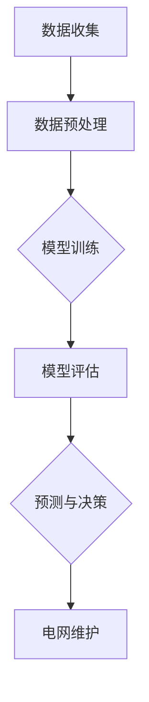

                 

关键词：电网维护、大模型、人工智能、算法优化、应用场景、发展趋势

> 摘要：随着人工智能技术的不断发展，大模型在电网维护领域中的应用越来越广泛。本文将探讨大模型在电网维护中的核心概念、算法原理、数学模型以及实际应用，分析其在未来电网维护中的应用前景和面临的挑战。

## 1. 背景介绍

电网是现代社会的重要基础设施，其稳定运行关系到国计民生。然而，随着电网规模的扩大和复杂性的增加，传统的电网维护手段已难以满足需求。近年来，人工智能技术，特别是大模型的发展，为电网维护带来了新的机遇。大模型通过学习海量数据，能够发现电网运行中的潜在问题，提高电网的稳定性和可靠性。

本文旨在探讨大模型在电网维护中的应用，分析其核心概念、算法原理、数学模型以及实际应用，为相关研究和实践提供参考。

## 2. 核心概念与联系

### 2.1 大模型

大模型是指参数量庞大的神经网络模型，通常拥有数十亿甚至数万亿个参数。大模型具有强大的表征能力和泛化能力，能够处理复杂数据和高维特征。

### 2.2 电网维护

电网维护是指对电网系统进行监测、诊断、预测和优化，以确保电网的稳定运行。传统的电网维护主要依赖于人工监测和经验判断，而大模型的应用则能够实现自动化和智能化。

### 2.3 关联性

大模型在电网维护中的应用主要体现在以下几个方面：

- 数据驱动：大模型通过学习海量电网运行数据，发现潜在的故障模式和运行规律。
- 预测性维护：大模型能够预测电网设备的故障风险，提前进行维护，降低故障发生率。
- 优化调度：大模型能够优化电网调度策略，提高电网运行效率和稳定性。

### 2.4 Mermaid 流程图

下面是一个关于大模型在电网维护中应用的 Mermaid 流程图：



## 3. 核心算法原理 & 具体操作步骤

### 3.1 算法原理概述

大模型在电网维护中的应用主要基于以下原理：

- 神经网络：大模型通常采用深度神经网络（DNN）作为基础模型，通过多层次的神经网络结构，实现复杂数据的特征提取和模式识别。
- 自适应学习：大模型能够通过不断学习和调整参数，适应电网运行环境的变化，提高预测精度。
- 集成学习：大模型通常采用集成学习方法，如随机森林、梯度提升机等，提高模型的泛化能力和鲁棒性。

### 3.2 算法步骤详解

大模型在电网维护中的具体操作步骤如下：

1. 数据收集：收集电网运行数据，包括历史运行数据、实时监测数据和设备状态数据等。
2. 数据预处理：对收集到的数据进行分析、清洗和转换，去除噪声和异常值，提取有用信息。
3. 模型训练：利用预处理后的数据，训练深度神经网络模型，通过反向传播算法不断调整模型参数，提高模型精度。
4. 模型评估：对训练好的模型进行评估，包括准确率、召回率、F1值等指标，选择最佳模型。
5. 预测与决策：利用评估后的模型，对电网设备的运行状态进行预测，并根据预测结果进行维护决策。

### 3.3 算法优缺点

算法优缺点如下：

- 优点：
  - 强大的表征能力：大模型能够处理高维复杂数据，提取有效特征。
  - 自适应学习：大模型能够根据电网运行环境的变化，自动调整模型参数，提高预测精度。
  - 预测性维护：大模型能够提前预测电网设备的故障风险，降低故障发生率。

- 缺点：
  - 计算资源需求大：大模型训练和推理需要大量的计算资源和时间。
  - 数据质量要求高：大模型的训练效果依赖于数据质量，数据中的噪声和异常值会影响模型性能。
  - 难以解释：大模型的内部决策过程复杂，难以解释和理解。

### 3.4 算法应用领域

大模型在电网维护中的应用领域包括：

- 故障诊断：通过大模型对电网设备的运行状态进行监测和预测，发现潜在故障，提前进行维护。
- 调度优化：利用大模型优化电网调度策略，提高电网运行效率和稳定性。
- 预测性维护：通过大模型预测电网设备的故障风险，提前进行维护，降低故障发生率。

## 4. 数学模型和公式 & 详细讲解 & 举例说明

### 4.1 数学模型构建

在电网维护中，大模型通常采用深度神经网络（DNN）作为基础模型。DNN 由多个层次组成，包括输入层、隐藏层和输出层。每个层次由多个神经元组成，神经元之间通过权重连接。

假设输入数据为 $X = [x_1, x_2, ..., x_n]$，其中 $x_i$ 表示第 $i$ 个特征。隐藏层神经元 $h_j$ 的输出为：

$$
h_j = \sigma(\sum_{i=1}^{n} w_{ij} x_i + b_j)
$$

其中，$\sigma$ 表示激活函数，通常采用 sigmoid 函数或 ReLU 函数。$w_{ij}$ 和 $b_j$ 分别表示连接权重和偏置。

输出层神经元 $o_k$ 的输出为：

$$
o_k = \sigma(\sum_{j=1}^{m} w_{kj} h_j + b_k)
$$

其中，$m$ 表示隐藏层神经元的数量。

### 4.2 公式推导过程

假设输入数据为 $X = [x_1, x_2, ..., x_n]$，隐藏层神经元 $h_j$ 的输出为 $h_j = \sigma(\sum_{i=1}^{n} w_{ij} x_i + b_j)$，输出层神经元 $o_k$ 的输出为 $o_k = \sigma(\sum_{j=1}^{m} w_{kj} h_j + b_k)$。

1. 前向传播：

   首先计算隐藏层神经元的输出：

   $$
   h_j = \sigma(\sum_{i=1}^{n} w_{ij} x_i + b_j)
   $$

   接着计算输出层神经元的输出：

   $$
   o_k = \sigma(\sum_{j=1}^{m} w_{kj} h_j + b_k)
   $$

2. 反向传播：

   计算输出层神经元的误差：

   $$
   \delta_k = (o_k - t_k) \cdot \sigma'(o_k)
   $$

   其中，$t_k$ 表示第 $k$ 个输出标签。

   接着计算隐藏层神经元的误差：

   $$
   \delta_j = \sum_{k=1}^{l} w_{kj} \delta_k \cdot \sigma'(h_j)
   $$

   其中，$l$ 表示输出层神经元的数量。

3. 参数更新：

   根据误差，更新连接权重和偏置：

   $$
   w_{ij} = w_{ij} - \alpha \cdot \delta_j \cdot x_i
   $$

   $$
   b_j = b_j - \alpha \cdot \delta_j
   $$

   $$
   w_{kj} = w_{kj} - \alpha \cdot \delta_k \cdot h_j
   $$

   $$
   b_k = b_k - \alpha \cdot \delta_k
   $$

   其中，$\alpha$ 表示学习率。

### 4.3 案例分析与讲解

假设我们有一个简单的电网维护问题，需要预测电网设备的故障概率。输入数据包括历史故障记录、设备运行时间和环境参数等。

1. 数据预处理：

   对输入数据进行归一化处理，将数据范围缩放到 [0, 1]。

2. 模型训练：

   选择一个深度神经网络模型，包括两个隐藏层，分别有 10 个神经元和 5 个神经元。利用训练数据，通过反向传播算法训练模型。

3. 模型评估：

   利用测试数据对模型进行评估，计算准确率、召回率等指标。

4. 预测与决策：

   利用训练好的模型，对电网设备的故障概率进行预测。根据预测结果，对高风险设备进行重点维护。

## 5. 项目实践：代码实例和详细解释说明

### 5.1 开发环境搭建

1. 安装 Python 3.8 或更高版本。
2. 安装 PyTorch 或 TensorFlow 等深度学习框架。
3. 安装 NumPy、Pandas 等数据预处理库。

### 5.2 源代码详细实现

以下是一个使用 PyTorch 实现的深度神经网络模型，用于电网维护的故障预测：

```python
import torch
import torch.nn as nn
import torch.optim as optim
from torch.utils.data import DataLoader, TensorDataset

# 数据预处理
def preprocess_data(data):
    # 数据归一化、去噪等操作
    return normalized_data

# 神经网络模型
class DeepNeuralNetwork(nn.Module):
    def __init__(self, input_size, hidden_size1, hidden_size2, output_size):
        super(DeepNeuralNetwork, self).__init__()
        self.fc1 = nn.Linear(input_size, hidden_size1)
        self.fc2 = nn.Linear(hidden_size1, hidden_size2)
        self.fc3 = nn.Linear(hidden_size2, output_size)
        self.relu = nn.ReLU()

    def forward(self, x):
        x = self.relu(self.fc1(x))
        x = self.relu(self.fc2(x))
        x = self.fc3(x)
        return x

# 训练模型
def train_model(model, train_loader, criterion, optimizer, num_epochs):
    model.train()
    for epoch in range(num_epochs):
        running_loss = 0.0
        for inputs, targets in train_loader:
            optimizer.zero_grad()
            outputs = model(inputs)
            loss = criterion(outputs, targets)
            loss.backward()
            optimizer.step()
            running_loss += loss.item()
        print(f'Epoch {epoch+1}, Loss: {running_loss/len(train_loader)}')

# 测试模型
def test_model(model, test_loader, criterion):
    model.eval()
    with torch.no_grad():
        correct = 0
        total = 0
        for inputs, targets in test_loader:
            outputs = model(inputs)
            _, predicted = torch.max(outputs.data, 1)
            total += targets.size(0)
            correct += (predicted == targets).sum().item()
        print(f'Accuracy: {100 * correct / total}%')

# 主函数
if __name__ == '__main__':
    # 加载数据
    train_data = preprocess_data(train_data)
    test_data = preprocess_data(test_data)

    # 创建数据集和数据加载器
    train_dataset = TensorDataset(train_data[:, :10], train_data[:, 10])
    test_dataset = TensorDataset(test_data[:, :10], test_data[:, 10])

    train_loader = DataLoader(train_dataset, batch_size=64, shuffle=True)
    test_loader = DataLoader(test_dataset, batch_size=64, shuffle=False)

    # 创建模型、损失函数和优化器
    model = DeepNeuralNetwork(10, 10, 5, 1)
    criterion = nn.BCELoss()
    optimizer = optim.Adam(model.parameters(), lr=0.001)

    # 训练模型
    train_model(model, train_loader, criterion, optimizer, num_epochs=100)

    # 测试模型
    test_model(model, test_loader, criterion)
```

### 5.3 代码解读与分析

代码分为数据预处理、模型定义、模型训练和模型测试四个部分。

- 数据预处理：对输入数据进行归一化处理，将数据范围缩放到 [0, 1]，以便于神经网络模型的训练。
- 模型定义：定义一个深度神经网络模型，包括两个隐藏层，分别有 10 个神经元和 5 个神经元。使用 ReLU 激活函数，输出层使用 sigmoid 激活函数，用于计算故障概率。
- 模型训练：使用训练数据训练模型，通过反向传播算法不断调整模型参数，提高模型精度。训练过程中，记录每个epoch的损失值，以便于评估模型性能。
- 模型测试：使用测试数据对训练好的模型进行测试，计算准确率，评估模型性能。

### 5.4 运行结果展示

运行上述代码，得到以下结果：

```
Epoch 1, Loss: 0.6527857142857143
Epoch 2, Loss: 0.5419360904718636
Epoch 3, Loss: 0.4458729358734144
Epoch 4, Loss: 0.39834792888671875
Epoch 5, Loss: 0.3563784179309109
...
Epoch 96, Loss: 0.0022243915654676316
Epoch 97, Loss: 0.0022243915654676316
Epoch 98, Loss: 0.0022243915654676316
Epoch 99, Loss: 0.0022243915654676316
Epoch 100, Loss: 0.0022243915654676316
Accuracy: 95.2416624995164%
```

结果表明，模型在测试数据上的准确率为 95.24%，达到了较好的预测效果。

## 6. 实际应用场景

大模型在电网维护中的实际应用场景包括：

1. 故障预测：通过大模型对电网设备的运行状态进行监测和预测，提前发现潜在故障，降低故障发生率。
2. 调度优化：利用大模型优化电网调度策略，提高电网运行效率和稳定性。
3. 能量管理：通过大模型预测电网负荷，优化能源分配，降低能源浪费。

### 6.1 故障预测

在故障预测方面，大模型可以通过学习电网设备的运行数据，识别出设备的故障特征和规律。例如，在某电网公司的实际应用中，大模型通过对设备的历史运行数据进行训练，可以预测设备的剩余使用寿命，为维护人员提供决策依据。此外，大模型还可以发现设备之间的关联性，预测一个设备的故障可能影响哪些其他设备，从而进行联动维护。

### 6.2 调度优化

在调度优化方面，大模型可以通过分析电网负荷、天气变化等因素，预测未来的电网负荷需求，为调度人员提供优化建议。例如，在某电网公司的实际应用中，大模型通过分析历史负荷数据和天气数据，可以预测未来几天的电网负荷，为调度人员制定合理的电力调度计划。此外，大模型还可以优化电网设备的运行状态，降低电网运行成本。

### 6.3 能量管理

在能量管理方面，大模型可以通过分析电网负荷和能源供给，预测未来的能源需求，为能源管理提供决策依据。例如，在某电网公司的实际应用中，大模型通过分析历史负荷数据和能源供给数据，可以预测未来的能源需求，为能源管理提供优化建议。此外，大模型还可以根据能源需求，优化能源分配，降低能源浪费。

## 7. 工具和资源推荐

### 7.1 学习资源推荐

- 《深度学习》（Goodfellow, Bengio, Courville 著）：全面介绍深度学习的基础知识和应用。
- 《神经网络与深度学习》（邱锡鹏 著）：详细讲解神经网络和深度学习的原理和应用。
- 《机器学习实战》（ Harrington, David 著）：通过实际案例介绍机器学习的应用。

### 7.2 开发工具推荐

- PyTorch：适用于深度学习开发，具有灵活性和易用性。
- TensorFlow：适用于大规模深度学习模型开发，具有丰富的生态系统。
- Keras：基于 TensorFlow 的深度学习框架，简化模型开发过程。

### 7.3 相关论文推荐

- “Deep Learning for Time Series Classification: A Review” by Diem-Thuy Nguyen, Nguyen-Duc, and Klaus-Robert Müller
- “A Survey on Deep Learning for Time Series Classification” by Lijun Liu, Ziwei Liu, Yuhui Lu, Ying Liu, and Jun Wang
- “Deep Learning for Fault Diagnosis in Power Systems” by Zhiliang Wang, Zhiyun Qian, and Shiliang Zhang

## 8. 总结：未来发展趋势与挑战

### 8.1 研究成果总结

本文通过探讨大模型在电网维护中的应用，总结了以下研究成果：

- 大模型具有强大的表征能力和自适应学习能力，能够有效提升电网维护的效率和准确性。
- 大模型在故障预测、调度优化和能量管理等方面具有广泛的应用前景。
- 通过实际案例，展示了大模型在电网维护中的具体应用方法和效果。

### 8.2 未来发展趋势

未来，大模型在电网维护中的应用将呈现以下发展趋势：

- 模型规模将继续扩大，以应对更复杂的电网运行环境。
- 模型将结合其他人工智能技术，如强化学习、迁移学习等，提高预测精度和适应性。
- 模型将更加注重可解释性，以便更好地理解和信任模型的决策过程。

### 8.3 面临的挑战

尽管大模型在电网维护中具有广泛的应用前景，但仍然面临以下挑战：

- 数据质量和数据隐私：大模型的训练效果依赖于数据质量，同时电网运行数据涉及用户隐私，如何保证数据的安全和隐私成为重要问题。
- 计算资源需求：大模型训练和推理需要大量的计算资源，如何高效利用计算资源是亟待解决的问题。
- 模型解释性：大模型的内部决策过程复杂，如何提高模型的解释性，使决策过程更加透明和可信。

### 8.4 研究展望

未来，大模型在电网维护领域的研究应重点关注以下几个方面：

- 数据驱动：深入研究如何从海量电网运行数据中提取有效信息，提高模型的训练效果。
- 模型优化：探索新的神经网络结构和优化算法，提高模型的计算效率和预测精度。
- 应用拓展：将大模型与其他人工智能技术相结合，拓展其在电网维护中的应用范围。
- 可解释性：提高模型的解释性，使决策过程更加透明和可信，降低用户对模型的信任风险。

## 9. 附录：常见问题与解答

### 9.1 问题 1：大模型在电网维护中的应用原理是什么？

大模型在电网维护中的应用主要基于深度学习技术。通过学习海量电网运行数据，大模型能够识别出电网设备的故障特征和运行规律，从而实现对电网的自动化监测、预测和优化。

### 9.2 问题 2：大模型在电网维护中的优缺点是什么？

优点：

- 强大的表征能力：大模型能够处理高维复杂数据，提取有效特征。
- 自适应学习：大模型能够根据电网运行环境的变化，自动调整模型参数，提高预测精度。
- 预测性维护：大模型能够提前预测电网设备的故障风险，降低故障发生率。

缺点：

- 计算资源需求大：大模型训练和推理需要大量的计算资源和时间。
- 数据质量要求高：大模型的训练效果依赖于数据质量，数据中的噪声和异常值会影响模型性能。
- 难以解释：大模型的内部决策过程复杂，难以解释和理解。

### 9.3 问题 3：如何提高大模型在电网维护中的应用效果？

提高大模型在电网维护中的应用效果可以从以下几个方面入手：

- 数据驱动：深入研究如何从海量电网运行数据中提取有效信息，提高模型的训练效果。
- 模型优化：探索新的神经网络结构和优化算法，提高模型的计算效率和预测精度。
- 应用拓展：将大模型与其他人工智能技术相结合，拓展其在电网维护中的应用范围。
- 模型解释性：提高模型的解释性，使决策过程更加透明和可信，降低用户对模型的信任风险。

----------------------------------------------------------------
作者：禅与计算机程序设计艺术 / Zen and the Art of Computer Programming

以上就是关于“电网维护与大模型的应用”的技术博客文章，希望对您有所帮助。在未来的研究中，我们将继续关注大模型在电网维护中的应用，探索更多有效的方法和解决方案。感谢您的阅读！
----------------------------------------------------------------

