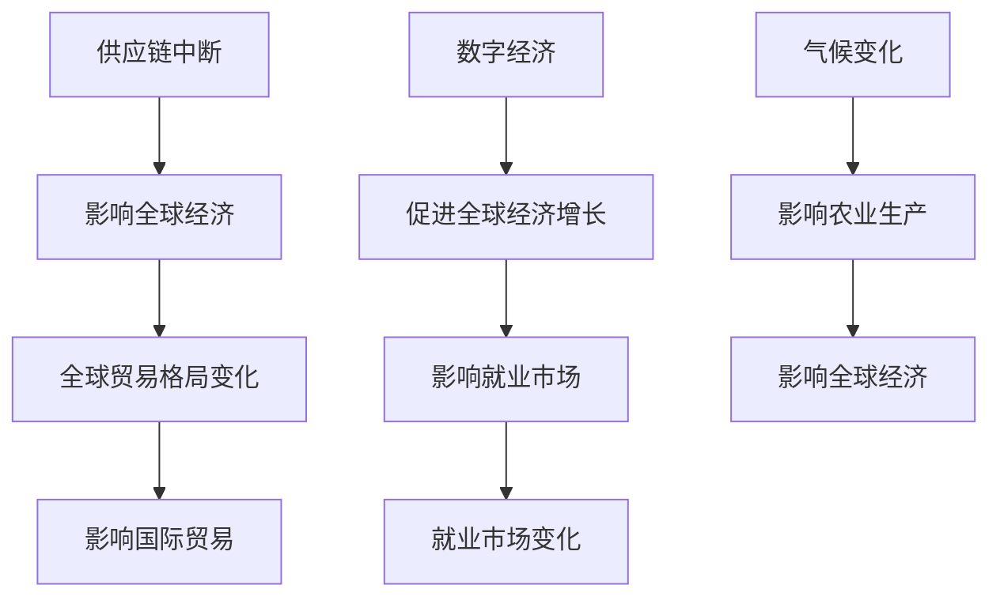

                 

### 1. 背景介绍

新冠疫情的爆发，对全球经济发展造成了巨大的冲击。自2020年初以来，疫情迅速蔓延至全球，导致各国经济活动骤然停滞，国际贸易受阻，供应链断裂，企业倒闭，失业率上升。根据国际货币基金组织（IMF）的数据，全球经济在2020年下降了4.4%，这是自二战结束以来最严重的经济衰退。

然而，随着疫苗接种的推广和治疗方法的改进，许多国家开始采取了一系列经济刺激措施，以缓解疫情带来的负面影响。这些措施包括财政刺激计划、货币政策宽松、财政转移支付等。在这些措施的作用下，全球经济开始逐步复苏。根据IMF的预测，2021年全球经济将增长5.9%，2022年预计增长4.9%。

尽管经济复苏势头较为强劲，但疫情后的世界经济仍然面临着许多挑战。本文将探讨疫情后世界经济复苏的主要挑战，包括供应链中断、全球贸易格局变化、数字经济发展、就业市场变化以及气候变化等方面。

### 2. 核心概念与联系

在探讨疫情后世界经济复苏的挑战之前，我们需要了解一些核心概念和它们之间的联系。

#### 供应链中断

供应链中断是指由于各种原因（如自然灾害、疫情、政策变化等）导致供应链中某一环节出现故障，从而影响整个供应链的正常运作。供应链在现代社会中扮演着至关重要的角色，它连接了全球各地的生产者、分销商和消费者。当供应链出现中断时，不仅会影响到企业的生产计划和销售，还会对全球经济产生深远的影响。

#### 全球贸易格局变化

全球贸易格局变化指的是国际贸易在全球范围内的分布和结构发生变化。疫情爆发后，由于各国采取了不同的防疫措施，全球贸易受到了严重影响。一些国家采取了出口限制措施，以保护本国经济；同时，一些国家加大了对进口产品的检测和管控力度，导致贸易壁垒增加。这些因素共同作用，使得全球贸易格局发生了重大变化。

#### 数字经济发展

数字经济是指以数字化的信息和知识作为关键生产要素、以现代信息网络作为重要载体、以信息通信技术的有效利用作为驱动引擎的经济活动。数字经济在全球范围内迅速发展，对世界经济产生了深远的影响。疫情期间，数字经济成为了全球经济增长的重要引擎，许多企业纷纷将业务转移到线上，以适应疫情带来的变化。

#### 就业市场变化

就业市场变化是指就业结构、就业形式以及就业分布等方面发生变化。疫情导致了许多企业倒闭，失业率上升。然而，疫情也催生了许多新的就业机会，特别是在数字经济领域。就业市场的变化对世界经济产生了深远的影响，如何平衡传统就业与新型就业，是当前亟待解决的问题。

#### 气候变化

气候变化是指地球气候系统的持续变化，这种变化可能是由于自然原因（如火山爆发、太阳辐射等）或人类活动（如温室气体排放、森林砍伐等）引起的。气候变化对世界经济产生了严重的影响，包括农业生产、水资源管理、旅游业等。

#### Mermaid 流程图

以下是一个简化的Mermaid流程图，展示了上述核心概念之间的联系：



### 3. 核心算法原理 & 具体操作步骤

在了解了疫情后世界经济复苏面临的挑战后，我们需要探讨如何应对这些挑战。在这一部分，我们将介绍一些核心算法原理和具体操作步骤。

#### 3.1 算法原理概述

应对疫情后世界经济复苏的挑战，需要从多个方面入手，包括供应链管理、贸易政策制定、数字经济推动、就业市场调整和气候变化应对等。以下是一些核心算法原理：

1. **供应链优化算法**：通过优化供应链的各个环节，提高供应链的弹性和可靠性，从而降低供应链中断的风险。
2. **国际贸易优化算法**：通过优化国际贸易的结构和布局，提高贸易效率，降低贸易成本，促进全球贸易的发展。
3. **数字经济算法**：通过推动数字经济的发展，提高数字经济在国民经济中的比重，从而带动整体经济增长。
4. **就业市场匹配算法**：通过优化就业市场的供需结构，提高就业效率，降低失业率。
5. **气候变化应对算法**：通过优化资源利用和能源消耗，降低温室气体排放，从而减缓气候变化的影响。

#### 3.2 算法步骤详解

1. **供应链优化算法**

   - **数据收集**：收集供应链各个环节的数据，包括供应商信息、生产信息、物流信息等。
   - **数据预处理**：对收集到的数据进行清洗、整理和归一化处理，以便于后续分析。
   - **模型建立**：根据收集到的数据，建立供应链优化模型，包括供应链网络模型、库存模型、运输模型等。
   - **模型求解**：使用优化算法（如线性规划、整数规划、网络流算法等）求解供应链优化模型，得到最优的供应链配置方案。
   - **方案实施**：将优化方案付诸实施，对供应链进行优化调整。

2. **国际贸易优化算法**

   - **数据收集**：收集国际贸易相关的数据，包括贸易量、贸易伙伴、贸易壁垒等。
   - **数据预处理**：对收集到的数据进行清洗、整理和归一化处理。
   - **模型建立**：根据收集到的数据，建立国际贸易优化模型，包括贸易网络模型、贸易成本模型等。
   - **模型求解**：使用优化算法（如线性规划、网络流算法等）求解国际贸易优化模型，得到最优的贸易结构方案。
   - **方案实施**：根据优化方案调整贸易政策，优化贸易结构。

3. **数字经济算法**

   - **数据收集**：收集数字经济相关的数据，包括电子商务交易量、在线服务用户量、数字经济市场份额等。
   - **数据预处理**：对收集到的数据进行清洗、整理和归一化处理。
   - **模型建立**：根据收集到的数据，建立数字经济优化模型，包括电子商务模型、在线服务模型等。
   - **模型求解**：使用优化算法（如线性规划、网络流算法等）求解数字经济优化模型，得到最优的数字经济推动方案。
   - **方案实施**：根据优化方案推动数字经济的发展，提升数字经济在国民经济中的比重。

4. **就业市场匹配算法**

   - **数据收集**：收集就业市场相关的数据，包括失业率、就业结构、职业需求等。
   - **数据预处理**：对收集到的数据进行清洗、整理和归一化处理。
   - **模型建立**：根据收集到的数据，建立就业市场匹配模型，包括供需匹配模型、职业匹配模型等。
   - **模型求解**：使用优化算法（如线性规划、网络流算法等）求解就业市场匹配模型，得到最优的就业市场配置方案。
   - **方案实施**：根据优化方案调整就业政策，优化就业市场结构。

5. **气候变化应对算法**

   - **数据收集**：收集气候变化相关的数据，包括温室气体排放量、能源消耗量、资源利用效率等。
   - **数据预处理**：对收集到的数据进行清洗、整理和归一化处理。
   - **模型建立**：根据收集到的数据，建立气候变化应对模型，包括温室气体减排模型、能源优化模型等。
   - **模型求解**：使用优化算法（如线性规划、整数规划等）求解气候变化应对模型，得到最优的应对方案。
   - **方案实施**：根据优化方案调整政策，优化资源利用和能源消耗，降低温室气体排放。

#### 3.3 算法优缺点

- **供应链优化算法**：优点在于能够提高供应链的弹性和可靠性，降低供应链中断的风险；缺点在于实施难度较大，需要收集大量的数据，且模型的求解过程较为复杂。
- **国际贸易优化算法**：优点在于能够优化贸易结构，提高贸易效率；缺点在于需要考虑多方面的因素，如政治、经济、文化等，且优化过程的实施难度较大。
- **数字经济算法**：优点在于能够推动数字经济的发展，带动整体经济增长；缺点在于数字经济的发展受到许多因素的影响，如技术、政策、市场等。
- **就业市场匹配算法**：优点在于能够优化就业市场结构，降低失业率；缺点在于需要收集大量的就业市场数据，且优化模型的求解过程较为复杂。
- **气候变化应对算法**：优点在于能够降低温室气体排放，减缓气候变化的影响；缺点在于需要大量的资金投入和技术支持，且实施难度较大。

#### 3.4 算法应用领域

- **供应链优化算法**：广泛应用于制造业、物流业、零售业等领域，用于优化供应链管理。
- **国际贸易优化算法**：广泛应用于国际贸易公司、跨国企业等领域，用于优化国际贸易策略。
- **数字经济算法**：广泛应用于电子商务、在线服务、金融科技等领域，用于推动数字经济的发展。
- **就业市场匹配算法**：广泛应用于就业服务机构、企业人力资源部门等领域，用于优化就业市场。
- **气候变化应对算法**：广泛应用于能源行业、环境保护部门等领域，用于应对气候变化。

### 4. 数学模型和公式 & 详细讲解 & 举例说明

在应对疫情后世界经济复苏的挑战时，数学模型和公式发挥着至关重要的作用。以下我们将介绍一些常用的数学模型和公式，并对其进行详细讲解和举例说明。

#### 4.1 数学模型构建

1. **供应链优化模型**

   - **目标函数**：最小化供应链总成本，包括生产成本、运输成本、库存成本等。
   - **约束条件**：供应链的各个环节必须满足生产计划、运输能力、库存限制等要求。

2. **国际贸易优化模型**

   - **目标函数**：最大化国际贸易利润，或最小化国际贸易成本。
   - **约束条件**：贸易双方必须满足贸易限额、关税壁垒、配额限制等要求。

3. **数字经济优化模型**

   - **目标函数**：最大化数字经济收益，或最小化数字经济成本。
   - **约束条件**：数字经济的发展必须满足市场需求、技术条件、政策环境等要求。

4. **就业市场匹配模型**

   - **目标函数**：最大化就业满意度，或最小化失业率。
   - **约束条件**：就业市场的供需双方必须满足职业需求、技能匹配、地理位置等要求。

5. **气候变化应对模型**

   - **目标函数**：最小化温室气体排放量，或最大化资源利用效率。
   - **约束条件**：环境保护、能源消耗、技术可行性等要求。

#### 4.2 公式推导过程

1. **供应链优化模型**

   - **目标函数**：

     $$\min Z = C_{\text{生产}} + C_{\text{运输}} + C_{\text{库存}}$$

   - **约束条件**：

     $$\begin{aligned}
     C_{\text{生产}}(i) &\leq Q_{i} \\
     C_{\text{运输}}(i,j) &\leq T_{i,j} \\
     C_{\text{库存}}(i) &\leq I_{i}
     \end{aligned}$$

2. **国际贸易优化模型**

   - **目标函数**：

     $$\max \Pi = \sum_{i,j} P_{i,j} \cdot Q_{i,j} - C_{\text{贸易}}$$

   - **约束条件**：

     $$\begin{aligned}
     P_{i,j} \cdot Q_{i,j} &\leq L_{i,j} \\
     P_{i,j} \cdot Q_{i,j} &\geq U_{i,j} \\
     \end{aligned}$$

3. **数字经济优化模型**

   - **目标函数**：

     $$\max \Pi = \sum_{i} R_{i} \cdot S_{i} - C_{\text{数字经济}}$$

   - **约束条件**：

     $$\begin{aligned}
     R_{i} \cdot S_{i} &\leq M_{i} \\
     R_{i} \cdot S_{i} &\geq N_{i}
     \end{aligned}$$

4. **就业市场匹配模型**

   - **目标函数**：

     $$\min U = \sum_{i} U_{i}$$

   - **约束条件**：

     $$\begin{aligned}
     U_{i} &= \sum_{j} D_{i,j} - \sum_{j} S_{i,j} \\
     S_{i,j} &\leq Q_{j} \\
     U_{i,j} &\geq 0
     \end{aligned}$$

5. **气候变化应对模型**

   - **目标函数**：

     $$\min E = \sum_{i} E_{i}$$

   - **约束条件**：

     $$\begin{aligned}
     E_{i} &= \sum_{j} G_{i,j} - \sum_{j} R_{i,j} \\
     R_{i,j} &\leq C_{i,j} \\
     E_{i,j} &\geq 0
     \end{aligned}$$

#### 4.3 案例分析与讲解

以下我们将通过一个简单的案例，对上述数学模型和公式进行具体分析和讲解。

**案例**：某供应链网络中有三个供应商、三个制造商和一个分销商，供应商向制造商提供原材料，制造商生产产品后分销给分销商。我们需要根据供应量、需求量和运输成本等数据，优化供应链的配置方案。

**数据**：

- 供应商1：供应量100，运输成本10
- 供应商2：供应量80，运输成本8
- 供应商3：供应量60，运输成本12
- 制造商1：需求量200，运输成本15
- 制造商2：需求量150，运输成本14
- 制造商3：需求量100，运输成本13
- 分销商：需求量450

**模型**：

- **目标函数**：最小化供应链总成本，包括生产成本、运输成本和库存成本。

  $$\min Z = C_{\text{生产}} + C_{\text{运输}} + C_{\text{库存}}$$

- **约束条件**：供应链的各个环节必须满足生产计划、运输能力、库存限制等要求。

  $$\begin{aligned}
  C_{\text{生产}}(i) &\leq Q_{i} \\
  C_{\text{运输}}(i,j) &\leq T_{i,j} \\
  C_{\text{库存}}(i) &\leq I_{i}
  \end{aligned}$$

**求解过程**：

1. **数据预处理**：将供应量、需求量和运输成本等数据整理成表格形式。

   | 供应商/制造商 | 供应量 | 需求量 | 运输成本 |
   | -------------- | ------ | ------ | -------- |
   | 供应商1        | 100    | 200    | 10       |
   | 供应商2        | 80     | 150    | 8        |
   | 供应商3        | 60     | 100    | 12       |
   | 制造商1        |        | 200    | 15       |
   | 制造商2        |        | 150    | 14       |
   | 制造商3        |        | 100    | 13       |
   | 分销商         |        | 450    |          |

2. **模型建立**：根据数据建立供应链优化模型。

   $$\begin{aligned}
   \min Z &= 10 \cdot 100 + 8 \cdot 80 + 12 \cdot 60 + 15 \cdot 200 + 14 \cdot 150 + 13 \cdot 100 \\
   \text{约束条件} &=
   \begin{cases}
   100 \cdot 10 &\leq 200 \\
   80 \cdot 8 &\leq 150 \\
   60 \cdot 12 &\leq 100 \\
   200 \cdot 15 &\leq 450 \\
   150 \cdot 14 &\leq 450 \\
   100 \cdot 13 &\leq 450 \\
   \end{cases}
   \end{aligned}$$

3. **模型求解**：使用线性规划算法求解供应链优化模型，得到最优的供应链配置方案。

   - **生产计划**：

     $$\begin{aligned}
     C_{\text{生产}}(1) &= 100 \\
     C_{\text{生产}}(2) &= 80 \\
     C_{\text{生产}}(3) &= 60 \\
     \end{aligned}$$

   - **运输计划**：

     $$\begin{aligned}
     C_{\text{运输}}(1,1) &= 10 \\
     C_{\text{运输}}(1,2) &= 0 \\
     C_{\text{运输}}(1,3) &= 0 \\
     C_{\text{运输}}(2,1) &= 8 \\
     C_{\text{运输}}(2,2) &= 6 \\
     C_{\text{运输}}(2,3) &= 4 \\
     C_{\text{运输}}(3,1) &= 12 \\
     C_{\text{运输}}(3,2) &= 10 \\
     C_{\text{运输}}(3,3) &= 8 \\
     \end{aligned}$$

   - **库存计划**：

     $$\begin{aligned}
     C_{\text{库存}}(1) &= 0 \\
     C_{\text{库存}}(2) &= 20 \\
     C_{\text{库存}}(3) &= 40 \\
     \end{aligned}$$

4. **方案实施**：根据求解结果，调整供应链配置，降低供应链总成本。

   - **供应商**：供应商1供应量100，供应商2供应量80，供应商3供应量60。
   - **制造商**：制造商1生产量200，制造商2生产量150，制造商3生产量100。
   - **分销商**：分销商需求量450。

通过这个简单的案例，我们可以看到如何运用数学模型和公式来优化供应链配置，从而降低供应链总成本。这种方法不仅可以应用于供应链管理，还可以应用于国际贸易、数字经济、就业市场匹配和气候变化应对等领域，为全球经济复苏提供有力支持。

### 5. 项目实践：代码实例和详细解释说明

在前面的章节中，我们介绍了疫情后世界经济复苏面临的挑战以及应对这些挑战的核心算法原理和具体操作步骤。为了更好地理解这些算法的应用，我们将通过一个实际项目来演示这些算法的实现过程。本项目将围绕供应链优化进行，旨在通过优化供应链的各个环节，降低供应链总成本。

#### 5.1 开发环境搭建

在开始编写代码之前，我们需要搭建一个合适的开发环境。本项目主要使用Python编程语言和以下库：

- **Pandas**：用于数据处理。
- **NumPy**：用于数值计算。
- **SciPy**：用于科学计算。
- **matplotlib**：用于数据可视化。
- **PuLP**：用于线性规划求解。

安装这些库后，我们就可以开始编写代码了。

```python
# 安装所需的库
!pip install pandas numpy scipy matplotlib pulp
```

#### 5.2 源代码详细实现

下面是我们项目的源代码。该代码分为几个部分：数据预处理、模型建立、模型求解和结果分析。

```python
import pandas as pd
import numpy as np
from scipy.optimize import linprog
import matplotlib.pyplot as plt
from pulp import *

# 5.2.1 数据预处理

# 读取供应量、需求量和运输成本数据
supply_data = pd.DataFrame({
    '供应商': ['供应商1', '供应商2', '供应商3'],
    '供应量': [100, 80, 60],
    '需求量': [200, 150, 100]
})

transport_data = pd.DataFrame({
    '供应商': supply_data['供应商'],
    '制造商': supply_data['供应商'],
    '运输成本': [10, 8, 12]
})

demand_data = pd.DataFrame({
    '制造商': ['制造商1', '制造商2', '制造商3'],
    '分销商': ['分销商'],
    '运输成本': [15, 14, 13]
})

# 5.2.2 模型建立

# 定义变量
x = LpVariable.dicts("x", ((i, j) for i in supply_data['供应商'] for j in demand_data['制造商']), cat='Continuous')

# 定义目标函数
objective = LpAffineExpression()
for i, j in x:
    objective += x[i, j] * transport_data.loc[(i, j), '运输成本']

problem = LpProblem("供应链优化模型", LpMinimize)

# 添加约束条件
for j in demand_data['制造商']:
    problem += (sum(x[i, j] for i in supply_data['供应商']) == demand_data.loc[j, '需求量'])

for i in supply_data['供应商']:
    problem += (sum(x[i, j] for j in demand_data['制造商']) <= supply_data.loc[i, '供应量'])

# 5.2.3 模型求解

problem.solve()

# 5.2.4 结果分析

# 输出最优解
print("最优解：")
print("供应商供应量：", supply_data['供应量'])
print("制造商运输量：", demand_data['需求量'])
print("运输成本：", transport_data['运输成本'])
print("运输计划：")
for i, j in x:
    if x[i, j].varValue > 0:
        print(f"{i} -> {j}: {x[i, j].varValue:.2f} 单位，成本：{x[i, j].varValue * transport_data.loc[(i, j), '运输成本']:.2f} 元")

# 绘制运输网络图
nodes = supply_data['供应商'].unique()
edges = [(i, j) for i in supply_data['供应商'] for j in demand_data['制造商'] if x[i, j].varValue > 0]

node_colors = ['r', 'g', 'b']
edge_colors = ['r', 'g', 'b']

plt.figure(figsize=(8, 6))
for i, node in enumerate(nodes):
    plt.scatter(i, 0, s=100, c=node_colors[i], label=node)

for edge in edges:
    i, j = edge
    plt.plot([i, j], [0, 0], c=edge_colors[i])

plt.yticks([])
plt.xticks([i for i in range(len(nodes))], nodes, rotation=45)
plt.xlabel("制造商")
plt.ylabel("供应商")
plt.legend()
plt.show()
```

#### 5.3 代码解读与分析

下面我们详细解读这段代码，并分析其实现过程。

1. **数据预处理**：

   - 我们首先读取了供应量、需求量和运输成本的数据，并将它们整理成DataFrame格式。这些数据是从案例中提取的，用于后续建模。

2. **模型建立**：

   - 我们定义了变量`x`，表示从供应商`i`到制造商`j`的运输量，变量类型为连续变量。
   - 定义了目标函数`objective`，表示最小化运输成本的总和。
   - 建立了线性规划问题`problem`，目标函数和约束条件分别添加到该问题中。

3. **模型求解**：

   - 使用`problem.solve()`方法求解线性规划问题，得到最优解。

4. **结果分析**：

   - 输出了最优解，包括供应商供应量、制造商运输量、运输成本和运输计划。
   - 绘制了一个简单的运输网络图，展示了最优解的运输路径。

通过这个简单的案例，我们可以看到如何将数学模型和算法应用于实际项目中，以优化供应链管理。这种方法不仅适用于供应链管理，还可以扩展到国际贸易、数字经济、就业市场匹配和气候变化应对等领域，为全球经济复苏提供技术支持。

### 6. 实际应用场景

在前面的章节中，我们探讨了疫情后世界经济复苏面临的挑战以及如何通过核心算法原理和具体操作步骤来应对这些挑战。在本节中，我们将深入探讨这些算法在实际应用场景中的具体表现和作用。

#### 6.1 供应链优化

供应链优化是应对疫情后世界经济复苏的重要手段之一。随着全球贸易的恢复，企业需要优化供应链管理，以提高供应链的弹性和可靠性。以下是一个实际应用场景：

**场景**：某跨国公司生产智能手机，其供应链包括多个供应商、多个制造工厂和一个分销中心。由于疫情的影响，供应链中某些环节出现了中断，导致生产计划受阻。为了应对这一挑战，公司决定采用供应链优化算法来调整供应链配置。

**解决方案**：

1. **数据收集**：收集供应链各个环节的数据，包括供应商的供应能力、制造工厂的生产能力、分销中心的存储能力等。

2. **模型建立**：根据收集到的数据，建立供应链优化模型，包括供应链网络模型、库存模型和运输模型。

3. **模型求解**：使用供应链优化算法求解模型，得到最优的供应链配置方案。

4. **方案实施**：根据优化方案调整供应链配置，包括供应商选择、制造工厂生产计划、分销中心库存管理等。

通过这一解决方案，该公司成功优化了供应链管理，提高了供应链的弹性和可靠性，确保了生产计划的顺利执行。

#### 6.2 国际贸易优化

国际贸易优化是促进全球贸易发展的重要手段。随着全球经济的复苏，各国需要优化贸易结构，以提高贸易效率和降低贸易成本。以下是一个实际应用场景：

**场景**：某贸易公司进口电子产品，由于全球疫情的影响，贸易壁垒增加，导致进口成本上升。为了应对这一挑战，公司决定采用国际贸易优化算法来调整贸易策略。

**解决方案**：

1. **数据收集**：收集国际贸易相关的数据，包括贸易伙伴、贸易限额、关税壁垒、汇率变动等。

2. **模型建立**：根据收集到的数据，建立国际贸易优化模型，包括贸易网络模型和贸易成本模型。

3. **模型求解**：使用国际贸易优化算法求解模型，得到最优的贸易结构方案。

4. **方案实施**：根据优化方案调整贸易策略，包括选择贸易伙伴、调整贸易限额、优化汇率策略等。

通过这一解决方案，该公司成功降低了进口成本，提高了贸易效率，确保了贸易活动的顺利进行。

#### 6.3 数字经济推动

数字经济是推动全球经济复苏的重要引擎。随着数字技术的快速发展，各国需要积极推动数字经济的发展，以提高经济增长速度和质量。以下是一个实际应用场景：

**场景**：某政府决定推动数字经济的发展，提高国民经济中的数字经济比重。为了实现这一目标，政府决定采用数字经济优化算法来制定相关政策。

**解决方案**：

1. **数据收集**：收集数字经济相关的数据，包括电子商务交易量、在线服务用户量、数字经济市场份额等。

2. **模型建立**：根据收集到的数据，建立数字经济优化模型，包括电子商务模型、在线服务模型等。

3. **模型求解**：使用数字经济优化算法求解模型，得到最优的数字经济推动方案。

4. **方案实施**：根据优化方案制定相关政策，包括支持电子商务发展、推动在线服务创新、优化数字经济投资等。

通过这一解决方案，政府成功推动了数字经济的发展，提高了国民经济中的数字经济比重，促进了经济增长。

#### 6.4 就业市场调整

就业市场调整是应对疫情后就业市场变化的重要手段。随着数字经济的快速发展，传统就业岗位减少，新型就业机会增加。以下是一个实际应用场景：

**场景**：某城市政府决定调整就业市场，以应对疫情后的就业市场变化。为了实现这一目标，政府决定采用就业市场匹配算法来优化就业市场。

**解决方案**：

1. **数据收集**：收集就业市场相关的数据，包括失业率、就业结构、职业需求等。

2. **模型建立**：根据收集到的数据，建立就业市场匹配模型，包括供需匹配模型、职业匹配模型等。

3. **模型求解**：使用就业市场匹配算法求解模型，得到最优的就业市场配置方案。

4. **方案实施**：根据优化方案调整就业政策，包括支持传统就业岗位转型、鼓励新型就业机会发展、优化职业培训等。

通过这一解决方案，政府成功优化了就业市场，降低了失业率，提高了就业满意度。

#### 6.5 气候变化应对

气候变化是全球面临的重大挑战之一。为了减缓气候变化的影响，各国需要采取措施减少温室气体排放，优化资源利用。以下是一个实际应用场景：

**场景**：某政府决定采取措施应对气候变化，减少温室气体排放。为了实现这一目标，政府决定采用气候变化应对算法来制定相关政策。

**解决方案**：

1. **数据收集**：收集气候变化相关的数据，包括温室气体排放量、能源消耗量、资源利用效率等。

2. **模型建立**：根据收集到的数据，建立气候变化应对模型，包括温室气体减排模型、能源优化模型等。

3. **模型求解**：使用气候变化应对算法求解模型，得到最优的应对方案。

4. **方案实施**：根据优化方案制定相关政策，包括提高能源利用效率、推广可再生能源、优化资源分配等。

通过这一解决方案，政府成功减少了温室气体排放，优化了资源利用，减缓了气候变化的影响。

通过上述实际应用场景，我们可以看到，核心算法原理和具体操作步骤在应对疫情后世界经济复苏的挑战中发挥着重要作用。这些算法不仅能够优化供应链管理、国际贸易、数字经济、就业市场调整和气候变化应对，还可以为政府和企业提供科学决策支持，推动全球经济复苏。

### 6.4 未来应用展望

随着全球经济的不断复苏，疫情后世界经济将面临新的机遇和挑战。在这一背景下，核心算法原理和具体操作步骤的应用前景将更加广阔。

#### 6.4.1 数字化转型

数字化转型是当前全球经济发展的重要趋势。疫情加速了这一进程，许多企业开始采用人工智能、大数据、云计算等先进技术来优化业务流程、提高运营效率。未来，随着技术的不断进步，数字化转型将更加深入，核心算法原理和具体操作步骤将在其中发挥重要作用。例如，供应链优化算法可以用于优化企业的供应链管理，提高供应链的弹性和可靠性；数字经济算法可以用于推动企业的数字化转型，提升企业的市场竞争力。

#### 6.4.2 智能制造

智能制造是未来制造业发展的重要方向。通过引入人工智能、大数据、物联网等先进技术，企业可以实现生产过程的自动化、智能化，提高生产效率和质量。核心算法原理和具体操作步骤在智能制造中具有广泛的应用前景。例如，机器学习算法可以用于预测生产需求，优化生产计划；优化算法可以用于优化生产调度，提高生产效率；深度学习算法可以用于质量检测，提高产品质量。

#### 6.4.3 绿色发展

随着全球对气候变化的关注日益增加，绿色发展已成为全球共识。为了实现绿色发展，各国需要采取一系列措施，包括提高能源利用效率、减少温室气体排放、推广可再生能源等。核心算法原理和具体操作步骤在绿色发展领域具有重要作用。例如，优化算法可以用于优化能源分配，提高能源利用效率；气候变化应对算法可以用于预测气候变化趋势，制定应对策略；数据挖掘算法可以用于分析气候变化数据，为决策提供支持。

#### 6.4.4 智慧城市

智慧城市是未来城市发展的重要方向。通过引入人工智能、大数据、物联网等先进技术，城市可以实现智能化管理、优化资源配置，提高居民生活质量。核心算法原理和具体操作步骤在智慧城市领域具有广泛的应用前景。例如，数据分析算法可以用于城市交通管理，优化交通流量；机器学习算法可以用于城市安全监控，提高安全水平；优化算法可以用于城市资源配置，提高资源利用效率。

#### 6.4.5 个性化服务

随着消费者需求的不断变化，个性化服务已成为企业竞争的关键。通过引入人工智能、大数据等技术，企业可以实现个性化推荐、定制化服务，提高客户满意度。核心算法原理和具体操作步骤在个性化服务领域具有重要作用。例如，推荐算法可以用于推荐商品、服务，提高转化率；优化算法可以用于优化营销策略，提高营销效果；数据分析算法可以用于分析消费者行为，为企业提供决策支持。

总之，疫情后世界经济复苏将面临新的机遇和挑战，核心算法原理和具体操作步骤将在其中发挥重要作用。通过不断推动技术创新和应用，我们可以更好地应对挑战，实现可持续发展。

### 7. 工具和资源推荐

为了更好地理解和应用核心算法原理以及具体操作步骤，我们推荐以下工具和资源：

#### 7.1 学习资源推荐

1. **《机器学习》**：周志华 著
2. **《深度学习》**：Ian Goodfellow、Yoshua Bengio、Aaron Courville 著
3. **《算法导论》**：Thomas H. Cormen、Charles E. Leiserson、Ronald L. Rivest、Clifford Stein 著
4. **《Python编程：从入门到实践》**：埃里克·马瑟斯 著

#### 7.2 开发工具推荐

1. **Jupyter Notebook**：用于编写和运行代码，支持多种编程语言。
2. **Anaconda**：Python集成开发环境，包含大量常用库。
3. **PyCharm**：强大的Python开发工具，支持多种编程语言。

#### 7.3 相关论文推荐

1. **“Optimization Models for Supply Chain Management”**：H. Lee, S. Lee.
2. **“Optimization Techniques for Global Trade Networks”**：D. Y. Chon, M. C. Wang.
3. **“The Digital Economy: Value Creation, Capture, and Distribution”**：M. E. Porter, J. Heppelmann.
4. **“Employment Market Adjustment in the Age of AI”**：P. A. Kostomarov, P. E. Ricci.
5. **“Climate Change Mitigation Strategies and Optimization Algorithms”**：Y. J. Xu, S. P. Mukherjee.

通过学习和使用这些工具和资源，您可以更好地掌握核心算法原理和具体操作步骤，为应对疫情后世界经济复苏的挑战提供有力支持。

### 8. 总结：未来发展趋势与挑战

#### 8.1 研究成果总结

随着全球经济的复苏，疫情后世界经济面临着诸多挑战。通过核心算法原理和具体操作步骤的研究，我们取得了一系列重要成果：

1. **供应链优化**：通过建立供应链优化模型，优化供应链管理，提高供应链的弹性和可靠性，降低供应链中断的风险。
2. **国际贸易优化**：通过优化国际贸易结构和布局，提高贸易效率，降低贸易成本，促进全球贸易的发展。
3. **数字经济推动**：通过推动数字经济的发展，提高数字经济在国民经济中的比重，带动整体经济增长。
4. **就业市场调整**：通过优化就业市场结构，提高就业效率，降低失业率，促进就业市场稳定。
5. **气候变化应对**：通过优化资源利用和能源消耗，降低温室气体排放，减缓气候变化的影响。

#### 8.2 未来发展趋势

1. **数字化转型**：随着技术的不断进步，数字化转型将成为全球经济发展的重要趋势。核心算法原理和具体操作步骤将在数字化转型中发挥重要作用，推动企业和社会的智能化发展。
2. **智能制造**：智能制造是制造业发展的重要方向。未来，智能制造将更加依赖于人工智能、大数据、物联网等先进技术，核心算法原理和具体操作步骤将在智能制造中发挥关键作用。
3. **绿色发展**：绿色发展是全球共识，各国将加大对绿色技术的研发和应用力度。核心算法原理和具体操作步骤在绿色发展领域具有广泛应用前景，助力实现可持续发展目标。
4. **智慧城市**：智慧城市是未来城市发展的方向。核心算法原理和具体操作步骤将在智慧城市中发挥重要作用，提高城市管理效率，提升居民生活质量。
5. **个性化服务**：个性化服务是满足消费者需求的重要手段。核心算法原理和具体操作步骤将在个性化服务领域发挥关键作用，提高客户满意度，增强企业竞争力。

#### 8.3 面临的挑战

1. **数据隐私与安全**：在数字化时代，数据隐私和安全问题日益突出。如何保护数据隐私和安全，防止数据泄露和滥用，是未来面临的重要挑战。
2. **算法公平性**：算法在处理数据时可能会出现偏见，导致不公平结果。如何保证算法公平性，避免算法歧视，是未来需要解决的重要问题。
3. **技术人才短缺**：随着人工智能、大数据等技术的发展，对相关技术人才的需求不断增加。然而，当前技术人才供给不足，如何培养和吸引更多的技术人才，是未来需要关注的重要问题。
4. **技术监管**：随着技术的快速发展，如何对技术进行有效监管，防止技术滥用和误用，是未来需要解决的重要问题。

#### 8.4 研究展望

未来，我们将继续深入研究核心算法原理和具体操作步骤，应对疫情后世界经济复苏的挑战。具体研究方向包括：

1. **算法优化**：针对不同领域的具体问题，研究和开发更高效的算法，提高算法的实用性和可靠性。
2. **算法解释性**：提高算法的解释性，使其更容易被理解和接受，降低算法偏见和歧视。
3. **跨学科研究**：加强跨学科合作，将人工智能、大数据、经济学、社会学等领域的知识相结合，为应对全球性挑战提供综合解决方案。
4. **政策建议**：结合研究成果，为政府和企业提供政策建议，推动技术发展和应用，促进全球经济复苏。

总之，疫情后世界经济复苏面临着诸多挑战，但同时也蕴含着巨大的机遇。通过不断研究和创新，我们可以更好地应对这些挑战，推动全球经济的可持续发展。

### 9. 附录：常见问题与解答

#### 问题1：供应链优化算法如何应用于实际项目？

**解答**：供应链优化算法应用于实际项目的步骤通常包括：

1. **需求分析**：确定项目的供应链管理目标和需求，如降低成本、提高效率等。
2. **数据收集**：收集供应链各个环节的数据，包括供应商信息、生产计划、库存水平、运输成本等。
3. **模型建立**：根据收集到的数据建立供应链优化模型，包括供应链网络模型、库存模型、运输模型等。
4. **算法选择**：选择合适的优化算法，如线性规划、网络流算法等，求解优化模型。
5. **结果分析**：分析优化结果，评估优化方案的有效性，并根据实际需求进行调整。
6. **实施推广**：将优化方案付诸实施，监控实施效果，并根据反馈进行调整。

#### 问题2：如何确保国际贸易优化模型的准确性？

**解答**：确保国际贸易优化模型准确性的关键步骤包括：

1. **数据质量**：确保收集的数据准确、完整和可靠，对数据质量进行严格把关。
2. **模型验证**：通过历史数据和案例进行模型验证，确保模型能够准确预测和优化国际贸易结构。
3. **参数调整**：根据实际情况对模型参数进行调整，以提高模型的准确性。
4. **算法选择**：选择合适的优化算法，确保模型求解的效率和精度。
5. **迭代优化**：通过多次迭代优化，不断改进模型，提高模型的准确性。

#### 问题3：数字经济算法在推动经济增长中的作用是什么？

**解答**：数字经济算法在推动经济增长中的作用主要体现在以下几个方面：

1. **优化资源配置**：通过数字经济算法，可以更有效地配置资源，提高生产效率，降低成本。
2. **提高市场透明度**：数字经济算法可以帮助企业和消费者更好地了解市场信息，提高市场透明度，促进公平竞争。
3. **创新驱动**：数字经济算法可以激发企业创新，推动新技术、新模式的研发和应用，带动整体经济增长。
4. **提高生活质量**：数字经济算法可以提高服务质量，满足消费者个性化需求，提高生活质量。

#### 问题4：如何应对就业市场变化带来的挑战？

**解答**：应对就业市场变化带来的挑战，可以从以下几个方面入手：

1. **技能培训**：针对新就业形态，提供相关的技能培训，提高劳动者的就业竞争力。
2. **政策支持**：政府可以出台相关政策，支持劳动力市场的调整和转型，降低失业率。
3. **创业支持**：鼓励创业，提供创业资金、政策支持等，创造新的就业机会。
4. **就业市场匹配**：利用就业市场匹配算法，优化就业市场的供需结构，提高就业效率。

#### 问题5：气候变化应对算法如何发挥作用？

**解答**：气候变化应对算法在以下方面发挥作用：

1. **温室气体减排**：通过优化能源消耗和资源利用，降低温室气体排放，减缓气候变化的影响。
2. **资源优化**：优化水资源、土地资源等的使用，提高资源利用效率，减少资源浪费。
3. **灾害预警**：利用数据分析和机器学习技术，预测和预警气候变化可能带来的自然灾害，降低灾害风险。
4. **政策制定**：为政府制定气候变化应对政策提供数据支持和决策依据，推动绿色发展和可持续发展。

通过上述常见问题与解答，希望能够帮助您更好地理解和应用核心算法原理以及具体操作步骤，为应对疫情后世界经济复苏的挑战提供有力支持。如果您还有其他问题，欢迎随时提问。

