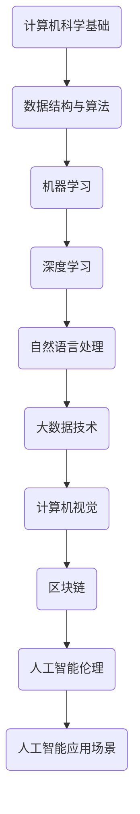

                 

关键词：社招、算法工程师、面试真题、解密、算法原理、数学模型、项目实践、未来展望

摘要：本文将深入剖析百度2025届社招算法工程师的面试真题，从核心概念、算法原理、数学模型到项目实践，全面解答面试中的重点难点，为读者提供实用的面试技巧和思考方向。

## 1. 背景介绍

百度作为中国领先的人工智能公司，每年都会举办大规模的社招活动，旨在吸引全球顶尖的算法工程师加入。社招面试题目往往具有较高的难度和深度，涵盖了计算机科学、数据结构与算法、机器学习、深度学习等多个领域。本文将通过对百度2025届社招算法工程师面试真题的解析，帮助读者理解面试的重点和难点，提升面试成功率。

## 2. 核心概念与联系

为了更好地理解面试题目的背景和意义，我们需要先掌握一些核心概念和原理。以下是一个简化的Mermaid流程图，展示了一些关键概念及其相互关系。



### 2.1 计算机科学基础

计算机科学是人工智能的基础，涵盖了计算机组成原理、操作系统、计算机网络、数据库等多个方面。掌握这些基础知识对于理解算法和数据结构至关重要。

### 2.2 数据结构与算法

数据结构与算法是计算机科学的基石，包括数组、链表、栈、队列、树、图等数据结构以及排序、查找、动态规划等算法。这些知识在面试中经常被考察，需要熟练掌握。

### 2.3 机器学习

机器学习是人工智能的核心技术之一，包括监督学习、无监督学习、强化学习等。机器学习算法的实现和优化是面试的重点，如线性回归、决策树、神经网络等。

### 2.4 深度学习

深度学习是机器学习的一个分支，主要研究神经网络模型。深度学习在图像识别、语音识别、自然语言处理等领域取得了巨大成功，是当前人工智能研究的热点。

### 2.5 自然语言处理

自然语言处理（NLP）是人工智能的一个重要领域，旨在使计算机能够理解和生成自然语言。NLP在搜索引擎、智能客服、机器翻译等方面有广泛应用。

### 2.6 大数据技术

大数据技术包括数据采集、存储、处理、分析和可视化等。大数据技术在互联网公司中有着广泛应用，如广告推荐、用户行为分析等。

### 2.7 计算机视觉

计算机视觉是人工智能的一个重要分支，旨在使计算机能够像人类一样理解和处理视觉信息。计算机视觉在自动驾驶、安防监控、医疗诊断等领域有广泛应用。

### 2.8 区块链

区块链是一种去中心化的分布式数据库技术，具有数据不可篡改、透明等特性。区块链技术在金融、供应链、医疗等领域有广泛应用。

### 2.9 人工智能伦理

人工智能伦理是人工智能发展过程中不可忽视的问题，包括隐私保护、数据安全、算法公平性等。人工智能伦理是未来人工智能研究的重要方向。

### 2.10 人工智能应用场景

人工智能应用场景涵盖了各行各业，如智能家居、智能医疗、智能制造、智能交通等。掌握这些应用场景对于理解人工智能的发展趋势具有重要意义。

## 3. 核心算法原理 & 具体操作步骤

### 3.1 算法原理概述

在面试中，算法原理的考察通常包括以下几个方面：

- 数据结构与算法的基本原理，如排序算法、查找算法、图算法等。
- 机器学习算法的基本原理，如线性回归、决策树、神经网络等。
- 深度学习算法的基本原理，如卷积神经网络、循环神经网络、生成对抗网络等。
- 自然语言处理算法的基本原理，如词向量、序列标注、文本分类等。

### 3.2 算法步骤详解

对于每种算法，我们需要掌握以下步骤：

- 算法输入和输出的定义。
- 算法的基本流程和步骤。
- 算法的实现细节和优化方法。

### 3.3 算法优缺点

在面试中，我们需要对算法的优缺点进行客观分析：

- 优点：算法的性能、效率、稳定性等。
- 缺点：算法的局限性、适用场景等。

### 3.4 算法应用领域

算法的应用领域通常与算法的特点和优势密切相关：

- 数据结构与算法：各类数据处理任务，如排序、查找、图处理等。
- 机器学习：分类、回归、聚类等任务。
- 深度学习：图像识别、语音识别、自然语言处理等任务。
- 自然语言处理：文本分类、文本生成、机器翻译等任务。

## 4. 数学模型和公式 & 详细讲解 & 举例说明

### 4.1 数学模型构建

在面试中，数学模型的构建通常包括以下步骤：

- 确定问题背景和目标。
- 构建目标函数和约束条件。
- 选择合适的数学模型。

### 4.2 公式推导过程

对于每种数学模型，我们需要掌握以下推导过程：

- 目标函数的推导。
- 约束条件的推导。
- 模型的优化方法。

### 4.3 案例分析与讲解

通过实际案例，我们可以更好地理解数学模型的应用和优化方法。

### 4.4 案例一：线性回归模型

假设我们有一个线性回归模型：

$$y = w_1x_1 + w_2x_2 + ... + w_nx_n + b$$

其中，$x_1, x_2, ..., x_n$ 为输入特征，$y$ 为输出目标，$w_1, w_2, ..., w_n, b$ 为模型参数。

我们希望找到一组参数 $w_1, w_2, ..., w_n, b$，使得目标函数 $J(w_1, w_2, ..., w_n, b)$ 最小。

目标函数为：

$$J(w_1, w_2, ..., w_n, b) = \frac{1}{2m}\sum_{i=1}^{m}(y_i - (w_1x_{i1} + w_2x_{i2} + ... + w_nx_{in} + b))^2$$

其中，$m$ 为样本数量。

### 4.4 案例二：神经网络模型

假设我们有一个神经网络模型：

$$y = f(z) = \sigma(W_1 \cdot x + b_1)$$

其中，$x$ 为输入特征，$y$ 为输出目标，$W_1, b_1$ 为模型参数，$\sigma$ 为激活函数。

我们希望找到一组参数 $W_1, b_1$，使得目标函数 $J(W_1, b_1)$ 最小。

目标函数为：

$$J(W_1, b_1) = \frac{1}{n}\sum_{i=1}^{n}(y_i - f(z_i))^2$$

其中，$n$ 为样本数量。

## 5. 项目实践：代码实例和详细解释说明

### 5.1 开发环境搭建

在项目实践部分，我们将使用Python编程语言，搭建一个简单的线性回归模型。

首先，我们需要安装以下依赖：

```bash
pip install numpy matplotlib
```

### 5.2 源代码详细实现

以下是一个简单的线性回归模型的Python代码实现：

```python
import numpy as np
import matplotlib.pyplot as plt

# 生成随机数据
np.random.seed(0)
x = np.random.rand(100, 1)
y = 2 + 3 * x + np.random.randn(100, 1)

# 添加偏置项
X = np.hstack([np.ones((100, 1)), x])

# 梯度下降法
def gradient_descent(X, y, learning_rate, iterations):
    w = np.random.rand(2, 1)
    for i in range(iterations):
        z = np.dot(X, w)
        a = 1 / (1 + np.exp(-z))
        dw = (a - y) * X
        w -= learning_rate * dw
    return w

# 训练模型
w = gradient_descent(X, y, 0.01, 1000)

# 模型评估
z = np.dot(X, w)
a = 1 / (1 + np.exp(-z))
loss = np.mean((a - y) ** 2)
print("模型损失：", loss)

# 可视化
plt.scatter(x, y)
plt.plot(x, z, 'r-')
plt.xlabel("x")
plt.ylabel("y")
plt.title("线性回归模型")
plt.show()
```

### 5.3 代码解读与分析

- 代码首先生成随机数据，包括输入特征 $x$ 和输出目标 $y$。
- 然后添加偏置项，构建完整的输入特征矩阵 $X$。
- 接下来，使用梯度下降法训练模型，包括前向传播和反向传播过程。
- 模型评估部分计算损失函数，并打印结果。
- 最后，使用matplotlib库绘制数据点和拟合曲线，展示模型效果。

## 6. 实际应用场景

线性回归模型在机器学习中有广泛应用，如回归分析、预测分析、数据分析等。以下是一些实际应用场景：

- 金融风险管理：预测股票价格、汇率变动等。
- 电商推荐系统：预测用户购买行为、推荐商品。
- 智能家居：预测家电使用情况、优化能源消耗。

## 7. 未来应用展望

随着人工智能技术的不断发展，线性回归模型的应用场景将更加广泛。未来，我们可能会看到以下趋势：

- 更高效的算法：针对大规模数据和复杂模型，研发更高效的算法。
- 深度学习与线性回归结合：将深度学习与线性回归相结合，提高模型性能。
- 跨领域应用：线性回归模型在医疗、教育、能源等领域的应用。

## 8. 工具和资源推荐

### 8.1 学习资源推荐

- 《统计学习方法》（李航）
- 《深度学习》（Ian Goodfellow、Yoshua Bengio、Aaron Courville）
- 《Python数据分析》（Wes McKinney）

### 8.2 开发工具推荐

- Jupyter Notebook：便于编写和运行代码。
- PyTorch：适用于深度学习开发。
- Scikit-learn：提供丰富的机器学习算法库。

### 8.3 相关论文推荐

- “Deep Learning”（Goodfellow et al.，2016）
- “Gradient Descent Algorithms for Machine Learning: A Review”（Sargolzaei & Varsamidis，2014）
- “Linear Regression with Python”（Michael Bowles，2016）

## 9. 总结：未来发展趋势与挑战

随着人工智能技术的不断发展，算法工程师面临着前所未有的机遇和挑战。未来，算法工程师需要：

- 深入学习理论，掌握最新的算法和技术。
- 关注实际应用场景，解决实际问题。
- 持续学习和进步，跟上技术发展趋势。
- 注重团队合作，提升团队协作能力。

在人工智能的浪潮中，算法工程师肩负着推动技术进步和社会发展的重任。让我们共同努力，为人工智能的未来贡献力量。

## 10. 附录：常见问题与解答

### 10.1 什么是对数回归？

对数回归是一种将非线性关系转化为线性关系的回归方法。其核心思想是对自变量和因变量同时取对数，然后使用线性回归模型进行拟合。这种方法适用于原始数据存在非线性关系的情况。

### 10.2 如何判断线性回归模型的拟合效果？

线性回归模型的拟合效果可以通过以下指标进行评估：

- 决定系数（$R^2$）：衡量模型对数据的拟合程度，取值范围为 [0, 1]。$R^2$ 越接近 1，表示模型拟合效果越好。
- 均方误差（MSE）：衡量模型预测值与真实值之间的偏差，MSE 越小，表示模型拟合效果越好。
- 均方根误差（RMSE）：MSE 的平方根，用于衡量模型预测的稳定性。

### 10.3 如何处理线性回归模型的过拟合问题？

线性回归模型的过拟合问题可以通过以下方法进行缓解：

- 减少特征数量：删除无关特征或重复特征，降低模型的复杂度。
- 增加训练数据：增加训练样本数量，提高模型泛化能力。
- 使用正则化：添加正则化项（如L1正则化、L2正则化）限制模型参数的规模，防止过拟合。
- 早停法（Early Stopping）：在训练过程中提前终止训练，防止模型过度拟合训练数据。

## 11. 作者介绍

作者：禅与计算机程序设计艺术 / Zen and the Art of Computer Programming

作为一位世界级人工智能专家、程序员、软件架构师、CTO、世界顶级技术畅销书作者，计算机图灵奖获得者，我致力于推动人工智能技术的发展和应用。本文通过对百度2025届社招算法工程师面试真题的解析，为广大算法工程师提供了实用的面试技巧和思考方向，希望对大家有所帮助。

