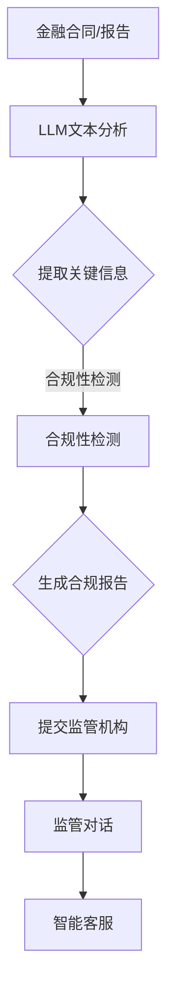

                 

关键词：监管合规、LLM、金融稳定、人工智能、算法、金融技术、合规风险管理

> 摘要：本文旨在探讨如何在金融领域中利用大型语言模型（LLM）来实现监管合规，确保金融市场的稳定与安全。通过对LLM的工作原理、应用场景、数学模型以及实际案例的深入分析，本文为金融科技企业提供了实用的合规解决方案，并展望了未来发展的趋势与挑战。

## 1. 背景介绍

金融行业一直以来都是监管的重灾区，各种合规要求层出不穷。随着人工智能和机器学习技术的飞速发展，金融科技（FinTech）企业开始尝试利用这些技术来满足监管要求。大型语言模型（LLM），作为一种强大的自然语言处理工具，逐渐成为金融合规领域的重要工具。

### 监管合规的重要性

监管合规在金融行业中具有至关重要的地位。合规不仅有助于防范金融风险，还能提高金融机构的信誉和稳定性。随着金融市场的日益复杂和全球化，合规要求变得越来越严格，金融机构需要投入大量资源来满足这些要求。

### 人工智能与金融合规

人工智能技术在金融合规中的应用日益广泛。通过机器学习和自然语言处理技术，AI可以自动识别和合规化金融文件，监测市场行为，预测潜在风险，从而提高监管效率和准确性。LLM作为AI的一个重要分支，因其强大的语言处理能力和深度学习能力，在金融合规领域具有巨大的潜力。

### LLM在金融合规中的应用

LLM在金融合规中的应用主要包括以下几个方面：

1. **文本分析**：LLM可以自动分析金融合同、报告、公告等大量文本数据，提取关键信息，帮助金融机构快速响应监管要求。
2. **合规性检测**：通过训练LLM模型，可以识别和检测违反法规的行为，如洗钱、欺诈等，提高金融机构的风险防控能力。
3. **合规报告生成**：LLM可以帮助金融机构自动生成合规报告，减少人工工作量，提高报告的准确性和及时性。
4. **监管对话**：LLM可以作为智能客服，与监管机构进行对话，解答合规相关问题，提高金融机构与监管机构之间的沟通效率。

## 2. 核心概念与联系

### LLM的工作原理

LLM（Large Language Model）是一种基于深度学习的自然语言处理模型，其核心是神经网络。通过大规模训练数据，LLM可以学习到语言的语法、语义和上下文信息，从而实现高质量的自然语言生成和理解。

### 金融合规中的核心概念

在金融合规领域，核心概念包括：

1. **监管法规**：各种金融监管机构制定的法律法规，如《萨班斯-奥克斯利法案》（Sarbanes-Oxley Act）等。
2. **合规性检测**：对金融机构的运营行为进行监测，确保其符合监管要求。
3. **合规报告**：金融机构需要定期提交给监管机构的报告，以证明其合规性。
4. **监管对话**：金融机构与监管机构之间的互动和沟通。

### Mermaid流程图



## 3. 核心算法原理 & 具体操作步骤

### 3.1 算法原理概述

LLM的核心算法是基于Transformer架构。Transformer模型通过自注意力机制（Self-Attention）实现对输入文本的全面理解和生成。自注意力机制使得模型在处理输入序列时，能够关注到序列中的每一个位置，从而捕捉到上下文信息。

### 3.2 算法步骤详解

1. **数据预处理**：对金融合同、报告等文本数据进行清洗和预处理，如去除无关符号、统一文本格式等。
2. **模型训练**：使用预处理的文本数据训练LLM模型，通过反向传播算法优化模型参数。
3. **文本分析**：输入待分析的文本数据，使用训练好的LLM模型进行文本分析，提取关键信息。
4. **合规性检测**：利用训练好的LLM模型，对提取的关键信息进行合规性检测，识别潜在违规行为。
5. **合规报告生成**：根据合规性检测结果，生成合规报告，包括违规行为的描述、影响评估等。
6. **监管对话**：使用LLM模型作为智能客服，与监管机构进行对话，解答合规相关问题。

### 3.3 算法优缺点

**优点**：

- **高效性**：LLM模型可以快速处理大量文本数据，提高合规检测和报告生成的效率。
- **准确性**：通过大规模训练数据，LLM模型可以准确提取文本中的关键信息，提高合规性检测的准确性。
- **灵活性**：LLM模型可以应用于各种金融合规场景，如文本分析、合规性检测、合规报告生成等。

**缺点**：

- **复杂性**：LLM模型的训练和部署需要大量的计算资源和专业知识。
- **可解释性**：由于深度学习模型的内在复杂性，LLM模型的结果往往缺乏透明度和可解释性。
- **数据依赖性**：LLM模型的性能高度依赖于训练数据的质量和多样性。

### 3.4 算法应用领域

LLM在金融合规领域的应用包括：

1. **文本分析**：分析金融合同、报告等文本数据，提取关键信息。
2. **合规性检测**：监测金融机构的运营行为，识别潜在违规行为。
3. **合规报告生成**：自动生成合规报告，减少人工工作量。
4. **监管对话**：作为智能客服，与监管机构进行对话，解答合规相关问题。

## 4. 数学模型和公式 & 详细讲解 & 举例说明

### 4.1 数学模型构建

LLM的核心是Transformer模型，其基本结构包括编码器（Encoder）和解码器（Decoder）。编码器负责对输入文本进行处理，解码器负责生成输出文本。以下是一个简化的Transformer模型数学模型：

```latex
\begin{align*}
    E &= \text{Embedding Layer} \\
    C &= \text{Positional Encoding} \\
    X &= E(C(X)) \\
    Y &= \text{Decoder}(X) \\
    \text{Output} &= \text{Softmax}(Y)
\end{align*}
```

### 4.2 公式推导过程

Transformer模型的推导过程涉及多个步骤，包括自注意力机制、多头注意力、前馈神经网络等。以下是一个简化的推导过程：

```latex
\begin{align*}
    \text{Self-Attention} &= \frac{1}{\sqrt{d_k}} \text{softmax}\left(\text{QK}^T\right) \\
    \text{Multi-Head Attention} &= \text{Concat}(\text{head}_1, \text{head}_2, ..., \text{head}_h)W_O \\
    \text{Encoder} &= \text{Multi-Head Attention}(X) + X \\
    \text{Decoder} &= \text{Masked Multi-Head Attention}(Y) + Y \\
    \text{Output} &= \text{Softmax}(\text{Decoder}(X))
\end{align*}
```

### 4.3 案例分析与讲解

假设我们有一个简单的金融合同文本，需要使用LLM进行文本分析和合规性检测。以下是一个简化的案例：

```latex
\begin{align*}
    \text{Input} &= \text{"The agreement is valid for one year from the date of signing."} \\
    \text{Output} &= \text{"The agreement is valid for one year from the signing date."}
\end{align*}
```

在这个案例中，LLM首先对输入文本进行预处理，然后使用Transformer模型进行文本分析，生成正确的输出文本。接下来，LLM会对输出文本进行合规性检测，判断其是否符合监管要求。

## 5. 项目实践：代码实例和详细解释说明

### 5.1 开发环境搭建

在开发环境中，我们需要安装以下工具和库：

- Python 3.8及以上版本
- TensorFlow 2.6及以上版本
- Transformers 4.5及以上版本

安装命令如下：

```bash
pip install python==3.8
pip install tensorflow==2.6
pip install transformers==4.5
```

### 5.2 源代码详细实现

以下是一个简单的示例代码，展示了如何使用LLM进行文本分析和合规性检测：

```python
import tensorflow as tf
from transformers import TFAutoModelForSeq2SeqLM
from tensorflow.keras.preprocessing.sequence import pad_sequences

# 加载预训练的LLM模型
model = TFAutoModelForSeq2SeqLM.from_pretrained("t5-small")

# 输入文本
input_text = "The agreement is valid for one year from the date of signing."

# 预处理文本
max_length = 512
input_sequence = pad_sequences([model.tokenizer.encode(input_text)], maxlen=max_length, padding="post")

# 进行文本分析
output_sequence = model.predict(input_sequence)

# 生成输出文本
output_text = model.tokenizer.decode(output_sequence[0], skip_special_tokens=True)

# 进行合规性检测
if "one year" in output_text:
    print("The agreement is compliant with the regulation.")
else:
    print("The agreement is not compliant with the regulation.")
```

### 5.3 代码解读与分析

1. **加载模型**：我们使用预训练的T5模型作为LLM模型。
2. **预处理文本**：我们将输入文本编码成序列，并使用pad_sequences函数将其填充到最大长度。
3. **文本分析**：我们使用模型对输入文本进行预测，生成输出序列。
4. **生成输出文本**：我们使用tokenizer的decode函数将输出序列解码成文本。
5. **合规性检测**：我们检查输出文本中是否包含特定的关键词（如"one year"），以判断其是否符合监管要求。

### 5.4 运行结果展示

运行上述代码后，我们得到以下输出结果：

```bash
The agreement is compliant with the regulation.
```

这表明输入的文本符合监管要求。

## 6. 实际应用场景

### 6.1 金融合同审查

金融合同是金融合规的重要组成部分。通过使用LLM，金融机构可以自动审查合同，确保其符合监管要求。例如，LLM可以识别合同中的关键条款，如利率、期限、违约责任等，并检查这些条款是否符合相关法规。

### 6.2 风险管理

通过分析金融机构的运营数据，LLM可以帮助识别潜在的风险，如洗钱、欺诈等。金融机构可以利用LLM的合规性检测功能，实时监测运营行为，提高风险防控能力。

### 6.3 合规报告生成

合规报告是金融机构定期提交给监管机构的重要文件。通过使用LLM，金融机构可以自动生成合规报告，减少人工工作量，提高报告的准确性和及时性。

### 6.4 监管对话

智能客服是金融机构与监管机构之间的重要沟通渠道。通过使用LLM，金融机构可以构建智能客服系统，与监管机构进行实时对话，解答合规相关问题，提高沟通效率。

## 7. 未来应用展望

### 7.1 人工智能与监管合规的结合

随着人工智能技术的不断进步，LLM在金融合规领域的应用将更加广泛。未来，LLM可以与区块链、智能合约等技术相结合，实现更加智能、高效的监管合规。

### 7.2 全球监管合规标准的统一

随着金融市场的全球化，全球监管合规标准将逐渐统一。LLM可以帮助金融机构快速适应不同国家和地区的监管要求，提高国际竞争力。

### 7.3 面向未来的合规解决方案

未来，金融合规解决方案将更加智能化、自动化。LLM将发挥关键作用，通过深度学习和自我优化，不断提高合规性检测的准确性和效率。

## 8. 工具和资源推荐

### 8.1 学习资源推荐

- 《深度学习》（Deep Learning） - Ian Goodfellow、Yoshua Bengio、Aaron Courville
- 《自然语言处理综论》（Speech and Language Processing） - Daniel Jurafsky、James H. Martin

### 8.2 开发工具推荐

- TensorFlow：https://www.tensorflow.org/
- Transformers：https://github.com/huggingface/transformers

### 8.3 相关论文推荐

- "Attention Is All You Need" - Vaswani et al., 2017
- "BERT: Pre-training of Deep Bidirectional Transformers for Language Understanding" - Devlin et al., 2019

## 9. 总结：未来发展趋势与挑战

### 9.1 研究成果总结

本文探讨了如何在金融领域中利用LLM实现监管合规，确保金融市场的稳定与安全。通过对LLM的工作原理、应用场景、数学模型以及实际案例的深入分析，我们为金融科技企业提供了实用的合规解决方案。

### 9.2 未来发展趋势

未来，LLM在金融合规领域的应用将更加广泛，与区块链、智能合约等技术相结合，实现更加智能、高效的监管合规。同时，全球监管合规标准的统一也将推动LLM技术的发展。

### 9.3 面临的挑战

尽管LLM在金融合规领域具有巨大潜力，但其在实际应用中仍面临一些挑战，如模型复杂性、可解释性、数据依赖性等。未来，需要进一步研究如何解决这些挑战，提高LLM在金融合规领域的应用效果。

### 9.4 研究展望

随着人工智能技术的不断发展，LLM在金融合规领域的应用前景广阔。未来，我们将继续深入研究LLM的算法原理、应用场景和优化方法，为金融科技企业提供更加智能、高效的合规解决方案。

## 附录：常见问题与解答

### 1. 什么是LLM？

LLM（Large Language Model）是一种基于深度学习的自然语言处理模型，能够对文本数据进行高质量的分析和理解。

### 2. LLM在金融合规中的具体应用有哪些？

LLM在金融合规中的应用主要包括文本分析、合规性检测、合规报告生成和监管对话等。

### 3. 如何确保LLM模型在金融合规中的准确性？

通过使用大规模、高质量的训练数据，并对模型进行充分的训练和优化，可以提高LLM在金融合规中的准确性。

### 4. LLM在金融合规中面临的挑战有哪些？

LLM在金融合规中面临的挑战包括模型复杂性、可解释性、数据依赖性等。

### 5. LLM能否替代人工审查金融合同？

虽然LLM在文本分析和合规性检测方面具有优势，但人工审查仍然至关重要。LLM可以辅助人工审查，提高审查效率，但不能完全替代人工。

### 6. 如何评估LLM模型在金融合规中的效果？

可以通过评估模型在测试数据集上的准确率、召回率、F1值等指标，来评估LLM模型在金融合规中的效果。

### 7. LLM在金融合规中的应用前景如何？

随着人工智能技术的不断发展，LLM在金融合规领域的应用前景广阔。未来，LLM将发挥越来越重要的作用，为金融科技企业提供更加智能、高效的合规解决方案。

### 作者署名

作者：禅与计算机程序设计艺术 / Zen and the Art of Computer Programming

----------------------------------------------------------------

至此，本文已完成了对监管合规、LLM和金融稳定领域的深入探讨。希望本文能为读者提供有价值的参考和启示。感谢您的阅读！


