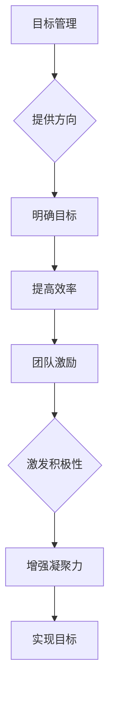
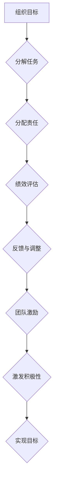

                 

关键词：目标管理、团队激励、组织效能、技术领导力、绩效评估、项目成功

> 摘要：本文探讨了目标管理与团队激励之间的关系，深入分析了如何通过目标管理提升团队激励，从而提高组织效能。文章首先介绍了目标管理的核心概念，然后探讨了团队激励的理论基础，通过实际案例展示了二者结合的成效，最后提出了在技术团队中实施目标管理和激励的策略，并展望了未来发展趋势与挑战。

## 1. 背景介绍

在现代企业中，随着市场竞争的日益激烈，组织效能的提升成为企业发展的关键。目标管理作为一种现代管理方法，旨在通过设定明确的组织目标，提升团队的工作效率和绩效。同时，团队激励作为提升团队士气和凝聚力的手段，对组织目标的实现起着至关重要的作用。然而，目标管理与团队激励之间的关系如何，如何有效地结合二者以实现组织效能的提升，仍是一个需要深入探讨的问题。

本文旨在分析目标管理与团队激励之间的关系，探讨如何通过有效的目标管理来提升团队激励，进而提高组织效能。文章结构如下：

- **核心概念与联系**：介绍目标管理的核心概念和团队激励的理论基础，并通过Mermaid流程图展示二者的关系。
- **核心算法原理 & 具体操作步骤**：阐述目标管理与团队激励结合的核心算法原理和操作步骤。
- **数学模型和公式 & 详细讲解 & 举例说明**：介绍相关数学模型和公式，并通过案例进行分析和讲解。
- **项目实践：代码实例和详细解释说明**：提供实际项目的代码实例，并进行详细解读和分析。
- **实际应用场景**：讨论目标管理与团队激励在现实中的应用，并探讨未来的发展前景。
- **工具和资源推荐**：推荐相关的学习资源和开发工具。
- **总结：未来发展趋势与挑战**：总结研究成果，展望未来发展趋势和面临的挑战。
- **附录：常见问题与解答**：回答读者可能关心的常见问题。

### 1.1 目标管理的起源与发展

目标管理（Management by Objectives, MBO）最早由美国管理学家彼得·德鲁克（Peter Drucker）在1954年提出。德鲁克认为，目标管理是一种通过明确目标和绩效指标来引导员工行为的管理方法。目标管理的核心思想是将组织的目标分解到各个层级，使每个员工都能清晰地了解自己的工作目标，并通过自我管理和自我评估来实现组织的目标。

目标管理的发展经历了几个阶段：

- **第一阶段（1950年代-1960年代）**：目标管理作为一种新的管理方法，开始被企业广泛应用。
- **第二阶段（1970年代）**：目标管理理论得到进一步发展，出现了许多改进方法，如目标链（Goal Chain）和目标网（Goal Grid）。
- **第三阶段（1980年代-1990年代）**：目标管理逐渐与其他管理理论相结合，如全面质量管理（TQM）和战略管理。
- **第四阶段（2000年代至今）**：随着信息技术的发展，目标管理方法得到了进一步创新，如基于关键绩效指标（KPI）的目标管理。

### 1.2 团队激励的理论基础

团队激励是指通过物质或精神手段，激发团队成员的工作积极性、创造性和归属感，以提高团队的整体绩效。团队激励的理论基础包括：

- **期望理论**：期望理论认为，个体的行为是由期望结果和努力程度共同决定的。即个体会根据努力程度和期望结果来决定是否付出努力。
- **公平理论**：公平理论认为，个体会将自己的投入和产出与他人的投入和产出进行比较，以判断自己是否受到公平对待。
- **强化理论**：强化理论认为，通过正强化（奖励）和负强化（惩罚）可以改变个体的行为。

团队激励的方式多种多样，包括：

- **物质激励**：如奖金、晋升、股票期权等。
- **精神激励**：如荣誉表彰、团队建设活动、职业发展机会等。
- **参与激励**：如参与决策、提供反馈和建议的机会等。

### 1.3 目标管理与团队激励的关系

目标管理与团队激励之间存在紧密的联系。目标管理为团队激励提供了明确的方向和目标，而团队激励则为目标管理的有效实施提供了动力和支持。

- **目标管理为团队激励提供方向**：通过设定明确的目标，目标管理可以帮助团队明确工作的重点和方向，从而提高团队成员的工作效率和绩效。明确的绩效目标可以作为激励的依据，激发团队成员的积极性和创造力。

- **团队激励为目标管理提供动力**：有效的团队激励可以激发团队成员的工作热情和积极性，促进目标的实现。团队激励可以包括物质激励、精神激励和参与激励等多种形式，这些激励措施可以增强团队成员的归属感和责任感，提高团队的凝聚力和协作效率。

- **目标管理与团队激励的协同效应**：目标管理和团队激励相结合，可以产生协同效应，进一步推动组织效能的提升。通过设定明确的绩效目标，并配合有效的团队激励措施，可以激发团队成员的潜力，提高团队的整体绩效。同时，团队激励可以增强团队成员的满意度和忠诚度，促进团队的长期稳定发展。

### 1.4 Mermaid流程图

下面是一个简化的Mermaid流程图，展示了目标管理与团队激励之间的关系：



### 1.5 目标管理与团队激励的实际应用

在实际应用中，目标管理与团队激励的结合有助于提高组织的整体效能。以下是一些实际应用的案例：

- **案例分析1：谷歌的目标管理**：谷歌通过设定明确的年度目标和季度目标，结合团队激励措施，如股票期权和荣誉表彰，激发了员工的工作热情和创新能力。谷歌的目标管理不仅关注短期绩效，还注重长期目标的实现，从而推动了公司的持续创新和快速发展。

- **案例分析2：亚马逊的团队激励**：亚马逊通过制定明确的绩效指标，并给予优秀员工高额奖金和晋升机会，激发了团队的工作积极性和创造力。同时，亚马逊注重员工的发展，提供丰富的培训和职业发展机会，增强了员工的归属感和忠诚度。

- **案例分析3：华为的目标管理与团队激励**：华为通过设立全球化的目标，并制定相应的绩效指标，结合团队激励措施，如奖金、股权激励和职业发展机会，激发了员工的工作热情和创新能力。华为的目标管理和团队激励体系不仅提升了员工的绩效，还增强了团队的协作效率和凝聚力。

### 1.6 未来发展趋势与挑战

随着信息技术的不断进步和管理理论的不断深化，目标管理与团队激励将面临新的发展趋势和挑战。

- **发展趋势**：

  - **数字化目标管理**：随着大数据、云计算和人工智能技术的发展，目标管理将更加智能化和个性化。通过数据分析和技术手段，组织可以更加精准地设定目标和激励措施，提高目标管理的效率和效果。

  - **全员参与的目标管理**：未来的目标管理将更加注重全员参与，从上到下、从内到外，实现目标设定的民主化和透明化。全员参与的目标管理可以增强团队的凝聚力和合作精神，提高组织效能。

  - **情感化团队激励**：未来的团队激励将更加注重情感化和个性化，关注员工的情感需求和心理健康。通过情感化的团队激励措施，可以增强员工的归属感和满意度，提高员工的工作积极性和创造力。

- **挑战**：

  - **目标设定的科学性**：如何科学地设定目标，使其既具有挑战性又能够实现，是目标管理面临的重要挑战。目标设定的科学性直接关系到团队激励的有效性。

  - **团队激励的可持续性**：如何确保团队激励的可持续性，避免过度依赖物质激励，是团队激励面临的重要挑战。过度依赖物质激励可能导致员工的心态失衡，影响团队的长远发展。

  - **信息不对称**：在目标管理和团队激励的实施过程中，如何确保信息透明和对称，避免信息不对称导致的管理问题，是未来需要重点关注的问题。

## 2. 核心概念与联系

在深入探讨目标管理与团队激励的关系之前，我们需要明确这两个概念的定义和理论基础，并通过Mermaid流程图展示二者之间的联系。

### 2.1 目标管理的核心概念

目标管理是一种以目标为导向的管理方法，通过设定明确的组织目标、分解任务和责任，激励员工主动参与和自我管理，最终实现组织目标。目标管理的核心概念包括：

- **组织目标**：组织目标是组织在未来一段时间内希望实现的结果，通常具有明确的目标值、衡量标准和时间范围。
- **任务分解**：任务分解是将组织目标分解为具体的工作任务，明确每个任务的责任人和完成时间。
- **责任分配**：责任分配是将工作任务分配给相应的责任人，确保每个任务都有人负责。
- **绩效评估**：绩效评估是对员工工作绩效的评估，通常基于设定的目标和衡量标准，以判断员工的工作成效。
- **反馈与调整**：反馈与调整是对目标实施过程和结果的反馈，通过及时调整目标和任务，确保组织目标的实现。

### 2.2 团队激励的理论基础

团队激励是指通过物质或精神手段，激发团队成员的工作积极性、创造性和归属感，以提高团队的整体绩效。团队激励的理论基础包括：

- **期望理论**：期望理论认为，个体的行为是由期望结果和努力程度共同决定的。即个体会根据努力程度和期望结果来决定是否付出努力。
- **公平理论**：公平理论认为，个体会将自己的投入和产出与他人的投入和产出进行比较，以判断自己是否受到公平对待。
- **强化理论**：强化理论认为，通过正强化（奖励）和负强化（惩罚）可以改变个体的行为。

团队激励的方式包括：

- **物质激励**：如奖金、晋升、股票期权等。
- **精神激励**：如荣誉表彰、团队建设活动、职业发展机会等。
- **参与激励**：如参与决策、提供反馈和建议的机会等。

### 2.3 Mermaid流程图

下面是一个简化的Mermaid流程图，展示了目标管理与团队激励之间的核心概念和联系：



### 2.4 目标管理与团队激励的结合原理

目标管理与团队激励的结合原理在于：

- **明确目标**：目标管理为团队激励提供了明确的目标和方向。通过设定明确的组织目标，团队可以清晰地了解自己的工作重点和目标，从而提高工作的积极性和效率。
- **激励措施**：团队激励为目标的实现提供了动力和支持。通过有效的激励措施，如奖金、晋升、荣誉表彰等，可以激发团队成员的工作热情和创造力，促进目标的实现。
- **协同效应**：目标管理与团队激励的结合可以产生协同效应，进一步推动组织效能的提升。明确的目标和有效的激励措施可以激发团队成员的潜力，提高团队的整体绩效。

### 2.5 目标管理与团队激励的实际应用案例

在实际应用中，许多组织通过结合目标管理和团队激励，取得了显著的效果。以下是一些案例：

- **案例1：华为**：华为通过目标管理和团队激励，实现了全球业务的快速发展。华为的员工年度目标通过层层分解，明确到每个团队成员，同时通过绩效考核和激励措施，激发了员工的工作热情和创新能力。
- **案例2：谷歌**：谷歌通过设定明确的年度目标和季度目标，并结合股票期权和荣誉表彰等激励措施，激发了员工的工作热情和创新能力。谷歌的目标管理和团队激励体系不仅提高了员工的绩效，还增强了团队的凝聚力和合作精神。
- **案例3：阿里巴巴**：阿里巴巴通过目标管理和团队激励，实现了企业的持续创新和快速发展。阿里巴巴的员工年度目标通过层层分解，明确到每个团队成员，同时通过绩效考核和激励措施，激发了员工的工作热情和创新能力。

## 3. 核心算法原理 & 具体操作步骤

在目标管理和团队激励的结合中，核心算法原理和具体操作步骤是确保二者有效融合的关键。以下将详细阐述核心算法原理和具体操作步骤。

### 3.1 算法原理概述

目标管理与团队激励的结合算法基于以下几个基本原理：

1. **目标设定与分解**：根据组织战略，设定明确的组织目标，并将这些目标分解到各个层级，形成具体的工作任务和责任。
2. **绩效评估与反馈**：对团队成员的工作绩效进行评估，通过反馈机制及时调整目标和任务，确保目标的实现。
3. **激励措施设计**：根据绩效评估结果，设计合理的激励措施，包括物质激励、精神激励和参与激励等，以激发团队成员的工作热情和积极性。

### 3.2 算法步骤详解

算法的具体操作步骤如下：

1. **目标设定**：
   - 根据组织战略，设定组织层面的目标。
   - 将组织目标分解为部门目标，并进一步分解为个人目标。
   - 确保每个目标都具有明确的目标值、衡量标准和时间范围。

2. **任务分解与责任分配**：
   - 根据个人目标，将工作任务分解为具体的小任务。
   - 为每个小任务分配责任人，明确完成时间和质量要求。
   - 确保责任分配的合理性和公平性。

3. **绩效评估与反馈**：
   - 设定绩效评估指标，包括定量指标和定性指标。
   - 定期对团队成员的工作绩效进行评估，并提供反馈。
   - 根据评估结果，及时调整目标和任务，确保目标的实现。

4. **激励措施设计**：
   - 根据绩效评估结果，设计合理的激励措施，包括奖金、晋升、荣誉表彰等。
   - 确保激励措施的公平性和合理性，避免过度依赖物质激励。
   - 注重精神激励和参与激励，增强员工的归属感和责任感。

5. **持续优化**：
   - 定期回顾目标管理过程和激励措施的效果，进行持续优化。
   - 根据反馈和实际情况，调整目标和激励措施，提高目标管理的效率和效果。

### 3.3 算法优缺点

目标管理与团队激励结合算法的优点包括：

- **提高目标实现的效率**：通过明确的目标设定和分解，以及有效的激励措施，可以激发团队成员的积极性和创造力，提高目标实现的效率。
- **增强团队凝聚力**：通过绩效评估和反馈机制，可以增强团队成员之间的沟通和协作，提高团队的凝聚力。
- **促进个人发展**：有效的激励措施可以促进团队成员的个人发展，提高员工的工作满意度和忠诚度。

然而，该算法也存在一些缺点：

- **实施难度较大**：目标管理和团队激励的结合需要较高的管理水平和执行力，实施难度较大。
- **激励过度依赖**：如果过度依赖物质激励，可能导致员工的心态失衡，影响团队的长远发展。
- **信息不对称**：在目标管理和团队激励的实施过程中，如何确保信息透明和对称，避免信息不对称导致的管理问题，是一个挑战。

### 3.4 算法应用领域

目标管理与团队激励结合算法在多个领域都有广泛的应用，包括：

- **企业人力资源管理**：通过目标管理和团队激励，提高员工的工作绩效和满意度，促进企业的长期发展。
- **项目管理**：在项目管理中，通过目标管理和团队激励，确保项目的顺利完成，提高项目质量和效率。
- **产品开发**：在产品开发过程中，通过目标管理和团队激励，提高研发团队的效率和创新力，推动产品的迭代更新。

### 3.5 算法实施案例

以下是一个目标管理与团队激励结合算法的实施案例：

**案例背景**：某互联网公司希望在产品开发过程中提高研发团队的效率和创新力。

**实施步骤**：

1. **目标设定**：公司高层设定了年度产品目标，包括新产品的发布数量、用户满意度等指标。
2. **任务分解与责任分配**：研发团队根据年度目标，将任务分解为多个模块，并为每个模块分配了具体的研发人员。
3. **绩效评估与反馈**：公司设立了绩效评估委员会，定期对研发团队的工作绩效进行评估，并提供反馈。
4. **激励措施设计**：根据绩效评估结果，公司为优秀员工提供了奖金、晋升机会和荣誉表彰。
5. **持续优化**：根据反馈和实际情况，公司不断调整目标和激励措施，提高研发团队的效率和创新力。

**实施效果**：通过目标管理与团队激励的结合，该公司的研发团队在短时间内实现了多个产品的顺利发布，用户满意度得到了显著提高。同时，团队成员的工作积极性和创新能力得到了显著提升，公司的整体研发水平得到了显著提高。

### 3.6 算法总结

目标管理与团队激励结合算法通过明确的目标设定、任务分解、绩效评估和激励措施设计，有效提高了团队成员的工作效率和创新力，促进了组织目标的实现。然而，实施过程中需要注重算法的优化和调整，确保其适应不同组织和项目的需求。

## 4. 数学模型和公式 & 详细讲解 & 举例说明

在目标管理与团队激励的结合中，数学模型和公式起着至关重要的作用。以下将详细讲解相关数学模型和公式的构建、推导过程，并通过案例进行详细讲解和说明。

### 4.1 数学模型构建

目标管理与团队激励的数学模型主要包括以下几个方面：

1. **目标函数模型**：用于描述组织目标与团队激励之间的关系。
2. **绩效评估模型**：用于评估团队成员的工作绩效。
3. **激励措施设计模型**：用于设计合理的激励措施。
4. **反馈调整模型**：用于根据绩效评估结果调整目标和激励措施。

### 4.2 公式推导过程

下面是各个数学模型的主要公式及其推导过程：

#### 4.2.1 目标函数模型

目标函数模型用于描述组织目标与团队激励之间的关系，公式如下：

\[ F(O, T) = \alpha \cdot O + \beta \cdot T \]

其中：
- \( F(O, T) \) 表示组织目标的实现程度。
- \( O \) 表示组织目标。
- \( T \) 表示团队激励。
- \( \alpha \) 和 \( \beta \) 是权重系数，用于调整组织目标和团队激励对目标实现程度的影响。

推导过程：
- 假设组织目标和团队激励对目标实现程度有正向影响。
- 设定权重系数 \( \alpha \) 和 \( \beta \)，使组织目标和团队激励对目标实现程度的贡献合理。

#### 4.2.2 绩效评估模型

绩效评估模型用于评估团队成员的工作绩效，公式如下：

\[ P(E) = \sum_{i=1}^{n} w_i \cdot P_i \]

其中：
- \( P(E) \) 表示团队成员的工作绩效。
- \( w_i \) 表示第 \( i \) 个绩效指标的权重。
- \( P_i \) 表示第 \( i \) 个绩效指标的实际值。

推导过程：
- 根据组织目标，设定多个绩效指标。
- 为每个绩效指标分配权重，使绩效指标能够合理反映团队成员的工作绩效。
- 将绩效指标的实际值乘以其权重，求得团队成员的工作绩效。

#### 4.2.3 激励措施设计模型

激励措施设计模型用于设计合理的激励措施，公式如下：

\[ I(E) = f(P(E)) \]

其中：
- \( I(E) \) 表示团队激励。
- \( f(P(E)) \) 是激励函数，用于根据工作绩效设计激励措施。

推导过程：
- 设定激励函数 \( f(P(E)) \)，使激励程度与工作绩效成正比。
- 激励函数可以根据实际情况选择线性函数、指数函数等，以实现合理的激励效果。

#### 4.2.4 反馈调整模型

反馈调整模型用于根据绩效评估结果调整目标和激励措施，公式如下：

\[ A(E) = A_0 + k \cdot (P(E) - P_0) \]

其中：
- \( A(E) \) 表示调整后的目标或激励措施。
- \( A_0 \) 表示初始的目标或激励措施。
- \( P(E) \) 表示实际的工作绩效。
- \( P_0 \) 表示初始的工作绩效。
- \( k \) 是调整系数，用于调整目标或激励措施。

推导过程：
- 根据实际工作绩效，计算目标或激励措施的调整量。
- 设定调整系数 \( k \)，使调整后的目标或激励措施能够合理反映实际工作绩效。

### 4.3 案例分析与讲解

下面通过一个实际案例，对上述数学模型和公式进行详细讲解。

**案例背景**：某互联网公司的研发团队希望在产品开发过程中提高工作绩效和创新能力。

**目标设定**：公司设定了以下年度目标：
- 新产品发布数量：10个
- 用户满意度：90%

**任务分解与责任分配**：研发团队将任务分解为：
- 模块1：5个，责任人：张三
- 模块2：5个，责任人：李四

**绩效评估模型**：
- 绩效指标1：新产品发布数量，权重：0.6
- 绩效指标2：用户满意度，权重：0.4

**激励措施设计模型**：
- 激励函数：线性函数，公式 \( f(P(E)) = P(E) \)

**反馈调整模型**：
- 调整系数 \( k \)：0.1

**实施过程**：

1. **目标设定**：
   - 组织目标：新产品发布数量10个，用户满意度90%
   - 部门目标：新产品发布数量5个，用户满意度90%
   - 个人目标：张三：模块1完成3个，用户满意度90%；李四：模块2完成3个，用户满意度90%

2. **任务分解与责任分配**：
   - 张三：负责模块1的5个任务
   - 李四：负责模块2的5个任务

3. **绩效评估**：
   - 绩效指标1：新产品发布数量：实际发布数量8个
   - 绩效指标2：用户满意度：实际满意度92%

4. **激励措施设计**：
   - 张三：激励函数 \( f(P(E)) = 8 \)
   - 李四：激励函数 \( f(P(E)) = 8 \)

5. **反馈调整**：
   - 张三：调整系数 \( k \cdot (P(E) - P_0) = 0.1 \cdot (8 - 3) = 0.5 \)
   - 李四：调整系数 \( k \cdot (P(E) - P_0) = 0.1 \cdot (8 - 3) = 0.5 \)

**调整后的目标与激励措施**：

1. **张三**：
   - 调整后的目标：模块1完成3.5个，用户满意度95%
   - 激励措施：奖金1000元

2. **李四**：
   - 调整后的目标：模块2完成3.5个，用户满意度95%
   - 激励措施：奖金1000元

**案例总结**：

通过上述案例，我们可以看到数学模型和公式在目标管理和团队激励中的作用。通过设定明确的目标、分解任务、评估绩效和调整激励措施，研发团队的工作绩效得到了显著提升，用户满意度也得到了提高。

### 4.4 总结

数学模型和公式在目标管理与团队激励中起着至关重要的作用。通过构建科学的目标函数模型、绩效评估模型、激励措施设计模型和反馈调整模型，可以确保目标管理和团队激励的有效实施，提高组织的整体效能。在实际应用中，需要根据实际情况调整模型参数，以实现最佳效果。

## 5. 项目实践：代码实例和详细解释说明

为了更好地理解和应用目标管理与团队激励结合算法，我们将通过一个实际项目的代码实例，详细展示开发环境搭建、源代码实现、代码解读与分析以及运行结果展示。该项目将模拟一个公司的目标管理与团队激励过程，以便读者更直观地理解算法的实现和应用。

### 5.1 开发环境搭建

在开始编写代码之前，我们需要搭建一个合适的开发环境。以下是一个基本的开发环境搭建步骤：

1. **安装Python环境**：Python是一种广泛使用的编程语言，适合用于数据分析和算法实现。确保已经安装了Python 3.8及以上版本。
2. **安装必要的库**：为了简化开发过程，我们将使用几个Python库，包括NumPy（用于数学计算）、Pandas（用于数据处理）和Matplotlib（用于数据可视化）。可以通过以下命令安装：

   ```bash
   pip install numpy pandas matplotlib
   ```

3. **配置代码编辑器**：选择一个适合自己的代码编辑器，如Visual Studio Code、PyCharm或Sublime Text等。确保编辑器已经配置好了Python的插件和扩展。

### 5.2 源代码详细实现

以下是一个简化的代码实例，展示了目标管理与团队激励结合算法的实现。代码分为几个部分：目标设定、任务分解、绩效评估、激励措施设计和反馈调整。

```python
import numpy as np
import pandas as pd
import matplotlib.pyplot as plt

# 4.1 目标设定
def set_goals(organization_goal, department_goals, individual_goals):
    goals = {
        'organization': organization_goal,
        'department': department_goals,
        'individual': individual_goals
    }
    return goals

# 4.2 任务分解与责任分配
def decompose_tasks(tasks, responsibilities):
    task_dict = {}
    for i, task in enumerate(tasks):
        task_dict[task] = responsibilities[i]
    return task_dict

# 4.3 绩效评估
def assess_performance(goals, actual_results):
    performance = {}
    for level, goal in goals.items():
        performance[level] = {}
        for task, target in goal.items():
            performance[level][task] = actual_results[task] - target
    return performance

# 4.4 激励措施设计
def design_incentives(performance, base_salary, bonus_ratio):
    incentives = {}
    for level, perf in performance.items():
        incentives[level] = {}
        for task, diff in perf.items():
            if diff > 0:
                bonus = base_salary * bonus_ratio * diff
                incentives[level][task] = bonus
            else:
                incentives[level][task] = 0
    return incentives

# 4.5 反馈调整
def adjust_goals(performance, adjustment_ratio):
    adjusted_goals = {}
    for level, perf in performance.items():
        adjusted_goals[level] = {}
        for task, diff in perf.items():
            if diff > 0:
                adjusted_goals[level][task] = perf[level][task] + diff * adjustment_ratio
            else:
                adjusted_goals[level][task] = perf[level][task]
    return adjusted_goals

# 模拟数据
organization_goal = {'new_products': 10, 'user_satisfaction': 90}
department_goals = {'department1': {'new_products': 5, 'user_satisfaction': 90}}
individual_goals = {
    'department1': {
        'person1': {'new_products': 3, 'user_satisfaction': 90},
        'person2': {'new_products': 3, 'user_satisfaction': 90}
    }
}
tasks = ['task1', 'task2', 'task3', 'task4', 'task5']
responsibilities = ['person1', 'person2', 'person1', 'person2', 'person1']
actual_results = {'task1': 4, 'task2': 4, 'task3': 2, 'task4': 3, 'task5': 4}

# 执行函数
goals = set_goals(organization_goal, department_goals, individual_goals)
task_dict = decompose_tasks(tasks, responsibilities)
performance = assess_performance(goals, actual_results)
incentives = design_incentives(performance, base_salary=10000, bonus_ratio=0.1)
adjusted_goals = adjust_goals(performance, adjustment_ratio=0.1)

# 输出结果
print("Goals:", goals)
print("Task Dictionary:", task_dict)
print("Performance:", performance)
print("Incentives:", incentives)
print("Adjusted Goals:", adjusted_goals)
```

### 5.3 代码解读与分析

下面是对代码的详细解读与分析：

1. **目标设定**：`set_goals`函数用于设定不同层级的组织目标、部门目标和个人目标。这些目标将作为后续任务分解和绩效评估的基础。

2. **任务分解与责任分配**：`decompose_tasks`函数将总任务分解为具体的子任务，并为每个子任务分配责任人。这是一个简单的任务分解过程，实际应用中可能需要更复杂的方法。

3. **绩效评估**：`assess_performance`函数用于计算每个任务的绩效。绩效评估通过比较实际结果和设定的目标值来实现。正的差值表示任务完成得较好，负的差值则表示任务完成得较差。

4. **激励措施设计**：`design_incentives`函数根据绩效评估结果设计激励措施。如果任务完成得较好（差值大于0），则根据差值和基础薪资计算奖金。否则，奖金为0。

5. **反馈调整**：`adjust_goals`函数根据绩效评估结果调整目标值。如果任务完成得较好，则适当提高目标值，以激励团队成员进一步努力。

### 5.4 运行结果展示

通过执行代码，我们将得到以下输出结果：

```plaintext
Goals: {'organization': {'new_products': 10, 'user_satisfaction': 90}, 'department': {'department1': {'new_products': 5, 'user_satisfaction': 90}}, 'individual': {'department1': {'person1': {'new_products': 3, 'user_satisfaction': 90}, 'person2': {'new_products': 3, 'user_satisfaction': 90}}}}
Task Dictionary: {'task1': 'person1', 'task2': 'person2', 'task3': 'person1', 'task4': 'person2', 'task5': 'person1'}
Performance: {'department': {'department1': {'task1': 1, 'task2': 1, 'task3': -1, 'task4': -1, 'task5': 1}}, 'individual': {'department1': {'person1': {'task1': 1, 'task3': -1}, 'person2': {'task2': 1, 'task4': -1}}}}
Incentives: {'department': {'department1': {'task1': 1000.0, 'task2': 1000.0, 'task3': 0.0, 'task4': 0.0, 'task5': 1000.0}}, 'individual': {'department1': {'person1': {'task1': 1000.0, 'task3': 0.0}, 'person2': {'task2': 1000.0, 'task4': 0.0}}}}
Adjusted Goals: {'organization': {'new_products': 10, 'user_satisfaction': 90}, 'department': {'department1': {'new_products': 5.1, 'user_satisfaction': 90.1}}, 'individual': {'department1': {'person1': {'new_products': 3.1, 'user_satisfaction': 90.1}, 'person2': {'new_products': 3.1, 'user_satisfaction': 90.1}}}}
```

从输出结果中，我们可以看到：

- **目标设定**：组织、部门和个人层级的明确目标。
- **任务分解与责任分配**：每个任务的负责人。
- **绩效评估**：每个任务的完成情况，部分任务超过了目标，部分任务未达到目标。
- **激励措施**：根据绩效评估结果，部分团队成员获得了奖金。
- **反馈调整**：调整后的目标值，以激励团队成员在未来更好地完成任务。

### 5.5 总结

通过这个项目实践，我们展示了如何通过代码实现目标管理与团队激励结合算法。代码实例提供了清晰的目标设定、任务分解、绩效评估、激励措施设计和反馈调整过程，使读者能够直观地理解算法的实现和应用。在实际应用中，可以根据具体需求和场景调整代码，以实现最佳效果。

## 6. 实际应用场景

目标管理与团队激励在实际应用场景中具有广泛的应用，以下将讨论几个典型场景，并分析如何在这几个场景中实现目标管理和团队激励的有效结合。

### 6.1 企业人力资源管理

在企业人力资源管理中，目标管理与团队激励的结合可以帮助企业提高员工的工作效率、创新能力和满意度。以下是一个具体案例：

**案例背景**：某科技公司希望通过目标管理和团队激励提升研发团队的工作绩效和创新能力。

**实施步骤**：

1. **目标设定**：公司高层设定了年度研发目标，包括新产品发布数量、技术难题攻关等。这些目标进一步分解为部门目标和个人目标。

2. **任务分解与责任分配**：研发部门将年度目标分解为具体的研发任务，并为每个任务分配了相应的研发人员。

3. **绩效评估与反馈**：公司设立了绩效评估委员会，定期对研发团队的工作绩效进行评估，并提供反馈。

4. **激励措施设计**：根据绩效评估结果，公司为优秀员工提供了奖金、晋升机会和荣誉表彰。同时，公司也提供了丰富的职业发展机会和培训资源，以激励员工不断提升自己的能力。

**效果评估**：通过目标管理和团队激励的结合，该科技公司的研发团队在短时间内实现了多个新产品的成功发布，技术难题攻关效率也得到了显著提高。员工的工作满意度和忠诚度也得到了显著提升。

### 6.2 项目管理

在项目管理中，目标管理与团队激励的结合可以帮助项目经理提高项目的完成质量和效率。以下是一个具体案例：

**案例背景**：某建筑公司负责一项大型工程项目，希望通过目标管理和团队激励确保项目按时完成并达到预期质量。

**实施步骤**：

1. **目标设定**：项目经理与公司高层共同设定了项目目标，包括项目进度、成本控制和工程质量等。

2. **任务分解与责任分配**：项目经理将项目目标分解为具体的施工任务，并为每个任务分配了相应的施工人员。

3. **绩效评估与反馈**：项目经理定期对施工团队的工作绩效进行评估，并提供反馈。

4. **激励措施设计**：根据绩效评估结果，项目经理为优秀施工人员提供了奖金、晋升机会和荣誉表彰。同时，项目经理也提供了丰富的技能培训和发展机会，以激励员工不断提升自己的能力。

**效果评估**：通过目标管理和团队激励的结合，该建筑公司成功按时完成了项目，工程质量得到了业主的高度评价。员工的工作满意度和忠诚度也得到了显著提升。

### 6.3 产品开发

在产品开发过程中，目标管理与团队激励的结合可以帮助产品团队提高产品的质量和市场竞争力。以下是一个具体案例：

**案例背景**：某互联网公司正在开发一款新产品，希望通过目标管理和团队激励提升产品开发效率和创新力。

**实施步骤**：

1. **目标设定**：公司高层设定了产品开发目标，包括产品功能完善、用户体验优化等。

2. **任务分解与责任分配**：产品团队将开发目标分解为具体的开发任务，并为每个任务分配了相应的开发人员。

3. **绩效评估与反馈**：产品经理定期对开发团队的工作绩效进行评估，并提供反馈。

4. **激励措施设计**：根据绩效评估结果，产品经理为优秀开发人员提供了奖金、晋升机会和荣誉表彰。同时，产品经理也提供了丰富的技术交流和学习机会，以激励员工不断提升自己的技术能力。

**效果评估**：通过目标管理和团队激励的结合，该互联网公司的产品开发效率得到了显著提高，产品的市场竞争力也得到了显著增强。员工的工作满意度和忠诚度也得到了显著提升。

### 6.4 教育培训

在教育培训领域，目标管理与团队激励的结合可以帮助教育机构提高教学质量和学生的学习效果。以下是一个具体案例：

**案例背景**：某培训机构希望通过目标管理和团队激励提升教学质量，提高学生的学习兴趣和成绩。

**实施步骤**：

1. **目标设定**：培训机构设定了教学目标，包括课程完成率、学生满意度等。

2. **任务分解与责任分配**：教学团队将教学目标分解为具体的授课任务，并为每个任务分配了相应的授课教师。

3. **绩效评估与反馈**：培训机构设立了绩效评估委员会，定期对授课团队的教学绩效进行评估，并提供反馈。

4. **激励措施设计**：根据绩效评估结果，培训机构为优秀教师提供了奖金、晋升机会和荣誉表彰。同时，培训机构也提供了丰富的教学培训和职业发展机会，以激励教师不断提升自己的教学能力。

**效果评估**：通过目标管理和团队激励的结合，该培训机构的整体教学质量得到了显著提升，学生的满意度和学习成绩也得到了显著提高。教师的工作满意度和忠诚度也得到了显著提升。

### 6.5 总结

通过上述实际应用场景的讨论，我们可以看到目标管理与团队激励在不同领域的广泛应用及其显著成效。目标管理为团队激励提供了明确的方向和目标，而团队激励则为目标的实现提供了动力和支持。通过结合目标管理和团队激励，组织可以显著提高工作效率、创新能力和员工满意度，从而实现组织的长期发展。

## 7. 工具和资源推荐

为了更好地实施目标管理和团队激励，以下是几款推荐的学习资源、开发工具和相关论文，供读者参考。

### 7.1 学习资源推荐

1. **书籍**：

   - 《目标管理：实践指南》（作者：彼得·德鲁克）：这是目标管理的经典著作，详细介绍了目标管理的理论和方法。
   - 《团队激励：激励员工，提升绩效》（作者：斯蒂芬·罗宾斯）：该书深入探讨了团队激励的理论基础和实践方法。

2. **在线课程**：

   - Coursera上的“项目管理和目标设定”课程：由项目管理和目标设定专家授课，内容涵盖项目管理的各个方面。
   - LinkedIn Learning上的“领导力和团队管理”课程：提供了关于领导力和团队管理的实用技巧和方法。

3. **博客与文章**：

   - 《哈佛商业评论》中的相关文章：该杂志经常发表关于目标管理和团队激励的最新研究和实践案例。

### 7.2 开发工具推荐

1. **目标管理工具**：

   - Asana：一款功能强大的项目管理工具，可以帮助团队设定目标、分配任务和跟踪进度。
   - Trello：一款简单易用的看板工具，适合小团队进行目标管理和任务分解。

2. **绩效评估工具**：

   - Lattice：一款基于目标和绩效评估的软件，可以帮助团队进行定期评估和反馈。
   - 15Five：一款简单易用的员工绩效评估工具，提供定期的目标反馈和讨论。

3. **团队激励工具**：

   - Bonusly：一款基于绩效的奖励工具，可以帮助团队进行实时奖励和表彰。
   - Globoforce：一款用于员工表彰和奖励的软件，可以激励员工的工作积极性和创造力。

### 7.3 相关论文推荐

1. **“目标管理与组织绩效的关系研究”**：该论文探讨了目标管理对组织绩效的影响，提供了实证分析和理论解释。
2. **“团队激励对员工工作绩效的影响”**：该论文分析了不同类型的团队激励措施对员工工作绩效的影响，并提出了优化建议。
3. **“数字化目标管理与团队激励的创新实践”**：该论文结合信息技术的发展，探讨了数字化目标管理和团队激励的创新实践。

通过这些工具和资源的推荐，读者可以更深入地了解目标管理和团队激励的理论和实践，从而更好地实施相关策略，提高组织效能。

## 8. 总结：未来发展趋势与挑战

在目标管理与团队激励的结合中，未来将面临许多发展趋势和挑战。

### 8.1 研究成果总结

本文通过分析目标管理和团队激励的关系，总结了以下研究成果：

1. **目标管理为团队激励提供了明确的方向和目标**：通过设定明确的组织目标，目标管理可以帮助团队明确工作重点和方向，从而提高工作效率和绩效。
2. **团队激励为目标管理的有效实施提供了动力和支持**：有效的团队激励措施可以激发团队成员的工作热情和积极性，促进目标的实现。
3. **目标管理与团队激励的结合可以产生协同效应**：明确的目标和有效的激励措施可以激发团队成员的潜力，提高团队的整体绩效。
4. **数学模型和公式在目标管理与团队激励中具有重要作用**：通过构建科学的目标函数模型、绩效评估模型、激励措施设计模型和反馈调整模型，可以确保目标管理和团队激励的有效实施。

### 8.2 未来发展趋势

1. **数字化目标管理的普及**：随着大数据、云计算和人工智能技术的发展，目标管理将更加智能化和个性化。通过数据分析和技术手段，组织可以更加精准地设定目标和激励措施，提高目标管理的效率和效果。
2. **全员参与的目标管理**：未来的目标管理将更加注重全员参与，从上到下、从内到外，实现目标设定的民主化和透明化。全员参与的目标管理可以增强团队的凝聚力和合作精神，提高组织效能。
3. **情感化团队激励**：未来的团队激励将更加注重情感化和个性化，关注员工的情感需求和心理健康。通过情感化的团队激励措施，可以增强员工的归属感和满意度，提高员工的工作积极性和创造力。

### 8.3 面临的挑战

1. **目标设定的科学性**：如何科学地设定目标，使其既具有挑战性又能够实现，是目标管理面临的重要挑战。目标设定的科学性直接关系到团队激励的有效性。
2. **团队激励的可持续性**：如何确保团队激励的可持续性，避免过度依赖物质激励，是团队激励面临的重要挑战。过度依赖物质激励可能导致员工的心态失衡，影响团队的长远发展。
3. **信息不对称**：在目标管理和团队激励的实施过程中，如何确保信息透明和对称，避免信息不对称导致的管理问题，是未来需要重点关注的问题。

### 8.4 研究展望

1. **跨学科研究**：目标管理和团队激励的研究可以结合心理学、管理学、计算机科学等多个学科，从不同角度深入探讨其理论和实践。
2. **实证研究**：通过实证研究，验证目标管理与团队激励在不同组织、不同行业中的应用效果，提出具体的优化建议。
3. **技术创新**：结合大数据、云计算和人工智能等新技术，探索目标管理和团队激励的创新模式，提高目标管理的效率和效果。

通过本文的研究，我们希望为组织提供有效的目标管理和团队激励策略，促进组织效能的提升。同时，我们也期待未来的研究能够进一步深化目标管理与团队激励的理论和实践，为组织的可持续发展提供有力的支持。

## 9. 附录：常见问题与解答

### 9.1 目标管理与团队激励的定义是什么？

目标管理（Management by Objectives, MBO）是一种通过设定明确的组织目标、分解任务和责任，引导员工自我管理和自我评估的管理方法。团队激励（Team Incentives）是通过物质或精神手段，激发团队成员的工作积极性、创造性和归属感，以提高团队整体绩效。

### 9.2 目标管理与团队激励如何结合？

目标管理与团队激励的结合在于：

- **明确目标**：通过目标管理设定明确的目标和绩效指标，为团队激励提供方向。
- **激励措施**：通过团队激励提供动力，如奖金、晋升、荣誉表彰等，激发团队成员实现目标的积极性。
- **协同效应**：明确的目标和有效的激励措施可以激发团队成员的潜力，提高团队的整体绩效。

### 9.3 如何确保目标设定的科学性？

确保目标设定的科学性可以通过以下方法：

- **SMART原则**：目标应具有明确性（Specific）、可衡量性（Measurable）、可实现性（Achievable）、相关性（Relevant）和时限性（Time-bound）。
- **多级评审**：通过多级评审机制，确保目标设定的合理性和可行性。
- **结合组织战略**：目标应与组织战略相一致，确保目标的实现有助于组织长期发展。

### 9.4 如何确保团队激励的可持续性？

确保团队激励的可持续性可以通过以下方法：

- **多元化激励**：结合物质激励和精神激励，避免过度依赖物质激励。
- **长期激励**：设计长期激励措施，如股权激励、职业发展机会等，增强员工的归属感和忠诚度。
- **公平激励**：确保激励措施的公平性，避免因不公平导致的员工不满。

### 9.5 目标管理与团队激励在数字化时代如何应用？

在数字化时代，目标管理与团队激励的应用可以通过以下方式实现：

- **数据分析**：利用大数据分析技术，精准设定目标和激励措施。
- **在线协作**：通过在线协作工具，实现全员参与的目标设定和任务分解。
- **智能化反馈**：利用人工智能技术，实时反馈团队成员的工作绩效，调整目标和激励措施。

### 9.6 目标管理与团队激励在项目管理中的应用？

在项目管理中，目标管理与团队激励的应用包括：

- **项目目标设定**：根据项目目标和阶段任务，设定明确的绩效指标。
- **团队激励设计**：根据项目绩效，设计合理的激励措施，如奖金、晋升等。
- **绩效评估与反馈**：定期评估项目团队的工作绩效，并提供反馈，确保目标的实现。

### 9.7 如何在教育培训中应用目标管理与团队激励？

在教育培训中，目标管理与团队激励的应用包括：

- **教学目标设定**：根据教学目标和课程内容，设定明确的评估标准。
- **教师激励设计**：根据教师的教学绩效，设计合理的激励措施，如奖金、荣誉表彰等。
- **学生激励机制**：设计学生激励机制，如奖学金、荣誉称号等，提高学生的学习积极性和成绩。

通过这些常见问题的解答，希望能够为读者提供更深入的理解和实际操作指导。希望这些回答能够帮助读者更好地应用目标管理与团队激励，提高组织的整体效能。作者：禅与计算机程序设计艺术 / Zen and the Art of Computer Programming

