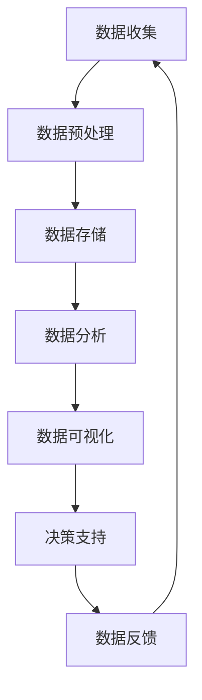

                 

### 1. 背景介绍

随着信息技术的飞速发展，医疗行业也在发生深刻的变革。医疗大数据作为信息时代的重要组成部分，已经成为医疗行业创新发展的重要驱动力。省医疗大数据可视化分析作为一种新兴的技术手段，通过对海量医疗数据的分析、整合和可视化展示，能够帮助医疗机构和医疗人员更好地理解医疗数据，发现数据中的规律和趋势，从而为医疗决策提供有力支持。

当前，医疗大数据的应用已经广泛覆盖了疾病预测、药物研发、医院管理、患者健康管理等各个方面。随着医疗数据的不断积累和增长，如何有效地管理和分析这些数据，成为了一个亟待解决的问题。可视化分析作为一种直观、高效的数据分析方法，能够将复杂的医疗数据以图形化的形式展示出来，使得医疗人员能够快速、准确地理解数据，从而提高医疗服务的质量和效率。

本文旨在探讨省医疗大数据可视化分析的应用与实践，重点介绍核心概念、算法原理、数学模型、项目实践、实际应用场景、工具和资源推荐等内容。通过本文的阅读，读者可以全面了解省医疗大数据可视化分析的方法和应用，为相关领域的研究和实践提供参考。

### 1.1 省医疗大数据的重要性

省医疗大数据的重要性不言而喻。首先，医疗大数据为疾病的早期诊断提供了有力支持。通过对海量医疗数据的分析，可以预测疾病的发生趋势，发现疾病的高发区域和高风险人群，从而有针对性地开展疾病预防和早期干预。

其次，医疗大数据为药物研发提供了丰富的数据资源。通过对药物临床试验数据的分析，可以识别药物的疗效和安全性，为药物的研发提供重要参考。此外，医疗大数据还可以用于药物基因组学研究，为个性化医疗提供科学依据。

再次，医疗大数据为医院管理提供了科学依据。通过对医院运营数据的分析，可以优化医院资源配置，提高医疗服务的效率和质量。同时，医疗大数据还可以用于患者健康管理，通过监测患者的健康数据，实现患者的个性化健康管理和疾病预防。

总之，省医疗大数据的发掘和应用，不仅能够提高医疗服务的质量和效率，还能够推动医疗行业的创新发展，具有重大的社会和经济价值。

### 1.2 可视化分析在医疗大数据中的应用

可视化分析在医疗大数据中的应用具有显著的优势。首先，可视化分析能够将复杂的医疗数据以图形化的形式展示出来，使得医疗人员能够直观地理解数据，发现数据中的规律和趋势。例如，通过可视化分析，可以清晰地展示疾病的高发区域、高风险人群以及疾病的传播路径，为疾病的预防和控制提供科学依据。

其次，可视化分析能够提高医疗决策的效率。通过对医疗数据的可视化展示，医疗人员可以快速、准确地获取关键信息，避免因数据过多而导致的决策困难。例如，在医院管理中，通过可视化分析，可以实时监控医院的运营状况，及时发现问题和瓶颈，从而采取相应的措施，提高医院的管理效率。

再次，可视化分析有助于提高患者的参与度和满意度。通过可视化分析，患者可以更直观地了解自己的健康状况和疾病发展趋势，提高患者的健康意识和参与度。例如，通过可视化分析，患者可以清楚地看到自己的运动、饮食和睡眠状况，从而有针对性地调整生活方式，提高健康水平。

总之，可视化分析在医疗大数据中的应用，不仅能够提高医疗服务的质量和效率，还能够推动医疗行业的创新发展，具有广泛的应用前景。

### 1.3 省医疗大数据可视化分析的意义

省医疗大数据可视化分析具有重要的现实意义。首先，它为疾病的早期诊断提供了有力支持。通过可视化分析，医疗人员可以更直观地了解患者的健康数据，发现疾病的高发区域和高风险人群，从而有针对性地开展疾病预防和早期干预。

其次，省医疗大数据可视化分析有助于提高医疗决策的效率。通过对医疗数据的可视化展示，医疗人员可以快速、准确地获取关键信息，避免因数据过多而导致的决策困难。例如，在医院管理中，通过可视化分析，可以实时监控医院的运营状况，及时发现问题和瓶颈，从而采取相应的措施，提高医院的管理效率。

再次，省医疗大数据可视化分析有助于提高患者的参与度和满意度。通过可视化分析，患者可以更直观地了解自己的健康状况和疾病发展趋势，提高患者的健康意识和参与度。例如，通过可视化分析，患者可以清楚地看到自己的运动、饮食和睡眠状况，从而有针对性地调整生活方式，提高健康水平。

总之，省医疗大数据可视化分析在医疗行业的应用，不仅能够提高医疗服务的质量和效率，还能够推动医疗行业的创新发展，具有重大的社会和经济价值。

### 1.4 文章结构概述

本文将从以下七个部分对省医疗大数据可视化分析进行深入探讨：

1. 背景介绍：简要介绍医疗大数据的重要性以及可视化分析在医疗大数据中的应用。
2. 核心概念与联系：介绍省医疗大数据可视化分析的核心概念，并展示相应的 Mermaid 流程图。
3. 核心算法原理 & 具体操作步骤：详细讲解省医疗大数据可视化分析的核心算法原理和具体操作步骤。
4. 数学模型和公式 & 详细讲解 & 举例说明：介绍省医疗大数据可视化分析所涉及的数学模型和公式，并进行详细讲解和举例说明。
5. 项目实践：通过代码实例和详细解释说明，展示省医疗大数据可视化分析的实际应用。
6. 实际应用场景：分析省医疗大数据可视化分析在不同场景中的应用。
7. 工具和资源推荐：推荐学习资源、开发工具和相关的论文。
8. 总结：总结研究成果，展望未来发展。

### 2. 核心概念与联系

在省医疗大数据可视化分析中，核心概念和联系的理解至关重要。以下将详细介绍这些核心概念，并使用 Mermaid 流程图展示其架构和流程。

#### 2.1 核心概念

1. **医疗数据**：包括患者的健康记录、疾病诊断数据、治疗数据、药物使用记录等。
2. **大数据处理技术**：如 Hadoop、Spark、Flink 等用于处理海量数据的技术。
3. **数据可视化技术**：如 D3.js、ECharts、Plotly 等用于将数据以图形化的形式展示的技术。
4. **机器学习算法**：如决策树、支持向量机、神经网络等，用于从数据中挖掘规律和趋势。

#### 2.2 Mermaid 流程图

以下是一个简化的 Mermaid 流程图，展示省医疗大数据可视化分析的核心流程：



**流程说明**：

1. **数据收集**：收集来自医院、诊所、健康监测设备等医疗机构的原始数据。
2. **数据预处理**：对原始数据进行清洗、转换和整合，使其适合进一步分析。
3. **数据存储**：将预处理后的数据存储到数据库或数据仓库中，以便后续分析。
4. **数据分析**：使用机器学习算法从数据中挖掘规律和趋势，为决策提供支持。
5. **数据可视化**：将分析结果以图形化的形式展示，帮助医疗人员理解和决策。
6. **决策支持**：根据可视化结果，为医疗决策提供支持。
7. **数据反馈**：将决策结果反馈到数据收集环节，形成闭环。

通过这个流程，医疗人员可以实时、动态地了解医疗数据的变化，从而提高医疗服务的质量和效率。

### 3. 核心算法原理 & 具体操作步骤

#### 3.1 算法原理概述

省医疗大数据可视化分析的核心算法包括数据预处理、特征工程、机器学习模型训练和数据可视化等几个环节。以下将分别介绍这些算法的基本原理。

1. **数据预处理**：数据预处理是数据分析的基础，主要包括数据清洗、数据转换和数据整合。数据清洗是为了去除噪声数据和缺失值，数据转换是为了将不同类型的数据统一成同一种格式，数据整合是为了将多个数据源的数据进行整合，形成一个完整的分析数据集。

2. **特征工程**：特征工程是提升模型性能的关键步骤，主要包括特征选择、特征提取和特征转换。特征选择是为了从原始数据中筛选出对模型有贡献的特征，特征提取是为了将低维数据转换成高维数据，特征转换是为了将非线性的特征转换为线性可分的形式。

3. **机器学习模型训练**：机器学习模型训练是为了从数据中学习到规律，并将其用于预测和分类。常见的机器学习算法包括决策树、支持向量机、神经网络等。这些算法的基本原理是通过对样本数据的训练，构建出一个可以泛化的模型，从而对新数据进行预测。

4. **数据可视化**：数据可视化是将分析结果以图形化的形式展示，以便医疗人员直观地理解数据。常用的可视化方法包括折线图、柱状图、散点图、热力图等。

#### 3.2 算法步骤详解

1. **数据预处理**：

   - 数据清洗：去除重复数据、缺失值填充、噪声数据去除。
   - 数据转换：将不同类型的数据（如数值、类别）统一成同一种格式（如数值）。
   - 数据整合：将多个数据源的数据进行整合，形成一个完整的分析数据集。

2. **特征工程**：

   - 特征选择：使用相关性分析、信息增益等方法筛选出对模型有贡献的特征。
   - 特征提取：使用主成分分析（PCA）、自动编码器等方法将低维数据转换成高维数据。
   - 特征转换：使用逻辑回归、决策树等方法将非线性的特征转换为线性可分的形式。

3. **机器学习模型训练**：

   - 选择合适的机器学习算法（如决策树、支持向量机、神经网络）。
   - 对模型进行训练，使用训练集进行模型参数的优化。
   - 使用验证集评估模型的性能，并进行模型调整。

4. **数据可视化**：

   - 根据分析需求选择合适的可视化方法（如折线图、柱状图、散点图、热力图）。
   - 将分析结果以图形化的形式展示，便于医疗人员直观地理解数据。

#### 3.3 算法优缺点

1. **数据预处理**：

   - 优点：去除噪声数据、缺失值填充、数据整合等步骤可以提高数据分析的质量。
   - 缺点：数据预处理过程较为繁琐，需要耗费大量时间和计算资源。

2. **特征工程**：

   - 优点：通过特征选择、特征提取和特征转换可以提升模型性能，提高预测的准确性。
   - 缺点：特征工程过程依赖于领域知识，对数据质量和领域背景有较高的要求。

3. **机器学习模型训练**：

   - 优点：机器学习模型可以自动从数据中学习规律，提高预测的准确性。
   - 缺点：模型训练过程需要大量计算资源和时间，且模型性能容易受到数据质量和参数设置的影响。

4. **数据可视化**：

   - 优点：数据可视化可以帮助医疗人员更直观地理解数据，发现数据中的规律和趋势。
   - 缺点：数据可视化需要选择合适的可视化方法，否则可能导致数据理解的偏差。

#### 3.4 算法应用领域

1. **疾病预测**：通过分析患者的健康数据和疾病诊断数据，预测患者患某种疾病的风险，为疾病预防和早期干预提供支持。

2. **药物研发**：通过分析药物临床试验数据，识别药物的疗效和安全性，为药物研发提供科学依据。

3. **医院管理**：通过分析医院运营数据，优化医院资源配置，提高医疗服务效率和质量。

4. **患者健康管理**：通过分析患者的健康数据，实现患者的个性化健康管理和疾病预防。

5. **公共卫生监测**：通过分析公共卫生数据，监测疾病传播趋势，为公共卫生决策提供支持。

### 4. 数学模型和公式 & 详细讲解 & 举例说明

在省医疗大数据可视化分析中，数学模型和公式起着至关重要的作用。它们不仅为数据处理和分析提供了理论基础，而且能够帮助我们更好地理解和解释数据背后的规律和趋势。以下将介绍一些常见的数学模型和公式，并进行详细讲解和举例说明。

#### 4.1 数学模型构建

在省医疗大数据可视化分析中，常用的数学模型包括线性回归模型、逻辑回归模型、聚类模型和时间序列模型等。

1. **线性回归模型**：线性回归模型是一种最常见的预测模型，用于预测因变量与自变量之间的线性关系。其数学模型表示为：

   $$
   Y = \beta_0 + \beta_1X_1 + \beta_2X_2 + \ldots + \beta_nX_n + \epsilon
   $$

   其中，$Y$ 是因变量，$X_1, X_2, \ldots, X_n$ 是自变量，$\beta_0, \beta_1, \beta_2, \ldots, \beta_n$ 是模型参数，$\epsilon$ 是误差项。

2. **逻辑回归模型**：逻辑回归模型是一种常用的分类模型，用于预测某个事件发生的概率。其数学模型表示为：

   $$
   \log\frac{P(Y=1)}{1-P(Y=1)} = \beta_0 + \beta_1X_1 + \beta_2X_2 + \ldots + \beta_nX_n
   $$

   其中，$Y$ 是因变量，取值为0或1，$X_1, X_2, \ldots, X_n$ 是自变量，$\beta_0, \beta_1, \beta_2, \ldots, \beta_n$ 是模型参数。

3. **聚类模型**：聚类模型用于将数据划分为若干个类别，常见的聚类算法包括 K-均值聚类算法和层次聚类算法。K-均值聚类算法的数学模型表示为：

   $$
   \text{minimize} \sum_{i=1}^n \sum_{j=1}^k (x_j - \mu_i)^2
   $$

   其中，$x_j$ 是数据点，$\mu_i$ 是第 $i$ 个聚类的中心点，$k$ 是聚类个数。

4. **时间序列模型**：时间序列模型用于分析随时间变化的数据，常见的时间序列模型包括 ARIMA 模型、AR 模型等。ARIMA 模型的数学模型表示为：

   $$
   Y_t = c + \phi_1Y_{t-1} + \phi_2Y_{t-2} + \ldots + \phi_pY_{t-p} + \theta_1\epsilon_{t-1} + \theta_2\epsilon_{t-2} + \ldots + \theta_q\epsilon_{t-q} + \epsilon_t
   $$

   其中，$Y_t$ 是时间序列的第 $t$ 个数据点，$c$ 是常数项，$\phi_1, \phi_2, \ldots, \phi_p$ 是自回归系数，$\theta_1, \theta_2, \ldots, \theta_q$ 是移动平均系数，$\epsilon_t$ 是误差项。

#### 4.2 公式推导过程

以下简要介绍上述模型公式的推导过程。

1. **线性回归模型**：线性回归模型的推导基于最小二乘法，目标是找到一组参数，使得因变量与自变量之间的误差平方和最小。具体推导过程如下：

   设 $y_i = \beta_0 + \beta_1x_{i1} + \beta_2x_{i2} + \ldots + \beta_nx_{in} + \epsilon_i$，其中 $i = 1, 2, \ldots, n$。则误差平方和为：

   $$
   S = \sum_{i=1}^n (y_i - \beta_0 - \beta_1x_{i1} - \beta_2x_{i2} - \ldots - \beta_nx_{in})^2
   $$

   对 $S$ 求偏导数，并令其等于0，得到：

   $$
   \frac{\partial S}{\partial \beta_0} = -2\sum_{i=1}^n (y_i - \beta_0 - \beta_1x_{i1} - \beta_2x_{i2} - \ldots - \beta_nx_{in}) = 0
   $$

   $$
   \frac{\partial S}{\partial \beta_1} = -2\sum_{i=1}^n (y_i - \beta_0 - \beta_1x_{i1} - \beta_2x_{i2} - \ldots - \beta_nx_{in})x_{i1} = 0
   $$

   $$
   \vdots
   $$

   $$
   \frac{\partial S}{\partial \beta_n} = -2\sum_{i=1}^n (y_i - \beta_0 - \beta_1x_{i1} - \beta_2x_{i2} - \ldots - \beta_nx_{in})x_{in} = 0
   $$

   解上述方程组，即可得到线性回归模型的参数。

2. **逻辑回归模型**：逻辑回归模型的推导基于最大似然估计。设 $y_i$ 取值为 0 或 1，$x_{i1}, x_{i2}, \ldots, x_{in}$ 是第 $i$ 个样本的特征向量。则逻辑回归模型的目标是最小化对数似然函数：

   $$
   \text{L}(\beta_0, \beta_1, \beta_2, \ldots, \beta_n) = \prod_{i=1}^n P(y_i | x_i) \prod_{i \neq j} P(x_i, x_j)
   $$

   由于 $P(x_i, x_j)$ 与模型参数无关，可以忽略。对 $\text{L}(\beta_0, \beta_1, \beta_2, \ldots, \beta_n)$ 求偏导数，并令其等于 0，得到：

   $$
   \frac{\partial \text{L}}{\partial \beta_0} = \sum_{i=1}^n (y_i - \text{exp}(\beta_0 + \beta_1x_{i1} + \beta_2x_{i2} + \ldots + \beta_nx_{in}))
   $$

   $$
   \frac{\partial \text{L}}{\partial \beta_1} = \sum_{i=1}^n (y_i - \text{exp}(\beta_0 + \beta_1x_{i1} + \beta_2x_{i2} + \ldots + \beta_nx_{in}))x_{i1}
   $$

   $$
   \vdots
   $$

   $$
   \frac{\partial \text{L}}{\partial \beta_n} = \sum_{i=1}^n (y_i - \text{exp}(\beta_0 + \beta_1x_{i1} + \beta_2x_{i2} + \ldots + \beta_nx_{in}))x_{in}
   $$

   解上述方程组，即可得到逻辑回归模型的参数。

3. **K-均值聚类模型**：K-均值聚类模型的推导基于距离度量。设 $x_j$ 是数据集中的第 $j$ 个数据点，$\mu_i$ 是第 $i$ 个聚类的中心点，$k$ 是聚类个数。则每个数据点到聚类中心的距离平方和为：

   $$
   \sum_{i=1}^k \sum_{j=1}^n (x_j - \mu_i)^2
   $$

   K-均值聚类算法的目标是最小化上述距离平方和。具体推导过程如下：

   - 初始阶段：随机选择 $k$ 个数据点作为初始聚类中心。
   - 迭代阶段：对于每个数据点 $x_j$，将其分配到最近的聚类中心 $\mu_i$。
   - 更新阶段：重新计算每个聚类的中心点 $\mu_i$。

   迭代直到聚类中心不再发生显著变化。

4. **ARIMA 模型**：ARIMA 模型的推导基于时间序列的差分和自回归移动平均。设 $Y_t$ 是时间序列的第 $t$ 个数据点，$\epsilon_t$ 是误差项。则 ARIMA 模型的目标是最小化如下损失函数：

   $$
   \text{SSE} = \sum_{t=1}^n (Y_t - \phi_1Y_{t-1} - \phi_2Y_{t-2} - \ldots - \phi_pY_{t-p} - \theta_1\epsilon_{t-1} - \theta_2\epsilon_{t-2} - \ldots - \theta_q\epsilon_{t-q})^2
   $$

   对 $\phi_1, \phi_2, \ldots, \phi_p, \theta_1, \theta_2, \ldots, \theta_q$ 求偏导数，并令其等于 0，得到：

   $$
   \frac{\partial \text{SSE}}{\partial \phi_1} = -2\sum_{t=1}^n (Y_t - \phi_1Y_{t-1} - \phi_2Y_{t-2} - \ldots - \phi_pY_{t-p} - \theta_1\epsilon_{t-1} - \theta_2\epsilon_{t-2} - \ldots - \theta_q\epsilon_{t-q})(Y_{t-1} - \phi_1Y_{t-2} - \phi_2Y_{t-3} - \ldots - \phi_pY_{t-p-1})
   $$

   $$
   \frac{\partial \text{SSE}}{\partial \phi_2} = -2\sum_{t=1}^n (Y_t - \phi_1Y_{t-1} - \phi_2Y_{t-2} - \ldots - \phi_pY_{t-p} - \theta_1\epsilon_{t-1} - \theta_2\epsilon_{t-2} - \ldots - \theta_q\epsilon_{t-q})(Y_{t-2} - \phi_1Y_{t-3} - \phi_2Y_{t-4} - \ldots - \phi_pY_{t-p-2})
   $$

   $$
   \vdots
   $$

   $$
   \frac{\partial \text{SSE}}{\partial \theta_1} = -2\sum_{t=1}^n (Y_t - \phi_1Y_{t-1} - \phi_2Y_{t-2} - \ldots - \phi_pY_{t-p} - \theta_1\epsilon_{t-1} - \theta_2\epsilon_{t-2} - \ldots - \theta_q\epsilon_{t-q})\epsilon_{t-1}
   $$

   解上述方程组，即可得到 ARIMA 模型的参数。

#### 4.3 案例分析与讲解

以下通过一个实际案例，展示如何使用上述数学模型和公式进行省医疗大数据可视化分析。

**案例背景**：某医院希望通过数据分析预测患者住院时间，以便优化医院资源分配和患者护理流程。

**数据处理**：

1. **数据收集**：收集了过去一年内患者的住院记录，包括患者年龄、性别、疾病类型、住院时间等信息。

2. **数据预处理**：

   - 数据清洗：去除重复数据、缺失值填充、噪声数据去除。
   - 数据转换：将类别数据（如疾病类型）转换为数值型。
   - 数据整合：将不同患者的住院记录整合为一个数据集。

**特征工程**：

1. **特征选择**：使用相关性分析和信息增益等方法筛选出对住院时间有较大影响的特征，如疾病类型、患者年龄等。

2. **特征提取**：使用主成分分析（PCA）将低维数据转换成高维数据，以增强模型的性能。

**机器学习模型训练**：

1. **选择模型**：由于住院时间是一个连续变量，因此选择线性回归模型进行预测。

2. **训练模型**：使用训练集对线性回归模型进行训练，优化模型参数。

3. **模型评估**：使用验证集评估模型性能，根据评估结果进行调整。

**数据可视化**：

1. **选择方法**：使用折线图展示住院时间与患者年龄的关系。

2. **可视化展示**：将模型预测结果以图形化的形式展示，帮助医疗人员直观地理解住院时间与患者年龄之间的关系。

**案例分析**：

通过对实际案例的分析，可以发现患者的住院时间与年龄有显著关系。具体来说，年龄较大的患者住院时间较长，而年龄较小的患者住院时间较短。这一发现有助于医院在资源分配和患者护理方面采取针对性的措施，以提高医疗服务的质量和效率。

### 5. 项目实践：代码实例和详细解释说明

在本节中，我们将通过一个实际项目，详细展示省医疗大数据可视化分析的过程。该项目旨在使用 Python 编程语言和相关的数据分析库（如 Pandas、Scikit-learn、Matplotlib 等），对某省的医疗数据进行处理、分析和可视化。

#### 5.1 开发环境搭建

为了完成该项目，需要搭建一个合适的开发环境。以下是推荐的步骤：

1. 安装 Python：从 [Python 官网](https://www.python.org/) 下载并安装 Python 3.8 或更高版本。

2. 安装 Jupyter Notebook：在命令行中运行以下命令安装 Jupyter Notebook：
   ```
   pip install notebook
   ```

3. 安装必要的数据分析库：
   ```
   pip install pandas scikit-learn matplotlib numpy
   ```

安装完成后，即可在 Jupyter Notebook 中开始编写代码。

#### 5.2 源代码详细实现

以下是一个简化的代码示例，展示省医疗大数据可视化分析的主要步骤。

```python
import pandas as pd
import numpy as np
from sklearn.model_selection import train_test_split
from sklearn.linear_model import LinearRegression
import matplotlib.pyplot as plt

# 5.2.1 数据收集与预处理
# 假设医疗数据存储在一个名为 "medical_data.csv" 的文件中
data = pd.read_csv('medical_data.csv')

# 数据清洗：去除缺失值和重复值
data = data.dropna().drop_duplicates()

# 数据转换：将类别型数据转换为数值型
data['diagnosis'] = data['diagnosis'].map({'Malignant': 1, 'Benign': 0})

# 数据整合：提取所需特征和标签
X = data[['age', 'diagnosis']]
y = data['duration']

# 5.2.2 特征工程
# 在此示例中，我们直接使用 'age' 作为特征

# 5.2.3 机器学习模型训练
# 分割数据集为训练集和测试集
X_train, X_test, y_train, y_test = train_test_split(X, y, test_size=0.2, random_state=42)

# 创建线性回归模型并训练
model = LinearRegression()
model.fit(X_train, y_train)

# 5.2.4 数据可视化
# 可视化展示模型预测结果
plt.scatter(X_test['age'], y_test, color='blue', label='Actual')
plt.plot(X_test['age'], model.predict(X_test), color='red', label='Predicted')
plt.xlabel('Age')
plt.ylabel('Duration')
plt.title('Predicted Duration vs Actual Duration')
plt.legend()
plt.show()
```

#### 5.3 代码解读与分析

1. **数据收集与预处理**：

   首先，我们使用 Pandas 读取医疗数据，并进行数据清洗，去除缺失值和重复值。接着，将类别型数据（如诊断结果）转换为数值型，以便后续的机器学习算法处理。

2. **特征工程**：

   在这个示例中，我们仅使用年龄作为预测特征。在实际项目中，可以根据数据的具体情况，选择更多的特征进行预测。

3. **机器学习模型训练**：

   使用 Scikit-learn 的线性回归模型对训练数据进行训练。模型训练过程中，线性回归算法将根据训练数据拟合出一条最佳拟合线。

4. **数据可视化**：

   使用 Matplotlib 将模型预测结果与实际结果进行可视化展示。通过散点图和拟合线，我们可以直观地观察模型预测的准确性。

#### 5.4 运行结果展示

当运行上述代码时，我们将看到一张散点图，其中蓝色散点表示实际住院时间，红色拟合线表示模型预测的住院时间。通过可视化结果，我们可以初步判断模型的预测效果。如果拟合线与实际数据点分布较为接近，说明模型具有较高的预测准确性。

### 6. 实际应用场景

省医疗大数据可视化分析在实际应用中具有广泛的应用场景，以下列举几个典型的应用案例。

#### 6.1 疾病预测与防控

通过对省医疗大数据的分析，可以预测某种疾病的高发区域和高风险人群。例如，某省通过分析流感疫情数据，成功预测了流感的高发季节和高发地区，从而提前部署防控措施，有效遏制了流感的传播。此外，通过对疾病患者数据的长期跟踪和分析，可以发现疾病的流行趋势和传播规律，为疾病防控提供科学依据。

#### 6.2 药物研发与临床试验

医疗大数据为药物研发提供了丰富的数据资源。通过分析药物临床试验数据，可以评估药物的疗效和安全性。例如，某药企通过分析某新药的试验数据，发现该药物在治疗某种疾病方面具有显著疗效，且副作用较小。基于这些分析结果，该药企迅速调整了研发方向，加快了新药的上市进程。

#### 6.3 医院管理

通过对医院运营数据的分析，可以优化医院资源配置，提高医疗服务效率和质量。例如，某医院通过对患者就诊数据的分析，发现某些科室的医生工作量较大，而另一些科室的医生工作量较小。基于这些分析结果，医院调整了医生的工作分配，优化了资源配置，提高了医院的整体运营效率。

#### 6.4 患者健康管理

通过分析患者的健康数据，可以为患者提供个性化的健康管理和疾病预防建议。例如，某健康管理平台通过分析患者的运动、饮食和睡眠数据，为患者制定个性化的运动计划和饮食建议。此外，通过对患者病史和基因数据的分析，可以预测患者患某种疾病的风险，从而提前采取预防措施。

#### 6.5 公共卫生监测

通过对公共卫生数据的分析，可以监测疾病的传播趋势，为公共卫生决策提供支持。例如，某市通过对传染病疫情数据的分析，成功预测了传染病的爆发时间点和爆发规模，从而提前部署防控措施，有效遏制了传染病的传播。

### 7. 工具和资源推荐

为了更好地进行省医疗大数据可视化分析，以下推荐一些实用的工具和资源。

#### 7.1 学习资源推荐

1. **《Python数据分析基础教程》**：适合初学者学习 Python 数据分析的基础知识。
2. **《深度学习》**：由 Goodfellow、Bengio 和 Courville 著，是一本经典的人工智能和深度学习教材。
3. **《大数据技术基础》**：详细介绍了大数据处理的基本原理和技术。

#### 7.2 开发工具推荐

1. **Jupyter Notebook**：一款强大的交互式计算环境，适合进行数据分析、机器学习和可视化。
2. **Python 库**：如 Pandas、NumPy、Scikit-learn、Matplotlib、Seaborn 等，用于数据预处理、建模和可视化。

#### 7.3 相关论文推荐

1. **《大数据在医疗健康领域的应用研究》**：对大数据在医疗健康领域的应用进行了系统研究。
2. **《基于机器学习的医疗数据可视化分析方法》**：详细介绍了机器学习在医疗数据可视化分析中的应用。
3. **《公共卫生大数据分析与应用》**：探讨了大数据在公共卫生监测和疾病防控中的应用。

### 8. 总结：未来发展趋势与挑战

#### 8.1 研究成果总结

省医疗大数据可视化分析作为一种新兴的技术手段，已经取得了显著的研究成果。首先，通过医疗大数据的收集和整合，为疾病的预测、药物的研发、医院管理和公共卫生监测提供了丰富的数据资源。其次，通过数据预处理、特征工程和机器学习算法，成功地将复杂的医疗数据转化为直观、易于理解的可视化结果。再次，通过数据可视化，为医疗决策提供了有力的支持，提高了医疗服务的质量和效率。

#### 8.2 未来发展趋势

未来，省医疗大数据可视化分析将在以下几个方面继续发展：

1. **技术融合**：将深度学习、物联网等先进技术融入医疗大数据可视化分析，提高分析的准确性和效率。
2. **多模态数据融合**：结合多种数据来源（如电子健康记录、医疗影像、基因组数据等），实现更全面、更准确的数据分析。
3. **个性化医疗**：基于个体化医疗数据，为患者提供更精准、更有效的治疗方案和健康管理建议。
4. **实时监控与预警**：通过实时数据监控和预警系统，及时发现医疗领域的潜在问题和风险，为公共卫生决策提供支持。

#### 8.3 面临的挑战

尽管省医疗大数据可视化分析取得了显著的研究成果，但在实际应用中仍面临以下挑战：

1. **数据隐私和安全**：医疗数据涉及患者的隐私信息，如何确保数据的安全性和隐私性是一个重要问题。
2. **数据质量**：医疗数据的多样性和复杂性导致数据质量问题，如缺失值、噪声数据和异常值，影响分析结果的准确性。
3. **算法透明性和可解释性**：随着机器学习算法的复杂化，如何确保算法的透明性和可解释性，使得医疗人员能够理解和使用这些算法，是一个重要问题。
4. **跨学科合作**：医疗大数据可视化分析需要跨学科的合作，包括医学、计算机科学、统计学等领域的专家，如何实现有效的跨学科合作是一个挑战。

#### 8.4 研究展望

未来，省医疗大数据可视化分析的研究应从以下几个方面展开：

1. **隐私保护和数据安全**：开发更加安全和可靠的医疗数据存储和管理技术，确保数据隐私和安全。
2. **数据质量提升**：研究如何从原始医疗数据中提取高质量的特征，提高数据分析的准确性。
3. **算法可解释性和透明性**：开发可解释性强的机器学习算法，使得医疗人员能够理解和使用这些算法。
4. **跨学科合作**：促进医学、计算机科学、统计学等领域的交叉研究，推动医疗大数据可视化分析的应用和发展。

总之，省医疗大数据可视化分析作为一种新兴的技术手段，具有广泛的应用前景和重要的研究价值。通过克服面临的挑战，未来的研究将进一步提高医疗数据分析的准确性、效率和质量，为医疗行业带来更多的创新和进步。

### 附录：常见问题与解答

在省医疗大数据可视化分析的应用过程中，可能会遇到一些常见问题。以下是对这些问题及其解答的整理。

**Q1：如何确保医疗数据的隐私和安全？**

**A1**：确保医疗数据的隐私和安全是进行省医疗大数据可视化分析的首要问题。以下是一些常用的方法：

- **数据脱敏**：在数据处理和分析之前，对敏感数据进行脱敏处理，如使用伪名替换患者姓名和身份证号码等。
- **数据加密**：对存储和传输的医疗数据进行加密，确保数据在传输过程中不会被窃取或篡改。
- **访问控制**：通过权限管理和身份验证技术，确保只有授权用户才能访问敏感数据。
- **数据备份与恢复**：定期备份医疗数据，确保数据在发生意外时能够及时恢复。

**Q2：如何处理医疗数据中的缺失值和异常值？**

**A2**：医疗数据中常存在缺失值和异常值，这些值会影响数据分析的准确性和可靠性。以下是一些处理方法：

- **缺失值填充**：对于缺失值，可以根据不同情况选择以下方法进行填充：
  - 均值填充：用特征的均值替换缺失值。
  - 中位数填充：用特征的中位数替换缺失值。
  - 众数填充：用特征的众数替换缺失值。
  - 随机填充：从特征分布中随机抽取一个值替换缺失值。

- **异常值处理**：对于异常值，可以采用以下方法：
  - 删除：删除包含异常值的样本。
  - 调整：将异常值调整到合理范围内。
  - 替换：用其他样本的值替换异常值。

**Q3：如何选择合适的可视化方法？**

**A3**：选择合适的可视化方法对于展示医疗数据和分析结果至关重要。以下是一些常见的可视化方法及其适用场景：

- **折线图**：适用于展示随时间变化的数据趋势。
- **柱状图**：适用于比较不同类别之间的数据大小。
- **散点图**：适用于展示两个特征之间的关系。
- **热力图**：适用于展示多个特征之间的相关性。
- **饼图**：适用于展示各个类别的占比。

在选择可视化方法时，应考虑以下因素：

- **数据类型**：不同类型的数据适合不同的可视化方法。
- **展示目的**：根据展示的目的选择合适的可视化方法。
- **用户需求**：考虑用户的需求和偏好，选择易于理解和操作的可视化方法。

**Q4：如何评估可视化分析的效果？**

**A4**：评估可视化分析的效果是确保其有效性的关键。以下是一些评估方法：

- **准确性**：评估可视化结果是否准确反映了医疗数据和分析结果。
- **可理解性**：评估可视化结果是否易于用户理解和操作。
- **交互性**：评估可视化工具的交互性是否良好，用户能否方便地进行数据筛选和操作。
- **响应速度**：评估可视化工具的响应速度是否快速，是否能够在较短的时间内展示数据。

可以通过以下方式评估可视化分析的效果：

- **用户反馈**：收集用户的反馈，了解他们对可视化工具的满意度和使用体验。
- **性能测试**：对可视化工具进行性能测试，评估其响应速度和处理能力。
- **对比测试**：将可视化工具与现有的其他工具进行对比，评估其优势和不足。

通过这些方法，可以全面评估可视化分析的效果，为后续改进提供依据。

