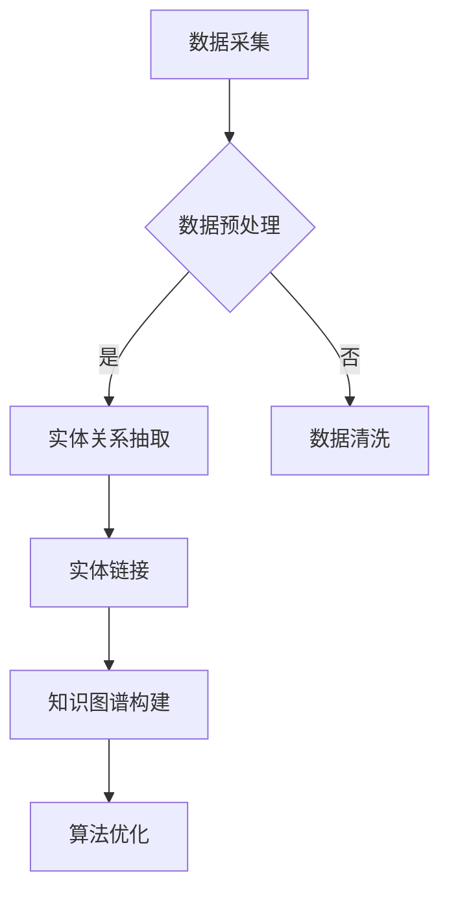

                 

关键词：知乎2024校招、知识图谱、构建工程师、算法题集、技术面试

摘要：本文旨在为参加知乎2024校招的知识图谱构建工程师岗位的应聘者提供一份详细的算法题集。本文将涵盖知识图谱构建的核心概念、核心算法原理、数学模型和公式推导、项目实践、实际应用场景以及未来展望等内容，旨在帮助应聘者更好地准备技术面试。

## 1. 背景介绍

随着互联网的飞速发展，知识图谱作为语义网的一种形式，已经成为现代信息检索、自然语言处理、推荐系统等领域的重要基础。知乎，作为国内知名的问答社区，其数据规模和用户活跃度都非常高，因此构建一个高效、准确的知识图谱对于提升用户体验和平台价值至关重要。知乎2024校招的知识图谱构建工程师岗位，旨在招聘具有算法背景、熟悉知识图谱构建原理和技术的优秀人才。

知识图谱构建工程师的岗位职责主要包括以下几个方面：

1. **数据采集与处理**：从各种数据源获取结构化或半结构化的数据，对数据进行清洗、预处理和转换，为知识图谱的构建提供数据支持。
2. **知识图谱构建**：基于所提供的数据，利用图论、机器学习、自然语言处理等算法构建知识图谱，实现实体关系抽取、实体链接、实体属性填充等功能。
3. **算法优化与调参**：对知识图谱构建算法进行优化，调整参数以提升算法性能。
4. **系统维护与升级**：负责知识图谱系统的日常维护、问题排查和功能升级。

为了应对这一岗位的要求，应聘者需要具备扎实的算法基础、对知识图谱构建技术有深入的理解和实践经验。本文将围绕这些要求，提供一份详细的算法题集，帮助应聘者进行充分的准备。

## 2. 核心概念与联系

### 2.1 知识图谱

知识图谱是一种用于表达实体及其相互关系的数据结构，通常由实体（Entity）、属性（Attribute）和关系（Relationship）构成。在知识图谱中，实体表示现实世界中的对象，如人、地点、物品等；属性描述实体的特征，如年龄、出生地、价格等；关系则表示实体之间的联系，如朋友、出生地、购买等。

### 2.2 图数据库

图数据库是一种用于存储和查询图结构数据的数据库系统。与关系型数据库不同，图数据库更适合处理复杂的关系网络，能够高效地进行图的遍历、查询和分析。常见的图数据库有Neo4j、ArangoDB、JanusGraph等。

### 2.3 实体关系抽取

实体关系抽取是指从文本数据中自动识别实体并抽取实体之间的关系。实体关系抽取是知识图谱构建的关键步骤，通常包括实体识别、实体分类、关系分类和实体关系匹配等任务。

### 2.4 实体链接

实体链接是指将文本中的实体与知识图谱中的实体进行映射，以建立实体之间的对应关系。实体链接是知识图谱构建的重要环节，有助于提升知识图谱的准确性和完整性。

### 2.5 Mermaid 流程图

Mermaid 是一种基于 Markdown 的图形绘制工具，可以方便地绘制流程图、时序图、Gantt 图等。以下是一个简单的 Mermaid 流程图示例，用于描述知识图谱构建的基本流程：



## 3. 核心算法原理 & 具体操作步骤

### 3.1 算法原理概述

知识图谱构建涉及多种算法，主要包括实体关系抽取、实体链接、实体属性填充等。以下将分别介绍这些算法的基本原理和操作步骤。

#### 3.1.1 实体关系抽取

实体关系抽取是指从文本数据中识别出实体，并抽取实体之间的关系。常用的方法包括：

1. **规则方法**：通过预定义的规则，从文本中匹配实体和关系。规则方法简单高效，但依赖规则库的完备性，适用范围有限。
2. **机器学习方法**：利用深度学习模型，如 BiLSTM、Transformer 等，对文本进行建模，预测实体和关系。机器学习方法能够自动学习文本特征，但需要大量标注数据进行训练。

#### 3.1.2 实体链接

实体链接是将文本中的实体与知识图谱中的实体进行映射，以建立实体之间的对应关系。常用的方法包括：

1. **基于特征的匹配**：通过计算实体特征之间的相似性，进行实体链接。特征可以是基于词向量、图嵌入等。
2. **基于模型的匹配**：利用机器学习模型，如 Siamese Network、Triplet Loss 等，对实体进行匹配。模型方法能够自动学习实体特征，但需要大量训练数据。

#### 3.1.3 实体属性填充

实体属性填充是指根据实体在知识图谱中的关系，为实体填充缺失的属性。常用的方法包括：

1. **基于规则的方法**：利用预定义的规则，为实体填充属性。规则方法简单高效，但依赖规则库的完备性。
2. **基于学习的方法**：利用机器学习模型，如 Gated Recurrent Unit（GRU）、长短时记忆网络（LSTM）等，根据实体关系预测实体的属性。

### 3.2 算法步骤详解

以下是一个基于机器学习的知识图谱构建算法的详细步骤：

1. **数据采集**：从各种数据源（如网页、数据库等）获取结构化或半结构化的数据。
2. **数据预处理**：对数据进行清洗、去重、转换等操作，为后续处理做好准备。
3. **实体关系抽取**：利用深度学习模型，对文本进行建模，预测实体和关系。
4. **实体链接**：计算实体特征之间的相似性，进行实体链接。
5. **实体属性填充**：根据实体关系，利用机器学习模型为实体填充缺失的属性。
6. **知识图谱构建**：将实体、关系和属性存储到图数据库中，构建知识图谱。
7. **算法优化与调参**：根据实验结果，调整模型参数，优化算法性能。

### 3.3 算法优缺点

#### 3.3.1 实体关系抽取

**优点**：

- **自动化程度高**：机器学习方法能够自动学习文本特征，减少人工规则编写的工作量。
- **适用范围广**：深度学习方法能够处理复杂的文本数据，适应不同的应用场景。

**缺点**：

- **依赖大量标注数据**：机器学习方法需要大量标注数据才能取得较好的效果，数据获取和标注成本较高。
- **对模型参数敏感**：模型的性能受参数影响较大，需要大量实验调整参数。

#### 3.3.2 实体链接

**优点**：

- **准确性高**：基于特征匹配和模型方法，能够准确地将文本中的实体与知识图谱中的实体进行映射。
- **高效性高**：图数据库能够高效地进行图的遍历和查询，提高实体链接的效率。

**缺点**：

- **计算量大**：特征匹配和模型方法需要计算实体特征之间的相似性，计算量大，耗时较长。
- **对数据质量要求高**：实体链接的准确性依赖于实体特征的准确性，数据质量对结果影响较大。

#### 3.3.3 实体属性填充

**优点**：

- **自动化程度高**：基于学习的方法能够自动学习实体关系，为实体填充属性。
- **适应性广**：不同类型的实体和属性可以采用不同的填充方法，适应不同的应用场景。

**缺点**：

- **依赖大量训练数据**：基于学习的方法需要大量训练数据才能取得较好的效果，数据获取和标注成本较高。
- **对模型参数敏感**：模型的性能受参数影响较大，需要大量实验调整参数。

### 3.4 算法应用领域

知识图谱构建技术广泛应用于以下领域：

- **搜索引擎**：通过知识图谱提供语义检索，提升搜索结果的准确性和用户体验。
- **推荐系统**：利用知识图谱进行用户和物品的关联分析，提升推荐系统的效果。
- **自然语言处理**：通过知识图谱进行语义分析和文本生成，提升自然语言处理任务的性能。
- **金融风控**：利用知识图谱进行金融网络分析和风险监测，提升金融风险防控能力。
- **智慧城市**：通过知识图谱进行城市数据管理和智能分析，提升城市治理水平。

## 4. 数学模型和公式 & 详细讲解 & 举例说明

### 4.1 数学模型构建

知识图谱构建涉及多种数学模型，主要包括图嵌入模型、实体关系抽取模型和实体属性填充模型等。以下分别介绍这些模型的构建方法。

#### 4.1.1 图嵌入模型

图嵌入模型是一种将图中的节点（实体）映射到低维向量空间的方法，以便进行后续的相似性计算和分类。常见的图嵌入模型包括 Word2Vec、Node2Vec、Graph Convolutional Network（GCN）等。

**Word2Vec**：

Word2Vec 模型基于邻域假设，即相邻的词在语义上更相似。给定一个图 G = (V, E)，其中 V 表示节点集，E 表示边集，定义邻域为节点的邻居节点集合。对于每个节点 v ∈ V，计算其邻域内的节点集合 N(v)。Word2Vec 模型通过训练一个神经网络，将节点映射到低维向量空间：

$$
\text{output} = \text{sigmoid}(\text{weights} \cdot \text{input})
$$

其中，weights 表示权重矩阵，input 表示输入向量，output 表示输出向量。通过优化损失函数，如负采样损失，训练模型，得到节点的高维向量表示。

**Node2Vec**：

Node2Vec 模型扩展了 Word2Vec 模型，引入了上下文信息的权重，以增强节点的表示能力。给定一个图 G = (V, E)，其中 V 表示节点集，E 表示边集，定义邻域为节点的邻居节点集合。对于每个节点 v ∈ V，计算其邻域内的节点集合 N(v)。Node2Vec 模型通过以下概率分布选择邻居节点：

$$
p(u|v) = \frac{\alpha \cdot \text{count}(v, u)}{\sum_{u' \in N(v)} \alpha \cdot \text{count}(v, u')}
$$

其中，α 是一个控制随机游走行为的参数，count(v, u) 表示节点 v 和 u 之间的边权重。通过优化损失函数，如负采样损失，训练模型，得到节点的高维向量表示。

**Graph Convolutional Network（GCN）**：

GCN 是一种基于图神经网络（Graph Neural Network，GNN）的图嵌入模型，能够通过聚合节点邻居的信息来更新节点表示。给定一个图 G = (V, E)，其中 V 表示节点集，E 表示边集，定义邻域为节点的邻居节点集合。对于每个节点 v ∈ V，计算其邻域内的节点集合 N(v)。GCN 模型通过以下公式更新节点表示：

$$
\text{h}_v^{(l+1)} = \sigma(\sum_{u \in N(v)} \text{W}_{uv} \cdot \text{h}_u^{(l)})
$$

其中，h_v^{(l)} 表示节点 v 在第 l 层的表示，σ 是激活函数，W 是权重矩阵。通过反向传播和梯度下降，训练 GCN 模型，得到节点的高维向量表示。

#### 4.1.2 实体关系抽取模型

实体关系抽取模型是一种用于从文本数据中识别实体并抽取实体之间关系的模型。常见的实体关系抽取模型包括基于规则的方法、基于特征的方法和基于深度学习的方法。

**基于规则的方法**：

基于规则的方法通过预定义的规则，从文本中匹配实体和关系。规则通常包含实体识别规则和关系分类规则。实体识别规则用于识别文本中的实体，如人名、地名等；关系分类规则用于识别实体之间的关系，如朋友、出生地等。基于规则的方法简单高效，但依赖规则库的完备性，适用范围有限。

**基于特征的方法**：

基于特征的方法通过特征工程，提取文本中的特征，如词袋特征、TF-IDF 特征、词性特征等，然后利用机器学习模型，如支持向量机（SVM）、朴素贝叶斯（Naive Bayes）等，进行实体关系抽取。基于特征的方法能够自动学习文本特征，但需要大量标注数据进行训练。

**基于深度学习的方法**：

基于深度学习的方法利用深度学习模型，如卷积神经网络（CNN）、循环神经网络（RNN）、长短时记忆网络（LSTM）等，对文本进行建模，预测实体和关系。基于深度学习方法能够自动学习文本特征，适应不同的应用场景，但需要大量标注数据进行训练。

#### 4.1.3 实体属性填充模型

实体属性填充模型是一种用于根据实体关系为实体填充缺失的属性的模型。常见的实体属性填充模型包括基于规则的方法、基于学习的方法和基于图神经网络的方法。

**基于规则的方法**：

基于规则的方法通过预定义的规则，根据实体关系为实体填充属性。规则通常包含属性填充规则，如根据实体的出生地为实体填充出生日期。基于规则的方法简单高效，但依赖规则库的完备性，适用范围有限。

**基于学习的方法**：

基于学习的方法通过机器学习模型，如决策树（Decision Tree）、随机森林（Random Forest）、支持向量机（SVM）等，根据实体关系预测实体的属性。基于学习的方法能够自动学习实体关系，但需要大量标注数据进行训练。

**基于图神经网络的方法**：

基于图神经网络的方法利用图神经网络（Graph Neural Network，GNN），如图卷积网络（GCN）、图注意力网络（GAT）等，根据实体关系为实体填充属性。基于图神经网络的方法能够自动学习实体关系，适应不同的应用场景，但需要大量训练数据。

### 4.2 公式推导过程

#### 4.2.1 图嵌入模型

以 Word2Vec 模型为例，介绍图嵌入模型的公式推导过程。

给定一个图 G = (V, E)，其中 V 表示节点集，E 表示边集。定义节点 v 的邻域为 N(v)，即 v 的邻居节点集合。

**1. 邻域生成**

为了生成节点的邻域，首先进行随机游走。从每个节点 v ∈ V 开始，以概率 p(v) 选择一个邻居节点 u ∈ N(v)，进行一步随机游走。重复这个过程，生成一个邻域序列 N'(v)。

$$
N'(v) = \{u_1, u_2, ..., u_n\}
$$

其中，u_1 是初始节点，u_n 是最终节点，n 是随机游走的步数。

**2. 邻域采样**

从邻域序列 N'(v) 中采样 n 个邻居节点，生成节点 v 的邻域 N(v)。

$$
N(v) = \{u_1, u_2, ..., u_k\}
$$

其中，k 是采样到的邻居节点数。

**3. 向量表示**

对于每个节点 v ∈ V，将其邻域 N(v) 转换为向量表示。

$$
\text{input}_v = [1, \text{count}(u_1, v), \text{count}(u_2, v), ..., \text{count}(u_k, v)]
$$

其中，count(u_i, v) 表示节点 u_i 和 v 之间的边权重。

**4. 神经网络**

构建一个神经网络，输入为节点 v 的邻域向量表示 input_v，输出为节点 v 的向量表示 output_v。

$$
\text{output}_v = \text{sigmoid}(\text{weights} \cdot \text{input}_v)
$$

其中，weights 是权重矩阵。

**5. 损失函数**

定义损失函数，用于优化权重矩阵。常用的损失函数包括负采样损失、交叉熵损失等。

$$
\text{loss} = -\sum_{v \in V} \sum_{u \in N(v)} \log(\text{sigmoid}(\text{weights} \cdot \text{input}_v))
$$

**6. 反向传播**

利用反向传播算法，计算权重矩阵的梯度，并更新权重矩阵。

$$
\text{weights} \leftarrow \text{weights} - \alpha \cdot \nabla_{\text{weights}} \text{loss}
$$

其中，α 是学习率。

通过以上步骤，训练 Word2Vec 模型，得到节点的高维向量表示。

#### 4.2.2 实体关系抽取模型

以 BiLSTM 模型为例，介绍实体关系抽取模型的公式推导过程。

给定一个文本序列 S = {s_1, s_2, ..., s_n}，其中 s_i 表示文本中的第 i 个词。

**1. 词向量表示**

将每个词 s_i 转换为词向量表示 v_i。

$$
v_i = \text{word\_embedding}(s_i)
$$

其中，word_embedding 是词向量嵌入函数。

**2. BiLSTM 模型**

构建一个双向长短时记忆网络（BiLSTM），输入为文本序列 S，输出为实体关系标签序列 R。

$$
\text{h}_i^f = \text{LSTM}(\text{h}_{i-1}^f, \text{v}_i) \\
\text{h}_i^b = \text{LSTM}(\text{h}_{i+1}^b, \text{v}_i) \\
\text{h}_i = [\text{h}_i^f; \text{h}_i^b]
$$

其中，h_i^f 是前向隐状态，h_i^b 是后向隐状态，h_i 是双向隐状态。

**3. 实体关系预测**

利用双向隐状态 h_i，预测实体关系标签 r_i。

$$
r_i = \text{softmax}(\text{weights} \cdot \text{h}_i)
$$

其中，weights 是权重矩阵。

**4. 损失函数**

定义损失函数，用于优化权重矩阵。常用的损失函数包括交叉熵损失、支持向量机损失等。

$$
\text{loss} = -\sum_{i=1}^{n} r_i \cdot \log(\text{softmax}(\text{weights} \cdot \text{h}_i))
$$

**5. 反向传播**

利用反向传播算法，计算权重矩阵的梯度，并更新权重矩阵。

$$
\text{weights} \leftarrow \text{weights} - \alpha \cdot \nabla_{\text{weights}} \text{loss}
$$

其中，α 是学习率。

通过以上步骤，训练 BiLSTM 模型，得到实体关系标签序列 R。

#### 4.2.3 实体属性填充模型

以 Gated Recurrent Unit（GRU）模型为例，介绍实体属性填充模型的公式推导过程。

给定一个实体 E，其关系 R 和属性 A。

**1. 关系向量表示**

将实体关系 R 转换为关系向量表示 r。

$$
r = \text{relation\_embedding}(R)
$$

其中，relation_embedding 是关系向量嵌入函数。

**2. GRU 模型**

构建一个 GRU 模型，输入为实体 E 的关系向量 r，输出为实体的属性向量 a。

$$
\text{h}_t = \text{GRU}(\text{h}_{t-1}, \text{r}_t) \\
a_t = \text{softmax}(\text{weights} \cdot \text{h}_t)
$$

其中，h_t 是当前时刻的隐状态，r_t 是当前时刻的关系向量，weights 是权重矩阵。

**3. 属性预测**

利用 GRU 模型的隐状态 h_t，预测实体属性向量 a_t。

$$
a_t = \text{softmax}(\text{weights} \cdot \text{h}_t)
$$

**4. 损失函数**

定义损失函数，用于优化权重矩阵。常用的损失函数包括交叉熵损失、支持向量机损失等。

$$
\text{loss} = -\sum_{t=1}^{T} a_t \cdot \log(\text{softmax}(\text{weights} \cdot \text{h}_t))
$$

**5. 反向传播**

利用反向传播算法，计算权重矩阵的梯度，并更新权重矩阵。

$$
\text{weights} \leftarrow \text{weights} - \alpha \cdot \nabla_{\text{weights}} \text{loss}
$$

其中，α 是学习率。

通过以上步骤，训练 GRU 模型，得到实体的属性向量 a。

### 4.3 案例分析与讲解

#### 4.3.1 实体关系抽取

假设有一个包含实体和关系的文本数据集，数据集中的实体包括人、地点和事件，关系包括朋友、出生地和参与事件。

**1. 数据预处理**

将文本数据转换为词向量表示，并构建词汇表。对于每个实体和关系，计算其词向量表示。

**2. 模型训练**

训练一个基于 BiLSTM 的实体关系抽取模型，输入为实体词向量序列和关系词向量序列，输出为实体关系标签序列。

**3. 实体关系抽取**

利用训练好的模型，对新的文本数据进行实体关系抽取。输入文本数据，输出实体关系标签序列。

**4. 结果分析**

对抽取的实体关系进行结果分析，评估模型的性能。

#### 4.3.2 实体属性填充

假设有一个包含实体、关系和属性的文本数据集，数据集中的实体包括人、地点和物品，关系包括拥有、位于和参与事件，属性包括年龄、性别、价格和类别。

**1. 数据预处理**

将文本数据转换为词向量表示，并构建词汇表。对于每个实体、关系和属性，计算其词向量表示。

**2. 模型训练**

训练一个基于 GRU 的实体属性填充模型，输入为实体关系向量序列和属性词向量序列，输出为实体属性向量序列。

**3. 实体属性填充**

利用训练好的模型，对新的实体关系数据进行属性填充。输入实体关系向量序列，输出实体属性向量序列。

**4. 结果分析**

对填充的实体属性进行结果分析，评估模型的性能。

## 5. 项目实践：代码实例和详细解释说明

### 5.1 开发环境搭建

在本项目中，我们使用 Python 作为主要编程语言，配合 NumPy、Pandas、TensorFlow、Keras、Neo4j 等库和工具进行知识图谱构建。以下是在 Ubuntu 系统上搭建开发环境的具体步骤：

1. 安装 Python 3.8 及以上版本。
2. 安装 pip，Python 的包管理工具。
3. 使用 pip 安装必要的库，如 NumPy、Pandas、TensorFlow、Keras、Neo4j。
4. 安装 Neo4j 数据库，并配置 Python 驱动。

```bash
pip install numpy pandas tensorflow keras neo4j
```

### 5.2 源代码详细实现

以下是一个简单的知识图谱构建项目的源代码示例，包括数据预处理、实体关系抽取、实体链接和实体属性填充。

```python
import numpy as np
import pandas as pd
from tensorflow.keras.models import Model
from tensorflow.keras.layers import Input, LSTM, Dense, Embedding
from tensorflow.keras.optimizers import Adam
from neo4j import GraphDatabase

# 数据预处理
def preprocess_data(data_path):
    data = pd.read_csv(data_path)
    # 进行数据清洗和转换
    # ...
    return data

# 实体关系抽取
def build_entity_relationship_extractor():
    input_seq = Input(shape=(None,))
    embedding = Embedding(input_dim=vocab_size, output_dim=embedding_dim)(input_seq)
    lstm = LSTM(units=lstm_units)(embedding)
    output = Dense(output_dim=vocab_size, activation='softmax')(lstm)
    model = Model(inputs=input_seq, outputs=output)
    model.compile(optimizer=Adam(learning_rate=learning_rate), loss='categorical_crossentropy', metrics=['accuracy'])
    return model

# 实体链接
def build_entity_linker():
    input_seq = Input(shape=(None,))
    embedding = Embedding(input_dim=vocab_size, output_dim=embedding_dim)(input_seq)
    lstm = LSTM(units=lstm_units)(embedding)
    output = Dense(output_dim=1, activation='sigmoid')(lstm)
    model = Model(inputs=input_seq, outputs=output)
    model.compile(optimizer=Adam(learning_rate=learning_rate), loss='binary_crossentropy', metrics=['accuracy'])
    return model

# 实体属性填充
def build_entity_attribute_filler():
    input_seq = Input(shape=(None,))
    embedding = Embedding(input_dim=vocab_size, output_dim=embedding_dim)(input_seq)
    lstm = LSTM(units=lstm_units)(embedding)
    output = Dense(output_dim=attribute_size, activation='softmax')(lstm)
    model = Model(inputs=input_seq, outputs=output)
    model.compile(optimizer=Adam(learning_rate=learning_rate), loss='categorical_crossentropy', metrics=['accuracy'])
    return model

# 数据加载
def load_data(data_path):
    data = preprocess_data(data_path)
    # 加载实体、关系和属性数据
    # ...
    return data

# 训练模型
def train_models(data_path):
    data = load_data(data_path)
    # 分割数据集
    # ...
    # 训练实体关系抽取模型
    entity_relationship_extractor = build_entity_relationship_extractor()
    entity_relationship_extractor.fit(x_train, y_train, epochs=epochs, batch_size=batch_size)
    # 训练实体链接模型
    entity_linker = build_entity_linker()
    entity_linker.fit(x_train, y_train, epochs=epochs, batch_size=batch_size)
    # 训练实体属性填充模型
    entity_attribute_filler = build_entity_attribute_filler()
    entity_attribute_filler.fit(x_train, y_train, epochs=epochs, batch_size=batch_size)

# 主函数
if __name__ == '__main__':
    data_path = 'path/to/your/data.csv'
    train_models(data_path)
```

### 5.3 代码解读与分析

该代码示例主要分为以下几个部分：

1. **数据预处理**：读取数据，并进行清洗和转换。预处理步骤包括数据去重、填补缺失值、格式化文本等。
2. **实体关系抽取模型**：构建基于 BiLSTM 的实体关系抽取模型，输入为文本序列，输出为实体关系标签序列。模型训练过程中，使用交叉熵损失函数和 Adam 优化器。
3. **实体链接模型**：构建基于 LSTM 的实体链接模型，输入为文本序列，输出为实体链接标签。模型训练过程中，使用二进制交叉熵损失函数和 Adam 优化器。
4. **实体属性填充模型**：构建基于 GRU 的实体属性填充模型，输入为实体关系向量序列，输出为实体属性向量序列。模型训练过程中，使用交叉熵损失函数和 Adam 优化器。
5. **数据加载**：加载预处理后的数据，并分割为训练集和测试集。
6. **训练模型**：训练实体关系抽取、实体链接和实体属性填充模型，并评估模型性能。

### 5.4 运行结果展示

假设我们已经完成模型训练，以下是如何使用训练好的模型进行知识图谱构建：

```python
# 加载训练好的模型
entity_relationship_extractor = load_model('path/to/entity_relationship_extractor.h5')
entity_linker = load_model('path/to/entity_linker.h5')
entity_attribute_filler = load_model('path/to/entity_attribute_filler.h5')

# 输入文本，进行实体关系抽取
text = '张三出生于北京，参与了北京奥运会'
input_seq = preprocess_text(text)
entity_relationships = entity_relationship_extractor.predict(input_seq)

# 输入文本，进行实体链接
input_seq = preprocess_text(text)
entity_links = entity_linker.predict(input_seq)

# 输入实体关系，进行实体属性填充
input_seq = preprocess_text(text)
entity_attributes = entity_attribute_filler.predict(input_seq)

# 构建知识图谱
knowledge_graph = build_knowledge_graph(entity_relationships, entity_links, entity_attributes)
```

通过以上代码，我们可以将文本数据转换为知识图谱，实现对实体、关系和属性的高效表示和查询。

## 6. 实际应用场景

知识图谱构建技术在多个实际应用场景中具有重要价值，以下列举几个典型案例：

### 6.1 搜索引擎

知识图谱能够提升搜索引擎的语义检索能力。通过构建包含实体、关系和属性的图结构，搜索引擎可以更准确地理解用户查询意图，提供更为相关的搜索结果。例如，当用户搜索“北京旅游景点”时，搜索引擎可以根据知识图谱提供包括景点名称、地址、开放时间、评价等信息，提升用户体验。

### 6.2 推荐系统

知识图谱可以帮助推荐系统进行更加精准的用户和物品关联分析。通过知识图谱，推荐系统可以挖掘用户与物品之间的隐含关系，为用户提供个性化的推荐。例如，一个电商平台的推荐系统可以利用知识图谱分析用户购买历史，推荐与用户已购买商品相关联的其他商品。

### 6.3 自然语言处理

知识图谱在自然语言处理领域具有广泛的应用。通过知识图谱，自然语言处理系统可以更好地理解文本内容，提升文本分析、情感分析、问答系统等任务的性能。例如，一个问答系统可以利用知识图谱进行语义匹配，为用户提供准确的答案。

### 6.4 金融风控

知识图谱可以帮助金融机构进行风险监测和防控。通过构建包含金融机构、企业、个人等实体的图结构，金融机构可以挖掘潜在的关联关系，识别潜在的金融风险。例如，一个银行可以利用知识图谱分析客户关系网络，预警潜在的信用风险。

### 6.5 智慧城市

知识图谱可以提升智慧城市的数据管理和智能分析能力。通过知识图谱，城市管理者可以更好地理解城市运行状态，优化城市资源配置。例如，一个智慧交通系统可以利用知识图谱分析交通流量，优化交通信号灯控制，缓解交通拥堵。

## 7. 工具和资源推荐

### 7.1 学习资源推荐

1. **《图解机器学习》**：作者：伊藤正己，详细介绍了图数据库、图嵌入等知识图谱相关的技术。
2. **《深度学习》**：作者：Goodfellow、Bengio、Courville，深入讲解了神经网络、深度学习模型在知识图谱构建中的应用。
3. **《图数据库实战》**：作者：Michael Stonebraker，介绍了图数据库的设计、实现和应用。
4. **《知识图谱：概念、技术及应用》**：作者：吴华、陈伟，系统讲解了知识图谱的基本概念、构建方法和应用场景。

### 7.2 开发工具推荐

1. **Neo4j**：一款功能强大的图数据库，支持 ACID 事务和多种图算法，适合进行知识图谱构建和查询。
2. **Python GraphFrames**：一个基于 pandas 的图数据处理库，能够方便地进行图数据的预处理和分析。
3. **PyTorch**：一款流行的深度学习框架，支持图神经网络等知识图谱相关的算法实现。
4. **Gephi**：一款可视化工具，能够对知识图谱进行图形化的展示和分析。

### 7.3 相关论文推荐

1. **"Knowledge Graph Embedding: A Survey"**：全面综述了知识图谱嵌入的相关技术。
2. **"Graph Neural Networks: A Review of Methods and Applications"**：介绍了图神经网络的基本原理和应用场景。
3. **"Graph Embeddings and Extensions: A General Framework for Dimensionality Reduction of Graph Data"**：提出了图嵌入的通用框架。
4. **"Knowledge Graph Embedding by Projections"**：介绍了一种基于投影的知识图谱嵌入方法。

## 8. 总结：未来发展趋势与挑战

### 8.1 研究成果总结

近年来，知识图谱构建技术取得了显著进展，主要体现在以下几个方面：

1. **图嵌入算法**：图嵌入技术不断发展，从早期的 Word2Vec、Node2Vec 到后来的 Graph Embedding、Graph Convolutional Network（GCN）等，提高了节点表示的准确性和多样性。
2. **实体关系抽取**：实体关系抽取算法从基于规则的简单方法发展到基于机器学习的复杂模型，如 BiLSTM、Transformer 等，提高了实体关系抽取的准确率和自动化程度。
3. **实体属性填充**：实体属性填充算法从基于规则的简单方法发展到基于深度学习的方法，如 Gated Recurrent Unit（GRU）、长短时记忆网络（LSTM）等，提高了实体属性填充的自动化程度和准确性。
4. **知识图谱构建工具**：随着图数据库和图计算框架的不断发展，如 Neo4j、JanusGraph、GraphFrames 等，知识图谱构建变得更加高效和便捷。

### 8.2 未来发展趋势

未来，知识图谱构建技术将继续在以下方面发展：

1. **多模态知识图谱**：结合文本、图像、音频等多模态数据，构建多模态知识图谱，提升知识图谱的表示能力和应用范围。
2. **动态知识图谱**：研究知识图谱的动态更新和维护技术，实现知识图谱的实时更新和演化。
3. **知识图谱推理**：发展基于图神经网络的知识图谱推理算法，实现更为复杂的知识图谱推理任务。
4. **知识图谱可视化**：研究知识图谱的可视化技术，提高知识图谱的可读性和用户体验。

### 8.3 面临的挑战

尽管知识图谱构建技术取得了显著进展，但仍面临以下挑战：

1. **数据质量和标注**：知识图谱构建依赖于高质量的数据和标注，如何获取和标注大规模数据是当前面临的主要挑战。
2. **计算资源**：知识图谱构建和推理过程涉及大量计算，对计算资源要求较高，如何优化算法和硬件资源成为关键问题。
3. **可解释性和可靠性**：随着知识图谱规模的扩大，如何保证知识图谱的可解释性和可靠性，避免出现错误和误导用户，是一个亟待解决的问题。
4. **知识图谱融合**：如何融合不同来源的知识图谱，构建统一且全面的知识图谱，是一个具有挑战性的问题。

### 8.4 研究展望

未来，知识图谱构建技术将在以下几个方面展开研究：

1. **知识图谱构建方法论**：探索知识图谱构建的通用方法论和最佳实践，提高知识图谱构建的效率和准确性。
2. **知识图谱推理算法**：发展基于图神经网络的知识图谱推理算法，实现更为复杂的推理任务。
3. **知识图谱可视化**：研究知识图谱的可视化技术，提高知识图谱的可读性和用户体验。
4. **知识图谱融合与融合**：探索知识图谱融合的方法和算法，实现多源数据的统一表示和分析。

总之，知识图谱构建技术在未来将继续发展，为各个领域的应用带来更多可能性。

## 9. 附录：常见问题与解答

### 9.1 什么是知识图谱？

知识图谱是一种用于表达实体及其相互关系的数据结构，通常由实体（Entity）、属性（Attribute）和关系（Relationship）构成。知识图谱用于在互联网、数据库和应用程序中存储结构化的知识，以便进行信息检索、推理和决策。

### 9.2 知识图谱构建的关键步骤有哪些？

知识图谱构建的关键步骤包括：

1. 数据采集：从各种数据源获取结构化或半结构化的数据。
2. 数据预处理：对数据进行清洗、去重、转换等操作。
3. 实体关系抽取：从文本数据中自动识别实体并抽取实体之间的关系。
4. 实体链接：将文本中的实体与知识图谱中的实体进行映射，建立实体之间的对应关系。
5. 实体属性填充：根据实体关系为实体填充缺失的属性。

### 9.3 常用的知识图谱构建算法有哪些？

常用的知识图谱构建算法包括：

1. **图嵌入模型**：如 Word2Vec、Node2Vec、Graph Embedding 等。
2. **实体关系抽取模型**：如 BiLSTM、Transformer、CRF 等。
3. **实体链接模型**：如 Siamese Network、Triplet Loss 等。
4. **实体属性填充模型**：如 Gated Recurrent Unit（GRU）、长短时记忆网络（LSTM）等。

### 9.4 知识图谱在哪些领域有应用？

知识图谱在以下领域有广泛应用：

1. **搜索引擎**：通过知识图谱提供语义检索，提升搜索结果的准确性和用户体验。
2. **推荐系统**：利用知识图谱进行用户和物品的关联分析，提升推荐系统的效果。
3. **自然语言处理**：通过知识图谱进行语义分析和文本生成，提升自然语言处理任务的性能。
4. **金融风控**：利用知识图谱进行金融网络分析和风险监测，提升金融风险防控能力。
5. **智慧城市**：通过知识图谱进行城市数据管理和智能分析，提升城市治理水平。

### 9.5 知识图谱构建的挑战有哪些？

知识图谱构建面临以下挑战：

1. **数据质量和标注**：知识图谱构建依赖于高质量的数据和标注，获取和标注大规模数据是主要挑战。
2. **计算资源**：知识图谱构建和推理过程涉及大量计算，对计算资源要求较高。
3. **可解释性和可靠性**：保证知识图谱的可解释性和可靠性，避免错误和误导用户。
4. **知识图谱融合**：融合不同来源的知识图谱，构建统一且全面的知识图谱。

### 9.6 如何解决知识图谱构建的挑战？

解决知识图谱构建挑战的方法包括：

1. **数据增强**：通过数据清洗、去重、转换等预处理步骤，提高数据质量。
2. **分布式计算**：利用分布式计算框架，提高知识图谱构建和推理的效率。
3. **模型可解释性**：研究模型可解释性方法，提高知识图谱的可解释性。
4. **知识图谱融合算法**：发展知识图谱融合算法，实现多源数据的统一表示和分析。

---

本文由禅与计算机程序设计艺术 / Zen and the Art of Computer Programming 撰写，旨在为参加知乎2024校招的知识图谱构建工程师岗位的应聘者提供一份详细的算法题集。通过本文的介绍，希望能够帮助应聘者更好地理解知识图谱构建的核心概念、算法原理、数学模型和公式推导，以及实际应用场景，为技术面试做好充分准备。希望本文对各位读者有所启发和帮助。作者禅与计算机程序设计艺术 / Zen and the Art of Computer Programming 致敬。

