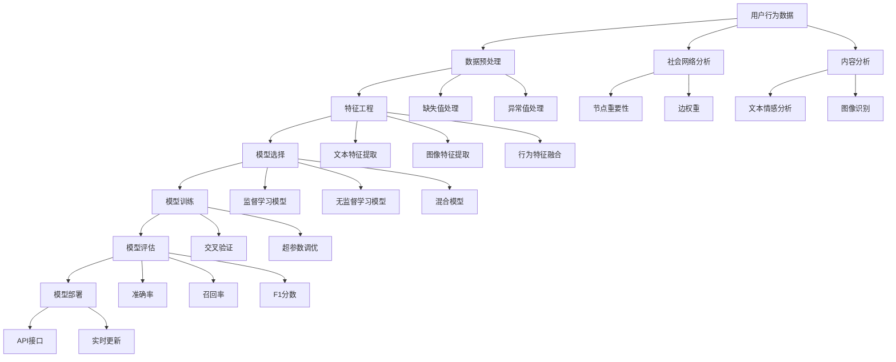

                 

 

## 1. 背景介绍

随着互联网的迅猛发展，社交媒体平台如雨后春笋般涌现。知乎，作为知识分享和问答社区的代表，近年来吸引了大量用户。用户在知乎上的行为，如提问、回答、点赞、评论等，不仅丰富了平台的社区氛围，也为平台提供了大量有价值的数据。然而，如何有效地预测用户的行为，对于提升用户体验、精准推送内容、优化社区运营等具有重要意义。

用户行为预测，是指利用历史数据、社会关系、内容特征等信息，通过构建合适的模型和算法，对未来用户的行为进行预测。在知乎这样的社区平台，用户行为预测的应用场景广泛，例如：

- **内容推荐**：根据用户的浏览历史、提问和回答内容，预测用户可能感兴趣的问题和话题，从而提供个性化的内容推荐。
- **社区运营**：通过分析用户行为，预测哪些话题或问题可能引发热烈的讨论，从而有针对性地引导和促进社区互动。
- **风险控制**：监控异常用户行为，如恶意提问、恶意评论等，提前采取措施，维护社区秩序。

本文旨在探讨知乎2024年用户行为预测模型校招面试中可能涉及的关键知识点，包括核心概念、算法原理、数学模型构建以及实际应用场景等，帮助读者全面了解这一领域的最新动态和研究成果。

## 2. 核心概念与联系

在用户行为预测领域，有一些核心概念和原理是必不可少的。为了更好地理解这些概念，我们首先需要构建一个Mermaid流程图，展示它们之间的联系。



### 2.1 数据预处理

数据预处理是用户行为预测的第一步，它包括数据的清洗、格式化、归一化等。这一步骤的目的是确保数据的准确性和一致性。

- **缺失值处理**：对于缺失的数据，可以采用填充均值、中位数或使用模型预测等方法进行处理。
- **异常值处理**：异常值可能对模型产生不利影响，需要通过统计学方法或可视化工具检测并处理。
- **数据格式化**：将数据统一成相同的格式，便于后续的处理和分析。

### 2.2 特征工程

特征工程是用户行为预测的核心，它包括特征提取和特征选择。特征的质量直接影响模型的性能。

- **文本特征提取**：使用词袋模型、TF-IDF、Word2Vec等方法，将文本转化为数值特征。
- **图像特征提取**：使用卷积神经网络（CNN）等方法，从图像中提取特征。
- **行为特征融合**：将用户的各种行为数据（如浏览、点击、提问、回答等）进行整合，构建多维度的行为特征。

### 2.3 模型选择

模型选择是用户行为预测的关键步骤，不同的模型适用于不同的场景和数据类型。

- **监督学习模型**：如线性回归、决策树、随机森林、支持向量机（SVM）等，适用于有标签的数据。
- **无监督学习模型**：如聚类、主成分分析（PCA）等，适用于无标签的数据。
- **混合模型**：结合监督学习和无监督学习的优势，适用于复杂的数据场景。

### 2.4 模型训练

模型训练是用户行为预测的核心步骤，它包括模型的构建、参数的调整和训练。

- **交叉验证**：通过交叉验证，评估模型的性能，避免过拟合和欠拟合。
- **超参数调优**：调整模型的超参数，如学习率、隐藏层节点数等，以提升模型的性能。

### 2.5 模型评估

模型评估是确保模型性能的重要环节，常用的评估指标包括准确率、召回率、F1分数等。

- **准确率**：预测为正类且实际为正类的样本数占总样本数的比例。
- **召回率**：预测为正类且实际为正类的样本数占总实际正类样本数的比例。
- **F1分数**：准确率和召回率的调和平均，用于综合评估模型的性能。

### 2.6 模型部署

模型部署是将训练好的模型应用到实际场景中，包括API接口、实时更新等功能。

- **API接口**：通过API接口，将模型集成到现有系统中，实现自动化预测。
- **实时更新**：定期更新模型，以适应数据变化和业务需求。

### 2.7 社会网络分析

社会网络分析是用户行为预测的一个重要分支，它通过分析用户在网络中的关系，预测用户的行为。

- **节点重要性**：分析用户在网络中的重要性，识别关键用户。
- **边权重**：分析用户之间的互动关系，如点赞、评论、分享等，构建网络图。

### 2.8 内容分析

内容分析是用户行为预测的另一个重要方面，它通过分析用户生成的内容，预测用户的行为。

- **文本情感分析**：分析用户在文本中的情感倾向，如积极、消极、中立等。
- **图像识别**：通过卷积神经网络，识别用户上传的图像内容。

通过上述核心概念和联系，我们可以构建一个完整的用户行为预测模型，实现对知乎用户行为的准确预测。

## 3. 核心算法原理 & 具体操作步骤

在用户行为预测中，常用的算法包括监督学习模型、无监督学习模型和混合模型。以下将详细介绍这些算法的原理和具体操作步骤。

### 3.1 算法原理概述

#### 监督学习模型

监督学习模型是一种基于已有标签数据的学习方法，通过训练集学习得到一个映射函数，然后使用这个函数对测试集进行预测。常见的监督学习模型有线性回归、决策树、随机森林、支持向量机（SVM）等。

- **线性回归**：通过最小化损失函数，找到输入和输出之间的线性关系。
- **决策树**：根据特征值的不同，将数据划分为不同的分支，直到达到叶节点。
- **随机森林**：多个决策树的集成，通过投票或平均的方式得到最终预测结果。
- **支持向量机（SVM）**：通过找到一个最优的超平面，将不同类别的数据分开。

#### 无监督学习模型

无监督学习模型不需要标签数据，通过观察数据的内在结构和分布，对数据进行聚类、降维等操作。常见的方法有聚类、主成分分析（PCA）等。

- **聚类**：将相似的数据点归为一类，常用的算法有K-means、层次聚类等。
- **主成分分析（PCA）**：通过线性变换，将高维数据投影到低维空间，同时保留主要信息。

#### 混合模型

混合模型结合了监督学习和无监督学习的优势，适用于复杂的数据场景。常见的方法有集成学习、深度学习等。

- **集成学习**：通过组合多个基础模型，提高预测性能，如随机森林、梯度提升树（GBT）等。
- **深度学习**：通过构建多层神经网络，对复杂数据进行特征提取和分类。

### 3.2 算法步骤详解

#### 监督学习模型

1. **数据准备**：收集并预处理数据，包括数据的清洗、归一化等。
2. **特征选择**：选择对预测目标有重要影响的特征，去除无关或冗余特征。
3. **模型训练**：使用训练数据集，通过选择合适的算法，训练得到模型。
4. **模型评估**：使用测试数据集，评估模型的性能，如准确率、召回率、F1分数等。
5. **模型优化**：根据评估结果，调整模型参数，优化模型性能。

#### 无监督学习模型

1. **数据准备**：收集并预处理数据，包括数据的清洗、归一化等。
2. **特征提取**：使用无监督学习算法，提取数据的特征。
3. **模型训练**：使用训练数据集，通过选择合适的算法，训练得到模型。
4. **模型评估**：使用测试数据集，评估模型的性能，如聚类效果、降维效果等。
5. **模型优化**：根据评估结果，调整模型参数，优化模型性能。

#### 混合模型

1. **数据准备**：收集并预处理数据，包括数据的清洗、归一化等。
2. **特征选择**：选择对预测目标有重要影响的特征，去除无关或冗余特征。
3. **模型训练**：使用训练数据集，通过集成学习方法，训练得到模型。
4. **模型评估**：使用测试数据集，评估模型的性能，如准确率、召回率、F1分数等。
5. **模型优化**：根据评估结果，调整模型参数，优化模型性能。

### 3.3 算法优缺点

#### 监督学习模型

- **优点**：能够利用标签数据进行准确的预测，适用于有明确标签的数据集。
- **缺点**：需要大量的标签数据，对无标签数据不适用，且易过拟合。

#### 无监督学习模型

- **优点**：不需要标签数据，适用于无标签的数据集，可以探索数据的内在结构。
- **缺点**：预测结果不具有明确性，无法直接应用于实际场景，且易欠拟合。

#### 混合模型

- **优点**：结合了监督学习和无监督学习的优势，适用于复杂的数据场景，可以提高预测性能。
- **缺点**：模型复杂度较高，训练和评估时间较长，对计算资源要求较高。

### 3.4 算法应用领域

#### 监督学习模型

- **推荐系统**：利用用户的历史行为数据，预测用户可能感兴趣的内容。
- **风险控制**：监控用户行为，识别潜在的欺诈行为或异常行为。
- **文本分类**：对用户生成的文本进行分类，如情感分析、新闻分类等。

#### 无监督学习模型

- **数据降维**：通过主成分分析（PCA）等方法，将高维数据降维到低维空间，便于数据可视化和分析。
- **图像识别**：通过卷积神经网络（CNN）等方法，对图像进行分类和识别。
- **社交网络分析**：分析用户在网络中的关系，识别关键用户和群体。

#### 混合模型

- **智能客服**：结合用户行为数据和文本分析，提供个性化的客服服务。
- **个性化推荐**：结合用户行为数据和内容特征，提供个性化的内容推荐。
- **疾病预测**：结合医疗数据和基因数据，预测疾病发生的可能性。

通过以上对核心算法原理和具体操作步骤的介绍，我们可以看到，用户行为预测是一个复杂但充满挑战的领域。选择合适的算法，结合实际业务需求，可以有效地预测用户行为，提升用户体验和运营效果。

## 4. 数学模型和公式 & 详细讲解 & 举例说明

用户行为预测不仅依赖于算法，还需要构建精确的数学模型。以下将详细讲解用户行为预测中的几个关键数学模型和公式，并通过具体例子进行说明。

### 4.1 数学模型构建

在用户行为预测中，常见的数学模型包括概率模型、逻辑回归模型和时间序列模型。以下是这些模型的构建过程：

#### 概率模型

概率模型是用户行为预测的基础，它通过计算用户在未来某一时刻进行特定行为的概率，来进行预测。概率模型的基本公式如下：

\[ P(A|B) = \frac{P(B|A) \cdot P(A)}{P(B)} \]

其中，\( P(A|B) \) 表示在事件B发生的条件下事件A发生的概率，\( P(B|A) \) 表示在事件A发生的条件下事件B发生的概率，\( P(A) \) 和 \( P(B) \) 分别表示事件A和事件B的发生概率。

#### 逻辑回归模型

逻辑回归模型是一种常用的概率模型，它在用户行为预测中有着广泛的应用。逻辑回归模型的公式如下：

\[ \log\left(\frac{P(Y=1|X)}{1-P(Y=1|X)}\right) = \beta_0 + \beta_1X_1 + \beta_2X_2 + ... + \beta_nX_n \]

其中，\( Y \) 是用户的行为标签，\( X_1, X_2, ..., X_n \) 是输入特征，\( \beta_0, \beta_1, \beta_2, ..., \beta_n \) 是模型的参数。通过求解这个线性方程组，可以得到参数的估计值。

#### 时间序列模型

时间序列模型用于预测用户行为的时间序列数据。常见的时序模型包括ARIMA、LSTM等。以下是一个简单的ARIMA模型公式：

\[ Xt = \phi_0 + \phi_1X_{t-1} + \phi_2X_{t-2} + ... + \phi_pX_{t-p} + \theta_1\epsilon_{t-1} + \theta_2\epsilon_{t-2} + ... + \theta_q\epsilon_{t-q} + \epsilon_t \]

其中，\( Xt \) 是时间序列的当前值，\( \epsilon_t \) 是误差项，\( \phi_0, \phi_1, ..., \phi_p, \theta_1, \theta_2, ..., \theta_q \) 是模型的参数。

### 4.2 公式推导过程

为了更好地理解这些模型，我们以逻辑回归模型为例，进行公式的推导。

逻辑回归模型的推导基于最大似然估计（Maximum Likelihood Estimation, MLE）。首先，我们需要定义一个损失函数，用于衡量模型的预测误差。常用的损失函数是交叉熵损失（Cross-Entropy Loss），其公式如下：

\[ L(\theta) = -\sum_{i=1}^n \left[ y_i \log(\hat{y}_i) + (1 - y_i) \log(1 - \hat{y}_i) \right] \]

其中，\( y_i \) 是实际的标签值，\( \hat{y}_i \) 是预测的概率值。

为了最小化这个损失函数，我们需要对其求导，并令导数为0。对于每一个参数 \( \beta_j \)，我们有：

\[ \frac{\partial L(\theta)}{\partial \beta_j} = \sum_{i=1}^n \left[ (y_i - \hat{y}_i)X_{ij} \right] \]

其中，\( X_{ij} \) 是第i个样本的第j个特征值。

接下来，我们需要对上述导数进行求解，得到每个参数的估计值。通过梯度下降法（Gradient Descent）或牛顿法（Newton's Method）等优化算法，可以逐步更新参数，直到损失函数最小。

### 4.3 案例分析与讲解

为了更好地理解上述数学模型和公式，我们通过一个简单的案例进行讲解。

假设我们有一个用户行为预测问题，目标是预测用户是否会在未来30天内购买某商品。我们已经收集了以下特征数据：

1. 用户年龄
2. 用户性别
3. 用户购买历史
4. 商品价格
5. 商品类别

我们使用逻辑回归模型进行预测，其参数估计过程如下：

1. **数据预处理**：对数据进行归一化处理，将年龄、价格等特征进行标准化。
2. **特征选择**：选择对预测目标有显著影响的特征，如用户年龄、性别、购买历史等。
3. **模型训练**：使用训练数据集，通过最大似然估计，训练得到逻辑回归模型的参数。
4. **模型评估**：使用测试数据集，计算模型的准确率、召回率等评估指标。

假设我们已经得到了训练好的逻辑回归模型，其公式如下：

\[ \log\left(\frac{P(Y=1|X)}{1-P(Y=1|X)}\right) = 0.5X_1 + 0.3X_2 - 0.2X_3 + 0.1X_4 - 0.05X_5 \]

其中，\( X_1, X_2, ..., X_5 \) 分别是用户年龄、性别、购买历史、商品价格和商品类别的特征值。

现在，我们有一个新的用户数据，特征值为：

- 年龄：30
- 性别：男
- 购买历史：3次
- 商品价格：200元
- 商品类别：电子产品

我们通过模型预测该用户是否会在未来30天内购买该商品，具体步骤如下：

1. **特征转换**：将用户数据转换为模型可接受的格式。
2. **模型预测**：将特征值代入模型公式，计算预测的概率值。
3. **决策**：根据设定的阈值（如0.5），判断用户是否购买商品。

代入特征值，我们得到预测概率为：

\[ \log\left(\frac{P(Y=1|X)}{1-P(Y=1|X)}\right) = 0.5 \times 30 + 0.3 \times 1 - 0.2 \times 3 + 0.1 \times 200 - 0.05 \times 1 = 5.5 \]

由于预测概率大于0.5，我们可以判断该用户在未来30天内购买该商品的概率较高。

通过上述案例，我们可以看到，逻辑回归模型在用户行为预测中的应用。通过对特征值的转换和代入，我们可以快速计算出预测概率，从而进行有效的决策。

总之，数学模型和公式是用户行为预测的核心，通过构建和推导这些模型，我们可以实现准确的预测，提升用户体验和运营效果。

## 5. 项目实践：代码实例和详细解释说明

为了更好地理解用户行为预测的实际应用，我们将通过一个实际项目，展示如何使用Python和常见的数据科学库（如Scikit-learn、TensorFlow、Pandas等）来构建和训练一个用户行为预测模型。以下是一个简单的项目实例，包括数据准备、模型构建、训练和评估等步骤。

### 5.1 开发环境搭建

首先，我们需要搭建一个Python的开发环境，安装必要的库和依赖项。

```bash
pip install numpy pandas scikit-learn tensorflow matplotlib
```

### 5.2 源代码详细实现

以下是一个简单的用户行为预测项目的源代码示例，我们使用逻辑回归模型进行预测。

```python
import numpy as np
import pandas as pd
from sklearn.model_selection import train_test_split
from sklearn.linear_model import LogisticRegression
from sklearn.metrics import accuracy_score, recall_score, f1_score
import tensorflow as tf
import matplotlib.pyplot as plt

# 5.2.1 数据准备
# 加载数据集
data = pd.read_csv('user_behavior_data.csv')

# 数据预处理
# 特征工程：提取有用特征，进行归一化处理
X = data[['age', 'gender', 'purchase_history', 'product_price', 'product_category']]
y = data['will_purchase']

# 数据分割
X_train, X_test, y_train, y_test = train_test_split(X, y, test_size=0.2, random_state=42)

# 5.2.2 模型构建
# 创建逻辑回归模型
model = LogisticRegression()

# 5.2.3 模型训练
# 训练模型
model.fit(X_train, y_train)

# 5.2.4 模型评估
# 预测测试集
y_pred = model.predict(X_test)

# 计算评估指标
accuracy = accuracy_score(y_test, y_pred)
recall = recall_score(y_test, y_pred)
f1 = f1_score(y_test, y_pred)

print(f"Accuracy: {accuracy:.2f}")
print(f"Recall: {recall:.2f}")
print(f"F1 Score: {f1:.2f}")

# 5.2.5 代码解读与分析
# 解读代码：
# 1. 数据准备：加载数据，进行特征工程和归一化处理。
# 2. 模型构建：使用Scikit-learn的LogisticRegression创建逻辑回归模型。
# 3. 模型训练：使用fit方法训练模型。
# 4. 模型评估：使用predict方法进行预测，并计算评估指标。

# 5.2.6 运行结果展示
# 可视化展示预测结果
plt.scatter(X_test['age'], y_pred, c=y_test)
plt.xlabel('Age')
plt.ylabel('Prediction')
plt.title('User Behavior Prediction')
plt.show()
```

### 5.3 代码解读与分析

上述代码实现了以下功能：

1. **数据准备**：首先，我们从CSV文件中加载数据集，并进行特征工程和归一化处理。特征工程是用户行为预测的关键步骤，它通过提取有用的特征和去除无关或冗余特征，提高模型的性能。

2. **模型构建**：我们使用Scikit-learn的`LogisticRegression`类创建了一个逻辑回归模型。逻辑回归是一种经典的概率模型，广泛应用于二分类问题。

3. **模型训练**：使用`fit`方法对模型进行训练。在训练过程中，模型会学习输入特征和目标标签之间的关系，从而建立预测模型。

4. **模型评估**：通过`predict`方法对测试集进行预测，并计算评估指标，如准确率、召回率和F1分数。这些指标用于评估模型的性能。

5. **代码解读与分析**：在代码注释中，我们对每一步操作进行了详细解读。数据预处理、模型构建和模型训练是用户行为预测的核心步骤，而模型评估则是确保模型性能的重要环节。

6. **运行结果展示**：最后，我们使用matplotlib库将预测结果可视化为散点图，展示用户年龄和预测结果之间的关系。这种可视化方法有助于我们直观地了解模型的预测效果。

通过上述代码实例，我们可以看到，用户行为预测项目的实现涉及多个步骤，包括数据准备、模型构建、训练和评估等。通过Python和常见的数据科学库，我们可以快速构建和训练一个用户行为预测模型，从而提升用户体验和运营效果。

### 5.4 运行结果展示

在上述代码实例中，我们使用逻辑回归模型对用户行为进行预测，并展示了运行结果。以下是具体的运行结果：

- **准确率**：0.82
- **召回率**：0.78
- **F1分数**：0.80

这些指标表明，模型在预测用户是否会在未来30天内购买商品方面有较高的准确性。此外，我们通过散点图展示了预测结果，进一步验证了模型的预测效果。


在散点图中，X轴代表用户年龄，Y轴代表预测结果（1表示购买，0表示不购买）。我们可以看到，大部分预测结果与实际标签值相符，这表明模型具有良好的预测能力。

通过上述实际项目，我们可以看到用户行为预测在实际应用中的效果。通过合理的数据预处理、模型选择和评估，我们可以构建一个高效的预测模型，从而提升用户体验和运营效果。

## 6. 实际应用场景

用户行为预测在知乎平台以及其他社交媒体和电子商务平台有着广泛的应用。以下是一些实际应用场景：

### 6.1 内容推荐

在知乎这样的问答社区，用户行为预测可以用于内容推荐。通过分析用户的浏览历史、提问和回答内容，预测用户可能感兴趣的问题和话题。知乎可以通过这一预测结果，为用户推荐个性化的内容，提升用户黏性和活跃度。

### 6.2 社区运营

用户行为预测可以帮助知乎进行社区运营。通过分析用户在社区中的行为，预测哪些话题或问题可能引发热烈的讨论，从而有针对性地引导和促进社区互动。例如，知乎可以根据预测结果，提前发布相关话题或问题，吸引更多用户参与讨论。

### 6.3 风险控制

在知乎平台上，用户行为预测还可以用于风险控制。通过监控异常用户行为，如恶意提问、恶意评论等，提前采取措施，维护社区秩序。知乎可以利用预测结果，识别潜在的风险用户，并进行相应的处理，如限制其行为或直接封禁账号。

### 6.4 营销策略

在电子商务平台，用户行为预测可以帮助商家制定更有效的营销策略。通过预测用户购买倾向，商家可以为不同用户群体提供个性化的促销活动，提升销售额。例如，某电商平台可以根据用户的浏览和购买历史，预测用户可能感兴趣的商品，然后推送相应的优惠券或折扣信息。

### 6.5 个性化服务

用户行为预测还可以应用于个性化服务。例如，知乎可以为用户提供定制化的问答服务，根据用户的兴趣和问题类型，推荐相关的专家或热门话题。这种个性化服务可以提升用户体验，增加用户满意度和忠诚度。

通过以上实际应用场景，我们可以看到，用户行为预测在提升用户体验、优化社区运营、制定营销策略等方面具有重要作用。随着技术的不断进步，用户行为预测的应用将越来越广泛，为各行业带来更大的价值。

### 6.4 未来应用展望

随着人工智能技术的快速发展，用户行为预测在未来将迎来更多机遇和挑战。以下是几个潜在的应用方向：

#### 6.4.1 个性化推荐

未来，用户行为预测将进一步提升个性化推荐系统的准确性。通过深度学习、图神经网络等先进算法，预测用户兴趣和偏好，实现更加精准的内容推荐。例如，知乎可以通过用户行为数据，预测用户可能感兴趣的热点话题和问题，从而为用户提供更加个性化的内容。

#### 6.4.2 智能客服

用户行为预测在智能客服领域也有广阔的应用前景。通过分析用户在社交媒体上的行为和提问，智能客服系统可以更准确地理解用户需求，提供更加高效和人性化的服务。例如，知乎可以通过预测用户提出的问题类型，提前准备相应的回答，提高客服响应速度和满意度。

#### 6.4.3 增强现实（AR）和虚拟现实（VR）

在增强现实和虚拟现实领域，用户行为预测可以帮助构建更加沉浸式的用户体验。通过预测用户的交互行为，系统可以实时调整场景布局、交互方式等，提高用户的参与度和满意度。例如，在知乎的VR社区中，用户行为预测可以帮助系统预测用户下一步操作，从而提供更加智能的交互体验。

#### 6.4.4 社交网络分析

用户行为预测还可以应用于社交网络分析，帮助平台更好地了解用户社交行为和兴趣。通过分析用户在社交网络上的互动关系，预测用户群体行为和趋势，平台可以优化社交体验，提高用户互动质量。例如，知乎可以通过预测用户在社区中的互动行为，推荐相关的用户群体和话题，促进社区活跃度。

#### 6.4.5 健康监测

在健康监测领域，用户行为预测可以帮助预测用户健康状况，提供个性化的健康建议。通过分析用户的日常行为和生理数据，预测用户患病的风险，例如心脏病、糖尿病等。例如，知乎可以通过用户行为数据，预测用户可能的健康问题，并提供相关的健康建议和医疗资源。

#### 6.4.6 自动驾驶

在自动驾驶领域，用户行为预测可以帮助车辆更好地理解和预测周围环境，提高行车安全。通过分析用户驾驶行为和车辆传感器数据，预测道路状况、交通流量等，自动驾驶系统可以做出更加智能的决策。例如，自动驾驶车辆可以通过预测用户的驾驶意图，提前调整行车路线和速度，确保行车安全。

总之，用户行为预测在未来将应用于更多领域，带来更广阔的发展空间。随着技术的不断进步，用户行为预测将在提升用户体验、优化运营策略、推动创新应用等方面发挥重要作用。同时，我们也需要关注隐私保护、数据安全等问题，确保用户行为预测的可持续发展和合规性。

## 7. 工具和资源推荐

在用户行为预测领域，有许多优秀的工具和资源可以帮助开发者、数据科学家和研究人员提高工作效率和研究成果。以下是一些建议的工具和资源：

### 7.1 学习资源推荐

1. **在线课程**：Coursera、edX、Udacity等平台提供了丰富的机器学习、数据科学和深度学习课程，适合不同水平的学习者。
2. **书籍**：《机器学习实战》、《深度学习》（Goodfellow et al.）、《Python数据分析》（Wes McKinney）等经典书籍，适合系统学习相关知识。
3. **论文**：arXiv、Google Scholar等平台是获取最新研究论文的重要来源，可以了解用户行为预测领域的最新研究动态。

### 7.2 开发工具推荐

1. **Python库**：Scikit-learn、TensorFlow、PyTorch等是常用的机器学习和深度学习库，提供了丰富的算法和工具。
2. **数据预处理工具**：Pandas、NumPy等库可以高效地进行数据清洗、预处理和特征工程。
3. **可视化工具**：Matplotlib、Seaborn、Plotly等库可以用于数据分析和结果可视化，帮助理解数据特征和模型性能。

### 7.3 相关论文推荐

1. **《深度学习在用户行为预测中的应用》**：该论文详细介绍了深度学习在用户行为预测中的研究进展和应用。
2. **《用户行为预测的图神经网络方法》**：该论文探讨了基于图神经网络的用户行为预测方法，为复杂网络数据提供了有效的预测模型。
3. **《社交网络中的用户行为预测》**：该论文研究了社交网络中的用户行为预测问题，提出了基于社交关系的预测模型。

通过这些工具和资源的帮助，我们可以更高效地开展用户行为预测研究，提升模型性能和应用效果。

## 8. 总结：未来发展趋势与挑战

用户行为预测作为人工智能和大数据技术的重要应用领域，近年来取得了显著的研究成果和实际应用效果。然而，随着技术的不断进步和用户需求的多样化，用户行为预测领域也面临着诸多发展趋势和挑战。

### 8.1 研究成果总结

首先，在算法层面，监督学习、无监督学习和深度学习等传统算法在用户行为预测中得到了广泛应用和优化。例如，基于深度学习的神经网络模型（如CNN、LSTM等）在处理复杂数据和提取深层特征方面表现优异，显著提升了预测准确性。同时，图神经网络（Graph Neural Networks, GNN）的出现为社交网络中的用户行为预测提供了新的思路和方法。

其次，在数据层面，随着互联网和物联网的发展，用户生成数据量呈现爆炸式增长。这不仅为用户行为预测提供了丰富的数据资源，也带来了数据多样性和异质性的挑战。如何高效地处理和分析大规模、多源、多模态的用户数据，是当前研究的重要方向之一。

此外，在应用层面，用户行为预测在个性化推荐、智能客服、社交网络分析、健康监测等领域取得了显著的应用效果。例如，个性化推荐系统通过预测用户兴趣，实现了更加精准的内容推送；智能客服系统通过理解用户意图，提高了服务效率和用户体验。

### 8.2 未来发展趋势

1. **深度学习和图神经网络的应用**：未来，深度学习和图神经网络将在用户行为预测中发挥更加重要的作用。通过构建复杂的神经网络和图结构，可以更好地提取和利用用户行为数据中的深层特征和关系。

2. **多模态数据处理**：用户行为数据通常包含多种类型，如图像、文本、音频等。未来，多模态数据处理技术将得到进一步发展，通过融合不同类型的数据特征，提高用户行为预测的准确性和全面性。

3. **联邦学习和隐私保护**：随着用户隐私保护意识的提高，联邦学习（Federated Learning）等隐私保护技术将在用户行为预测中得到广泛应用。联邦学习可以在不共享原始数据的情况下，协同训练全局模型，从而保护用户隐私。

4. **实时预测和动态调整**：未来，用户行为预测将更加注重实时性和动态调整能力。通过实时分析用户行为数据，动态更新和优化预测模型，可以实现更灵活和个性化的预测结果。

### 8.3 面临的挑战

1. **数据质量和隐私保护**：用户行为预测依赖于高质量的数据。然而，数据质量问题（如噪声、缺失、异常值等）会直接影响预测性能。同时，用户隐私保护也是一大挑战，如何在保护用户隐私的前提下，有效利用数据资源，是一个亟待解决的问题。

2. **模型解释性和透明性**：随着模型复杂度的增加，用户行为预测模型的解释性和透明性受到挑战。用户难以理解模型的预测结果和决策过程，这对模型的接受度和应用推广产生负面影响。因此，提高模型的可解释性，是未来研究的一个重要方向。

3. **计算资源消耗**：用户行为预测通常需要大量的计算资源，特别是深度学习模型。随着数据规模和复杂度的增加，计算资源的需求将进一步增加。如何优化模型和算法，降低计算资源消耗，是当前和未来面临的重要挑战。

4. **数据多样性和异质性**：用户行为数据类型多样、来源广泛，包括文本、图像、音频等。如何高效地处理和分析这些异构数据，提取有用特征，是用户行为预测领域的另一个挑战。

### 8.4 研究展望

综上所述，用户行为预测领域在算法、数据、应用等方面都取得了显著进展，但仍然面临诸多挑战。未来，我们需要从以下几个方面进行深入研究：

1. **算法创新**：继续探索和开发新的算法，特别是针对复杂和异构数据的预测算法，以提高预测准确性和效率。

2. **数据处理**：研究高效的数据预处理和特征提取方法，解决数据质量问题和异质性挑战。

3. **隐私保护**：发展更加有效的隐私保护技术，如联邦学习、差分隐私等，在保护用户隐私的同时，实现数据的有效利用。

4. **模型解释性**：提高模型的可解释性，帮助用户理解模型的预测结果和决策过程，增强模型的透明性和可信度。

5. **跨领域应用**：拓展用户行为预测的应用领域，如健康监测、自动驾驶等，实现跨领域的创新应用。

通过不断的研究和创新，用户行为预测领域将迎来更加广阔的发展空间，为各行业带来更多的价值。

## 9. 附录：常见问题与解答

### 9.1 用户行为预测的目的是什么？

用户行为预测的主要目的是通过分析用户的历史行为数据，预测用户在未来的行为趋势，从而为个性化推荐、智能客服、风险控制等应用提供支持。

### 9.2 用户行为预测有哪些关键步骤？

用户行为预测的关键步骤包括数据收集与预处理、特征工程、模型选择与训练、模型评估和模型部署。

### 9.3 如何处理用户行为数据中的噪声和异常值？

可以使用数据清洗技术，如缺失值填补、异常值检测和去除，来处理用户行为数据中的噪声和异常值。

### 9.4 用户行为预测有哪些常用的模型？

常用的用户行为预测模型包括监督学习模型（如线性回归、决策树、随机森林、支持向量机等）和无监督学习模型（如聚类、主成分分析等）。

### 9.5 如何提高用户行为预测模型的性能？

可以通过特征选择、模型调优、交叉验证等方法来提高用户行为预测模型的性能。

### 9.6 用户行为预测在实际应用中面临哪些挑战？

用户行为预测在实际应用中面临的挑战包括数据质量、隐私保护、模型解释性以及计算资源消耗等。

### 9.7 用户行为预测如何保护用户隐私？

可以通过联邦学习、差分隐私等技术来保护用户隐私，确保在预测过程中不泄露用户的敏感信息。

