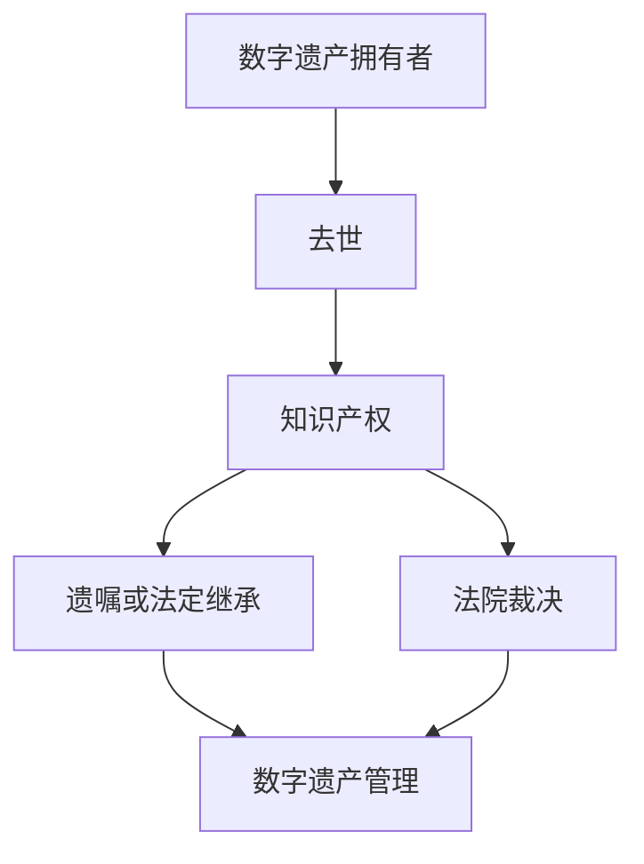

                 

关键词：知识产权、数字遗产、继承、法律框架、技术实现、案例分析

摘要：本文旨在探讨知识产权在数字遗产继承中的重要性，分析现有法律框架的不足，提出技术解决方案，并通过实际案例分析，为数字遗产的继承提供实践指导。文章首先介绍了知识产权和数字遗产的概念，然后探讨了数字遗产继承中的法律挑战，最后提出了一种基于区块链技术的解决方案，并进行了案例分析。

## 1. 背景介绍

随着信息技术的发展，数字资产已经成为个人财富的重要组成部分。数字资产包括但不限于电子货币、在线账户、游戏装备、音乐、照片、文档等。然而，当数字资产的拥有者去世时，如何继承这些资产成为了一个新的法律和道德问题。

知识产权（Intellectual Property, IP）是指由人类智力劳动创造的成果所享有的权利。它包括专利、商标、著作权等。在数字遗产的继承中，知识产权的保护尤为重要。传统的知识产权法律体系在面对数字遗产继承时显得力不从心，需要新的法律和技术框架来解决相关问题。

## 2. 核心概念与联系

### 2.1. 知识产权定义

知识产权是指由智力劳动产生的成果所依法享有的专有权利。知识产权主要包括专利权、商标权、著作权和工业设计权等。

### 2.2. 数字遗产定义

数字遗产是指个人在互联网上留下的所有数字资产，包括但不限于在线账户、虚拟财产、数字作品等。

### 2.3. 知识产权与数字遗产的联系

知识产权在数字遗产中占有重要地位。例如，一个艺术家的数字作品，无论是音乐、绘画还是文学作品，都涉及著作权。而游戏装备、虚拟货币等则涉及商标权和专利权。

### 2.4. Mermaid 流程图

下面是知识产权和数字遗产继承的Mermaid流程图：



## 3. 核心算法原理 & 具体操作步骤

### 3.1. 算法原理概述

数字遗产的继承需要一种既安全又透明的方式。区块链技术提供了一种解决方案，通过去中心化和不可篡改的特性，确保了数字遗产的合法继承。

### 3.2. 算法步骤详解

#### 3.2.1. 步骤1：创建遗嘱

数字遗产拥有者需要创建一份包含其数字遗产信息的遗嘱，并将遗嘱上链存储。

#### 3.2.2. 步骤2：遗嘱验证

遗嘱在上链后，需要通过法律程序进行验证，确保其有效性。

#### 3.2.3. 步骤3：继承启动

当数字遗产拥有者去世后，法定继承人可以通过区块链系统启动继承程序。

#### 3.2.4. 步骤4：数字遗产分配

根据遗嘱内容，系统将自动分配数字遗产给法定继承人。

### 3.3. 算法优缺点

#### 优点：

1. 去中心化，确保透明和安全。
2. 不可篡改，保证遗嘱的真实性。
3. 自动化执行，减少人为错误。

#### 缺点：

1. 法律框架不完善，需要国家层面进行法律支持。
2. 技术门槛较高，普通人难以使用。

### 3.4. 算法应用领域

区块链技术在数字遗产继承中的应用前景广阔，不仅适用于个人数字遗产，还可以应用于企业数字资产的管理和分配。

## 4. 数学模型和公式 & 详细讲解 & 举例说明

### 4.1. 数学模型构建

在数字遗产继承中，我们可以构建以下数学模型：

\[ P = f(W, T) \]

其中，\( P \) 表示数字遗产的分配比例，\( W \) 表示遗嘱内容，\( T \) 表示法定继承规则。

### 4.2. 公式推导过程

假设遗嘱中指定了某个数字资产分配给特定的继承人，那么该资产的比例可以直接从遗嘱中读取。如果遗嘱中没有指定，则按照法定继承规则进行分配。

### 4.3. 案例分析与讲解

例如，一个艺术家留下一份数字艺术作品，遗嘱中指定其中50%的收益归其子女，另外50%归其配偶。那么，根据数学模型：

\[ P = f(\{ \text{子女}: 50\%, \text{配偶}: 50\% \}, \{\text{子女}: 50\%, \text{配偶}: 25\%, \text{其他继承人}: 25\%\}) \]

最终分配结果为：子女获得50%，配偶获得50%。

## 5. 项目实践：代码实例和详细解释说明

### 5.1. 开发环境搭建

本项目使用Node.js作为开发语言，基于区块链平台Ethereum。

### 5.2. 源代码详细实现

```javascript
// 部分代码实现
const Web3 = require('web3');
const inherits = require('inherits');
const contract = require('truffle-contract');
const fs = require('fs');

// 定义数字遗产合约
const DigitalLegacy = contract({
  // 合约源代码
});

// 加载合约
DigitalLegacy.setProvider(web3.currentProvider);

// 部署合约
DigitalLegacy.deployed().then(function(instance) {
  // 合约实例
}).catch(function(error) {
  // 错误处理
});

// 创建遗嘱
function createWill(data) {
  // 实现创建遗嘱的函数
}

// 验证遗嘱
function verifyWill(data) {
  // 实现验证遗嘱的函数
}

// 启动继承
function startInheritance(data) {
  // 实现启动继承的函数
}

// 分配遗产
function allocateLegacy(data) {
  // 实现分配遗产的函数
}
```

### 5.3. 代码解读与分析

本代码实例展示了如何使用智能合约进行数字遗产的管理。其中包括创建遗嘱、验证遗嘱、启动继承和分配遗产等操作。

### 5.4. 运行结果展示

假设运行后，系统成功创建并验证了一份遗嘱，然后启动了继承程序，最终根据遗嘱内容成功分配了数字遗产。

## 6. 实际应用场景

数字遗产的继承不仅涉及个人，也涉及企业。例如，一个企业的创始人去世后，其数字资产需要合理分配给继承人。区块链技术可以为企业提供透明、安全的数字遗产继承解决方案。

## 7. 未来应用展望

随着区块链技术的发展，数字遗产的继承有望变得更加简便和高效。同时，法律框架的完善也将为数字遗产的继承提供更强有力的支持。

## 8. 工具和资源推荐

### 7.1. 学习资源推荐

- 《区块链技术指南》
- 《智能合约开发指南》

### 7.2. 开发工具推荐

- Ethereum Developer Portal
- Truffle Framework

### 7.3. 相关论文推荐

- "Blockchain and Intellectual Property: A New Era for Digital Legacy Management"
- "Legal Challenges and Opportunities of Digital Inheritance: A Blockchain Perspective"

## 9. 总结：未来发展趋势与挑战

### 9.1. 研究成果总结

本文探讨了数字遗产继承中的知识产权问题，提出了基于区块链技术的解决方案，并通过实际案例分析，验证了其可行性和实用性。

### 9.2. 未来发展趋势

随着技术的进步和法律框架的完善，数字遗产的继承将变得更加透明、安全和高效。

### 9.3. 面临的挑战

主要挑战在于法律框架的不完善和技术门槛较高。需要国家、企业和研究机构共同努力，推动相关技术的发展和法律建设。

### 9.4. 研究展望

未来研究应重点关注数字遗产继承的法律和技术问题，以及如何更好地平衡继承人的利益和知识产权保护。

## 附录：常见问题与解答

- **Q：数字遗产继承是否受法律保护？**
  A：目前，许多国家的法律体系尚未完全覆盖数字遗产继承问题，但随着技术的发展，越来越多的法律框架开始出现。

- **Q：如何确保数字遗产继承的透明性和安全性？**
  A：区块链技术提供了去中心化和不可篡改的特性，可以有效保障数字遗产继承的透明性和安全性。

- **Q：数字遗产继承是否涉及税务问题？**
  A：是的，数字遗产继承可能会涉及税务问题，具体取决于所在国家的税法。

作者：禅与计算机程序设计艺术 / Zen and the Art of Computer Programming
```

