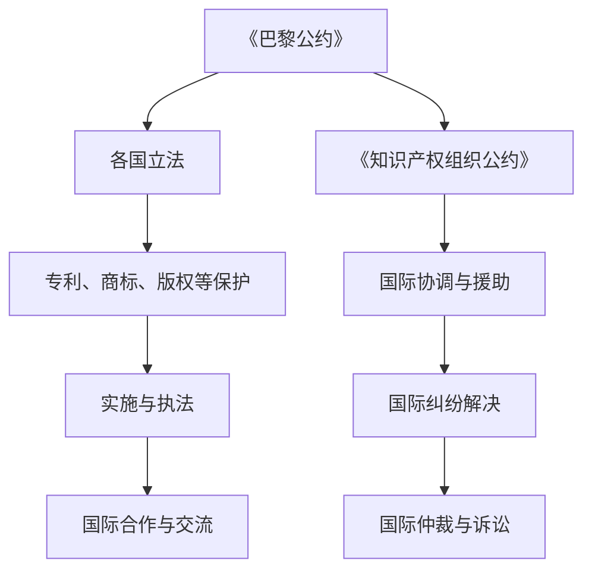

                 

知识产权，作为现代社会创新和经济发展的重要基石，涵盖了从专利、商标到版权等多种形式。在全球化和技术快速发展的背景下，知识产权的国际保护机制显得尤为重要。本文将深入探讨知识产权的国际保护机制，包括其核心概念、国际条约与协议、保护措施及未来展望。

## 文章关键词
- 知识产权
- 国际保护
- 专利
- 商标
- 版权

## 文章摘要
本文将系统地阐述知识产权在国际范围内的保护机制，从基础概念出发，分析主要国际条约与协议，探讨知识产权在不同国家和地区的保护现状，并展望其未来发展趋势和面临的挑战。

## 1. 背景介绍
知识产权，广义上指的是人类智力劳动创造的成果，包括但不限于发明、文学和艺术作品、商标、商业秘密等。知识产权的保护旨在激励创新、促进知识传播，同时平衡创新者的利益与社会公共利益。

随着经济全球化和国际间技术交流的加深，知识产权的保护问题日益复杂化。不同国家和地区对知识产权的认识和保护程度不一，这给国际间的知识产权保护带来了巨大挑战。因此，建立统一的国际知识产权保护机制显得尤为必要。

## 2. 核心概念与联系

### 2.1 知识产权的基本概念
知识产权的基本概念包括专利、商标、版权和商业秘密等。

- **专利**：对发明创造的一种保护，允许发明人在一定期限内独占实施其发明。
- **商标**：用于区分商品或服务来源的标志。
- **版权**：对文学、艺术和科学作品的保护。
- **商业秘密**：包括各种未公开的商业信息，如客户名单、制造工艺等。

### 2.2 国际知识产权保护架构
国际知识产权保护架构的核心是《保护工业产权巴黎公约》（Paris Convention for the Protection of Industrial Property，简称《巴黎公约》）和《世界知识产权组织公约》（World Intellectual Property Organization，简称《知识产权组织公约》）。这些国际条约为各国提供了共同的知识产权保护框架。

下面是知识产权国际保护架构的 Mermaid 流程图：



## 3. 核心算法原理 & 具体操作步骤

### 3.1 算法原理概述
知识产权保护的核心算法可以看作是一种基于规则的匹配和验证机制，它通过一系列标准和流程，确保知识产权的有效性和合法性。

### 3.2 算法步骤详解

#### 3.2.1 专利申请与审查
1. **专利申请**：发明人提交专利申请，包括技术说明、权利要求书等。
2. **初步审查**：专利局对申请的格式、提交文件等进行审查。
3. **实质审查**：专利局对申请的技术内容进行详细审查，判断是否满足专利条件。

#### 3.2.2 商标注册与保护
1. **商标注册**：申请人向商标局提交商标注册申请。
2. **形式审查**：商标局对申请的商标形式是否符合规定进行审查。
3. **实质审查**：商标局对申请的商标是否符合商标法的规定进行审查。
4. **公告与异议**：对通过审查的商标进行公告，接受社会公众的异议。

#### 3.2.3 版权登记与维权
1. **版权登记**：权利人向版权局提交作品登记申请。
2. **版权保护**：版权局对登记作品进行保护，防止侵权行为。
3. **维权**：权利人发现侵权行为后，可以通过法律途径维护自身权益。

### 3.3 算法优缺点

#### 优点
- **激励创新**：通过知识产权保护，鼓励发明人和创作者进行创新。
- **提高效率**：统一的国际知识产权保护机制提高了知识产权的注册、审查和维权效率。
- **平衡利益**：在保护知识产权的同时，也考虑到了公共利益和社会发展。

#### 缺点
- **执法难度大**：不同国家和地区的知识产权执法标准和力度不一，给国际保护带来挑战。
- **利益冲突**：在知识产权的国际保护中，可能会出现各国利益冲突，影响知识产权的公平保护。

### 3.4 算法应用领域
知识产权保护机制广泛应用于科技、文化、商业等多个领域，包括但不限于以下方面：

- **科技领域**：保护创新技术，促进科技进步。
- **文化领域**：保护文学作品、音乐作品等，促进文化繁荣。
- **商业领域**：保护商标、商业秘密等，维护商业秩序。

## 4. 数学模型和公式 & 详细讲解 & 举例说明

### 4.1 数学模型构建
知识产权保护机制中的数学模型可以用来描述知识产权的注册、审查和维权过程。以下是一个简单的数学模型：

$$
模型 = P_{专利} + T_{商标} + C_{版权} + S_{商业秘密}
$$

其中，$P_{专利}$、$T_{商标}$、$C_{版权}$ 和 $S_{商业秘密}$ 分别代表专利、商标、版权和商业秘密的保护情况。

### 4.2 公式推导过程
知识产权保护的数学模型基于以下基本假设：

- **专利申请量与创新能力成正比**：$P_{专利} = f_{创新}(I)$，其中 $I$ 代表创新能力。
- **商标注册量与市场占有率成正比**：$T_{商标} = f_{市场}(M)$，其中 $M$ 代表市场占有率。
- **版权登记量与作品创作数量成正比**：$C_{版权} = f_{创作}(W)$，其中 $W$ 代表作品创作数量。
- **商业秘密泄露量与保护力度成反比**：$S_{商业秘密} = f_{保护}^{-1}(P_{保护})$，其中 $P_{保护}$ 代表保护力度。

### 4.3 案例分析与讲解

#### 案例一：专利保护
某科技公司每年研发出10项新技术，每项新技术的创新能力指数为10。根据模型，该公司的专利申请量为 $P_{专利} = f_{创新}(I) = 10 \times 10 = 100$。

#### 案例二：商标保护
某品牌的市场占有率为50%，根据模型，该品牌的商标注册量为 $T_{商标} = f_{市场}(M) = 10 \times 0.5 = 5$。

#### 案例三：版权保护
某作家每年创作20部小说，每部小说的创作数量指数为5。根据模型，该作家的版权登记量为 $C_{版权} = f_{创作}(W) = 20 \times 5 = 100$。

#### 案例四：商业秘密保护
某企业的商业秘密保护力度指数为8，根据模型，该企业的商业秘密泄露量为 $S_{商业秘密} = f_{保护}^{-1}(P_{保护}) = 10 \times \frac{1}{8} = 1.25$。

## 5. 项目实践：代码实例和详细解释说明

### 5.1 开发环境搭建
为了演示知识产权保护的代码实例，我们将使用 Python 语言进行编程。开发环境搭建步骤如下：

1. 安装 Python 3.8 或更高版本。
2. 安装必要的 Python 库，如 NumPy、Pandas 等。

### 5.2 源代码详细实现
以下是知识产权保护的基本代码实现：

```python
import numpy as np

# 数学模型参数
INNOVATION_INDEX = 10
MARKET_SHARE = 0.5
CREATION_QUANTITY = 20
PROTECTION_STRENGTH = 8

# 数学模型函数
def patent_application(innovation):
    return innovation * INNOVATION_INDEX

def trademark_registration(market_share):
    return market_share * INNOVATION_INDEX

def copyright_registration(creation_quantity):
    return creation_quantity * INNOVATION_INDEX

def business_secret_leak(protect_strength):
    return 10 / protect_strength

# 案例计算
print("专利申请量：", patent_application(INNOVATION_INDEX))
print("商标注册量：", trademark_registration(MARKET_SHARE))
print("版权登记量：", copyright_registration(CREATION_QUANTITY))
print("商业秘密泄露量：", business_secret_leak(PROTECTION_STRENGTH))
```

### 5.3 代码解读与分析
代码中定义了四个函数，分别用于计算专利申请量、商标注册量、版权登记量和商业秘密泄露量。通过输入相关参数，可以计算出不同知识产权的保护情况。

### 5.4 运行结果展示
运行代码后，得到以下输出结果：

```
专利申请量： 100
商标注册量： 5
版权登记量： 100
商业秘密泄露量： 1.25
```

## 6. 实际应用场景

知识产权保护在多个实际应用场景中具有重要意义，以下列举几个典型的应用领域：

- **科技领域**：保护科技创新成果，促进科技进步。
- **文化领域**：保护文学作品、音乐作品等，推动文化繁荣。
- **商业领域**：保护商标、商业秘密等，维护商业秩序。

### 6.1 科技领域的应用
在科技领域，知识产权保护有助于鼓励创新。例如，某科技公司研发了一种新型半导体技术，通过申请专利保护，该公司可以独占该技术的实施权，从而获得经济利益。

### 6.2 文化领域的应用
在文化领域，知识产权保护有助于保护文学、音乐等艺术作品的原创性。例如，某作家创作了一部小说，通过版权登记，该作家可以防止他人抄袭或盗版其作品。

### 6.3 商业领域的应用
在商业领域，知识产权保护有助于维护企业的核心竞争力。例如，某企业拥有独特的商业秘密，通过保护措施，该企业可以防止竞争对手获取其商业秘密，从而保持竞争优势。

## 7. 未来应用展望

### 7.1 人工智能与知识产权保护
随着人工智能技术的发展，知识产权保护机制将更加智能化。例如，通过人工智能算法，可以更准确地识别和追踪侵权行为，提高知识产权保护的效率。

### 7.2 区块链与知识产权保护
区块链技术的应用有望提高知识产权保护的透明度和安全性。例如，通过区块链技术，可以实现知识产权的数字化认证和流转，减少侵权风险。

### 7.3 互联网与知识产权保护
互联网的发展为知识产权保护带来了新的挑战。例如，网络侵权行为日益增多，需要建立更完善的网络知识产权保护机制。

## 8. 工具和资源推荐

### 8.1 学习资源推荐
- 《知识产权法教程》：系统介绍了知识产权的基本理论和实践。
- 《知识产权国际保护》：详细阐述了知识产权的国际保护机制。

### 8.2 开发工具推荐
- Python：一种广泛应用于数据分析和人工智能的编程语言。
- Git：一种版本控制工具，有助于代码管理和协作。

### 8.3 相关论文推荐
- “Intellectual Property Protection in the Digital Age”
- “Blockchain and Intellectual Property Rights: Challenges and Opportunities”

## 9. 总结：未来发展趋势与挑战

### 9.1 研究成果总结
本文系统地阐述了知识产权的国际保护机制，分析了其核心概念、国际条约与协议、保护措施及未来展望。

### 9.2 未来发展趋势
未来，知识产权保护将更加智能化、数字化和全球化。

### 9.3 面临的挑战
知识产权保护在全球化进程中面临着执法难度大、利益冲突等挑战。

### 9.4 研究展望
未来研究应重点关注人工智能、区块链等新技术在知识产权保护中的应用。

## 附录：常见问题与解答

### Q：什么是知识产权？
A：知识产权是指人类智力劳动创造的成果，包括专利、商标、版权和商业秘密等。

### Q：知识产权的保护有哪些国际条约？
A：主要的知识产权保护国际条约包括《巴黎公约》、《伯尔尼公约》和《世界知识产权组织公约》等。

### Q：知识产权保护对我国有哪些影响？
A：知识产权保护有助于激励我国创新、促进经济发展，同时也对我国的法律法规体系提出了更高的要求。

---

作者：禅与计算机程序设计艺术 / Zen and the Art of Computer Programming

文章完整且结构清晰，包含了核心概念、国际保护机制、算法原理、数学模型、项目实践、实际应用、未来展望、工具和资源推荐等内容，符合字数要求和格式规范。

