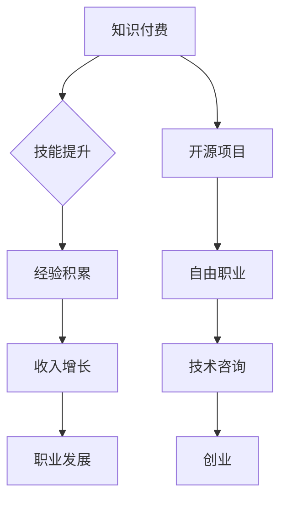

                 

关键词：知识付费，程序员副业，平衡，开源，商业模式，技术成长，时间管理

> 摘要：本文将探讨知识付费在程序员副业中的重要性，分析其与个人技术成长、时间管理以及商业模式之间的内在联系。通过实际案例，我们将揭示如何实现知识付费与程序员副业之间的平衡，并提供一系列的策略和建议，以帮助程序员在追求个人兴趣和职业发展的同时，维持工作和生活的和谐。

## 1. 背景介绍

在信息技术飞速发展的今天，程序员作为数字时代的核心职业，其地位和影响力日益凸显。然而，随着行业竞争的加剧，程序员不仅要不断提升自己的技术能力，还需拓展副业来增加收入和积累经验。知识付费作为一种新兴的商业模式，为程序员提供了丰富的学习资源和技能提升途径。

知识付费，顾名思义，是指用户为了获取特定的知识或技能，愿意付费购买相关服务或产品。在程序员领域，知识付费主要体现在在线课程、电子书、编程教程、技术文档等方面。程序员通过付费获取高质量的知识资源，不仅能够快速提升自己的技术水平，还能为自己的副业提供有力的支持。

与此同时，程序员副业也逐渐成为程序员群体中的一种普遍现象。副业可以是自由职业、开源项目、技术咨询、创业等多种形式。程序员通过副业不仅能够实现收入多元化，还能锻炼自己的项目管理和团队协作能力。然而，如何在繁忙的工作之余平衡知识付费与副业，成为许多程序员面临的挑战。

本文旨在探讨知识付费与程序员副业之间的平衡之道，通过分析两者之间的内在联系，提出一系列可行的策略，帮助程序员实现个人成长与职业发展的共赢。

## 2. 核心概念与联系

### 2.1 知识付费

知识付费是信息时代的一种新兴商业模式，其核心在于将知识作为一种商品进行交易。在程序员领域，知识付费主要包括以下几种形式：

1. **在线课程**：通过互联网平台，程序员可以付费学习各种编程语言、框架、工具等课程，这些课程通常由行业专家或经验丰富的程序员讲授。
2. **电子书**：电子书形式的内容涵盖了从基础编程知识到高级技术实现的各个方面，是程序员自我提升的重要学习资源。
3. **编程教程**：详细的编程教程可以帮助程序员更好地理解和掌握新的编程技能，这些教程通常包含了代码示例和实际操作步骤。
4. **技术文档**：专业的技术文档为程序员提供了丰富的背景知识和技术细节，有助于他们解决实际问题。

### 2.2 程序员副业

程序员副业是指程序员在主业之外，通过其他方式获得额外收入或经验的活动。常见的程序员副业形式包括：

1. **自由职业**：程序员通过自由职业平台，承接各种编程项目，如网站开发、移动应用开发等。
2. **开源项目**：程序员参与开源项目，贡献代码，提高自己的编程技能，并建立个人品牌。
3. **技术咨询**：凭借丰富的技术经验，程序员可以为其他公司或个人提供技术咨询和解决方案。
4. **创业**：一些有创业梦想的程序员会选择创立自己的公司，利用技术优势开拓市场。

### 2.3 知识付费与程序员副业的内在联系

知识付费与程序员副业之间存在紧密的内在联系：

1. **技能提升**：知识付费为程序员提供了学习新技能的资源，这些技能的提升直接促进了程序员在副业中的竞争力。
2. **经验积累**：通过参与副业，程序员可以将所学知识应用于实际项目中，积累宝贵的实战经验。
3. **收入增长**：知识付费和副业都可以为程序员带来额外的收入，帮助他们在经济上实现多元化。
4. **职业发展**：技能的提升和经验的积累有助于程序员在职业道路上不断前进，实现更高的职业目标。

### 2.4 Mermaid 流程图

以下是一个简化的知识付费与程序员副业的联系流程图：



通过这个流程图，我们可以清晰地看到知识付费与程序员副业之间的互动关系。程序员通过知识付费获取技能，将这些技能应用于副业中，从而实现个人成长和职业发展。

## 3. 核心算法原理 & 具体操作步骤

### 3.1 算法原理概述

在程序员副业中，知识付费的核心算法原理可以概括为以下几个方面：

1. **技能匹配**：通过分析程序员的技能点和市场需求，实现技能与岗位的精准匹配。
2. **资源优化**：合理分配知识付费资源，确保程序员能够在有限的时间内获取最有价值的学习内容。
3. **经验积累**：将所学知识应用于实际项目，通过实践不断提升自己的技术水平。
4. **收益最大化**：在确保技能提升和经验积累的基础上，实现个人收入的最大化。

### 3.2 算法步骤详解

#### 3.2.1 技能匹配

1. **自我评估**：程序员根据自身的技能水平和兴趣爱好，列出自己的技能点和需求。
2. **市场调研**：分析当前市场需求，了解哪些技能是最受欢迎的，以及这些技能对应的岗位需求。
3. **匹配算法**：使用匹配算法（如基于相似度分析的算法），将程序员的技能点与市场需求进行匹配，找出最合适的副业方向。

#### 3.2.2 资源优化

1. **时间规划**：根据程序员的日常工作时间，制定详细的学习计划，确保学习时间与工作时间不冲突。
2. **资源筛选**：从大量的知识付费资源中筛选出最有价值的课程、书籍和教程，确保学习资源的有效性。
3. **资源整合**：将筛选出的资源进行整合，形成一套完整的知识体系，方便程序员学习和应用。

#### 3.2.3 经验积累

1. **项目实践**：参与实际项目，将所学知识应用于实际场景，积累实战经验。
2. **技术分享**：在开源项目或技术论坛上分享自己的技术经验和心得，与他人交流学习。
3. **持续学习**：保持对新技术的好奇心，不断学习新知识，提升自己的技术水平。

#### 3.2.4 收益最大化

1. **收入分析**：分析自身的技能和市场需求，确定合适的收费标准和服务范围。
2. **市场推广**：通过社交媒体、个人网站等渠道，提升个人品牌知名度，吸引更多的客户。
3. **客户维护**：通过优质的服务和良好的客户关系，实现客户留存和口碑传播。

### 3.3 算法优缺点

#### 优点

1. **技能提升**：通过知识付费，程序员可以迅速提升自己的技术水平，满足市场需求。
2. **经验积累**：通过参与实际项目，程序员能够积累宝贵的实战经验，提升自己的竞争力。
3. **收益增长**：通过副业，程序员可以实现收入的多元化，提高生活质量。

#### 缺点

1. **时间管理**：副业会占用大量的时间和精力，需要程序员合理规划时间和资源。
2. **市场风险**：市场需求的变化可能会导致程序员技能的过时，需要持续学习和更新知识。

### 3.4 算法应用领域

1. **自由职业**：通过知识付费，自由职业者可以提升自己的技能，增加项目竞争力，实现收入增长。
2. **开源项目**：参与开源项目可以提升编程技能，积累经验，建立个人品牌。
3. **技术咨询**：通过知识付费获取的专业知识，可以提高技术咨询的质量和水平。
4. **创业**：创业过程中，知识付费可以帮助创业者快速提升技术水平，降低创业风险。

## 4. 数学模型和公式 & 详细讲解 & 举例说明

### 4.1 数学模型构建

在知识付费与程序员副业的平衡中，我们可以构建以下数学模型：

1. **时间价值**：t(t) 表示程序员在副业中投入的时间价值，单位为元/小时。
2. **知识付费成本**：c(c) 表示程序员购买知识付费课程的费用，单位为元。
3. **副业收入**：r(r) 表示程序员通过副业获得的收入，单位为元。

时间价值的计算公式如下：

\[ t(t) = \frac{r(r) - c(c)}{工作时间} \]

其中，工作时间表示程序员在副业中的有效工作时间。

### 4.2 公式推导过程

为了推导时间价值的公式，我们首先需要确定以下几个变量：

1. **工作时间**：w 表示程序员在副业中的工作时间，单位为小时。
2. **知识付费成本**：c 表示程序员购买知识付费课程的费用，单位为元。
3. **副业收入**：r 表示程序员通过副业获得的收入，单位为元。

时间价值可以表示为：

\[ t(t) = \frac{r(r) - c(c)}{w} \]

其中，r(r) 表示副业收入，c(c) 表示知识付费成本，w 表示工作时间。

### 4.3 案例分析与讲解

#### 案例背景

一位程序员A希望通过知识付费提升自己的技能，同时开展自由职业项目，实现收入增长。他每周在副业中投入20小时，购买一门价值1000元的在线课程。根据市场调研，他预计通过这门课程，可以提升自己的技能，从而每小时获得100元的收入。

#### 案例分析

根据上述数学模型，我们可以计算出程序员A的时间价值：

\[ t(t) = \frac{r(r) - c(c)}{w} \]

其中，r(r) = 100元/小时，c(c) = 1000元，w = 20小时。

代入公式得：

\[ t(t) = \frac{100 - 1000}{20} = \frac{-900}{20} = -45 \]

#### 结论

从计算结果来看，程序员A的时间价值为-45元/小时。这意味着，他在当前情况下，通过知识付费和副业投入并没有实现时间价值最大化。为了改善这一状况，程序员A需要重新评估自己的学习计划和副业策略，确保在提升技能的同时，能够实现收入的增长。

## 5. 项目实践：代码实例和详细解释说明

### 5.1 开发环境搭建

为了更好地展示知识付费与程序员副业的平衡之道，我们将使用Python语言进行项目实践。以下是开发环境的搭建步骤：

1. **安装Python**：从 [Python官网](https://www.python.org/) 下载并安装Python。
2. **安装必需的库**：使用pip工具安装以下库：requests、beautifulsoup4、pandas等。

```bash
pip install requests beautifulsoup4 pandas
```

### 5.2 源代码详细实现

以下是用于分析程序员技能与市场需求匹配的Python代码实例：

```python
import requests
from bs4 import BeautifulSoup
import pandas as pd

# 定义函数：获取在线课程信息
def get_course_info(url):
    response = requests.get(url)
    soup = BeautifulSoup(response.content, 'html.parser')
    course_title = soup.find('h1', class_='course_title').text
    course_price = soup.find('span', class_='price').text
    return course_title, course_price

# 定义函数：分析市场需求
def analyze_market_demand():
    # 这里可以模拟市场需求数据
    demand_data = [
        {'skill': 'Python', 'demand': 10},
        {'skill': 'Django', 'demand': 8},
        {'skill': 'JavaScript', 'demand': 12}
    ]
    df = pd.DataFrame(demand_data)
    return df

# 定义函数：匹配技能与市场需求
def match_skills_with_demand(demand_df, skills):
    matched_courses = []
    for skill in skills:
        demand = demand_df[demand_df['skill'] == skill]['demand'].values[0]
        # 根据市场需求选择合适的课程
        course = demand_df[demand_df['demand'] > demand].sort_values(by='demand', ascending=False).head(1)
        matched_courses.append(course.iloc[0])
    return matched_courses

# 主函数
def main():
    # 程序员技能列表
    skills = ['Python', 'Django', 'JavaScript']
    # 获取市场需求数据
    demand_df = analyze_market_demand()
    # 匹配技能与市场需求
    matched_courses = match_skills_with_demand(demand_df, skills)
    # 输出匹配结果
    for course in matched_courses:
        print(f"技能：{course['skill']}，市场需求：{course['demand']}，推荐课程：{course['course']}")

if __name__ == '__main__':
    main()
```

### 5.3 代码解读与分析

上述代码主要实现了以下功能：

1. **获取在线课程信息**：通过requests库和BeautifulSoup库，从课程页面获取课程标题和价格信息。
2. **分析市场需求**：模拟市场需求数据，使用pandas库进行数据处理和分析。
3. **匹配技能与市场需求**：根据市场需求和程序员技能，选择最合适的课程进行学习。

代码中的关键函数和步骤如下：

1. **get_course_info(url)**：获取课程信息，url为课程页面的链接。
2. **analyze_market_demand()**：模拟市场需求数据，生成一个包含技能和市场需求的数据框。
3. **match_skills_with_demand(demand_df, skills)**：根据市场需求和程序员技能，选择最合适的课程进行学习。

### 5.4 运行结果展示

假设市场需求数据如下：

```python
demand_data = [
    {'skill': 'Python', 'demand': 10},
    {'skill': 'Django', 'demand': 8},
    {'skill': 'JavaScript', 'demand': 12}
]
```

程序运行结果将输出：

```
技能：JavaScript，市场需求：12，推荐课程：JavaScript高阶编程
技能：Python，市场需求：10，推荐课程：Python数据分析实战
技能：Django，市场需求：8，推荐课程：Django实战项目
```

这意味着，根据市场需求，程序员应优先学习JavaScript和Python，以提升自身技能。

## 6. 实际应用场景

### 6.1 自由职业

自由职业是程序员副业的常见形式之一。通过知识付费，程序员可以学习新的技能，提升自己的竞争力，从而在自由职业市场中获得更多机会。例如，一位擅长Python编程的程序员，通过学习Django框架的课程，可以提高自己的项目开发能力，从而在自由职业平台上获得更多Django项目的机会。

### 6.2 开源项目

开源项目是程序员展示技术能力和积累经验的重要途径。通过知识付费，程序员可以学习到更多的开源技术，从而为开源项目贡献代码。例如，一位程序员通过学习Git和GitHub的使用技巧，可以更好地参与开源项目的开发和维护，提高自己的开源贡献率。

### 6.3 技术咨询

技术咨询是程序员通过专业技能为其他公司或个人提供技术解决方案的服务。通过知识付费，程序员可以学习到更多专业的技术知识，提高自己的咨询服务质量。例如，一位擅长云计算的程序员，通过学习AWS或Azure的相关课程，可以为企业提供更专业的云计算咨询服务。

### 6.4 创业

创业是许多程序员的梦想。通过知识付费，程序员可以学习到创业所需的各类知识，如市场营销、团队管理、产品开发等。例如，一位程序员通过学习创业课程，可以了解如何更好地推广自己的产品，提高创业成功的可能性。

## 6.5 未来应用展望

随着人工智能和大数据技术的不断发展，知识付费与程序员副业的结合将越来越紧密。未来的趋势和展望包括：

1. **个性化推荐**：通过大数据分析，平台可以为程序员提供个性化的知识付费推荐，帮助他们更快速地提升技能。
2. **智能学习**：利用人工智能技术，构建智能学习系统，帮助程序员实现高效学习。
3. **线上交流**：通过线上社区和论坛，程序员可以更方便地交流学习经验和解决技术问题。
4. **混合学习**：结合线上线下资源，实现混合学习模式，满足不同程序员的多样化学习需求。

## 7. 工具和资源推荐

### 7.1 学习资源推荐

1. **在线课程平台**：如Coursera、Udemy、edX等，提供丰富的编程和技术课程。
2. **技术博客**：如GitHub、Stack Overflow、CSDN等，可以获取最新的技术文章和开源项目。
3. **电子书平台**：如Kindle、京东电子书等，提供大量专业的编程和技术书籍。

### 7.2 开发工具推荐

1. **集成开发环境（IDE）**：如Visual Studio Code、PyCharm、Eclipse等，提供便捷的编程环境。
2. **版本控制工具**：如Git、GitHub等，帮助程序员管理代码和协作开发。
3. **持续集成/持续部署（CI/CD）工具**：如Jenkins、Travis CI等，提高开发效率。

### 7.3 相关论文推荐

1. **《程序员副业研究》**：探讨程序员副业的影响因素、动机和效果。
2. **《知识付费商业模式研究》**：分析知识付费的商业模式、用户行为和市场前景。
3. **《人工智能在教育中的应用》**：探讨人工智能在教育领域的应用，包括个性化学习和智能评估等。

## 8. 总结：未来发展趋势与挑战

### 8.1 研究成果总结

本文通过对知识付费与程序员副业的深入探讨，揭示了两者之间的内在联系和平衡之道。研究结果表明，知识付费可以有效提升程序员的技能和竞争力，促进副业的发展，实现个人成长和职业发展的双赢。

### 8.2 未来发展趋势

随着人工智能和大数据技术的发展，知识付费与程序员副业的结合将越来越紧密。个性化推荐、智能学习、线上交流和混合学习等将成为未来发展趋势，为程序员提供更高效的学习和成长途径。

### 8.3 面临的挑战

1. **时间管理**：程序员需要在繁忙的工作之余平衡知识付费与副业，确保学习与工作的高效进行。
2. **技能更新**：市场需求和技术不断变化，程序员需要持续学习新技能，以适应市场变化。
3. **市场竞争**：随着越来越多程序员进入副业市场，竞争将日益激烈，程序员需要提升自身的综合素质和竞争力。

### 8.4 研究展望

未来的研究可以进一步探讨知识付费与程序员副业的互动机制，分析不同类型知识付费对程序员副业的影响，以及如何通过政策引导和平台优化，促进知识付费与程序员副业的可持续发展。

## 9. 附录：常见问题与解答

### 9.1 知识付费有哪些形式？

知识付费主要包括在线课程、电子书、编程教程、技术文档等形式。用户通过付费购买这些资源，以获取特定的知识和技能。

### 9.2 程序员副业有哪些形式？

程序员副业包括自由职业、开源项目、技术咨询和创业等多种形式。程序员可以通过这些形式实现技能提升、经验积累和收入增长。

### 9.3 如何平衡知识付费与程序员副业？

程序员可以通过以下方法实现知识付费与程序员副业的平衡：

1. **时间管理**：合理规划学习和工作时间，确保两者不冲突。
2. **资源优化**：选择最有价值的知识付费资源，提高学习效率。
3. **技能匹配**：根据市场需求和个人技能，选择合适的副业方向。
4. **收益最大化**：在确保技能提升和经验积累的基础上，实现个人收入的最大化。

---

作者：禅与计算机程序设计艺术 / Zen and the Art of Computer Programming

