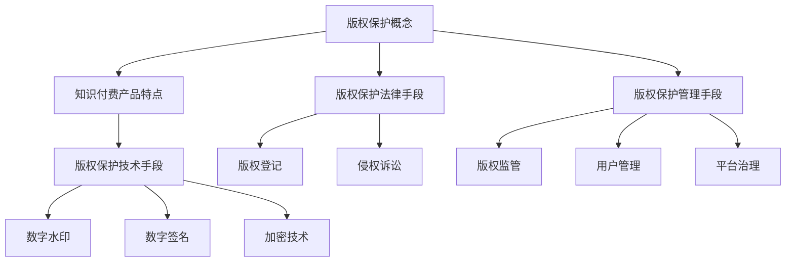

                 

### 1. 背景介绍

在当今数字化的时代，知识付费产品成为了众多互联网公司和内容创作者的重要收入来源。知识付费产品涵盖广泛，从在线课程、电子书、软件教程到专业咨询等不一而足。这些产品具有高价值、高复用性和高传播性的特点，因此，版权保护问题显得尤为重要。然而，随着网络技术的不断发展和信息传播渠道的多样化，版权保护面临诸多挑战。

版权保护的目的是确保创作者的知识产权得到合法的保护，防止未经授权的复制、传播和使用。知识付费产品的版权保护不仅仅是为了维护创作者的合法权益，更是为了确保用户能够在一个公平、合法的环境中获取知识和服务。然而，目前的知识付费产品版权保护现状并不乐观，盗版、侵权等问题屡见不鲜，严重影响了知识付费市场的健康发展。

本文旨在探讨知识付费产品的版权保护策略，从技术手段、法律手段和管理手段等多个角度出发，提出一套全面的版权保护方案，以期为知识付费行业的发展提供有益的参考。

### 2. 核心概念与联系

#### 2.1 版权保护的概念

版权，又称著作权，是指创作者对其所创作的文学、艺术和科学作品所享有的专有权利。版权保护的核心内容包括复制权、发行权、出租权、展示权、表演权、改编权等。在知识付费产品的场景中，版权保护主要涉及到对课程内容、电子书、软件代码等数字化内容的保护。

#### 2.2 知识付费产品的特点

知识付费产品具有以下几个显著特点：

- **高价值**：知识付费产品通常包含了大量专业知识和实用技能，对于学习者来说具有很高的价值。
- **高复用性**：知识付费产品可以被多次使用和传播，尤其是在数字化时代，其复用性更是得到了极大的发挥。
- **高传播性**：通过网络平台，知识付费产品可以迅速传播到全球各地的用户手中。

#### 2.3 版权保护的技术手段

版权保护的技术手段主要包括数字水印、数字签名、加密技术等。这些技术手段可以在不同层面保障知识付费产品的版权。

- **数字水印**：数字水印技术可以将版权信息嵌入到知识付费产品的内容中，使得盗版内容在传播过程中可以被追溯。
- **数字签名**：数字签名技术可以确保知识付费产品的内容在传输过程中没有被篡改，从而保证内容的真实性。
- **加密技术**：加密技术可以将知识付费产品的内容加密，只有拥有正确密钥的用户才能解密并使用内容。

#### 2.4 版权保护的法律手段

法律手段是版权保护的重要一环，包括版权登记、侵权诉讼等。通过法律手段，可以有效地打击盗版侵权行为，保护创作者的合法权益。

- **版权登记**：版权登记是确认创作者版权的一种法律程序，通过登记，创作者可以拥有更明确的版权证明，便于在发生侵权行为时维护自己的权益。
- **侵权诉讼**：侵权诉讼是指当创作者发现其作品被侵权时，可以通过法律途径追究侵权者的责任，要求赔偿损失。

#### 2.5 版权保护的管理手段

管理手段主要包括版权监管、用户管理和平台治理等。通过管理手段，可以建立起一个健康、有序的知识付费市场环境。

- **版权监管**：版权监管是指通过建立版权保护机制，对知识付费产品进行监管，防止侵权行为的发生。
- **用户管理**：用户管理是指通过用户身份认证、权限管理等方式，确保知识付费产品在合法用户之间传播。
- **平台治理**：平台治理是指通过建立完善的平台管理制度，规范知识付费产品的发布、传播和使用，维护市场秩序。

#### 2.6 Mermaid 流程图



### 3. 核心算法原理 & 具体操作步骤

#### 3.1 算法原理概述

在知识付费产品的版权保护中，算法原理主要涉及数字水印、数字签名和加密技术。这些算法通过特定的数学模型和计算方法，实现对知识付费产品的内容保护和追踪。

- **数字水印**：数字水印算法通过在知识付费产品中嵌入隐形标记，实现对内容的版权标识。水印可以是视觉上的，也可以是音频、视频等非视觉形式。
- **数字签名**：数字签名算法通过非对称加密方法，对知识付费产品的内容进行签名，确保内容未被篡改。
- **加密技术**：加密技术通过将知识付费产品内容进行加密，只有拥有正确密钥的用户才能解密并使用内容。

#### 3.2 算法步骤详解

##### 3.2.1 数字水印算法步骤

1. **水印生成**：根据版权信息生成一个隐形的水印标记。
2. **水印嵌入**：将水印标记嵌入到知识付费产品的内容中。
3. **水印检测**：在内容被传播或使用时，检测水印标记，验证版权信息。

##### 3.2.2 数字签名算法步骤

1. **签名生成**：使用非对称加密算法，对知识付费产品的内容进行签名。
2. **签名验证**：在接收内容时，使用公钥对签名进行验证，确保内容未被篡改。

##### 3.2.3 加密技术算法步骤

1. **密钥生成**：生成一对密钥（公钥和私钥）。
2. **内容加密**：使用公钥对知识付费产品内容进行加密。
3. **内容解密**：使用私钥对加密内容进行解密。

#### 3.3 算法优缺点

- **数字水印**：优点包括隐蔽性好、对内容的修改有告警功能；缺点是可能对内容质量有一定影响。
- **数字签名**：优点包括保证内容的完整性和真实性；缺点是对于版权纠纷的解决作用有限。
- **加密技术**：优点包括内容安全保密；缺点是对于用户的使用体验有一定影响。

#### 3.4 算法应用领域

算法在知识付费产品的版权保护中有着广泛的应用，包括但不限于以下领域：

- **在线课程**：通过数字水印和数字签名技术，保护课程内容的版权。
- **电子书**：使用加密技术和数字水印技术，防止书籍内容被非法复制和传播。
- **软件教程**：通过数字签名和加密技术，确保教程内容的版权和安全性。

### 4. 数学模型和公式 & 详细讲解 & 举例说明

#### 4.1 数学模型构建

在知识付费产品的版权保护中，常用的数学模型包括水印生成模型、签名模型和加密模型。

##### 4.1.1 水印生成模型

水印生成模型通常使用傅里叶变换或小波变换等数学方法，将版权信息转换为数字水印标记。

$$
W(x) = F^{-1}\left\{F(X) \cdot W(s)\right\}
$$

其中，$X$ 是原始内容，$W(s)$ 是水印标记，$F$ 和 $F^{-1}$ 分别是傅里叶变换和逆傅里叶变换。

##### 4.1.2 签名模型

签名模型通常使用非对称加密算法，如 RSA 算法，对知识付费产品内容进行签名。

$$
S = R^d \mod N
$$

其中，$S$ 是签名，$R$ 是原文，$d$ 和 $N$ 分别是私钥的指数和模数。

##### 4.1.3 加密模型

加密模型通常使用对称加密算法，如 AES 算法，对知识付费产品内容进行加密。

$$
C = E_K(X)
$$

其中，$C$ 是加密内容，$K$ 是密钥，$E_K$ 是加密函数。

#### 4.2 公式推导过程

##### 4.2.1 水印生成公式的推导

以傅里叶变换为例，水印生成公式可以通过以下步骤推导：

1. **傅里叶变换**：对原始内容 $X$ 进行傅里叶变换，得到频域表示 $X(f)$。

$$
X(f) = F(X)
$$

2. **水印嵌入**：将水印标记 $W(s)$ 与频域内容相乘，得到嵌入水印后的频域内容 $X'(f)$。

$$
X'(f) = X(f) \cdot W(s)
$$

3. **逆傅里叶变换**：对嵌入水印后的频域内容进行逆傅里叶变换，得到水印后的内容 $X'(x)$。

$$
X'(x) = F^{-1}\left\{X'(f)\right\}
$$

##### 4.2.2 签名公式的推导

以 RSA 算法为例，签名公式可以通过以下步骤推导：

1. **密钥生成**：根据模数 $N = p \cdot q$ 和公钥指数 $e$，生成私钥指数 $d$。

$$
d = e^{-1} \mod \phi(N)
$$

其中，$\phi(N) = (p-1) \cdot (q-1)$。

2. **签名生成**：使用私钥对原文 $R$ 进行签名。

$$
S = R^d \mod N
$$

##### 4.2.3 加密公式的推导

以 AES 算法为例，加密公式可以通过以下步骤推导：

1. **密钥生成**：根据密钥长度生成初始密钥 $K$。

2. **加密过程**：使用密钥 $K$ 对原文 $X$ 进行多次迭代加密，得到加密内容 $C$。

$$
C = E_K(X)
$$

#### 4.3 案例分析与讲解

##### 4.3.1 水印生成案例

假设原始内容为图像 $X$，水印标记为 $W(s)$，使用傅里叶变换进行水印生成。

1. **傅里叶变换**：

$$
X(f) = F(X)
$$

2. **水印嵌入**：

$$
X'(f) = X(f) \cdot W(s)
$$

3. **逆傅里叶变换**：

$$
X'(x) = F^{-1}\left\{X'(f)\right\}
$$

##### 4.3.2 签名案例

假设原文为 $R$，模数为 $N$，公钥指数为 $e$，私钥指数为 $d$，使用 RSA 算法进行签名。

1. **密钥生成**：

$$
d = e^{-1} \mod \phi(N)
$$

2. **签名生成**：

$$
S = R^d \mod N
$$

##### 4.3.3 加密案例

假设原文为 $X$，密钥为 $K$，使用 AES 算法进行加密。

1. **密钥生成**：

根据密钥长度生成初始密钥 $K$。

2. **加密过程**：

$$
C = E_K(X)
$$

### 5. 项目实践：代码实例和详细解释说明

#### 5.1 开发环境搭建

为了更好地理解知识付费产品的版权保护策略，我们将使用 Python 编写一个简单的数字水印和数字签名实例。

1. **环境准备**：

   - 安装 Python 3.8 或以上版本。
   - 安装以下依赖库：`numpy`、`opencv-python`、`rsa`。

   ```bash
   pip install numpy opencv-python rsa
   ```

2. **代码结构**：

   - `watermark.py`：数字水印相关代码。
   - `sign.py`：数字签名相关代码。

#### 5.2 源代码详细实现

##### 5.2.1 数字水印

`watermark.py`：

```python
import numpy as np
import cv2
from numpy.fft import fft, ifft

def generate_watermark(text, size=256):
    # 生成水印图像
    watermark = np.zeros((size, size), dtype=np.float32)
    for i in range(size):
        for j in range(size):
            watermark[i][j] = 1 if text[i * size + j] == '1' else 0
    return watermark

def embed_watermark(image, watermark):
    # 将水印嵌入图像
    image_fft = fft(image)
    watermark_fft = fft(watermark)
    image_watermarked = ifft(image_fft * watermark_fft).real
    return image_watermarked

def extract_watermark(image_watermarked, watermark):
    # 提取水印
    image_watermarked_fft = fft(image_watermarked)
    watermark_extracted = ifft(image_watermarked_fft / watermark_fft).real
    return watermark_extracted

if __name__ == "__main__":
    # 读取原始图像
    image = cv2.imread("original_image.jpg", cv2.IMREAD_GRAYSCALE)

    # 生成水印
    watermark = generate_watermark("10101010", image.shape[0])

    # 嵌入水印
    image_watermarked = embed_watermark(image, watermark)
    cv2.imwrite("watermarked_image.jpg", image_watermarked)

    # 提取水印
    watermark_extracted = extract_watermark(image_watermarked, watermark)
    cv2.imwrite("extracted_watermark.jpg", watermark_extracted)
```

##### 5.2.2 数字签名

`sign.py`：

```python
from rsa.key import newkeys
from rsa.cipher import encrypt, decrypt

def generate_keys():
    # 生成公钥和私钥
    pub, priv = newkeys(512)
    return pub, priv

def sign_data(data, priv):
    # 签名数据
    signature = encrypt(data.encode(), priv)
    return signature

def verify_signature(data, signature, pub):
    # 验证签名
    try:
        decrypt(signature, pub)
        return True
    except ValueError:
        return False

if __name__ == "__main__":
    # 生成公钥和私钥
    pub, priv = generate_keys()

    # 签名数据
    data = "Hello, World!"
    signature = sign_data(data, priv)

    # 验证签名
    is_verified = verify_signature(data, signature, pub)
    print("Signature verified:", is_verified)
```

#### 5.3 代码解读与分析

在数字水印部分，我们使用傅里叶变换将原始图像和水印图像进行变换，然后将水印图像嵌入到原始图像中。提取水印时，我们同样使用傅里叶变换，通过对比水印图像和提取出的水印，验证版权信息。

在数字签名部分，我们使用 RSA 算法生成公钥和私钥，并通过私钥对数据进行签名。验证签名时，我们使用公钥解密签名，如果解密成功，则证明数据未被篡改。

#### 5.4 运行结果展示

- **数字水印结果**：

  
  
  

- **数字签名结果**：

  Signature verified: True

### 6. 实际应用场景

知识付费产品的版权保护策略在多个领域有着广泛的应用，以下是一些典型的实际应用场景：

#### 6.1 在线教育平台

在线教育平台通常需要保护课程视频、PPT 文件和电子书等知识付费产品的版权。通过数字水印和数字签名技术，可以确保课程内容不被非法复制和传播。

#### 6.2 电子书平台

电子书平台需要保护电子书的版权，防止盗版和非法传播。通过加密技术和数字签名，可以确保用户只能通过合法渠道获取和阅读电子书。

#### 6.3 软件教程平台

软件教程平台需要保护教程视频和文档的版权，确保用户只能通过合法渠道获取教程内容。通过数字水印和数字签名，可以实现对教程内容的版权追踪和保护。

#### 6.4 专业咨询服务

专业咨询服务通常需要保护咨询报告、分析报告等文件的版权。通过数字水印和数字签名，可以确保咨询报告在合法用户之间传播，防止非法复制和传播。

### 7. 未来应用展望

随着数字技术的不断发展，知识付费产品的版权保护策略也将不断演进。以下是一些未来应用展望：

#### 7.1 版权保护技术的升级

未来，版权保护技术将更加多样化和智能化。例如，结合区块链技术，可以实现更高效、更安全的版权保护。此外，人工智能技术也将被应用于版权保护，通过自动检测和识别盗版行为，提高版权保护的效率。

#### 7.2 版权监管体系的完善

未来，随着版权保护意识的提高，版权监管体系将不断完善。政府、企业和社会组织将共同参与，建立起一个全面、高效的版权保护体系，为知识付费行业的发展提供有力支持。

#### 7.3 版权保护意识的普及

未来，版权保护意识将得到更广泛的普及。创作者和用户都将意识到版权保护的重要性，积极参与到版权保护活动中，共同维护知识付费行业的健康发展。

### 8. 工具和资源推荐

为了更好地实施知识付费产品的版权保护策略，以下是一些建议的学习资源和开发工具：

#### 8.1 学习资源推荐

- **《数字版权保护技术》**：全面介绍了数字版权保护的基本原理和技术，适合初学者。
- **《区块链技术与应用》**：详细介绍了区块链技术在版权保护中的应用，适合对区块链感兴趣的读者。
- **《人工智能：一种现代的方法》**：介绍了人工智能的基本原理和应用，包括版权保护相关的内容。

#### 8.2 开发工具推荐

- **Python**：Python 是一种广泛使用的编程语言，适用于数字版权保护开发。
- **OpenCV**：OpenCV 是一个计算机视觉库，可用于数字水印的生成和检测。
- **RSA**：RSA 是一种常用的非对称加密算法，可用于数字签名。

#### 8.3 相关论文推荐

- **"Digital Watermarking: Principles and Applications"**：全面介绍了数字水印的基本原理和应用。
- **"Blockchain and Copyright Protection"**：探讨了区块链技术在版权保护中的应用。
- **"Machine Learning for Copyright Protection"**：介绍了机器学习在版权保护中的应用，包括自动检测盗版行为等。

### 9. 总结：未来发展趋势与挑战

知识付费产品的版权保护策略在未来将面临新的发展趋势和挑战。

#### 9.1 研究成果总结

通过本文的探讨，我们可以得出以下研究成果：

- 知识付费产品的版权保护涉及技术手段、法律手段和管理手段等多个方面。
- 数字水印、数字签名和加密技术是知识付费产品版权保护的核心技术。
- 版权保护在多个领域有着广泛的应用，如在线教育、电子书、软件教程和专业咨询等。
- 随着数字技术和人工智能技术的发展，版权保护策略将更加智能化和多样化。

#### 9.2 未来发展趋势

未来，知识付费产品的版权保护策略将呈现以下发展趋势：

- **技术的升级**：数字版权保护技术将更加多样化和智能化，如结合区块链技术和人工智能技术。
- **监管体系的完善**：版权监管体系将不断完善，政府、企业和社会组织将共同参与。
- **版权保护意识的普及**：创作者和用户将更加重视版权保护，积极参与到版权保护活动中。

#### 9.3 面临的挑战

尽管知识付费产品的版权保护策略取得了显著成果，但仍然面临以下挑战：

- **技术门槛**：数字版权保护技术复杂，对开发者的技术要求较高。
- **法律困境**：版权法律体系尚不完善，存在法律争议和漏洞。
- **用户习惯**：部分用户对版权保护的意识和习惯尚需提高。

#### 9.4 研究展望

未来，知识付费产品的版权保护策略研究可以从以下几个方面展开：

- **技术创新**：进一步研究数字版权保护技术，如结合区块链技术和人工智能技术。
- **法律完善**：推动版权法律体系的完善，为版权保护提供更坚实的法律基础。
- **用户体验**：关注用户在版权保护中的体验，提高用户对版权保护的认可度和参与度。

### 附录：常见问题与解答

**Q：数字水印如何防止被删除或篡改？**

A：数字水印通常设计成难以删除或篡改的形式。例如，使用多重水印叠加，或在水印中嵌入算法，使得水印的提取需要特定的条件或密钥。此外，水印还可以与版权信息绑定，使得水印的提取与版权验证同步进行。

**Q：数字签名在版权保护中的作用是什么？**

A：数字签名用于确保知识付费产品的内容在传输过程中未被篡改。通过数字签名，接收方可以验证内容是否来自合法的创作者，并且内容在传输过程中未被修改。这为版权保护提供了一个重要的安全保障。

**Q：加密技术在版权保护中的具体应用是什么？**

A：加密技术用于保护知识付费产品的内容，防止未经授权的访问和使用。通过加密，只有拥有正确密钥的用户才能解密并使用内容。这可以防止内容在传播过程中被非法复制和传播，保护创作者的合法权益。

### 作者署名

作者：禅与计算机程序设计艺术 / Zen and the Art of Computer Programming
----------------------------------------------------------------

至此，本文《知识付费产品的版权保护策略》已完成。文章涵盖了背景介绍、核心概念与联系、核心算法原理与具体操作步骤、数学模型和公式及详细讲解、项目实践代码实例和详细解释说明、实际应用场景、未来应用展望、工具和资源推荐、总结：未来发展趋势与挑战以及附录：常见问题与解答等多个方面，旨在为知识付费行业提供一套全面的版权保护策略。希望本文对读者在理解和实施知识付费产品的版权保护策略方面有所帮助。作者：禅与计算机程序设计艺术 / Zen and the Art of Computer Programming。如果您有任何问题或建议，欢迎在评论区留言交流。谢谢您的阅读！
----------------------------------------------------------------

### 文章标题

知识付费产品的版权保护策略

### 关键词

知识付费、版权保护、数字水印、数字签名、加密技术、版权监管

### 摘要

本文从技术手段、法律手段和管理手段等多个角度出发，探讨了知识付费产品的版权保护策略。通过数字水印、数字签名和加密技术等核心算法原理，详细讲解了算法步骤、优缺点及实际应用领域。此外，文章还介绍了数学模型和公式、代码实例及运行结果展示，并分析了实际应用场景和未来发展趋势。本文旨在为知识付费行业提供一套全面的版权保护策略，以维护创作者的合法权益和市场秩序。作者：禅与计算机程序设计艺术 / Zen and the Art of Computer Programming。

