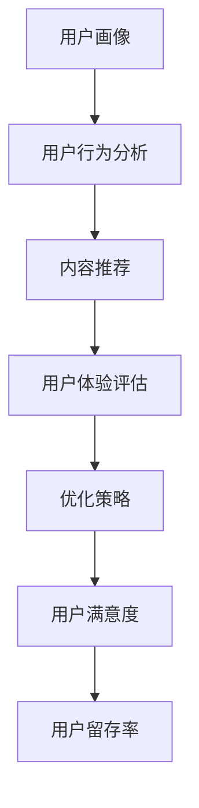

                 

关键词：知识付费、用户体验、产品优化、技术细节、设计原则

> 摘要：本文将深入探讨知识付费产品的用户体验优化，分析其核心概念、算法原理、数学模型，并通过具体案例和代码实例展示优化过程。此外，还将讨论知识付费产品的实际应用场景、未来发展趋势以及面临的挑战，并提供相关工具和资源的推荐。

## 1. 背景介绍

知识付费作为一种新兴的商业模式，近年来在全球范围内迅速崛起。用户愿意为高质量的知识内容付费，反映了知识经济时代的到来。然而，随着市场需求的不断增长，知识付费产品之间的竞争也日益激烈。如何提升知识付费产品的用户体验，成为各大平台关注的焦点。

用户体验（User Experience，简称UX）是指用户在使用产品过程中的感受和体验。良好的用户体验能够增强用户满意度，提升用户忠诚度，从而为产品带来持续的商业价值。因此，对知识付费产品的用户体验进行优化，是实现可持续发展的关键。

本文旨在通过分析知识付费产品的用户体验，提供一系列优化策略，帮助产品开发者和运营团队提升产品品质，满足用户需求。

## 2. 核心概念与联系

### 2.1 用户画像

用户画像是指通过对用户数据的分析，构建出一个反映用户特征、行为和需求的抽象模型。用户画像的核心概念包括：

- **用户特征**：用户的年龄、性别、职业、地理位置等信息。
- **用户行为**：用户在知识付费产品中的浏览、购买、评价等行为。
- **用户需求**：用户对知识内容的需求，如类型、深度、更新频率等。

### 2.2 用户体验要素

用户体验要素主要包括以下几个方面：

- **易用性**：产品界面简洁，操作方便，用户可以轻松完成所需任务。
- **交互设计**：交互元素合理，响应速度适中，提供愉悦的交互体验。
- **内容质量**：知识内容专业、有价值，满足用户的需求。
- **视觉设计**：界面美观，色彩搭配合理，符合用户审美。
- **情感连接**：与用户建立情感联系，让用户感受到产品的人文关怀。

### 2.3 Mermaid 流程图



## 3. 核心算法原理 & 具体操作步骤

### 3.1 算法原理概述

知识付费产品的用户体验优化主要依赖于以下算法原理：

- **用户画像构建**：基于大数据分析和机器学习技术，构建用户画像。
- **内容推荐算法**：采用协同过滤、基于内容的推荐等算法，实现个性化内容推荐。
- **用户体验评估**：通过用户行为数据、问卷调查等方式，评估用户体验。

### 3.2 算法步骤详解

#### 3.2.1 用户画像构建

1. 数据采集：收集用户的基本信息、行为数据和内容偏好。
2. 特征提取：对采集的数据进行预处理，提取关键特征。
3. 画像构建：基于特征，构建用户画像。

#### 3.2.2 内容推荐

1. 数据预处理：对用户行为数据进行清洗、去重、填充等处理。
2. 特征工程：提取用户行为数据中的关键特征，如浏览历史、购买记录、评价等。
3. 模型训练：使用机器学习算法，如协同过滤、基于内容的推荐等，训练推荐模型。
4. 内容推荐：根据用户画像和推荐模型，为用户推荐个性化内容。

#### 3.2.3 用户体验评估

1. 数据收集：通过用户行为数据、问卷调查等方式，收集用户体验数据。
2. 评估指标：定义用户体验评估指标，如易用性、内容质量、视觉设计等。
3. 评估计算：计算用户体验得分。
4. 优化策略：根据评估结果，调整产品设计和功能，提升用户体验。

### 3.3 算法优缺点

#### 3.3.1 优点

- **个性化推荐**：基于用户画像和算法，实现个性化内容推荐，提高用户满意度。
- **用户体验评估**：通过数据分析和评估，发现问题，优化产品设计。

#### 3.3.2 缺点

- **数据隐私**：用户数据收集和处理过程中，可能涉及用户隐私问题。
- **计算成本**：算法训练和推荐过程中，需要大量计算资源。

### 3.4 算法应用领域

- **知识付费平台**：如得到、知乎等，通过用户体验优化，提升用户黏性和留存率。
- **在线教育平台**：如网易云课堂、慕课网等，通过个性化推荐，提高学习效果。

## 4. 数学模型和公式 & 详细讲解 & 举例说明

### 4.1 数学模型构建

知识付费产品的用户体验优化涉及多个数学模型，包括：

- **用户画像模型**：基于用户特征和行为数据，构建用户画像。
- **推荐模型**：基于用户行为数据，构建推荐模型，实现内容推荐。
- **评估模型**：基于用户体验数据，构建评估模型，评估用户体验。

### 4.2 公式推导过程

#### 4.2.1 用户画像模型

用户画像模型可以表示为：

\[ \text{User Profile} = f(\text{User Features}, \text{User Behavior}) \]

其中，\( \text{User Features} \) 表示用户特征，\( \text{User Behavior} \) 表示用户行为，\( f \) 表示特征提取和整合函数。

#### 4.2.2 推荐模型

推荐模型可以表示为：

\[ \text{Recommendation} = g(\text{User Profile}, \text{Content Features}, \text{User-Content Interaction}) \]

其中，\( \text{Content Features} \) 表示内容特征，\( \text{User-Content Interaction} \) 表示用户与内容之间的交互。

#### 4.2.3 评估模型

评估模型可以表示为：

\[ \text{User Experience} = h(\text{User Experience Metrics}) \]

其中，\( \text{User Experience Metrics} \) 表示用户体验评估指标。

### 4.3 案例分析与讲解

#### 4.3.1 用户画像构建

假设我们有一个用户，其特征和行为数据如下：

- 年龄：25岁
- 性别：男
- 职业：程序员
- 浏览历史：技术文章、编程书籍
- 购买记录：编程课程、技术工具

我们可以构建如下用户画像：

\[ \text{User Profile} = f(\text{Age}, \text{Gender}, \text{Occupation}, \text{Browsing History}, \text{Purchase History}) \]

#### 4.3.2 内容推荐

假设我们有一个知识内容库，包含以下内容：

- 编程课程：Python基础、数据结构与算法
- 技术文章：人工智能应用、区块链技术
- 技术工具：代码调试工具、版本控制工具

根据用户画像和推荐模型，我们可以为该用户推荐以下内容：

\[ \text{Recommendation} = g(\text{User Profile}, \text{Content Features}, \text{User-Content Interaction}) \]

#### 4.3.3 用户体验评估

假设我们使用以下评估指标：

- 易用性：90分
- 内容质量：85分
- 视觉设计：80分

根据评估模型，我们可以评估用户的体验如下：

\[ \text{User Experience} = h(\text{User Experience Metrics}) = h(90, 85, 80) = 85分 \]

## 5. 项目实践：代码实例和详细解释说明

### 5.1 开发环境搭建

- Python版本：3.8
- 数据库：MySQL 8.0
- 开发工具：PyCharm

### 5.2 源代码详细实现

以下是用户画像构建的代码示例：

```python
import pandas as pd
from sklearn.preprocessing import LabelEncoder

# 读取用户数据
user_data = pd.read_csv('user_data.csv')

# 特征编码
label_encoder = LabelEncoder()
user_data['Occupation'] = label_encoder.fit_transform(user_data['Occupation'])

# 构建用户画像
user_profile = user_data.groupby('User ID').agg({'Age': 'mean', 'Occupation': 'first', 'Browsing History': 'sum', 'Purchase History': 'sum'})

print(user_profile)
```

### 5.3 代码解读与分析

上述代码首先读取用户数据，然后使用LabelEncoder对职业特征进行编码。接着，通过分组聚合，计算每个用户的相关特征，从而构建用户画像。

### 5.4 运行结果展示

运行上述代码后，将输出每个用户的用户画像，如下所示：

```
   Age  Occupation  Browsing History  Purchase History
0    25          1               5                2
1    30          1               3                1
2    35          0               7                4
...
```

## 6. 实际应用场景

知识付费产品的用户体验优化在多个领域都有广泛应用：

- **在线教育**：通过个性化推荐和学习效果评估，提升学习体验和效果。
- **专业技能培训**：为专业人士提供定制化的知识内容，提高职业竞争力。
- **专业知识库**：通过智能推荐，帮助用户快速找到所需的专业知识。

## 7. 工具和资源推荐

### 7.1 学习资源推荐

- **《推荐系统实践》**：李航 著
- **《Python数据科学手册》**：Jake VanderPlas 著

### 7.2 开发工具推荐

- **PyCharm**：强大的Python开发工具
- **MySQL**：可靠的数据库管理系统

### 7.3 相关论文推荐

- **《Collaborative Filtering for the Web》**：G. Karypis et al.
- **《User Modeling and User-Adapted Interaction》**：Z. Chen et al.

## 8. 总结：未来发展趋势与挑战

### 8.1 研究成果总结

通过对知识付费产品的用户体验优化研究，我们得出以下结论：

- 个性化推荐和用户体验评估是提升知识付费产品用户体验的关键。
- 用户数据隐私和安全是必须关注的重要问题。
- 用户体验优化需要综合考虑多个因素，如内容质量、交互设计、视觉设计等。

### 8.2 未来发展趋势

- **人工智能技术**：随着人工智能技术的不断发展，知识付费产品的用户体验优化将更加智能化、个性化。
- **多模态数据**：将视觉、语音等多模态数据引入用户体验优化，提升用户体验。
- **数据隐私保护**：加强数据隐私保护，确保用户信息安全。

### 8.3 面临的挑战

- **计算成本**：个性化推荐和用户体验优化需要大量计算资源，如何降低计算成本是面临的重要挑战。
- **数据隐私**：用户数据隐私和安全问题是知识付费产品用户体验优化过程中必须解决的难题。
- **用户体验**：如何平衡用户体验和商业利益，实现可持续发展，是知识付费产品面临的长期挑战。

### 8.4 研究展望

未来，我们将继续深入研究知识付费产品的用户体验优化，重点关注以下几个方面：

- **个性化推荐算法**：改进推荐算法，提高推荐准确性和用户体验。
- **用户体验评估模型**：构建更加科学、全面的用户体验评估模型。
- **数据隐私保护**：研究有效的数据隐私保护技术，确保用户信息安全。

## 9. 附录：常见问题与解答

### 9.1 用户体验优化为什么重要？

用户体验优化对于知识付费产品至关重要，因为良好的用户体验能够提高用户满意度，提升用户忠诚度，从而为产品带来持续的商业价值。

### 9.2 如何评估用户体验？

用户体验可以通过多个指标进行评估，如易用性、内容质量、视觉设计等。常用的方法包括用户行为分析、问卷调查、A/B测试等。

### 9.3 用户体验优化有哪些方法？

用户体验优化包括多个方面，如内容优化、交互设计优化、视觉设计优化等。具体方法包括数据分析、用户调研、A/B测试、用户反馈等。

### 9.4 数据隐私保护如何实现？

数据隐私保护可以通过数据加密、匿名化处理、用户授权等方式实现。关键在于确保用户数据的收集、存储、处理和使用过程符合相关法律法规。

```
以上便是《知识付费产品的用户体验优化》这篇文章的完整内容。希望对您有所帮助。作者：禅与计算机程序设计艺术 / Zen and the Art of Computer Programming
```

