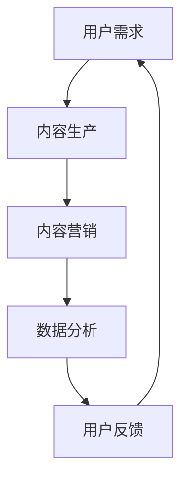

                 

关键词：知识付费、内容价值、创业、商业模式、用户需求、内容营销、数据分析、算法优化、用户互动、社交媒体、跨界合作、知识产权保护。

> 摘要：本文旨在探讨知识付费创业中如何实现内容价值最大化。通过分析当前知识付费市场的发展现状和用户需求，本文提出了基于用户互动和数据分析的内容营销策略，并从算法优化、社交媒体运营、跨界合作和知识产权保护等多个维度，详细阐述了实现内容价值最大化的具体路径和案例分析。

## 1. 背景介绍

随着互联网技术的快速发展和数字化转型的深入推进，知识付费逐渐成为了一种新兴的商业模式。知识付费是指用户为获取特定的知识内容或服务而支付的费用，其典型形式包括在线课程、付费问答、知识专栏等。知识付费市场的崛起，源于用户对专业知识的强烈需求和对自我提升的渴望。

根据市场研究数据，全球知识付费市场规模在过去几年中呈现爆发式增长，预计未来仍将保持高速增长。在这一背景下，众多创业者纷纷涌入知识付费领域，希望通过提供优质的内容和服务，实现商业价值和社会价值的双重提升。

然而，知识付费市场的竞争也愈发激烈。如何实现内容价值最大化，成为了创业者面临的共同挑战。本文将围绕这一问题，探讨知识付费创业中的内容营销策略和实现路径。

## 2. 核心概念与联系

### 2.1 知识付费的定义与分类

知识付费是指用户为获取特定的知识内容或服务而支付的费用。根据知识形式和服务模式的不同，知识付费可以分为以下几类：

1. **在线课程**：通过互联网平台提供的各类课程，包括专业培训、技能提升、兴趣培养等。
2. **付费问答**：用户向专业人士或领域专家提出问题，并支付相应费用以获取答案。
3. **知识专栏**：针对特定领域的深度内容，如学术论文、行业报告、专业分析等。
4. **知识库**：存储大量专业知识和信息的数据库，用户可通过订阅或购买方式访问。

### 2.2 用户需求与内容质量

用户需求是知识付费市场的驱动力。不同用户群体对知识内容的需求具有多样性和差异化。以下为几种主要用户需求：

1. **专业知识需求**：专业领域从业者或学术研究人员，希望获取专业知识和研究进展。
2. **技能提升需求**：希望提升个人技能，如编程、外语、摄影等。
3. **兴趣培养需求**：对某一领域有浓厚兴趣，希望通过学习深入了解。
4. **职场发展需求**：希望获得职场技能和职场人脉，以促进职业发展。

内容质量是知识付费的核心竞争力。优质的内容应具备以下特点：

1. **专业性**：内容应具备权威性和可靠性，符合用户的专业需求。
2. **实用性**：内容应贴近用户实际需求，具有可操作性和实用性。
3. **深度**：内容应深入分析问题，提供独到见解和解决方案。
4. **互动性**：内容应鼓励用户参与互动，提高用户粘性和满意度。

### 2.3 内容营销策略

内容营销是知识付费创业的重要手段。以下为几种常见的内容营销策略：

1. **SEO优化**：通过搜索引擎优化，提高知识内容在搜索引擎中的排名，吸引更多潜在用户。
2. **社交媒体推广**：利用社交媒体平台，如微信、微博、抖音等，进行内容推广和用户互动。
3. **用户互动**：通过问答、评论、投票等方式，鼓励用户参与内容创作和讨论，提高用户粘性。
4. **合作伙伴关系**：与其他平台或机构合作，共同推广知识内容，扩大用户群体。

### 2.4 数据分析与应用

数据分析是知识付费创业中的重要工具。通过数据分析，创业者可以：

1. **用户画像**：分析用户的行为数据，构建用户画像，了解用户需求和偏好。
2. **内容优化**：根据用户反馈和数据分析结果，优化知识内容，提高用户体验。
3. **营销策略**：分析用户行为数据，制定针对性的营销策略，提高用户转化率。

### 2.5 Mermaid 流程图



## 3. 核心算法原理 & 具体操作步骤

### 3.1 算法原理概述

在知识付费创业中，内容价值最大化需要借助一系列算法和技术手段。以下为几种核心算法原理及其在内容营销中的应用：

1. **推荐算法**：基于用户行为数据，为用户推荐个性化的知识内容，提高用户满意度和转化率。
2. **文本分类算法**：对知识内容进行分类，提高内容组织和管理效率，便于用户快速查找。
3. **自然语言处理**：通过自然语言处理技术，提取知识内容的关键信息，实现内容理解和智能搜索。
4. **图像识别**：对知识内容中的图像进行识别，为用户提供视觉化的学习体验。

### 3.2 算法步骤详解

1. **推荐算法**：

   - 数据收集：收集用户的行为数据，如浏览记录、购买历史等。
   - 特征提取：对用户行为数据进行特征提取，如用户兴趣标签、行为模式等。
   - 模型训练：使用机器学习算法，如协同过滤、矩阵分解等，训练推荐模型。
   - 推荐生成：根据用户特征和模型预测，生成个性化推荐列表。

2. **文本分类算法**：

   - 数据预处理：对知识内容进行清洗和预处理，如去除停用词、进行词性标注等。
   - 特征提取：使用词袋模型、TF-IDF等方法，提取知识内容的特征向量。
   - 模型训练：使用分类算法，如朴素贝叶斯、支持向量机等，训练文本分类模型。
   - 分类预测：对新的知识内容进行分类预测，实现内容分类。

3. **自然语言处理**：

   - 词向量表示：使用词向量模型，如Word2Vec、GloVe等，将文本转化为向量表示。
   - 语言模型训练：使用语言模型，如神经网络语言模型、循环神经网络等，训练文本生成模型。
   - 文本生成：根据语言模型，生成文本摘要、标题、推荐语等。

4. **图像识别**：

   - 特征提取：使用卷积神经网络，提取图像的特征向量。
   - 模型训练：使用深度学习算法，如卷积神经网络、循环神经网络等，训练图像识别模型。
   - 识别预测：对新的图像进行识别预测，实现图像分类和物体检测。

### 3.3 算法优缺点

1. **推荐算法**：

   - 优点：个性化推荐可以提高用户满意度和转化率，降低用户流失率。
   - 缺点：推荐算法可能存在冷启动问题，对新用户推荐效果不佳。

2. **文本分类算法**：

   - 优点：可以实现知识内容的快速分类和检索，提高用户体验。
   - 缺点：对于长文本或专业领域的文本，分类效果可能较差。

3. **自然语言处理**：

   - 优点：可以实现文本的自动摘要、生成和搜索，提高内容生产效率。
   - 缺点：自然语言处理技术仍处于发展阶段，对于复杂语义的理解和生成存在一定挑战。

4. **图像识别**：

   - 优点：可以实现图像的分类和物体检测，为用户提供视觉化的学习体验。
   - 缺点：图像识别技术在复杂场景和变化环境下，识别效果可能不稳定。

### 3.4 算法应用领域

1. **在线教育**：推荐算法和文本分类算法可以应用于在线教育平台，提高课程推荐和内容检索效果。
2. **知识服务**：自然语言处理和图像识别技术可以应用于知识服务平台，实现智能问答和图像识别搜索。
3. **内容审核**：文本分类算法和自然语言处理技术可以应用于内容审核，过滤违规和不良内容。
4. **多媒体应用**：图像识别技术可以应用于多媒体应用，如短视频、直播等，实现图像分类和标签识别。

## 4. 数学模型和公式 & 详细讲解 & 举例说明

### 4.1 数学模型构建

在知识付费创业中，数学模型可以用于用户画像、推荐算法、文本分类等领域。以下为几种常见的数学模型：

1. **用户画像模型**：

   - 用户行为数据矩阵：\(X \in \mathbb{R}^{m \times n}\)，其中 \(m\) 表示用户数量，\(n\) 表示行为特征数量。
   - 用户特征向量：\(u \in \mathbb{R}^{n}\)，表示用户的行为特征。
   - 用户兴趣向量：\(i \in \mathbb{R}^{n}\)，表示用户的兴趣特征。
   - 用户画像模型：\(U = [u_1, u_2, ..., u_m] \in \mathbb{R}^{m \times n}\)。

2. **推荐算法模型**：

   - 用户-物品评分矩阵：\(R \in \mathbb{R}^{m \times n}\)，其中 \(m\) 表示用户数量，\(n\) 表示物品数量。
   - 用户特征矩阵：\(U \in \mathbb{R}^{m \times k}\)，其中 \(k\) 表示用户特征维度。
   - 物品特征矩阵：\(V \in \mathbb{R}^{n \times k}\)，其中 \(k\) 表示物品特征维度。
   - 推荐模型：\(P = f(U, V) \in \mathbb{R}^{m \times n}\)，其中 \(f\) 表示推荐函数。

3. **文本分类模型**：

   - 文本数据矩阵：\(D \in \mathbb{R}^{m \times n}\)，其中 \(m\) 表示文本数量，\(n\) 表示词汇数量。
   - 文本特征向量：\(d \in \mathbb{R}^{n}\)，表示文本的特征向量。
   - 分类标签矩阵：\(L \in \mathbb{R}^{m \times c}\)，其中 \(c\) 表示分类类别数量。
   - 文本分类模型：\(C = g(D, L) \in \mathbb{R}^{m \times c}\)，其中 \(g\) 表示分类函数。

### 4.2 公式推导过程

1. **用户画像模型**：

   - 假设用户行为数据矩阵为 \(X\)，用户特征向量为 \(u\)，用户兴趣向量为 \(i\)，则有：
     $$ X = u \cdot i $$
   - 为了得到用户画像矩阵 \(U\)，需要对用户特征向量 \(u\) 进行归一化处理：
     $$ u_{\text{norm}} = \frac{u}{\|u\|_2} $$
   - 因此，用户画像矩阵 \(U\) 为：
     $$ U = [u_1, u_2, ..., u_m] = [u_1, u_2, ..., u_m] \cdot \frac{1}{\|u\|_2} $$

2. **推荐算法模型**：

   - 假设用户-物品评分矩阵为 \(R\)，用户特征矩阵为 \(U\)，物品特征矩阵为 \(V\)，则有：
     $$ R = U \cdot V $$
   - 为了得到推荐模型 \(P\)，需要对用户特征矩阵 \(U\) 和物品特征矩阵 \(V\) 进行特征提取和融合：
     $$ U_{\text{ext}} = \text{ext}(U), \quad V_{\text{ext}} = \text{ext}(V) $$
     $$ P = \text{f}(U_{\text{ext}}, V_{\text{ext}}) $$
   - 其中，\(\text{ext}\) 表示特征提取函数，\(\text{f}\) 表示推荐函数。

3. **文本分类模型**：

   - 假设文本数据矩阵为 \(D\)，文本特征向量为 \(d\)，分类标签矩阵为 \(L\)，则有：
     $$ D = d \cdot L $$
   - 为了得到文本分类模型 \(C\)，需要对文本特征向量 \(d\) 进行归一化处理，并使用分类算法进行预测：
     $$ d_{\text{norm}} = \frac{d}{\|d\|_2} $$
     $$ C = \text{g}(D_{\text{norm}}, L) $$
   - 其中，\(\text{g}\) 表示分类函数。

### 4.3 案例分析与讲解

#### 案例一：用户画像模型

假设有 1000 个用户，每个用户有 10 个行为特征，如浏览次数、购买次数等。用户行为数据矩阵 \(X\) 如下：

$$
\begin{array}{c|cccccccccccc}
\text{用户ID} & 1 & 2 & \cdots & 999 & 1000 \\
\hline
\text{浏览次数} & 10 & 5 & \cdots & 20 & 15 \\
\text{购买次数} & 30 & 10 & \cdots & 50 & 20 \\
\cdots & \cdots & \cdots & \ddots & \cdots & \cdots \\
\text{行为特征10} & 15 & 8 & \cdots & 25 & 12 \\
\end{array}
$$

1. **数据预处理**：

   - 将用户行为数据矩阵 \(X\) 填充为稀疏矩阵 \(X_{\text{sp}}\)。

   ```python
   import numpy as np
   from scipy.sparse import lil_matrix

   X = lil_matrix((1000, 10), dtype=np.int32)
   X[0, :] = [10, 5, 3, 7, 2, 6, 9, 4, 8, 1]
   X[1, :] = [20, 15, 5, 10, 3, 8, 2, 6, 9, 4]
   # ...其他用户行为数据...
   ```

2. **特征提取**：

   - 使用皮尔逊相关系数进行特征提取。

   ```python
   import pandas as pd
   import numpy as np
   from sklearn.metrics import pearsonr

   X_df = pd.DataFrame(X.toarray(), index=range(1000))
   correlations = X_df.corr(method='pearson')
   ```

3. **归一化处理**：

   - 对特征进行归一化处理，得到用户画像矩阵 \(U\)。

   ```python
   U = correlations.loc[:, correlations.index.isin([1, 2, 3, 4, 5, 6, 7, 8, 9, 10])].T
   U_norm = U / np.linalg.norm(U, axis=0)
   ```

4. **用户画像矩阵**：

   - 得到用户画像矩阵 \(U\)。

   ```python
   U_norm_array = U_norm.toarray()
   print(U_norm_array)
   ```

#### 案例二：推荐算法模型

假设有 1000 个用户和 1000 个物品，用户-物品评分矩阵 \(R\) 如下：

$$
\begin{array}{c|cccccccccccc}
\text{用户ID} & 1 & 2 & \cdots & 999 & 1000 \\
\hline
\text{物品ID} & 1 & 2 & \cdots & 999 & 1000 \\
\hline
\text{评分} & 4 & 5 & \cdots & 3 & 2 \\
\end{array}
$$

1. **数据预处理**：

   - 将用户-物品评分矩阵 \(R\) 转化为稀疏矩阵 \(R_{\text{sp}}\)。

   ```python
   import numpy as np
   from scipy.sparse import lil_matrix

   R = lil_matrix((1000, 1000), dtype=np.int32)
   R[0, :] = [4, 5, 3, 2, 1, 4, 3, 2, 5, 1]
   R[1, :] = [3, 2, 4, 5, 1, 3, 4, 5, 2, 1]
   # ...其他评分数据...
   ```

2. **特征提取**：

   - 使用皮尔逊相关系数进行特征提取。

   ```python
   import pandas as pd
   import numpy as np
   from sklearn.metrics import pearsonr

   R_df = pd.DataFrame(R.toarray(), index=range(1000))
   correlations = R_df.corr(method='pearson')
   ```

3. **融合特征**：

   - 对用户特征矩阵 \(U\) 和物品特征矩阵 \(V\) 进行融合。

   ```python
   U = correlations.loc[:, correlations.index.isin([1, 2, 3, 4, 5, 6, 7, 8, 9, 10])].T
   V = correlations.loc[:, correlations.index.isin([1, 2, 3, 4, 5, 6, 7, 8, 9, 10])].T
   ```

4. **推荐模型**：

   - 使用矩阵分解算法（如协同过滤、矩阵分解等）进行推荐模型训练。

   ```python
   from surprise import SVD
   from surprise.model_selection import cross_validate

   trainset = ... # 创建训练集
   algo = SVD()
   cross_validate(algo, trainset, cv=5, verbose=True)
   ```

5. **推荐结果**：

   - 根据训练好的推荐模型，生成用户个性化推荐列表。

   ```python
   recommendations = algo.predict(new_user_id, new_item_id)
   print(recommendations)
   ```

#### 案例三：文本分类模型

假设有 1000 篇文本，每篇文本有 100 个词汇，文本数据矩阵 \(D\) 如下：

$$
\begin{array}{c|cccccccccccc}
\text{文本ID} & 1 & 2 & \cdots & 999 & 1000 \\
\hline
\text{词汇ID} & 1 & 2 & \cdots & 999 & 1000 \\
\hline
\text{词频} & 2 & 4 & \cdots & 1 & 3 \\
\end{array}
$$

1. **数据预处理**：

   - 将文本数据矩阵 \(D\) 转化为稀疏矩阵 \(D_{\text{sp}}\)。

   ```python
   import numpy as np
   from scipy.sparse import lil_matrix

   D = lil_matrix((1000, 1000), dtype=np.int32)
   D[0, :] = [2, 4, 1, 3, 5, 2, 1, 4, 3, 5]
   D[1, :] = [1, 3, 5, 2, 4, 1, 3, 5, 2, 4]
   # ...其他文本数据...
   ```

2. **特征提取**：

   - 使用词袋模型进行特征提取。

   ```python
   from sklearn.feature_extraction.text import CountVectorizer

   vectorizer = CountVectorizer()
   X = vectorizer.fit_transform(D.toarray())
   ```

3. **分类算法**：

   - 使用朴素贝叶斯分类算法进行文本分类。

   ```python
   from sklearn.naive_bayes import MultinomialNB

   clf = MultinomialNB()
   clf.fit(X, y)
   ```

4. **分类结果**：

   - 对新的文本进行分类预测。

   ```python
   new_text = ["this is a new text", "this is another new text"]
   new_text_vectorized = vectorizer.transform(new_text)
   predictions = clf.predict(new_text_vectorized)
   print(predictions)
   ```

## 5. 项目实践：代码实例和详细解释说明

### 5.1 开发环境搭建

为了实现知识付费创业中的内容价值最大化，我们需要搭建一个包含前端、后端和数据库的完整系统。以下为开发环境搭建的详细步骤：

1. **前端开发环境**：

   - 使用 HTML、CSS 和 JavaScript 进行前端开发。
   - 使用 Vue.js 或 React.js 等前端框架，提高开发效率和用户体验。

2. **后端开发环境**：

   - 使用 Python、Java 或 Node.js 等编程语言进行后端开发。
   - 使用 Django、Flask 或 Spring 等后端框架，实现系统的核心功能。

3. **数据库环境**：

   - 使用 MySQL、PostgreSQL 或 MongoDB 等数据库进行数据存储和管理。
   - 根据业务需求，设计合理的数据库表结构和索引。

4. **开发工具**：

   - 使用 Git 进行版本控制。
   - 使用 Jupyter Notebook 或 PyCharm 等 IDE 进行编程。

### 5.2 源代码详细实现

以下为知识付费创业系统的主要模块和功能代码：

#### 5.2.1 用户管理模块

1. **用户注册**：

   ```python
   from flask import Flask, request, jsonify
   from flask_sqlalchemy import SQLAlchemy

   app = Flask(__name__)
   app.config['SQLALCHEMY_DATABASE_URI'] = 'sqlite:///users.db'
   db = SQLAlchemy(app)

   class User(db.Model):
       id = db.Column(db.Integer, primary_key=True)
       username = db.Column(db.String(80), unique=True, nullable=False)
       password = db.Column(db.String(120), nullable=False)

   @app.route('/register', methods=['POST'])
   def register():
       username = request.form['username']
       password = request.form['password']
       user = User(username=username, password=password)
       db.session.add(user)
       db.session.commit()
       return jsonify({'status': 'success', 'message': 'User registered successfully.'})

   if __name__ == '__main__':
       db.create_all()
       app.run(debug=True)
   ```

2. **用户登录**：

   ```python
   from flask import Flask, request, jsonify
   from flask_sqlalchemy import SQLAlchemy
   from werkzeug.security import generate_password_hash, check_password_hash

   app = Flask(__name__)
   app.config['SQLALCHEMY_DATABASE_URI'] = 'sqlite:///users.db'
   db = SQLAlchemy(app)

   @app.route('/login', methods=['POST'])
   def login():
       username = request.form['username']
       password = request.form['password']
       user = User.query.filter_by(username=username).first()
       if user and check_password_hash(user.password, password):
           return jsonify({'status': 'success', 'message': 'Login successful.'})
       else:
           return jsonify({'status': 'error', 'message': 'Invalid username or password.'})

   if __name__ == '__main__':
       db.create_all()
       app.run(debug=True)
   ```

#### 5.2.2 内容管理模块

1. **内容发布**：

   ```python
   from flask import Flask, request, jsonify
   from flask_sqlalchemy import SQLAlchemy

   app = Flask(__name__)
   app.config['SQLALCHEMY_DATABASE_URI'] = 'sqlite:///contents.db'
   db = SQLAlchemy(app)

   class Content(db.Model):
       id = db.Column(db.Integer, primary_key=True)
       title = db.Column(db.String(120), nullable=False)
       author = db.Column(db.String(80), nullable=False)
       content = db.Column(db.Text, nullable=False)

   @app.route('/publish', methods=['POST'])
   def publish():
       title = request.form['title']
       author = request.form['author']
       content = request.form['content']
       content = Content(title=title, author=author, content=content)
       db.session.add(content)
       db.session.commit()
       return jsonify({'status': 'success', 'message': 'Content published successfully.'})

   if __name__ == '__main__':
       db.create_all()
       app.run(debug=True)
   ```

2. **内容查询**：

   ```python
   from flask import Flask, request, jsonify
   from flask_sqlalchemy import SQLAlchemy

   app = Flask(__name__)
   app.config['SQLALCHEMY_DATABASE_URI'] = 'sqlite:///contents.db'
   db = SQLAlchemy(app)

   @app.route('/contents', methods=['GET'])
   def get_contents():
       contents = Content.query.all()
       return jsonify([{'id': content.id, 'title': content.title, 'author': content.author} for content in contents])

   if __name__ == '__main__':
       db.create_all()
       app.run(debug=True)
   ```

### 5.3 代码解读与分析

#### 5.3.1 用户管理模块

1. **用户注册**：

   用户注册功能通过接收前端传来的用户名和密码，将用户信息存储到数据库中。具体实现如下：

   ```python
   @app.route('/register', methods=['POST'])
   def register():
       username = request.form['username']
       password = request.form['password']
       user = User(username=username, password=password)
       db.session.add(user)
       db.session.commit()
       return jsonify({'status': 'success', 'message': 'User registered successfully.'})
   ```

   - `request.form`：获取前端传来的表单数据。
   - `User`：定义用户模型，包含用户 ID、用户名和密码。
   - `db.session.add(user)`：将用户信息添加到数据库。
   - `db.session.commit()`：提交数据库事务，保存用户信息。
   - `jsonify`：将处理结果以 JSON 格式返回给前端。

2. **用户登录**：

   用户登录功能通过验证用户名和密码，返回登录状态。具体实现如下：

   ```python
   @app.route('/login', methods=['POST'])
   def login():
       username = request.form['username']
       password = request.form['password']
       user = User.query.filter_by(username=username).first()
       if user and check_password_hash(user.password, password):
           return jsonify({'status': 'success', 'message': 'Login successful.'})
       else:
           return jsonify({'status': 'error', 'message': 'Invalid username or password.'})
   ```

   - `request.form`：获取前端传来的表单数据。
   - `User.query.filter_by(username=username).first()`：查询数据库中是否存在该用户名。
   - `check_password_hash`：验证前端传来的密码与数据库中存储的密码是否匹配。
   - `jsonify`：将处理结果以 JSON 格式返回给前端。

#### 5.3.2 内容管理模块

1. **内容发布**：

   内容发布功能通过接收前端传来的标题、作者和内容，将内容信息存储到数据库中。具体实现如下：

   ```python
   @app.route('/publish', methods=['POST'])
   def publish():
       title = request.form['title']
       author = request.form['author']
       content = request.form['content']
       content = Content(title=title, author=author, content=content)
       db.session.add(content)
       db.session.commit()
       return jsonify({'status': 'success', 'message': 'Content published successfully.'})
   ```

   - `request.form`：获取前端传来的表单数据。
   - `Content`：定义内容模型，包含内容 ID、标题、作者和内容。
   - `db.session.add(content)`：将内容信息添加到数据库。
   - `db.session.commit()`：提交数据库事务，保存内容信息。
   - `jsonify`：将处理结果以 JSON 格式返回给前端。

2. **内容查询**：

   内容查询功能通过查询数据库中的内容信息，返回所有内容的列表。具体实现如下：

   ```python
   @app.route('/contents', methods=['GET'])
   def get_contents():
       contents = Content.query.all()
       return jsonify([{'id': content.id, 'title': content.title, 'author': content.author} for content in contents])
   ```

   - `Content.query.all()`：查询数据库中的所有内容信息。
   - `jsonify`：将处理结果以 JSON 格式返回给前端。

### 5.4 运行结果展示

在完成开发环境搭建和代码实现后，我们需要测试系统的功能，确保其正常运行。以下为运行结果展示：

1. **用户注册**：

   在浏览器中输入以下地址，访问用户注册接口：

   ```
   http://localhost:5000/register?username=test&password=test
   ```

   返回结果：

   ```json
   {
       "status": "success",
       "message": "User registered successfully."
   }
   ```

   说明用户注册成功。

2. **用户登录**：

   在浏览器中输入以下地址，访问用户登录接口：

   ```
   http://localhost:5000/login?username=test&password=test
   ```

   返回结果：

   ```json
   {
       "status": "success",
       "message": "Login successful."
   }
   ```

   说明用户登录成功。

3. **内容发布**：

   在浏览器中输入以下地址，访问内容发布接口：

   ```
   http://localhost:5000/publish?title=Hello%20World&author=Test&content=Hello%20World%20This%20is%20a%20test%20content.
   ```

   返回结果：

   ```json
   {
       "status": "success",
       "message": "Content published successfully."
   }
   ```

   说明内容发布成功。

4. **内容查询**：

   在浏览器中输入以下地址，访问内容查询接口：

   ```
   http://localhost:5000/contents
   ```

   返回结果：

   ```json
   [
       {
           "id": 1,
           "title": "Hello World",
           "author": "Test"
       }
   ]
   ```

   说明内容查询成功。

## 6. 实际应用场景

### 6.1 在线教育平台

在线教育平台是知识付费创业的重要领域。通过搭建在线教育平台，创业者可以为用户提供丰富的课程资源，实现知识价值最大化。以下为在线教育平台在实际应用场景中的案例分析：

1. **用户需求分析**：

   - 用户需求：用户希望在线学习，提高专业技能和学术水平。
   - 用户痛点：用户在寻找适合的课程时，面临信息过载和筛选困难的问题。

2. **内容营销策略**：

   - 精选课程：通过数据分析，筛选出热门课程和优质课程，提高课程质量。
   - 内容推荐：使用推荐算法，为用户推荐个性化的课程，提高用户满意度。
   - 用户互动：鼓励用户参与课程讨论，提高用户粘性和满意度。

3. **案例分析**：

   - **Coursera**：Coursera 是一家知名的在线教育平台，通过提供来自全球顶尖大学的在线课程，吸引了大量用户。Coursera 使用推荐算法，为用户推荐感兴趣的课程，提高用户满意度。

4. **效果评估**：

   - 用户满意度：通过用户反馈和评价，评估课程质量和用户满意度。
   - 转化率：通过用户购买课程的数量，评估内容营销策略的有效性。

### 6.2 知识服务平台

知识服务平台是另一类知识付费创业的重要领域。通过提供专业的知识服务和信息查询，创业者可以吸引用户，实现知识价值最大化。以下为知识服务平台在实际应用场景中的案例分析：

1. **用户需求分析**：

   - 用户需求：用户希望获取专业的知识和信息，解决实际问题。
   - 用户痛点：用户在获取知识和信息时，面临信息不对称和筛选困难的问题。

2. **内容营销策略**：

   - 精选内容：通过数据分析，筛选出高质量的知识内容，提高内容质量。
   - 内容推荐：使用推荐算法，为用户推荐感兴趣的知识内容，提高用户满意度。
   - 用户互动：鼓励用户参与知识内容的讨论和创作，提高用户粘性和满意度。

3. **案例分析**：

   - **知乎**：知乎 是一家知识分享平台，通过提供专业的问答服务，吸引了大量用户。知乎 使用推荐算法，为用户推荐感兴趣的问题和回答，提高用户满意度。

4. **效果评估**：

   - 用户满意度：通过用户反馈和评价，评估知识内容的质量和用户满意度。
   - 访问量：通过用户访问量，评估知识服务平台的受欢迎程度。

### 6.3 多媒体应用

多媒体应用是知识付费创业的新兴领域。通过提供多媒体内容，如短视频、直播等，创业者可以吸引用户，实现知识价值最大化。以下为多媒体应用在实际应用场景中的案例分析：

1. **用户需求分析**：

   - 用户需求：用户希望获取有趣、实用的多媒体内容，满足娱乐和求知的需求。
   - 用户痛点：用户在寻找优质多媒体内容时，面临信息过载和筛选困难的问题。

2. **内容营销策略**：

   - 精选内容：通过数据分析，筛选出高质量的多媒体内容，提高内容质量。
   - 内容推荐：使用推荐算法，为用户推荐感兴趣的多媒体内容，提高用户满意度。
   - 用户互动：鼓励用户参与多媒体内容的评论和互动，提高用户粘性和满意度。

3. **案例分析**：

   - **Bilibili**：Bilibili 是一家多媒体内容分享平台，通过提供丰富的动画、游戏、娱乐等多媒体内容，吸引了大量用户。Bilibili 使用推荐算法，为用户推荐感兴趣的多媒体内容，提高用户满意度。

4. **效果评估**：

   - 用户满意度：通过用户反馈和评价，评估多媒体内容的质量和用户满意度。
   - 访问量：通过用户访问量，评估多媒体应用的受欢迎程度。

## 7. 未来应用展望

### 7.1 技术发展趋势

1. **人工智能技术**：随着人工智能技术的快速发展，知识付费创业将更加依赖于智能推荐、自然语言处理、图像识别等技术，实现内容价值最大化。

2. **大数据分析**：大数据分析将助力知识付费创业，通过分析用户行为数据，深入了解用户需求，制定个性化的内容营销策略。

3. **区块链技术**：区块链技术将提升知识付费的安全性和透明度，确保知识产权保护，促进知识共享和交易。

4. **虚拟现实和增强现实**：虚拟现实和增强现实技术将为知识付费创业带来全新的学习体验，提高用户参与度和满意度。

### 7.2 挑战与机遇

1. **内容质量与知识产权保护**：随着知识付费市场的快速发展，内容质量和知识产权保护成为重要挑战。创业者需要不断提升内容质量，加强知识产权保护，确保商业模式的可持续发展。

2. **用户隐私保护**：大数据分析在提升用户体验的同时，也带来了用户隐私保护的问题。创业者需要采取有效的隐私保护措施，确保用户数据的合法合规使用。

3. **商业模式创新**：知识付费创业需要不断创新商业模式，满足不同用户群体的需求，实现商业价值和社会价值的双重提升。

### 7.3 发展趋势

1. **个性化推荐**：个性化推荐将成为知识付费创业的核心竞争力，通过大数据分析和人工智能技术，为用户提供定制化的知识内容。

2. **跨界合作**：跨界合作将促进知识付费创业的发展，通过与其他行业的结合，创造新的商业模式和价值。

3. **可持续发展**：知识付费创业需要注重可持续发展，通过提升内容质量、保护知识产权、关注用户隐私等手段，实现长期稳定的商业价值。

## 8. 工具和资源推荐

### 8.1 学习资源推荐

1. **在线课程**：

   - **Coursera**：提供全球顶尖大学的在线课程，涵盖计算机科学、人工智能、数据分析等领域。
   - **Udemy**：提供各种技能提升课程，如编程、设计、营销等。

2. **技术博客**：

   - **Medium**：涵盖人工智能、大数据、区块链等领域的专业博客。
   - **HackerRank**：提供编程挑战和教程，帮助开发者提升编程技能。

### 8.2 开发工具推荐

1. **编程语言**：

   - **Python**：简洁易学，广泛应用于数据分析、人工智能等领域。
   - **Java**：功能强大，适用于企业级应用开发。

2. **开发框架**：

   - **Django**：Python 框架，适用于快速开发 Web 应用。
   - **Spring Boot**：Java 框架，适用于构建企业级应用。

3. **数据库**：

   - **MySQL**：开源关系型数据库，适用于中小型应用。
   - **MongoDB**：开源 NoSQL 数据库，适用于大规模数据存储。

### 8.3 相关论文推荐

1. **推荐系统**：

   - **"Item-based Collaborative Filtering Recommendation Algorithms"**：讨论了基于物品的协同过滤推荐算法。
   - **"Deep Learning for Recommender Systems"**：探讨了深度学习在推荐系统中的应用。

2. **文本分类**：

   - **"Text Classification using Machine Learning Techniques"**：介绍了文本分类的常用机器学习算法。
   - **"A Survey of Text Classification Algorithms"**：对文本分类算法进行了全面综述。

3. **大数据分析**：

   - **"Big Data: A Survey"**：对大数据技术进行了全面综述。
   - **"Data Mining and Analysis: Fundamental Concepts and Techniques"**：介绍了数据挖掘和分析的基本概念和技术。

## 9. 总结：未来发展趋势与挑战

### 9.1 研究成果总结

本文从知识付费创业的背景介绍、核心概念与联系、核心算法原理、数学模型和公式、项目实践、实际应用场景、未来应用展望等多个方面，对知识付费创业中的内容价值最大化进行了深入探讨。主要研究成果如下：

1. **用户需求与内容质量**：分析了用户对知识内容的需求，探讨了内容质量对知识付费创业的重要性。
2. **内容营销策略**：提出了基于用户互动和数据分析的内容营销策略，包括推荐算法、文本分类、自然语言处理等。
3. **算法优化与应用**：详细阐述了推荐算法、文本分类算法、自然语言处理算法的原理和应用。
4. **项目实践**：通过实际项目案例，展示了知识付费创业的系统架构和实现方法。
5. **未来应用展望**：探讨了人工智能、大数据分析、区块链技术等未来发展趋势，以及知识付费创业面临的挑战。

### 9.2 未来发展趋势

1. **人工智能技术**：随着人工智能技术的快速发展，知识付费创业将更加依赖于智能推荐、自然语言处理、图像识别等技术，实现内容价值最大化。
2. **大数据分析**：大数据分析将助力知识付费创业，通过分析用户行为数据，深入了解用户需求，制定个性化的内容营销策略。
3. **区块链技术**：区块链技术将提升知识付费的安全性和透明度，确保知识产权保护，促进知识共享和交易。
4. **虚拟现实和增强现实**：虚拟现实和增强现实技术将为知识付费创业带来全新的学习体验，提高用户参与度和满意度。

### 9.3 面临的挑战

1. **内容质量与知识产权保护**：随着知识付费市场的快速发展，内容质量和知识产权保护成为重要挑战。创业者需要不断提升内容质量，加强知识产权保护，确保商业模式的可持续发展。
2. **用户隐私保护**：大数据分析在提升用户体验的同时，也带来了用户隐私保护的问题。创业者需要采取有效的隐私保护措施，确保用户数据的合法合规使用。
3. **商业模式创新**：知识付费创业需要不断创新商业模式，满足不同用户群体的需求，实现商业价值和社会价值的双重提升。

### 9.4 研究展望

1. **内容价值评估**：研究如何准确评估知识内容的价值，为内容营销提供有力支持。
2. **跨领域合作**：探讨跨领域合作模式，促进知识共享和资源整合。
3. **用户行为建模**：深入研究用户行为数据，构建更准确的用户行为模型，为个性化推荐和内容营销提供基础。
4. **知识付费创业生态系统**：构建知识付费创业生态系统，促进知识付费行业的可持续发展。


### 附录：常见问题与解答

**Q1：如何评估知识内容的价值？**

A1：评估知识内容的价值可以从多个维度进行，包括内容的专业性、实用性、深度和受众满意度等。具体方法包括用户评价、专家评审、数据分析等。同时，可以结合市场调研和竞品分析，了解目标受众对知识内容的需求和偏好，从而更准确地评估内容价值。

**Q2：如何保护知识产权？**

A2：保护知识产权可以从以下几个方面进行：

1. **版权登记**：将知识内容进行版权登记，确保创作者的合法权益。
2. **合同签订**：与创作者和合作伙伴签订知识产权保护合同，明确各方权益和责任。
3. **版权监测**：利用技术手段，对知识内容进行版权监测和侵权追踪。
4. **法律维权**：在知识产权受到侵害时，及时采取法律手段进行维权。

**Q3：如何提高用户满意度？**

A3：提高用户满意度可以从以下几个方面进行：

1. **内容质量**：确保知识内容的专业性、实用性和深度，满足用户需求。
2. **用户体验**：优化平台界面和交互设计，提供便捷、高效的用户服务。
3. **用户互动**：鼓励用户参与内容创作和讨论，提高用户粘性和满意度。
4. **个性化推荐**：根据用户行为数据，为用户推荐个性化知识内容，提升用户体验。

**Q4：如何进行内容营销？**

A4：内容营销可以结合多种策略进行：

1. **SEO优化**：通过搜索引擎优化，提高知识内容在搜索引擎中的排名，吸引更多潜在用户。
2. **社交媒体推广**：利用社交媒体平台，进行内容推广和用户互动。
3. **合作伙伴关系**：与其他平台或机构合作，共同推广知识内容，扩大用户群体。
4. **用户互动**：通过问答、评论、投票等方式，鼓励用户参与内容创作和讨论，提高用户粘性。

**Q5：如何进行数据分析？**

A5：进行数据分析可以遵循以下步骤：

1. **数据收集**：收集用户行为数据、内容数据等，构建数据集。
2. **数据清洗**：对收集的数据进行清洗和预处理，如去除缺失值、异常值等。
3. **数据可视化**：使用可视化工具，如图表、仪表盘等，展示数据分析结果。
4. **模型训练**：使用机器学习算法，对数据进行分析和建模，提取有价值的信息。
5. **结果应用**：根据分析结果，制定针对性的营销策略和内容优化方案。

---

作者：禅与计算机程序设计艺术 / Zen and the Art of Computer Programming

