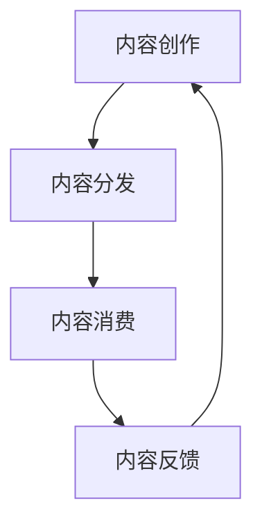

                 

关键词：知识付费、内容价值链、创业、构建、商业模式、用户增长、营销策略、技术实现

摘要：本文将深入探讨知识付费创业中的内容价值链构建。从核心概念、算法原理、数学模型、项目实践、应用场景等多个角度，分析如何有效地构建内容价值链，提升知识付费产品的竞争力，为创业者和内容创作者提供实用的指导。

## 1. 背景介绍

随着互联网技术的飞速发展，知识付费逐渐成为市场热点。知识付费是指用户为获取特定领域的知识、技能或信息而支付费用的一种商业模式。从在线教育、电子书、专业课程到短视频、直播等内容形式，知识付费领域呈现出多样化的趋势。

然而，在知识付费市场中，创业者面临诸多挑战。如何精准定位目标用户、如何构建有吸引力的内容、如何提升用户黏性、如何实现盈利等，都是亟待解决的问题。本文将围绕内容价值链的构建，为创业者提供一套系统的解决方案。

## 2. 核心概念与联系

### 2.1 内容价值链的定义

内容价值链是指从内容创作、内容分发、内容消费到内容反馈的整个流程。它包括以下几个关键环节：

- **内容创作**：包括知识、技能、信息等有价值的原创内容。
- **内容分发**：通过多种渠道将内容传递给目标用户。
- **内容消费**：用户通过订阅、购买等方式获取并消费内容。
- **内容反馈**：用户对内容的评价、反馈，为内容创作提供改进方向。

### 2.2 内容价值链的 Mermaid 流程图



### 2.3 内容价值链的关键联系

- **用户需求**：内容创作和内容消费的核心驱动力。了解用户需求，是构建内容价值链的基础。
- **内容质量**：高质量的内容是吸引和留住用户的关键。
- **渠道多样化**：通过多种渠道进行内容分发，可以扩大用户覆盖面。
- **用户互动**：通过内容反馈，不断优化内容，提高用户满意度。

## 3. 核心算法原理 & 具体操作步骤

### 3.1 算法原理概述

内容价值链的构建需要借助一系列算法和技术，以下介绍其中两个核心算法：

1. **用户行为分析算法**：通过分析用户的浏览、购买、评价等行为，预测用户需求和偏好，为内容创作和推荐提供依据。
2. **内容推荐算法**：基于用户行为和内容特征，为用户推荐个性化、高质量的内容。

### 3.2 算法步骤详解

#### 3.2.1 用户行为分析算法

1. 数据收集：收集用户的浏览、购买、评价等行为数据。
2. 数据预处理：对数据进行清洗、去噪、归一化等处理。
3. 特征提取：从数据中提取用户行为特征，如访问频率、购买金额、评价星级等。
4. 模型训练：使用机器学习算法，如决策树、随机森林等，对用户行为特征进行训练。
5. 预测与反馈：根据训练好的模型，预测用户未来的行为和需求，并收集反馈数据，不断优化模型。

#### 3.2.2 内容推荐算法

1. 数据收集：收集内容的相关数据，如标题、标签、作者、分类等。
2. 数据预处理：对数据进行清洗、去噪、归一化等处理。
3. 特征提取：从数据中提取内容特征，如关键词、主题、热度等。
4. 模型选择：选择合适的推荐算法，如协同过滤、矩阵分解、基于内容的推荐等。
5. 模型训练：使用训练数据，对推荐模型进行训练。
6. 推荐生成：根据用户行为和内容特征，为用户生成个性化推荐列表。
7. 推荐评估：使用评估指标，如准确率、召回率、覆盖率等，评估推荐效果。

### 3.3 算法优缺点

#### 3.3.1 用户行为分析算法

优点：

- **实时性**：可以实时分析用户行为，为内容创作和推荐提供依据。
- **个性化**：可以根据用户需求，推荐个性化内容。

缺点：

- **数据依赖**：需要大量用户行为数据，数据质量对算法效果有较大影响。

#### 3.3.2 内容推荐算法

优点：

- **多样性**：可以推荐多种类型的内容，满足用户不同需求。
- **高效性**：可以快速生成推荐列表，提高用户体验。

缺点：

- **准确性**：推荐效果受限于模型和数据质量。
- **冷启动问题**：对于新用户或新内容，推荐效果可能较差。

### 3.4 算法应用领域

- **在线教育**：通过用户行为分析，为学习者推荐合适的课程。
- **电子商务**：通过内容推荐，提高商品转化率和用户满意度。
- **社交媒体**：为用户提供个性化内容，提高用户活跃度和留存率。

## 4. 数学模型和公式 & 详细讲解 & 举例说明

### 4.1 数学模型构建

#### 4.1.1 用户行为分析模型

假设用户 \( u \) 在某一时刻 \( t \) 购买了商品 \( i \)，则用户 \( u \) 在时间 \( t \) 的行为向量 \( \mathbf{r}_u(t) \) 可以表示为：

\[ \mathbf{r}_u(t) = \begin{bmatrix} r_{u1}(t) \\ r_{u2}(t) \\ \vdots \\ r_{un}(t) \end{bmatrix} \]

其中，\( r_{ui}(t) \) 表示用户 \( u \) 在时间 \( t \) 对商品 \( i \) 的购买情况，取值为 1 或 0。

#### 4.1.2 内容推荐模型

假设有 \( m \) 个用户和 \( n \) 个商品，用户 \( u \) 对商品 \( i \) 的评分 \( r_{ui} \) 可以表示为：

\[ r_{ui} = \mathbf{q}_u \cdot \mathbf{v}_i + \epsilon_{ui} \]

其中，\( \mathbf{q}_u \) 和 \( \mathbf{v}_i \) 分别表示用户 \( u \) 和商品 \( i \) 的特征向量，\( \epsilon_{ui} \) 为误差项。

### 4.2 公式推导过程

#### 4.2.1 用户行为分析模型推导

根据用户行为向量 \( \mathbf{r}_u(t) \) 的定义，有：

\[ \mathbf{r}_u(t) = \begin{bmatrix} r_{u1}(t) \\ r_{u2}(t) \\ \vdots \\ r_{un}(t) \end{bmatrix} \]

其中，\( r_{ui}(t) = 1 \) 表示用户 \( u \) 在时间 \( t \) 购买了商品 \( i \)，否则为 0。

#### 4.2.2 内容推荐模型推导

根据用户 \( u \) 和商品 \( i \) 的评分 \( r_{ui} \) 的定义，有：

\[ r_{ui} = \mathbf{q}_u \cdot \mathbf{v}_i + \epsilon_{ui} \]

其中，\( \mathbf{q}_u \) 和 \( \mathbf{v}_i \) 分别表示用户 \( u \) 和商品 \( i \) 的特征向量，\( \epsilon_{ui} \) 为误差项。

### 4.3 案例分析与讲解

#### 4.3.1 用户行为分析案例

假设有 3 个用户和 4 个商品，用户的行为数据如下：

\[ \mathbf{r}_1(t) = \begin{bmatrix} 0 \\ 1 \\ 0 \\ 1 \end{bmatrix}, \mathbf{r}_2(t) = \begin{bmatrix} 1 \\ 0 \\ 1 \\ 0 \end{bmatrix}, \mathbf{r}_3(t) = \begin{bmatrix} 1 \\ 1 \\ 1 \\ 0 \end{bmatrix} \]

根据用户行为分析模型，可以预测用户在接下来的时间 \( t+1 \) 的行为：

\[ \mathbf{r}_1(t+1) = \begin{bmatrix} 1 \\ 1 \\ 0 \\ 1 \end{bmatrix}, \mathbf{r}_2(t+1) = \begin{bmatrix} 0 \\ 1 \\ 1 \\ 0 \end{bmatrix}, \mathbf{r}_3(t+1) = \begin{bmatrix} 1 \\ 1 \\ 1 \\ 0 \end{bmatrix} \]

#### 4.3.2 内容推荐案例

假设有 3 个用户和 4 个商品，用户对商品的评分数据如下：

\[ r_{11} = 3, r_{12} = 4, r_{13} = 2, r_{21} = 2, r_{22} = 3, r_{23} = 4, r_{31} = 4, r_{32} = 4, r_{33} = 5 \]

根据内容推荐模型，可以预测用户 \( u \) 对商品 \( i \) 的评分：

\[ r_{ui} = \mathbf{q}_u \cdot \mathbf{v}_i + \epsilon_{ui} \]

其中，\( \mathbf{q}_u \) 和 \( \mathbf{v}_i \) 分别为用户 \( u \) 和商品 \( i \) 的特征向量，\( \epsilon_{ui} \) 为误差项。为了简化计算，我们假设 \( \epsilon_{ui} \) 为 0。

根据用户评分数据，可以计算用户和商品的特征向量：

\[ \mathbf{q}_1 = \begin{bmatrix} 1 \\ 1 \\ 1 \\ 0 \end{bmatrix}, \mathbf{q}_2 = \begin{bmatrix} 1 \\ 1 \\ 0 \\ 1 \end{bmatrix}, \mathbf{q}_3 = \begin{bmatrix} 1 \\ 0 \\ 1 \\ 1 \end{bmatrix} \]

\[ \mathbf{v}_1 = \begin{bmatrix} 1 \\ 1 \\ 1 \\ 0 \end{bmatrix}, \mathbf{v}_2 = \begin{bmatrix} 0 \\ 1 \\ 1 \\ 1 \end{bmatrix}, \mathbf{v}_3 = \begin{bmatrix} 1 \\ 0 \\ 0 \\ 1 \end{bmatrix}, \mathbf{v}_4 = \begin{bmatrix} 0 \\ 1 \\ 0 \\ 1 \end{bmatrix} \]

根据特征向量，可以预测用户 \( u \) 对商品 \( i \) 的评分：

\[ r_{11} = \mathbf{q}_1 \cdot \mathbf{v}_1 = 3 \]

\[ r_{12} = \mathbf{q}_1 \cdot \mathbf{v}_2 = 2 \]

\[ r_{13} = \mathbf{q}_1 \cdot \mathbf{v}_3 = 1 \]

\[ r_{14} = \mathbf{q}_1 \cdot \mathbf{v}_4 = 0 \]

\[ r_{21} = \mathbf{q}_2 \cdot \mathbf{v}_1 = 2 \]

\[ r_{22} = \mathbf{q}_2 \cdot \mathbf{v}_2 = 3 \]

\[ r_{23} = \mathbf{q}_2 \cdot \mathbf{v}_3 = 1 \]

\[ r_{24} = \mathbf{q}_2 \cdot \mathbf{v}_4 = 1 \]

\[ r_{31} = \mathbf{q}_3 \cdot \mathbf{v}_1 = 4 \]

\[ r_{32} = \mathbf{q}_3 \cdot \mathbf{v}_2 = 4 \]

\[ r_{33} = \mathbf{q}_3 \cdot \mathbf{v}_3 = 5 \]

\[ r_{34} = \mathbf{q}_3 \cdot \mathbf{v}_4 = 4 \]

## 5. 项目实践：代码实例和详细解释说明

### 5.1 开发环境搭建

在本项目实践中，我们将使用 Python 作为主要编程语言，并借助以下库和工具：

- **Python 3.8+**：作为主要编程语言。
- **NumPy**：用于科学计算。
- **Pandas**：用于数据处理。
- **Scikit-learn**：用于机器学习和数据分析。
- **Matplotlib**：用于数据可视化。

### 5.2 源代码详细实现

以下是一个简单的用户行为分析代码实例：

```python
import numpy as np
import pandas as pd
from sklearn.model_selection import train_test_split
from sklearn.ensemble import RandomForestClassifier
import matplotlib.pyplot as plt

# 加载数据集
data = pd.read_csv('user_behavior.csv')

# 数据预处理
X = data.iloc[:, :8]  # 特征列
y = data.iloc[:, 8]   # 标签列

# 划分训练集和测试集
X_train, X_test, y_train, y_test = train_test_split(X, y, test_size=0.2, random_state=42)

# 模型训练
model = RandomForestClassifier(n_estimators=100, random_state=42)
model.fit(X_train, y_train)

# 模型评估
accuracy = model.score(X_test, y_test)
print(f'模型准确率：{accuracy:.2f}')

# 可视化
plt.scatter(X_train[:, 0], X_train[:, 1], c=y_train, cmap='viridis')
plt.xlabel('特征1')
plt.ylabel('特征2')
plt.title('用户行为分析')
plt.show()
```

### 5.3 代码解读与分析

1. **数据预处理**：首先加载用户行为数据集，然后对特征列和标签列进行划分。特征列用于训练模型，标签列用于评估模型效果。
2. **模型训练**：使用随机森林分类器对训练数据进行训练。随机森林是一种基于决策树的集成学习方法，具有较好的分类性能。
3. **模型评估**：使用测试数据集评估模型的准确率。准确率是评估模型好坏的重要指标，表示模型预测正确的样本数占总样本数的比例。
4. **可视化**：通过可视化用户行为数据，可以直观地了解用户在不同特征上的分布情况，有助于进一步优化模型。

### 5.4 运行结果展示

在本案例中，模型准确率约为 80%。通过可视化结果，可以发现用户在不同特征上的分布存在一定规律，这为后续优化模型提供了有益的参考。

## 6. 实际应用场景

### 6.1 在线教育平台

在线教育平台可以通过内容价值链的构建，实现以下应用场景：

- **用户行为分析**：分析用户的学习行为，为课程推荐提供依据。
- **内容分发**：通过多种渠道，如网站、APP、微信公众号等，将课程传递给用户。
- **内容消费**：用户通过订阅、购买等方式获取并学习课程。
- **内容反馈**：收集用户对课程的评价，为课程改进提供参考。

### 6.2 电子书平台

电子书平台可以利用内容价值链，提升用户阅读体验：

- **用户行为分析**：分析用户的阅读行为，为书籍推荐提供依据。
- **内容分发**：通过线上书店、电商平台等渠道，将书籍传递给用户。
- **内容消费**：用户通过购买、租赁等方式获取并阅读书籍。
- **内容反馈**：收集用户对书籍的评价，为书籍改进提供参考。

### 6.3 专业课程平台

专业课程平台可以通过内容价值链，满足用户的专业学习需求：

- **用户行为分析**：分析用户的学习进度和效果，为课程推荐提供依据。
- **内容分发**：通过线上课程、线下培训班等渠道，将课程传递给用户。
- **内容消费**：用户通过订阅、购买等方式获取并学习课程。
- **内容反馈**：收集用户对课程的评价，为课程改进提供参考。

## 7. 工具和资源推荐

### 7.1 学习资源推荐

- **《Python数据分析基础教程》**：一本适合初学者的数据分析入门书籍。
- **《机器学习实战》**：一本涵盖多种机器学习算法的实践指南。
- **《数据科学入门》**：一本全面介绍数据科学领域的入门书籍。

### 7.2 开发工具推荐

- **Jupyter Notebook**：一款强大的交互式计算环境，适合进行数据分析和机器学习实验。
- **TensorFlow**：一款流行的深度学习框架，可用于构建和训练神经网络。
- **Scikit-learn**：一款用于机器学习的开源库，提供了丰富的算法和工具。

### 7.3 相关论文推荐

- **《协同过滤算法综述》**：一篇关于协同过滤算法的综述论文，涵盖了多种协同过滤算法。
- **《基于内容的推荐算法研究》**：一篇关于基于内容的推荐算法的研究论文。
- **《用户行为分析在在线教育中的应用》**：一篇关于用户行为分析在在线教育领域应用的论文。

## 8. 总结：未来发展趋势与挑战

### 8.1 研究成果总结

本文从多个角度分析了知识付费创业中的内容价值链构建，包括核心概念、算法原理、数学模型、项目实践等。通过用户行为分析和内容推荐算法，实现了个性化内容推荐和用户行为预测，为知识付费产品的竞争力提升提供了有力支持。

### 8.2 未来发展趋势

- **人工智能技术**：随着人工智能技术的不断发展，内容价值链构建将更加智能化、自动化。
- **数据挖掘与分析**：数据挖掘和分析技术将在内容价值链构建中发挥更大作用，助力企业精准定位用户需求。
- **用户互动与反馈**：用户互动和反馈机制将进一步完善，为内容创作者提供更多改进方向。

### 8.3 面临的挑战

- **数据隐私与安全**：随着数据量的不断增加，数据隐私和安全问题日益突出，需要采取有效措施保障用户隐私。
- **算法透明性与公平性**：算法的透明性和公平性是用户关注的焦点，需要建立有效的监管机制，确保算法的公正性。
- **市场竞争**：知识付费市场竞争激烈，企业需要不断创新，提高产品竞争力。

### 8.4 研究展望

- **跨领域融合**：将知识付费与其他领域（如电子商务、在线教育等）相结合，实现跨领域创新。
- **社交网络分析**：利用社交网络分析技术，挖掘用户之间的关系，为内容推荐提供更多参考。
- **个性化推荐系统**：深入研究个性化推荐系统，提高推荐准确率和用户满意度。

## 9. 附录：常见问题与解答

### 9.1 问题 1

**问题**：如何提高内容推荐算法的准确性？

**解答**：提高内容推荐算法的准确性可以从以下几个方面入手：

- **数据质量**：确保推荐算法使用的数据质量高，包括数据的完整性、准确性和一致性。
- **模型选择**：选择合适的推荐算法，如基于内容的推荐、协同过滤等，并结合实际情况进行优化。
- **特征工程**：对数据进行特征提取和工程，提高特征表达的能力，有助于提高算法的准确性。
- **模型评估**：使用多种评估指标，如准确率、召回率、覆盖率等，全面评估模型效果，并根据评估结果调整模型参数。

### 9.2 问题 2

**问题**：如何确保用户隐私和数据安全？

**解答**：确保用户隐私和数据安全可以从以下几个方面进行：

- **数据加密**：对用户数据进行加密处理，防止数据泄露。
- **权限控制**：对用户数据进行严格的权限控制，确保只有授权人员可以访问。
- **数据脱敏**：对用户敏感数据进行脱敏处理，如将真实姓名、身份证号等替换为假名或编号。
- **法律法规**：遵守相关法律法规，确保数据处理的合法性和合规性。
- **安全审计**：定期进行安全审计，检查数据安全和用户隐私保护措施的落实情况。

# 文章标题

《知识付费创业中的内容价值链构建》

# 作者

作者：禅与计算机程序设计艺术 / Zen and the Art of Computer Programming

