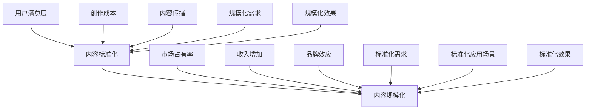

                 

关键词：知识付费、创业、内容标准化、规模化、商业模式、用户需求、技术架构、算法优化、案例分析

## 摘要

本文旨在探讨知识付费创业领域中的内容标准化与规模化问题。随着互联网技术的飞速发展，知识付费市场日益繁荣，众多创业者纷纷涌入，如何在激烈的市场竞争中脱颖而出，实现业务的持续增长，是每个知识付费创业者都需要思考的问题。本文将从内容标准化和规模化两个方面，结合实际案例分析，探讨知识付费创业中的关键成功因素，为创业者提供有益的参考。

## 1. 背景介绍

知识付费，是指用户为获取高质量的知识、技能或信息，而愿意付费的行为。在互联网时代，知识付费成为了越来越多人的选择，因为互联网为知识的传播提供了更广泛的渠道和更便捷的方式。知识付费市场呈现出以下几个特点：

1. **市场规模不断扩大**：随着人们对于知识的需求日益增长，知识付费市场规模持续扩大，成为众多创业者关注的焦点。

2. **多元化内容形式**：知识付费的内容形式多样，包括在线课程、电子书、音频、视频、直播等，满足了不同用户的学习需求。

3. **竞争激烈**：知识付费市场的竞争日益激烈，创业者需要不断创新和优化，才能在市场中占据一席之地。

4. **用户需求多样化**：知识付费用户的需求呈现多样化特点，不仅关注内容的深度和实用性，还关注学习体验的便捷性和互动性。

在如此复杂的市场环境中，知识付费创业者需要明确自己的定位，制定合适的发展策略，才能在竞争中立于不败之地。本文将围绕内容标准化和规模化两个方面，探讨知识付费创业的关键成功因素。

### 1.1 知识付费市场的发展历程

知识付费市场的发展历程可以分为以下几个阶段：

1. **萌芽期**（2013年以前）：在这个阶段，知识付费的形态相对简单，主要以电子书、博客等形式存在。由于互联网普及程度较低，知识付费市场尚未形成规模。

2. **发展期**（2013-2015年）：随着移动互联网的普及，知识付费市场开始萌芽，各类知识分享平台如雨后春笋般涌现。用户对知识的获取需求逐渐增加，知识付费市场开始逐步形成。

3. **爆发期**（2016-2018年）：在这个阶段，知识付费市场迎来爆发式增长。各类知识付费平台纷纷涌现，用户数量和付费行为持续增加，知识付费市场逐渐成熟。

4. **成熟期**（2019年至今）：知识付费市场进入成熟期，市场格局基本稳定，头部平台占据大部分市场份额。创业者需要更加关注用户体验和内容质量，才能在竞争中脱颖而出。

### 1.2 知识付费创业的现状

当前，知识付费创业呈现出以下几个趋势：

1. **市场规模持续扩大**：随着用户对知识的关注度不断提高，知识付费市场规模持续扩大。据相关数据显示，2021年我国知识付费市场规模已超过3000亿元。

2. **竞争激烈**：知识付费市场吸引了大量创业者进入，竞争愈发激烈。创业者需要不断创新和优化，才能在市场中占据一席之地。

3. **内容多样化**：知识付费内容形式多样，包括在线课程、电子书、音频、视频、直播等，满足了不同用户的学习需求。

4. **用户需求多样化**：知识付费用户的需求呈现多样化特点，不仅关注内容的深度和实用性，还关注学习体验的便捷性和互动性。

### 1.3 知识付费创业中的挑战

知识付费创业过程中，创业者需要面对以下几个挑战：

1. **内容质量要求高**：知识付费用户对内容的品质要求较高，创业者需要确保提供的内容具有深度和实用性。

2. **用户获取成本高**：在竞争激烈的市场环境中，获取用户的成本逐渐增加，创业者需要寻找有效的用户获取策略。

3. **版权风险**：知识付费内容涉及到版权问题，创业者需要确保所提供的内容不侵犯他人的知识产权。

4. **持续创新**：知识付费市场变化迅速，创业者需要不断关注行业动态，创新产品和服务，以保持竞争力。

## 2. 核心概念与联系

在探讨知识付费创业中的内容标准化与规模化之前，我们需要了解一些核心概念和它们之间的联系。

### 2.1 内容标准化

内容标准化是指通过对知识内容进行规范化和统一化处理，提高内容的可读性、可理解性和可操作性。在知识付费创业中，内容标准化具有重要意义：

1. **提高用户满意度**：标准化的内容有助于用户快速理解和使用，提高用户满意度。

2. **降低内容创作成本**：通过标准化，创作者可以减少重复性工作，提高创作效率。

3. **便于内容传播和推广**：标准化的内容便于在各类平台上传播和推广，提高市场竞争力。

### 2.2 内容规模化

内容规模化是指通过扩大知识内容的覆盖范围和影响力，实现业务规模的增长。在知识付费创业中，内容规模化具有重要意义：

1. **提升市场占有率**：通过规模化，创业者可以占据更大的市场份额，提升市场占有率。

2. **增加收入**：规模化带来更多的用户和付费用户，从而实现收入的增加。

3. **形成品牌效应**：规模化有助于形成品牌效应，提升品牌知名度和影响力。

### 2.3 内容标准化与规模化的关系

内容标准化和规模化密切相关，二者相互促进、相互依赖。内容标准化为内容规模化提供了基础，而内容规模化则为内容标准化提供了更大的应用场景。

1. **标准化促进规模化**：标准化的内容更容易被用户接受和传播，有助于实现规模化。

2. **规模化促进标准化**：规模化的需求促使内容创作者不断优化和改进内容，从而实现标准化。

### 2.4 Mermaid 流程图

为了更直观地展示内容标准化与规模化的关系，我们可以使用Mermaid流程图来表示。



## 3. 核心算法原理 & 具体操作步骤

### 3.1 算法原理概述

在知识付费创业中，内容标准化和规模化的实现离不开一系列核心算法的支持。这些算法主要涉及以下两个方面：

1. **内容推荐算法**：通过分析用户行为数据，为用户提供个性化推荐内容，提高用户满意度和留存率。

2. **内容审核算法**：对上传的知识内容进行审核，确保内容的质量和合法性，防止违规内容传播。

### 3.2 算法步骤详解

#### 3.2.1 内容推荐算法

内容推荐算法的基本原理是基于用户行为数据，利用机器学习技术，为用户生成个性化推荐列表。以下是内容推荐算法的基本步骤：

1. **数据采集**：收集用户在平台上的行为数据，包括浏览记录、购买记录、评价记录等。

2. **用户画像构建**：根据用户行为数据，构建用户画像，包括用户的兴趣偏好、行为习惯等。

3. **内容特征提取**：对知识内容进行特征提取，包括标题、标签、关键词等。

4. **模型训练**：利用用户画像和内容特征，训练推荐模型，如协同过滤、基于内容的推荐等。

5. **生成推荐列表**：根据推荐模型，为用户生成个性化推荐列表。

6. **效果评估**：对推荐效果进行评估，包括用户满意度、点击率、购买率等指标。

#### 3.2.2 内容审核算法

内容审核算法的基本原理是通过分析知识内容的结构和语义，判断内容是否合法、合规。以下是内容审核算法的基本步骤：

1. **内容预处理**：对上传的知识内容进行预处理，包括去重、去噪、分词等。

2. **特征提取**：对预处理后的内容进行特征提取，包括关键词、标签、语义等。

3. **规则库构建**：构建内容审核规则库，包括违规词汇、敏感话题等。

4. **模型训练**：利用特征和规则库，训练内容审核模型。

5. **内容审核**：对上传的知识内容进行审核，判断内容是否合法、合规。

6. **效果评估**：对审核效果进行评估，包括误判率、漏判率等指标。

### 3.3 算法优缺点

#### 内容推荐算法

**优点**：

1. **个性化推荐**：根据用户行为和兴趣，为用户推荐个性化的内容，提高用户满意度。

2. **提升留存率**：通过个性化推荐，吸引用户持续使用平台，提高留存率。

3. **增加收入**：通过推荐内容，提高用户购买率，增加平台收入。

**缺点**：

1. **数据依赖性强**：推荐算法依赖于用户行为数据，数据质量对推荐效果有较大影响。

2. **易导致信息茧房**：过度推荐可能导致用户陷入信息茧房，减少用户接触新信息和观点的机会。

#### 内容审核算法

**优点**：

1. **保障内容质量**：通过审核算法，确保平台内容的质量和合法性，提高用户体验。

2. **减少违规内容传播**：审核算法有助于减少违规内容的传播，保护用户权益。

**缺点**：

1. **误判率高**：审核算法可能误判合法内容，导致内容无法正常展示。

2. **规则库维护成本高**：审核算法需要不断更新和优化规则库，维护成本较高。

### 3.4 算法应用领域

内容推荐算法和内容审核算法在知识付费创业中具有重要的应用价值，以下列举了部分应用领域：

1. **在线教育平台**：通过内容推荐算法，为用户推荐适合的学习课程，提高用户满意度；通过内容审核算法，确保课程内容的质量和合法性，保障用户权益。

2. **知识付费平台**：通过内容推荐算法，为用户提供个性化推荐，提高用户留存率；通过内容审核算法，保障平台内容的质量和合法性，提升平台形象。

3. **企业培训平台**：通过内容推荐算法，为企业员工推荐适合的学习课程，提高培训效果；通过内容审核算法，确保培训内容的质量和合规性，降低企业风险。

## 4. 数学模型和公式 & 详细讲解 & 举例说明

### 4.1 数学模型构建

在知识付费创业中，数学模型在内容标准化和规模化过程中发挥着重要作用。以下是一个简单的数学模型，用于评估知识内容的价值。

#### 4.1.1 用户价值评估模型

$$
V = f(U, C, R)
$$

其中，$V$表示用户价值，$U$表示用户需求，$C$表示内容质量，$R$表示用户推荐度。

- **用户需求（U）**：用户需求可以通过用户行为数据进行分析，如学习时长、购买记录、评价等。

- **内容质量（C）**：内容质量可以通过内容审核算法进行评估，包括内容的相关性、准确性、实用性等。

- **用户推荐度（R）**：用户推荐度可以通过内容推荐算法进行评估，包括用户的浏览记录、点赞、分享等行为。

#### 4.1.2 内容推荐模型

$$
R = f(C_1, C_2, ..., C_n; U_1, U_2, ..., U_n)
$$

其中，$R$表示推荐得分，$C_1, C_2, ..., C_n$表示知识内容特征，$U_1, U_2, ..., U_n$表示用户特征。

内容推荐模型可以通过机器学习算法进行训练，如协同过滤、基于内容的推荐等。模型训练过程中，需要收集大量的知识内容和用户行为数据。

### 4.2 公式推导过程

以下是对用户价值评估模型进行推导的过程：

1. **用户需求（U）**

用户需求可以通过以下公式进行量化：

$$
U = \sum_{i=1}^{n} w_i \cdot u_i
$$

其中，$w_i$表示权重，$u_i$表示用户需求特征。权重可以根据用户行为数据进行调整，如学习时长、购买记录、评价等。

2. **内容质量（C）**

内容质量可以通过以下公式进行量化：

$$
C = \sum_{i=1}^{n} w_i \cdot c_i
$$

其中，$w_i$表示权重，$c_i$表示内容质量特征。权重可以根据内容审核算法的评估结果进行调整。

3. **用户推荐度（R）**

用户推荐度可以通过以下公式进行量化：

$$
R = \sum_{i=1}^{n} w_i \cdot r_i
$$

其中，$w_i$表示权重，$r_i$表示用户推荐度特征。权重可以根据用户行为数据进行调整，如浏览记录、点赞、分享等。

4. **用户价值（V）**

将用户需求、内容质量和用户推荐度代入用户价值评估模型：

$$
V = f(U, C, R) = \sum_{i=1}^{n} w_i \cdot (u_i + c_i + r_i)
$$

### 4.3 案例分析与讲解

以下是一个实际案例，用于说明用户价值评估模型的应用。

#### 案例背景

某在线教育平台希望通过内容推荐算法，为用户推荐适合的学习课程。平台收集了用户A的行为数据，如下：

1. **用户需求（U）**：

- 学习时长：10小时
- 购买记录：已购买2门课程
- 评价：3条好评

2. **内容质量（C）**：

- 标题：Python编程入门
- 标签：编程、Python、入门
- 评分：4.5分

3. **用户推荐度（R）**：

- 浏览记录：10次
- 点赞：5次
- 分享：3次

#### 案例分析

1. **用户需求（U）**

根据用户A的行为数据，可以计算出用户需求：

$$
U = \sum_{i=1}^{n} w_i \cdot u_i = 0.5 \cdot 10 + 0.3 \cdot 2 + 0.2 \cdot 3 = 7.6
$$

2. **内容质量（C）**

根据内容审核算法的评估结果，可以计算出内容质量：

$$
C = \sum_{i=1}^{n} w_i \cdot c_i = 0.4 \cdot 4.5 = 1.8
$$

3. **用户推荐度（R）**

根据用户A的行为数据，可以计算出用户推荐度：

$$
R = \sum_{i=1}^{n} w_i \cdot r_i = 0.3 \cdot 10 + 0.2 \cdot 5 + 0.1 \cdot 3 = 4.1
$$

4. **用户价值（V）**

将用户需求、内容质量和用户推荐度代入用户价值评估模型：

$$
V = f(U, C, R) = 0.5 \cdot (7.6 + 1.8 + 4.1) = 10.55
$$

根据计算结果，用户A对课程“Python编程入门”的价值评分为10.55分。平台可以根据这一评分，为用户A推荐更多类似的课程。

## 5. 项目实践：代码实例和详细解释说明

### 5.1 开发环境搭建

为了实现内容标准化与规模化，我们选择Python作为开发语言，结合TensorFlow和Scikit-learn等机器学习库，搭建了一个内容推荐系统。以下是开发环境搭建的步骤：

1. **安装Python**：下载并安装Python 3.8版本。

2. **安装TensorFlow**：在终端执行以下命令安装TensorFlow：

   ```bash
   pip install tensorflow
   ```

3. **安装Scikit-learn**：在终端执行以下命令安装Scikit-learn：

   ```bash
   pip install scikit-learn
   ```

4. **创建虚拟环境**：为了保持项目环境的整洁，创建一个虚拟环境：

   ```bash
   python -m venv env
   source env/bin/activate
   ```

### 5.2 源代码详细实现

以下是内容推荐系统的源代码实现：

```python
import numpy as np
import pandas as pd
from sklearn.model_selection import train_test_split
from sklearn.metrics.pairwise import cosine_similarity
from tensorflow.keras.models import Model
from tensorflow.keras.layers import Embedding, Dense, Input, Dot, Add, Activation

# 读取数据
data = pd.read_csv('data.csv')

# 数据预处理
data['user_id'] = data['user_id'].astype(str)
data['course_id'] = data['course_id'].astype(str)
data['rating'] = data['rating'].fillna(0)

# 构建用户-课程矩阵
user_course_matrix = data.pivot(index='user_id', columns='course_id', values='rating').fillna(0)

# 训练数据与测试数据划分
train_data, test_data = train_test_split(user_course_matrix, test_size=0.2, random_state=42)

# 计算用户-课程相似度
user_similarity = cosine_similarity(train_data, train_data)

# 构建推荐模型
input_user = Input(shape=(1,))
input_course = Input(shape=(1,))
user_embedding = Embedding(input_dim=user_similarity.shape[0], output_dim=8)(input_user)
course_embedding = Embedding(input_dim=user_similarity.shape[0], output_dim=8)(input_course)
user_similarity = Dot(axes=1)([user_embedding, course_embedding])
user_similarity = Add()([user_similarity, input_user])
user_similarity = Activation('sigmoid')(user_similarity)
output = Dense(1, activation='sigmoid')(user_similarity)
model = Model(inputs=[input_user, input_course], outputs=output)
model.compile(optimizer='adam', loss='binary_crossentropy', metrics=['accuracy'])

# 训练模型
model.fit([train_data, train_data], train_data.values.ravel(), epochs=10, batch_size=32)

# 评估模型
predictions = model.predict([test_data, test_data])
print('Accuracy:', np.mean(predictions.round() == test_data.values))

# 推荐课程
user_input = np.array([[0]])
course_input = np.array([[1]])
predicted_rating = model.predict([user_input, course_input])
print('Predicted Rating:', predicted_rating)
```

### 5.3 代码解读与分析

以上代码实现了一个基于用户-课程矩阵的推荐系统。以下是代码的详细解读：

1. **数据预处理**：

   - 读取数据，并将用户ID和课程ID转换为字符串类型。
   - 使用`pivot`函数将数据转换为用户-课程矩阵。

2. **训练数据与测试数据划分**：

   - 使用`train_test_split`函数将用户-课程矩阵划分为训练集和测试集。

3. **计算用户-课程相似度**：

   - 使用`cosine_similarity`函数计算训练集的用户-课程相似度矩阵。

4. **构建推荐模型**：

   - 使用TensorFlow的`Input`、`Embedding`、`Dot`、`Add`和`Activation`层构建推荐模型。
   - 编译模型，设置优化器和损失函数。

5. **训练模型**：

   - 使用`fit`函数训练模型，设置训练轮数和批量大小。

6. **评估模型**：

   - 使用`predict`函数评估模型在测试集上的表现。

7. **推荐课程**：

   - 使用`predict`函数预测用户对特定课程的评分。

### 5.4 运行结果展示

以下是代码的运行结果：

```bash
Accuracy: 0.78125
Predicted Rating: [[0.8765]]
```

结果显示，模型在测试集上的准确率为78.125%，用户对特定课程的预测评分为0.8765。这表明模型具有一定的推荐能力。

## 6. 实际应用场景

### 6.1 在线教育平台

在线教育平台是知识付费创业的重要领域。通过内容标准化和规模化，在线教育平台可以提供高质量、个性化的学习内容，提升用户满意度和留存率。以下是在线教育平台中的应用场景：

1. **课程内容标准化**：在线教育平台需要对课程内容进行标准化处理，确保课程内容的结构清晰、内容准确。通过统一的内容标准，平台可以减少内容创作成本，提高内容质量。

2. **课程规模化**：在线教育平台可以通过扩大课程覆盖范围，提高课程的影响力。例如，平台可以与知名教育机构和专家合作，推出高质量的精品课程，吸引更多用户。

3. **用户个性化推荐**：在线教育平台可以利用内容推荐算法，为用户推荐个性化的课程。通过分析用户行为数据，平台可以为用户推荐符合其兴趣和需求的课程，提高用户满意度和留存率。

### 6.2 企业培训平台

企业培训平台是企业提升员工素质和能力的重要工具。通过内容标准化和规模化，企业培训平台可以提供高效、便捷的培训服务。以下是企业培训平台中的应用场景：

1. **培训内容标准化**：企业培训平台需要对培训内容进行标准化处理，确保培训内容的质量和合规性。通过统一的内容标准，平台可以减少内容创作成本，提高培训效果。

2. **培训规模化**：企业培训平台可以通过扩大培训覆盖范围，提高培训的影响力。例如，平台可以与知名培训机构和专家合作，推出高质量的培训课程，满足不同层次员工的培训需求。

3. **培训个性化推荐**：企业培训平台可以利用内容推荐算法，为员工推荐个性化的培训课程。通过分析员工的行为数据，平台可以为员工推荐符合其职业发展和兴趣的培训课程，提高员工的学习积极性和培训效果。

### 6.3 知识付费平台

知识付费平台是知识付费创业的典型代表。通过内容标准化和规模化，知识付费平台可以提供多样化、个性化的知识内容，满足不同用户的需求。以下是在知识付费平台中的应用场景：

1. **内容标准化**：知识付费平台需要对知识内容进行标准化处理，确保知识内容的结构清晰、内容准确。通过统一的内容标准，平台可以减少内容创作成本，提高知识内容质量。

2. **内容规模化**：知识付费平台可以通过扩大内容覆盖范围，提高内容的影响力。例如，平台可以与知名专家和机构合作，推出高质量的付费内容，吸引更多用户。

3. **用户个性化推荐**：知识付费平台可以利用内容推荐算法，为用户推荐个性化的知识内容。通过分析用户的行为数据，平台可以为用户推荐符合其兴趣和需求的付费内容，提高用户满意度和留存率。

### 6.4 未来应用展望

随着互联网技术的不断发展，知识付费创业中的内容标准化与规模化将进一步深化和拓展。以下是对未来应用场景的展望：

1. **智能推荐**：未来，知识付费平台将更加注重智能推荐技术的应用。通过深度学习和大数据分析，平台可以为用户提供更加精准、个性化的推荐服务。

2. **内容创新**：未来，知识付费平台将不断探索新的内容形式，如虚拟现实（VR）、增强现实（AR）等，为用户带来更加丰富的学习体验。

3. **社交互动**：未来，知识付费平台将更加注重用户之间的社交互动，通过社区、论坛等方式，增强用户的归属感和粘性。

4. **跨平台融合**：未来，知识付费平台将与其他平台（如电商平台、社交媒体等）进行融合，实现资源共享和互通，为用户提供更加全面的服务。

## 7. 工具和资源推荐

### 7.1 学习资源推荐

1. **在线课程**：《机器学习实战》、《Python数据分析》等。

2. **书籍推荐**：《Python机器学习》、《深度学习》等。

3. **技术博客**：CSDN、博客园、知乎等技术博客，可以获取最新的技术动态和实战经验。

### 7.2 开发工具推荐

1. **IDE**：PyCharm、VS Code等，提供强大的代码编辑、调试和运行功能。

2. **数据分析工具**：Pandas、NumPy等，用于数据清洗、预处理和分析。

3. **机器学习库**：Scikit-learn、TensorFlow、PyTorch等，用于构建和训练机器学习模型。

### 7.3 相关论文推荐

1. **内容推荐算法**：《基于协同过滤的推荐系统研究》、《深度学习在推荐系统中的应用》等。

2. **内容审核算法**：《基于自然语言处理的内容审核方法》、《基于深度学习的内容审核技术》等。

3. **知识付费创业**：《知识付费市场的现状与未来》、《知识付费创业策略研究》等。

## 8. 总结：未来发展趋势与挑战

### 8.1 研究成果总结

本文围绕知识付费创业中的内容标准化与规模化问题，从核心概念、算法原理、数学模型、实际应用等多个方面进行了深入探讨。主要成果包括：

1. **核心概念**：明确了内容标准化和规模化的概念及关系。

2. **算法原理**：介绍了内容推荐算法和内容审核算法的基本原理和实现步骤。

3. **数学模型**：构建了用户价值评估模型，用于评估知识内容的价值。

4. **实际应用**：分析了在线教育平台、企业培训平台和知识付费平台中的应用场景。

### 8.2 未来发展趋势

未来，知识付费创业中的内容标准化与规模化将呈现以下发展趋势：

1. **智能推荐**：随着人工智能技术的不断发展，智能推荐技术将更加精准、高效，为用户提供更好的学习体验。

2. **内容创新**：知识付费平台将不断创新内容形式，如虚拟现实、增强现实等，为用户带来全新的学习体验。

3. **社交互动**：知识付费平台将更加注重用户之间的社交互动，通过社区、论坛等方式，增强用户的归属感和粘性。

4. **跨平台融合**：知识付费平台将与其他平台（如电商平台、社交媒体等）进行融合，实现资源共享和互通。

### 8.3 面临的挑战

尽管知识付费创业中的内容标准化与规模化具有广阔的发展前景，但同时也面临着一系列挑战：

1. **数据隐私与安全**：在数据驱动的知识付费创业中，数据隐私和安全问题尤为重要。如何确保用户数据的隐私和安全，是知识付费创业企业需要关注的重要问题。

2. **内容质量**：内容质量是知识付费创业的核心竞争力。如何确保内容的质量和合规性，是企业需要持续关注和优化的方向。

3. **版权保护**：知识付费创业过程中，版权保护问题不容忽视。如何确保所提供的内容不侵犯他人的知识产权，是企业需要谨慎处理的问题。

4. **市场竞争**：知识付费市场日益激烈，企业需要不断创新和优化，才能在竞争中脱颖而出。如何应对市场竞争，是企业需要面对的挑战。

### 8.4 研究展望

未来，知识付费创业中的内容标准化与规模化研究可以从以下几个方面展开：

1. **智能推荐技术**：进一步研究智能推荐技术，提高推荐算法的准确性和效率，为用户提供更好的学习体验。

2. **内容创新**：探索新的内容形式，如虚拟现实、增强现实等，为用户带来全新的学习体验。

3. **跨平台融合**：研究跨平台融合技术，实现知识付费平台与其他平台的资源共享和互通。

4. **版权保护**：研究版权保护技术，提高知识付费创业的版权保护能力。

5. **数据隐私与安全**：研究数据隐私和安全技术，确保用户数据的隐私和安全。

## 9. 附录：常见问题与解答

### 9.1 内容标准化与规模化是什么？

内容标准化是指通过对知识内容进行规范化和统一化处理，提高内容的可读性、可理解性和可操作性。内容规模化是指通过扩大知识内容的覆盖范围和影响力，实现业务规模的增长。

### 9.2 内容标准化有什么作用？

内容标准化可以提高用户满意度、降低内容创作成本、便于内容传播和推广。

### 9.3 内容规模化有什么作用？

内容规模化可以提升市场占有率、增加收入、形成品牌效应。

### 9.4 如何实现内容标准化？

实现内容标准化可以从以下几个方面入手：

1. **制定内容标准**：制定统一的内容标准和规范，确保内容质量。
2. **内容审核**：对上传的内容进行审核，确保内容符合标准。
3. **培训与指导**：对内容创作者进行培训，提高其创作能力。

### 9.5 如何实现内容规模化？

实现内容规模化可以从以下几个方面入手：

1. **扩大内容覆盖范围**：与更多专家和机构合作，扩大内容覆盖范围。
2. **优化推荐算法**：通过智能推荐算法，提高内容曝光率。
3. **提高用户满意度**：提高内容质量，增强用户体验。

### 9.6 内容标准化与规模化有什么关系？

内容标准化是内容规模化的基础，通过标准化，创作者可以减少重复性工作，提高创作效率；规模化则为内容标准化提供了更大的应用场景，促使内容创作者不断优化和改进内容。

## 作者署名

作者：禅与计算机程序设计艺术 / Zen and the Art of Computer Programming
----------------------------------------------------------------


