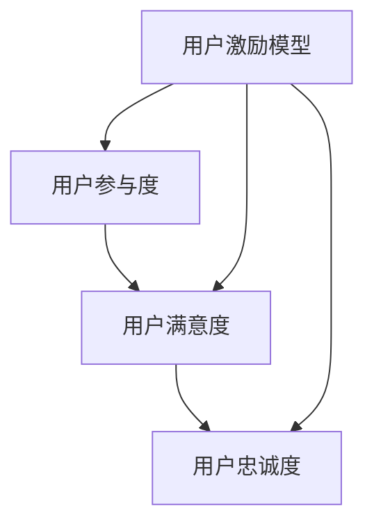

                 

关键词：知识付费、用户激励、激励机制设计、用户参与、用户体验

摘要：本文从知识付费创业的背景出发，探讨了用户激励机制的设计原则、核心概念以及实际操作方法。通过数学模型、算法原理以及项目实践等多个角度，深入分析了如何通过有效的激励机制提升用户的参与度和付费意愿，为知识付费平台提供了一种全新的思考和解决方案。

## 1. 背景介绍

随着互联网的快速发展，知识付费逐渐成为一种重要的商业模式。从最早的付费专栏、课程，到后来的知识问答、直播教学，知识付费平台如雨后春笋般涌现。用户对于优质知识的渴望与日俱增，但同时也面临着信息过载的问题。为了在众多竞争者中脱颖而出，知识付费平台必须寻找有效的方式吸引和留住用户。

用户激励机制在此背景下显得尤为重要。激励机制的设计不仅影响着用户的参与度和付费意愿，更是决定平台长期发展的关键因素。一个良好的激励机制能够激发用户的积极性和创造力，提高用户的粘性，从而提升平台的整体竞争力。

本文将围绕用户激励机制的设计，从多个维度探讨其在知识付费创业中的应用，为创业者提供有价值的参考。

## 2. 核心概念与联系

在探讨用户激励机制的设计之前，我们需要明确几个核心概念，以及它们之间的联系。

### 2.1 用户参与度

用户参与度是衡量用户在知识付费平台上的活跃程度的重要指标。它包括用户对平台内容的浏览、评论、分享、购买等多种行为。用户参与度越高，意味着用户对平台的依赖和信任度越高。

### 2.2 用户满意度

用户满意度是用户对知识付费平台整体体验的主观评价。它受到平台内容质量、服务态度、交互体验等多种因素的影响。高满意度通常意味着用户更愿意在平台上进行消费和分享。

### 2.3 用户忠诚度

用户忠诚度是用户在长期使用平台过程中表现出的持续行为。它反映了用户对平台的品牌认知和情感投入。高忠诚度的用户往往是平台的忠实支持者和口碑传播者。

### 2.4 用户激励模型

用户激励模型是指通过设计一系列激励机制，引导用户参与平台活动、提升满意度、增强忠诚度的方法。它包括奖励机制、社交机制、成长机制等多个方面。

### 2.5 联系与影响

用户参与度、满意度、忠诚度之间存在着密切的联系。高参与度可以提升用户满意度，进而增强用户忠诚度。而用户激励模型则是通过一系列策略和手段，实现这些指标的提升。

为了更好地理解这些概念之间的联系，我们可以使用Mermaid流程图进行展示：



通过这个流程图，我们可以清晰地看到用户激励机制在提升用户参与度、满意度和忠诚度方面的重要作用。

## 3. 核心算法原理 & 具体操作步骤

### 3.1 算法原理概述

用户激励机制的设计需要遵循一定的原则和算法原理。核心算法原理包括以下方面：

1. **效用理论**：效用理论认为，用户的参与度和满意度是可以通过量化模型进行衡量的。通过构建用户效用模型，可以预测用户的付费意愿和行为。

2. **博弈论**：博弈论研究了在决策过程中个体之间的相互作用。在用户激励机制的设计中，博弈论可以帮助我们分析用户之间的竞争与合作行为，从而设计出更有效的激励机制。

3. **机器学习**：机器学习算法可以用于用户行为分析和个性化推荐。通过分析用户的历史行为数据，我们可以发现用户的需求和偏好，进而提供更加个性化的激励措施。

### 3.2 算法步骤详解

用户激励机制的设计通常包括以下几个步骤：

1. **需求分析**：通过用户调研和市场分析，了解用户的需求和痛点。这一步骤是设计有效激励机制的基础。

2. **效用模型构建**：根据需求分析的结果，构建用户效用模型。该模型可以用于预测用户的付费意愿和行为。

3. **激励策略设计**：基于用户效用模型，设计一系列激励策略。这些策略包括奖励机制、社交机制、成长机制等。

4. **算法优化**：通过机器学习算法，对激励机制进行优化。优化目标可以是提高用户参与度、满意度和忠诚度。

5. **测试与迭代**：将设计好的激励机制应用于实际场景，进行测试和评估。根据测试结果，对激励机制进行迭代和优化。

### 3.3 算法优缺点

用户激励机制的设计具有以下优缺点：

1. **优点**：
   - 提高用户参与度和满意度；
   - 增强用户忠诚度，降低用户流失率；
   - 提升平台品牌形象和市场竞争力。

2. **缺点**：
   - 激励成本较高，需要投入大量资源和精力；
   - 激励效果难以衡量，需要长期观察和评估；
   - 可能导致用户行为短期化，影响长期发展。

### 3.4 算法应用领域

用户激励机制在知识付费、电商、社交媒体等多个领域都有广泛的应用。以下是几个典型的应用案例：

1. **知识付费**：通过积分、优惠券、等级制度等激励措施，提升用户的付费意愿和活跃度。

2. **电商**：通过满减、折扣、返利等激励措施，促进用户购买和复购。

3. **社交媒体**：通过点赞、评论、分享等激励措施，提升用户互动和粘性。

## 4. 数学模型和公式 & 详细讲解 & 举例说明

### 4.1 数学模型构建

在用户激励机制的设计中，我们可以使用以下数学模型：

1. **用户效用模型**：

   用户效用模型用于预测用户的付费意愿。假设用户对知识内容的满意度可以表示为 \(U\)，那么用户效用模型可以表示为：

   \[ U = f(S, C) \]

   其中，\(S\) 表示平台服务，\(C\) 表示用户投入成本。

2. **激励效应模型**：

   激励效应模型用于衡量激励机制对用户行为的影响。假设激励措施为 \(R\)，那么激励效应模型可以表示为：

   \[ E = f(R, U) \]

### 4.2 公式推导过程

根据效用理论，我们可以推导出用户效用模型：

\[ U = \frac{S}{C} \]

其中，\(S\) 和 \(C\) 分别表示平台服务质量和用户投入成本。

接下来，我们推导激励效应模型：

\[ E = \frac{R \cdot U}{C} \]

其中，\(R\) 表示激励措施，\(U\) 表示用户满意度。

### 4.3 案例分析与讲解

以某知识付费平台为例，假设该平台提供的服务质量 \(S\) 为 10，用户投入成本 \(C\) 为 5，用户满意度 \(U\) 为 0.8。现在该平台推出一项奖励机制，用户每购买一次内容，可以获得 2 元的优惠券。假设用户在购买前后的满意度不变，那么我们可以计算出激励效应 \(E\)：

\[ E = \frac{2 \cdot 0.8}{5} = 0.32 \]

这意味着，奖励机制可以提升用户的付费意愿约 32%。

## 5. 项目实践：代码实例和详细解释说明

### 5.1 开发环境搭建

为了实现用户激励机制的设计，我们需要搭建一个开发环境。以下是搭建步骤：

1. 安装 Python 3.8 或更高版本；
2. 安装必要的库，如 NumPy、Pandas、Matplotlib；
3. 配置开发环境，如 PyCharm 或 Jupyter Notebook。

### 5.2 源代码详细实现

以下是用户激励机制设计的 Python 代码实现：

```python
import numpy as np
import pandas as pd
import matplotlib.pyplot as plt

# 用户效用模型
def user_utility(s, c):
    return s / c

# 激励效应模型
def incentive_effect(r, u):
    return r * u

# 案例数据
s = 10
c = 5
u = 0.8
r = 2

# 计算用户效用和激励效应
u_result = user_utility(s, c)
e_result = incentive_effect(r, u_result)

# 输出结果
print(f"用户满意度：{u_result}")
print(f"激励效应：{e_result}")

# 绘制用户效用和激励效应曲线
plt.plot([0, 1], [user_utility(s, c), 1], label="用户效用")
plt.plot([0, 1], [incentive_effect(r, user_utility(s, c)), 1], label="激励效应")
plt.xlabel("用户满意度")
plt.ylabel("效用/激励效应")
plt.legend()
plt.show()
```

### 5.3 代码解读与分析

这段代码首先定义了用户效用模型和激励效应模型，然后通过输入参数计算出用户效用和激励效应。最后，通过 Matplotlib 库绘制了用户效用和激励效应的曲线。

代码中的关键步骤包括：

1. 定义用户效用模型：`user_utility(s, c)`，其中 `s` 表示平台服务，`c` 表示用户投入成本；
2. 定义激励效应模型：`incentive_effect(r, u)`，其中 `r` 表示激励措施，`u` 表示用户满意度；
3. 计算用户效用和激励效应：`u_result` 和 `e_result` 分别表示用户效用和激励效应的结果；
4. 输出结果和绘制曲线：使用 Matplotlib 库绘制用户效用和激励效应曲线，以便更直观地观察结果。

通过这段代码，我们可以直观地看到用户效用和激励效应的变化情况，从而为实际应用提供参考。

## 6. 实际应用场景

用户激励机制在知识付费、电商、社交媒体等多个领域都有广泛的应用。以下是一些典型的实际应用场景：

### 6.1 知识付费

在知识付费领域，用户激励机制可以帮助平台提高用户参与度和付费意愿。例如，通过积分、优惠券、等级制度等激励措施，鼓励用户浏览、购买和分享内容。此外，还可以结合用户行为数据，进行个性化推荐，提升用户满意度。

### 6.2 电商

在电商领域，用户激励机制可以促进用户购买和复购。例如，通过满减、折扣、返利等激励措施，吸引用户进行消费。同时，还可以结合用户评价、点赞、分享等行为，提升用户满意度，增强用户忠诚度。

### 6.3 社交媒体

在社交媒体领域，用户激励机制可以提升用户互动和粘性。例如，通过点赞、评论、分享等激励措施，鼓励用户积极参与平台活动。此外，还可以通过社交圈、推荐好友等机制，扩大用户覆盖范围，提升平台影响力。

### 6.4 未来应用展望

随着人工智能技术的发展，用户激励机制的设计将变得更加智能化和个性化。例如，通过机器学习算法，可以更精准地预测用户需求和偏好，从而提供更加个性化的激励措施。此外，区块链技术的应用也将为用户激励机制带来新的机遇，例如去中心化激励、透明化交易等。

## 7. 工具和资源推荐

为了更好地设计和实现用户激励机制，以下是一些工具和资源的推荐：

### 7.1 学习资源推荐

1. **《用户增长方法论》**：一本关于用户增长和激励机制的入门书籍，适合初学者阅读。
2. **《动机、激励与奖励》**：一本关于心理学和激励机制的深度研究书籍，适合有一定基础的用户阅读。

### 7.2 开发工具推荐

1. **Python**：一种广泛应用的编程语言，适合实现用户激励机制的各种算法和模型。
2. **Matplotlib**：一种用于数据可视化的 Python 库，可以帮助我们更直观地观察和分析用户激励机制的效果。

### 7.3 相关论文推荐

1. **《基于用户行为的激励机制设计》**：一篇关于用户行为和激励机制研究的学术论文，提供了丰富的理论依据和实践经验。
2. **《区块链与激励机制设计》**：一篇探讨区块链技术在激励机制设计中的应用的论文，为去中心化激励提供了新的思路。

## 8. 总结：未来发展趋势与挑战

用户激励机制在知识付费创业中具有重要作用。随着互联网和人工智能技术的发展，用户激励机制的设计将变得更加智能化和个性化。未来，我们需要关注以下发展趋势和挑战：

### 8.1 发展趋势

1. **智能化**：利用机器学习算法，更精准地预测用户需求和偏好，提供个性化的激励措施。
2. **个性化**：结合用户行为数据和社交网络，为用户提供更加个性化的激励体验。
3. **去中心化**：区块链技术的发展将推动去中心化激励机制的实现，提高激励机制的透明度和公正性。

### 8.2 面临的挑战

1. **数据隐私**：用户激励机制的设计需要处理大量用户数据，如何保护用户隐私成为一个重要挑战。
2. **激励机制滥用**：用户可能会滥用激励机制，例如刷单、刷赞等，这对平台的发展和用户体验产生负面影响。
3. **激励机制平衡**：在设计激励机制时，需要在提升用户参与度和降低平台成本之间找到平衡点。

### 8.3 研究展望

未来的研究可以关注以下几个方面：

1. **激励机制与用户体验的关系**：深入研究激励机制对用户体验的影响，为用户提供更好的激励体验。
2. **激励机制在去中心化平台中的应用**：探讨区块链技术在激励机制设计中的应用，实现更加公平和透明的激励机制。
3. **激励机制与其他商业模式的结合**：探索用户激励机制与其他商业模式的结合，提高平台的整体竞争力。

## 9. 附录：常见问题与解答

### 9.1 什么是用户参与度？

用户参与度是指用户在知识付费平台上进行的一系列活动，如浏览、评论、分享、购买等。它反映了用户对平台的活跃程度和依赖程度。

### 9.2 用户激励机制有哪些类型？

用户激励机制包括奖励机制、社交机制、成长机制等多种类型。奖励机制主要通过物质奖励（如优惠券、积分）来激励用户；社交机制通过用户互动和社交网络来提升用户参与度；成长机制通过等级制度、勋章等方式激励用户持续参与。

### 9.3 如何评估用户激励机制的效果？

评估用户激励机制的效果可以通过以下指标：用户参与度、用户满意度、用户忠诚度、平台收入等。通过对比激励机制实施前后的数据，可以评估激励机制的实际效果。

### 9.4 激励机制设计与平台成本之间的关系如何？

激励机制的设计需要考虑平台成本。一方面，过高的激励成本会影响平台的盈利能力；另一方面，过低的激励力度可能导致用户参与度不足。因此，在设计激励机制时，需要在提升用户参与度和降低平台成本之间找到平衡点。

