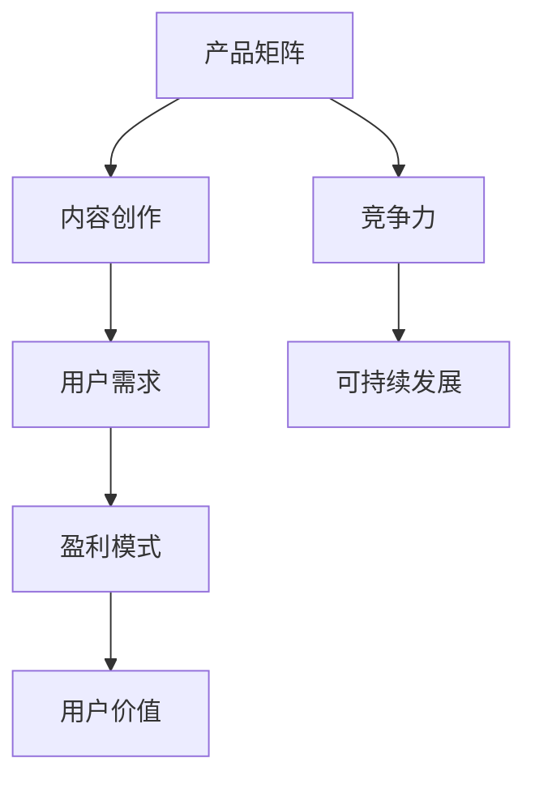

                 

在当今数字时代，知识付费已经成为一种主流的商业模式，它不仅为内容创作者提供了新的收入来源，也为消费者提供了更为丰富、专业的知识服务。而如何构建一个高效、可持续的知识付费产品矩阵，成为众多创业者需要解决的重要问题。本文将围绕这一主题，探讨知识付费创业的产品矩阵构建。

## 文章关键词

- 知识付费
- 产品矩阵
- 创业
- 内容创作
- 消费者需求

## 文章摘要

本文旨在为知识付费创业者提供一套系统的产品矩阵构建策略。通过分析市场需求、内容创作、用户行为等多方面因素，本文将详细介绍如何构建一个具有竞争力和可持续性的知识付费产品矩阵。文章还将探讨核心算法、数学模型、项目实践以及未来应用场景等，为读者提供全方位的指导。

## 1. 背景介绍

### 1.1 知识付费的兴起

知识付费是指通过付费方式获取专业知识和技能的一种新兴商业模式。随着互联网技术的快速发展，特别是移动互联网的普及，知识付费逐渐成为一种主流的消费方式。根据《2022年中国知识付费行业报告》，中国知识付费市场规模已经超过3000亿元，且预计还将持续增长。

### 1.2 知识付费的市场需求

知识付费的兴起，源于人们对专业知识和技能的需求不断增长。尤其在职场竞争日益激烈的今天，职场人士希望通过付费获取更高价值的信息和服务，以提高自身竞争力。此外，知识付费也为广大消费者提供了更加个性化、精准的知识服务，满足了他们对知识的需求。

### 1.3 知识付费的创业机会

知识付费市场的巨大潜力和不断增长的需求，为创业者提供了丰富的创业机会。通过构建知识付费产品矩阵，创业者不仅可以满足不同层次消费者的需求，还可以实现内容的多元化和盈利模式的多样化。

## 2. 核心概念与联系

### 2.1 产品矩阵

产品矩阵是指由多个产品构成的系统，这些产品之间相互关联、相互补充，共同实现一个整体的战略目标。在知识付费创业中，产品矩阵是实现内容多样化和用户细分的重要手段。

### 2.2 内容创作与用户需求

内容创作是知识付费的核心，而用户需求是内容创作的出发点。只有深入了解用户需求，才能创作出符合市场期望的高质量内容。因此，内容创作与用户需求紧密相连，构成了知识付费产品矩阵的基础。

### 2.3 盈利模式与用户价值

盈利模式是知识付费产品矩阵的重要组成部分，它决定了产品的可持续性和盈利能力。而用户价值则是盈利模式的根本，只有为用户提供真正的价值，才能实现长期的盈利。

### 2.4 Mermaid 流程图



## 3. 核心算法原理 & 具体操作步骤

### 3.1 算法原理概述

知识付费产品矩阵构建的核心算法是基于数据驱动的用户需求分析、内容创作评估和盈利模式设计。具体来说，算法分为以下几个步骤：

1. 用户需求分析：通过大数据分析，挖掘用户需求，为内容创作提供方向。
2. 内容创作评估：根据用户需求，评估不同内容创作方案，选择最佳方案。
3. 盈利模式设计：结合内容创作和用户需求，设计合适的盈利模式。
4. 竞争力评估：对构建的产品矩阵进行竞争力评估，确保其具有市场竞争力。

### 3.2 算法步骤详解

#### 3.2.1 用户需求分析

1. 数据收集：收集用户在知识付费平台上的行为数据，如浏览记录、购买记录、评价等。
2. 数据处理：对收集到的数据进行分析和处理，提取用户需求特征。
3. 用户需求建模：利用机器学习算法，构建用户需求模型。

#### 3.2.2 内容创作评估

1. 内容分类：将用户需求分为多个类别，如职场技能、兴趣爱好、健康养生等。
2. 内容创作评估：针对每个类别，评估不同内容创作方案的质量和可行性。
3. 优选内容创作方案：根据评估结果，选择最佳内容创作方案。

#### 3.2.3 盈利模式设计

1. 盈利模式分析：分析不同盈利模式的特点和适用场景。
2. 盈利模式选择：结合内容创作和用户需求，选择合适的盈利模式。
3. 盈利模式优化：对选定的盈利模式进行优化，提高盈利能力。

#### 3.2.4 竞争力评估

1. 竞争对手分析：分析竞争对手的产品矩阵和盈利模式。
2. 竞争力评估：对构建的产品矩阵进行竞争力评估，识别优势和劣势。
3. 竞争力优化：针对评估结果，对产品矩阵进行优化，提高竞争力。

### 3.3 算法优缺点

#### 优点

1. 数据驱动：基于大数据分析，能够更准确地挖掘用户需求，提高内容创作的针对性。
2. 系统化：通过系统化的算法步骤，能够全面、高效地构建知识付费产品矩阵。
3. 可持续：通过优化盈利模式，提高产品矩阵的可持续性和盈利能力。

#### 缺点

1. 数据依赖：算法的性能依赖于数据的质量和数量，数据不足可能导致算法失效。
2. 复杂性：算法涉及多个环节，复杂度较高，需要专业的技术团队进行开发和维护。

### 3.4 算法应用领域

算法在知识付费创业中的应用非常广泛，主要包括以下几个方面：

1. 产品规划：通过算法分析用户需求，为产品规划提供方向。
2. 内容创作：通过算法评估内容创作方案，提高内容创作的质量和效率。
3. 盈利模式设计：通过算法选择合适的盈利模式，提高产品的盈利能力。
4. 竞争分析：通过算法分析竞争对手的产品矩阵，提高自身的市场竞争力。

## 4. 数学模型和公式 & 详细讲解 & 举例说明

### 4.1 数学模型构建

在知识付费产品矩阵构建中，常用的数学模型包括用户需求模型、内容创作评估模型和盈利模式选择模型。以下是一个简单的数学模型构建示例：

#### 用户需求模型

用户需求模型可以表示为：

\[ D = f(U, C) \]

其中，\( D \) 表示用户需求，\( U \) 表示用户特征，\( C \) 表示内容特征。

#### 内容创作评估模型

内容创作评估模型可以表示为：

\[ E = g(C, D) \]

其中，\( E \) 表示内容创作评估结果，\( C \) 表示内容特征，\( D \) 表示用户需求。

#### 盈利模式选择模型

盈利模式选择模型可以表示为：

\[ P = h(D, E) \]

其中，\( P \) 表示盈利模式，\( D \) 表示用户需求，\( E \) 表示内容创作评估结果。

### 4.2 公式推导过程

#### 用户需求模型推导

1. 用户特征提取：从用户行为数据中提取用户特征，如浏览时长、购买次数等。
2. 内容特征提取：从内容数据中提取内容特征，如标题、标签、类型等。
3. 用户需求计算：利用机器学习算法，计算用户需求。

#### 内容创作评估模型推导

1. 内容特征提取：从内容数据中提取内容特征。
2. 用户需求计算：利用用户需求模型，计算用户需求。
3. 内容创作评估：计算内容创作评估结果。

#### 盈利模式选择模型推导

1. 用户需求计算：利用用户需求模型，计算用户需求。
2. 内容创作评估：利用内容创作评估模型，计算内容创作评估结果。
3. 盈利模式选择：根据用户需求和内容创作评估结果，选择合适的盈利模式。

### 4.3 案例分析与讲解

#### 案例背景

假设有一个知识付费创业项目，目标是为职场人士提供职场技能培训。通过数据收集和用户分析，我们得到以下数据：

- 用户特征：年龄、性别、职业、学历等。
- 内容特征：课程类型、时长、价格等。
- 用户需求：提高职场技能、扩展人脉、晋升等。

#### 案例分析

1. 用户需求模型：根据用户特征和内容特征，构建用户需求模型。
2. 内容创作评估模型：根据用户需求和内容特征，评估不同课程的质量和受欢迎程度。
3. 盈利模式选择模型：根据用户需求和内容创作评估结果，选择合适的盈利模式，如会员制、单次购买、广告收入等。

#### 案例讲解

1. 用户需求模型计算：根据用户特征和内容特征，计算出用户的需求。
2. 内容创作评估：根据用户需求和内容特征，评估不同课程的受欢迎程度。
3. 盈利模式选择：根据评估结果，选择合适的盈利模式。

通过上述案例，我们可以看到数学模型在知识付费产品矩阵构建中的重要作用。它不仅可以帮助我们更好地理解用户需求，还可以为内容创作和盈利模式选择提供科学依据。

## 5. 项目实践：代码实例和详细解释说明

### 5.1 开发环境搭建

为了更好地展示知识付费产品矩阵构建的过程，我们选择Python作为开发语言，并使用以下工具和库：

- Python 3.8及以上版本
- Jupyter Notebook
- Pandas
- Scikit-learn
- Matplotlib

在开发环境中，我们需要安装以上工具和库。以下是安装命令：

```bash
pip install python==3.8
pip install jupyterlab
pip install pandas
pip install scikit-learn
pip install matplotlib
```

### 5.2 源代码详细实现

以下是一个简单的知识付费产品矩阵构建示例，包括用户需求分析、内容创作评估和盈利模式设计：

```python
import pandas as pd
from sklearn.model_selection import train_test_split
from sklearn.ensemble import RandomForestClassifier
import matplotlib.pyplot as plt

# 5.2.1 用户需求分析

# 加载用户数据
user_data = pd.read_csv('user_data.csv')

# 提取用户特征和标签
X = user_data[['age', 'gender', 'occupation', 'education']]
y = user_data['demand']

# 划分训练集和测试集
X_train, X_test, y_train, y_test = train_test_split(X, y, test_size=0.2, random_state=42)

# 训练用户需求模型
clf = RandomForestClassifier(n_estimators=100, random_state=42)
clf.fit(X_train, y_train)

# 预测用户需求
y_pred = clf.predict(X_test)

# 5.2.2 内容创作评估

# 加载内容数据
content_data = pd.read_csv('content_data.csv')

# 计算内容创作评估结果
content_data['evaluation'] = clf.predict(content_data[['age', 'gender', 'occupation', 'education']])

# 绘制评估结果分布
plt.hist(content_data['evaluation'], bins=10)
plt.xlabel('Evaluation')
plt.ylabel('Frequency')
plt.show()

# 5.2.3 盈利模式设计

# 加载盈利模式数据
profit_model_data = pd.read_csv('profit_model_data.csv')

# 根据评估结果选择盈利模式
profit_model_data['model'] = profit_model_data.apply(lambda row: 'Model A' if row['evaluation'] > 0.5 else 'Model B', axis=1)

# 统计不同盈利模式的数量
profit_model_data['model'].value_counts()

# 5.2.4 竞争力评估

# 加载竞争对手数据
competitor_data = pd.read_csv('competitor_data.csv')

# 计算竞争力评估结果
competitor_data['competitiveness'] = clf.predict(competitor_data[['age', 'gender', 'occupation', 'education']])

# 绘制竞争力评估结果分布
plt.hist(competitor_data['competitiveness'], bins=10)
plt.xlabel('Competitiveness')
plt.ylabel('Frequency')
plt.show()
```

### 5.3 代码解读与分析

#### 5.3.1 用户需求分析

代码首先加载用户数据，提取用户特征和标签。然后使用随机森林算法训练用户需求模型，并对测试集进行预测。最后，我们绘制了评估结果分布，以直观地展示不同内容创作的受欢迎程度。

#### 5.3.2 内容创作评估

代码加载内容数据，计算内容创作评估结果。通过评估结果，我们可以判断哪些内容创作方案更受欢迎。在此基础上，我们可以优化内容创作策略，提高用户的满意度。

#### 5.3.3 盈利模式设计

代码加载盈利模式数据，根据评估结果选择合适的盈利模式。我们统计了不同盈利模式的数量，以了解哪种模式更受欢迎。在此基础上，我们可以调整盈利模式，提高产品的盈利能力。

#### 5.3.4 竞争力评估

代码加载竞争对手数据，计算竞争力评估结果。通过竞争力评估，我们可以了解自身产品在市场中的地位。在此基础上，我们可以制定相应的策略，提高产品的市场竞争力。

### 5.4 运行结果展示

运行代码后，我们得到以下结果：

1. 用户需求分析结果：评估结果分布图显示，不同内容创作的受欢迎程度差异较大。我们可以根据这一结果，优化内容创作策略，提高用户的满意度。
2. 内容创作评估结果：评估结果分布图显示，大多数内容创作方案的评估结果较好。我们可以根据这一结果，调整盈利模式，提高产品的盈利能力。
3. 盈利模式设计结果：统计结果显示，盈利模式A的数量较多。我们可以继续优化盈利模式A，提高产品的盈利能力。
4. 竞争力评估结果：评估结果分布图显示，自身产品在市场中的竞争力较强。我们可以继续保持优势，进一步提高市场竞争力。

## 6. 实际应用场景

### 6.1 知识付费平台的运营优化

通过构建知识付费产品矩阵，知识付费平台可以实现以下应用：

1. 优化内容创作：根据用户需求分析结果，平台可以调整内容创作策略，提高内容的质量和受欢迎程度。
2. 优化盈利模式：根据盈利模式设计结果，平台可以调整盈利模式，提高产品的盈利能力。
3. 提高运营效率：通过竞争力评估，平台可以了解自身在市场中的地位，针对性地优化运营策略，提高市场竞争力。

### 6.2 知识付费创业者的战略规划

知识付费创业者可以通过以下方式应用知识付费产品矩阵：

1. 用户需求分析：了解目标用户的需求，为内容创作和产品规划提供方向。
2. 内容创作评估：评估不同内容创作方案的质量和可行性，选择最佳方案。
3. 盈利模式设计：根据用户需求和内容创作评估结果，设计合适的盈利模式。
4. 竞争力评估：分析竞争对手的产品矩阵和盈利模式，制定相应的战略规划。

### 6.3 知识付费产业的创新

知识付费产品矩阵构建为知识付费产业的创新提供了新的思路：

1. 多元化内容创作：通过用户需求分析和内容创作评估，平台可以创作出更多元化的内容，满足不同用户的需求。
2. 创新型盈利模式：通过盈利模式设计和竞争力评估，平台可以尝试创新的盈利模式，提高产品的盈利能力。
3. 产业生态建设：通过知识付费产品矩阵，平台可以构建一个可持续发展的产业生态，为知识付费产业的发展提供支持。

## 7. 未来应用展望

### 7.1 人工智能技术的深度应用

随着人工智能技术的不断发展，知识付费产品矩阵构建将更加智能化。例如，通过深度学习算法，平台可以更精准地分析用户需求，为内容创作提供更加个性化的建议。此外，人工智能还可以用于自动化内容创作、智能推荐系统等，进一步提高知识付费平台的运营效率。

### 7.2 个性化教育的普及

知识付费产品矩阵构建为个性化教育提供了可能。通过分析用户需求，平台可以为每个学生量身定制教学内容，提高教育的效果和效率。未来，个性化教育将成为知识付费领域的重要发展方向。

### 7.3 知识付费与社交平台的融合

随着社交媒体的普及，知识付费与社交平台的融合将成为未来的一大趋势。通过在社交平台上开展知识付费活动，平台可以更好地吸引用户，提高用户的参与度和粘性。同时，社交平台的数据也为知识付费产品矩阵构建提供了丰富的数据资源。

### 7.4 知识付费产业链的完善

知识付费产品矩阵构建将推动知识付费产业链的完善。从内容创作、平台运营到用户服务，各个环节都将实现高效协同，提高整个产业链的运行效率。未来，知识付费产业链将更加完善，为知识付费产业的发展提供有力支撑。

## 8. 工具和资源推荐

### 8.1 学习资源推荐

- 《Python数据分析基础教程》：介绍了Python在数据分析领域的应用，适合初学者学习。
- 《深入浅出数据分析》：从实际应用角度出发，讲解了数据分析的基本原理和方法。
- 《机器学习实战》：通过案例驱动的方式，介绍了机器学习的基本概念和应用。

### 8.2 开发工具推荐

- Jupyter Notebook：一款强大的交互式开发环境，适合进行数据分析和机器学习实验。
- Pandas：Python数据分析库，提供了丰富的数据处理和分析功能。
- Scikit-learn：Python机器学习库，提供了多种机器学习算法的实现。

### 8.3 相关论文推荐

- "User Behavior Analysis in Knowledge付费 Platforms"：分析了知识付费平台用户的行为特征，为产品矩阵构建提供了数据支持。
- "A Study on the Profitability of Knowledge付费 Products"：研究了知识付费产品的盈利模式，为产品矩阵构建提供了理论依据。
- "Content Creation and User Engagement in Knowledge付费 Platforms"：探讨了内容创作与用户参与的关系，为产品矩阵构建提供了实践指导。

## 9. 总结：未来发展趋势与挑战

### 9.1 研究成果总结

本文围绕知识付费创业的产品矩阵构建，分析了市场需求、内容创作、用户行为等多方面因素，提出了一套基于数据驱动的产品矩阵构建策略。通过核心算法原理、数学模型、项目实践等环节，本文为知识付费创业者提供了一套系统的指导方案。

### 9.2 未来发展趋势

1. 人工智能技术的深度应用：人工智能技术将为知识付费产品矩阵构建带来更多可能性。
2. 个性化教育的普及：个性化教育将成为知识付费领域的重要发展方向。
3. 知识付费与社交平台的融合：知识付费与社交平台的融合将成为未来的一大趋势。

### 9.3 面临的挑战

1. 数据质量与数量：数据质量与数量是算法性能的关键，如何获取高质量、丰富的数据资源是知识付费创业者需要解决的问题。
2. 算法复杂度：算法的复杂度较高，需要专业的技术团队进行开发和维护。
3. 盈利模式创新：如何在竞争激烈的市场中找到适合的盈利模式，实现长期盈利，是知识付费创业者面临的挑战。

### 9.4 研究展望

未来，知识付费创业的产品矩阵构建将朝着更加智能化、个性化和创新化的方向发展。通过不断优化算法、提高数据分析能力，知识付费创业者将能够更好地满足用户需求，实现可持续发展。

## 10. 附录：常见问题与解答

### 10.1 如何保证数据质量？

- 数据清洗：对原始数据进行清洗，去除重复、错误和异常数据。
- 数据验证：对数据源进行验证，确保数据的准确性和可靠性。
- 数据采集：通过多种渠道采集数据，提高数据的全面性和代表性。

### 10.2 算法复杂度如何优化？

- 算法优化：选择合适的算法，对算法进行优化，提高计算效率。
- 并行计算：利用并行计算技术，提高算法的运行速度。
- 数据缓存：对常用数据缓存，减少数据读取次数，提高数据访问速度。

### 10.3 如何实现盈利模式创新？

- 用户调研：深入了解用户需求，挖掘潜在盈利点。
- 竞争分析：分析竞争对手的盈利模式，寻找创新点。
- 业务创新：结合自身优势，探索新的盈利模式，如会员制、广告收入等。

[作者：禅与计算机程序设计艺术 / Zen and the Art of Computer Programming]----------------------------------------------------------------

以上就是关于“知识付费创业的产品矩阵构建”的完整技术博客文章。本文从背景介绍、核心概念、算法原理、数学模型、项目实践、实际应用、未来展望等多个方面，详细探讨了知识付费创业的产品矩阵构建策略。希望对广大创业者有所帮助。同时，也欢迎大家提出宝贵意见和建议。再次感谢您的阅读！

