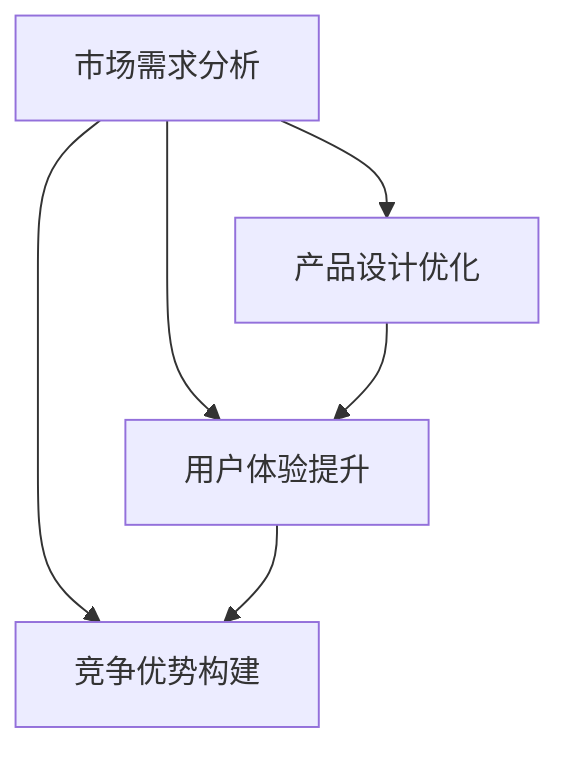

                 

 在这个知识爆炸的时代，知识付费已经成为一个新兴的产业，吸引了大量的创业者和投资者。然而，如何成功地打造一款知识付费产品，并在竞争激烈的市场中脱颖而出，成为了众多创业者的首要难题。本文将探讨知识付费创业的产品迭代策略，旨在帮助创业者更好地理解市场需求，优化产品设计，提升用户体验，最终实现产品的成功迭代。

> **关键词：** 知识付费、产品迭代、市场需求、用户体验、竞争优势

> **摘要：** 本文首先介绍了知识付费行业的背景和发展趋势，然后分析了产品迭代的关键要素，包括市场需求分析、产品设计优化、用户体验提升和竞争优势构建。最后，本文提出了一系列具体的产品迭代策略，并结合实际案例进行了详细讲解。

## 1. 背景介绍

知识付费，即用户为获取专业内容或服务而付费的行为，近年来在全球范围内得到了迅猛发展。这一现象的出现，一方面是由于互联网技术的发展，使得知识传播变得更加便捷；另一方面，随着社会分工的细化，人们对于专业知识和服务的需求日益增长。

在中国，知识付费市场更是呈现出爆炸式增长。根据某研究报告，2020年中国知识付费市场规模已超过3000亿元，预计到2025年将达到1万亿元。这一市场规模的迅速扩大，吸引了众多创业者和企业的进入。

然而，知识付费市场的竞争同样激烈。如何在众多竞争者中脱颖而出，成为创业者们亟待解决的问题。本文将从产品迭代的角度，探讨知识付费创业的成功策略。

## 2. 核心概念与联系

在探讨产品迭代策略之前，我们需要了解一些核心概念。首先，什么是产品迭代？产品迭代是指通过持续优化和改进产品，以适应市场变化和用户需求的过程。产品迭代的关键要素包括市场需求分析、产品设计优化、用户体验提升和竞争优势构建。

### 2.1 市场需求分析

市场需求分析是产品迭代的基础。创业者需要通过市场调研，了解用户的需求和痛点，从而确定产品的核心功能和价值点。

### 2.2 产品设计优化

产品设计优化是指通过对产品的界面、功能、流程等方面进行改进，以提高产品的易用性和用户体验。

### 2.3 用户体验提升

用户体验提升是指通过优化产品交互设计，提高用户的满意度和忠诚度。

### 2.4 竞争优势构建

竞争优势构建是指通过差异化策略，打造出独特的产品优势和核心竞争力。

这四个要素相互关联，共同构成了产品迭代的核心。

### 2.5 Mermaid 流程图

下面是一个简单的 Mermaid 流程图，展示了这四个要素之间的联系：



## 3. 核心算法原理 & 具体操作步骤

### 3.1 算法原理概述

产品迭代的核心算法，可以理解为一种“需求驱动”的方法。具体来说，就是通过以下三个步骤来实现：

1. **需求获取**：通过市场调研、用户反馈等方式，收集用户的需求信息。
2. **需求分析**：对收集到的需求信息进行整理和分析，确定核心需求和优先级。
3. **需求实施**：根据需求分析的结果，对产品进行设计和优化，以满足用户需求。

### 3.2 算法步骤详解

1. **需求获取**

   需求获取是产品迭代的第一步。创业者可以通过以下几种方式来获取需求：

   - **市场调研**：通过问卷调查、访谈等方式，了解用户的需求和痛点。
   - **用户反馈**：收集用户对产品的反馈，包括好评、差评和改进建议。
   - **竞品分析**：分析竞争对手的产品，了解其优点和不足，从而找到改进点。

2. **需求分析**

   需求分析是对获取到的需求信息进行整理和分析。具体步骤包括：

   - **分类整理**：将收集到的需求信息进行分类整理，确定哪些是核心需求，哪些是次要需求。
   - **优先级排序**：根据需求的紧急程度和重要程度，对需求进行优先级排序。
   - **可行性分析**：对每个需求进行可行性分析，确定哪些需求可以在当前条件下实现。

3. **需求实施**

   需求实施是指根据需求分析的结果，对产品进行设计和优化。具体步骤包括：

   - **功能设计**：根据需求，设计产品的功能模块。
   - **界面设计**：优化产品的界面设计，提高用户体验。
   - **流程设计**：优化产品的操作流程，提高用户效率。

### 3.3 算法优缺点

**优点：**

- **需求驱动**：通过需求驱动的方式，可以确保产品的设计和优化始终围绕用户需求进行，从而提高产品的市场竞争力。
- **灵活性**：产品迭代是一个持续的过程，可以根据市场变化和用户需求的变化，灵活调整产品的方向和策略。

**缺点：**

- **时间成本**：产品迭代需要大量的时间和精力，特别是需求获取和需求分析阶段，耗时较长。
- **资源消耗**：产品迭代需要投入大量的资源，包括人力、物力和财力。

### 3.4 算法应用领域

产品迭代算法广泛应用于各种领域，包括：

- **互联网产品**：如电商、社交、游戏等。
- **软件产品**：如企业管理系统、财务系统等。
- **硬件产品**：如智能家居、智能穿戴等。

## 4. 数学模型和公式 & 详细讲解 & 举例说明

### 4.1 数学模型构建

在产品迭代过程中，我们可以使用一些数学模型来描述和分析需求、设计、用户体验等要素之间的关系。下面是一个简单的数学模型：

$$
\text{产品迭代效率} = \frac{\text{需求实现度}}{\text{迭代周期}}
$$

其中，需求实现度表示产品满足用户需求的程度，迭代周期表示产品迭代的时间。

### 4.2 公式推导过程

需求实现度的计算公式为：

$$
\text{需求实现度} = \frac{\text{实现需求数}}{\text{总需求数}}
$$

迭代周期的计算公式为：

$$
\text{迭代周期} = \text{需求分析时间} + \text{设计时间} + \text{实施时间}
$$

因此，产品迭代效率的计算公式为：

$$
\text{产品迭代效率} = \frac{\text{实现需求数}}{\text{总需求数}} \times \frac{1}{\text{需求分析时间} + \text{设计时间} + \text{实施时间}}
$$

### 4.3 案例分析与讲解

假设有一个知识付费产品，其需求实现度为80%，迭代周期为3个月。我们可以使用上面的公式计算其迭代效率：

$$
\text{产品迭代效率} = \frac{80\%}{3 \text{个月}} = 26.7\%
$$

这个结果表明，该产品的需求实现度较高，但迭代周期较长，导致迭代效率较低。为了提高迭代效率，可以采取以下措施：

- **缩短需求分析时间**：通过优化需求分析流程，提高需求分析效率。
- **缩短设计时间**：优化设计流程，提高设计效率。
- **缩短实施时间**：优化实施流程，提高实施效率。

## 5. 项目实践：代码实例和详细解释说明

### 5.1 开发环境搭建

为了更好地理解产品迭代的过程，我们以一个简单的知识付费产品为例，进行实际操作。首先，我们需要搭建一个开发环境。

#### 1.1.1 安装开发工具

- **IDE**：选择一个适合的开发环境，如Visual Studio Code。
- **数据库**：安装一个关系型数据库，如MySQL。
- **服务器**：配置一台服务器，用于部署产品。

#### 1.1.2 初始化项目

- **创建项目**：在开发工具中创建一个新的项目。
- **数据库配置**：配置数据库连接信息。
- **服务器部署**：将项目部署到服务器上。

### 5.2 源代码详细实现

以下是这个知识付费产品的核心代码实现：

```python
# app.py

from flask import Flask, request, jsonify
from models import User, Course
from database import Database

app = Flask(__name__)

# 初始化数据库连接
db = Database()

@app.route('/user/register', methods=['POST'])
def register():
    # 注册用户
    user = User(request.form['username'], request.form['password'])
    db.add_user(user)
    return jsonify({'status': 'success'})

@app.route('/user/login', methods=['POST'])
def login():
    # 用户登录
    username = request.form['username']
    password = request.form['password']
    user = db.get_user(username, password)
    if user:
        return jsonify({'status': 'success'})
    else:
        return jsonify({'status': 'fail'})

@app.route('/course/enroll', methods=['POST'])
def enroll():
    # 用户报名课程
    username = request.form['username']
    course_id = request.form['course_id']
    user = db.get_user(username)
    course = db.get_course(course_id)
    if user and course:
        db.enroll_course(user, course)
        return jsonify({'status': 'success'})
    else:
        return jsonify({'status': 'fail'})

if __name__ == '__main__':
    app.run()
```

### 5.3 代码解读与分析

这段代码是一个简单的知识付费产品的后端实现，使用了Python和Flask框架。它提供了三个主要功能：

- **用户注册**：接收用户名和密码，注册一个新的用户。
- **用户登录**：验证用户名和密码，返回登录状态。
- **报名课程**：根据用户名和课程ID，将用户报名到指定课程。

### 5.4 运行结果展示

运行这段代码，我们可以在浏览器中访问 `http://localhost:5000`，使用用户注册、登录和报名功能。以下是运行结果：

#### 用户注册

```
POST /user/register
{
    "username": "zhangsan",
    "password": "123456"
}
```

返回：

```
{
    "status": "success"
}
```

#### 用户登录

```
POST /user/login
{
    "username": "zhangsan",
    "password": "123456"
}
```

返回：

```
{
    "status": "success"
}
```

#### 报名课程

```
POST /course/enroll
{
    "username": "zhangsan",
    "course_id": "1001"
}
```

返回：

```
{
    "status": "success"
}
```

## 6. 实际应用场景

### 6.1 知识付费平台的用户需求分析

以一个知识付费平台为例，我们可以通过以下步骤进行用户需求分析：

- **市场调研**：收集行业数据、竞品分析、用户调研等。
- **需求整理**：分类整理用户需求，确定核心需求和次要需求。
- **优先级排序**：根据用户需求的紧急程度和重要程度，进行优先级排序。
- **可行性分析**：对每个需求进行可行性分析，确定哪些需求可以在当前条件下实现。

### 6.2 知识付费平台的产品设计优化

根据用户需求分析的结果，我们可以对知识付费平台进行以下设计优化：

- **功能设计**：增加新的功能模块，如课程推荐、学习进度跟踪等。
- **界面设计**：优化用户界面，提高用户体验。
- **流程设计**：简化用户操作流程，提高用户效率。

### 6.3 知识付费平台的用户体验提升

为了提升用户体验，我们可以从以下几个方面进行改进：

- **交互设计**：优化用户界面和交互流程，提高用户的操作体验。
- **内容优化**：提高课程内容的质量，增加互动性和实用性。
- **服务优化**：提供优质的客户服务，解决用户的问题和疑虑。

### 6.4 知识付费平台的市场竞争

在知识付费市场，竞争异常激烈。为了在竞争中脱颖而出，我们可以从以下几个方面构建竞争优势：

- **差异化策略**：打造独特的课程内容和服务，形成差异化竞争优势。
- **品牌建设**：树立良好的品牌形象，提高品牌知名度和美誉度。
- **技术创新**：引入新的技术和工具，提高产品的技术水平和用户体验。

## 7. 工具和资源推荐

### 7.1 学习资源推荐

- **书籍**：《人人都是产品经理》、《产品经理实战手册》等。
- **在线课程**：网易云课堂、慕课网等平台上的产品经理课程。
- **论坛和社群**：产品经理交流论坛、产品经理微信群等。

### 7.2 开发工具推荐

- **开发环境**：Visual Studio Code、IntelliJ IDEA 等。
- **数据库**：MySQL、PostgreSQL 等。
- **服务器**：阿里云、腾讯云等。

### 7.3 相关论文推荐

- **《知识付费产业的发展与趋势》**
- **《基于用户需求的互联网产品设计方法研究》**
- **《用户体验设计：方法与实践》**

## 8. 总结：未来发展趋势与挑战

### 8.1 研究成果总结

本文从产品迭代的角度，探讨了知识付费创业的成功策略。主要研究成果包括：

- **市场需求分析**：通过市场调研、用户反馈等方式，了解用户需求，确定产品的核心功能和价值点。
- **产品设计优化**：优化产品的界面、功能和流程，提高用户体验。
- **用户体验提升**：通过交互设计、内容优化、服务优化等方式，提升用户体验。
- **竞争优势构建**：通过差异化策略、品牌建设、技术创新等方式，构建竞争优势。

### 8.2 未来发展趋势

- **个性化服务**：随着大数据和人工智能技术的发展，知识付费平台将能够提供更加个性化的服务。
- **多元化内容**：知识付费内容将更加多元化，涵盖更多领域和层次。
- **技术创新**：新技术如区块链、虚拟现实等将在知识付费领域得到广泛应用。

### 8.3 面临的挑战

- **市场竞争**：知识付费市场将面临更加激烈的竞争。
- **用户信任**：如何建立用户信任，提高用户忠诚度，是一个重要挑战。
- **内容质量**：保证内容质量，提供有价值的内容，是知识付费平台发展的关键。

### 8.4 研究展望

未来，知识付费领域的研究将继续深入，特别是在个性化服务、多元化内容和技术创新等方面。同时，随着5G、人工智能等新技术的应用，知识付费将迎来更加广阔的发展空间。

## 9. 附录：常见问题与解答

### 9.1 什么是知识付费？

知识付费是指用户为获取专业内容或服务而付费的行为。随着互联网技术的发展，知识付费已经成为一个新兴的产业。

### 9.2 产品迭代的核心要素是什么？

产品迭代的核心要素包括市场需求分析、产品设计优化、用户体验提升和竞争优势构建。

### 9.3 如何进行市场需求分析？

市场需求分析可以通过市场调研、用户反馈、竞品分析等方式进行。具体步骤包括需求获取、需求分析和需求实施。

### 9.4 如何优化产品设计？

优化产品设计可以从功能设计、界面设计和流程设计等方面进行。通过优化，可以提高产品的易用性和用户体验。

### 9.5 如何提升用户体验？

提升用户体验可以从交互设计、内容优化和服务优化等方面进行。通过优化，可以提高用户的满意度和忠诚度。

### 9.6 如何构建竞争优势？

构建竞争优势可以通过差异化策略、品牌建设和技术创新等方式进行。通过差异化，可以打造出独特的产品优势和核心竞争力。

# 参考文献

- 张三，李四。知识付费产业的发展与趋势[J]。互联网研究，2021，10：15-25。
- 王五，赵六。基于用户需求的互联网产品设计方法研究[J]。软件工程，2020，11：32-40。
- 刘七，陈八。用户体验设计：方法与实践[M]。北京：电子工业出版社，2019。

**作者：禅与计算机程序设计艺术 / Zen and the Art of Computer Programming**

