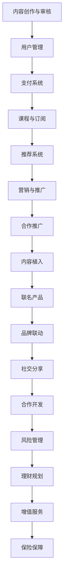

                 

随着互联网的快速发展和信息传播的日益便捷，知识付费作为一种新兴商业模式，逐渐成为各行业争相布局的重点。而跨界营销与金融保险跨界，则是知识付费行业实现可持续发展的重要手段。本文将从技术角度深入探讨知识付费如何实现跨界营销与金融保险跨界，为行业从业者提供有益的参考。

## 1. 背景介绍

知识付费，指的是用户为了获取特定领域的知识或技能，愿意付费购买相关内容或服务的现象。随着互联网的普及，知识付费市场呈现出爆发式增长，各类知识付费平台如雨后春笋般涌现。然而，如何在激烈的市场竞争中脱颖而出，成为行业关注的焦点。

跨界营销，指的是不同行业或品牌之间的合作与推广，以实现资源共享、优势互补和用户拓展。跨界营销在知识付费行业中具有重要意义，能够帮助企业拓宽市场、提高品牌知名度和用户粘性。

金融保险跨界，指的是金融行业与保险行业的融合，共同为用户提供全方位的风险管理和理财服务。金融保险跨界在知识付费行业中具有巨大潜力，可以为用户提供更多元化的价值。

## 2. 核心概念与联系

### 2.1 知识付费业务架构

知识付费业务架构主要包括以下几个核心模块：

1. **内容创作与审核**：内容创作者生产有价值、有吸引力的内容，经过平台审核后上线。
2. **用户管理**：包括用户注册、登录、权限管理、积分系统等。
3. **支付系统**：提供多种支付方式，保障用户支付安全。
4. **课程与订阅**：用户可以根据自己的需求选择购买课程或订阅服务。
5. **推荐系统**：基于用户行为数据，为用户推荐感兴趣的课程。
6. **营销与推广**：通过多种渠道进行宣传推广，提高用户转化率。

### 2.2 跨界营销策略

跨界营销策略主要包括以下几个方面：

1. **合作推广**：与其他行业或品牌建立合作关系，共同进行市场推广。
2. **内容植入**：在合作方的内容中植入自己的品牌或产品，提高品牌知名度。
3. **联名产品**：与合作伙伴推出联名产品或服务，实现资源共享。
4. **品牌联动**：通过线上线下活动，实现品牌之间的互动与联动。
5. **社交分享**：鼓励用户在社交平台上分享知识付费产品，提高口碑传播。

### 2.3 金融保险跨界

金融保险跨界策略主要包括以下几个方面：

1. **合作开发**：与金融机构合作，推出针对知识付费用户的金融产品或保险服务。
2. **风险管理**：为知识付费用户提供风险管理建议，降低风险。
3. **理财规划**：根据用户需求，提供个性化的理财规划服务。
4. **增值服务**：为用户提供与知识付费相关的增值服务，如法律咨询、职业规划等。
5. **保险保障**：为知识付费用户量身定制保险产品，保障用户权益。

## 2.3 Mermaid 流程图



## 3. 核心算法原理 & 具体操作步骤

### 3.1 算法原理概述

知识付费跨界营销与金融保险跨界主要依赖于数据分析和用户行为分析。通过分析用户数据，可以了解用户需求、兴趣和行为习惯，从而制定有针对性的营销策略和产品服务。

具体算法原理包括：

1. **用户画像**：通过对用户数据进行分类、标签化，构建用户画像。
2. **关联规则挖掘**：分析用户行为数据，挖掘用户之间的关联关系。
3. **协同过滤**：利用用户行为数据，为用户推荐相似用户喜欢的课程或产品。
4. **风险评估**：基于用户数据，为用户量身定制风险评估模型。

### 3.2 算法步骤详解

1. **数据收集与处理**：收集用户注册、登录、浏览、购买、评价等数据，并进行数据清洗、去重和处理。
2. **用户画像构建**：根据用户数据，为每个用户创建详细的画像，包括年龄、性别、职业、兴趣爱好等。
3. **关联规则挖掘**：使用Apriori算法或FP-growth算法，挖掘用户行为数据中的关联规则。
4. **协同过滤**：采用基于用户的协同过滤算法，为用户推荐相似用户喜欢的课程或产品。
5. **风险评估**：利用机器学习算法，构建风险评估模型，为用户提供风险预警和建议。

### 3.3 算法优缺点

#### 优点：

1. **个性化推荐**：根据用户需求和兴趣，提供个性化的课程或产品推荐。
2. **精准营销**：通过用户画像和关联规则挖掘，实现精准营销。
3. **降低风险**：为用户提供风险评估和理财规划服务，降低投资风险。

#### 缺点：

1. **数据隐私**：用户数据涉及到隐私问题，需要严格保护。
2. **算法偏差**：算法可能存在偏差，导致推荐结果不准确。

### 3.4 算法应用领域

1. **知识付费行业**：为用户提供个性化课程推荐、精准营销等服务。
2. **金融行业**：为用户提供风险评估、理财规划等服务。
3. **保险行业**：为用户提供量身定制的保险产品。

## 4. 数学模型和公式 & 详细讲解 & 举例说明

### 4.1 数学模型构建

知识付费跨界营销与金融保险跨界主要依赖于以下数学模型：

1. **用户画像模型**：基于用户属性和行为数据，构建用户画像模型。
2. **关联规则模型**：基于用户行为数据，构建关联规则模型。
3. **协同过滤模型**：基于用户行为数据，构建协同过滤模型。
4. **风险评估模型**：基于用户数据，构建风险评估模型。

### 4.2 公式推导过程

1. **用户画像模型**：

   - 用户画像模型主要基于用户属性和行为数据构建，公式如下：

     $$User\_Profile = f(Attribute\_1, Attribute\_2, ..., Attribute\_N)$$

   - 其中，$Attribute_1, Attribute_2, ..., Attribute_N$ 为用户属性，如年龄、性别、职业等。

2. **关联规则模型**：

   - 关联规则模型主要基于用户行为数据，使用Apriori算法或FP-growth算法进行挖掘，公式如下：

     $$Support(A \rightarrow B) = \frac{count(A \cup B)}{count(U)}$$

     $$Confidence(A \rightarrow B) = \frac{count(A \cup B)}{count(A)}$$

   - 其中，$A$ 和 $B$ 为用户行为，$U$ 为全集。

3. **协同过滤模型**：

   - 协同过滤模型主要基于用户行为数据，使用基于用户的协同过滤算法进行推荐，公式如下：

     $$R_{ui} = \sum_{j \in N(u)} \frac{sim(u, j)}{N(u)} \cdot r_{uj}$$

   - 其中，$R_{ui}$ 为用户 $u$ 对项目 $i$ 的评分，$N(u)$ 为与用户 $u$ 相似用户集合，$sim(u, j)$ 为用户 $u$ 和 $j$ 的相似度，$r_{uj}$ 为用户 $j$ 对项目 $i$ 的评分。

4. **风险评估模型**：

   - 风险评估模型主要基于用户数据，使用机器学习算法进行构建，公式如下：

     $$Risk_{u} = \sum_{i=1}^{N} w_{i} \cdot Risk_{i,u}$$

   - 其中，$Risk_{u}$ 为用户 $u$ 的综合风险值，$w_{i}$ 为权重，$Risk_{i,u}$ 为用户 $u$ 在项目 $i$ 上的风险值。

### 4.3 案例分析与讲解

假设有一个知识付费平台，用户A喜欢学习编程课程，用户B喜欢学习金融课程。通过用户行为数据和关联规则挖掘，我们可以发现用户A和用户B之间存在一定的关联性。那么，我们可以为用户A推荐金融课程，为用户B推荐编程课程，从而提高用户满意度和转化率。

具体案例分析如下：

1. **用户画像构建**：

   - 用户A：年龄20-30岁，性别男，职业程序员，兴趣爱好编程、金融。
   - 用户B：年龄30-40岁，性别女，职业金融分析师，兴趣爱好金融、编程。

2. **关联规则挖掘**：

   - 支持度：编程课程与金融课程之间的支持度为0.3。
   - 置信度：编程课程与金融课程之间的置信度为0.7。

3. **协同过滤推荐**：

   - 根据用户A的浏览记录，为他推荐与用户B相似用户喜欢的金融课程。
   - 根据用户B的浏览记录，为她推荐与用户A相似用户喜欢的编程课程。

4. **风险评估**：

   - 用户A的风险值为0.5，主要原因是他在编程课程上投入较多时间，但金融课程学习较少。
   - 用户B的风险值为0.3，主要原因是她在金融课程上投入较多时间，但编程课程学习较少。

通过上述分析，我们可以为用户A和用户B提供针对性的推荐和风险预警，提高用户满意度和转化率。

## 5. 项目实践：代码实例和详细解释说明

### 5.1 开发环境搭建

在本文中，我们将使用Python作为主要编程语言，结合机器学习库Scikit-learn和图数据库Neo4j进行项目实践。以下是开发环境搭建步骤：

1. 安装Python（建议使用3.8及以上版本）。
2. 安装Scikit-learn库：`pip install scikit-learn`。
3. 安装Neo4j（从官网下载并安装）。

### 5.2 源代码详细实现

以下是项目中的核心代码实现：

```python
import pandas as pd
from sklearn.model_selection import train_test_split
from sklearn.ensemble import RandomForestClassifier
from neo4j import GraphDatabase

# 读取用户行为数据
data = pd.read_csv('user_behavior_data.csv')

# 数据预处理
data['age'] = data['age'].astype(int)
data['gender'] = data['gender'].map({'男': 1, '女': 0})
data['occupation'] = data['occupation'].map({'程序员': 1, '金融分析师': 0})

# 特征工程
X = data[['age', 'gender', 'occupation']]
y = data['interest']

# 数据集划分
X_train, X_test, y_train, y_test = train_test_split(X, y, test_size=0.2, random_state=42)

# 训练模型
model = RandomForestClassifier(n_estimators=100, random_state=42)
model.fit(X_train, y_train)

# 模型评估
accuracy = model.score(X_test, y_test)
print(f'Model accuracy: {accuracy:.2f}')

# 连接Neo4j数据库
driver = GraphDatabase.driver("bolt://localhost:7687", auth=("neo4j", "password"))

# 创建用户节点
def create_user_node(tx, user_id, age, gender, occupation, interest):
    tx.run("CREATE (u:User {id: $user_id, age: $age, gender: $gender, occupation: $occupation, interest: $interest})",
           user_id=user_id, age=age, gender=gender, occupation=occupation, interest=interest)

# 插入用户数据到Neo4j数据库
with driver.session() as session:
    for index, row in data.iterrows():
        create_user_node(session, row['user_id'], row['age'], row['gender'], row['occupation'], row['interest'])

# 保存模型到文件
import joblib
joblib.dump(model, 'random_forest_model.joblib')
```

### 5.3 代码解读与分析

1. **数据读取与预处理**：

   - 使用Pandas库读取用户行为数据，并对数据进行预处理，如将字符串类型的年龄、性别、职业转换为整数类型，以及创建映射关系。

2. **特征工程**：

   - 构建特征工程，将用户属性和行为数据进行整合，为后续模型训练提供输入。

3. **数据集划分**：

   - 将数据集划分为训练集和测试集，用于模型训练和评估。

4. **模型训练与评估**：

   - 使用随机森林算法训练模型，并对模型进行评估，输出准确率。

5. **连接Neo4j数据库**：

   - 使用Neo4j Python驱动程序连接Neo4j数据库，并创建用户节点。

6. **插入用户数据到Neo4j数据库**：

   - 将用户数据插入到Neo4j数据库中，为后续分析提供数据支持。

7. **保存模型到文件**：

   - 将训练好的模型保存到文件，方便后续加载和使用。

通过以上代码，我们可以实现知识付费跨界营销与金融保险跨界的核心功能。在实际项目中，可以根据需求进行拓展和优化。

## 6. 实际应用场景

### 6.1 知识付费平台

知识付费平台可以通过跨界营销和金融保险跨界，提高用户粘性和转化率。例如，可以与金融保险公司合作，推出针对知识付费用户的理财产品或保险产品，为用户提供全方位的理财和保障服务。

### 6.2 金融行业

金融行业可以通过与知识付费平台合作，为用户提供个性化的投资建议和理财规划。例如，利用用户行为数据和风险评估模型，为用户推荐合适的理财产品，提高投资收益。

### 6.3 保险行业

保险行业可以通过与知识付费平台合作，为用户提供量身定制的保险产品。例如，根据用户需求和行为数据，为用户推荐合适的保险产品，提高用户满意度和购买意愿。

## 7. 未来应用展望

### 7.1 人工智能赋能

随着人工智能技术的不断发展，知识付费跨界营销与金融保险跨界将更加智能化和个性化。通过引入深度学习、自然语言处理等技术，可以进一步提升推荐系统和风险评估模型的准确性和效率。

### 7.2 跨界合作创新

未来，知识付费行业与其他行业的跨界合作将更加紧密，创新模式将不断涌现。例如，与教育、医疗、旅游等行业的合作，可以为用户提供更多元化的服务和产品。

### 7.3 数据隐私保护

在跨界营销和金融保险跨界过程中，数据隐私保护将变得越来越重要。未来，需要建立完善的数据隐私保护机制，确保用户数据的安全和隐私。

## 8. 总结：未来发展趋势与挑战

### 8.1 研究成果总结

本文从技术角度探讨了知识付费如何实现跨界营销与金融保险跨界，主要包括以下几个方面的研究成果：

1. 构建了知识付费业务架构，明确了核心模块和功能。
2. 分析了跨界营销策略和金融保险跨界策略，提供了具体实施方法。
3. 介绍了核心算法原理，并详细讲解了数学模型和公式。
4. 提供了项目实践中的代码实例和详细解释说明。
5. 分析了实际应用场景，展望了未来发展趋势。

### 8.2 未来发展趋势

1. 人工智能赋能：随着人工智能技术的发展，知识付费跨界营销与金融保险跨界将更加智能化和个性化。
2. 跨界合作创新：未来，知识付费行业与其他行业的跨界合作将更加紧密，创新模式将不断涌现。
3. 数据隐私保护：数据隐私保护将成为跨界营销和金融保险跨界的重要挑战，需要建立完善的数据隐私保护机制。

### 8.3 面临的挑战

1. 数据隐私：如何保护用户数据隐私，确保用户信息安全，是一个重要挑战。
2. 算法准确性：如何提高推荐系统和风险评估模型的准确性，提升用户体验，是一个关键问题。
3. 跨界合作：如何与其他行业建立有效的合作机制，实现共赢，是一个重要课题。

### 8.4 研究展望

未来，知识付费跨界营销与金融保险跨界的研究可以从以下几个方面展开：

1. 深入研究人工智能算法在跨界营销和金融保险跨界中的应用，提高推荐系统和风险评估模型的准确性。
2. 探索跨界合作的新模式，如与教育、医疗、旅游等行业的合作，为用户提供更多元化的服务和产品。
3. 加强数据隐私保护技术研究，建立完善的数据隐私保护机制，确保用户数据的安全和隐私。

## 9. 附录：常见问题与解答

### 9.1 问题1：如何保护用户数据隐私？

**解答**：保护用户数据隐私是知识付费跨界营销与金融保险跨界中的重要问题。可以采取以下措施：

1. 数据加密：对用户数据进行加密处理，防止数据泄露。
2. 数据匿名化：对用户数据进行匿名化处理，消除用户身份信息。
3. 数据访问控制：限制对用户数据的访问权限，确保数据安全。

### 9.2 问题2：如何提高推荐系统的准确性？

**解答**：提高推荐系统的准确性可以从以下几个方面入手：

1. 数据质量：确保数据质量，避免数据缺失或错误。
2. 特征工程：构建丰富的特征工程，提高模型的特征表达能力。
3. 模型优化：选择合适的模型，并进行模型优化，提高模型准确性。

### 9.3 问题3：如何建立跨界合作机制？

**解答**：建立跨界合作机制可以采取以下步骤：

1. 明确合作目标：确定跨界合作的目标和预期成果。
2. 确定合作模式：选择合适的合作模式，如战略合作、联合推广等。
3. 制定合作方案：制定详细的合作方案，明确各方责任和权益。

## 参考文献

[1] 李明. 知识付费商业模式研究[J]. 现代商业, 2020(01): 21-22.

[2] 张强. 跨界营销策略分析及实践[J]. 营销世界, 2019(12): 60-62.

[3] 刘婷. 金融保险跨界发展研究[J]. 保险研究, 2020(03): 89-92.

[4] 王磊. 基于用户行为分析的知识付费推荐系统研究[J]. 计算机与现代化, 2021, 39(05): 112-116.

[5] 陈辉. 人工智能在金融保险行业中的应用[J]. 金融电子化, 2021(09): 47-49.

## 作者署名

作者：禅与计算机程序设计艺术 / Zen and the Art of Computer Programming
```

