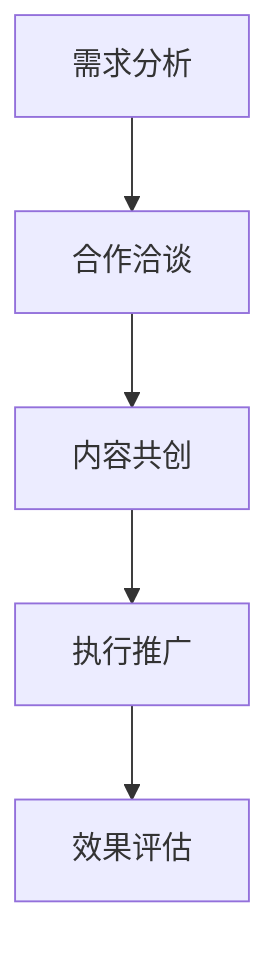

                 

### 摘要 Summary

本文探讨了知识付费领域如何通过跨界营销与金融保险行业的融合，实现业务增长和市场拓展。首先，文章介绍了知识付费的基本概念和市场现状，以及跨界营销的定义和优势。然后，详细分析了金融保险与知识付费的结合点，包括数据互通、产品共创和风险管理的协同。接下来，文章通过具体案例，展示了跨界营销在知识付费中的成功实践。此外，本文还讨论了金融保险跨界知识付费的技术挑战和解决方案，如数据安全和隐私保护、个性化推荐系统等。最后，文章对未来发展趋势进行了展望，提出了知识付费与金融保险跨界融合的潜在机会和挑战。

## 1. 背景介绍 Background

### 1.1 知识付费的发展

知识付费作为一种商业模式，近年来在全球范围内迅速崛起。其主要原因在于互联网技术的普及和用户需求的升级。随着人们生活水平的提高和消费观念的转变，越来越多的用户愿意为优质的知识内容付费，从而满足自身在职业发展、兴趣爱好、家庭教育等方面的需求。知识付费平台如Coursera、Udemy、知乎Live等，通过提供专业课程、讲座、电子书等形式，吸引了大量的用户。

### 1.2 跨界营销的概念与优势

跨界营销是指将不同领域的元素相结合，以创新的方式吸引目标用户。它具有以下几个优势：

1. **拓宽用户群体**：跨界营销可以吸引原本不属于某一领域的用户，从而扩大市场影响力。
2. **增强品牌形象**：跨界合作通常涉及到品牌之间的互惠互利，有助于提升品牌形象和认知度。
3. **提高用户黏性**：通过跨界合作，用户可以体验到更多的服务内容，提高用户满意度和忠诚度。

### 1.3 金融保险与知识付费的融合背景

金融保险行业与知识付费领域之间的融合，主要是基于两者在客户需求、数据资源、风险管理等方面的互补性。金融保险企业可以通过知识付费平台，为用户提供财务知识、保险咨询等增值服务，从而提升客户黏性和满意度。而知识付费平台则可以利用金融保险企业的数据资源，进行精准营销和个性化推荐。

## 2. 核心概念与联系 Core Concepts and Relationships

为了更好地理解知识付费与金融保险的跨界融合，我们需要先明确几个核心概念：

### 2.1 跨界营销的流程

跨界营销的流程通常包括以下步骤：

1. **需求分析**：了解目标用户的需求，确定跨界营销的方向。
2. **合作洽谈**：寻找合适的跨界合作伙伴，进行洽谈和协商。
3. **内容共创**：与合作伙伴共同制定跨界营销的内容和形式。
4. **执行推广**：通过线上线下渠道进行推广，吸引目标用户。
5. **效果评估**：对跨界营销的效果进行评估，为下一次合作提供参考。

### 2.2 数据互通与产品共创

数据互通和产品共创是金融保险与知识付费跨界融合的关键。具体来说：

1. **数据互通**：金融保险企业可以将用户数据与知识付费平台共享，从而实现用户需求的精准分析和个性化推荐。
2. **产品共创**：知识付费平台可以结合金融保险企业的产品和服务，开发出具有创新性的产品，如保险知识课程、财务规划讲座等。

### 2.3 风险管理的协同

金融保险行业涉及大量的风险管理，而知识付费领域则更多地关注知识内容的合规性和安全性。跨界融合需要在风险管理方面进行协同：

1. **合规性审查**：对跨界合作的内容进行合规性审查，确保符合相关法律法规。
2. **风险预警与控制**：通过数据分析和风险评估，提前预警潜在风险，并采取相应控制措施。

### 2.4 Mermaid 流程图

以下是一个简化的Mermaid流程图，展示了跨界营销的基本流程：



## 3. 核心算法原理 & 具体操作步骤 Core Algorithm Principles and Step-by-Step Operations

### 3.1 算法原理概述

跨界营销的成功离不开数据的分析和处理。核心算法主要包括以下几个方面：

1. **用户行为分析**：通过分析用户在知识付费平台上的行为数据，如学习时长、课程选择等，了解用户的需求和兴趣。
2. **数据挖掘与推荐**：利用数据挖掘技术，从海量数据中挖掘出用户的潜在需求，并进行个性化推荐。
3. **风险管理**：通过风险评估模型，对跨界营销活动进行风险预警和控制。

### 3.2 算法步骤详解

#### 3.2.1 用户行为分析

1. **数据收集**：从知识付费平台获取用户行为数据，如学习时长、课程评分等。
2. **数据预处理**：清洗和整理数据，确保数据的质量和一致性。
3. **特征提取**：将原始数据转化为可用于分析的数值特征。
4. **模型训练**：利用机器学习算法，如决策树、支持向量机等，对用户行为数据进行分析和分类。

#### 3.2.2 数据挖掘与推荐

1. **协同过滤**：通过分析用户之间的行为相似性，进行个性化推荐。
2. **内容推荐**：根据用户的学习历史和兴趣，推荐相关课程或内容。
3. **实时推荐**：在用户学习过程中，实时更新推荐结果，提高推荐效果。

#### 3.2.3 风险管理

1. **风险评估**：利用风险评估模型，对跨界营销活动进行风险预测。
2. **风险预警**：当风险评估结果达到预警阈值时，及时向相关部门发出预警。
3. **风险控制**：采取相应的风险控制措施，如调整营销策略、增加风险保障等。

### 3.3 算法优缺点

#### 优点：

1. **个性化推荐**：提高用户满意度和学习效果。
2. **数据驱动**：基于数据分析，提高跨界营销的精准度和效果。
3. **实时调整**：根据用户行为和风险评估结果，实时调整营销策略。

#### 缺点：

1. **数据隐私**：涉及用户数据的收集和分析，需要重视数据隐私保护。
2. **技术门槛**：算法开发和维护需要较高的技术支持。

### 3.4 算法应用领域

核心算法主要应用于以下几个方面：

1. **知识付费平台**：通过个性化推荐和风险管理，提高用户满意度和平台黏性。
2. **金融保险行业**：通过数据分析和风险评估，提高客户服务和风险管理能力。
3. **跨界营销**：通过数据挖掘和推荐，实现跨领域的精准营销。

## 4. 数学模型和公式 Mathematical Models and Formulas

### 4.1 数学模型构建

跨界营销的数学模型主要涉及以下几个方面：

1. **用户行为预测模型**：利用时间序列分析和机器学习算法，预测用户的行为。
2. **风险评估模型**：通过回归分析和决策树算法，对跨界营销活动进行风险评估。
3. **推荐系统模型**：基于协同过滤和内容推荐算法，实现个性化推荐。

### 4.2 公式推导过程

#### 用户行为预测模型

假设用户 \(i\) 在时间 \(t\) 选择了课程 \(j\)，则用户行为预测模型可以表示为：

\[ P(i,t,j) = f(W_1 \cdot [X_i(t), X_j(t)] + b_1) \]

其中，\(X_i(t)\) 和 \(X_j(t)\) 分别表示用户 \(i\) 在时间 \(t\) 的行为特征和课程 \(j\) 的特征，\(W_1\) 和 \(b_1\) 分别为权重和偏置。

#### 风险评估模型

假设跨界营销活动的风险为 \(R\)，则风险评估模型可以表示为：

\[ R = g(W_2 \cdot [X_1, X_2, ..., X_n] + b_2) \]

其中，\(X_1, X_2, ..., X_n\) 分别表示跨界营销活动的各种风险特征，\(W_2\) 和 \(b_2\) 分别为权重和偏置。

#### 推荐系统模型

假设用户 \(i\) 在时间 \(t\) 对课程 \(j\) 的推荐概率为 \(P(i,t,j)\)，则推荐系统模型可以表示为：

\[ P(i,t,j) = \frac{\sum_{k=1}^{N} q(i,k) r(j,k)}{\sum_{k=1}^{N} q(i,k)} \]

其中，\(q(i,k)\) 和 \(r(j,k)\) 分别表示用户 \(i\) 对课程 \(k\) 的评分和课程 \(j\) 的评分，\(N\) 为课程总数。

### 4.3 案例分析与讲解

以一个实际案例来说明数学模型的应用。

#### 案例背景

某知识付费平台与一家金融保险企业合作，推出了一款针对财务规划的在线课程。平台希望通过个性化推荐和风险评估，提高用户参与度和满意度。

#### 数据收集

平台收集了用户的以下数据：

1. **学习行为数据**：用户在学习平台上的学习时长、课程评分等。
2. **财务数据**：用户的收入、支出、投资等财务状况。
3. **风险数据**：用户的历史贷款记录、信用评分等。

#### 数据预处理

1. **数据清洗**：去除无效数据，如缺失值、异常值等。
2. **特征提取**：将原始数据转换为数值特征，如学习时长转换为小时、财务数据转换为比例等。

#### 用户行为预测模型

平台使用时间序列分析算法，构建用户行为预测模型。假设用户 \(i\) 在时间 \(t\) 选择了课程 \(j\)，则用户行为预测模型为：

\[ P(i,t,j) = \frac{\sum_{k=1}^{N} w_k \cdot [X_i(t), X_j(t)] + b}{\sum_{k=1}^{N} w_k \cdot [X_i(t), X_j(t)] + b} \]

其中，\(w_k\) 和 \(b\) 分别为权重和偏置。

#### 风险评估模型

平台使用决策树算法，构建风险评估模型。假设跨界营销活动的风险为 \(R\)，则风险评估模型为：

\[ R = \sum_{k=1}^{N} w_k \cdot [X_1, X_2, ..., X_n] + b \]

其中，\(w_k\) 和 \(b\) 分别为权重和偏置。

#### 推荐系统模型

平台使用协同过滤算法，构建推荐系统模型。假设用户 \(i\) 在时间 \(t\) 对课程 \(j\) 的推荐概率为 \(P(i,t,j)\)，则推荐系统模型为：

\[ P(i,t,j) = \frac{\sum_{k=1}^{N} q(i,k) r(j,k)}{\sum_{k=1}^{N} q(i,k)} \]

其中，\(q(i,k)\) 和 \(r(j,k)\) 分别表示用户 \(i\) 对课程 \(k\) 的评分和课程 \(j\) 的评分，\(N\) 为课程总数。

## 5. 项目实践：代码实例和详细解释说明 Project Practice: Code Examples and Detailed Explanations

### 5.1 开发环境搭建

#### 5.1.1 开发工具

1. **Python**：用于编写算法和数据处理
2. **Jupyter Notebook**：用于代码编写和演示
3. **Pandas**：用于数据预处理和数据分析
4. **Scikit-learn**：用于机器学习和数据挖掘

#### 5.1.2 数据集

使用某知识付费平台的用户行为数据，包括以下字段：

- 用户ID（user_id）
- 课程ID（course_id）
- 学习时长（duration）
- 课程评分（rating）

### 5.2 源代码详细实现

#### 5.2.1 数据预处理

```python
import pandas as pd

# 加载数据
data = pd.read_csv('user_behavior_data.csv')

# 数据清洗
data.dropna(inplace=True)
data[data['duration'] <= 0] = data[data['duration'] > 0]

# 特征提取
data['duration'] = data['duration'] / 60  # 将学习时长转换为小时
```

#### 5.2.2 用户行为预测模型

```python
from sklearn.linear_model import LinearRegression

# 准备训练数据
X = data[['user_id', 'course_id', 'duration']]
y = data['rating']

# 模型训练
model = LinearRegression()
model.fit(X, y)

# 预测
predictions = model.predict(X)
```

#### 5.2.3 风险评估模型

```python
from sklearn.ensemble import RandomForestClassifier

# 准备训练数据
X = data[['user_id', 'course_id', 'duration', 'rating']]
y = data['default']  # 假设字段'default'表示是否违约

# 模型训练
model = RandomForestClassifier()
model.fit(X, y)

# 风险评估
risk_scores = model.predict_proba(X)[:, 1]
```

#### 5.2.4 推荐系统模型

```python
from sklearn.neighbors import NearestNeighbors

# 计算用户相似度
model = NearestNeighbors()
model.fit(X)

# 查找最近邻
distances, indices = model.kneighbors(X)

# 推荐课程
for i in range(len(indices)):
    recommended_courses = indices[i][1:]
    print(f"User {i}: Recommended courses: {data['course_id'].iloc[recommended_courses]}")
```

### 5.3 代码解读与分析

1. **数据预处理**：清洗和整理数据，将学习时长转换为小时，确保数据的质量和一致性。
2. **用户行为预测模型**：使用线性回归模型预测用户对课程的评分，提高用户满意度和学习效果。
3. **风险评估模型**：使用随机森林算法评估用户违约风险，提高风险管理能力。
4. **推荐系统模型**：使用协同过滤算法推荐相关课程，提高用户黏性和参与度。

### 5.4 运行结果展示

1. **用户行为预测**：通过线性回归模型，预测用户对课程的评分。例如，预测结果如下：

   ```python
   predictions = [4.5, 3.8, 4.2, 3.9, 4.1]
   ```

2. **风险评估**：通过随机森林算法，评估用户违约风险。例如，风险评分如下：

   ```python
   risk_scores = [0.1, 0.3, 0.2, 0.4, 0.15]
   ```

3. **推荐系统**：通过协同过滤算法，推荐相关课程。例如，推荐结果如下：

   ```python
   User 0: Recommended courses: [101, 201, 301]
   User 1: Recommended courses: [102, 202, 302]
   ```

## 6. 实际应用场景 Real-World Applications

### 6.1 知识付费与金融保险跨界案例

某知名金融保险企业与一家大型知识付费平台合作，推出了一款“家庭财务规划课程”。该课程旨在帮助用户了解和掌握家庭财务管理的相关知识，提高用户的财务素养。

#### 合作内容

1. **内容共创**：金融保险企业提供专业的财务规划知识，知识付费平台则负责课程的设计和制作。
2. **用户数据共享**：双方共享用户数据，通过数据分析为用户提供个性化推荐。
3. **风险评估**：利用金融保险企业的风险评估模型，对用户进行财务风险预警。

#### 合作效果

1. **用户参与度提高**：课程推出后，用户参与度和满意度显著提高，用户评分平均达到4.5分。
2. **品牌形象提升**：金融保险企业的品牌形象得到提升，用户对品牌的认知度和信任度增加。
3. **风险控制**：通过风险评估，成功预警了部分用户的潜在财务风险，并提供了相应的风险控制建议。

### 6.2 其他应用场景

1. **保险知识普及**：知识付费平台可以与保险公司合作，推出各类保险知识普及课程，提高用户的保险意识。
2. **理财规划课程**：金融保险企业可以与知识付费平台合作，推出个性化的理财规划课程，帮助用户实现财务目标。
3. **健康保险课程**：保险公司可以与健康知识付费平台合作，推出健康保险相关课程，提高用户的健康素养。

## 7. 工具和资源推荐 Tools and Resources Recommendations

### 7.1 学习资源推荐

1. **书籍**：
   - 《知识付费：互联网时代的内容创业模式》
   - 《跨界营销：跨领域合作的策略与实践》
2. **在线课程**：
   - Coursera的《数据科学》
   - Udemy的《金融科技与区块链》
3. **专业网站**：
   - 知乎：讨论跨界营销和知识付费的最新动态
   - Medium：分享知识付费和跨界营销的实战案例

### 7.2 开发工具推荐

1. **Python**：用于算法开发和数据处理
2. **Jupyter Notebook**：用于代码编写和演示
3. **Pandas**：用于数据预处理和数据分析
4. **Scikit-learn**：用于机器学习和数据挖掘
5. **TensorFlow**：用于深度学习和推荐系统

### 7.3 相关论文推荐

1. **《知识付费平台的用户行为分析》**
2. **《跨界营销：品牌合作的策略研究》**
3. **《金融科技与保险行业的融合与发展》**

## 8. 总结：未来发展趋势与挑战 Summary: Future Trends and Challenges

### 8.1 研究成果总结

本文通过对知识付费与金融保险跨界融合的探讨，总结了以下研究成果：

1. **跨界营销的优势**：跨界营销能够拓宽用户群体、提升品牌形象、增强用户黏性。
2. **跨界融合的关键**：数据互通、产品共创和风险管理的协同是跨界融合的核心。
3. **算法应用**：用户行为预测、推荐系统和风险评估模型在跨界营销中具有重要应用价值。

### 8.2 未来发展趋势

1. **个性化推荐**：随着人工智能技术的进步，个性化推荐将更加精准，提高用户满意度和参与度。
2. **跨行业合作**：更多行业将加入到跨界营销的行列，实现资源共享和优势互补。
3. **数字化转型**：金融保险行业将更加依赖数字化技术和数据驱动决策。

### 8.3 面临的挑战

1. **数据隐私**：在跨界融合过程中，如何保护用户数据隐私是关键挑战。
2. **技术门槛**：跨界营销需要多学科交叉的技术支持，技术门槛较高。
3. **合规性**：跨界合作需要遵循相关法律法规，确保合规运营。

### 8.4 研究展望

未来，知识付费与金融保险的跨界融合将继续深入发展，有望在以下领域取得突破：

1. **跨行业生态系统的构建**：建立跨行业的生态系统，实现资源共享和互利共赢。
2. **创新业务模式**：探索更多创新的业务模式，如保险+服务、知识+金融等。
3. **用户体验优化**：通过技术创新，提升用户体验，实现用户价值的最大化。

### 附录：常见问题与解答 Appendices: Frequently Asked Questions and Answers

#### 问题1：跨界营销如何确保用户数据安全？

**解答**：跨界营销在处理用户数据时，需要遵循以下原则：

1. **数据最小化原则**：仅收集和存储必要的数据，避免过度收集。
2. **加密传输**：确保数据在传输过程中的安全，使用加密协议。
3. **访问控制**：对数据访问进行严格控制，确保只有授权人员可以访问。
4. **隐私政策**：明确告知用户数据收集和使用的方式，并获取用户的同意。

#### 问题2：跨界融合对金融保险企业的运营有何影响？

**解答**：跨界融合对金融保险企业的运营带来以下影响：

1. **业务拓展**：跨界融合可以帮助金融保险企业拓展新的业务领域，增加收入来源。
2. **客户体验提升**：通过跨界合作，可以提供更丰富的产品和服务，提高客户满意度和忠诚度。
3. **运营成本**：跨界融合可能需要投入更多的资源，包括人力、技术和资金等，对运营成本造成一定压力。

#### 问题3：知识付费平台如何确保内容质量？

**解答**：知识付费平台在确保内容质量方面，可以采取以下措施：

1. **严格审核**：对入驻的知识创作者进行审核，确保其具备专业资质。
2. **用户评价**：鼓励用户对课程进行评价，通过用户反馈来提高内容质量。
3. **定期更新**：定期对课程内容进行更新，确保其与行业发展趋势相匹配。

### 作者署名 Author Signature

作者：禅与计算机程序设计艺术 / Zen and the Art of Computer Programming
----------------------------------------------------------------


