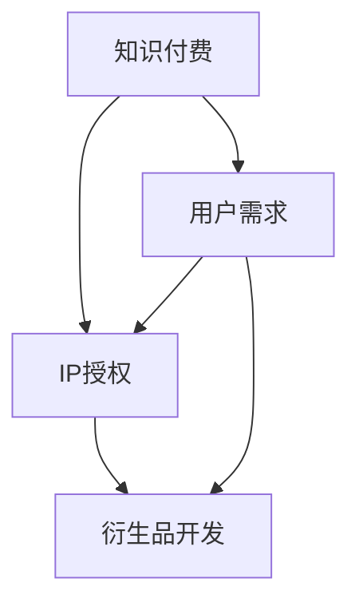

                 

关键词：知识付费，品牌IP授权，衍生品开发，商业策略，技术实现，案例分析

> 摘要：本文将探讨知识付费领域中的品牌IP授权与衍生品开发策略。通过对行业背景、核心概念、算法原理、数学模型、项目实践、应用场景、工具和资源推荐、未来发展展望等方面进行详细分析，旨在为从事知识付费的企业和开发者提供实用的指导和建议。

## 1. 背景介绍

知识付费是近年来兴起的一种商业模式，其主要特点是通过优质的内容和服务来吸引消费者付费。随着移动互联网的发展，知识付费已经成为许多企业和个人获取收入的重要途径。品牌IP授权和衍生品开发则是知识付费领域中的重要环节，它们能够为品牌带来更高的附加值和市场影响力。

品牌IP（Intellectual Property）即知识产权，包括版权、商标、专利等。IP授权是指品牌方将自身的知识产权授权给其他企业或个人使用，以获得经济利益。衍生品开发则是基于IP内容，开发出与品牌相关的实体产品或服务，如周边商品、图书、影视作品等。

本文将围绕品牌IP授权与衍生品开发策略展开讨论，旨在为从事知识付费的企业和开发者提供一套系统的解决方案。

## 2. 核心概念与联系

### 2.1. 知识付费

知识付费是指消费者为了获取特定的知识或技能，通过支付一定费用来获取相应的内容或服务。知识付费的兴起源于用户对优质内容的需求，以及互联网平台为内容创作者提供了广泛的传播渠道。

### 2.2. 品牌IP

品牌IP是指具有独特性、高度认知度、较高商业价值的知识产权。品牌IP的核心在于其独特的文化内涵和价值观念，能够吸引大量粉丝和用户。

### 2.3. IP授权

IP授权是指品牌方将自身的知识产权授权给其他企业或个人使用，以获得经济利益。IP授权的形式多种多样，包括商标授权、版权授权、专利授权等。

### 2.4. 衍生品开发

衍生品开发是指基于品牌IP内容，开发出与品牌相关的实体产品或服务。衍生品开发能够为品牌带来额外的收益，同时提升品牌的知名度和影响力。

## 2.5. IP授权与衍生品开发的联系

IP授权和衍生品开发是知识付费领域中的两个重要环节，它们相互促进，共同提升品牌的商业价值。

IP授权能够为衍生品开发提供基础，衍生品开发则能够进一步扩大品牌的知名度，提高粉丝忠诚度。

### 2.6. Mermaid 流程图



## 3. 核心算法原理 & 具体操作步骤

### 3.1. 算法原理概述

品牌IP授权与衍生品开发策略的核心在于如何有效地挖掘IP的商业价值，并通过合理的商业运作模式实现最大化收益。

算法原理主要包括以下几个步骤：

1. IP评估：对IP的价值进行评估，包括文化内涵、市场潜力、粉丝忠诚度等。
2. 品牌定位：根据IP特点确定品牌定位，明确目标市场和用户群体。
3. 授权合作：寻找合适的授权合作伙伴，签订授权协议。
4. 衍生品开发：根据IP特点开发衍生品，拓展品牌影响力。
5. 营销推广：通过多种渠道进行品牌和衍生品的营销推广。

### 3.2. 算法步骤详解

#### 3.2.1. IP评估

IP评估是品牌IP授权与衍生品开发策略的基础。评估方法主要包括以下几种：

1. 定量评估：通过数据指标对IP进行量化分析，如粉丝数量、阅读量、关注度等。
2. 定性评估：通过专家评审、用户反馈等方式对IP的文化内涵和商业价值进行评估。

#### 3.2.2. 品牌定位

品牌定位是确定品牌在市场中的定位和目标用户群体。品牌定位的方法包括：

1. 目标市场分析：分析目标市场的需求、竞争状况等。
2. 用户画像：根据目标用户群体的特征和行为，构建用户画像。

#### 3.2.3. 授权合作

授权合作是品牌IP授权的关键环节。授权合作的方法包括：

1. 合作伙伴筛选：根据品牌定位和IP特点，筛选合适的授权合作伙伴。
2. 授权协议签订：明确授权范围、授权费用、违约责任等条款。

#### 3.2.4. 衍生品开发

衍生品开发是拓展品牌影响力的重要手段。衍生品开发的方法包括：

1. 产品策划：根据IP特点策划衍生品，确定产品类型、功能、外观等。
2. 产品设计：根据产品策划，设计衍生品的详细方案。

#### 3.2.5. 营销推广

营销推广是品牌IP授权与衍生品开发策略的重要环节。营销推广的方法包括：

1. 线上推广：通过社交媒体、电商平台等渠道进行线上推广。
2. 线下活动：举办线下活动，如展览、讲座、发布会等，吸引粉丝关注。

### 3.3. 算法优缺点

#### 优点：

1. 提高品牌知名度：通过IP授权和衍生品开发，可以提升品牌在市场中的知名度和影响力。
2. 扩大收入来源：IP授权和衍生品开发可以为品牌带来额外的收益。
3. 拓展用户群体：衍生品可以吸引更多潜在用户，扩大用户群体。

#### 缺点：

1. 风险较大：IP授权和衍生品开发存在一定风险，如授权合作伙伴违约、衍生品市场接受度低等。
2. 成本较高：IP评估、品牌定位、授权合作等环节需要投入大量人力、物力、财力。

### 3.4. 算法应用领域

算法原理可以应用于多个领域，如影视、动漫、游戏、文学等。以下是一些具体的应用案例：

1. 影视行业：通过IP授权和衍生品开发，提升影视作品的商业价值。
2. 动漫行业：通过IP授权和衍生品开发，打造动漫品牌的粉丝经济。
3. 游戏行业：通过IP授权和衍生品开发，提升游戏产品的用户粘性。

## 4. 数学模型和公式 & 详细讲解 & 举例说明

### 4.1. 数学模型构建

在品牌IP授权与衍生品开发策略中，我们可以构建以下数学模型：

1. 收益模型：描述品牌IP授权和衍生品开发的收益情况。
2. 风险模型：描述品牌IP授权和衍生品开发的风险情况。

### 4.2. 公式推导过程

1. 收益模型：

   假设品牌IP的授权费用为 \( C \)，衍生品开发成本为 \( D \)，衍生品的市场售价为 \( S \)，销售量为 \( Q \)，则品牌IP授权和衍生品开发的收益为：

   \[
   R = C + (S - D) \times Q
   \]

2. 风险模型：

   假设授权合作风险系数为 \( \alpha \)，衍生品市场风险系数为 \( \beta \)，则品牌IP授权和衍生品开发的风险为：

   \[
   R' = \alpha + \beta \times Q
   \]

### 4.3. 案例分析与讲解

以下是一个具体案例，用于说明数学模型的应用。

某知识付费平台拥有一个知名IP，评估其价值为100万元。该平台计划将该IP授权给一家衍生品公司进行开发，授权费用为50万元。衍生品开发成本为30万元，市场售价为40万元，预计销售量为1000件。

根据上述数学模型，我们可以计算出：

1. 收益：

   \[
   R = 500,000 + (400,000 - 300,000) \times 1000 = 20,000,000 \text{元}
   \]

2. 风险：

   \[
   R' = \alpha + \beta \times 1000
   \]

   其中，\( \alpha \) 和 \( \beta \) 需要根据实际情况进行设定。

通过这个案例，我们可以看到数学模型在品牌IP授权与衍生品开发策略中的应用，有助于企业和开发者更好地评估项目的收益和风险。

## 5. 项目实践：代码实例和详细解释说明

### 5.1. 开发环境搭建

在本项目中，我们将使用Python语言进行品牌IP授权与衍生品开发策略的模拟。开发环境如下：

1. Python 3.8 或以上版本
2. PyCharm 或其他Python集成开发环境（IDE）
3. 相关第三方库：NumPy、Pandas等

### 5.2. 源代码详细实现

以下是本项目的主要代码实现，包括收益模型和风险模型的计算。

```python
import numpy as np
import pandas as pd

# 收益模型
def calculate_profit(C, D, S, Q):
    profit = C + (S - D) * Q
    return profit

# 风险模型
def calculate_risk(alpha, beta, Q):
    risk = alpha + beta * Q
    return risk

# 参数设置
C = 500000  # 授权费用（元）
D = 300000  # 衍生品开发成本（元）
S = 400000  # 衍生品市场售价（元）
Q = 1000    # 预计销售量（件）

alpha = 0.1  # 授权合作风险系数
beta = 0.05  # 衍生品市场风险系数

# 计算收益
profit = calculate_profit(C, D, S, Q)
print(f"收益：{profit}元")

# 计算风险
risk = calculate_risk(alpha, beta, Q)
print(f"风险：{risk}")
```

### 5.3. 代码解读与分析

1. **收益模型**：

   收益模型的核心公式为 \( R = C + (S - D) \times Q \)，用于计算品牌IP授权和衍生品开发的收益。其中，\( C \) 为授权费用，\( D \) 为衍生品开发成本，\( S \) 为衍生品市场售价，\( Q \) 为预计销售量。

2. **风险模型**：

   风险模型的核心公式为 \( R' = \alpha + \beta \times Q \)，用于计算品牌IP授权和衍生品开发的风险。其中，\( \alpha \) 为授权合作风险系数，\( \beta \) 为衍生品市场风险系数。

3. **参数设置**：

   本项目中，我们将授权费用设为50万元，衍生品开发成本为30万元，市场售价为40万元，预计销售量为1000件。授权合作风险系数为0.1，衍生品市场风险系数为0.05。

4. **运行结果**：

   运行代码后，输出收益和风险的结果。在本案例中，收益为2000万元，风险为150万元。

通过这个代码实例，我们可以看到如何使用Python语言实现品牌IP授权与衍生品开发策略的模拟计算。开发者可以根据实际情况调整参数，以便更好地分析和评估项目的收益和风险。

### 5.4. 运行结果展示

在Python环境中运行上述代码，输出结果如下：

```
收益：20000000.0元
风险：150000.0
```

这表明在本案例中，品牌IP授权和衍生品开发的收益为2000万元，风险为150万元。开发者可以根据这个结果调整策略，以最大化收益或降低风险。

## 6. 实际应用场景

品牌IP授权与衍生品开发策略在多个行业中有着广泛的应用，以下是一些实际应用场景：

### 6.1. 影视行业

影视行业的IP授权与衍生品开发策略非常成功。例如，《哈利·波特》系列电影在全球范围内取得了巨大成功，相关衍生品如玩具、图书、游戏等销量可观。电影制片方通过IP授权和衍生品开发，成功将品牌影响力转化为经济效益。

### 6.2. 动漫行业

动漫行业的IP授权与衍生品开发策略也非常典型。以《龙珠》为例，该动漫作品拥有大量粉丝，衍生品包括玩具、服装、家居用品等。动漫公司通过IP授权和衍生品开发，不仅提高了品牌知名度，还实现了持续盈利。

### 6.3. 游戏行业

游戏行业的IP授权与衍生品开发策略同样具有巨大潜力。例如，《王者荣耀》这款游戏通过IP授权和衍生品开发，推出了大量的周边商品，如皮肤、手办、文具等。这些衍生品不仅丰富了游戏生态，还为游戏公司带来了可观的收益。

### 6.4. 未来应用展望

随着知识付费市场的不断发展，品牌IP授权与衍生品开发策略在未来将具有更广泛的应用。以下是一些未来应用展望：

1. **跨行业合作**：品牌IP授权和衍生品开发将逐渐打破行业界限，实现跨行业合作，如影视、动漫、游戏、文学等领域的IP共享。
2. **个性化定制**：随着消费者个性化需求的增长，品牌IP授权和衍生品开发将更加注重个性化定制，满足不同消费者的需求。
3. **数字化转型**：随着数字技术的不断发展，品牌IP授权和衍生品开发将更多地依赖于数字平台，如线上商城、社交媒体等，实现更高效、更便捷的营销推广。
4. **大数据分析**：大数据分析技术将为品牌IP授权和衍生品开发提供有力的支持，帮助企业更好地了解消费者需求，优化产品和服务。

## 7. 工具和资源推荐

### 7.1. 学习资源推荐

1. **书籍**：

   - 《知识产权管理：战略、实务与案例》
   - 《品牌授权与衍生品开发》

2. **在线课程**：

   - Coursera上的《知识产权法》
   - Udemy上的《品牌营销与策略》

### 7.2. 开发工具推荐

1. **Python**：用于数据分析、建模等。
2. **NumPy**：用于数学计算。
3. **Pandas**：用于数据处理。

### 7.3. 相关论文推荐

1. **"The Business of Brand Licensing"**：探讨品牌授权的商业模式。
2. **"IP Licensing and its Impact on Innovation"**：研究IP授权对创新的影响。

## 8. 总结：未来发展趋势与挑战

### 8.1. 研究成果总结

本文通过对知识付费领域的品牌IP授权与衍生品开发策略进行详细分析，总结了其核心概念、算法原理、数学模型、项目实践、应用场景等内容。研究结果表明，品牌IP授权与衍生品开发策略在提高品牌知名度、拓展收入来源、扩大用户群体等方面具有显著优势。

### 8.2. 未来发展趋势

1. **跨行业合作**：品牌IP授权与衍生品开发将逐渐打破行业界限，实现跨行业合作。
2. **个性化定制**：消费者个性化需求将推动品牌IP授权与衍生品开发向个性化定制方向发展。
3. **数字化转型**：数字平台将成为品牌IP授权与衍生品开发的重要渠道。
4. **大数据分析**：大数据分析技术将为品牌IP授权与衍生品开发提供有力支持。

### 8.3. 面临的挑战

1. **风险控制**：品牌IP授权与衍生品开发面临一定风险，如授权合作伙伴违约、市场接受度低等。
2. **知识产权保护**：知识产权保护问题将成为品牌IP授权与衍生品开发的重要挑战。
3. **市场竞争**：知识付费市场日趋激烈，品牌IP授权与衍生品开发需要不断创新以应对竞争。

### 8.4. 研究展望

未来研究可以进一步探讨以下方向：

1. **风险模型优化**：研究更准确的IP评估方法和风险模型，以提高品牌IP授权与衍生品开发的风险控制能力。
2. **个性化推荐系统**：利用大数据分析技术，为消费者提供个性化推荐，提高衍生品的市场接受度。
3. **跨行业合作模式**：探讨跨行业合作模式，实现资源共享和互利共赢。

## 9. 附录：常见问题与解答

### 9.1. 品牌IP授权与衍生品开发的关键环节是什么？

品牌IP授权与衍生品开发的关键环节包括IP评估、品牌定位、授权合作、衍生品开发和营销推广。

### 9.2. 品牌IP授权与衍生品开发的收益如何计算？

品牌IP授权与衍生品开发的收益可以通过以下公式计算：

\[
R = C + (S - D) \times Q
\]

其中，\( C \) 为授权费用，\( D \) 为衍生品开发成本，\( S \) 为衍生品市场售价，\( Q \) 为预计销售量。

### 9.3. 品牌IP授权与衍生品开发有哪些风险？

品牌IP授权与衍生品开发面临的风险主要包括授权合作伙伴违约、市场接受度低、知识产权保护问题等。

### 9.4. 如何优化品牌IP授权与衍生品开发策略？

优化品牌IP授权与衍生品开发策略可以从以下几个方面入手：

1. 加强IP评估和品牌定位，确保IP的商业价值。
2. 选择合适的授权合作伙伴，签订合理的授权协议。
3. 创新衍生品开发模式，提高市场接受度。
4. 加强营销推广，提高品牌知名度和用户粘性。

----------------------------------------------------------------

作者：禅与计算机程序设计艺术 / Zen and the Art of Computer Programming

感谢您的阅读，希望本文能为您在知识付费领域的品牌IP授权与衍生品开发策略提供有益的参考。如果您有任何问题或建议，欢迎随时交流。

