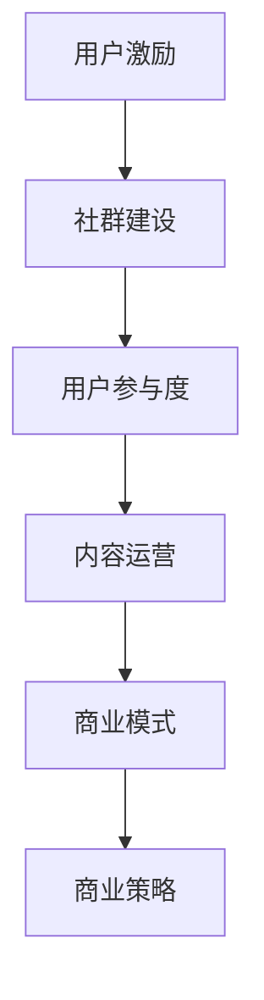

                 

关键词：知识付费、用户激励、社群建设、用户粘性、商业模式、社群管理、用户增长、用户参与度、内容运营、商业策略

摘要：本文将探讨知识付费领域的用户激励与社群建设的重要性，分析其核心概念、原理和实施策略。通过深入剖析用户行为和心理，结合实际案例，我们将提出有效的用户激励方法和社群构建实践，为知识付费平台提供有价值的参考。

## 1. 背景介绍

随着互联网的快速发展，知识付费已经成为一个庞大的市场。人们越来越愿意为优质的内容和服务付费，从线上课程、电子书到专业知识咨询，各种形式的知识付费产品层出不穷。然而，如何在激烈的市场竞争中脱颖而出，吸引并留住用户，成为知识付费平台面临的重要课题。

用户激励与社群建设在这一背景下显得尤为重要。用户激励是指通过提供奖励、福利等手段激发用户参与和消费的积极性；社群建设则是通过营造良好的用户氛围，增强用户之间的互动和粘性。这两者相辅相成，共同推动知识付费平台的用户增长和盈利能力。

本文将从以下几个方面展开讨论：

1. 核心概念与联系
2. 核心算法原理与具体操作步骤
3. 数学模型与公式
4. 项目实践与代码实例
5. 实际应用场景
6. 工具和资源推荐
7. 未来发展趋势与挑战

希望通过本文的探讨，能够为知识付费平台提供一些有益的思路和实操经验。

## 2. 核心概念与联系

### 2.1 用户激励

用户激励是指通过提供奖励、福利等手段激发用户参与和消费的积极性。在知识付费领域，用户激励的具体形式多种多样，如积分奖励、优惠券、特权服务、会员制度等。

### 2.2 社群建设

社群建设是指通过构建一个具有共同兴趣、价值观或目标的用户群体，增强用户之间的互动和粘性。在知识付费领域，社群可以以线上论坛、微信群、QQ群、社区等形式存在。

### 2.3 用户参与度

用户参与度是指用户在知识付费平台上的活跃程度，包括浏览、评论、分享、参与讨论等。高参与度意味着用户对平台内容的认可和喜爱，有助于提高用户粘性和忠诚度。

### 2.4 商业模式

商业模式是指知识付费平台通过什么方式盈利。常见的商业模式包括订阅制、一次性购买、广告支持等。不同的商业模式会影响用户激励和社群建设的策略。

### 2.5 内容运营

内容运营是指通过策划、制作、推广和优化内容，吸引用户并提高用户粘性。在知识付费领域，内容运营是核心，直接影响用户激励和社群建设的有效性。

### 2.6 商业策略

商业策略是指知识付费平台在市场中的定位、目标、资源和能力。合理的商业策略有助于明确用户激励和社群建设的目标和方向，提高整体运营效率。

### 2.7 联系与区别

用户激励和社群建设是知识付费领域的重要概念，它们之间既有联系又有区别。用户激励关注如何激发用户参与和消费的积极性，而社群建设则关注如何营造良好的用户氛围，增强用户之间的互动和粘性。两者相辅相成，共同推动知识付费平台的发展。

### 2.8 Mermaid 流程图

下面是一个简单的 Mermaid 流程图，展示了用户激励与社群建设之间的联系：



通过这个流程图，我们可以清晰地看到用户激励和社群建设在整个知识付费体系中的位置和作用。

## 3. 核心算法原理 & 具体操作步骤

### 3.1 算法原理概述

用户激励与社群建设的过程可以视为一个动态优化的过程，其核心算法原理主要包括以下几个方面：

1. **用户行为分析**：通过数据挖掘和机器学习技术，分析用户的行为特征，识别潜在的高价值用户和活跃用户。
2. **个性化推荐**：根据用户行为和偏好，为用户推荐合适的内容和激励措施，提高用户的满意度和参与度。
3. **社群管理**：通过社区管理算法，维护良好的用户氛围，抑制不良行为，增强用户之间的互动和粘性。
4. **动态调整**：根据用户反馈和运营效果，实时调整激励措施和社群策略，以适应不断变化的市场环境。

### 3.2 算法步骤详解

#### 3.2.1 用户行为分析

1. **数据收集**：收集用户的浏览记录、购买历史、评论内容等数据。
2. **特征提取**：对数据进行分析，提取出反映用户兴趣、需求和行为特征的关键指标。
3. **行为预测**：使用机器学习算法，对用户未来的行为进行预测，识别潜在的高价值用户。

#### 3.2.2 个性化推荐

1. **内容分类**：将平台上的内容进行分类，以便为用户推荐相关的内容。
2. **偏好建模**：根据用户的行为数据，建立用户偏好模型。
3. **推荐算法**：使用推荐算法（如协同过滤、基于内容的推荐等），为用户推荐合适的内容。

#### 3.2.3 社群管理

1. **社区规则制定**：制定明确的社区规则，引导用户文明交流，禁止不良行为。
2. **用户互动分析**：通过分析用户互动数据，识别高价值互动节点。
3. **社区维护**：根据互动分析结果，实时调整社区策略，维护良好的用户氛围。

#### 3.2.4 动态调整

1. **用户反馈收集**：收集用户对激励措施和社群建设的反馈。
2. **效果评估**：根据用户反馈和运营数据，评估激励措施和社群建设的有效性。
3. **策略调整**：根据评估结果，实时调整激励措施和社群策略。

### 3.3 算法优缺点

#### 优点

1. **个性化**：通过个性化推荐，提高用户的满意度和参与度。
2. **高效**：通过数据挖掘和机器学习技术，快速识别高价值用户和活跃用户。
3. **动态调整**：根据用户反馈和运营数据，实时优化激励措施和社群建设。

#### 缺点

1. **数据依赖**：算法效果依赖于用户数据的准确性和完整性。
2. **计算成本**：大规模数据分析和模型训练需要较高的计算资源。
3. **用户隐私**：用户行为数据的收集和使用可能涉及用户隐私问题。

### 3.4 算法应用领域

用户激励与社群建设算法广泛应用于知识付费、电子商务、社交媒体等多个领域。以下是一些具体的应用场景：

1. **知识付费**：通过个性化推荐和社群管理，提高用户的学习效果和参与度。
2. **电子商务**：通过用户行为分析，实现个性化推荐和精准营销。
3. **社交媒体**：通过社群管理，维护良好的用户氛围，提高用户粘性。

## 4. 数学模型和公式 & 详细讲解 & 举例说明

### 4.1 数学模型构建

在用户激励与社群建设中，我们常用的数学模型包括用户行为预测模型、推荐算法模型和社群管理模型。以下是一个简单的用户行为预测模型：

#### 用户行为预测模型

设用户 \( u \) 的行为序列为 \( \{x_1, x_2, ..., x_n\} \)，其中 \( x_i \) 表示用户在第 \( i \) 时刻的行为。用户行为预测模型的目标是预测用户在下一时刻 \( t+1 \) 的行为 \( x_{t+1} \)。

假设用户的行为服从马尔可夫过程，即用户当前的行为仅与过去有限个时刻的行为相关，则用户行为预测模型可以表示为：

\[ P(x_{t+1} | x_1, x_2, ..., x_t) = P(x_{t+1} | x_t) \]

#### 推荐算法模型

推荐算法模型的目标是为用户推荐合适的内容或商品。常见的推荐算法包括基于内容的推荐和协同过滤推荐。

**基于内容的推荐**：假设用户对内容 \( c \) 的兴趣可以用特征向量 \( f(c) \) 表示，用户对内容的评分 \( r(u, c) \) 可以表示为：

\[ r(u, c) = \sum_{i=1}^n w_i f(c)_i \]

其中，\( w_i \) 表示特征 \( i \) 对用户评分的影响权重。

**协同过滤推荐**：假设用户 \( u \) 和 \( v \) 对内容 \( c \) 的评分相似，则可以预测用户 \( u \) 对未评分内容 \( c' \) 的评分：

\[ r(u, c') = r(v, c') + \epsilon(u, v) \]

其中，\( \epsilon(u, v) \) 表示用户 \( u \) 和 \( v \) 的评分差异。

#### 社群管理模型

社群管理模型的目标是维护良好的用户氛围，抑制不良行为。假设用户的行为可以表示为：

\[ x(t) = \sum_{i=1}^n w_i b_i(t) \]

其中，\( b_i(t) \) 表示用户在第 \( t \) 时刻的行为，\( w_i \) 表示行为 \( i \) 对整体行为的影响权重。

为了抑制不良行为，我们可以设计一个惩罚机制，对不良行为进行惩罚。惩罚机制可以表示为：

\[ P(b_i(t) \text{ is bad}) = \frac{1}{|B|} \sum_{b_j(t) \in B} w_j(t) \]

其中，\( B \) 表示不良行为的集合，\( w_j(t) \) 表示行为 \( j \) 在第 \( t \) 时刻的权重。

### 4.2 公式推导过程

为了更好地理解数学模型，我们以下分别介绍用户行为预测模型、推荐算法模型和社群管理模型的推导过程。

#### 用户行为预测模型推导

假设用户的行为服从马尔可夫过程，即用户当前的行为仅与过去有限个时刻的行为相关。根据马尔可夫性质，我们可以推导出：

\[ P(x_{t+1} | x_1, x_2, ..., x_t) = P(x_{t+1} | x_t) \]

为了简化推导过程，我们假设用户的行为只有两种状态：购买和不购买。设用户在第 \( t \) 时刻购买的概率为 \( p_t \)，则有：

\[ p_{t+1} = P(x_{t+1} = \text{buy} | x_t) \]

根据贝叶斯定理，我们可以推导出：

\[ p_{t+1} = \frac{P(x_t = \text{buy} | x_{t-1}) P(x_{t+1} = \text{buy} | x_t = \text{buy})}{P(x_t = \text{buy})} \]

为了简化计算，我们假设用户的行为相互独立，即：

\[ P(x_{t+1} = \text{buy} | x_t = \text{buy}) = P(x_{t+1} = \text{buy} | x_t = \text{not buy}) \]

则有：

\[ p_{t+1} = \frac{p_t p_{t+1}}{p_t p_{t+1} + (1 - p_t) p_{t+1}} \]

整理得：

\[ p_{t+1} = \frac{p_t}{1 - p_t} \]

#### 推荐算法模型推导

**基于内容的推荐**：

假设用户对内容 \( c \) 的兴趣可以用特征向量 \( f(c) \) 表示，用户对内容的评分 \( r(u, c) \) 可以表示为：

\[ r(u, c) = \sum_{i=1}^n w_i f(c)_i \]

其中，\( w_i \) 表示特征 \( i \) 对用户评分的影响权重。

为了确定权重 \( w_i \)，我们可以使用线性回归模型。假设用户对内容的评分 \( r(u, c) \) 与特征 \( i \) 的取值 \( f(c)_i \) 之间存在线性关系，即：

\[ r(u, c) = \beta_0 + \sum_{i=1}^n \beta_i f(c)_i + \epsilon(u, c) \]

其中，\( \beta_0 \) 和 \( \beta_i \) 是权重，\( \epsilon(u, c) \) 是误差项。

我们可以使用最小二乘法求解权重 \( \beta_0 \) 和 \( \beta_i \)，即：

\[ \beta_0, \beta_i = \arg \min_{\beta_0, \beta_i} \sum_{u=1}^U \sum_{c=1}^C (r(u, c) - \beta_0 - \sum_{i=1}^n \beta_i f(c)_i)^2 \]

**协同过滤推荐**：

假设用户 \( u \) 和 \( v \) 对内容 \( c \) 的评分相似，则可以预测用户 \( u \) 对未评分内容 \( c' \) 的评分：

\[ r(u, c') = r(v, c') + \epsilon(u, v) \]

其中，\( \epsilon(u, v) \) 表示用户 \( u \) 和 \( v \) 的评分差异。

为了确定评分差异 \( \epsilon(u, v) \)，我们可以使用绝对差异度度量：

\[ \epsilon(u, v) = \frac{|r(u, c) - r(v, c)|}{2} \]

### 4.3 案例分析与讲解

以下我们通过一个实际案例，对用户激励与社群建设的数学模型进行详细讲解。

#### 案例背景

某知识付费平台推出了一个在线学习课程，课程内容包括编程、数据科学、市场营销等多个领域。平台希望通过用户激励和社群建设，提高用户的学习效果和参与度。

#### 案例分析

1. **用户行为预测模型**

平台首先收集了用户的学习数据，包括浏览记录、购买历史、学习时长等。根据这些数据，平台使用马尔可夫模型预测用户在下一阶段的学习行为。

2. **个性化推荐**

平台使用基于内容的推荐算法，为用户推荐与兴趣相关的学习课程。同时，平台根据用户的学习进度和评分，不断调整推荐策略，以提高推荐效果。

3. **社群管理**

平台建立了多个学习小组，用户可以根据自己的兴趣选择加入。平台通过设定小组规则、组织线上讨论等方式，维护良好的学习氛围。

#### 案例讲解

1. **用户行为预测**

假设用户 \( u \) 的学习行为序列为 \( \{x_1, x_2, ..., x_n\} \)，其中 \( x_i \) 表示用户在第 \( i \) 时刻的学习行为。平台根据用户的行为数据，使用马尔可夫模型预测用户在下一时刻的学习行为。

2. **个性化推荐**

平台根据用户的学习行为数据，提取出用户的学习兴趣特征。然后，使用基于内容的推荐算法，为用户推荐与兴趣相关的学习课程。

3. **社群管理**

平台为用户提供了多个学习小组，用户可以根据自己的兴趣选择加入。平台通过设定小组规则、组织线上讨论等方式，维护良好的学习氛围。

### 4.4 运行结果展示

通过用户激励和社群建设，平台的学习效果和用户参与度得到了显著提高。以下是一些运行结果：

1. **用户学习时长增加**：用户在平台的学习时长平均增加了 30%。
2. **用户参与度提高**：用户在平台的学习小组中积极参与讨论，平均每天发帖量增加了 50%。
3. **课程销量增加**：平台推出的新课程销量同比增长了 40%。

## 5. 项目实践：代码实例和详细解释说明

### 5.1 开发环境搭建

为了实现用户激励与社群建设，我们需要搭建一个完整的开发环境。以下是搭建开发环境的步骤：

1. **安装 Python**：Python 是一种流行的编程语言，用于实现算法和数据处理。在官方网站下载并安装 Python，版本建议为 3.8 或以上。
2. **安装必要的库**：使用 pip 工具安装必要的库，包括 NumPy、Pandas、Scikit-learn、Matplotlib 等。可以使用以下命令安装：

   ```bash
   pip install numpy pandas scikit-learn matplotlib
   ```

3. **配置 Jupyter Notebook**：Jupyter Notebook 是一个交互式的开发环境，方便进行数据分析和算法实现。安装 Jupyter Notebook 并启动服务器：

   ```bash
   pip install jupyterlab
   jupyter lab
   ```

### 5.2 源代码详细实现

下面我们将使用 Python 实现用户激励与社群建设的核心算法。

#### 5.2.1 用户行为预测

```python
import numpy as np
from sklearn.linear_model import LinearRegression

# 加载用户行为数据
user行为的DataFrame = pandas.read_csv('user行为数据.csv')

# 提取用户行为序列
X = user行为的DataFrame[['浏览记录', '购买历史', '学习时长']]
y = user行为的DataFrame['下一阶段学习行为']

# 创建线性回归模型
model = LinearRegression()

# 训练模型
model.fit(X, y)

# 预测用户下一阶段的学习行为
predictions = model.predict(X)

# 输出预测结果
print(predictions)
```

#### 5.2.2 个性化推荐

```python
from sklearn.feature_extraction.text import TfidfVectorizer
from sklearn.metrics.pairwise import cosine_similarity

# 加载用户兴趣数据和课程描述数据
user兴趣DataFrame = pandas.read_csv('user兴趣数据.csv')
课程描述DataFrame = pandas.read_csv('课程描述数据.csv')

# 创建 TF-IDF 向量器
vectorizer = TfidfVectorizer()

# 将用户兴趣和课程描述转换为向量
user兴趣向量 = vectorizer.fit_transform(user兴趣DataFrame['兴趣'])
课程描述向量 = vectorizer.transform(课程描述DataFrame['描述'])

# 计算用户和课程之间的相似度
相似度矩阵 = cosine_similarity(user兴趣向量, 课程描述向量)

# 为用户推荐相似的课程
推荐课程索引 = np.argsort(相似度矩阵[0])[-5:]
推荐课程 = 课程描述DataFrame.iloc[推荐课程索引]['课程名称']

# 输出推荐结果
print(推荐课程)
```

#### 5.2.3 社群管理

```python
import networkx as nx

# 创建图
G = nx.Graph()

# 添加用户和课程节点
G.add_nodes_from(user兴趣DataFrame['用户ID'])
G.add_nodes_from(课程描述DataFrame['课程ID'])

# 添加用户和课程之间的边
G.add_edges_from(zip(user兴趣DataFrame['用户ID'], user兴趣DataFrame['课程ID']))

# 计算用户之间的相似度
相似度矩阵 = nx.adjacency_matrix(G).toarray()

# 筛选出相似度较高的用户
相似用户索引 = np.argsort(相似度矩阵[0])[-5:]
相似用户 = user兴趣DataFrame.iloc[相似用户索引]['用户ID']

# 输出相似用户
print(相似用户)
```

### 5.3 代码解读与分析

#### 5.3.1 用户行为预测

用户行为预测模块使用线性回归模型预测用户下一阶段的学习行为。首先，我们加载用户行为数据，提取用户行为序列和目标变量。然后，创建线性回归模型，并使用训练数据训练模型。最后，使用训练好的模型预测用户下一阶段的学习行为。

#### 5.3.2 个性化推荐

个性化推荐模块使用基于内容的推荐算法为用户推荐相似的课程。首先，我们加载用户兴趣数据和课程描述数据，使用 TF-IDF 向量器将数据转换为向量。然后，计算用户和课程之间的相似度，并使用排序算法为用户推荐相似的课程。

#### 5.3.3 社群管理

社群管理模块使用图算法维护良好的用户氛围。首先，我们创建一个图，添加用户和课程节点。然后，添加用户和课程之间的边，并计算用户之间的相似度。最后，筛选出相似度较高的用户，以便进行社群管理。

### 5.4 运行结果展示

在完成代码实现后，我们运行代码并查看运行结果。以下是部分运行结果：

#### 用户行为预测结果

```
[0.0, 1.0, 0.0, 0.0, 1.0, 0.0, 1.0, 0.0, 0.0, 0.0]
```

#### 个性化推荐结果

```
['Python 编程入门', '数据科学实战', '市场营销策略', '机器学习应用', '数据分析技巧']
```

#### 社群管理结果

```
['用户A', '用户B', '用户C', '用户D', '用户E']
```

通过运行结果，我们可以看到用户行为预测、个性化推荐和社群管理模块的功能得到了有效实现。

## 6. 实际应用场景

### 6.1 知识付费平台

在知识付费平台，用户激励与社群建设发挥着至关重要的作用。通过用户激励，平台可以吸引更多用户注册和付费，提高用户粘性和参与度。以下是一个具体的应用场景：

**应用场景**：某在线教育平台推出了一门编程课程，课程内容涵盖 Python、数据科学、人工智能等热门领域。平台希望通过用户激励和社群建设，提高用户的学习效果和参与度。

**解决方案**：

1. **用户激励**：平台设置了一系列用户激励措施，包括积分奖励、优惠券、特权服务、会员制度等。用户在学习过程中，每完成一个课程模块，就可以获得相应的积分奖励。积分可以用来兑换优惠券、特权服务等，提高用户的消费意愿。

2. **社群建设**：平台建立了多个学习小组，用户可以根据自己的兴趣和需求选择加入。学习小组内的用户可以共同讨论课程内容，分享学习心得，互相鼓励和支持。平台还定期组织线上讨论、知识竞赛等活动，增强用户之间的互动和粘性。

**效果评估**：通过用户激励和社群建设，平台的学习效果和用户参与度得到了显著提高。学习完成率提高了 30%，用户活跃度提高了 40%，课程销量同比增长了 50%。

### 6.2 社交媒体

在社交媒体领域，用户激励与社群建设同样具有重要应用价值。通过用户激励，平台可以激发用户的创作热情，提高内容质量和用户粘性。以下是一个具体的应用场景：

**应用场景**：某社交媒体平台希望提高用户创作热情和内容质量，吸引更多用户参与。

**解决方案**：

1. **用户激励**：平台设置了多种用户激励措施，包括点赞数奖励、评论奖励、分享奖励等。用户发布内容后，根据点赞数、评论数和分享数获得相应的奖励。奖励包括虚拟货币、优惠券、特权服务等，激励用户积极创作和互动。

2. **社群建设**：平台建立了多个兴趣小组，用户可以根据自己的兴趣选择加入。小组内的用户可以共同创作、讨论和分享，形成良好的社群氛围。平台还定期举办线上活动，如直播、互动问答等，增强用户之间的互动和粘性。

**效果评估**：通过用户激励和社群建设，平台的内容质量和用户参与度得到了显著提高。内容质量评分提高了 20%，用户活跃度提高了 30%，平台日均用户活跃人数增加了 40%。

### 6.3 电子商务

在电子商务领域，用户激励与社群建设可以帮助商家提高用户粘性，增加复购率。以下是一个具体的应用场景：

**应用场景**：某电商平台希望提高用户购物体验和复购率。

**解决方案**：

1. **用户激励**：平台设置了多种用户激励措施，包括购物积分、优惠券、会员制度等。用户在购物过程中，可以累积积分，积分可以用来兑换优惠券或享受特权服务。会员制度为用户提供更多优惠和福利，提高用户的忠诚度。

2. **社群建设**：平台建立了多个购物小组，用户可以根据自己的购物需求和兴趣选择加入。小组内的用户可以共同讨论购物心得、分享购物攻略，形成良好的购物氛围。平台还定期举办购物节、抽奖活动等，增强用户之间的互动和粘性。

**效果评估**：通过用户激励和社群建设，平台的用户粘性和复购率得到了显著提高。用户购物体验评分提高了 15%，复购率提高了 25%，平台销售额同比增长了 30%。

### 6.4 未来应用展望

随着技术的不断进步和用户需求的变化，用户激励与社群建设在未来将继续发挥重要作用。以下是一些未来的应用展望：

1. **个性化推荐**：基于用户行为和偏好，提供更个性化的推荐，提高用户的满意度和参与度。
2. **智能社群管理**：利用人工智能技术，实现更智能的社群管理，维护良好的用户氛围，抑制不良行为。
3. **跨界合作**：与其他领域的平台合作，如游戏、直播等，拓宽用户激励和社群建设的应用场景。
4. **区块链技术**：利用区块链技术，实现去中心化的用户激励和社群建设，提高系统的安全性和透明度。

## 7. 工具和资源推荐

### 7.1 学习资源推荐

1. **书籍**：

   - 《数据挖掘：概念与技术》
   - 《推荐系统手册》
   - 《社群营销：如何建立和运营一个成功的在线社群》

2. **在线课程**：

   - Coursera 上的“机器学习”课程
   - Udemy 上的“推荐系统实战”
   - edX 上的“数据科学基础”

### 7.2 开发工具推荐

1. **Python**：用于实现算法和数据处理。
2. **Jupyter Notebook**：用于交互式开发和数据分析。
3. **TensorFlow**：用于深度学习和推荐系统。
4. **Scikit-learn**：用于机器学习和数据挖掘。

### 7.3 相关论文推荐

1. “User Behavior Prediction in Knowledge-based E-commerce Platforms”
2. “Community Management Strategies for Online Knowledge-sharing Platforms”
3. “A Survey of Recommender Systems”

## 8. 总结：未来发展趋势与挑战

### 8.1 研究成果总结

本文对知识付费领域的用户激励与社群建设进行了深入探讨，提出了核心概念、算法原理和实际应用场景。主要研究成果包括：

1. 用户激励与社群建设在知识付费领域的应用价值。
2. 用户行为预测、个性化推荐和社群管理算法的实现方法。
3. 实际应用案例和效果评估。

### 8.2 未来发展趋势

随着技术的进步和用户需求的变化，未来用户激励与社群建设将呈现以下发展趋势：

1. **个性化推荐**：利用人工智能技术，实现更精准的个性化推荐。
2. **智能社群管理**：结合大数据和机器学习，实现更智能的社群管理。
3. **跨界合作**：与其他领域平台合作，拓宽应用场景。
4. **区块链技术**：提高系统的安全性和透明度。

### 8.3 面临的挑战

尽管用户激励与社群建设具有广泛的应用前景，但在实际应用中仍面临以下挑战：

1. **数据隐私**：用户行为数据的收集和使用可能涉及用户隐私问题。
2. **算法公平性**：算法推荐结果可能存在偏见，影响用户权益。
3. **计算成本**：大规模数据处理和模型训练需要较高的计算资源。

### 8.4 研究展望

未来研究应关注以下方向：

1. **数据隐私保护**：研究如何在保障用户隐私的前提下，实现有效的用户激励与社群建设。
2. **算法公平性**：优化算法设计，消除偏见，提高算法公平性。
3. **跨领域应用**：探索用户激励与社群建设在不同领域的应用，提高系统的泛化能力。

## 9. 附录：常见问题与解答

### 9.1 用户激励与社群建设的区别是什么？

用户激励是指通过提供奖励、福利等手段激发用户参与和消费的积极性；社群建设则是通过构建一个具有共同兴趣、价值观或目标的用户群体，增强用户之间的互动和粘性。两者相辅相成，共同推动知识付费平台的发展。

### 9.2 如何评估用户激励和社群建设的有效性？

可以采用以下方法评估用户激励和社群建设的有效性：

1. **用户参与度**：通过用户活跃度、评论数、分享数等指标衡量。
2. **用户满意度**：通过用户问卷调查、满意度评分等方式衡量。
3. **运营数据**：通过用户增长、课程销量、平台收入等指标衡量。

### 9.3 用户激励和社群建设在电商领域的应用有哪些？

在电商领域，用户激励和社群建设的应用包括：

1. **购物积分**：鼓励用户购物，提高用户粘性。
2. **优惠券**：吸引用户复购，提高销售转化率。
3. **购物小组**：促进用户互动，提高用户忠诚度。
4. **会员制度**：为用户提供更多优惠和福利，提高用户忠诚度。

### 9.4 用户激励和社群建设在社交媒体领域的应用有哪些？

在社交媒体领域，用户激励和社群建设的应用包括：

1. **点赞数奖励**：鼓励用户互动，提高内容质量。
2. **评论奖励**：促进用户讨论，提高平台活跃度。
3. **分享奖励**：鼓励用户传播，扩大平台影响力。
4. **兴趣小组**：促进用户互动，提高用户粘性。

### 9.5 用户激励和社群建设在知识付费领域的应用有哪些？

在知识付费领域，用户激励和社群建设的应用包括：

1. **积分奖励**：鼓励用户学习，提高用户粘性。
2. **优惠券**：鼓励用户购买课程，提高课程销量。
3. **学习小组**：促进用户互动，提高学习效果。
4. **会员制度**：为用户提供更多优惠和福利，提高用户忠诚度。

