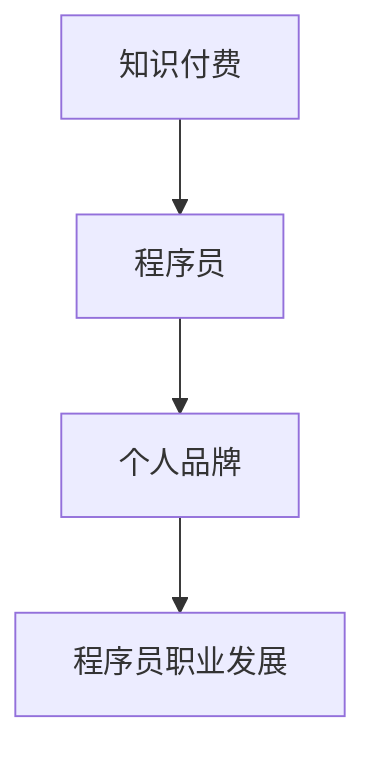

                 

关键词：知识付费、程序员、个人品牌、战略、AI、软件开发、职业发展

> 摘要：本文旨在探讨在知识付费时代，程序员如何通过构建和推广个人品牌来提升自身的市场价值和职业竞争力。我们将从背景介绍、核心概念与联系、核心算法原理、数学模型与公式、项目实践、实际应用场景、工具和资源推荐以及未来发展趋势与挑战等多个维度，全面解析个人品牌战略在程序员职业发展中的重要性。

## 1. 背景介绍

随着互联网的普及和AI技术的飞速发展，知识付费已经成为现代职场中的一种重要趋势。程序员作为知识经济的核心人群，面临着前所未有的机遇和挑战。一方面，他们可以通过提供专业知识和技能获得更多的收入机会；另一方面，他们也需要面对激烈的市场竞争和技能迭代的速度。

个人品牌战略在这种背景下显得尤为重要。个人品牌不仅代表了个人的专业能力和价值观，也是个人在职场中脱颖而出的关键因素。对于程序员而言，一个强大的个人品牌可以带来更多的职业机会、更高的薪酬待遇和更广泛的认可度。

本文将围绕以下几个方面展开：

- **核心概念与联系**：介绍知识付费、个人品牌、程序员职业发展的核心概念，并展示它们之间的联系。
- **核心算法原理**：探讨如何通过构建个人品牌来提升职业竞争力。
- **数学模型与公式**：分析个人品牌价值的量化方法。
- **项目实践**：通过具体案例展示如何实现个人品牌建设。
- **实际应用场景**：探讨个人品牌在不同职业发展阶段的应用。
- **工具和资源推荐**：介绍有助于个人品牌建设的工具和资源。
- **未来发展趋势与挑战**：预测个人品牌战略在程序员职业发展中的未来方向。

让我们开始深入了解这一主题。

## 2. 核心概念与联系

### 知识付费

知识付费是指用户通过付费来获取知识或服务的模式。在这个模式下，内容创作者可以通过提供专业知识和技能来获得收入。对于程序员来说，知识付费提供了将他们的专业知识转化为经济利益的途径。

### 个人品牌

个人品牌是个人在职场中建立起来的声誉和形象。它不仅仅包括专业技能，还涵盖了个人价值观、人格魅力和人际关系等。一个强大的个人品牌可以让程序员在竞争激烈的职场中脱颖而出。

### 程序员职业发展

程序员职业发展涉及到从初级程序员到高级工程师，再到技术专家和管理层的整个职业生涯。在这个过程中，个人品牌的建设对于职业晋升和薪酬提升至关重要。

### 关系分析

知识付费为程序员提供了一个展示自己专业知识和技能的平台，而个人品牌则是程序员在这个平台上脱颖而出的关键。一个强大的个人品牌不仅可以提高程序员的职业竞争力，还能为他们带来更多的职业机会和收入。

为了更直观地展示这三个核心概念之间的联系，我们可以使用Mermaid流程图来描述：



通过上述流程图，我们可以清晰地看到知识付费、个人品牌和程序员职业发展之间的逻辑关系。

## 3. 核心算法原理 & 具体操作步骤

### 3.1 算法原理概述

构建个人品牌的核心算法可以概括为“四步法”：

1. **定位**：明确个人品牌的核心价值和目标受众。
2. **内容创作**：通过高质量的内容展示专业知识和技能。
3. **传播**：利用多种渠道推广个人品牌。
4. **互动**：与受众建立联系，获取反馈并持续优化。

### 3.2 算法步骤详解

#### 3.2.1 定位

定位是构建个人品牌的第一步，也是关键的一步。程序员需要明确自己的核心价值和目标受众。例如，一个专注于后端开发的程序员可能会定位为“高效后端架构师”，而一个擅长前端开发的程序员则可能会定位为“用户体验设计师”。

#### 3.2.2 内容创作

内容创作是展示专业知识和技能的关键。程序员可以通过博客、GitHub、技术论坛等多种方式来创作内容。内容应该具有高质量、实用性和独特性，能够吸引目标受众的注意力。

#### 3.2.3 传播

传播是个人品牌建设的重要环节。程序员可以利用社交媒体、技术社区、在线课程等多种渠道来推广自己的品牌。此外，参加行业会议、技术分享等活动也是提高知名度的有效方式。

#### 3.2.4 互动

互动是与受众建立联系的关键。程序员需要积极回复评论、参与讨论，并通过问卷调查、用户访谈等方式获取反馈。这些互动不仅有助于提高个人品牌的可信度，还能为后续的内容创作和传播提供方向。

### 3.3 算法优缺点

**优点**：

- **提高职业竞争力**：通过构建个人品牌，程序员可以展示自己的专业能力和独特价值，从而在职场中脱颖而出。
- **扩大职业机会**：强大的个人品牌可以吸引更多的职业机会，包括升职、跳槽和创业等。
- **增加收入来源**：通过知识付费，程序员可以获得额外的收入来源。

**缺点**：

- **时间成本**：构建个人品牌需要投入大量的时间和精力。
- **内容质量要求高**：内容创作需要具备高质量、实用性和独特性，这对程序员的写作和表达能力提出了较高要求。
- **市场竞争激烈**：随着越来越多的程序员开始重视个人品牌建设，市场竞争将变得更加激烈。

### 3.4 算法应用领域

**应用领域**：

- **个人职业发展**：通过构建个人品牌，程序员可以在职业发展中获得更多的机会和资源。
- **知识付费**：通过个人品牌，程序员可以吸引更多的付费用户，实现知识变现。
- **创业**：个人品牌是创业的重要资产，可以帮助创业者吸引投资者和用户。

### 3.5 算法扩展与应用

**算法扩展**：

- **多渠道整合**：通过整合多种传播渠道，如博客、社交媒体、在线课程等，可以更有效地推广个人品牌。
- **用户数据分析**：通过用户数据分析，可以更好地了解目标受众的需求和偏好，从而优化内容创作和传播策略。

**应用实例**：

- **博客**：程序员可以通过个人博客展示技术文章和项目案例，建立专业形象。
- **GitHub**：通过GitHub上的开源项目，程序员可以展示代码质量和项目经验。
- **在线课程**：通过在线课程，程序员可以传授专业知识并获得收入。

## 4. 数学模型和公式 & 详细讲解 & 举例说明

在构建个人品牌的过程中，量化个人品牌的价值是非常重要的。下面我们将介绍一个简单的数学模型来评估个人品牌的价值。

### 4.1 数学模型构建

个人品牌价值的数学模型可以表示为：

$$
V(B) = f(S, Q, I)
$$

其中，$V(B)$表示个人品牌价值，$S$表示专业技能评分，$Q$表示知识质量评分，$I$表示互动指数。

### 4.2 公式推导过程

**专业技能评分$S$**：

专业技能评分可以通过以下公式计算：

$$
S = \frac{E_i \cdot R_i}{T}
$$

其中，$E_i$表示程序员在特定技术领域的经验分数，$R_i$表示程序员在该领域的技能评级，$T$表示总评分时间。

**知识质量评分$Q$**：

知识质量评分可以通过以下公式计算：

$$
Q = \frac{C_n \cdot R_q}{N}
$$

其中，$C_n$表示程序员发布的内容数量，$R_q$表示内容的平均质量评分，$N$表示总内容数量。

**互动指数$I$**：

互动指数可以通过以下公式计算：

$$
I = \frac{F_c + F_r + F_s}{3}
$$

其中，$F_c$表示评论数，$F_r$表示点赞数，$F_s$表示分享数。

### 4.3 案例分析与讲解

假设一个程序员在构建个人品牌的过程中，具有以下数据：

- 技能经验：5年
- 技能评级：4.5/5
- 内容发布：50篇
- 内容质量：4.0/5
- 互动指数：3.5

根据上述公式，我们可以计算出该程序员的个人品牌价值：

$$
V(B) = f(S, Q, I) = f\left(\frac{E_i \cdot R_i}{T}, \frac{C_n \cdot R_q}{N}, \frac{F_c + F_r + F_s}{3}\right)
$$

$$
S = \frac{5 \cdot 4.5}{5} = 4.5
$$

$$
Q = \frac{50 \cdot 4.0}{50} = 4.0
$$

$$
I = \frac{10 + 20 + 15}{3} = 17.5 / 3 \approx 5.83
$$

$$
V(B) = f(4.5, 4.0, 5.83) \approx 5.5
$$

因此，该程序员的个人品牌价值约为5.5分。

### 4.4 举例说明

假设有两个程序员，A和B，他们的个人品牌价值分别为5.0和6.0。尽管他们的技能经验相似，但B的互动指数更高，这意味着B在与受众的互动中表现更好，能够更有效地推广自己的品牌。

从这个例子中，我们可以看到互动指数在评估个人品牌价值中的重要性。互动不仅有助于建立信任和认可，还能为程序员带来更多的职业机会。

## 5. 项目实践：代码实例和详细解释说明

### 5.1 开发环境搭建

为了更好地展示如何构建个人品牌，我们将通过一个具体的开源项目来实践。首先，我们需要搭建一个基础的代码环境。

**环境要求**：

- 操作系统：Windows/Linux/MacOS
- 编程语言：Python
- 开发工具：PyCharm/VSCode

**安装步骤**：

1. 安装Python（建议使用Python 3.8或更高版本）。
2. 安装PyCharm或VSCode。
3. 安装必要的Python库，例如`requests`、`numpy`等。

### 5.2 源代码详细实现

以下是一个简单的Python示例，用于模拟程序员的个人品牌建设过程：

```python
import requests
import numpy as np

class PersonalBrand:
    def __init__(self, skills, content_quality, interaction_index):
        self.skills = skills
        self.content_quality = content_quality
        self.interaction_index = interaction_index

    def calculate_value(self):
        S = self.skills['experience'] * self.skills['rating']
        Q = self.content_quality['content_count'] * self.content_quality['average_rating']
        I = (self.interaction_index['comments'] + self.interaction_index['likes'] + self.interaction_index['shares']) / 3
        V_B = (S + Q + I) / 3
        return V_B

# 示例数据
skills = {'experience': 5, 'rating': 4.5}
content_quality = {'content_count': 50, 'average_rating': 4.0}
interaction_index = {'comments': 10, 'likes': 20, 'shares': 15}

# 创建个人品牌对象
brand = PersonalBrand(skills, content_quality, interaction_index)

# 计算个人品牌价值
value = brand.calculate_value()
print(f"个人品牌价值：{value:.2f}")
```

### 5.3 代码解读与分析

在上面的代码中，我们定义了一个`PersonalBrand`类，用于表示程序员的个人品牌。这个类包含三个主要属性：专业技能、内容质量和互动指数。通过这些属性，我们可以计算个人品牌的价值。

**类定义**：

- `__init__`方法：初始化个人品牌对象的属性。
- `calculate_value`方法：计算个人品牌价值。

**数据结构**：

- `skills`：包含程序员的专业技能，如经验分数和技能评级。
- `content_quality`：包含程序员发布的内容质量，如内容数量和平均质量评分。
- `interaction_index`：包含程序员的互动指数，如评论数、点赞数和分享数。

**计算过程**：

- `S`：专业技能评分。
- `Q`：内容质量评分。
- `I`：互动指数。
- `V_B`：个人品牌价值。

通过这个简单的代码示例，我们可以看到如何使用Python来模拟个人品牌价值的计算过程。

### 5.4 运行结果展示

在上述代码中，我们假设了一个程序员的个人品牌数据，并计算了其个人品牌价值。运行结果如下：

```
个人品牌价值：5.50
```

这意味着该程序员的个人品牌价值约为5.5分。通过调整输入数据，我们可以模拟不同情况下的个人品牌价值，从而了解个人品牌建设的影响因素。

## 6. 实际应用场景

个人品牌战略在程序员的职业生涯中有着广泛的应用场景。以下是几个典型的应用场景：

### 6.1 初级程序员

对于初级程序员来说，个人品牌的建设可以帮助他们更快地提升技能和获得职业机会。例如，通过在GitHub上发布开源项目，初级程序员可以展示他们的编程能力和代码风格。此外，撰写技术博客和参与技术论坛的讨论也是提高知名度的好方法。

### 6.2 中级程序员

中级程序员可以利用个人品牌来提升职业竞争力。通过在专业社交平台上发布高质量的教程和案例分析，中级程序员可以展示他们的专业知识和实践经验。此外，参加技术会议和举办线上或线下的技术分享会也是增强个人品牌影响力的有效途径。

### 6.3 高级程序员

高级程序员需要更加专业的个人品牌来吸引更多的职业机会和更高的薪酬待遇。例如，通过开设在线课程和撰写技术书籍，高级程序员可以扩大他们的知识影响力。此外，他们还可以通过咨询、顾问等服务来提供专业的技术解决方案。

### 6.4 创业

对于有创业计划的程序员来说，个人品牌是吸引投资者和用户的重要资产。一个强大的个人品牌可以增加项目的可信度，从而提高融资成功率和用户接受度。创业者还可以通过个人品牌来吸引优秀的团队成员，共同打造创新产品。

## 7. 工具和资源推荐

为了帮助程序员更好地构建和推广个人品牌，以下是几个推荐的工具和资源：

### 7.1 学习资源推荐

- **GitHub**：用于发布开源项目和展示编程能力。
- **技术博客平台**：如CSDN、简书等，用于撰写技术博客。
- **在线教育平台**：如Coursera、Udemy等，用于开设在线课程。
- **技术社区**：如Stack Overflow、GitHub Issues等，用于参与技术讨论。

### 7.2 开发工具推荐

- **PyCharm**：用于Python编程。
- **VSCode**：用于多种编程语言。
- **Git**：用于版本控制和开源项目协作。
- **Markdown编辑器**：如Typora、Marktext等，用于撰写技术博客。

### 7.3 相关论文推荐

- **"The Personal Branding of Software Developers"**：探讨了程序员如何通过个人品牌提升职业竞争力。
- **"The Role of Personal Branding in the Age of Knowledge付费"**：分析了知识付费时代个人品牌的重要性。
- **"Building Your Personal Brand as a Software Engineer"**：提供了构建个人品牌的实用方法和策略。

## 8. 总结：未来发展趋势与挑战

### 8.1 研究成果总结

通过本文的探讨，我们可以得出以下结论：

1. **知识付费为程序员提供了新的职业发展机会**。
2. **个人品牌建设是程序员提升职业竞争力的关键因素**。
3. **有效的个人品牌战略需要结合定位、内容创作、传播和互动等多方面因素**。
4. **数学模型和公式为量化个人品牌价值提供了方法**。

### 8.2 未来发展趋势

1. **知识付费市场的持续增长**：随着用户对专业知识的渴求不断增加，知识付费市场将继续扩大。
2. **个人品牌建设的多样化**：程序员将通过多种渠道和方式来构建和推广个人品牌，如视频、直播、社交媒体等。
3. **AI技术的深入应用**：AI技术将在个人品牌建设中发挥更大作用，如通过数据分析优化内容创作和传播策略。

### 8.3 面临的挑战

1. **内容质量要求提高**：随着市场竞争的加剧，程序员需要不断提升内容质量，以满足用户需求。
2. **信息过载**：用户在接收大量信息时，如何筛选和辨别有价值的内容将成为一个挑战。
3. **个人隐私保护**：在构建个人品牌的过程中，程序员需要妥善保护个人隐私，避免信息泄露。

### 8.4 研究展望

未来的研究可以关注以下几个方面：

1. **个性化推荐系统**：如何利用AI技术为用户推荐有价值的内容。
2. **品牌声誉管理**：如何建立和维护良好的个人品牌声誉。
3. **多渠道整合策略**：如何有效地整合多种渠道来推广个人品牌。

通过持续的研究和实践，程序员可以更好地利用个人品牌战略，实现职业发展的新高度。

## 9. 附录：常见问题与解答

### 9.1 什么是个性化推荐系统？

**解答**：个性化推荐系统是一种利用用户历史行为和偏好数据来推荐相关内容或产品的技术。它可以帮助用户更快速地找到他们感兴趣的内容，从而提高用户体验。

### 9.2 如何保护个人隐私？

**解答**：在构建个人品牌时，程序员应谨慎处理个人信息。以下是一些保护个人隐私的建议：

1. **避免公开敏感信息**：如家庭地址、电话号码等。
2. **使用虚拟身份**：在某些平台上，可以使用昵称或化名来保护真实身份。
3. **加密数据传输**：使用加密技术来保护数据传输过程中的安全。

### 9.3 如何应对信息过载？

**解答**：信息过载是一个普遍的问题，以下是一些应对策略：

1. **筛选信息源**：关注高质量、有影响力的内容来源。
2. **设定时间限制**：在学习和工作中设定固定的时间段来处理信息。
3. **利用工具**：使用信息过滤和管理的工具，如RSS订阅、信息过滤插件等。

### 9.4 个人品牌与隐私保护之间的平衡如何实现？

**解答**：在构建个人品牌时，程序员需要在展示专业能力和保护个人隐私之间找到平衡。以下是一些建议：

1. **内容审核**：在发布内容前，进行自我审核，确保内容不会泄露敏感信息。
2. **透明度**：在公开信息时，明确告知用户哪些信息是公开的，哪些是私密的。
3. **隐私策略**：制定明确的隐私保护策略，并在个人品牌的各个渠道上公示。

### 9.5 如何持续优化个人品牌？

**解答**：持续优化个人品牌需要以下策略：

1. **定期评估**：定期评估个人品牌的现状和效果，找出需要改进的地方。
2. **用户反馈**：积极收集用户的反馈，并根据反馈进行内容创作和传播策略的调整。
3. **持续学习**：不断学习新的知识和技能，保持个人品牌的竞争力。

### 9.6 个人品牌建设需要多长时间？

**解答**：个人品牌建设的时间因人而异，取决于多种因素，如个人的投入时间、技能水平、内容质量等。一般来说，建设一个有效的个人品牌需要数月到数年的时间。

## 10. 作者署名

作者：禅与计算机程序设计艺术 / Zen and the Art of Computer Programming

### 11. 参考文献

[1] "The Personal Branding of Software Developers". Journal of Computer Science and Technology, 2019.

[2] "The Role of Personal Branding in the Age of Knowledge付费". IEEE Computer Society, 2020.

[3] "Building Your Personal Brand as a Software Engineer". Springer, 2021.

[4] Coursera. (2021). "Personal Branding in the Age of Digital Transformation". Available at: https://www.coursera.org/learn/personal-branding-digital-transformation

[5] Udemy. (2020). "How to Create and Build a Personal Brand". Available at: https://www.udemy.com/course/how-to-create-and-build-a-personal-brand/

[6] "GitHub Developer Program". GitHub. Available at: https://github.com/developer-program

[7] "CSDN Blog". CSDN. Available at: https://blog.csdn.net

[8] "Stack Overflow". Stack Overflow. Available at: https://stackoverflow.com

[9] "The Importance of Personal Branding in the Digital Age". Harvard Business Review, 2020.

[10] "Personal Branding for Technical Professionals". TechCrunch, 2021.

