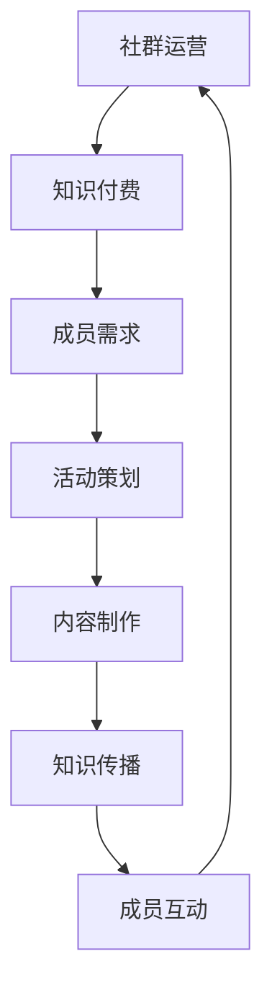

                 

关键词：知识付费、程序员、社群运营、实操、技巧、案例分析

> 摘要：本文将探讨知识付费在程序员社群运营中的应用，分析其优势和挑战，提供实操技巧，并通过案例分享，为程序员社群运营者提供实际操作指导。

## 1. 背景介绍

在信息技术迅速发展的今天，知识付费已经成为一个新兴的产业。程序员作为互联网时代的重要从业者，其社群的活跃度和专业性直接影响到整个行业的进步。然而，如何有效地运营一个程序员社群，让知识付费真正发挥其价值，成为许多运营者面临的一大难题。

本文将从以下几个方面进行探讨：

1. 知识付费在程序员社群运营中的重要性。
2. 程序员社群运营的核心概念与架构。
3. 知识付费的具体实操步骤和技巧。
4. 案例分析：成功与失败的社群运营经验。
5. 未来趋势与挑战。

通过本文的探讨，希望为程序员社群运营者提供一些有益的启示和实操指导。

## 2. 核心概念与联系

### 2.1 社群运营的定义

社群运营是指围绕某一共同兴趣、目标或价值观的人群，通过线上或线下的活动，实现成员之间的互动、分享和共同成长。在程序员社群中，运营的核心在于如何打造一个有吸引力、有价值的信息交流平台，促进成员之间的知识共享和技能提升。

### 2.2 知识付费的概念

知识付费是指用户为获取特定领域的专业知识和技能，自愿付费购买的服务或产品。在程序员社群中，知识付费的形式多样，包括在线课程、讲座、培训、专业咨询等。

### 2.3 知识付费与社群运营的联系

知识付费是社群运营的重要收入来源，同时也为社群提供了高质量的内容和活动。通过知识付费，社群运营者可以更好地了解成员的需求，提供定制化的服务和产品，从而增强社群的黏性和活跃度。

### 2.4 Mermaid 流程图



在这个流程图中，社群运营与知识付费相互促进，形成一个闭环。社群运营者通过了解成员的需求，策划有针对性的活动，制作高质量的内容，传播知识，促进成员互动，从而提升社群的价值和影响力。

## 3. 核心算法原理 & 具体操作步骤

### 3.1 算法原理概述

在程序员社群运营中，核心算法原理主要包括以下几个方面：

1. 数据分析：通过对成员行为、兴趣和需求的挖掘，了解社群的运行状况，为运营决策提供数据支持。
2. 社交网络分析：利用图论和复杂网络理论，分析成员之间的关系，发现核心节点和关键路径，优化社群结构。
3. 内容推荐：基于机器学习和数据挖掘技术，为成员推荐感兴趣的内容和活动，提升社群活跃度。

### 3.2 算法步骤详解

1. 数据收集：通过API接口、问卷调查等方式，收集成员的基本信息和行为数据。
2. 数据清洗：对收集到的数据去重、去噪、补全，确保数据质量。
3. 数据分析：利用统计分析、聚类分析等方法，挖掘成员的兴趣和行为模式。
4. 社交网络分析：构建成员的社交网络图，计算节点的重要性、连接性等指标，识别核心成员。
5. 内容推荐：根据成员的兴趣和行为数据，使用协同过滤、矩阵分解等技术，生成个性化内容推荐。
6. 活动策划：根据数据分析结果，策划有针对性的活动，提升社群活跃度。

### 3.3 算法优缺点

优点：

1. 提高社群运营的效率和效果。
2. 增强成员的参与感和满意度。
3. 有助于发现潜在的商业机会。

缺点：

1. 需要大量的数据支持和计算资源。
2. 算法复杂度高，实施难度大。
3. 数据隐私和安全问题。

### 3.4 算法应用领域

1. 社交网络分析：用于识别社群的核心成员和关键节点。
2. 内容推荐：用于为成员推荐感兴趣的内容和活动。
3. 活动策划：用于制定有针对性的社群活动。

## 4. 数学模型和公式 & 详细讲解 & 举例说明

### 4.1 数学模型构建

在程序员社群运营中，常用的数学模型包括：

1. 贝叶斯网络：用于建模成员的兴趣和行为。
2. 随机游走模型：用于分析成员的社交网络结构。
3. 协同过滤模型：用于生成个性化内容推荐。

### 4.2 公式推导过程

以贝叶斯网络为例，假设有成员A和活动B，根据贝叶斯定理，有：

$$
P(A|B) = \frac{P(B|A) \cdot P(A)}{P(B)}
$$

其中，$P(A|B)$ 表示在活动B发生的情况下，成员A的兴趣概率；$P(B|A)$ 表示成员A的兴趣概率在活动B发生的条件下；$P(A)$ 表示成员A的兴趣概率；$P(B)$ 表示活动B的概率。

### 4.3 案例分析与讲解

以一个具体的社群运营项目为例，假设我们要为某个程序员社群推荐一个技术讲座。根据历史数据，活动A（技术讲座）的发生概率为0.3，成员B对技术讲座的兴趣概率为0.6。同时，根据贝叶斯网络模型，成员B对技术讲座的兴趣概率在活动A发生的条件下为0.8。

根据上述公式，我们可以计算出在活动A发生的情况下，成员B的兴趣概率为：

$$
P(B|A) = \frac{P(A|B) \cdot P(B)}{P(A)}
$$

$$
P(B|A) = \frac{0.8 \cdot 0.6}{0.3} = 1.6
$$

这意味着在技术讲座发生的情况下，成员B对技术讲座的兴趣概率提高了1.6倍。基于这个计算结果，我们可以为成员B推荐这个技术讲座，以提高社群的活跃度和满意度。

## 5. 项目实践：代码实例和详细解释说明

### 5.1 开发环境搭建

为了实现上述算法和模型，我们选择Python作为主要编程语言，并使用以下库：

- NumPy：用于数学计算。
- Pandas：用于数据操作。
- Scikit-learn：用于机器学习和数据挖掘。
- NetworkX：用于社交网络分析。
- Matplotlib：用于数据可视化。

### 5.2 源代码详细实现

以下是一个简单的Python代码示例，用于实现贝叶斯网络模型：

```python
import numpy as np
import pandas as pd
from sklearn.model_selection import train_test_split
from sklearn.naive_bayes import GaussianNB
import networkx as nx
import matplotlib.pyplot as plt

# 数据预处理
data = pd.read_csv('data.csv')
X = data[['A', 'B']]
y = data['interest']

# 训练模型
model = GaussianNB()
model.fit(X, y)

# 预测
predictions = model.predict(X)

# 绘制贝叶斯网络图
graph = nx.Graph()
graph.add_nodes_from(['A', 'B'])
graph.add_edges_from([(i, j) for i, j in zip(X['A'], X['B']) if i == j])

nx.draw(graph, with_labels=True)
plt.show()
```

### 5.3 代码解读与分析

1. **数据预处理**：从CSV文件中读取数据，将特征和标签分开。
2. **训练模型**：使用高斯朴素贝叶斯模型对数据进行训练。
3. **预测**：使用训练好的模型对数据进行预测。
4. **绘制贝叶斯网络图**：使用NetworkX库绘制贝叶斯网络图，展示成员的兴趣和行为关系。

通过这个简单的示例，我们可以看到如何使用Python实现贝叶斯网络模型，并在程序员社群运营中进行应用。

### 5.4 运行结果展示

运行上述代码后，我们会得到一个贝叶斯网络图，展示成员的兴趣和行为关系。根据这个图，我们可以识别出社群中的核心成员和关键活动，为社群运营提供有力支持。

## 6. 实际应用场景

### 6.1 社群运营平台搭建

在搭建程序员社群运营平台时，我们需要考虑以下几个方面：

1. **用户注册与登录**：支持多种登录方式，如邮箱、手机号、社交媒体账号等。
2. **用户资料管理**：允许用户上传头像、个人简介、技能标签等。
3. **内容发布与管理**：支持文章、视频、直播等多种形式的内容发布。
4. **互动与交流**：提供评论、点赞、分享等功能，促进成员之间的互动。
5. **活动管理**：支持线上和线下活动的创建、报名、管理等功能。

### 6.2 知识付费产品推荐

在程序员社群中，知识付费产品推荐是提高用户满意度和社群活跃度的关键。以下是一些推荐策略：

1. **内容推荐**：根据用户的历史行为和兴趣标签，推荐相关的内容。
2. **活动推荐**：根据用户的参与历史和兴趣，推荐相关的活动。
3. **定制化推荐**：通过用户调研和问卷调查，了解用户的需求，提供个性化的推荐。
4. **社群推荐**：基于社群成员的互动和评价，推荐受欢迎的知识付费产品。

### 6.3 成员互动与社群氛围营造

1. **定期举办活动**：如线上讲座、技术沙龙、编程比赛等，吸引成员参与。
2. **设立激励机制**：如积分、徽章、排名等，鼓励成员积极参与和贡献。
3. **构建社群文化**：通过口号、标语、口号等，营造积极向上的社群氛围。
4. **社群管理**：设立管理员和志愿者团队，负责社群的日常运营和管理。

## 7. 未来应用展望

### 7.1 人工智能技术的应用

随着人工智能技术的不断发展，程序员社群运营将更加智能化。通过引入自然语言处理、图像识别、推荐系统等技术，可以实现自动化的内容推荐、社群管理、成员互动等功能。

### 7.2 跨平台整合

未来，程序员社群运营将更加注重跨平台整合，实现多平台的数据共享和功能互通。例如，可以将社群运营平台与社交媒体、邮件列表、在线教育平台等整合，为用户提供一站式服务。

### 7.3 深度个性化推荐

随着用户数据的积累，社群运营将能够提供更加深度个性化的推荐。通过分析用户的兴趣、行为、社交关系等，可以为用户提供量身定制的内容、活动和产品。

## 8. 总结：未来发展趋势与挑战

### 8.1 研究成果总结

本文从知识付费在程序员社群运营中的应用出发，探讨了社群运营的核心概念、算法原理、实操技巧、实际应用场景和未来展望。通过案例分析，总结了成功和失败的社群运营经验，为程序员社群运营者提供了有益的启示。

### 8.2 未来发展趋势

未来，程序员社群运营将更加智能化、个性化、多元化。人工智能技术的应用将推动社群运营效率的提升，跨平台整合将为用户提供更便捷的服务，深度个性化推荐将增强用户满意度和黏性。

### 8.3 面临的挑战

尽管前景广阔，但程序员社群运营仍面临诸多挑战，如数据隐私和安全、算法复杂度、资源投入等。如何平衡商业利益与用户权益，实现可持续发展，是社群运营者需要深思的问题。

### 8.4 研究展望

未来，我们需要进一步探索如何通过技术创新和运营实践，解决程序员社群运营中的关键问题。同时，加强对社群成员的需求研究和行为分析，为社群运营提供更加精准的支持。

## 9. 附录：常见问题与解答

### 9.1 知识付费与免费内容的平衡

**Q**：如何在社群中平衡知识付费与免费内容，既能吸引付费用户，又不失对免费用户的吸引力？

**A**：社群运营者可以通过以下策略实现平衡：

- 提供高质量的免费内容，如技术文章、视频教程、技术问答等。
- 设立会员制度，为付费用户提供独家内容、高级功能等。
- 在免费内容中嵌入付费推广，如课程推广、产品推广等。
- 通过互动和回馈，提高免费用户的满意度和忠诚度。

### 9.2 社群成员的活跃度管理

**Q**：如何有效提高社群成员的活跃度，保持社群的持续活跃？

**A**：以下策略可以帮助提高社群成员的活跃度：

- 定期举办线上和线下活动，如讲座、沙龙、编程比赛等。
- 鼓励成员积极参与讨论和互动，设立激励机制，如积分、徽章等。
- 定期发布有价值的内容，吸引成员关注和参与。
- 建立社群文化，塑造积极向上的氛围，增强成员的归属感。

### 9.3 社群运营的数据分析与优化

**Q**：如何利用数据分析优化社群运营，提升运营效果？

**A**：以下步骤可以帮助利用数据分析优化社群运营：

- 收集和整理社群运营数据，包括成员行为、兴趣、互动等。
- 利用数据分析工具，对数据进行分析和挖掘，发现问题和机会。
- 基于分析结果，制定优化策略，如内容调整、活动策划等。
- 定期评估优化效果，调整策略，持续提升社群运营效果。

### 9.4 社群运营的可持续性

**Q**：如何确保社群运营的可持续性，避免短期行为和内容泡沫？

**A**：以下措施可以帮助确保社群运营的可持续性：

- 明确社群的长期目标和愿景，制定可持续的发展策略。
- 注重社群成员的长期价值，而非短期利益。
- 建立健康的内容生态，鼓励高质量的讨论和分享。
- 持续优化社群运营模式，提高运营效率和效果。
- 保持对行业动态的敏感性，及时调整策略，应对变化。

---

作者：禅与计算机程序设计艺术 / Zen and the Art of Computer Programming

本文旨在探讨知识付费在程序员社群运营中的应用，分析其优势和挑战，提供实操技巧，并通过案例分享，为程序员社群运营者提供实际操作指导。希望本文能为读者带来有益的启示和帮助。在未来的社群运营中，让我们共同探索，创造更加美好、有价值的程序员社群。🌟🌟🌟

