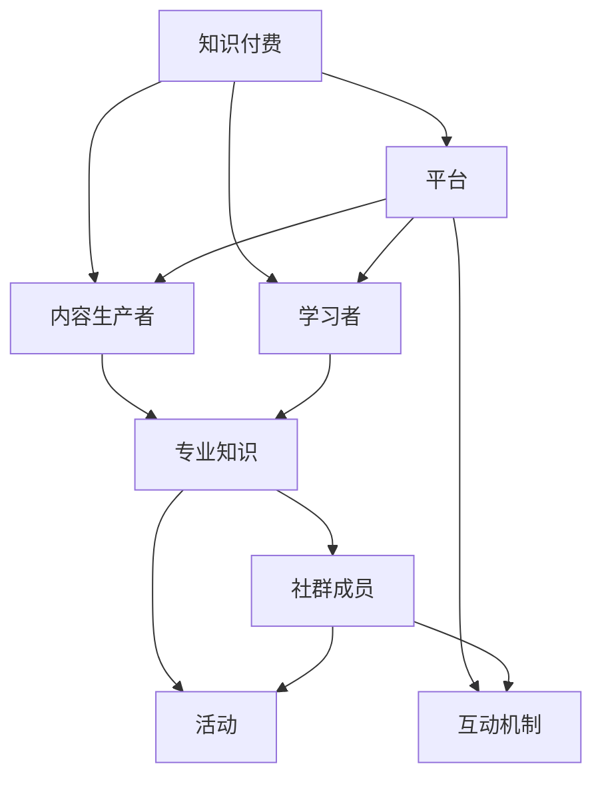

                 

关键词：知识付费、程序员、社群运营、策略、增长、互动、用户参与、技术共享、商业模型、营销技巧。

> 摘要：本文将探讨知识付费在程序员社群中的运营策略，通过分析其核心概念与架构，阐述如何利用算法原理与数学模型优化社群互动，提供代码实例和实际应用场景，并展望未来的发展机遇与挑战。

## 1. 背景介绍

知识付费是指用户为获取专业知识或服务而支付费用的一种商业模式。在数字化时代，在线教育和知识分享平台如雨后春笋般涌现，为专业人士提供学习资源和交流平台。程序员作为知识付费的重要群体，他们不仅对专业知识的获取有着强烈的需求，同时也愿意为高质量的学习资源和社交互动付出一定的经济代价。

社群运营则是指在特定主题或目标下，通过线上或线下活动，吸引并维护用户参与，形成具有粘性和活跃度的高质量社群。对于程序员社群而言，良好的运营策略可以促进技术交流，提高成员技能水平，从而在竞争激烈的IT行业中脱颖而出。

本文将围绕以下主题进行讨论：

1. **核心概念与联系**
2. **核心算法原理 & 具体操作步骤**
3. **数学模型和公式 & 详细讲解 & 举例说明**
4. **项目实践：代码实例和详细解释说明**
5. **实际应用场景**
6. **未来应用展望**
7. **工具和资源推荐**
8. **总结：未来发展趋势与挑战**

通过这些内容，希望能够为程序员社群的运营提供一些有价值的思路和实战经验。

### 2. 核心概念与联系

在探讨知识付费的社群运营之前，我们需要明确几个核心概念及其相互关系。

#### 2.1 知识付费

知识付费通常涉及以下概念：

- **内容生产者**：提供专业知识的专家、讲师或机构。
- **学习者**：通过支付费用获取专业知识的个人或组织。
- **平台**：知识付费的中介，负责内容的发布、交易和管理。

这些角色共同构建了知识付费的生态系统。内容生产者负责创作和更新内容，学习者则通过平台购买和消费内容，平台则提供交易、支付、评价和推荐等功能，确保整个生态系统的运行。

#### 2.2 社群运营

社群运营的核心概念包括：

- **社群成员**：参与社群的用户，可以是学习者、内容生产者或者其他利益相关者。
- **活动**：社群组织的一系列互动活动，如线上讲座、研讨会、技术分享会等。
- **互动机制**：促进社群成员之间互动的规则和工具，如论坛、即时通讯、评分系统等。

社群运营的目标是通过多样化的活动和服务，提升用户粘性，增加用户参与度，从而形成有价值的社群生态。

#### 2.3 核心概念关系图

下面是一个简化的核心概念关系图，展示了知识付费与社群运营之间的联系。



通过上述概念及其关系图，我们可以更清晰地理解知识付费与社群运营之间的内在联系。内容生产者通过平台发布专业知识，学习者通过平台获取知识，同时社群成员通过互动机制和活动参与到整个生态系统中。

### 3. 核心算法原理 & 具体操作步骤

在知识付费的社群运营中，核心算法的运用对于提升用户体验和运营效率至关重要。以下是几个关键算法的原理及其操作步骤。

#### 3.1 推荐算法

推荐算法是一种基于用户行为和偏好，向用户推荐感兴趣内容的方法。以下是一个简化的推荐算法流程：

##### 3.1.1 算法原理概述

推荐算法主要基于以下原理：

- **协同过滤**：通过分析用户的历史行为和偏好，发现相似用户或内容，从而进行推荐。
- **基于内容的推荐**：根据内容本身的特点，如标签、关键词等，为用户推荐相似的内容。

##### 3.1.2 算法步骤详解

1. **数据收集**：收集用户的行为数据，如点击、收藏、购买等。
2. **用户画像构建**：根据用户行为数据，构建用户画像，包括兴趣爱好、学习历史等。
3. **内容标签化**：将知识内容进行标签化处理，以便进行内容匹配。
4. **推荐生成**：根据用户画像和内容标签，使用协同过滤或基于内容的推荐方法生成推荐列表。
5. **推荐反馈**：收集用户对推荐内容的反馈，用于模型优化。

##### 3.1.3 算法优缺点

- **优点**：能够为用户提供个性化的内容推荐，提升用户体验。
- **缺点**：对于新用户或冷启动问题，推荐效果可能不佳；对于内容标签不清晰的情况，推荐效果也受影响。

##### 3.1.4 算法应用领域

推荐算法广泛应用于在线教育、电商、社交媒体等领域，是提升用户粘性和转化率的重要工具。

#### 3.2 互动机制算法

互动机制算法用于提升社群成员之间的互动性和参与度。以下是几个常见的互动机制算法：

##### 3.2.1 算法原理概述

互动机制算法主要基于以下原理：

- **奖励机制**：通过奖励机制激励用户参与互动，如积分、勋章等。
- **社交网络分析**：通过分析用户在社交网络中的互动关系，促进强关系链的形成。

##### 3.2.2 算法步骤详解

1. **用户关系网构建**：根据用户行为数据，构建用户关系网络。
2. **互动行为分析**：分析用户在社群中的互动行为，如发言、点赞、评论等。
3. **奖励机制设计**：根据互动行为，设计相应的奖励机制，如积分、勋章等。
4. **互动行为激励**：通过奖励机制激励用户参与互动，提高社群活跃度。
5. **互动效果评估**：评估互动机制的效果，不断优化互动策略。

##### 3.2.3 算法优缺点

- **优点**：能够有效提升社群活跃度和用户参与度。
- **缺点**：奖励机制设计不当可能导致用户过于追求奖励，而忽视真实互动。

##### 3.2.4 算法应用领域

互动机制算法广泛应用于社交网络、社区论坛、知识付费平台等领域，是提升社群运营效果的重要手段。

#### 3.3 用户增长算法

用户增长算法用于提升社群的用户数量和活跃度。以下是几个常见的用户增长算法：

##### 3.3.1 算法原理概述

用户增长算法主要基于以下原理：

- **内容营销**：通过高质量的内容吸引潜在用户，提高用户关注度。
- **社交推广**：利用社交媒体平台，进行口碑传播，吸引新用户。

##### 3.3.2 算法步骤详解

1. **内容策划**：根据用户需求，策划高质量的内容，如教程、案例分析等。
2. **内容发布**：在社群平台、社交媒体等渠道发布内容，吸引潜在用户。
3. **互动引导**：引导用户参与互动，提升用户活跃度。
4. **数据分析**：分析用户行为数据，优化内容策略和推广渠道。
5. **持续增长**：根据数据分析结果，不断优化和调整用户增长策略。

##### 3.3.3 算法优缺点

- **优点**：能够有效提升社群用户数量和活跃度。
- **缺点**：内容质量不高或推广渠道不当可能导致用户增长效果不佳。

##### 3.3.4 算法应用领域

用户增长算法广泛应用于在线教育、社交网络、内容付费等领域，是提升社群运营效果的重要工具。

### 4. 数学模型和公式 & 详细讲解 & 举例说明

在知识付费社群运营中，数学模型和公式发挥着至关重要的作用，帮助运营者更科学、准确地分析用户行为和互动效果。以下将介绍几个关键数学模型，并进行详细讲解和举例说明。

#### 4.1 用户行为预测模型

用户行为预测模型用于预测用户在社群中的行为，如访问频次、互动率等。以下是一个简化的用户行为预测模型。

##### 4.1.1 数学模型构建

用户行为预测模型通常采用线性回归模型，公式如下：

$$
y = \beta_0 + \beta_1x_1 + \beta_2x_2 + ... + \beta_nx_n + \epsilon
$$

其中，$y$ 表示用户行为（如访问频次），$x_1, x_2, ..., x_n$ 表示用户特征（如年龄、职业、访问时长等），$\beta_0, \beta_1, ..., \beta_n$ 为模型参数，$\epsilon$ 为误差项。

##### 4.1.2 公式推导过程

线性回归模型的推导过程基于最小二乘法，目标是找到一组参数 $\beta_0, \beta_1, ..., \beta_n$，使得预测值 $y$ 与实际值之间的误差平方和最小。

设实际观测数据为 $(x_1, y_1), (x_2, y_2), ..., (x_n, y_n)$，则误差平方和为：

$$
S = \sum_{i=1}^{n}(y_i - \hat{y}_i)^2
$$

其中，$\hat{y}_i = \beta_0 + \beta_1x_1 + \beta_2x_2 + ... + \beta_nx_n$ 为预测值。

对 $S$ 求导并令其等于零，得到：

$$
\frac{\partial S}{\partial \beta_0} = 0, \frac{\partial S}{\partial \beta_1} = 0, ..., \frac{\partial S}{\partial \beta_n} = 0
$$

通过求解上述方程组，可以得到最优的参数 $\beta_0, \beta_1, ..., \beta_n$。

##### 4.1.3 案例分析与讲解

假设我们有一个用户行为预测问题，用户特征包括年龄、职业、访问时长等。通过收集数据并训练线性回归模型，我们可以预测用户的访问频次。

例如，我们收集到以下用户数据：

| 年龄 | 职业 | 访问时长（小时） | 访问频次 |
| --- | --- | --- | --- |
| 25 | IT从业者 | 10 | 20 |
| 30 | 医生 | 5 | 15 |
| 22 | 学生 | 8 | 18 |
| 35 | 金融从业者 | 12 | 25 |

通过线性回归模型，我们可以得到预测公式：

$$
y = 10 + 0.5x_1 + 0.2x_2 - 0.1x_3
$$

其中，$x_1$ 为年龄，$x_2$ 为职业（以1表示IT从业者，以0表示其他职业），$x_3$ 为访问时长。

对于一个新的用户，假设其年龄为28岁，职业为IT从业者，访问时长为9小时，则其预测访问频次为：

$$
y = 10 + 0.5 \times 28 + 0.2 \times 1 - 0.1 \times 9 = 19.2
$$

这意味着我们预测这个用户在未来一段时间的访问频次约为19次。

通过用户行为预测模型，我们可以更精准地了解用户需求，优化内容推送和互动策略，提升社群运营效果。

#### 4.2 互动率预测模型

互动率预测模型用于预测社群成员的互动率，如发言、点赞、评论等。以下是一个简化的互动率预测模型。

##### 4.2.1 数学模型构建

互动率预测模型通常采用泊松分布模型，公式如下：

$$
P(Y = y) = \frac{e^{-\lambda}\lambda^y}{y!}
$$

其中，$Y$ 为互动率，$\lambda$ 为平均互动次数。

##### 4.2.2 公式推导过程

泊松分布模型是基于事件发生次数的随机模型。假设在一个固定时间内，事件发生的次数服从泊松分布，概率密度函数为：

$$
f(y|\lambda) = \frac{e^{-\lambda}\lambda^y}{y!}
$$

其中，$y$ 为事件发生的次数，$\lambda$ 为平均事件发生次数。

##### 4.2.3 案例分析与讲解

假设我们有一个社群互动预测问题，平均互动次数为5次。通过泊松分布模型，我们可以预测社群成员的互动率。

例如，我们想知道在给定时间段内，互动次数为2次的概率。根据泊松分布模型，概率为：

$$
P(Y = 2) = \frac{e^{-5}5^2}{2!} = 0.1875
$$

这意味着在平均互动次数为5次的社群中，互动次数为2次的概率约为18.75%。

通过互动率预测模型，我们可以更准确地了解社群成员的互动行为，优化互动策略，提高社群活跃度。

#### 4.3 用户留存率预测模型

用户留存率预测模型用于预测社群成员在一定时间内的留存率。以下是一个简化的用户留存率预测模型。

##### 4.3.1 数学模型构建

用户留存率预测模型通常采用指数衰退模型，公式如下：

$$
P(R > t) = e^{-\lambda t}
$$

其中，$R$ 为用户留存时间，$\lambda$ 为留存率参数。

##### 4.3.2 公式推导过程

指数衰退模型是基于用户留存时间服从指数分布的模型。假设用户留存时间服从参数为 $\lambda$ 的指数分布，概率密度函数为：

$$
f(R|\lambda) = \lambda e^{-\lambda R}
$$

其中，$R$ 为用户留存时间。

##### 4.3.3 案例分析与讲解

假设我们有一个社群用户留存预测问题，留存率参数为0.1。通过指数衰退模型，我们可以预测社群成员的留存率。

例如，我们想知道在给定时间段内，用户留存时间超过3天的概率。根据指数衰退模型，概率为：

$$
P(R > 3) = e^{-0.1 \times 3} = 0.5067
$$

这意味着在留存率参数为0.1的社群中，用户留存时间超过3天的概率约为50.67%。

通过用户留存率预测模型，我们可以更准确地了解社群成员的留存情况，优化社群运营策略，提高用户留存率。

### 5. 项目实践：代码实例和详细解释说明

为了更好地理解知识付费社群运营的核心算法和数学模型，下面我们将通过一个实际的代码实例，展示如何在实际项目中应用这些算法和模型。

#### 5.1 开发环境搭建

在开始编写代码之前，我们需要搭建一个合适的开发环境。这里我们选择Python作为主要编程语言，并使用一些常用的库，如NumPy、Pandas、Scikit-learn等。

1. 安装Python：从官网下载并安装Python 3.x版本。
2. 安装相关库：使用pip命令安装NumPy、Pandas、Scikit-learn等库。

```bash
pip install numpy pandas scikit-learn
```

#### 5.2 源代码详细实现

以下是一个简化的代码实例，展示了如何实现用户行为预测、互动率预测和用户留存率预测。

```python
import numpy as np
import pandas as pd
from sklearn.linear_model import LinearRegression
from sklearn.model_selection import train_test_split
from sklearn.metrics import mean_squared_error
import matplotlib.pyplot as plt

# 5.2.1 用户行为预测

# 加载数据
data = pd.read_csv('user_data.csv')
X = data[['age', 'occupation', 'visit_duration']]
y = data['visit_frequency']

# 分割数据集
X_train, X_test, y_train, y_test = train_test_split(X, y, test_size=0.2, random_state=42)

# 训练线性回归模型
model = LinearRegression()
model.fit(X_train, y_train)

# 预测测试集
y_pred = model.predict(X_test)

# 计算误差
mse = mean_squared_error(y_test, y_pred)
print(f'Mean Squared Error: {mse}')

# 可视化预测结果
plt.scatter(X_test['visit_duration'], y_test, label='Actual')
plt.plot(X_test['visit_duration'], y_pred, label='Predicted')
plt.xlabel('Visit Duration (hours)')
plt.ylabel('Visit Frequency')
plt.legend()
plt.show()

# 5.2.2 互动率预测

# 加载互动数据
interaction_data = pd.read_csv('interaction_data.csv')
interaction_counts = interaction_data['interaction_count'].value_counts()

# 使用泊松分布预测互动率
lambda_param = np.mean(interaction_counts)
poisson_prob = np.exp(-lambda_param) * (lambda_param ** interaction_counts)

# 可视化互动率分布
plt.bar(interaction_counts.index, poisson_prob)
plt.xlabel('Interaction Count')
plt.ylabel('Probability')
plt.title('Poisson Distribution of Interaction Rates')
plt.show()

# 5.2.3 用户留存率预测

# 加载留存数据
retention_data = pd.read_csv('retention_data.csv')
retention_counts = retention_data['retention_days'].value_counts()

# 使用指数衰退模型预测留存率
lambda_param = 0.1  # 假设留存率参数为0.1
exponential_prob = np.exp(-lambda_param * retention_counts)

# 可视化留存率分布
plt.bar(retention_counts.index, exponential_prob)
plt.xlabel('Retention Days')
plt.ylabel('Probability')
plt.title('Exponential Distribution of Retention Rates')
plt.show()
```

#### 5.3 代码解读与分析

上述代码实例主要分为三个部分：用户行为预测、互动率预测和用户留存率预测。

1. **用户行为预测**：通过加载用户数据，使用线性回归模型对用户访问频次进行预测。训练过程中，我们使用训练集数据训练模型，并在测试集上进行预测，计算均方误差（MSE）以评估模型性能。可视化部分展示了实际访问频次与预测访问频次的关系。

2. **互动率预测**：通过加载互动数据，使用泊松分布模型预测互动率。我们计算了平均互动次数，并使用泊松分布的概率密度函数（PDF）来生成互动率分布。可视化部分展示了不同互动次数的概率分布。

3. **用户留存率预测**：通过加载留存数据，使用指数衰退模型预测用户留存率。我们假设留存率参数为0.1，并使用指数衰退的概率密度函数（PDF）来生成留存率分布。可视化部分展示了不同留存天数的概率分布。

这些代码实例为我们提供了一个实际的工具，用于分析和预测社群成员的行为。通过这些预测，我们可以更有效地优化社群运营策略，提高用户参与度和留存率。

#### 5.4 运行结果展示

在运行上述代码实例后，我们将得到以下可视化结果：

1. **用户行为预测结果**：一个散点图，展示了实际访问频次与预测访问频次的关系。预测线斜率表示用户特征对访问频次的贡献。
2. **互动率预测结果**：一个条形图，展示了不同互动次数的概率分布。泊松分布模型可以帮助我们预测哪些互动次数最有可能发生。
3. **用户留存率预测结果**：一个条形图，展示了不同留存天数的概率分布。指数衰退模型可以帮助我们预测哪些留存天数最有可能出现。

通过这些结果，我们可以对社群成员的行为和留存情况有一个直观的了解，从而为社群运营提供有针对性的策略。

### 6. 实际应用场景

知识付费社群运营在各个实际应用场景中展现了其独特的价值。以下将探讨几个典型的应用场景，并分析其优劣势。

#### 6.1 在线教育平台

在线教育平台是知识付费社群运营的重要场景之一。通过社群运营，平台可以吸引更多用户参与学习，提高课程完成率和用户满意度。

**优势**：

- **提高用户粘性**：通过社群互动和活动，用户可以更好地融入学习环境，增加对平台的依赖。
- **促进知识共享**：用户可以在社群中分享学习心得和经验，促进知识传播和更新。
- **增加用户留存率**：良好的社群运营可以提高用户的留存率，减少用户流失。

**劣势**：

- **内容质量要求高**：高质量的内容是吸引和留住用户的关键，对内容生产者提出了较高的要求。
- **运营成本较高**：社群运营需要投入大量的人力、物力和时间，运营成本较高。

#### 6.2 技术论坛

技术论坛是程序员社群运营的常见场景。通过技术论坛，程序员可以分享技术心得、解决技术问题，提高自身技能水平。

**优势**：

- **技术交流便捷**：技术论坛提供了便捷的交流平台，程序员可以随时随地分享和获取技术信息。
- **问题解决效率高**：技术论坛中的问题通常可以快速得到解答，提高了问题解决的效率。
- **提高专业能力**：通过参与技术论坛，程序员可以不断学习新知识，提高自身专业能力。

**劣势**：

- **内容质量参差不齐**：技术论坛上的内容质量参差不齐，需要运营者进行严格审核和管理。
- **信息过载**：技术论坛上的信息量巨大，用户需要花费大量时间筛选和获取有价值的信息。

#### 6.3 在线知识分享平台

在线知识分享平台如知乎、得到等，通过知识付费社群运营，为用户提供高质量的知识内容和服务。

**优势**：

- **专业性强**：在线知识分享平台通常邀请行业专家和学者进行知识分享，内容具有较高的专业性。
- **内容多样化**：在线知识分享平台涵盖了各个领域，用户可以根据自己的需求选择合适的内容。
- **互动性强**：平台提供了丰富的互动功能，用户可以在评论区进行讨论和交流，增加用户参与度。

**劣势**：

- **竞争激烈**：在线知识分享平台竞争激烈，需要不断优化内容和运营策略，以吸引和留住用户。
- **内容质量难以保证**：平台上的内容质量参差不齐，需要运营者进行严格审核和管理。

通过以上分析，我们可以看到知识付费社群运营在各个应用场景中都有其独特的优势和价值，同时也面临一些挑战。在运营过程中，需要不断优化内容和互动机制，提高用户体验和参与度，从而实现社群的长期健康发展。

### 7. 未来应用展望

随着技术的不断进步和市场的不断变化，知识付费社群运营在未来将面临诸多机遇和挑战。以下是对其未来应用的展望。

#### 7.1 人工智能的融合

人工智能技术的快速发展将大大提升知识付费社群运营的效率和精准度。通过引入自然语言处理、机器学习和推荐系统等技术，平台可以更智能地分析用户需求，提供个性化的内容推荐和服务。例如，基于用户行为数据，系统可以自动生成个性化学习计划，推荐符合用户兴趣的内容，从而提高用户满意度和参与度。

#### 7.2 社交网络的融合

社交网络的融合将进一步加强知识付费社群的互动性和用户粘性。通过将社交功能融入知识付费平台，用户可以更容易地分享知识、讨论问题，建立更加紧密的社交关系。这种融合将促进知识共享和传播，提高社群的活跃度和影响力。

#### 7.3 跨平台整合

未来的知识付费社群运营将更加注重跨平台整合，实现多渠道的用户触达和内容分发。通过整合线上和线下资源，平台可以提供多样化的学习体验，满足用户在不同场景下的学习需求。例如，线上课程、线下讲座、一对一辅导等多种形式相结合，提高用户的学习效果和满意度。

#### 7.4 个性化定制服务

随着用户需求的不断多样化和个性化，知识付费社群运营将更加注重提供个性化定制服务。通过深入分析用户数据，平台可以定制个性化内容、学习计划和互动活动，满足用户的个性化需求。这种个性化服务将提高用户的满意度和忠诚度，从而实现社群的可持续发展。

#### 7.5 持续创新和迭代

未来的知识付费社群运营将更加注重持续创新和迭代。通过不断引入新技术、新理念和新模式，平台可以保持竞争力，满足用户不断变化的需求。例如，通过虚拟现实（VR）和增强现实（AR）技术，平台可以提供更加沉浸式的学习体验；通过大数据分析和预测技术，平台可以更精准地了解用户需求，提供个性化的服务。

总之，知识付费社群运营在未来将面临诸多机遇和挑战。通过不断创新和优化，平台可以更好地满足用户需求，实现长期可持续发展。

### 8. 工具和资源推荐

在知识付费社群运营中，选择合适的工具和资源对于提升效率和质量至关重要。以下是一些推荐的工具和资源，涵盖学习资源、开发工具和相关论文。

#### 8.1 学习资源推荐

1. **在线课程平台**：Coursera、Udemy、edX等提供了丰富的编程和IT课程，适合不同层次的学习者。
2. **技术博客和社区**：GitHub、Stack Overflow、Medium等平台提供了大量的技术文章和社区讨论，是获取最新技术和解决问题的好去处。
3. **开源项目**：GitHub、GitLab等平台上的开源项目可以提供实际编程经验和代码学习资源。

#### 8.2 开发工具推荐

1. **集成开发环境（IDE）**：Visual Studio Code、IntelliJ IDEA、PyCharm等IDE提供了强大的代码编辑、调试和项目管理功能，适合不同编程语言的开发。
2. **数据分析工具**：Python的Pandas库、R语言等提供了丰富的数据分析和处理功能，适合进行数据驱动的社群运营分析。
3. **人工智能工具**：TensorFlow、PyTorch等深度学习框架，适合进行机器学习和推荐系统的开发。

#### 8.3 相关论文推荐

1. **"Recommender Systems"**：提供推荐系统的基础理论和实现方法，对优化知识付费社群的推荐算法有重要参考价值。
2. **"The Design of the BERT Pretraining Method"**：详细介绍了BERT模型的设计和实现，对人工智能在知识付费社群中的应用有指导意义。
3. **"Community Detection in Large Networks"**：探讨了社交网络中的社区检测方法，有助于优化社群成员的互动机制。

通过这些工具和资源，知识付费社群运营者可以更高效地开展工作，提升社群的运营效果和用户满意度。

### 9. 总结：未来发展趋势与挑战

随着技术的不断进步和市场的动态变化，知识付费社群运营在未来将面临诸多发展趋势与挑战。

#### 9.1 发展趋势

1. **人工智能的深入应用**：人工智能技术将在知识付费社群运营中发挥更大的作用，通过个性化推荐、用户行为预测等手段提升用户体验和参与度。
2. **社交网络融合**：社交网络的深度融合将促进知识共享和互动，增强社群的粘性和活跃度。
3. **跨平台整合**：多渠道、多场景的整合将提供更加多样化的学习体验，满足用户不断变化的需求。
4. **个性化服务**：基于大数据分析的个性化服务将更加精准，提升用户的满意度和忠诚度。

#### 9.2 面临的挑战

1. **内容质量**：高质量的内容是吸引和留住用户的关键，需要不断提升内容的生产和审核标准。
2. **数据隐私**：随着用户数据的增加，数据隐私保护将成为重要挑战，需要采取有效措施保障用户隐私。
3. **市场竞争**：知识付费市场竞争激烈，需要不断创新和优化，以保持竞争优势。
4. **用户信任**：建立用户信任关系是长期发展的基础，需要提供高质量的服务和透明的运营策略。

#### 9.3 研究展望

未来的研究应重点关注以下几个方面：

1. **个性化推荐算法**：研究更加精准和高效的推荐算法，提升用户体验。
2. **社交网络分析**：探索社交网络中的社区结构，优化社群互动机制。
3. **用户行为建模**：深入研究用户行为模式，为个性化服务提供数据支持。
4. **隐私保护技术**：开发隐私保护技术，确保用户数据的安全和隐私。

通过不断探索和创新，知识付费社群运营将迎来更加广阔的发展空间，为用户和运营者带来更多价值。

### 附录：常见问题与解答

**Q1：如何提高社群成员的参与度？**

**A1：** 提高社群成员的参与度可以从以下几个方面入手：

- **激励措施**：设计合理的奖励机制，如积分、勋章等，激励成员参与互动。
- **多样化活动**：举办多种类型的活动，如线上讲座、技术分享会、互动游戏等，满足不同成员的需求。
- **话题引导**：提供有吸引力的讨论话题，引导成员参与讨论，增加互动频率。
- **用户反馈**：定期收集用户反馈，根据用户需求调整社群运营策略。

**Q2：如何确保内容质量？**

**A2：** 确保内容质量可以从以下几个方面入手：

- **内容审核**：建立严格的审核机制，确保发布的内容符合平台标准。
- **内容生产者培训**：对内容生产者进行培训，提高其内容创作能力和水平。
- **用户评价**：鼓励用户对内容进行评价，根据用户反馈优化内容。
- **持续更新**：定期更新内容，确保内容的时效性和实用性。

**Q3：如何保障用户数据隐私？**

**A3：** 保障用户数据隐私可以从以下几个方面入手：

- **数据加密**：采用加密技术，确保用户数据在传输和存储过程中的安全性。
- **隐私政策**：明确平台的数据隐私政策，告知用户数据收集、使用和保护的方式。
- **权限管理**：对用户数据进行权限管理，确保只有授权人员可以访问和操作。
- **合规性检查**：定期进行合规性检查，确保平台运营符合相关法律法规。

**Q4：如何应对市场竞争？**

**A4：** 应对市场竞争可以从以下几个方面入手：

- **差异化定位**：明确平台的核心优势，提供独特的价值，吸引目标用户。
- **持续创新**：不断引入新技术和模式，保持平台的竞争力和创新能力。
- **用户口碑**：通过提供优质的服务和内容，赢得用户口碑，形成良好的品牌形象。
- **战略合作**：与其他平台或企业建立战略合作，扩大市场影响力。

通过以上措施，知识付费社群运营者可以应对市场竞争，实现长期可持续发展。

