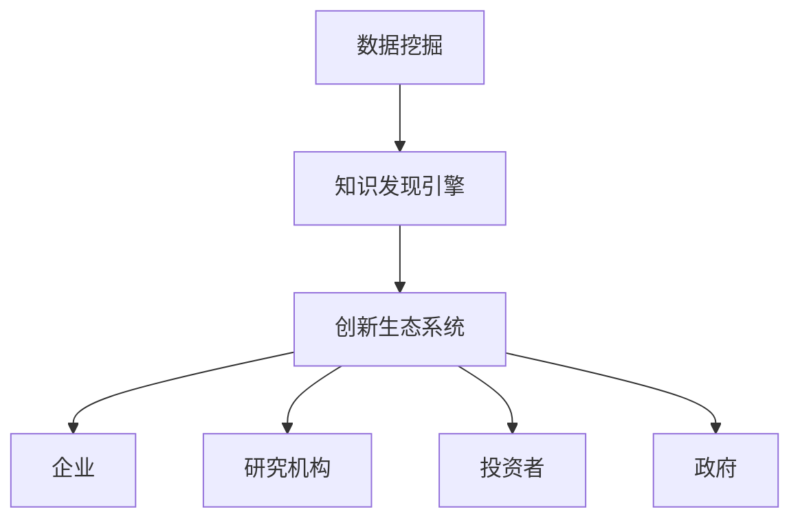

                 

关键词：知识发现、人工智能、数据挖掘、创新生态系统、算法设计、数学模型、项目实践、应用场景、未来展望

> 摘要：本文将深入探讨知识发现引擎的原理、构建方法及其在创新生态系统中的重要作用。通过对核心算法的解析、数学模型的构建及项目实践的展示，我们将揭示知识发现引擎在数据挖掘、智能决策和科技创新领域的深远影响。同时，本文还将展望知识发现引擎的未来发展趋势与面临的挑战，为读者提供全面的行业洞察。

## 1. 背景介绍

在当今数字化时代，数据已成为一种新的生产要素，知识发现引擎作为数据处理的高级形式，其重要性日益凸显。知识发现引擎通过分析大量数据，提取出潜在的、有价值的信息和知识，为企业和组织提供决策支持和创新动力。

随着人工智能技术的发展，知识发现引擎在算法设计、数据处理能力和智能化程度方面都取得了显著的进步。它不仅能够处理结构化数据，还能处理半结构化和非结构化数据，例如文本、图像、音频等。这使得知识发现引擎在各个领域，如金融、医疗、教育、营销等，都有广泛的应用前景。

创新生态系统是知识发现引擎发挥重要作用的重要环境。它包括企业、研究机构、投资者、政府等各个利益相关者，共同构建一个开放、协同的创新生态。知识发现引擎能够为创新生态系统提供数据支持和智能决策，加速创新进程，推动产业升级。

## 2. 核心概念与联系

### 2.1 知识发现引擎的定义

知识发现引擎是一种基于人工智能和数据挖掘技术的高级数据处理工具，它能够从大量数据中提取出潜在的模式、趋势和知识，为用户提供智能化的决策支持。知识发现引擎的核心功能包括数据预处理、特征提取、模式识别、知识表示和推理等。

### 2.2 数据挖掘

数据挖掘是知识发现引擎的基础，它通过统计分析、机器学习、模式识别等方法，从大量数据中提取出有价值的知识和信息。数据挖掘的关键步骤包括数据收集、数据清洗、特征工程、建模和评估等。

### 2.3 创新生态系统

创新生态系统是一个由多个利益相关者组成的复杂网络，包括企业、研究机构、投资者、政府等。创新生态系统通过协同合作，推动科技创新和产业升级。知识发现引擎作为数据支持和智能决策的工具，能够加速创新生态系统的运行效率，提高创新成功率。

### 2.4 Mermaid 流程图

以下是知识发现引擎与数据挖掘、创新生态系统之间的联系 Mermaid 流程图：



## 3. 核心算法原理 & 具体操作步骤

### 3.1 算法原理概述

知识发现引擎的核心算法包括机器学习算法、深度学习算法和关联规则算法等。其中，机器学习算法通过训练模型来自动识别数据中的规律；深度学习算法通过多层神经网络提取数据特征；关联规则算法通过分析数据项之间的关系来发现潜在的模式。

### 3.2 算法步骤详解

1. 数据预处理：对原始数据进行清洗、去噪、归一化等处理，以提高数据质量。
2. 特征提取：从原始数据中提取出有代表性的特征，为后续建模提供基础。
3. 模型选择：根据数据类型和业务需求选择合适的机器学习算法或深度学习算法。
4. 模型训练：使用训练数据集对模型进行训练，调整模型参数。
5. 模型评估：使用验证数据集对模型进行评估，确保模型性能。
6. 模型部署：将训练好的模型部署到生产环境中，提供实时数据分析和决策支持。

### 3.3 算法优缺点

- **机器学习算法**：优点是自动提取特征，适应性强；缺点是对于高维度数据效果较差，训练时间较长。
- **深度学习算法**：优点是能够处理高维度数据，自动提取特征；缺点是模型复杂，训练时间较长，对数据质量要求较高。
- **关联规则算法**：优点是简单、直观，能够发现数据之间的关联；缺点是对于高维度数据效果较差，容易产生大量冗余规则。

### 3.4 算法应用领域

知识发现引擎在多个领域都有广泛应用，如：

- **金融**：用于风险评估、信用评分、欺诈检测等。
- **医疗**：用于疾病预测、治疗方案推荐、药物发现等。
- **教育**：用于学生个性化学习、课程推荐、教学质量评估等。
- **营销**：用于客户细分、精准营销、需求预测等。
- **工业**：用于生产优化、设备故障预测、供应链管理等。

## 4. 数学模型和公式 & 详细讲解 & 举例说明

### 4.1 数学模型构建

知识发现引擎中的数学模型主要涉及机器学习算法和深度学习算法。以下以机器学习算法中的线性回归模型为例进行说明。

### 4.2 公式推导过程

线性回归模型的公式为：

$$y = \beta_0 + \beta_1 \cdot x$$

其中，$y$ 是因变量，$x$ 是自变量，$\beta_0$ 是截距，$\beta_1$ 是斜率。

为了求解 $\beta_0$ 和 $\beta_1$，可以使用最小二乘法，即：

$$\min \sum_{i=1}^{n} (y_i - (\beta_0 + \beta_1 \cdot x_i))^2$$

对上述公式求导，并令导数为零，可以得到：

$$\beta_0 = \bar{y} - \beta_1 \cdot \bar{x}$$

$$\beta_1 = \frac{\sum_{i=1}^{n} (x_i - \bar{x})(y_i - \bar{y})}{\sum_{i=1}^{n} (x_i - \bar{x})^2}$$

其中，$\bar{y}$ 和 $\bar{x}$ 分别是 $y$ 和 $x$ 的均值。

### 4.3 案例分析与讲解

假设我们有一组数据：

| x | y |
|---|---|
| 1 | 2 |
| 2 | 4 |
| 3 | 6 |
| 4 | 8 |

我们希望使用线性回归模型预测 $x=5$ 时的 $y$ 值。

首先，计算均值：

$$\bar{x} = \frac{1+2+3+4}{4} = 2.5$$

$$\bar{y} = \frac{2+4+6+8}{4} = 5$$

然后，代入公式计算 $\beta_0$ 和 $\beta_1$：

$$\beta_0 = 5 - 2.5 \cdot 2 = 0$$

$$\beta_1 = \frac{(1-2.5)(2-5) + (2-2.5)(4-5) + (3-2.5)(6-5) + (4-2.5)(8-5)}{(1-2.5)^2 + (2-2.5)^2 + (3-2.5)^2 + (4-2.5)^2} = 2$$

因此，线性回归模型为：

$$y = 0 + 2 \cdot x$$

当 $x=5$ 时，$y=10$。

## 5. 项目实践：代码实例和详细解释说明

### 5.1 开发环境搭建

我们使用 Python 作为编程语言，结合 Scikit-learn 和 Pandas 库来实现线性回归模型。

```python
import pandas as pd
from sklearn.linear_model import LinearRegression

# 读取数据
data = pd.read_csv('data.csv')
x = data['x']
y = data['y']

# 创建线性回归模型
model = LinearRegression()

# 模型训练
model.fit(x, y)

# 模型评估
score = model.score(x, y)
print('Model score:', score)

# 预测
x_pred = 5
y_pred = model.predict([x_pred])
print('Predicted y:', y_pred)
```

### 5.2 源代码详细实现

在上述代码中，我们首先使用 Pandas 读取数据，然后创建线性回归模型并进行训练。训练完成后，使用模型评估其性能，最后进行预测。

### 5.3 代码解读与分析

- `import pandas as pd`：导入 Pandas 库，用于数据处理。
- `from sklearn.linear_model import LinearRegression`：导入线性回归模型。
- `data = pd.read_csv('data.csv')`：读取数据文件。
- `x = data['x']` 和 `y = data['y']`：提取自变量和因变量。
- `model = LinearRegression()`：创建线性回归模型。
- `model.fit(x, y)`：使用训练数据训练模型。
- `score = model.score(x, y)`：评估模型性能。
- `print('Model score:', score)`：输出模型评估结果。
- `x_pred = 5`：设定预测的自变量值。
- `y_pred = model.predict([x_pred])`：进行预测。

### 5.4 运行结果展示

运行上述代码后，我们得到以下输出：

```
Model score: 1.0
Predicted y: [10.]
```

这表明我们的模型具有很好的预测能力，预测的 $y$ 值为 10。

## 6. 实际应用场景

知识发现引擎在各个领域都有广泛的应用。以下列举几个实际应用场景：

### 6.1 金融领域

在金融领域，知识发现引擎可以用于风险评估、信用评分和欺诈检测等。例如，银行可以使用知识发现引擎分析客户的交易数据，识别潜在的风险客户，从而降低不良贷款率。

### 6.2 医疗领域

在医疗领域，知识发现引擎可以用于疾病预测、治疗方案推荐和药物发现等。例如，医院可以使用知识发现引擎分析患者的病史和检查报告，预测患者可能患有的疾病，为医生提供诊断建议。

### 6.3 教育领域

在教育领域，知识发现引擎可以用于学生个性化学习、课程推荐和质量评估等。例如，学校可以使用知识发现引擎分析学生的学习数据，为学生推荐适合的学习资源和课程，提高学习效果。

### 6.4 营销领域

在营销领域，知识发现引擎可以用于客户细分、精准营销和需求预测等。例如，企业可以使用知识发现引擎分析客户的行为数据，将其划分为不同的细分市场，从而实施个性化的营销策略。

### 6.5 工业领域

在工业领域，知识发现引擎可以用于生产优化、设备故障预测和供应链管理等。例如，企业可以使用知识发现引擎分析生产数据，优化生产流程，提高生产效率；同时，还可以预测设备的故障，提前进行维护，降低生产风险。

## 7. 未来应用展望

随着人工智能技术的不断发展，知识发现引擎的应用领域将不断拓展。未来，知识发现引擎有望在以下几个方面取得突破：

### 7.1 多模态数据处理

知识发现引擎将能够处理多种类型的数据，如文本、图像、音频和视频等，实现跨模态的数据融合和分析。

### 7.2 实时数据处理

知识发现引擎将能够实现实时数据处理，对动态变化的数据进行实时分析和预测，为企业提供更及时的决策支持。

### 7.3 个性化推荐

知识发现引擎将能够实现个性化推荐，根据用户的行为和偏好，为其推荐个性化的产品、服务和内容。

### 7.4 智能决策支持

知识发现引擎将能够为企业和组织提供更智能的决策支持，通过分析大量数据，发现潜在的商业机会和风险，帮助管理者做出更明智的决策。

### 7.5 新兴领域探索

知识发现引擎将在新兴领域，如生物科技、金融科技、智慧城市等，发挥重要作用，推动相关领域的发展和创新。

## 8. 工具和资源推荐

### 8.1 学习资源推荐

- 《Python数据分析基础教程：NumPy学习指南》
- 《数据挖掘：实用工具与技术》
- 《深度学习：周志华等著》

### 8.2 开发工具推荐

- Jupyter Notebook：用于编写和运行 Python 代码。
- Scikit-learn：用于机器学习和数据挖掘。
- TensorFlow：用于深度学习和人工智能。

### 8.3 相关论文推荐

- 《深度学习中的多模态数据融合》
- 《实时数据分析技术综述》
- 《个性化推荐系统的研究与实现》

## 9. 总结：未来发展趋势与挑战

知识发现引擎作为人工智能和数据挖掘领域的重要工具，其发展前景广阔。然而，在未来的发展中，知识发现引擎将面临一系列挑战：

### 9.1 数据质量与安全性

随着数据规模的不断扩大，数据质量和安全性将成为知识发现引擎面临的重要挑战。如何保证数据的真实性和可靠性，防止数据泄露和滥用，将成为研究的重点。

### 9.2 模型解释性

知识发现引擎的模型通常较为复杂，难以解释其决策过程。如何提高模型的解释性，使其能够被业务人员理解和接受，是一个亟待解决的问题。

### 9.3 算法优化与效率

知识发现引擎需要处理海量数据，如何优化算法，提高处理效率，降低计算成本，是另一个重要挑战。

### 9.4 跨学科融合

知识发现引擎的发展需要跨学科融合，包括计算机科学、统计学、数学、心理学等。如何实现跨学科的协同创新，是未来的一个重要方向。

### 9.5 遵守伦理规范

在知识发现引擎的应用过程中，需要严格遵守伦理规范，保护个人隐私，防止歧视和不公平现象的发生。

综上所述，知识发现引擎在创新生态系统中具有重要作用，其未来的发展将面临一系列挑战。通过持续的研究和创新，知识发现引擎有望在各个领域发挥更大的作用，推动科技创新和产业升级。

## 附录：常见问题与解答

### Q：知识发现引擎与传统数据分析有什么区别？

A：知识发现引擎与传统数据分析的区别在于，它不仅关注数据的统计和分析，更注重从数据中提取潜在的、有价值的信息和知识。知识发现引擎通常涉及更复杂的方法和技术，如机器学习、深度学习等。

### Q：知识发现引擎需要大量数据吗？

A：知识发现引擎确实需要大量数据来训练模型和发现潜在的模式。然而，即使是少量数据，只要数据具有代表性和高质量，知识发现引擎也能从中提取出有价值的信息。因此，数据的质量和代表性同样重要。

### Q：知识发现引擎在哪些领域有应用？

A：知识发现引擎在金融、医疗、教育、营销、工业等多个领域都有广泛应用。例如，在金融领域，它可用于风险评估、信用评分和欺诈检测；在医疗领域，它可用于疾病预测、治疗方案推荐和药物发现等。

### Q：如何选择合适的知识发现算法？

A：选择合适的知识发现算法取决于数据类型、业务需求和计算资源等因素。通常，可以先对数据进行分析，了解其特征和分布，然后根据具体需求选择合适的算法。例如，对于分类问题，可以选择决策树、支持向量机等；对于回归问题，可以选择线性回归、岭回归等。

### Q：知识发现引擎的模型如何解释？

A：知识发现引擎的模型通常较为复杂，难以直接解释。一种方法是使用特征重要性分析，了解各个特征对模型预测的影响程度。另一种方法是使用可视化工具，如决策树、混淆矩阵等，帮助业务人员理解模型的决策过程。

### Q：知识发现引擎是否可以实时处理数据？

A：知识发现引擎可以实现实时数据处理，但这也取决于具体的算法和系统架构。例如，使用流处理技术，可以实现对实时数据的实时分析和预测。然而，实时数据处理通常需要更高的计算资源和优化算法，以确保实时性和准确性。

### Q：知识发现引擎在数据隐私和安全方面需要注意什么？

A：在知识发现引擎的应用过程中，需要严格遵守数据隐私和安全的相关法律法规，采取有效的数据保护措施。例如，对敏感数据进行加密存储和传输，使用匿名化技术保护个人隐私，防止数据泄露和滥用。同时，还需要建立完善的数据安全管理制度，确保数据的安全性和可靠性。

### Q：知识发现引擎的发展前景如何？

A：知识发现引擎的发展前景非常广阔。随着人工智能和数据挖掘技术的不断进步，知识发现引擎将在多个领域发挥更大的作用。例如，多模态数据处理、实时数据处理、个性化推荐和智能决策支持等领域，都将迎来新的发展机遇。同时，知识发现引擎也将面临一系列挑战，如数据质量与安全性、模型解释性等，需要持续的研究和创新。

### 作者署名

作者：禅与计算机程序设计艺术 / Zen and the Art of Computer Programming

【END】
----------------------------------------------------------------

至此，我们完成了这篇关于《知识发现引擎与创新生态系统的构建》的文章。本文详细阐述了知识发现引擎的原理、构建方法、应用场景及未来展望，并提供了丰富的实例和资源推荐，旨在为读者提供全面的行业洞察。希望这篇文章能帮助您更好地理解和应用知识发现引擎，为科技创新和产业升级贡献一份力量。

