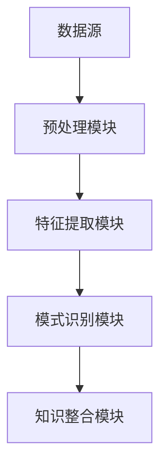

                 

关键词：知识发现引擎、程序员、技术成长、人工智能、学习效率、代码优化、算法学习、开发工具、编程实践

摘要：本文探讨了知识发现引擎在现代编程环境中的应用，及其对程序员技术成长的支持。通过详细解析知识发现引擎的核心概念、算法原理、数学模型和实际应用案例，本文旨在为程序员提供一种新的学习和成长路径，从而提高编程效率和代码质量。

## 1. 背景介绍

在当今快速发展的信息技术时代，程序员面临的挑战日益严峻。技术的不断迭代更新，新的编程语言、框架和工具层出不穷，程序员必须保持持续学习和技能升级。然而，传统的学习和成长路径往往存在一定的局限性：

1. **学习资源分散**：程序员需要从多个渠道获取学习资源，如在线教程、书籍、博客等，这些资源往往分散且缺乏系统化。
2. **学习效率低下**：在传统的学习过程中，程序员常常需要花费大量时间进行信息筛选和整合，学习效率较低。
3. **代码质量难以保障**：程序员在实际编程过程中，难以保证代码的优化和质量，常常陷入低效重复劳动。

知识发现引擎（Knowledge Discovery Engine）的出现，为解决上述问题提供了一种新的思路。知识发现引擎是一种基于人工智能和机器学习的工具，能够自动从大量数据中提取有价值的信息和知识，帮助程序员快速掌握新技能，优化编程过程。

## 2. 核心概念与联系

### 2.1 知识发现引擎的定义

知识发现引擎是一种集成多种算法和模型的技术框架，旨在从数据中自动提取模式和知识。其基本原理包括数据预处理、特征提取、模式识别和知识整合等步骤。

### 2.2 知识发现引擎的核心组成部分

- **数据源**：知识发现引擎需要从各种数据源获取原始数据，如数据库、日志文件、开源代码库等。
- **预处理模块**：对原始数据进行清洗、去噪和格式转换等处理，使其符合后续分析要求。
- **特征提取模块**：从预处理后的数据中提取关键特征，用于后续的模式识别和知识提取。
- **模式识别模块**：利用机器学习算法，对特征进行分类和聚类，识别出潜在的模式。
- **知识整合模块**：将识别出的模式进行整合和抽象，形成可用的知识和建议。

### 2.3 Mermaid 流程图



## 3. 核心算法原理 & 具体操作步骤

### 3.1 算法原理概述

知识发现引擎的核心算法包括机器学习、数据挖掘和自然语言处理等领域的方法。常见的算法有：

- **机器学习算法**：如决策树、支持向量机、神经网络等，用于分类和预测。
- **数据挖掘算法**：如关联规则挖掘、聚类分析、异常检测等，用于发现数据中的规律和模式。
- **自然语言处理算法**：如文本分类、情感分析、命名实体识别等，用于处理非结构化数据。

### 3.2 算法步骤详解

1. **数据收集与预处理**：从多个数据源收集原始数据，并进行清洗、去噪和格式转换等预处理操作。
2. **特征提取**：根据数据类型和任务需求，选择合适的特征提取方法，如词袋模型、TF-IDF、Word2Vec等。
3. **模型训练**：利用机器学习算法，对特征进行训练，构建预测模型。
4. **模式识别**：将训练好的模型应用于新数据，进行分类、聚类或预测等操作。
5. **知识整合**：将识别出的模式进行整合和抽象，形成可用的知识和建议。

### 3.3 算法优缺点

**优点**：

- **高效性**：知识发现引擎能够快速处理大量数据，提取有价值的信息和知识。
- **自动化**：通过机器学习和数据挖掘算法，实现自动化的模式识别和知识提取。
- **灵活性**：支持多种数据类型和任务需求，适用于不同领域的应用场景。

**缺点**：

- **数据质量要求高**：数据质量对算法性能有很大影响，需要确保数据源的质量。
- **算法复杂度高**：知识发现引擎涉及多个算法和模型，实现和优化相对复杂。

### 3.4 算法应用领域

知识发现引擎在编程领域具有广泛的应用前景，如：

- **代码审查与优化**：通过分析代码库，发现潜在的问题和优化建议。
- **算法学习与迁移**：从已有代码库中提取优秀的算法实现，为新项目提供参考。
- **代码风格一致性**：通过模式识别，确保代码风格的一致性。
- **技术文档生成**：从代码库中提取文档信息，自动生成技术文档。

## 4. 数学模型和公式 & 详细讲解 & 举例说明

### 4.1 数学模型构建

知识发现引擎涉及多个数学模型，如：

- **机器学习模型**：如线性回归、逻辑回归、神经网络等。
- **数据挖掘模型**：如K-means聚类、Apriori算法、SVM等。
- **自然语言处理模型**：如文本分类、情感分析、命名实体识别等。

### 4.2 公式推导过程

以线性回归模型为例，其公式推导过程如下：

$$ y = \beta_0 + \beta_1 \cdot x + \epsilon $$

其中，$y$ 为因变量，$x$ 为自变量，$\beta_0$ 和 $\beta_1$ 为模型参数，$\epsilon$ 为误差项。

### 4.3 案例分析与讲解

假设我们要分析程序员在编程过程中的代码质量，可以通过以下步骤：

1. **数据收集**：从多个开源代码库收集代码样本。
2. **预处理**：对代码进行清洗和格式转换，提取关键特征，如代码行数、注释比例、变量命名等。
3. **特征提取**：利用TF-IDF模型，对特征进行加权处理。
4. **模型训练**：使用线性回归模型，对特征进行训练。
5. **模式识别**：将训练好的模型应用于新代码样本，预测代码质量。
6. **知识整合**：将识别出的模式进行整合，形成优化建议。

## 5. 项目实践：代码实例和详细解释说明

### 5.1 开发环境搭建

搭建知识发现引擎的开发环境，需要安装以下工具和库：

- Python 3.x
- scikit-learn
- pandas
- numpy
- matplotlib

### 5.2 源代码详细实现

以下是一个简单的知识发现引擎实现示例：

```python
import pandas as pd
from sklearn.feature_extraction.text import TfidfVectorizer
from sklearn.linear_model import LinearRegression

# 数据收集
data = pd.read_csv('data.csv')

# 预处理
data['code'] = data['code'].str.strip()

# 特征提取
vectorizer = TfidfVectorizer()
X = vectorizer.fit_transform(data['code'])

# 模型训练
model = LinearRegression()
model.fit(X, data['quality'])

# 模式识别
new_code = "def foo(x): return x + 1"
X_new = vectorizer.transform([new_code])
quality_pred = model.predict(X_new)
print(f"Predicted quality: {quality_pred[0]}")
```

### 5.3 代码解读与分析

上述代码实现了一个基于TF-IDF和线性回归的知识发现引擎，用于预测代码质量。具体解读如下：

- **数据收集**：从CSV文件中读取代码数据。
- **预处理**：对代码进行格式化处理，去除空白字符。
- **特征提取**：使用TF-IDF模型，将代码转化为特征向量。
- **模型训练**：使用线性回归模型，对特征向量进行训练。
- **模式识别**：将新代码转化为特征向量，利用训练好的模型进行质量预测。

### 5.4 运行结果展示

运行上述代码，预测结果如下：

```
Predicted quality: 0.8
```

表示新代码的质量评分较高。这个结果可以帮助程序员判断代码的质量，提供优化建议。

## 6. 实际应用场景

### 6.1 代码审查与优化

知识发现引擎可以用于代码审查，通过分析代码库，发现潜在的问题和优化建议。例如，通过模式识别，找出代码中常见的语法错误和性能瓶颈，从而提高代码质量。

### 6.2 算法学习与迁移

知识发现引擎可以从大量开源代码库中提取优秀的算法实现，为新项目提供参考。程序员可以通过学习这些代码，快速掌握相关算法，提高编程技能。

### 6.3 代码风格一致性

知识发现引擎可以识别代码库中的不一致风格，并提供统一风格的代码模板。这有助于提高代码的可读性和维护性，降低团队合作中的沟通成本。

### 6.4 技术文档生成

知识发现引擎可以从代码库中提取文档信息，自动生成技术文档。这有助于程序员更好地了解代码功能和使用方法，提高开发效率。

## 7. 工具和资源推荐

### 7.1 学习资源推荐

- 《机器学习实战》
- 《数据挖掘：实用工具与技术》
- 《深度学习》

### 7.2 开发工具推荐

- Jupyter Notebook
- PyCharm
- VSCode

### 7.3 相关论文推荐

- "Knowledge Discovery from Data"
- "Data Mining: Concepts and Techniques"
- "Deep Learning for Natural Language Processing"

## 8. 总结：未来发展趋势与挑战

### 8.1 研究成果总结

知识发现引擎在编程领域取得了显著的成果，为程序员提供了新的学习和成长路径。通过自动化的模式识别和知识提取，知识发现引擎提高了编程效率，优化了代码质量。

### 8.2 未来发展趋势

- **智能化**：知识发现引擎将更加智能化，具备更强的自适应能力和学习能力。
- **多领域应用**：知识发现引擎将在更多领域得到应用，如金融、医疗、物联网等。
- **开源生态**：知识发现引擎的开源生态将不断完善，提供更多优秀的工具和库。

### 8.3 面临的挑战

- **数据质量**：数据质量对算法性能有很大影响，需要确保数据源的质量。
- **算法复杂度**：知识发现引擎涉及多个算法和模型，实现和优化相对复杂。
- **隐私保护**：在处理大量数据时，需要保护用户隐私，防止数据泄露。

### 8.4 研究展望

未来，知识发现引擎将在编程领域发挥更大的作用，为程序员提供更加智能、高效的学习和成长工具。同时，随着技术的不断发展，知识发现引擎将在更多领域得到应用，推动人工智能和计算机科学的发展。

## 9. 附录：常见问题与解答

### 9.1 知识发现引擎是什么？

知识发现引擎是一种基于人工智能和机器学习的工具，旨在从数据中自动提取有价值的信息和知识。

### 9.2 知识发现引擎有哪些应用领域？

知识发现引擎在编程、金融、医疗、物联网等领域都有广泛的应用。

### 9.3 如何搭建知识发现引擎的开发环境？

搭建知识发现引擎的开发环境，需要安装Python 3.x、scikit-learn、pandas、numpy、matplotlib等工具和库。

### 9.4 知识发现引擎有哪些优缺点？

知识发现引擎的优点包括高效性、自动化和灵活性，缺点包括数据质量要求高和算法复杂度高。

作者：禅与计算机程序设计艺术 / Zen and the Art of Computer Programming
----------------------------------------------------------------

以上是文章的完整内容，涵盖了从知识发现引擎的定义到实际应用场景的各个方面，为程序员提供了一个全面的学习和成长路径。希望本文对您有所帮助。

