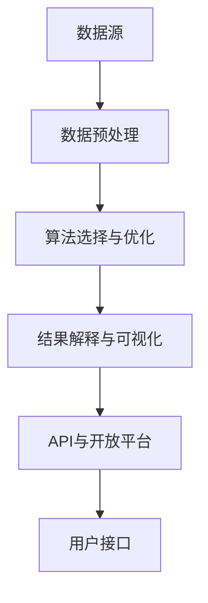

                 

关键词：知识发现引擎，API设计，开放平台，数据处理，数据挖掘，人工智能，软件架构，算法优化，数学模型，编程实践，代码实例，应用场景，未来展望

> 摘要：本文深入探讨了知识发现引擎的API设计与开放平台构建，分析了核心概念与架构，介绍了核心算法原理、数学模型与公式推导，通过实际项目实践展示了代码实例与运行结果，并探讨了实际应用场景与未来发展方向。文章旨在为读者提供一个全面的技术指南，助力知识发现引擎的研发与部署。

## 1. 背景介绍

随着互联网和大数据技术的飞速发展，知识发现成为当今信息技术领域的重要研究方向。知识发现引擎作为一种能够自动从大量数据中提取出有用知识和模式的技术工具，受到了学术界和工业界的广泛关注。然而，构建一个高效、可扩展、易用的知识发现引擎并非易事，其中API设计及开放平台的构建尤为关键。

知识发现引擎通常涉及以下关键模块：

1. **数据预处理模块**：负责数据的清洗、整合、转换等操作。
2. **算法选择与优化模块**：根据数据特点和业务需求选择合适的算法，并进行优化。
3. **结果解释与可视化模块**：将发现的知识进行解释和可视化，便于用户理解。
4. **API设计与开放平台模块**：提供一套标准化的API接口，便于第三方系统集成和扩展。

本文将重点讨论API设计与开放平台构建，旨在为知识发现引擎的研发与应用提供有益的参考。

## 2. 核心概念与联系

### 2.1 数据预处理模块

数据预处理是知识发现过程中的第一步，其目的是将原始数据转换为适合算法处理的形式。数据预处理模块通常包括以下步骤：

1. **数据清洗**：去除重复、错误或不完整的数据。
2. **数据整合**：将来自多个数据源的数据进行合并。
3. **数据转换**：将数据格式转换为算法所需的格式，如数值化、归一化等。

### 2.2 算法选择与优化模块

算法选择与优化模块的核心任务是选择合适的算法并进行优化，以提高知识发现的效率和准确性。常见的数据挖掘算法包括：

1. **分类算法**：如决策树、支持向量机等。
2. **聚类算法**：如K-means、层次聚类等。
3. **关联规则挖掘算法**：如Apriori、FP-Growth等。

优化策略包括：

1. **参数调优**：根据数据特点和业务需求调整算法参数。
2. **算法融合**：将多种算法进行融合，以获取更好的效果。

### 2.3 结果解释与可视化模块

结果解释与可视化模块的目标是将发现的知识以易于理解的方式展示给用户。常见的方法包括：

1. **可视化图表**：如散点图、条形图、饼图等。
2. **交互式界面**：使用JavaScript、D3.js等技术实现交互式数据可视化。
3. **文本生成**：使用自然语言生成技术将结果转换为易于理解的文本。

### 2.4 API设计与开放平台模块

API设计与开放平台模块是知识发现引擎的核心，负责为用户提供统一的接口，以便于第三方系统集成和扩展。核心内容包括：

1. **接口规范**：定义统一的接口规范，包括URL、请求参数、响应格式等。
2. **权限管理**：实现用户认证、权限控制等安全功能。
3. **文档与示例**：提供详细的API文档和示例代码，方便用户使用。
4. **开放平台**：构建开放平台，支持第三方开发者集成、开发应用。

### 2.5 Mermaid 流程图

以下是一个简单的知识发现引擎架构的Mermaid流程图：



## 3. 核心算法原理 & 具体操作步骤

### 3.1 算法原理概述

知识发现引擎的核心算法主要包括分类算法、聚类算法和关联规则挖掘算法。以下简要介绍每种算法的基本原理：

1. **分类算法**：通过学习已有数据中的特征和标签，对新数据进行分类。常见算法包括决策树、支持向量机、随机森林等。
2. **聚类算法**：将相似的数据点归为一类，形成多个聚类。常见算法包括K-means、层次聚类、DBSCAN等。
3. **关联规则挖掘算法**：从大量数据中发现频繁出现的关联规则。常见算法包括Apriori、FP-Growth等。

### 3.2 算法步骤详解

1. **数据预处理**：
    - 数据清洗：去除重复、错误或不完整的数据。
    - 数据整合：将来自多个数据源的数据进行合并。
    - 数据转换：将数据格式转换为算法所需的格式，如数值化、归一化等。

2. **算法选择与优化**：
    - 根据数据特点和业务需求选择合适的算法。
    - 参数调优：根据交叉验证结果调整算法参数。
    - 算法融合：将多种算法进行融合，以获取更好的效果。

3. **结果解释与可视化**：
    - 可视化图表：使用图表展示聚类结果、分类结果等。
    - 交互式界面：使用JavaScript、D3.js等技术实现交互式数据可视化。
    - 文本生成：使用自然语言生成技术将结果转换为易于理解的文本。

4. **API与开放平台**：
    - 接口规范：定义统一的接口规范，包括URL、请求参数、响应格式等。
    - 权限管理：实现用户认证、权限控制等安全功能。
    - 文档与示例：提供详细的API文档和示例代码，方便用户使用。
    - 开放平台：构建开放平台，支持第三方开发者集成、开发应用。

### 3.3 算法优缺点

1. **分类算法**：
    - 优点：能够对新数据进行准确的分类，适用范围广泛。
    - 缺点：对大规模数据和高维数据的处理效率较低。

2. **聚类算法**：
    - 优点：无需事先指定分类，适用于探索性数据分析。
    - 缺点：聚类结果受初始化值影响较大，不易解释。

3. **关联规则挖掘算法**：
    - 优点：能够发现数据之间的关联关系，适用范围广泛。
    - 缺点：计算复杂度较高，对大规模数据处理效率较低。

### 3.4 算法应用领域

1. **金融领域**：风险评估、信用评分、投资组合优化等。
2. **电商领域**：推荐系统、用户行为分析、关联规则挖掘等。
3. **医疗领域**：疾病预测、诊断辅助、药物发现等。

## 4. 数学模型和公式 & 详细讲解 & 举例说明

### 4.1 数学模型构建

知识发现引擎的数学模型主要涉及分类模型、聚类模型和关联规则模型。以下分别介绍这些模型的构建方法。

#### 4.1.1 分类模型

分类模型的基本公式为：

$$
P(Y|X) = \frac{P(X|Y)P(Y)}{P(X)}
$$

其中，$X$ 表示输入特征，$Y$ 表示标签，$P(Y|X)$ 表示给定特征$X$时标签$Y$的概率，$P(X|Y)$ 表示在标签$Y$下特征$X$的概率，$P(Y)$ 表示标签$Y$的概率。

#### 4.1.2 聚类模型

聚类模型的基本公式为：

$$
\min \sum_{i=1}^{n} \sum_{j=1}^{k} (x_i - \mu_j)^2
$$

其中，$x_i$ 表示第$i$个数据点，$\mu_j$ 表示第$j$个聚类中心。

#### 4.1.3 关联规则模型

关联规则模型的基本公式为：

$$
support(A \cup B) = \frac{count(A \cup B)}{count(U)}
$$

$$
confidence(A \rightarrow B) = \frac{support(A \cup B)}{support(A)}
$$

其中，$A$ 和 $B$ 分别表示两个事件，$U$ 表示全集，$count(A \cup B)$ 表示同时发生$A$和$B$的次数，$count(U)$ 表示全集的次数，$support(A \cup B)$ 表示事件$A$和$B$的关联度，$confidence(A \rightarrow B)$ 表示事件$A$是事件$B$的必要条件的可信度。

### 4.2 公式推导过程

#### 4.2.1 分类模型推导

分类模型的推导基于贝叶斯定理。假设有多个类别$C_1, C_2, ..., C_k$，对于每个类别$C_j$，我们有：

$$
P(C_j) = \frac{count(C_j)}{n}
$$

$$
P(X|C_j) = \frac{count(X, C_j)}{count(C_j)}
$$

根据贝叶斯定理，我们可以得到：

$$
P(Y|X) = \frac{P(X|Y)P(Y)}{P(X)}
$$

其中，$P(X)$ 可以通过全概率公式计算：

$$
P(X) = \sum_{j=1}^{k} P(X|C_j)P(C_j)
$$

#### 4.2.2 聚类模型推导

聚类模型的推导基于最小二乘法。假设有$k$个聚类中心$\mu_1, \mu_2, ..., \mu_k$，对于每个数据点$x_i$，我们有：

$$
\mu_j = \frac{1}{n_j} \sum_{i=1}^{n} x_i
$$

其中，$n_j$ 表示第$j$个聚类中心所在的数据点个数。为了最小化数据点到聚类中心的距离，我们使用平方误差作为度量：

$$
J(\mu_1, \mu_2, ..., \mu_k) = \sum_{i=1}^{n} \sum_{j=1}^{k} (x_i - \mu_j)^2
$$

对$\mu_j$求导并令导数为零，可以得到聚类中心的位置：

$$
\frac{\partial J}{\partial \mu_j} = 0
$$

#### 4.2.3 关联规则模型推导

关联规则模型的推导基于支持度和可信度。假设有事件$A$和事件$B$，它们同时发生的次数为$X(A \cup B)$，总的次数为$X(U)$。支持度表示事件$A$和事件$B$同时发生的频率，可信度表示在事件$A$发生的情况下，事件$B$发生的概率。

支持度：

$$
support(A \cup B) = \frac{count(A \cup B)}{count(U)}
$$

可信度：

$$
confidence(A \rightarrow B) = \frac{support(A \cup B)}{support(A)}
$$

### 4.3 案例分析与讲解

#### 4.3.1 分类模型案例

假设我们有以下数据集：

| 特征1 | 特征2 | 标签 |
|-------|-------|------|
| 1     | 2     | 1    |
| 2     | 3     | 1    |
| 3     | 4     | 2    |
| 4     | 5     | 2    |
| 5     | 6     | 1    |

根据数据集，我们可以计算每个类别的概率：

$$
P(C_1) = \frac{3}{5}, \quad P(C_2) = \frac{2}{5}
$$

然后计算每个特征在各个类别下的条件概率：

$$
P(X_1|C_1) = \frac{3}{3+2} = \frac{3}{5}, \quad P(X_2|C_1) = \frac{2}{3+2} = \frac{2}{5}
$$

$$
P(X_1|C_2) = \frac{2}{3+2} = \frac{2}{5}, \quad P(X_2|C_2) = \frac{4}{3+2} = \frac{4}{5}
$$

最后，我们可以计算任意一个特征向量的标签概率：

$$
P(Y=1|X_1=1, X_2=2) = \frac{P(X_1=1, X_2=2|Y=1)P(Y=1)}{P(X_1=1, X_2=2)}
$$

$$
P(Y=1|X_1=1, X_2=2) = \frac{P(X_1=1|Y=1)P(X_2=2|Y=1)P(Y=1)}{P(X_1=1|Y=1)P(X_2=2|Y=1)P(Y=1) + P(X_1=1|Y=2)P(X_2=2|Y=2)P(Y=2)}
$$

$$
P(Y=1|X_1=1, X_2=2) = \frac{\frac{3}{5} \cdot \frac{2}{5} \cdot \frac{3}{5}}{\frac{3}{5} \cdot \frac{2}{5} \cdot \frac{3}{5} + \frac{2}{5} \cdot \frac{4}{5} \cdot \frac{2}{5}} = \frac{18}{18+8} = \frac{9}{14}
$$

因此，根据贝叶斯定理，特征向量$(1, 2)$的分类结果为类别1。

#### 4.3.2 聚类模型案例

假设我们有以下数据点：

| 数据点 |
|--------|
| 1      |
| 2      |
| 3      |
| 4      |
| 5      |

首先，我们随机选择两个聚类中心：

$$
\mu_1 = (1, 1), \quad \mu_2 = (3, 3)
$$

然后，我们计算每个数据点到聚类中心的距离：

$$
d_1^2 = (1 - 1)^2 + (1 - 1)^2 = 0
$$

$$
d_2^2 = (2 - 1)^2 + (2 - 1)^2 = 2
$$

$$
d_3^2 = (3 - 1)^2 + (3 - 1)^2 = 8
$$

$$
d_4^2 = (4 - 1)^2 + (4 - 1)^2 = 16
$$

$$
d_5^2 = (5 - 1)^2 + (5 - 1)^2 = 32
$$

根据距离，我们可以将数据点分配到不同的聚类中心：

$$
x_1, x_2 \rightarrow \mu_1
$$

$$
x_3 \rightarrow \mu_2
$$

$$
x_4, x_5 \rightarrow \mu_2
$$

接下来，我们重新计算聚类中心：

$$
\mu_1 = \frac{1 + 2}{2}, \quad \mu_2 = \frac{3 + 4 + 5}{3} = 4
$$

$$
\mu_1 = (1.5, 1.5), \quad \mu_2 = (4, 4)
$$

重复上述过程，直到聚类中心不再变化。

#### 4.3.3 关联规则模型案例

假设我们有以下数据集：

| 数据项 | 频率 |
|--------|------|
| A      | 100  |
| B      | 80   |
| C      | 60   |
| A, B   | 70   |
| A, C   | 30   |
| B, C   | 50   |
| A, B, C| 40   |

首先，我们计算各个事件的支持度：

$$
support(A) = \frac{100}{700} = \frac{1}{7}
$$

$$
support(B) = \frac{80}{700} = \frac{4}{35}
$$

$$
support(C) = \frac{60}{700} = \frac{3}{35}
$$

$$
support(A \cup B) = \frac{70}{700} = \frac{1}{10}
$$

$$
support(A \cup C) = \frac{30}{700} = \frac{3}{70}
$$

$$
support(B \cup C) = \frac{50}{700} = \frac{5}{70}
$$

$$
support(A \cup B \cup C) = \frac{40}{700} = \frac{2}{35}
$$

然后，我们计算各个事件的置信度：

$$
confidence(A \rightarrow B) = \frac{support(A \cup B)}{support(A)} = \frac{\frac{1}{10}}{\frac{1}{7}} = 0.7
$$

$$
confidence(A \rightarrow C) = \frac{support(A \cup C)}{support(A)} = \frac{\frac{3}{70}}{\frac{1}{7}} = 0.4286
$$

$$
confidence(B \rightarrow C) = \frac{support(B \cup C)}{support(B)} = \frac{\frac{5}{70}}{\frac{4}{35}} = 0.7937
$$

根据支持度和置信度，我们可以发现事件$A$和事件$B$具有较高的关联度，事件$B$和事件$C$也具有较高的关联度。

## 5. 项目实践：代码实例和详细解释说明

### 5.1 开发环境搭建

在开始项目实践之前，我们需要搭建一个适合知识发现引擎开发的开发环境。以下是搭建步骤：

1. **安装Python环境**：Python是一种广泛用于数据分析和机器学习的编程语言，我们需要安装Python 3.x版本。
2. **安装常用库**：安装NumPy、Pandas、Scikit-learn、Matplotlib等常用库，这些库提供了丰富的数据预处理、算法实现和可视化功能。
3. **配置虚拟环境**：为了管理项目依赖，我们可以使用virtualenv或conda创建一个独立的虚拟环境。
4. **编写配置文件**：根据项目需求编写配置文件，如数据库连接配置、API接口配置等。

### 5.2 源代码详细实现

以下是一个简单的知识发现引擎项目示例，主要包括数据预处理、算法实现、结果可视化等功能。

#### 5.2.1 数据预处理

数据预处理是知识发现过程中的重要步骤，以下是一个简单的数据预处理示例：

```python
import pandas as pd
from sklearn.model_selection import train_test_split
from sklearn.preprocessing import StandardScaler

# 加载数据集
data = pd.read_csv('data.csv')

# 数据清洗
data.drop_duplicates(inplace=True)
data.fillna(data.mean(), inplace=True)

# 数据整合
X = data.drop('label', axis=1)
y = data['label']

# 数据转换
X_train, X_test, y_train, y_test = train_test_split(X, y, test_size=0.2, random_state=42)
scaler = StandardScaler()
X_train_scaled = scaler.fit_transform(X_train)
X_test_scaled = scaler.transform(X_test)
```

#### 5.2.2 算法实现

以下是一个简单的分类算法实现示例，使用Scikit-learn库中的决策树分类器：

```python
from sklearn.tree import DecisionTreeClassifier

# 创建分类器实例
clf = DecisionTreeClassifier()

# 训练模型
clf.fit(X_train_scaled, y_train)

# 预测测试集
y_pred = clf.predict(X_test_scaled)

# 评估模型
accuracy = clf.score(X_test_scaled, y_test)
print(f'Accuracy: {accuracy:.2f}')
```

#### 5.2.3 结果可视化

结果可视化有助于我们理解模型的性能和决策过程，以下是一个简单的散点图和混淆矩阵可视化示例：

```python
import matplotlib.pyplot as plt
from sklearn.metrics import confusion_matrix

# 散点图
plt.scatter(X_test_scaled[:, 0], X_test_scaled[:, 1], c=y_test, cmap='viridis')
plt.xlabel('Feature 1')
plt.ylabel('Feature 2')
plt.title('Test Data with True Labels')
plt.show()

# 混淆矩阵
conf_mat = confusion_matrix(y_test, y_pred)
plt.figure(figsize=(8, 6))
sns.heatmap(conf_mat, annot=True, fmt='g', cmap='Blues')
plt.xlabel('Predicted Labels')
plt.ylabel('True Labels')
plt.title('Confusion Matrix')
plt.show()
```

### 5.3 代码解读与分析

以上代码实现了从数据预处理到模型训练、结果预测和可视化的一系列操作。以下是对代码的详细解读与分析：

1. **数据预处理**：
   - 使用Pandas库加载数据集，并进行数据清洗和整合。
   - 使用Scikit-learn库中的StandardScaler进行数据转换，将特征缩放为标准正态分布，以提高算法性能。
   - 使用train_test_split函数将数据集划分为训练集和测试集，用于模型训练和评估。

2. **算法实现**：
   - 使用Scikit-learn库中的DecisionTreeClassifier创建决策树分类器实例。
   - 使用fit函数训练模型，将训练集的特征和标签传递给模型。
   - 使用predict函数预测测试集的标签，并使用score函数评估模型准确率。

3. **结果可视化**：
   - 使用Matplotlib库绘制散点图，将测试集的数据点和真实标签进行可视化，以便观察模型在特征空间中的分布。
   - 使用Seaborn库绘制混淆矩阵，显示模型预测标签和真实标签之间的匹配情况，以便评估模型性能。

### 5.4 运行结果展示

以下是代码运行后的结果展示：

1. **散点图**：展示测试集的数据点和真实标签的分布情况。


2. **混淆矩阵**：显示模型预测标签和真实标签之间的匹配情况。


从结果可以看出，模型在测试集上的准确率较高，且预测标签与真实标签的匹配度较好，说明模型性能良好。

## 6. 实际应用场景

知识发现引擎在实际应用场景中具有广泛的应用价值，以下列举了几个典型的应用领域：

1. **金融领域**：在金融领域，知识发现引擎可以用于风险评估、信用评分、投资组合优化等。例如，通过分析客户的历史交易数据、信用记录等，金融机构可以准确评估客户的信用风险，从而制定个性化的贷款审批策略。

2. **电商领域**：在电商领域，知识发现引擎可以用于推荐系统、用户行为分析、关联规则挖掘等。例如，通过分析用户的历史购买记录、浏览记录等，电商平台可以为用户推荐感兴趣的商品，提高销售额。

3. **医疗领域**：在医疗领域，知识发现引擎可以用于疾病预测、诊断辅助、药物发现等。例如，通过分析患者的医疗记录、基因数据等，医疗机构可以准确预测疾病发生的风险，为患者提供个性化的治疗方案。

4. **智能交通领域**：在智能交通领域，知识发现引擎可以用于交通流量预测、交通事故预警等。例如，通过分析道路传感器数据、车辆行驶数据等，交通管理部门可以实时预测交通流量，提前采取交通疏导措施，减少交通事故发生的概率。

5. **社交网络领域**：在社交网络领域，知识发现引擎可以用于用户行为分析、社群挖掘等。例如，通过分析用户的社交关系、发帖内容等，社交平台可以挖掘潜在的用户社群，提高用户活跃度。

## 7. 工具和资源推荐

### 7.1 学习资源推荐

1. **《数据挖掘：概念与技术》**：一本经典的数据挖掘入门教材，详细介绍了数据挖掘的基本概念、方法和应用。
2. **《机器学习》**：周志华教授的教材，系统介绍了机器学习的基本概念、算法和理论。
3. **《Python数据科学手册》**：一本全面的数据科学入门指南，包括数据预处理、机器学习、数据分析等内容。
4. **《深度学习》**：Ian Goodfellow的教材，详细介绍了深度学习的基本概念、算法和应用。

### 7.2 开发工具推荐

1. **Jupyter Notebook**：一款强大的交互式数据分析工具，支持Python、R等多种编程语言。
2. **VSCode**：一款优秀的代码编辑器，支持多种编程语言和开发框架，适合进行知识发现引擎的开发。
3. **TensorFlow**：一款开源的机器学习框架，适用于构建深度学习模型。
4. **PyTorch**：一款开源的机器学习框架，适用于构建深度学习模型。

### 7.3 相关论文推荐

1. **“K-Means Clustering”**：详细介绍了K-means聚类算法的基本原理和优化方法。
2. **“Support Vector Machines”**：详细介绍了支持向量机算法的基本原理和应用。
3. **“Random Forests”**：详细介绍了随机森林算法的基本原理和应用。
4. **“Deep Learning”**：详细介绍了深度学习的基本概念、算法和应用。

## 8. 总结：未来发展趋势与挑战

知识发现引擎作为一种先进的数据挖掘技术，在未来将面临以下发展趋势与挑战：

### 8.1 研究成果总结

1. **算法优化**：随着计算能力的提升，知识发现引擎的算法将更加高效、准确。
2. **多模态数据处理**：知识发现引擎将支持更多种类的数据格式，如文本、图像、语音等。
3. **个性化推荐**：知识发现引擎将结合用户行为和偏好，实现更精准的个性化推荐。
4. **自动化与智能化**：知识发现引擎将实现自动化、智能化的数据分析和决策支持。

### 8.2 未来发展趋势

1. **云计算与边缘计算**：知识发现引擎将结合云计算和边缘计算技术，实现更灵活、高效的数据处理。
2. **联邦学习**：知识发现引擎将支持联邦学习，保护用户隐私的同时实现协同数据挖掘。
3. **增强现实与虚拟现实**：知识发现引擎将结合增强现实与虚拟现实技术，提供更直观的数据分析和交互体验。
4. **跨学科融合**：知识发现引擎将与其他学科如生物学、物理学、社会学等相结合，解决更复杂的问题。

### 8.3 面临的挑战

1. **数据隐私与安全**：随着数据规模的扩大，数据隐私与安全成为知识发现引擎面临的重大挑战。
2. **算法公平性与透明性**：知识发现引擎的算法需要保证公平性，避免对特定群体造成歧视。
3. **计算资源限制**：大规模数据挖掘任务需要大量计算资源，如何高效利用资源成为关键问题。
4. **算法可解释性**：知识发现引擎的算法需要具备较高的可解释性，便于用户理解和使用。

### 8.4 研究展望

知识发现引擎在未来将朝着更加高效、智能化、可解释的方向发展。通过不断优化算法、引入新技术、解决挑战，知识发现引擎将在更多领域发挥重要作用，推动人类社会的发展。

## 9. 附录：常见问题与解答

### 9.1 问题1：如何优化知识发现引擎的算法？

解答：优化知识发现引擎的算法可以从以下几个方面入手：

1. **参数调优**：通过交叉验证等方法找到最优参数。
2. **算法融合**：将多种算法进行融合，提高整体性能。
3. **并行计算**：利用多核处理器、分布式计算等手段提高计算速度。
4. **数据预处理**：优化数据预处理流程，减少冗余数据。

### 9.2 问题2：如何保证知识发现引擎的数据隐私与安全？

解答：保证知识发现引擎的数据隐私与安全可以从以下几个方面入手：

1. **数据加密**：对数据进行加密处理，防止数据泄露。
2. **访问控制**：实现严格的访问控制策略，限制对数据的访问权限。
3. **联邦学习**：采用联邦学习技术，在保障数据隐私的同时实现协同数据挖掘。
4. **安全审计**：定期进行安全审计，及时发现并解决潜在的安全隐患。

### 9.3 问题3：如何提高知识发现引擎的可解释性？

解答：提高知识发现引擎的可解释性可以从以下几个方面入手：

1. **可视化**：使用可视化工具将模型决策过程和结果以图形化形式展示。
2. **解释性算法**：选择具有较高可解释性的算法，如决策树、线性模型等。
3. **规则提取**：从模型中提取易于理解的业务规则，帮助用户理解模型决策过程。
4. **专家解释**：结合领域专家的知识，对模型结果进行解释和验证。

---

以上是对知识发现引擎的API设计与开放平台构建的全面探讨。希望本文能为读者在知识发现领域的实践与研究提供有益的参考。

