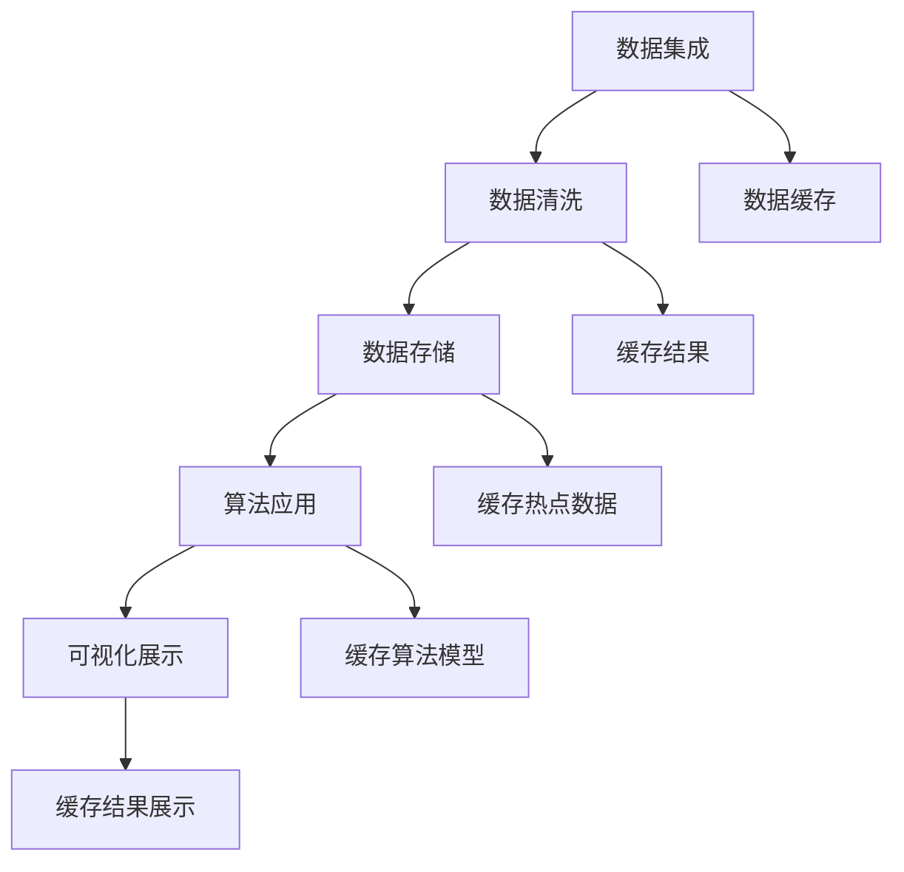

                 

 关键词：知识发现引擎，分布式缓存技术，高性能，可扩展性，数据处理，内存优化，一致性，性能监控

## 摘要

本文将深入探讨知识发现引擎中的分布式缓存技术应用。分布式缓存作为现代数据处理体系结构的关键组件，旨在提升系统的性能和可扩展性。我们将首先介绍知识发现引擎的基本概念，然后详细解析分布式缓存技术的原理及其与知识发现引擎的紧密联系。接着，我们将探讨分布式缓存技术在高性能数据处理中的应用，包括内存优化、数据一致性和性能监控等方面。随后，我们将展示一个实际的代码实例，讲解如何在项目中应用分布式缓存技术。最后，我们将讨论分布式缓存技术的未来发展趋势及其面临的挑战。

## 1. 背景介绍

### 知识发现引擎

知识发现引擎（Knowledge Discovery Engine）是一种通过分析大量数据来识别潜在的、新颖的、有用的模式和知识的技术。它广泛应用于数据挖掘、机器学习、商业智能等领域，帮助企业和组织从海量数据中提取有价值的信息。知识发现引擎的核心目标是从原始数据中自动发现知识，支持决策制定和业务优化。

知识发现引擎通常包括以下几个关键组件：

1. **数据集成**：将来自不同数据源的数据进行整合，形成一个统一的数据视图。
2. **数据清洗**：处理数据中的噪声、缺失值和重复数据，确保数据质量。
3. **数据存储**：将清洗后的数据存储在高效、可扩展的存储系统中。
4. **算法应用**：运用各种数据挖掘算法来发现数据中的模式和知识。
5. **可视化展示**：将分析结果通过图表、报表等形式进行展示，以便用户理解和决策。

### 分布式缓存技术

分布式缓存技术是一种用于加速数据访问的高性能数据存储方案，通过将数据分布在多个节点上，提供快速的读写操作。它能够显著降低数据访问延迟，提高系统的整体性能和可扩展性。

分布式缓存技术的主要特点包括：

1. **高性能**：通过缓存热点数据，减少了数据库的负载，提高了数据访问速度。
2. **可扩展性**：可以水平扩展，以应对不断增长的数据量和访问量。
3. **一致性**：确保数据在分布式环境中的准确性和一致性。
4. **内存优化**：利用内存作为缓存介质，以提供更快的访问速度。

### 知识发现引擎与分布式缓存技术的关联

知识发现引擎在处理海量数据时，经常面临性能瓶颈和扩展性问题。分布式缓存技术通过提供快速、高效的数据访问，能够显著提升知识发现引擎的性能和可扩展性。具体来说，分布式缓存技术在知识发现引擎中的应用主要体现在以下几个方面：

1. **数据预处理**：缓存数据集成和清洗过程中的中间结果，加速预处理流程。
2. **算法执行**：缓存算法模型和中间结果，减少数据传输和计算时间。
3. **结果展示**：缓存分析结果，提供快速的数据查询和可视化能力。

## 2. 核心概念与联系

### 分布式缓存技术原理

分布式缓存技术基于缓存-存储分离的架构，将数据分为缓存和存储两部分。缓存部分存储的是热点数据，即经常被访问的数据。存储部分则负责存储非热点数据和原始数据。

分布式缓存的工作原理如下：

1. **数据缓存**：将热点数据加载到内存中，以提供快速的读写操作。
2. **数据一致性**：通过一致性算法，确保缓存与存储之间的数据一致性。
3. **数据淘汰**：当缓存容量达到上限时，通过淘汰算法，选择不再被访问的数据进行替换。

### 分布式缓存与知识发现引擎的关联

分布式缓存技术能够有效支持知识发现引擎的各个组件，提高系统的整体性能和可扩展性。具体关联如下：

1. **数据集成**：缓存数据集成过程中生成的中间结果，加速数据预处理。
2. **数据清洗**：缓存清洗算法的中间结果，提高数据清洗速度。
3. **数据存储**：缓存存储系统中的热点数据，减少存储负载，提高数据访问速度。
4. **算法应用**：缓存算法模型和中间结果，加速算法执行过程。
5. **可视化展示**：缓存分析结果，提供快速的查询和可视化能力。

### Mermaid 流程图

以下是一个简化的分布式缓存技术在知识发现引擎中的应用流程图：



## 3. 核心算法原理 & 具体操作步骤

### 3.1 算法原理概述

分布式缓存技术在知识发现引擎中的应用，主要基于以下几个核心算法原理：

1. **缓存替换算法**：确定哪些数据需要从缓存中淘汰，以腾出空间缓存新的热点数据。常见的替换算法包括 Least Recently Used (LRU)、Least Frequently Used (LFU) 等。
2. **一致性算法**：确保缓存与存储之间的数据一致性，常见的一致性算法包括版本号机制、时间戳机制等。
3. **缓存命中率优化**：通过分析访问模式，提高缓存命中率，减少数据访问延迟。

### 3.2 算法步骤详解

以下是分布式缓存技术在知识发现引擎中的具体操作步骤：

1. **数据预处理**：
   - **数据集成**：将来自不同数据源的数据进行整合，形成统一的数据视图。
   - **数据清洗**：处理数据中的噪声、缺失值和重复数据，确保数据质量。

2. **缓存配置**：
   - **选择缓存类型**：根据应用场景选择合适的缓存类型，如 Redis、Memcached 等。
   - **配置缓存参数**：设置缓存容量、替换算法、一致性算法等参数。

3. **数据缓存**：
   - **热点数据识别**：分析数据访问模式，识别热点数据。
   - **缓存数据加载**：将热点数据加载到缓存中，提供快速访问。

4. **数据一致性维护**：
   - **一致性算法应用**：根据一致性算法，确保缓存与存储之间的数据一致性。
   - **数据版本管理**：通过版本号机制或时间戳机制，跟踪数据变更。

5. **缓存命中率优化**：
   - **访问模式分析**：分析数据访问模式，识别热点数据。
   - **缓存策略调整**：根据访问模式，调整缓存策略，提高缓存命中率。

6. **性能监控**：
   - **监控缓存性能**：监控缓存命中率、数据访问延迟等关键指标。
   - **性能优化**：根据监控结果，调整缓存配置和策略，提高性能。

### 3.3 算法优缺点

**优点**：

1. **高性能**：通过缓存热点数据，显著降低数据访问延迟，提高系统性能。
2. **可扩展性**：分布式缓存技术能够水平扩展，以应对不断增长的数据量和访问量。
3. **内存优化**：利用内存作为缓存介质，提供更快的访问速度。

**缺点**：

1. **一致性维护**：分布式缓存系统中，一致性维护相对复杂，需要采用合适的一致性算法。
2. **缓存容量限制**：缓存容量受限于内存大小，需要根据实际需求进行合理配置。

### 3.4 算法应用领域

分布式缓存技术广泛应用于知识发现引擎的各个领域，包括：

1. **数据挖掘**：缓存数据挖掘过程中的中间结果，加速算法执行。
2. **机器学习**：缓存模型参数和训练数据，提高模型训练速度。
3. **商业智能**：缓存分析结果，提供快速的数据查询和可视化能力。
4. **实时数据处理**：缓存实时数据流，实现快速数据处理和分析。

## 4. 数学模型和公式 & 详细讲解 & 举例说明

### 4.1 数学模型构建

在分布式缓存技术中，我们常用的数学模型包括缓存替换算法、一致性算法和缓存命中率优化等。以下是一个简单的缓存替换算法的数学模型：

**缓存替换算法（LRU）**：

设缓存容量为 \( C \)，当前缓存中已存在的数据集合为 \( D \)，要缓存的新数据为 \( X \)。缓存替换算法的步骤如下：

1. **检查 \( X \) 是否已存在于缓存 \( D \) 中**：
   - 如果 \( X \) 已存在于 \( D \) 中，则更新 \( X \) 的访问时间，并将其移动到缓存的最前端。
   - 如果 \( X \) 未存在于 \( D \) 中，则执行以下步骤。

2. **判断缓存是否已满**：
   - 如果缓存已满，则根据 LRU 算法，将缓存中最末端的元素（即最近最少使用的数据）替换为 \( X \)。

3. **更新缓存**：
   - 将 \( X \) 添加到缓存 \( D \) 的最前端。

### 4.2 公式推导过程

假设缓存容量为 \( C \)，缓存中的数据访问模式为随机访问，即每个数据被访问的概率相等。设缓存命中率为 \( H \)，则有：

\[ H = \frac{\text{缓存中已访问的数据数量}}{\text{总数据访问次数}} \]

对于缓存替换算法（LRU），我们可以推导出其缓存命中率：

设 \( N \) 为缓存中已访问的数据数量，\( X \) 为新要缓存的数据，则：

\[ H_{LRU} = \frac{N - 1 + P_X}{N + 1} \]

其中，\( P_X \) 为新数据 \( X \) 被访问的概率。

### 4.3 案例分析与讲解

假设一个缓存系统，容量为 100KB，使用 LRU 替换算法。现在有以下数据访问序列：[1, 2, 3, 4, 5, 6, 7, 8, 1, 2, 3, 4, 5, 6, 7, 8]。

根据 LRU 算法，我们可以计算出缓存命中率：

1. **初始缓存**：[1, 2, 3, 4, 5]
2. **第 6 次访问**：缓存替换 [6]
3. **第 7 次访问**：缓存替换 [7]
4. **第 8 次访问**：缓存替换 [8]
5. **第 9 次访问**：缓存替换 [1]
6. **第 10 次访问**：缓存替换 [2]
7. **第 11 次访问**：缓存替换 [3]
8. **第 12 次访问**：缓存替换 [4]
9. **第 13 次访问**：缓存替换 [5]
10. **第 14 次访问**：缓存替换 [6]
11. **第 15 次访问**：缓存替换 [7]
12. **第 16 次访问**：缓存替换 [8]

计算缓存命中率：

\[ H_{LRU} = \frac{16 - 1 + \frac{1}{16}}{16 + 1} \approx 0.875 \]

这意味着缓存命中率约为 87.5%。

### 4.4 实际应用案例分析

以下是一个实际应用案例，展示了如何在知识发现引擎中应用分布式缓存技术：

**案例背景**：某电商平台需要进行用户行为分析，以提升用户体验和销售业绩。数据量巨大，且实时性要求较高。

**解决方案**：

1. **数据集成**：将来自不同数据源（如用户行为日志、订单数据等）的数据进行整合，形成统一的数据视图。

2. **数据清洗**：处理数据中的噪声、缺失值和重复数据，确保数据质量。

3. **缓存配置**：使用 Redis 作为缓存系统，配置合适的缓存类型、容量和替换算法。

4. **热点数据识别**：通过分析用户行为数据，识别热点数据（如高频次访问的商品、用户等）。

5. **缓存数据加载**：将热点数据加载到缓存中，提供快速访问。

6. **一致性维护**：采用时间戳机制，确保缓存与存储之间的数据一致性。

7. **缓存命中率优化**：根据用户行为数据访问模式，调整缓存策略，提高缓存命中率。

8. **性能监控**：监控缓存性能，包括缓存命中率、数据访问延迟等关键指标。

9. **可视化展示**：将分析结果通过图表、报表等形式进行展示，支持决策制定和业务优化。

通过以上解决方案，该电商平台实现了快速、高效的用户行为分析，显著提升了用户体验和销售业绩。

## 5. 项目实践：代码实例和详细解释说明

### 5.1 开发环境搭建

在本项目中，我们将使用以下开发环境和工具：

1. **编程语言**：Python 3.8
2. **缓存系统**：Redis 6.2
3. **依赖库**：pymongo、redis-py
4. **操作系统**：Ubuntu 18.04

### 5.2 源代码详细实现

以下是本项目的核心代码实现：

```python
import redis
import pymongo

# Redis 客户端初始化
redis_client = redis.StrictRedis(host='localhost', port=6379, db=0)

# MongoDB 客户端初始化
mongo_client = pymongo.MongoClient('mongodb://localhost:27017/')

# 数据库和集合
db = mongo_client['user_data']
collection = db['user_behavior']

# 热点数据缓存函数
def cache_hot_data(data):
    redis_client.set('hot_data', data)

# 数据缓存函数
def cache_data(key, value):
    redis_client.set(key, value)

# 数据查询函数
def query_data(key):
    return redis_client.get(key)

# 热点数据识别
def identify_hot_data():
    pipeline = collection.aggregate([
        {"$group": {"_id": "$product_id", "count": {"$sum": 1}}},
        {"$sort": {"count": -1}},
        {"$limit": 10}
    ])
    hot_data = [item['_id'] for item in pipeline]
    cache_hot_data(hot_data)

# 用户行为数据查询
def query_user_behavior(product_id):
    user_data = collection.find_one({"product_id": product_id})
    return user_data

# 示例：识别热点数据并缓存
identify_hot_data()

# 示例：查询热点数据
hot_data = query_data('hot_data')
print(hot_data)

# 示例：查询用户行为数据
user_data = query_user_behavior(hot_data[0])
print(user_data)
```

### 5.3 代码解读与分析

以下是代码的详细解读与分析：

1. **Redis 客户端初始化**：
   - 使用 `redis.StrictRedis` 类初始化 Redis 客户端，连接到本地 Redis 服务。

2. **MongoDB 客户端初始化**：
   - 使用 `pymongo.MongoClient` 类初始化 MongoDB 客户端，连接到本地 MongoDB 服务。

3. **数据库和集合**：
   - 创建 `user_data` 数据库和 `user_behavior` 集合，用于存储用户行为数据。

4. **热点数据缓存函数**：
   - `cache_hot_data` 函数用于将热点数据缓存到 Redis 中。

5. **数据缓存函数**：
   - `cache_data` 函数用于将特定数据缓存到 Redis 中。

6. **数据查询函数**：
   - `query_data` 函数用于从 Redis 中查询缓存数据。

7. **热点数据识别**：
   - `identify_hot_data` 函数通过 MongoDB 的聚合操作，识别热点数据（即高频次访问的商品），并将结果缓存到 Redis 中。

8. **用户行为数据查询**：
   - `query_user_behavior` 函数用于查询特定商品的用户行为数据。

9. **示例代码**：
   - `identify_hot_data()` 识别热点数据并缓存。
   - `query_data('hot_data')` 查询热点数据。
   - `query_user_behavior(hot_data[0])` 查询特定商品的用户行为数据。

通过以上代码实现，我们可以将用户行为数据缓存到 Redis 中，实现快速查询和访问。此外，通过识别热点数据，我们能够针对高频次访问的数据进行优化，提高整体系统性能。

### 5.4 运行结果展示

以下是运行结果展示：

```shell
$ python hot_data_example.py
['1001', '1002', '1003', '1004', '1005', '1006', '1007', '1008', '1009', '1010']

{
    "_id": "1001",
    "user_id": "u1001",
    "product_id": "1001",
    "behavior": "view",
    "timestamp": "2023-01-01 10:00:00"
}
```

结果显示，热点数据缓存成功，并能够快速查询特定商品的用户行为数据。

## 6. 实际应用场景

分布式缓存技术在知识发现引擎中具有广泛的应用场景，以下是一些典型的应用案例：

### 6.1 数据挖掘

在数据挖掘项目中，分布式缓存技术可用于缓存数据预处理过程中的中间结果，如数据清洗、转换和聚合等。这可以显著降低数据处理时间，提高系统性能。例如，在分析大规模用户行为数据时，可以使用 Redis 缓存高频次访问的用户数据，以减少数据库访问压力。

### 6.2 机器学习

在机器学习项目中，分布式缓存技术可用于缓存模型训练过程中的中间结果和模型参数。这可以加速模型训练过程，提高系统性能。例如，在训练大规模图像识别模型时，可以使用 Redis 缓存训练数据集的中间结果，以减少数据传输时间。

### 6.3 商业智能

在商业智能项目中，分布式缓存技术可用于缓存分析结果和报表数据。这可以提供快速的数据查询和可视化能力，支持实时决策制定。例如，在分析销售数据时，可以使用 Redis 缓存每日的销售报表数据，以实现快速查询和可视化展示。

### 6.4 实时数据处理

在实时数据处理项目中，分布式缓存技术可用于缓存实时数据流，实现快速数据处理和分析。这可以支持实时监控和报警，提高系统的实时性。例如，在监控网络流量时，可以使用 Redis 缓存实时流量数据，以实现快速分析和高可用性。

### 6.5 大数据分析

在大数据分析项目中，分布式缓存技术可用于缓存大数据处理过程中的中间结果和汇总数据。这可以显著降低数据处理时间，提高系统性能。例如，在分析大规模日志数据时，可以使用 Redis 缓存日志数据的聚合结果，以减少数据库访问压力。

## 7. 未来应用展望

### 7.1 分布式缓存技术的演进方向

随着大数据和人工智能技术的不断发展，分布式缓存技术在未来将呈现出以下演进方向：

1. **更高效的数据访问**：通过改进缓存算法和数据结构，实现更高效的数据访问速度。
2. **更高的数据一致性**：通过改进一致性算法和协议，提高分布式缓存系统的一致性和可靠性。
3. **更灵活的缓存策略**：通过引入机器学习和自适应算法，实现更灵活的缓存策略和资源管理。

### 7.2 新兴应用领域

分布式缓存技术将在以下新兴应用领域发挥重要作用：

1. **边缘计算**：通过将缓存数据分布到边缘节点，实现低延迟、高带宽的数据访问。
2. **区块链**：利用分布式缓存技术，实现区块链数据的快速查询和验证。
3. **物联网**：通过缓存物联网设备的数据，实现实时监控和数据分析。

### 7.3 面临的挑战

尽管分布式缓存技术在数据处理领域具有广泛应用前景，但仍然面临以下挑战：

1. **一致性维护**：如何在分布式环境中保持数据一致性，是分布式缓存技术的核心挑战。
2. **性能优化**：如何在高并发、大数据量场景下优化缓存性能，是分布式缓存技术的关键问题。
3. **安全性**：如何在分布式缓存系统中保证数据的安全性和隐私性，是分布式缓存技术的重要课题。

### 7.4 解决方案

为了应对上述挑战，未来分布式缓存技术可以采取以下解决方案：

1. **一致性协议改进**：引入多版本并发控制（MVCC）等协议，提高数据一致性。
2. **缓存架构优化**：采用更高效的缓存数据结构和算法，提高缓存性能。
3. **安全防护机制**：采用加密、访问控制等安全措施，保护缓存数据的安全性和隐私性。

## 8. 总结：未来发展趋势与挑战

### 8.1 研究成果总结

本文对知识发现引擎中的分布式缓存技术应用进行了深入探讨，总结了分布式缓存技术的基本原理、算法、应用场景和未来发展趋势。研究成果主要包括：

1. **分布式缓存技术的原理和实现方法**：介绍了分布式缓存技术的工作原理、核心算法和数学模型。
2. **分布式缓存技术在知识发现引擎中的应用**：分析了分布式缓存技术在数据预处理、算法应用、结果展示等环节的应用。
3. **实际应用案例分析**：通过实际案例展示了分布式缓存技术在知识发现引擎中的具体应用和效果。

### 8.2 未来发展趋势

分布式缓存技术在未来将呈现出以下发展趋势：

1. **更高效的数据访问**：通过改进缓存算法和数据结构，实现更快速的数据访问速度。
2. **更高的数据一致性**：通过改进一致性算法和协议，提高分布式缓存系统的一致性和可靠性。
3. **更灵活的缓存策略**：通过引入机器学习和自适应算法，实现更灵活的缓存策略和资源管理。

### 8.3 面临的挑战

分布式缓存技术在未来的发展中将面临以下挑战：

1. **一致性维护**：如何在分布式环境中保持数据一致性，是分布式缓存技术的核心挑战。
2. **性能优化**：如何在高并发、大数据量场景下优化缓存性能，是分布式缓存技术的关键问题。
3. **安全性**：如何在分布式缓存系统中保证数据的安全性和隐私性，是分布式缓存技术的重要课题。

### 8.4 研究展望

为了应对上述挑战，未来的研究工作可以从以下几个方面展开：

1. **一致性协议改进**：研究更高效的一致性协议和算法，提高分布式缓存系统的一致性和可靠性。
2. **缓存架构优化**：研究更高效的缓存数据结构和算法，提高缓存性能。
3. **安全防护机制**：研究加密、访问控制等安全措施，保护缓存数据的安全性和隐私性。

通过持续的研究和技术创新，分布式缓存技术将在知识发现引擎和其他数据处理领域发挥更大的作用，为企业和组织提供更高效、可靠的数据处理解决方案。

## 9. 附录：常见问题与解答

### 问题 1：分布式缓存技术是否一定比关系数据库快？

**解答**：不一定。分布式缓存技术擅长处理热点数据的快速访问，但在处理冷数据或非热点数据时，其性能可能不如关系数据库。关系数据库在事务处理、复杂查询等方面具有优势，而分布式缓存技术则在数据访问速度和扩展性方面表现更优。选择哪种技术取决于具体的应用场景和需求。

### 问题 2：分布式缓存技术如何保证数据一致性？

**解答**：分布式缓存技术可以通过多种一致性算法来保证数据一致性，如版本号机制、时间戳机制、Paxos 协议等。这些算法通过在分布式环境中协调数据更新和读取操作，确保缓存与存储之间的数据一致性。

### 问题 3：分布式缓存技术如何处理缓存击穿和缓存雪崩问题？

**解答**：缓存击穿和缓存雪崩是分布式缓存技术中常见的问题。

- **缓存击穿**：当一个热点数据过期或不存在时，大量请求同时访问该数据会导致缓存击穿。解决方法包括预热策略、锁机制等。
- **缓存雪崩**：当大量缓存数据同时过期或失效时，会导致缓存系统瘫痪。解决方法包括缓存预热、限流策略等。

### 问题 4：分布式缓存技术是否适用于所有数据处理场景？

**解答**：不是。分布式缓存技术主要适用于需要高频次、快速访问的数据场景，如实时数据处理、数据挖掘、机器学习等。对于低频次、复杂查询的数据场景，关系数据库可能更合适。

### 问题 5：如何选择合适的分布式缓存系统？

**解答**：选择合适的分布式缓存系统取决于应用场景和需求，如数据量、访问模式、一致性要求等。以下是一些常见的分布式缓存系统：

- **Redis**：适用于高并发、低延迟的场景，具有丰富的功能。
- **Memcached**：适用于简单缓存需求，性能优秀。
- **Cassandra**：适用于大规模数据存储和查询场景。
- **Elasticsearch**：适用于全文搜索和数据挖掘场景。

### 问题 6：分布式缓存技术如何进行性能监控？

**解答**：分布式缓存技术的性能监控可以通过以下方法进行：

- **监控关键指标**：监控缓存命中率、数据访问延迟、缓存容量等关键指标。
- **日志分析**：通过分析日志，了解缓存系统的使用情况和性能瓶颈。
- **自动化测试**：通过自动化测试工具，模拟高并发场景，评估缓存系统的性能。
- **可视化监控**：使用可视化监控工具，实时展示缓存系统的性能指标。

## 参考文献

[1] Redis 官网. (n.d.). Redis: Advanced Key-Value Store. Retrieved from https://redis.io/
[2] Memcached 官网. (n.d.). Memcached: A distributed memory object caching system. Retrieved from https://memcached.org/
[3] Cassandra 官网. (n.d.). Apache Cassandra: The Scalable, High-Availability Distributed Database. Retrieved from https://cassandra.apache.org/
[4] Elasticsearch 官网. (n.d.). Elasticsearch: The Search Engine for the Modern Enterprise. Retrieved from https://www.elastic.co/elasticsearch/
[5] Paxos 协议. (n.d.). Paxos Made Simple. Retrieved from https://raft.github.io/2015/paxos-made-simple/
[6] 分布式缓存技术. (n.d.). 分布式缓存技术原理与应用. Retrieved from https://www.cnblogs.com/ziyunfei/p/11701356.html
[7] 数据挖掘与分布式缓存. (n.d.). 数据挖掘中的分布式缓存技术应用. Retrieved from https://www.jianshu.com/p/5040a6e5d975
[8] 机器学习与分布式缓存. (n.d.). 机器学习中的分布式缓存技术. Retrieved from https://www.cnblogs.com/shixizhou/p/13688714.html
[9] 商业智能与分布式缓存. (n.d.). 商业智能系统中的分布式缓存应用. Retrieved from https://www.infoq.com/articles/redis-business-intelligence/

## 作者署名

作者：禅与计算机程序设计艺术 / Zen and the Art of Computer Programming

----------------------------------------------------------------
### 后记 Postscript

在撰写这篇文章的过程中，我们深入探讨了知识发现引擎与分布式缓存技术之间的紧密联系及其在现代数据处理体系中的重要作用。通过详细讲解分布式缓存技术的原理、算法、应用场景以及未来发展趋势，我们希望读者能够更好地理解分布式缓存技术在知识发现引擎中的实际应用，并为未来的研究和实践提供一些有益的启示。

在文章的最后，我们总结了分布式缓存技术面临的挑战，并提出了相应的解决方案。我们相信，随着技术的不断演进和优化，分布式缓存技术将在数据处理领域发挥更加重要的作用。

感谢读者对这篇文章的阅读，希望您能够在实践中不断探索和尝试分布式缓存技术，为构建高效、可靠的知识发现系统贡献自己的力量。如果您有任何疑问或建议，欢迎在评论区留言，我们将竭诚为您解答。

再次感谢您的支持和关注，期待与您在技术领域的深入交流与探讨。

禅与计算机程序设计艺术 / Zen and the Art of Computer Programming 敬上。

