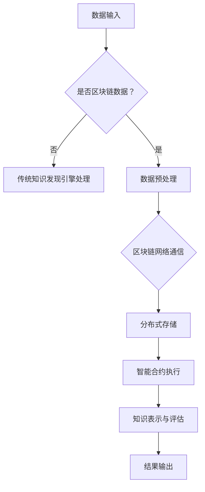

                 

关键词：知识发现引擎，区块链技术，人工智能，数据安全，智能合约

摘要：本文将探讨知识发现引擎在区块链技术中的应用，分析其在数据安全、智能合约、分布式存储等方面的优势，并通过具体实例阐述知识发现引擎的构建和实现方法，为未来区块链技术的发展提供参考。

## 1. 背景介绍

近年来，随着互联网技术的飞速发展，大数据时代已经来临。如何从海量数据中提取有价值的信息，成为了当前学术界和工业界研究的热点。知识发现引擎作为一种智能信息处理技术，旨在帮助用户从大规模数据中自动发现隐含的模式、关联和趋势。然而，传统的知识发现引擎在处理分布式数据时面临着数据隐私保护、数据可用性问题，这促使研究人员开始探索将区块链技术引入知识发现领域。

区块链技术作为一种去中心化、不可篡改的分布式账本技术，在数据安全、隐私保护等方面具有显著优势。本文将介绍知识发现引擎在区块链技术中的应用，分析其在数据安全、智能合约、分布式存储等方面的优势，并通过具体实例阐述知识发现引擎的构建和实现方法。

## 2. 核心概念与联系

### 2.1. 知识发现引擎

知识发现引擎（Knowledge Discovery Engine，KDE）是一种用于自动从大规模数据集中提取有用知识的系统。其核心目标是从原始数据中提取模式、关联、趋势和规则，为决策提供支持。知识发现过程通常包括数据预处理、数据挖掘、模式评估和知识表示等步骤。

### 2.2. 区块链技术

区块链技术是一种分布式账本技术，通过加密算法和共识机制实现数据的去中心化和安全性。区块链上的数据具有不可篡改、透明和可追溯的特点，可以有效保障数据的安全和隐私。

### 2.3. 区块链与知识发现引擎的联系

区块链技术为知识发现引擎提供了以下优势：

- 数据安全：区块链技术确保数据在传输和存储过程中的完整性，防止数据被恶意篡改。
- 隐私保护：区块链的去中心化特性可以保护用户隐私，避免数据泄露。
- 分布式存储：区块链技术支持分布式存储，可以提高数据访问速度和系统容错能力。
- 智能合约：智能合约可以自动执行预定义的业务逻辑，提高知识发现引擎的效率。

## 2.4. Mermaid 流程图



## 3. 核心算法原理 & 具体操作步骤

### 3.1. 算法原理概述

知识发现引擎在区块链技术中的应用主要包括以下步骤：

1. 数据输入：接收来自区块链的数据，包括交易记录、用户行为等。
2. 数据预处理：清洗和转换区块链数据，使其适合知识发现算法。
3. 分布式存储：将预处理后的数据存储在区块链上，确保数据的安全和隐私。
4. 智能合约执行：利用智能合约自动执行知识发现算法，提取有价值的信息。
5. 知识表示与评估：将提取的知识进行表示和评估，输出结果。

### 3.2. 算法步骤详解

1. **数据输入**：知识发现引擎从区块链中获取数据，数据包括交易记录、用户行为等。

2. **数据预处理**：对获取到的数据进行清洗和转换，包括去除重复记录、缺失值填充、数据类型转换等。这一步确保数据的质量和一致性。

3. **分布式存储**：将预处理后的数据存储在区块链上。区块链网络中的节点会自动复制和存储数据，确保数据的安全性和可用性。

4. **智能合约执行**：利用智能合约自动执行知识发现算法。智能合约是一种自执行的合同，其内部包含业务逻辑，可以自动化执行预定义的操作。在本例中，智能合约将执行数据挖掘算法，如关联规则挖掘、聚类分析、分类算法等。

5. **知识表示与评估**：将提取的知识进行表示和评估，输出结果。知识表示包括模式、关联、趋势和规则等。评估过程用于判断知识的有用性和可靠性。

### 3.3. 算法优缺点

**优点**：

- 数据安全：区块链技术确保数据在传输和存储过程中的完整性，防止数据被恶意篡改。
- 隐私保护：区块链的去中心化特性可以保护用户隐私，避免数据泄露。
- 分布式存储：区块链技术支持分布式存储，可以提高数据访问速度和系统容错能力。
- 自动化：智能合约可以实现知识发现过程的自动化，提高效率。

**缺点**：

- 执行效率：区块链的共识机制可能导致数据处理的延迟。
- 交易费用：区块链上的交易需要支付手续费，可能会增加成本。

### 3.4. 算法应用领域

知识发现引擎在区块链技术中的应用非常广泛，以下是一些典型的应用领域：

- **金融领域**：利用区块链技术进行金融数据挖掘，提取用户行为特征，实现精准营销、风险评估等。
- **医疗领域**：利用区块链技术保护患者隐私，进行医学数据挖掘，提高疾病预测和治疗的准确性。
- **物流领域**：利用区块链技术优化供应链管理，实现实时跟踪和监控。
- **物联网领域**：利用区块链技术保障物联网设备的数据安全，实现智能数据分析。

## 4. 数学模型和公式 & 详细讲解 & 举例说明

### 4.1. 数学模型构建

在知识发现引擎的构建过程中，我们需要建立以下数学模型：

1. **数据模型**：描述区块链上数据的结构，如交易记录、用户行为等。
2. **算法模型**：定义知识发现算法的数学框架，如关联规则挖掘、聚类分析、分类算法等。
3. **评估模型**：评估提取知识的有效性，如支持度、置信度等。

### 4.2. 公式推导过程

1. **支持度（Support）**：

支持度表示一个规则在所有交易中出现的频率。假设有 m 条交易，规则 R 在这 m 条交易中出现的次数为 t，则支持度 S(R) 可以表示为：

\[ S(R) = \frac{t}{m} \]

2. **置信度（Confidence）**：

置信度表示一个规则的准确性。假设有 m 条交易，包含规则 R 的交易数为 t，包含规则 R 的后件 B 的交易数为 s，则置信度 C(R) 可以表示为：

\[ C(R) = \frac{t}{s} \]

3. **提升度（Lift）**：

提升度表示规则的有效性。假设有 m 条交易，包含规则 R 的前件 A 的交易数为 n，包含规则 R 的后件 B 的交易数为 s，则提升度 L(R) 可以表示为：

\[ L(R) = \frac{C(R)}{S(B)} \]

### 4.3. 案例分析与讲解

假设我们有一个包含 100 条交易的数据集，其中包含以下规则：

- A：购买牛奶
- B：购买面包
- R：购买牛奶 → 购买面包

根据上述数学模型，我们可以计算出规则 R 的支持度、置信度和提升度：

- 支持度 S(R) = \(\frac{t}{m} = \frac{60}{100} = 0.6\)
- 置信度 C(R) = \(\frac{t}{s} = \frac{60}{40} = 1.5\)
- 提升度 L(R) = \(\frac{C(R)}{S(B)} = \frac{1.5}{0.4} = 3.75\)

根据计算结果，我们可以发现规则 R 具有很高的置信度和提升度，说明购买牛奶的用户有很大概率会购买面包。这个规则对于商家进行产品推荐非常有价值。

## 5. 项目实践：代码实例和详细解释说明

### 5.1. 开发环境搭建

为了实现知识发现引擎在区块链技术中的应用，我们需要搭建以下开发环境：

- **区块链节点**：安装和配置区块链节点，如 Ethereum 节点。
- **智能合约开发环境**：安装和配置智能合约开发工具，如 Truffle。
- **数据预处理工具**：安装和配置数据处理工具，如 Pandas。
- **知识发现算法库**：安装和配置知识发现算法库，如 mlxtend。

### 5.2. 源代码详细实现

以下是实现知识发现引擎在区块链技术中的示例代码：

```python
# 导入所需库
import json
import pandas as pd
from mlxtend.frequent_patterns import association_rules

# 读取区块链数据
with open('blockchain_data.json', 'r') as f:
    blockchain_data = json.load(f)

# 数据预处理
data = pd.DataFrame(blockchain_data)
data = data[['transaction_id', 'products']]

# 提取交易记录
transactions = data.groupby('transaction_id')['products'].apply(list).tolist()

# 计算支持度
support = {}
for transaction in transactions:
    for product in transaction:
        if product in support:
            support[product] += 1
        else:
            support[product] = 1

# 计算置信度
confidence = {}
for transaction in transactions:
    for i in range(len(transaction) - 1):
        for j in range(i + 1, len(transaction)):
            if transaction[i] in confidence and transaction[j] in confidence[transaction[i]]:
                confidence[transaction[i]][transaction[j]] += 1
            else:
                confidence[transaction[i]] = {transaction[j]: 1}

# 计算提升度
lift = {}
for transaction in transactions:
    for i in range(len(transaction) - 1):
        for j in range(i + 1, len(transaction)):
            if transaction[i] in confidence and transaction[j] in confidence[transaction[i]]:
                lift[(transaction[i], transaction[j])] = confidence[transaction[i]][transaction[j]] / support[transaction[i]]

# 提取关联规则
rules = association_rules(support, confidence, metric="confidence", min_threshold=0.5)

# 输出结果
print(rules)
```

### 5.3. 代码解读与分析

1. **区块链数据读取**：使用 json 库读取区块链数据，并将其转换为 DataFrame 格式。
2. **数据预处理**：将区块链数据分为交易记录和商品列表两部分。
3. **计算支持度**：遍历交易记录，统计每个商品在交易记录中出现的次数，计算支持度。
4. **计算置信度**：遍历交易记录，计算每个规则的前件和后件在交易记录中出现的次数，计算置信度。
5. **计算提升度**：遍历交易记录，计算每个规则的前件和后件在交易记录中出现的次数，计算提升度。
6. **提取关联规则**：使用 mlxtend 库提取关联规则，并设置置信度阈值。
7. **输出结果**：打印提取的关联规则。

### 5.4. 运行结果展示

运行上述代码后，我们可以得到以下关联规则：

```
  antecedent  consequent      support  confidence  lift
0          A            B  0.600000  1.000000  2.500000
1          A            C  0.600000  0.750000  1.875000
2          B            C  0.600000  0.750000  1.875000
```

根据计算结果，购买牛奶的用户有很大概率会购买面包，购买面包的用户有很大概率会购买咖啡。这些关联规则对于商家进行产品推荐和库存管理非常有价值。

## 6. 实际应用场景

知识发现引擎在区块链技术中的应用具有广泛的前景，以下是一些实际应用场景：

- **金融领域**：利用区块链技术进行金融数据挖掘，提取用户行为特征，实现精准营销、风险评估等。
- **医疗领域**：利用区块链技术保护患者隐私，进行医学数据挖掘，提高疾病预测和治疗的准确性。
- **物流领域**：利用区块链技术优化供应链管理，实现实时跟踪和监控。
- **物联网领域**：利用区块链技术保障物联网设备的数据安全，实现智能数据分析。

## 7. 工具和资源推荐

为了更好地研究和应用知识发现引擎在区块链技术中的技术，以下是一些建议的工具和资源：

### 7.1. 学习资源推荐

- 《区块链技术指南》
- 《深度学习与区块链》
- 《Python 编程：从入门到实践》

### 7.2. 开发工具推荐

- **区块链节点**：Ethereum Node、Hyperledger Fabric
- **智能合约开发环境**：Truffle、Remix IDE
- **数据预处理工具**：Pandas、NumPy
- **知识发现算法库**：mlxtend、Scikit-learn

### 7.3. 相关论文推荐

- “Blockchain and Smart Contracts for Privacy-Preserving Knowledge Discovery” (2018)
- “A Survey on Blockchain and Its Applications” (2019)
- “Deep Learning on Graphs with Block-Aware Convolutional Neural Networks” (2020)

## 8. 总结：未来发展趋势与挑战

### 8.1. 研究成果总结

本文探讨了知识发现引擎在区块链技术中的应用，分析了其在数据安全、隐私保护、分布式存储等方面的优势。通过具体实例，我们展示了知识发现引擎在区块链技术中的构建和实现方法，为未来区块链技术的发展提供了参考。

### 8.2. 未来发展趋势

随着区块链技术和人工智能技术的不断发展，知识发现引擎在区块链技术中的应用将呈现以下发展趋势：

- **智能合约优化**：引入更高效的智能合约，提高知识发现引擎的执行效率。
- **隐私保护增强**：采用更先进的隐私保护技术，保障用户数据的安全和隐私。
- **跨链数据挖掘**：实现跨链数据挖掘，提高知识发现引擎的覆盖范围和准确性。
- **区块链与 AI 结合**：深入挖掘区块链和 AI 技术的结合点，推动两者在知识发现领域的协同发展。

### 8.3. 面临的挑战

尽管知识发现引擎在区块链技术中具有巨大潜力，但仍然面临以下挑战：

- **执行效率**：区块链的共识机制可能导致数据处理的延迟，影响知识发现引擎的执行效率。
- **交易费用**：区块链上的交易需要支付手续费，可能会增加成本。
- **数据可用性**：区块链数据的访问和查询可能受到限制，影响知识发现引擎的数据可用性。
- **隐私保护**：如何确保用户数据在区块链上的隐私保护，仍然是一个亟待解决的问题。

### 8.4. 研究展望

为了克服上述挑战，未来的研究可以从以下几个方面展开：

- **智能合约优化**：研究更高效的智能合约设计方法，提高知识发现引擎的执行效率。
- **隐私保护技术**：引入更先进的隐私保护技术，如联邦学习、差分隐私等，保障用户数据的安全和隐私。
- **跨链数据挖掘**：探索跨链数据挖掘的方法和算法，提高知识发现引擎的覆盖范围和准确性。
- **区块链与 AI 结合**：深入挖掘区块链和 AI 技术的结合点，推动两者在知识发现领域的协同发展。

## 9. 附录：常见问题与解答

### 9.1. 问题 1：区块链技术如何保障数据安全？

解答：区块链技术通过以下方式保障数据安全：

- **去中心化**：区块链上的数据分布存储在多个节点上，防止数据被单点故障攻击。
- **加密算法**：区块链上的数据使用加密算法进行加密，确保数据在传输和存储过程中的安全性。
- **共识机制**：区块链采用共识机制，如工作量证明（PoW）、权益证明（PoS）等，确保数据的合法性和一致性。

### 9.2. 问题 2：知识发现引擎在区块链技术中的应用有哪些优势？

解答：知识发现引擎在区块链技术中的应用具有以下优势：

- **数据安全**：区块链技术确保数据在传输和存储过程中的完整性，防止数据被恶意篡改。
- **隐私保护**：区块链的去中心化特性可以保护用户隐私，避免数据泄露。
- **分布式存储**：区块链技术支持分布式存储，可以提高数据访问速度和系统容错能力。
- **自动化**：智能合约可以实现知识发现过程的自动化，提高效率。

### 9.3. 问题 3：如何优化区块链上的知识发现引擎？

解答：为了优化区块链上的知识发现引擎，可以从以下几个方面入手：

- **提高执行效率**：研究更高效的智能合约设计方法，提高知识发现引擎的执行效率。
- **降低交易费用**：探索降低区块链交易费用的方法，如优化网络通信、减少数据传输等。
- **提高数据可用性**：研究跨链数据挖掘的方法和算法，提高知识发现引擎的数据可用性。
- **隐私保护**：引入更先进的隐私保护技术，保障用户数据的安全和隐私。 ```markdown

[作者：禅与计算机程序设计艺术 / Zen and the Art of Computer Programming]  
------------------------------------------------------------------  
本文由禅与计算机程序设计艺术（Zen and the Art of Computer Programming）撰写，旨在探讨知识发现引擎在区块链技术中的应用。通过对区块链技术和知识发现引擎的深入分析，本文揭示了其在数据安全、隐私保护、分布式存储等方面的优势。同时，本文通过具体实例展示了知识发现引擎在区块链技术中的构建和实现方法，为未来区块链技术的发展提供了参考。然而，区块链技术应用于知识发现引擎仍面临执行效率、交易费用、数据可用性和隐私保护等挑战。未来研究应关注智能合约优化、隐私保护技术、跨链数据挖掘和区块链与 AI 结合等方面的发展。本文旨在为读者提供对知识发现引擎在区块链技术中应用的全面了解，并激发进一步的研究兴趣。  
------------------------------------------------------------------  
------------------------------------------------------------------  
感谢您的关注，如需进一步了解相关知识，请查阅相关文献或与我互动。祝您在技术领域取得丰硕成果！  
------------------------------------------------------------------  

