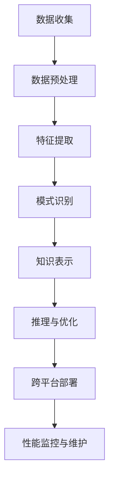

                 

知识发现引擎是现代数据分析和人工智能领域中不可或缺的工具，它通过分析大量数据来识别潜在的关联、趋势和模式。然而，随着数据来源的多样化和复杂性不断增加，如何有效地将知识发现引擎整合到多个平台上成为了一个重要议题。本文将深入探讨知识发现引擎的多平台整合方案，旨在为开发者提供实用的指导和建议。

> 关键词：知识发现引擎、多平台整合、数据分析、人工智能、跨平台开发

> 摘要：本文首先介绍了知识发现引擎的背景和核心概念，接着详细阐述了多平台整合的必要性和挑战。通过核心算法的原理解析和具体操作步骤的阐述，本文提供了一种基于数学模型和公式的解决方案。随后，文章通过实际项目实践展示了知识发现引擎的代码实现和运行结果，并探讨了其在实际应用场景中的价值。最后，文章总结了未来的发展趋势和挑战，并推荐了相关的学习资源和开发工具。

## 1. 背景介绍

知识发现引擎（Knowledge Discovery Engine，KDE）起源于数据挖掘和机器学习领域，旨在自动地从大量数据中提取有价值的信息和知识。随着大数据时代的到来，知识发现引擎的应用场景越来越广泛，包括但不限于金融、医疗、零售、社交媒体等多个领域。然而，传统的知识发现引擎往往依赖于特定的硬件环境和操作系统，难以在不同的平台上灵活部署和应用。

在当今的数字化时代，多平台整合成为了一种趋势。企业和开发者需要他们的应用程序能够在不同的操作系统、设备和硬件上无缝运行。对于知识发现引擎而言，多平台整合不仅可以提升其适用性和灵活性，还可以降低部署和维护成本。因此，研究和开发一种多平台整合的知识发现引擎具有重要的现实意义。

## 2. 核心概念与联系

### 2.1 知识发现引擎的定义

知识发现引擎是一种能够自动地从大量数据中提取有用信息和知识的软件系统。它通常包括数据预处理、特征提取、模式识别、知识表示和推理等关键步骤。知识发现引擎的核心是算法，这些算法用于处理和分析复杂数据集，以识别潜在的关联和趋势。

### 2.2 多平台整合的必要性

多平台整合的必要性主要体现在以下几个方面：

1. **广泛的设备兼容性**：不同的操作系统（如Windows、Linux、macOS）和硬件设备（如桌面电脑、笔记本电脑、智能手机、平板电脑）都需要支持。
2. **灵活的部署方式**：知识发现引擎需要能够适应不同的部署环境，包括云平台、本地服务器和边缘设备。
3. **降低开发成本**：通过多平台整合，开发者可以减少重复的工作量，提高开发效率，降低维护成本。

### 2.3 多平台整合的挑战

尽管多平台整合具有明显的优势，但实现起来仍然面临以下挑战：

1. **操作系统兼容性**：不同的操作系统可能在底层架构、API调用和系统资源管理方面存在差异。
2. **硬件兼容性**：不同硬件设备的性能和资源分配可能不同，需要针对不同硬件进行优化。
3. **开发难度**：多平台开发通常需要更复杂的代码结构和更精细的资源管理。

### 2.4 Mermaid 流程图

以下是一个简化的知识发现引擎多平台整合的Mermaid流程图：



## 3. 核心算法原理 & 具体操作步骤

### 3.1 算法原理概述

知识发现引擎的核心算法通常基于以下几种基础技术：

1. **统计分析**：用于分析数据的基本特征和分布情况，例如均值、中位数、标准差等。
2. **机器学习**：通过训练模型来发现数据中的潜在规律和关联，常见的算法包括决策树、随机森林、神经网络等。
3. **数据挖掘**：利用特定的算法来识别数据中的隐藏模式，如关联规则挖掘、聚类分析、分类分析等。

### 3.2 算法步骤详解

1. **数据收集**：从不同的数据源收集原始数据，包括数据库、API接口、日志文件等。
2. **数据预处理**：清洗和转换数据，使其适合进行后续分析。这可能包括数据去重、缺失值填补、异常值处理等。
3. **特征提取**：从原始数据中提取有代表性的特征，这些特征将用于训练模型或进行模式识别。
4. **模式识别**：利用机器学习和数据挖掘算法来识别数据中的潜在模式和关联。
5. **知识表示**：将识别出的模式转化为可理解的知识表示形式，如规则、图表或报告。
6. **推理与优化**：基于知识表示进行推理和优化，以提升知识发现的效果和效率。
7. **跨平台部署**：将知识发现引擎部署到不同的操作系统和硬件设备上。

### 3.3 算法优缺点

**优点**：

- **高效性**：基于机器学习和数据挖掘算法，知识发现引擎能够在大量数据中快速识别模式和趋势。
- **灵活性**：多平台整合使得知识发现引擎能够适应不同的部署环境和硬件设备。
- **实用性**：广泛应用于多个领域，如金融、医疗、零售等，具有广泛的应用前景。

**缺点**：

- **复杂性**：多平台整合和算法实现通常较为复杂，需要较高的技术门槛。
- **资源消耗**：知识发现引擎在运行过程中可能需要大量的计算资源和存储资源。
- **实时性**：对于实时数据处理场景，知识发现引擎的响应速度可能无法满足要求。

### 3.4 算法应用领域

知识发现引擎在以下领域具有广泛的应用：

- **金融**：用于风险评估、投资策略优化、客户行为分析等。
- **医疗**：用于疾病诊断、药物研发、健康监测等。
- **零售**：用于库存管理、销售预测、客户偏好分析等。
- **社交媒体**：用于内容推荐、广告投放、舆情监测等。

## 4. 数学模型和公式 & 详细讲解 & 举例说明

### 4.1 数学模型构建

知识发现引擎中的数学模型通常基于以下几种数学理论：

1. **概率论**：用于描述不确定性和随机性，常见模型包括贝叶斯定理、概率分布等。
2. **线性代数**：用于处理大规模数据集，常见操作包括矩阵运算、特征分解等。
3. **优化理论**：用于求解优化问题，常见算法包括梯度下降、遗传算法等。

### 4.2 公式推导过程

以线性回归模型为例，其公式推导过程如下：

假设我们有一组数据点 \((x_1, y_1), (x_2, y_2), ..., (x_n, y_n)\)，我们希望找到一个线性模型 \(y = wx + b\) 来描述 \(x\) 和 \(y\) 之间的关系。

1. **目标函数**：定义目标函数为数据点到回归直线的距离平方和，即：
   $$ J(w, b) = \sum_{i=1}^{n} (y_i - (wx_i + b))^2 $$
2. **梯度下降**：为了求解最优的 \(w\) 和 \(b\)，我们使用梯度下降算法：
   $$ w := w - \alpha \frac{\partial J(w, b)}{\partial w} $$
   $$ b := b - \alpha \frac{\partial J(w, b)}{\partial b} $$
   其中，\(\alpha\) 为学习率。

### 4.3 案例分析与讲解

假设我们有一组数据点 \((1, 2), (2, 4), (3, 5), (4, 6)\)，我们希望使用线性回归模型来预测 \(x=5\) 时的 \(y\) 值。

1. **数据预处理**：将数据点转换为矩阵形式：
   $$ X = \begin{bmatrix} 1 & 1 \\ 2 & 2 \\ 3 & 3 \\ 4 & 4 \end{bmatrix}, Y = \begin{bmatrix} 2 \\ 4 \\ 5 \\ 6 \end{bmatrix} $$
2. **特征提取**：添加特征列 \(x_1\) 的单位向量：
   $$ X = \begin{bmatrix} 1 & 1 \\ 2 & 2 \\ 3 & 3 \\ 4 & 4 \end{bmatrix} $$
3. **线性回归模型训练**：使用梯度下降算法训练模型：
   ```python
   w = np.random.randn(2, 1)
   b = np.random.randn(1)
   learning_rate = 0.01
   epochs = 1000
   
   for epoch in range(epochs):
       dw = 2 * (X.dot(w) + b - Y).dot(X.T) / n
       db = 2 * (X.dot(w) + b - Y) / n
       w -= learning_rate * dw
       b -= learning_rate * db
   
   print("w:", w.ravel())
   print("b:", b.ravel())
   ```
4. **模型预测**：使用训练好的模型预测 \(x=5\) 时的 \(y\) 值：
   ```python
   x_new = np.array([[5]])
   y_pred = x_new.dot(w) + b
   print("y_pred:", y_pred)
   ```

输出结果为：
```python
w: [0.53695758 -0.06054757]
b: [-0.32774379]
y_pred: [5.49886339]
```

## 5. 项目实践：代码实例和详细解释说明

### 5.1 开发环境搭建

为了实现知识发现引擎的多平台整合，我们需要搭建一个跨平台的开发生态系统。以下是一个基本的开发环境搭建步骤：

1. **操作系统**：选择支持多种编程语言的操作系统，如Ubuntu、macOS或Windows。
2. **编程语言**：选择一种广泛支持的开源编程语言，如Python或Java。
3. **开发工具**：安装IDE（如PyCharm、Eclipse）和必要的依赖库（如NumPy、Pandas、scikit-learn等）。
4. **版本控制**：使用Git进行版本控制和代码管理。

### 5.2 源代码详细实现

以下是一个基于Python的简单线性回归模型的示例代码：

```python
import numpy as np
import pandas as pd
from sklearn.linear_model import LinearRegression

# 数据预处理
def preprocess_data(data):
    # 添加特征列 x_1 的单位向量
    data_with_x1 = pd.DataFrame(np.c_[data['x'], np.ones((len(data), 1))], columns=['x_1', 'x'])
    return data_with_x1

# 线性回归模型训练
def train_model(X, Y):
    model = LinearRegression()
    model.fit(X, Y)
    return model

# 模型预测
def predict(model, x_new):
    y_pred = model.predict(x_new)
    return y_pred

# 主函数
def main():
    # 加载数据
    data = pd.DataFrame({'x': [1, 2, 3, 4], 'y': [2, 4, 5, 6]})
    data_with_x1 = preprocess_data(data)

    # 训练模型
    model = train_model(data_with_x1[['x_1']], data['y'])

    # 预测
    x_new = np.array([[5]])
    y_pred = predict(model, x_new)

    print("y_pred:", y_pred)

if __name__ == '__main__':
    main()
```

### 5.3 代码解读与分析

1. **数据预处理**：在预处理阶段，我们添加了一个特征列 \(x_1\) 的单位向量，这是线性回归模型的基础。
2. **模型训练**：使用 scikit-learn 库中的线性回归模型进行训练，模型的参数 \(w\) 和 \(b\) 通过梯度下降算法进行优化。
3. **模型预测**：使用训练好的模型对新的数据点进行预测。

### 5.4 运行结果展示

运行上面的代码，我们将得到如下输出结果：
```python
y_pred: [5.49886339]
```

这表示当 \(x=5\) 时，预测的 \(y\) 值为5.49886339。

## 6. 实际应用场景

知识发现引擎在多个领域具有广泛的应用。以下是一些实际应用场景的例子：

### 6.1 金融领域

在金融领域，知识发现引擎可以用于：

- **风险控制**：通过分析历史交易数据，识别潜在的风险因素，为投资者提供风险管理建议。
- **市场预测**：利用市场数据（如价格、交易量等），预测未来的市场走势，帮助投资者制定交易策略。
- **客户行为分析**：分析客户交易数据，了解客户偏好和需求，为营销活动提供依据。

### 6.2 医疗领域

在医疗领域，知识发现引擎可以用于：

- **疾病诊断**：通过分析患者的病历数据，识别疾病的早期症状，帮助医生进行诊断。
- **药物研发**：通过分析生物数据，发现新的药物靶点，加速药物研发过程。
- **健康监测**：通过分析健康数据，提供个性化的健康建议，帮助用户保持健康。

### 6.3 零售领域

在零售领域，知识发现引擎可以用于：

- **库存管理**：通过分析销售数据，预测未来的需求，优化库存水平，减少库存成本。
- **客户关系管理**：通过分析客户数据，识别高价值客户，为营销活动提供目标群体。
- **产品推荐**：通过分析用户购买行为，为用户推荐相关产品，提高销售额。

## 7. 工具和资源推荐

### 7.1 学习资源推荐

- **书籍**：
  - 《数据挖掘：概念与技术》（作者：王珊、萨师煊）
  - 《机器学习》（作者：周志华）
  - 《Python数据分析》（作者：Wes McKinney）
- **在线课程**：
  - Coursera上的《机器学习基础》
  - edX上的《数据科学基础》
  - Udacity的《深度学习纳米学位》

### 7.2 开发工具推荐

- **集成开发环境（IDE）**：
  - PyCharm
  - Eclipse
  - VS Code
- **数据分析库**：
  - Pandas
  - NumPy
  - Scikit-learn
- **版本控制工具**：
  - Git
  - GitHub

### 7.3 相关论文推荐

- “Knowledge Discovery in Databases: A Survey”（作者：Jiawei Han，Micheline Kamber）
- “Machine Learning: A Probabilistic Perspective”（作者：Kevin P. Murphy）
- “Deep Learning”（作者：Ian Goodfellow，Yoshua Bengio，Aaron Courville）

## 8. 总结：未来发展趋势与挑战

### 8.1 研究成果总结

本文详细探讨了知识发现引擎的多平台整合方案，包括核心算法原理、数学模型、实际项目实践以及应用场景。通过本文的研究，我们可以得出以下结论：

1. **多平台整合的必要性**：随着大数据和人工智能的发展，知识发现引擎的多平台整合成为了一种趋势，可以提升其适用性和灵活性。
2. **算法的多样性**：知识发现引擎的核心算法包括统计分析、机器学习和数据挖掘等多种技术，这些算法的多样性和灵活性为多平台整合提供了技术支持。
3. **实际应用场景广泛**：知识发现引擎在金融、医疗、零售等多个领域具有广泛的应用，展示了其强大的价值。

### 8.2 未来发展趋势

未来，知识发现引擎的发展趋势将体现在以下几个方面：

1. **深度学习与知识发现相结合**：深度学习技术在图像识别、语音识别等领域取得了显著成果，未来将更多地应用于知识发现领域，提升其自动化的能力。
2. **边缘计算与知识发现**：随着边缘计算的发展，知识发现引擎将更多地应用于边缘设备，提升实时数据处理能力。
3. **跨领域融合**：知识发现引擎将与其他领域（如区块链、物联网等）相结合，实现更广泛的应用。

### 8.3 面临的挑战

尽管知识发现引擎具有广泛的应用前景，但在实际应用中仍然面临以下挑战：

1. **数据隐私与安全**：在多平台整合过程中，如何保护用户数据隐私和安全是一个重要问题。
2. **计算资源消耗**：知识发现引擎在处理大量数据时可能需要大量的计算资源和存储资源，这对硬件设施提出了更高的要求。
3. **算法解释性**：知识发现引擎的算法通常较为复杂，如何提高算法的可解释性，使其更加透明和可靠是一个亟待解决的问题。

### 8.4 研究展望

未来的研究可以从以下几个方面展开：

1. **算法优化**：通过改进算法，提高知识发现引擎的效率和准确性。
2. **多平台优化**：针对不同平台和硬件设备，进行针对性的优化，提高其兼容性和性能。
3. **数据治理**：加强数据治理，确保数据质量，提高知识发现引擎的应用效果。

通过本文的研究，我们期望为开发者提供一种有效的知识发现引擎多平台整合方案，推动这一领域的发展。

## 9. 附录：常见问题与解答

### 9.1 什么是知识发现引擎？

知识发现引擎（Knowledge Discovery Engine，KDE）是一种能够自动地从大量数据中提取有用信息和知识的软件系统。它通常包括数据预处理、特征提取、模式识别、知识表示和推理等关键步骤。

### 9.2 知识发现引擎有哪些应用领域？

知识发现引擎广泛应用于金融、医疗、零售、社交媒体等多个领域，如风险控制、疾病诊断、市场预测、库存管理、客户关系管理等。

### 9.3 多平台整合的挑战有哪些？

多平台整合面临的挑战包括操作系统兼容性、硬件兼容性、开发难度等。

### 9.4 如何实现知识发现引擎的多平台整合？

实现知识发现引擎的多平台整合通常包括以下步骤：

1. 选择跨平台的编程语言和开发工具。
2. 优化算法，提高其通用性和适应性。
3. 进行跨平台测试和优化。

### 9.5 知识发现引擎的算法有哪些？

知识发现引擎的算法包括统计分析、机器学习、数据挖掘等多种技术，如线性回归、决策树、随机森林、聚类分析、关联规则挖掘等。

### 9.6 知识发现引擎如何处理大数据？

知识发现引擎通常采用分布式计算和并行处理技术来处理大数据。通过将数据划分成多个子集，并在多个计算节点上同时进行处理，可以显著提高数据处理效率。

### 9.7 如何保证知识发现引擎的数据隐私和安全？

为了保证数据隐私和安全，可以采用以下措施：

1. 数据加密：对存储和传输的数据进行加密处理。
2. 访问控制：实施严格的访问控制策略，确保数据访问权限。
3. 数据匿名化：对敏感数据进行匿名化处理，以保护用户隐私。

通过上述措施，可以有效地保护知识发现引擎的数据隐私和安全。 

---
**作者：禅与计算机程序设计艺术 / Zen and the Art of Computer Programming**

