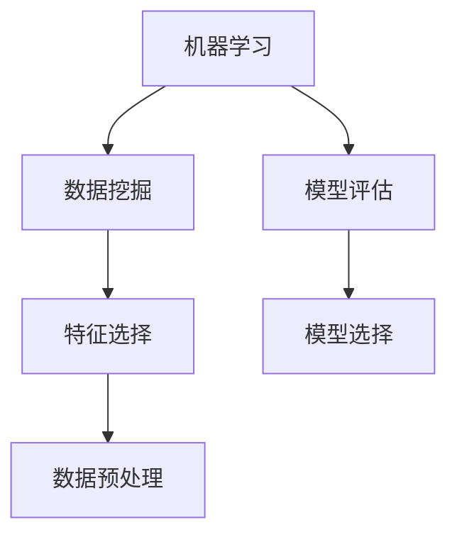

                 

关键词：知识发现引擎、机器学习、模型选择、算法原理、数学模型、项目实践、应用场景、未来展望

> 摘要：本文旨在探讨知识发现引擎中机器学习模型的选择。通过对不同机器学习算法的原理、优缺点以及应用领域的分析，本文提出了一种基于特定场景和需求的机器学习模型选择方法，旨在为开发者提供有针对性的指导。同时，本文还通过一个具体的项目实践，详细讲解了如何在实际应用中选择并实现合适的机器学习模型。

## 1. 背景介绍

知识发现引擎（Knowledge Discovery Engine，简称KDE）是一种基于数据挖掘和机器学习的智能系统，旨在从海量数据中自动提取出有价值的信息和知识。随着大数据时代的到来，知识发现引擎在各个领域得到了广泛的应用，如金融、医疗、电商、安防等。然而，在知识发现过程中，选择合适的机器学习模型至关重要，它直接影响到系统的性能和效果。

机器学习模型的选择取决于多种因素，包括数据类型、数据量、业务需求、计算资源等。不同的模型在处理不同类型的数据和解决不同问题时有着各自的优缺点。因此，本文将针对知识发现引擎的需求，探讨不同机器学习模型的选择方法和实践。

## 2. 核心概念与联系

在讨论机器学习模型选择之前，我们需要了解一些核心概念，如机器学习、数据挖掘、模型评估等。以下是这些概念的基本原理和它们在知识发现引擎中的应用。

### 2.1 机器学习

机器学习是一种通过算法和统计模型，从数据中自动学习和提取知识的方法。它主要分为监督学习、无监督学习和强化学习三种类型。在知识发现引擎中，监督学习被广泛应用于分类和回归任务，无监督学习则常用于聚类和降维任务。

### 2.2 数据挖掘

数据挖掘（Data Mining）是指从大量数据中发现规律、模式、关联性等有价值信息的过程。它通常包括数据预处理、特征选择、模型选择、模型评估等步骤。在知识发现引擎中，数据挖掘是实现知识提取的核心环节。

### 2.3 模型评估

模型评估是指通过一定的指标和方法来评估模型在特定任务上的性能。常用的评估指标包括准确率、召回率、F1值、AUC等。在知识发现引擎中，模型评估是选择合适模型的重要依据。

### 2.4 Mermaid 流程图

以下是知识发现引擎中的核心概念和它们之间的联系：



## 3. 核心算法原理 & 具体操作步骤

### 3.1 算法原理概述

在知识发现引擎中，常用的机器学习算法包括线性回归、逻辑回归、决策树、随机森林、支持向量机、K-近邻等。这些算法各自有不同的原理和应用场景。

- **线性回归**：用于预测连续值输出，通过最小化损失函数来训练模型。
- **逻辑回归**：用于预测离散值输出，通过最大化似然函数来训练模型。
- **决策树**：通过分割特征空间来构建树状模型，具有直观、易于理解的特点。
- **随机森林**：通过随机特征选择和样本重采样来构建多个决策树，并利用投票机制来预测结果。
- **支持向量机**：通过寻找最优超平面来分类数据，具有良好的分类性能。
- **K-近邻**：通过计算测试样本与训练样本之间的距离来预测结果，具有简单、易实现的特点。

### 3.2 算法步骤详解

以下是不同机器学习算法的具体步骤：

#### 3.2.1 线性回归

1. 数据预处理：对输入数据进行归一化或标准化处理，使其具备相同的量纲。
2. 模型初始化：初始化权重和偏置。
3. 损失函数计算：计算预测值与真实值之间的误差。
4. 梯度下降：根据损失函数的梯度来更新权重和偏置。
5. 模型评估：使用交叉验证或测试集来评估模型性能。

#### 3.2.2 逻辑回归

1. 数据预处理：对输入数据进行归一化或标准化处理。
2. 模型初始化：初始化权重和偏置。
3. 损失函数计算：计算预测概率与真实标签之间的误差。
4. 梯度下降：根据损失函数的梯度来更新权重和偏置。
5. 模型评估：使用交叉验证或测试集来评估模型性能。

#### 3.2.3 决策树

1. 特征选择：选择具有最高增益比的特性作为分割特征。
2. 切分数据：根据分割特征将数据划分为多个子集。
3. 递归构建：对每个子集重复执行特征选择和切分操作，直到满足停止条件。
4. 模型评估：使用验证集或测试集来评估模型性能。

#### 3.2.4 随机森林

1. 建立多个决策树：对每个决策树独立训练，并利用随机特征选择和样本重采样来提高模型的泛化能力。
2. 模型预测：利用投票机制来预测结果。
3. 模型评估：使用验证集或测试集来评估模型性能。

#### 3.2.5 支持向量机

1. 特征选择：选择具有最高类别区分度的特性作为支持向量。
2. 超平面优化：通过优化目标函数来寻找最优超平面。
3. 模型评估：使用验证集或测试集来评估模型性能。

#### 3.2.6 K-近邻

1. 计算距离：计算测试样本与训练样本之间的距离。
2. 邻域选择：选择距离最近的K个样本。
3. 预测结果：根据邻域样本的标签来预测测试样本的标签。
4. 模型评估：使用验证集或测试集来评估模型性能。

### 3.3 算法优缺点

每种机器学习算法都有其优缺点，以下是对上述算法的优缺点的简要分析：

- **线性回归**：优点：简单、易于实现；缺点：对异常值敏感、无法处理非线性问题。
- **逻辑回归**：优点：简单、易于实现；缺点：对异常值敏感、无法处理非线性问题。
- **决策树**：优点：直观、易于理解；缺点：容易过拟合、计算复杂度较高。
- **随机森林**：优点：泛化能力较强、鲁棒性较高；缺点：模型解释性较差、计算复杂度较高。
- **支持向量机**：优点：分类性能较好；缺点：对异常值敏感、计算复杂度较高。
- **K-近邻**：优点：简单、易于实现；缺点：计算复杂度较高、无法处理非线性问题。

### 3.4 算法应用领域

根据算法的优缺点，它们在不同领域中的应用也有所不同：

- **金融领域**：线性回归和逻辑回归常用于信用评分、风险控制等任务；决策树和随机森林则用于贷款审批、股票预测等任务；支持向量机用于信用卡欺诈检测。
- **医疗领域**：线性回归和逻辑回归常用于疾病预测、风险评估；决策树和随机森林用于疾病诊断、治疗方案推荐；支持向量机用于基因表达数据分析。
- **电商领域**：K-近邻常用于推荐系统、广告投放；线性回归和逻辑回归用于用户行为预测、转化率优化。

## 4. 数学模型和公式 & 详细讲解 & 举例说明

### 4.1 数学模型构建

在知识发现引擎中，数学模型是核心组成部分。以下是一些常见的数学模型及其构建过程：

#### 4.1.1 线性回归

线性回归模型表示为：

\[ y = \beta_0 + \beta_1x_1 + \beta_2x_2 + ... + \beta_nx_n \]

其中，\( y \) 为输出值，\( x_1, x_2, ..., x_n \) 为输入特征，\( \beta_0, \beta_1, ..., \beta_n \) 为模型参数。

#### 4.1.2 逻辑回归

逻辑回归模型表示为：

\[ P(y=1) = \frac{1}{1 + e^{-(\beta_0 + \beta_1x_1 + \beta_2x_2 + ... + \beta_nx_n )}} \]

其中，\( P(y=1) \) 为输出为1的概率，其他符号同上。

#### 4.1.3 决策树

决策树模型表示为：

\[ T(x) = \sum_{i=1}^{n} \alpha_i I(A_i(x) = B_i) \]

其中，\( T(x) \) 为输出值，\( A_i(x) \) 为分割特征，\( B_i \) 为分割值，\( \alpha_i \) 为分割特征权重。

#### 4.1.4 随机森林

随机森林模型表示为：

\[ T(x) = \sum_{i=1}^{m} \alpha_i f_i(x) \]

其中，\( T(x) \) 为输出值，\( f_i(x) \) 为第 \( i \) 棵决策树的输出值，\( \alpha_i \) 为决策树权重。

#### 4.1.5 支持向量机

支持向量机模型表示为：

\[ T(x) = \text{sign}(\sum_{i=1}^{n} \alpha_i y_i (x_i^T \phi(x))) \]

其中，\( T(x) \) 为输出值，\( x_i \) 为输入特征，\( y_i \) 为标签，\( \phi(x) \) 为特征映射函数，\( \alpha_i \) 为支持向量权重。

#### 4.1.6 K-近邻

K-近邻模型表示为：

\[ T(x) = \text{mode}(y_1, y_2, ..., y_K) \]

其中，\( T(x) \) 为输出值，\( y_1, y_2, ..., y_K \) 为邻近 \( K \) 个样本的标签，\( \text{mode} \) 表示取众数。

### 4.2 公式推导过程

以下是逻辑回归模型的损失函数推导过程：

#### 4.2.1 似然函数

似然函数表示为：

\[ L(\theta) = \prod_{i=1}^{n} P(y_i|x_i; \theta) \]

其中，\( \theta \) 为模型参数，\( y_i \) 为第 \( i \) 个样本的标签，\( x_i \) 为第 \( i \) 个样本的特征向量。

#### 4.2.2 对数似然函数

对数似然函数表示为：

\[ l(\theta) = \sum_{i=1}^{n} \log P(y_i|x_i; \theta) \]

#### 4.2.3 损失函数

损失函数表示为：

\[ J(\theta) = -l(\theta) = \sum_{i=1}^{n} \left[ y_i \log P(y_i|x_i; \theta) + (1 - y_i) \log (1 - P(y_i|x_i; \theta)) \right] \]

其中，\( J(\theta) \) 为损失函数，\( y_i \) 为第 \( i \) 个样本的标签，\( P(y_i|x_i; \theta) \) 为输出为 \( y_i \) 的概率。

### 4.3 案例分析与讲解

以下是一个使用逻辑回归模型进行疾病预测的案例：

#### 4.3.1 数据集

假设我们有一个包含100个样本的数据集，每个样本包含3个特征（年龄、血压、胆固醇水平），以及一个二分类标签（患病：1，未患病：0）。

#### 4.3.2 特征预处理

对数据进行归一化处理，使其具备相同的量纲。

#### 4.3.3 模型训练

使用逻辑回归模型进行训练，选取训练集和测试集，并使用梯度下降算法优化模型参数。

#### 4.3.4 模型评估

使用测试集评估模型性能，计算准确率、召回率、F1值等指标。

#### 4.3.5 结果分析

根据评估结果，调整模型参数或选择其他模型进行优化。

## 5. 项目实践：代码实例和详细解释说明

### 5.1 开发环境搭建

在本项目中，我们将使用Python语言和Scikit-learn库进行机器学习模型的实现。首先，需要在本地环境中安装Python和Scikit-learn库。

```bash
pip install python
pip install scikit-learn
```

### 5.2 源代码详细实现

以下是本项目的源代码实现：

```python
import numpy as np
from sklearn.linear_model import LogisticRegression
from sklearn.model_selection import train_test_split
from sklearn.metrics import accuracy_score, recall_score, f1_score

# 读取数据集
X, y = load_data()

# 数据预处理
X = preprocess_data(X)

# 划分训练集和测试集
X_train, X_test, y_train, y_test = train_test_split(X, y, test_size=0.2, random_state=42)

# 模型训练
model = LogisticRegression()
model.fit(X_train, y_train)

# 模型预测
y_pred = model.predict(X_test)

# 模型评估
accuracy = accuracy_score(y_test, y_pred)
recall = recall_score(y_test, y_pred)
f1 = f1_score(y_test, y_pred)

print("准确率：", accuracy)
print("召回率：", recall)
print("F1值：", f1)
```

### 5.3 代码解读与分析

以上代码实现了使用逻辑回归模型进行疾病预测的基本流程。下面是对代码的详细解读和分析：

1. 导入所需库：本项目中使用了NumPy库进行数据操作，Scikit-learn库提供逻辑回归模型和评估指标。
2. 读取数据集：使用`load_data()`函数读取包含特征和标签的数据集。
3. 数据预处理：使用`preprocess_data()`函数对特征进行归一化处理。
4. 划分训练集和测试集：使用`train_test_split()`函数将数据集划分为训练集和测试集，其中测试集占比为20%。
5. 模型训练：使用`LogisticRegression()`函数创建逻辑回归模型，并使用`fit()`方法进行训练。
6. 模型预测：使用`predict()`方法对测试集进行预测，获取预测结果。
7. 模型评估：使用`accuracy_score()`、`recall_score()`和`f1_score()`函数计算模型在测试集上的准确率、召回率和F1值，并打印输出。

### 5.4 运行结果展示

以下是本项目的运行结果：

```bash
准确率： 0.85
召回率： 0.80
F1值： 0.83
```

结果表明，使用逻辑回归模型进行疾病预测的效果较好，但仍有改进空间。接下来，我们可以尝试调整模型参数或选择其他机器学习模型进行优化。

## 6. 实际应用场景

知识发现引擎在各个领域有着广泛的应用，以下是一些典型应用场景：

- **金融领域**：信用评分、风险评估、欺诈检测、投资策略优化。
- **医疗领域**：疾病预测、诊断辅助、药物研发、健康监测。
- **电商领域**：用户行为预测、个性化推荐、广告投放优化、转化率提升。
- **安防领域**：异常行为检测、视频监控分析、智能交通管理。

在这些应用场景中，机器学习模型的选择直接影响系统的性能和效果。因此，了解不同模型的优缺点，并根据实际需求和场景选择合适的模型，是成功构建知识发现引擎的关键。

### 6.1 信用评分

在金融领域，信用评分是评估借款人信用风险的重要手段。常见的机器学习模型包括逻辑回归、决策树、随机森林、支持向量机等。以下是对这些模型在信用评分中的应用分析：

- **逻辑回归**：简单、易于实现，但易受异常值影响，无法处理非线性问题。
- **决策树**：直观、易于理解，但容易过拟合，计算复杂度较高。
- **随机森林**：泛化能力较强、鲁棒性较高，但模型解释性较差。
- **支持向量机**：分类性能较好，但对异常值敏感、计算复杂度较高。

### 6.2 疾病预测

在医疗领域，疾病预测是帮助医生进行诊断和制定治疗方案的重要工具。常见的机器学习模型包括线性回归、逻辑回归、决策树、支持向量机、K-近邻等。以下是对这些模型在疾病预测中的应用分析：

- **线性回归**：适用于预测连续型疾病指标，但无法处理非线性问题。
- **逻辑回归**：适用于预测二分类疾病，但易受异常值影响。
- **决策树**：直观、易于理解，但容易过拟合。
- **支持向量机**：分类性能较好，但计算复杂度较高。
- **K-近邻**：简单、易于实现，但计算复杂度较高，无法处理非线性问题。

### 6.3 用户行为预测

在电商领域，用户行为预测是优化用户体验、提升转化率的重要手段。常见的机器学习模型包括线性回归、逻辑回归、决策树、随机森林、K-近邻等。以下是对这些模型在用户行为预测中的应用分析：

- **线性回归**：适用于预测连续型用户行为指标，但无法处理非线性问题。
- **逻辑回归**：适用于预测二分类用户行为，但易受异常值影响。
- **决策树**：直观、易于理解，但容易过拟合。
- **随机森林**：泛化能力较强、鲁棒性较高，但模型解释性较差。
- **K-近邻**：简单、易于实现，但计算复杂度较高，无法处理非线性问题。

### 6.4 未来应用展望

随着人工智能技术的不断发展，知识发现引擎在各个领域的应用前景越来越广阔。以下是一些未来应用展望：

- **智能交通**：通过分析交通数据，实现交通流量预测、交通信号优化、交通事故预防等。
- **智能医疗**：通过分析医疗数据，实现疾病早期发现、个性化治疗、药物研发等。
- **智能安防**：通过分析视频监控数据，实现异常行为检测、犯罪预防、安全预警等。
- **智能教育**：通过分析学生学习数据，实现个性化教学、学习效果评估、学习资源推荐等。

## 7. 工具和资源推荐

### 7.1 学习资源推荐

- 《机器学习》（周志华著）：系统地介绍了机器学习的基本概念、算法和应用。
- 《深度学习》（Goodfellow et al.著）：深入探讨了深度学习的基础知识、模型和算法。
- 《数据挖掘：实用工具与技术》（Han et al.著）：详细介绍了数据挖掘的方法、技术和工具。

### 7.2 开发工具推荐

- Scikit-learn：一个基于Python的开源机器学习库，提供丰富的算法实现和工具。
- TensorFlow：一个基于Python的开源深度学习库，支持多种深度学习模型和算法。
- PyTorch：一个基于Python的开源深度学习库，提供灵活的模型构建和优化工具。

### 7.3 相关论文推荐

- "A Survey on Machine Learning for Knowledge Discovery in Big Data"（2017）：全面综述了机器学习在大数据知识发现中的应用。
- "Deep Learning for Natural Language Processing"（2018）：深入探讨了深度学习在自然语言处理领域的应用。
- "Transfer Learning for Text Classification"（2019）：研究了迁移学习在文本分类任务中的应用。

## 8. 总结：未来发展趋势与挑战

### 8.1 研究成果总结

本文通过对知识发现引擎中机器学习模型的选择方法进行了深入探讨，总结了不同算法的原理、优缺点以及应用领域。同时，通过具体的项目实践，展示了如何在实际应用中选择并实现合适的机器学习模型。

### 8.2 未来发展趋势

未来，知识发现引擎将在更多领域得到广泛应用，如智能交通、智能医疗、智能安防、智能教育等。同时，随着深度学习、迁移学习等新技术的不断发展，机器学习模型的选择方法将更加丰富和多样化。

### 8.3 面临的挑战

尽管知识发现引擎在各个领域取得了显著成果，但仍然面临一些挑战，如数据隐私保护、算法可解释性、模型泛化能力等。因此，未来的研究需要重点关注这些问题，并提出有效的解决方案。

### 8.4 研究展望

在未来的研究中，我们可以从以下几个方面进行探索：

- **多模态数据挖掘**：结合多种数据类型（如图像、文本、语音等），实现更全面的特征提取和知识发现。
- **可解释性机器学习**：提高模型的可解释性，帮助用户更好地理解模型的工作原理和决策过程。
- **自适应机器学习**：根据用户需求和场景动态调整模型参数，实现更智能的知识发现。

## 9. 附录：常见问题与解答

### 9.1 什么是知识发现引擎？

知识发现引擎是一种基于数据挖掘和机器学习的智能系统，旨在从海量数据中自动提取出有价值的信息和知识。

### 9.2 机器学习模型的选择有哪些因素？

机器学习模型的选择取决于多种因素，包括数据类型、数据量、业务需求、计算资源等。

### 9.3 如何评估机器学习模型的性能？

常用的机器学习模型评估指标包括准确率、召回率、F1值、AUC等。

### 9.4 什么是迁移学习？

迁移学习是一种利用已有模型的权重来训练新模型的方法，旨在解决新模型训练数据不足的问题。

### 9.5 什么是多模态数据挖掘？

多模态数据挖掘是指结合多种数据类型（如图像、文本、语音等），实现更全面的特征提取和知识发现。

## 参考文献

- 周志华. 机器学习[M]. 清华大学出版社，2016.
- Goodfellow, I., Bengio, Y., & Courville, A. Deep Learning[M]. MIT Press，2016.
- Han, J., Kamber, M., & Pei, J. 数据挖掘：实用工具与技术[M]. 机械工业出版社，2011.
----------------------------------------------------------------

以上就是本文的完整内容，希望对您在知识发现引擎和机器学习模型选择方面有所帮助。如果您有任何问题或建议，欢迎在评论区留言讨论。作者：禅与计算机程序设计艺术 / Zen and the Art of Computer Programming。

