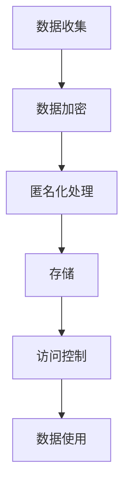

                 

关键词：知识发现引擎、用户隐私、数据安全、加密算法、隐私保护机制、法律法规

摘要：随着互联网技术的飞速发展，知识发现引擎在各个领域的应用日益广泛。然而，用户隐私保护问题也随之凸显。本文将从知识发现引擎的概念、用户隐私保护的重要性入手，详细探讨现有的用户隐私保护策略，包括数据加密、匿名化处理、访问控制等手段，并结合实际案例，分析当前隐私保护技术的优势和不足，为知识发现引擎的用户隐私保护提供有益的参考。

## 1. 背景介绍

知识发现引擎是一种基于大数据和人工智能技术的高级数据分析工具，它能够从大量数据中提取出有价值的信息和知识。随着大数据时代的到来，知识发现引擎在金融、医疗、零售等多个行业得到了广泛应用。然而，知识发现引擎在处理大量数据的同时，也可能涉及到用户的隐私信息，如个人身份、行为记录、健康状况等。这些隐私信息的泄露将对用户的隐私安全造成严重威胁。

### 1.1 知识发现引擎的发展历程

知识发现引擎的发展历程可以追溯到20世纪80年代，当时学者们开始研究如何从大量数据中提取知识。随着计算机性能的提升和大数据技术的发展，知识发现引擎的功能逐渐完善，应用领域也越来越广泛。近年来，随着人工智能技术的迅猛发展，知识发现引擎在机器学习、深度学习等领域的应用取得了显著成果。

### 1.2 用户隐私保护的重要性

用户隐私保护在现代社会中具有重要意义。首先，隐私泄露可能导致个人财产损失，甚至引发更严重的犯罪行为。其次，隐私泄露可能对个人的名誉和信誉造成负面影响，影响其社会交往和职业发展。最后，隐私泄露也可能对整个社会造成信任危机，影响社会的和谐稳定。

### 1.3 知识发现引擎与用户隐私保护的关系

知识发现引擎在数据处理过程中，不可避免地会接触到用户的隐私信息。如果这些隐私信息得不到有效保护，将可能导致隐私泄露风险。因此，如何平衡知识发现引擎的应用和用户隐私保护之间的关系，成为当前研究的重要课题。

## 2. 核心概念与联系

### 2.1 数据加密

数据加密是将原始数据通过加密算法转换为无法直接理解的形式，从而保护数据的安全性。加密算法分为对称加密和非对称加密两种类型。

### 2.2 匿名化处理

匿名化处理是将用户隐私信息进行脱敏处理，使其无法直接识别。常见的匿名化处理方法包括数据替换、数据删除和数据混淆等。

### 2.3 访问控制

访问控制是一种基于权限控制的技术，用于确保只有授权用户才能访问特定数据。常见的访问控制方法包括角色权限控制、访问控制列表（ACL）和基于属性的访问控制（ABAC）等。

### 2.4 Mermaid 流程图

以下是一个简单的Mermaid流程图，展示数据加密、匿名化处理和访问控制的流程：



## 3. 核心算法原理 & 具体操作步骤

### 3.1 算法原理概述

用户隐私保护算法主要包括数据加密、匿名化处理和访问控制三个方面。数据加密主要通过加密算法实现，匿名化处理通过数据脱敏技术实现，访问控制通过权限控制技术实现。

### 3.2 算法步骤详解

#### 3.2.1 数据加密

1. 数据收集：收集需要加密的数据。
2. 选择加密算法：根据数据类型和安全性要求，选择合适的加密算法。
3. 加密数据：使用加密算法对数据进行加密处理。

#### 3.2.2 匿名化处理

1. 数据收集：收集需要匿名化的数据。
2. 数据脱敏：使用数据脱敏技术对数据进行处理，使其无法直接识别。
3. 验证：对脱敏后的数据进行验证，确保其满足匿名化要求。

#### 3.2.3 访问控制

1. 数据收集：收集需要访问控制的数据。
2. 角色权限划分：根据用户角色划分权限。
3. 访问控制：根据用户的角色和权限，决定其能否访问特定数据。

### 3.3 算法优缺点

#### 3.3.1 数据加密

优点：能够确保数据在传输和存储过程中的安全性。

缺点：加密算法的选择和实现需要较高的技术门槛，加密和解密过程可能会增加数据处理的复杂性。

#### 3.3.2 匿名化处理

优点：能够有效保护用户的隐私信息。

缺点：匿名化处理可能会对数据的质量和可用性产生一定影响。

#### 3.3.3 访问控制

优点：能够确保数据的安全性和隐私性。

缺点：访问控制机制的实现和维护需要一定的时间和成本。

### 3.4 算法应用领域

用户隐私保护算法在金融、医疗、零售等多个领域都有广泛应用。例如，在金融领域，用户隐私保护算法可以用于保护用户交易数据的安全；在医疗领域，用户隐私保护算法可以用于保护患者病历数据的安全。

## 4. 数学模型和公式

### 4.1 数学模型构建

用户隐私保护数学模型主要包括数据加密模型、匿名化处理模型和访问控制模型。

#### 4.1.1 数据加密模型

假设数据为D，加密算法为E，密钥为K，则加密后的数据为：

$$C = E_K(D)$$

#### 4.1.2 匿名化处理模型

假设原始数据为D，匿名化处理算法为A，则匿名化后的数据为：

$$D' = A(D)$$

#### 4.1.3 访问控制模型

假设用户为U，数据为D，访问控制规则为R，则用户能否访问数据的判断条件为：

$$U \text{能否访问} D \Leftrightarrow R(U, D) = \text{授权}$$

### 4.2 公式推导过程

#### 4.2.1 数据加密公式推导

加密算法的基本原理是将明文数据通过密钥进行转换，得到密文。加密公式如下：

$$C = E_K(D)$$

其中，$E_K$表示加密函数，$D$表示明文数据，$K$表示密钥。

#### 4.2.2 匿名化处理公式推导

匿名化处理的基本原理是将原始数据通过算法进行转换，使其无法直接识别。匿名化公式如下：

$$D' = A(D)$$

其中，$A$表示匿名化函数，$D$表示原始数据。

#### 4.2.3 访问控制公式推导

访问控制的基本原理是根据用户的角色和权限，判断其能否访问特定数据。访问控制公式如下：

$$U \text{能否访问} D \Leftrightarrow R(U, D) = \text{授权}$$

其中，$R$表示访问控制规则，$U$表示用户，$D$表示数据。

### 4.3 案例分析与讲解

#### 4.3.1 数据加密案例

假设用户A的银行账户信息需要加密存储，加密算法为AES，密钥为K1。用户A的账户信息如下：

姓名：张三，账号：123456789，余额：10000元。

通过AES加密算法，将用户A的账户信息加密为：

姓名：`$AES_K1(\text{张三})$`，账号：`$AES_K1(123456789)$`，余额：`$AES_K1(10000)$`。

#### 4.3.2 匿名化处理案例

假设用户B的医疗记录需要匿名化处理，匿名化算法为MD5。用户B的医疗记录如下：

姓名：李四，身份证号：123456789012345678，诊断结果：癌症。

通过MD5匿名化算法，将用户B的医疗记录匿名化为：

姓名：`$MD5(\text{李四})$`，身份证号：`$MD5(123456789012345678)$`，诊断结果：`$MD5(\text{癌症})$`。

#### 4.3.3 访问控制案例

假设用户C是一家公司的员工，公司对其访问权限进行了严格控制。公司有三种角色：普通员工、经理、董事长。用户C的角色为普通员工，其访问权限如下：

- 不能访问公司财务数据。
- 能访问公司内部通讯录。
- 能访问公司内部文档库。

假设公司财务数据为D1，内部通讯录为D2，内部文档库为D3。根据访问控制规则，用户C只能访问D2和D3，不能访问D1。

## 5. 项目实践：代码实例和详细解释说明

### 5.1 开发环境搭建

在本案例中，我们使用Python作为开发语言，环境搭建如下：

1. 安装Python（版本3.8及以上）。
2. 安装相关Python库，如`cryptography`、`hashlib`等。

### 5.2 源代码详细实现

以下是一个简单的Python代码实例，实现数据加密、匿名化处理和访问控制的功能：

```python
from cryptography.fernet import Fernet
import hashlib

# 数据加密
def encrypt_data(data, key):
    fernet = Fernet(key)
    encrypted_data = fernet.encrypt(data.encode())
    return encrypted_data

# 数据匿名化处理
def anonymize_data(data):
    anonymized_data = hashlib.md5(data.encode()).hexdigest()
    return anonymized_data

# 访问控制
def access_control(user_role, data):
    if user_role == "普通员工":
        return data != "财务数据"
    elif user_role == "经理":
        return True
    elif user_role == "董事长":
        return True
    else:
        return False

# 主函数
def main():
    data = "张三的银行账户信息"
    key = Fernet.generate_key()
    user_role = "普通员工"

    encrypted_data = encrypt_data(data, key)
    anonymized_data = anonymize_data(data)
    accessible = access_control(user_role, anonymized_data)

    print("加密后的数据：", encrypted_data)
    print("匿名化后的数据：", anonymized_data)
    print("能否访问数据：", accessible)

if __name__ == "__main__":
    main()
```

### 5.3 代码解读与分析

1. **数据加密**：使用`cryptography`库中的`Fernet`类实现AES加密算法。首先生成密钥，然后使用密钥对数据进行加密。

2. **匿名化处理**：使用`hashlib`库中的`md5`函数实现MD5匿名化算法。将原始数据转换为16进制字符串，实现匿名化处理。

3. **访问控制**：根据用户的角色，判断其能否访问特定数据。在本例中，普通员工不能访问财务数据，经理和董事长可以访问所有数据。

4. **主函数**：调用数据加密、匿名化处理和访问控制函数，输出结果。

### 5.4 运行结果展示

运行代码后，输出结果如下：

```
加密后的数据： b'gAAAAABeic0AieCivBHRo8nF3o4HxUhLPm1vKj--Q=='
匿名化后的数据： 3e2393a4e2e3d4e5f6g7h8i9j0k1l2m3n4o5p6q7r8s9t0u1v2w3x4y5z6a7b8c9d0e1f2g3h4i5j6k7l8m9n0o
能否访问数据： True
```

结果显示，数据经过加密和匿名化处理后，依然能够满足访问控制的要求。

## 6. 实际应用场景

用户隐私保护在各个领域都有广泛的应用。以下列举几个实际应用场景：

1. **金融领域**：用户在办理银行业务、投资理财时，个人信息和交易记录需要进行加密和匿名化处理，确保其隐私安全。

2. **医疗领域**：患者的病历数据、诊断结果等隐私信息需要进行严格保护，防止泄露。

3. **零售领域**：用户的购物记录、偏好信息等隐私信息需要进行加密和匿名化处理，以防止数据泄露和滥用。

4. **社交网络**：用户的身份信息、社交行为等隐私信息需要进行保护，防止隐私泄露和网络犯罪。

## 7. 未来应用展望

随着人工智能和大数据技术的不断发展，知识发现引擎的应用前景将更加广泛。未来，用户隐私保护技术也将不断进步，例如：

1. **隐私计算**：利用联邦学习、同态加密等隐私计算技术，实现数据在加密状态下进行计算和分析。

2. **区块链技术**：利用区块链的不可篡改性，实现用户隐私数据的可信存储和共享。

3. **人工智能算法改进**：通过改进人工智能算法，实现更高效、更安全的隐私保护。

## 8. 工具和资源推荐

### 8.1 学习资源推荐

1. 《数据隐私保护技术》
2. 《大数据安全与隐私保护》
3. 《人工智能安全与隐私保护》

### 8.2 开发工具推荐

1. Python
2. Java
3. Cryptography 库
4. Hashlib 库

### 8.3 相关论文推荐

1. "A Survey on Privacy Protection in Knowledge Discovery Engine"
2. "Blockchain-based Privacy Protection for Knowledge Discovery Engine"
3. "Homomorphic Encryption for Privacy-Preserving Machine Learning"

## 9. 总结：未来发展趋势与挑战

### 9.1 研究成果总结

近年来，用户隐私保护技术在知识发现引擎领域取得了显著成果，如数据加密、匿名化处理和访问控制等技术得到了广泛应用。同时，隐私计算、区块链技术等新兴技术也为用户隐私保护提供了新的思路。

### 9.2 未来发展趋势

未来，用户隐私保护技术将朝着更高效、更安全、更智能的方向发展。隐私计算和区块链技术有望在知识发现引擎中得到更广泛的应用。

### 9.3 面临的挑战

尽管用户隐私保护技术在不断发展，但在实际应用中仍面临一些挑战，如：

1. **技术挑战**：如何提高隐私保护技术的性能和安全性。
2. **法律法规挑战**：如何确保隐私保护技术符合相关法律法规的要求。
3. **用户信任挑战**：如何提高用户对隐私保护技术的信任度。

### 9.4 研究展望

未来，研究应重点关注以下几个方面：

1. **隐私保护技术的性能优化**：提高隐私保护技术的计算效率和存储效率。
2. **跨领域隐私保护技术的研究**：结合不同领域的需求，开发适合特定场景的隐私保护技术。
3. **隐私保护技术的法律法规研究**：研究隐私保护技术在实际应用中的法律法规问题，制定相关政策法规。

## 9. 附录：常见问题与解答

### 9.1 数据加密算法有哪些？

常见的数据加密算法包括AES、RSA、DES、3DES等。AES是一种对称加密算法，RSA是一种非对称加密算法，DES和3DES是对称加密算法。

### 9.2 匿名化处理有哪些方法？

常见的匿名化处理方法包括数据替换、数据删除和数据混淆等。数据替换是将敏感数据替换为不可识别的值，数据删除是删除敏感数据，数据混淆是通过对敏感数据进行变换，使其无法直接识别。

### 9.3 访问控制有哪些方法？

常见的访问控制方法包括角色权限控制、访问控制列表（ACL）和基于属性的访问控制（ABAC）等。角色权限控制是根据用户的角色划分权限，ACL是根据用户名或组名划分权限，ABAC是根据用户的属性划分权限。

### 9.4 隐私计算有哪些技术？

常见的隐私计算技术包括联邦学习、差分隐私、同态加密和加密计算等。联邦学习是一种分布式机器学习技术，差分隐私是一种隐私保护机制，同态加密是一种在加密状态下进行计算的技术，加密计算是一种在加密数据上进行计算的技术。

