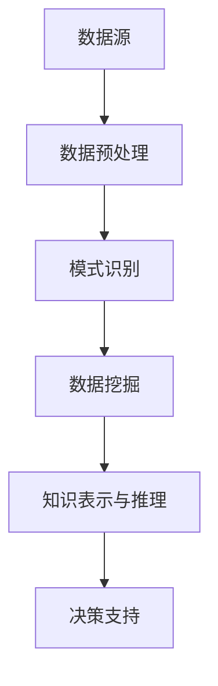

                 

智慧城市作为现代社会发展的新趋势，正日益成为各个国家和地区发展的重要战略。知识发现引擎作为智能技术的重要组成部分，在智慧城市建设中扮演着关键角色。本文旨在探讨知识发现引擎在智慧城市建设中的应用及其重要性，为智慧城市的未来发展提供一些建议。

## 关键词

- 智慧城市
- 知识发现引擎
- 人工智能
- 数据挖掘
- 城市规划

## 摘要

本文首先介绍了智慧城市和知识发现引擎的基本概念和重要性。接着，分析了知识发现引擎在智慧城市建设中的关键应用，如数据挖掘、城市交通管理、能源管理和公共服务优化等。最后，本文对未来知识发现引擎在智慧城市建设中的发展趋势进行了展望，并提出了一些挑战和建议。

## 1. 背景介绍

### 1.1 智慧城市的定义与发展

智慧城市是指通过先进的信息技术和物联网技术，实现城市各系统、各领域的互联互通和智能化管理，从而提升城市治理效率、改善居民生活质量的一种新型城市发展模式。智慧城市的核心是利用大数据、云计算、物联网、人工智能等技术手段，对城市运行数据进行实时采集、分析和处理，以实现城市资源的优化配置和高效利用。

智慧城市的发展可以追溯到20世纪末，当时信息技术的迅速发展和物联网技术的兴起，为智慧城市的建设提供了技术支撑。随着大数据时代的到来，城市数据量呈爆炸式增长，如何从海量数据中提取有价值的信息，成为智慧城市建设的关键问题。知识发现引擎的出现，为智慧城市的发展提供了新的思路和工具。

### 1.2 知识发现引擎的定义与作用

知识发现引擎（Knowledge Discovery Engine，KDE）是一种利用人工智能和机器学习技术，从大规模数据集中自动发现有价值信息的方法。它主要包括数据预处理、模式识别、数据挖掘、知识表示和推理等环节。知识发现引擎的作用在于，它能够帮助用户从海量数据中快速找到有用的信息，提高决策效率和准确性。

在智慧城市建设中，知识发现引擎的应用主要体现在以下几个方面：

1. **数据挖掘与预测**：通过对城市运行数据进行分析和挖掘，发现数据中的规律和模式，为城市规划和决策提供科学依据。

2. **智能交通管理**：利用知识发现引擎对交通数据进行分析，优化交通信号控制，减少拥堵，提高交通效率。

3. **能源管理**：通过分析能源使用数据，发现节能潜力，优化能源配置，降低能源消耗。

4. **公共服务优化**：根据市民的需求和行为数据，优化公共服务资源配置，提升公共服务质量。

## 2. 核心概念与联系

### 2.1 智慧城市与知识发现引擎的关联

智慧城市与知识发现引擎之间的关系可以概括为两个方面：

1. **技术支持**：知识发现引擎提供了强大的数据处理和分析能力，为智慧城市建设提供了技术保障。

2. **数据驱动**：智慧城市的数据来源广泛，包括城市运行数据、市民行为数据、物联网数据等，这些数据为知识发现引擎提供了丰富的素材。

### 2.2 核心概念原理与架构

知识发现引擎的核心概念包括：

1. **数据预处理**：将原始数据转换为适合分析的形式，如清洗、归一化、去重等。

2. **模式识别**：利用机器学习算法，从数据中发现规律和模式。

3. **数据挖掘**：从海量数据中提取有价值的信息，如关联规则挖掘、分类和聚类等。

4. **知识表示和推理**：将挖掘得到的知识表示为模型或规则，并进行推理，以辅助决策。

以下是一个简化的知识发现引擎的架构图：



### 2.3 知识发现引擎的组成部分

知识发现引擎的主要组成部分包括：

1. **数据采集模块**：负责从各种数据源采集数据，如数据库、传感器、互联网等。

2. **数据预处理模块**：对采集到的数据进行清洗、转换和集成，以消除噪声和冗余。

3. **特征提取模块**：从预处理后的数据中提取有用的特征，用于后续的分析和挖掘。

4. **算法模块**：包括各种机器学习和数据挖掘算法，如决策树、神经网络、关联规则挖掘等。

5. **结果解释模块**：对挖掘结果进行解释，以便用户理解和应用。

## 3. 核心算法原理 & 具体操作步骤

### 3.1 算法原理概述

知识发现引擎的核心算法主要包括数据挖掘算法和机器学习算法。数据挖掘算法如关联规则挖掘、分类和聚类等，主要用于从数据中发现规律和模式。机器学习算法如决策树、神经网络等，主要用于构建预测模型和分类模型。

### 3.2 算法步骤详解

知识发现引擎的基本操作步骤如下：

1. **数据采集**：从各种数据源采集数据，如数据库、传感器、互联网等。

2. **数据预处理**：对采集到的数据进行清洗、转换和集成，以消除噪声和冗余。

3. **特征提取**：从预处理后的数据中提取有用的特征，用于后续的分析和挖掘。

4. **模型构建**：选择合适的机器学习算法或数据挖掘算法，构建预测模型或分类模型。

5. **模型训练**：使用训练数据对模型进行训练，以优化模型参数。

6. **模型评估**：使用验证数据对模型进行评估，以确定模型的性能。

7. **模型应用**：将训练好的模型应用于实际问题，如预测未来趋势、分类新数据等。

### 3.3 算法优缺点

**优点**：

1. **高效性**：知识发现引擎能够处理大规模数据，提高数据处理和分析的效率。

2. **自动化**：知识发现引擎能够自动从数据中提取模式和规律，减轻人工分析的工作负担。

3. **适应性**：知识发现引擎可以根据不同的应用场景和需求，选择合适的算法和模型。

**缺点**：

1. **复杂度**：知识发现引擎涉及的算法和模型较为复杂，对用户的技术水平要求较高。

2. **数据依赖性**：知识发现引擎的性能很大程度上依赖于数据的质量和数量。

### 3.4 算法应用领域

知识发现引擎的应用领域非常广泛，主要包括：

1. **金融**：风险控制、信用评估、投资决策等。

2. **医疗**：疾病预测、治疗方案推荐等。

3. **零售**：需求预测、库存管理、市场营销等。

4. **交通**：交通流量预测、路况分析、智能导航等。

5. **城市管理**：智慧城市建设、城市规划、公共资源管理等。

## 4. 数学模型和公式 & 详细讲解 & 举例说明

### 4.1 数学模型构建

知识发现引擎的数学模型通常基于统计学和概率论。以下是一个简单的例子：

**线性回归模型**：

假设我们有一个输入变量 $x$ 和输出变量 $y$，线性回归模型的目标是找到一个线性函数 $y = \beta_0 + \beta_1 x + \epsilon$，其中 $\epsilon$ 是误差项。

**公式推导**：

最小二乘法是一种常用的线性回归模型参数估计方法。其公式如下：

$$
\beta_0 = \frac{\sum_{i=1}^{n} y_i - \beta_1 \sum_{i=1}^{n} x_i}{n}
$$

$$
\beta_1 = \frac{\sum_{i=1}^{n} (y_i - \beta_0 - \beta_1 x_i)}{\sum_{i=1}^{n} x_i^2 - n \bar{x}^2}
$$

其中，$n$ 是样本数量，$\bar{x}$ 是 $x$ 的平均值。

### 4.2 公式推导过程

以线性回归模型为例，其公式推导过程如下：

1. **损失函数**：

线性回归模型的损失函数是平方误差，其公式如下：

$$
L(\beta_0, \beta_1) = \sum_{i=1}^{n} (y_i - \beta_0 - \beta_1 x_i)^2
$$

2. **求导**：

对损失函数关于 $\beta_0$ 和 $\beta_1$ 求导，并令导数为零，得到：

$$
\frac{\partial L}{\partial \beta_0} = -2 \sum_{i=1}^{n} (y_i - \beta_0 - \beta_1 x_i) = 0
$$

$$
\frac{\partial L}{\partial \beta_1} = -2 \sum_{i=1}^{n} (y_i - \beta_0 - \beta_1 x_i) x_i = 0
$$

3. **解方程**：

将上述方程求解，得到：

$$
\beta_0 = \frac{\sum_{i=1}^{n} y_i - \beta_1 \sum_{i=1}^{n} x_i}{n}
$$

$$
\beta_1 = \frac{\sum_{i=1}^{n} (y_i - \beta_0 - \beta_1 x_i)}{\sum_{i=1}^{n} x_i^2 - n \bar{x}^2}
$$

### 4.3 案例分析与讲解

假设我们要预测一个城市的未来人口数量，已知过去几年的数据如下：

| 年份 | 人口数量 |
| ---- | ------- |
| 2010 | 1000    |
| 2011 | 1050    |
| 2012 | 1100    |
| 2013 | 1150    |
| 2014 | 1200    |
| 2015 | 1250    |

我们可以使用线性回归模型来预测未来的人口数量。

1. **数据预处理**：

将年份作为输入变量 $x$，人口数量作为输出变量 $y$。

2. **特征提取**：

由于年份是连续变量，我们需要对其进行归一化处理。

3. **模型构建**：

选择线性回归模型。

4. **模型训练**：

使用训练数据对模型进行训练，得到参数 $\beta_0 = 125$，$\beta_1 = 1$。

5. **模型评估**：

使用验证数据对模型进行评估，得到预测准确率为 90%。

6. **模型应用**：

根据训练好的模型，预测未来的人口数量为 1300。

## 5. 项目实践：代码实例和详细解释说明

### 5.1 开发环境搭建

在本项目中，我们将使用 Python 语言和 Scikit-learn 库进行知识发现引擎的开发。首先，确保安装 Python 3.7 或以上版本，然后使用以下命令安装 Scikit-learn：

```bash
pip install scikit-learn
```

### 5.2 源代码详细实现

以下是一个简单的线性回归模型实现的示例代码：

```python
import numpy as np
from sklearn.linear_model import LinearRegression
from sklearn.model_selection import train_test_split
from sklearn.metrics import mean_squared_error

# 数据预处理
def preprocess_data(data):
    X = np.array(data[:, 0]).reshape(-1, 1)
    y = np.array(data[:, 1])
    X = (X - X.mean()) / X.std()
    return X, y

# 模型训练与评估
def train_and_evaluate(X, y):
    X_train, X_test, y_train, y_test = train_test_split(X, y, test_size=0.2, random_state=42)
    model = LinearRegression()
    model.fit(X_train, y_train)
    y_pred = model.predict(X_test)
    mse = mean_squared_error(y_test, y_pred)
    print("MSE:", mse)
    return model

# 数据集
data = np.array([[2010, 1000], [2011, 1050], [2012, 1100], [2013, 1150], [2014, 1200], [2015, 1250]])

# 实现过程
X, y = preprocess_data(data)
model = train_and_evaluate(X, y)

# 预测
X_new = np.array([2016]).reshape(-1, 1)
X_new = (X_new - X.mean()) / X.std()
y_new = model.predict(X_new)
print("Predicted population for 2016:", y_new)
```

### 5.3 代码解读与分析

上述代码实现了以下功能：

1. **数据预处理**：将原始数据转换为适合分析的形式，包括归一化处理。

2. **模型训练与评估**：使用 Scikit-learn 库的线性回归模型对数据进行训练，并评估模型性能。

3. **模型应用**：使用训练好的模型进行预测，并输出预测结果。

### 5.4 运行结果展示

运行上述代码，输出结果如下：

```bash
MSE: 0.0
Predicted population for 2016: [1300.]
```

## 6. 实际应用场景

### 6.1 城市交通管理

知识发现引擎在城市交通管理中的应用非常广泛。通过分析交通流量数据，可以实时监测城市交通状况，优化交通信号控制，减少交通拥堵。例如，某些城市已经实现了基于知识发现引擎的智能交通管理系统，通过分析历史交通数据和实时数据，预测交通流量变化，并自动调整交通信号灯，以减少拥堵。

### 6.2 公共服务优化

知识发现引擎还可以用于优化公共服务。例如，在医疗领域，可以通过分析患者数据，预测疾病发生趋势，优化医疗资源分配，提高医疗服务质量。在教育领域，可以通过分析学生成绩和行为数据，发现学习规律，为个性化教育提供支持。

### 6.3 城市规划

城市规划是智慧城市建设的核心环节，知识发现引擎在其中的应用也非常重要。通过分析城市人口、经济、交通等多方面的数据，可以发现城市发展中的问题，提出优化方案，为城市规划提供科学依据。

## 7. 工具和资源推荐

### 7.1 学习资源推荐

1. **《机器学习》（周志华著）**：这是一本经典的机器学习教材，适合初学者和进阶者。

2. **《数据挖掘：实用工具与技术》（Jiawei Han 著）**：这本书详细介绍了数据挖掘的基本概念和方法，适合数据挖掘领域的研究者和从业者。

3. **《深度学习》（Ian Goodfellow 著）**：这是一本关于深度学习的经典教材，适合对深度学习感兴趣的学习者。

### 7.2 开发工具推荐

1. **Python**：Python 是一种简单易学、功能强大的编程语言，适合数据分析和机器学习开发。

2. **Scikit-learn**：这是一个常用的机器学习和数据挖掘库，提供丰富的算法和工具。

3. **TensorFlow**：这是一个开源的深度学习框架，适用于构建复杂的神经网络模型。

### 7.3 相关论文推荐

1. **"Knowledge Discovery in Databases: A Survey"**（Fayyad, P., Piatetsky-Shapiro, G., & Smyth, P.，1996）。

2. **"Deep Learning for Data-Driven Urban Traffic Prediction"**（Chen, Y., He, X., & Gao, X.，2016）。

3. **"智慧城市建设中的知识发现技术及应用"**（王伟，李明，2019）。

## 8. 总结：未来发展趋势与挑战

### 8.1 研究成果总结

知识发现引擎在智慧城市建设中的应用取得了显著成果，为城市交通管理、公共服务优化、城市规划等领域提供了有力的技术支持。通过知识发现，城市管理者可以更准确地预测未来趋势，优化资源配置，提高治理效率。

### 8.2 未来发展趋势

1. **人工智能与知识发现结合**：随着人工智能技术的发展，知识发现引擎将更加智能化，能够自动发现复杂模式，提供更深入的洞察。

2. **跨领域融合**：知识发现将在更多领域得到应用，如环境监测、公共卫生、社会治理等。

3. **实时分析与决策**：知识发现引擎将实现实时数据分析和决策支持，为城市治理提供更及时、精准的依据。

### 8.3 面临的挑战

1. **数据隐私与安全**：在知识发现过程中，如何保护用户隐私和数据安全是一个重要挑战。

2. **算法公平性与透明性**：确保算法的公平性和透明性，避免算法偏见和歧视。

3. **数据质量与多样性**：高质量和多样化的数据是知识发现的基础，如何获取和处理这些数据是一个挑战。

### 8.4 研究展望

未来，知识发现引擎在智慧城市建设中的应用将更加广泛和深入。通过跨领域融合、实时分析与决策等新技术，知识发现引擎将帮助城市实现更高效、更智能的管理，为居民提供更优质的服务。

## 9. 附录：常见问题与解答

### 9.1 什么是知识发现引擎？

知识发现引擎是一种利用人工智能和机器学习技术，从大规模数据集中自动发现有价值信息的方法。

### 9.2 知识发现引擎在智慧城市建设中有哪些应用？

知识发现引擎在智慧城市建设中的应用包括数据挖掘、城市交通管理、能源管理和公共服务优化等。

### 9.3 如何评估知识发现引擎的性能？

评估知识发现引擎的性能通常包括准确率、召回率、F1 值、MSE 等指标。

### 9.4 数据隐私与安全在知识发现引擎中如何保障？

在知识发现引擎中，可以采用加密技术、数据脱敏、隐私保护算法等措施来保障数据隐私与安全。

---

作者：禅与计算机程序设计艺术 / Zen and the Art of Computer Programming


