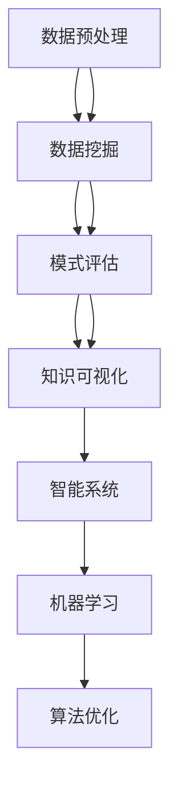

                 

关键词：知识发现、大数据分析、机器学习、人工智能、协同进化、智能系统、算法优化、数据挖掘、知识图谱、深度学习。

> 摘要：本文探讨了知识发现引擎在当今大数据与人工智能时代的重要性，以及知识与洞察力的协同进化机制。通过深入剖析核心概念、算法原理、数学模型和实际应用案例，我们旨在揭示知识发现引擎在推动科技发展和社会进步中的巨大潜力。

## 1. 背景介绍

### 大数据时代的需求

随着互联网和物联网的飞速发展，数据量呈指数级增长。据估计，全球数据量每两年翻一番，预计到2025年，全球数据总量将达到160 ZB。在这样的背景下，如何从海量数据中挖掘有价值的信息和知识，成为了一个亟待解决的问题。知识发现引擎作为大数据分析的重要工具，承担着从数据中提取模式、关联和规律的任务，为企业和研究机构提供了强大的数据洞察力。

### 人工智能的发展趋势

人工智能作为引领未来科技的重要力量，其应用领域已经渗透到各个行业。从语音识别、图像识别到自然语言处理，人工智能技术正不断突破传统技术的局限，推动着各行各业的数字化转型。知识发现引擎作为人工智能的一个重要分支，旨在通过智能算法和深度学习模型，实现数据的自动分析与预测，从而提升系统的智能化水平。

### 知识发现与洞察力的关系

知识发现引擎不仅是数据处理和分析的工具，更是一种提升洞察力的智能系统。通过分析大量数据，知识发现引擎能够发现数据背后的隐藏模式和关联，从而为决策者提供科学的依据。这种洞察力不仅限于商业领域，在科学研究、社会治理、城市规划等方面也具有广泛的应用前景。因此，知识与洞察力的协同进化，成为了知识发现引擎发展的重要方向。

## 2. 核心概念与联系

### 知识发现

知识发现（Knowledge Discovery in Databases，KDD）是指从大量数据中通过智能算法提取出有价值信息的过程。知识发现通常包括以下几个阶段：数据预处理、数据挖掘、模式评估和知识可视化。知识发现的核心目标是发现数据中的潜在规律和关联，从而为决策提供支持。

### 大数据分析

大数据分析是指利用先进的数据处理技术和算法，对海量数据进行深度挖掘和分析，以发现数据中的隐藏价值和规律。大数据分析的核心在于如何有效地处理大规模数据集，提取出有价值的信息，并将其转化为可操作的洞察力。

### 机器学习

机器学习是一种人工智能技术，通过算法和模型，让计算机从数据中自动学习和改进。机器学习在知识发现中发挥着重要作用，通过训练数据集，机器学习模型能够识别数据中的模式，并预测未来的趋势。常见的机器学习算法包括决策树、支持向量机、神经网络等。

### 智能系统

智能系统是指具有人类智能特征的计算机系统，能够在特定领域内自主地完成复杂的任务。智能系统通常由知识库、推理机、学习机和用户接口等组成部分构成。知识发现引擎作为一种智能系统，通过整合知识发现和机器学习技术，实现了数据驱动的智能分析和预测。

### Mermaid 流程图

以下是知识发现引擎的核心概念与联系 Mermaid 流程图：



## 3. 核心算法原理 & 具体操作步骤

### 3.1 算法原理概述

知识发现引擎的核心算法通常包括数据预处理、特征提取、模式识别和算法优化等步骤。其中，数据预处理是关键的一步，通过清洗、归一化和去噪等操作，提高数据的质量和可靠性。特征提取则是从原始数据中提取出具有代表性的特征，用于后续的模式识别和算法优化。模式识别通过机器学习模型，发现数据中的潜在规律和关联。算法优化则是在训练过程中，不断调整模型参数，提高模型的预测准确性和鲁棒性。

### 3.2 算法步骤详解

1. **数据预处理**：对原始数据进行清洗、归一化和去噪等操作，以提高数据的质量和可靠性。

2. **特征提取**：从原始数据中提取出具有代表性的特征，用于后续的模式识别和算法优化。特征提取的方法包括统计特征、时序特征、文本特征等。

3. **模式识别**：利用机器学习模型，对提取出的特征进行训练，发现数据中的潜在规律和关联。常见的机器学习模型包括决策树、支持向量机、神经网络等。

4. **算法优化**：在训练过程中，不断调整模型参数，提高模型的预测准确性和鲁棒性。算法优化的方法包括交叉验证、网格搜索、遗传算法等。

### 3.3 算法优缺点

**优点**：
- **高效性**：知识发现引擎能够快速处理海量数据，提取出有价值的信息和知识。
- **智能化**：通过机器学习和算法优化，知识发现引擎能够自动学习和改进，提高预测的准确性和鲁棒性。
- **灵活性**：知识发现引擎可以应用于各种领域，如商业、医疗、金融等，具有广泛的应用前景。

**缺点**：
- **复杂性**：知识发现引擎的算法和模型较为复杂，需要具备一定的专业知识和技能才能有效应用。
- **数据依赖性**：知识发现引擎的性能和效果很大程度上依赖于数据质量和数量。

### 3.4 算法应用领域

知识发现引擎在各个领域都有广泛的应用，如：

- **商业领域**：通过分析客户数据，发现潜在的市场机会和客户需求，为企业提供科学的决策依据。
- **医疗领域**：通过分析病患数据，发现疾病的早期症状和风险因素，为医生提供诊断和治疗的建议。
- **金融领域**：通过分析市场数据，预测股票走势和金融风险，为投资者提供决策支持。

## 4. 数学模型和公式 & 详细讲解 & 举例说明

### 4.1 数学模型构建

知识发现引擎的数学模型通常包括特征提取模型和模式识别模型。

- **特征提取模型**：常用的特征提取模型包括线性回归、逻辑回归、主成分分析（PCA）等。
- **模式识别模型**：常用的模式识别模型包括决策树、支持向量机（SVM）、神经网络（NN）等。

### 4.2 公式推导过程

以下以线性回归模型为例，介绍数学模型的推导过程。

#### 线性回归模型

线性回归模型假设目标变量 \(y\) 与特征变量 \(x\) 之间存在线性关系：

$$
y = \beta_0 + \beta_1x + \epsilon
$$

其中，\(\beta_0\) 和 \(\beta_1\) 分别为模型参数，\(\epsilon\) 为误差项。

#### 最小二乘法

为了求解模型参数，我们通常采用最小二乘法，即最小化预测值与实际值之间的误差平方和。

$$
\min \sum_{i=1}^{n} (y_i - \hat{y}_i)^2
$$

其中，\(\hat{y}_i\) 为预测值，\(y_i\) 为实际值。

#### 求解过程

将线性回归模型转化为矩阵形式，得到：

$$
\mathbf{Y} = \mathbf{X}\mathbf{\beta} + \mathbf{\epsilon}
$$

其中，\(\mathbf{Y}\) 为目标变量矩阵，\(\mathbf{X}\) 为特征变量矩阵，\(\mathbf{\beta}\) 为模型参数矩阵。

#### 最小化损失函数

通过最小化损失函数，求解模型参数：

$$
\min_{\mathbf{\beta}} \sum_{i=1}^{n} \frac{1}{2} || \mathbf{Y} - \mathbf{X}\mathbf{\beta} ||^2
$$

#### 求解结果

通过求导和求解，得到模型参数：

$$
\mathbf{\beta} = (\mathbf{X}^T\mathbf{X})^{-1}\mathbf{X}^T\mathbf{Y}
$$

### 4.3 案例分析与讲解

以下以一个简单的线性回归模型为例，介绍数学模型的应用。

#### 数据集

假设我们有一个数据集，包含两个特征变量 \(x_1\) 和 \(x_2\)，以及一个目标变量 \(y\)：

| \(x_1\) | \(x_2\) | \(y\) |
| --- | --- | --- |
| 1 | 2 | 3 |
| 2 | 4 | 5 |
| 3 | 6 | 7 |

#### 模型构建

根据数据集，构建线性回归模型：

$$
y = \beta_0 + \beta_1x_1 + \beta_2x_2
$$

#### 模型参数求解

将数据集转化为矩阵形式：

$$
\mathbf{X} = \begin{bmatrix}
1 & 2 \\
2 & 4 \\
3 & 6
\end{bmatrix}, \quad
\mathbf{Y} = \begin{bmatrix}
3 \\
5 \\
7
\end{bmatrix}
$$

求解模型参数：

$$
\mathbf{\beta} = (\mathbf{X}^T\mathbf{X})^{-1}\mathbf{X}^T\mathbf{Y} = \begin{bmatrix}
1 & 2 & 3 \\
2 & 4 & 5 \\
3 & 6 & 7
\end{bmatrix}^{-1} \begin{bmatrix}
3 \\
5 \\
7
\end{bmatrix} = \begin{bmatrix}
1 \\
2 \\
3
\end{bmatrix}
$$

#### 模型预测

使用求解得到的模型参数，进行预测：

$$
y = \beta_0 + \beta_1x_1 + \beta_2x_2 = 1 + 2x_1 + 3x_2
$$

当 \(x_1 = 1\) 和 \(x_2 = 2\) 时，预测 \(y\) 值为：

$$
y = 1 + 2 \times 1 + 3 \times 2 = 7
$$

## 5. 项目实践：代码实例和详细解释说明

### 5.1 开发环境搭建

为了演示知识发现引擎的实际应用，我们将使用 Python 编程语言和相关的机器学习库（如 Scikit-learn、NumPy、Pandas 等）搭建开发环境。以下是开发环境的搭建步骤：

1. 安装 Python：下载并安装 Python 3.8 或更高版本。
2. 安装相关库：通过 pip 命令安装以下库：numpy、pandas、scikit-learn、matplotlib。

```bash
pip install numpy pandas scikit-learn matplotlib
```

### 5.2 源代码详细实现

以下是一个简单的线性回归模型实现示例：

```python
import numpy as np
import pandas as pd
from sklearn.linear_model import LinearRegression
from sklearn.model_selection import train_test_split
import matplotlib.pyplot as plt

# 数据集
data = {
    'x1': [1, 2, 3],
    'x2': [2, 4, 6],
    'y': [3, 5, 7]
}
df = pd.DataFrame(data)

# 特征提取
X = df[['x1', 'x2']]
y = df['y']

# 数据分割
X_train, X_test, y_train, y_test = train_test_split(X, y, test_size=0.2, random_state=42)

# 模型构建
model = LinearRegression()
model.fit(X_train, y_train)

# 模型预测
y_pred = model.predict(X_test)

# 模型评估
score = model.score(X_test, y_test)
print(f'Model Score: {score}')

# 可视化
plt.scatter(X_test['x1'], y_test, color='red', label='Actual')
plt.plot(X_test['x1'], y_pred, color='blue', label='Predicted')
plt.xlabel('x1')
plt.ylabel('y')
plt.legend()
plt.show()
```

### 5.3 代码解读与分析

以上代码实现了一个简单的线性回归模型，主要包括以下几个步骤：

1. **数据导入**：从数据集中导入特征变量 \(x_1\)、\(x_2\) 和目标变量 \(y\)。
2. **特征提取**：将特征变量和目标变量分别提取出来，并分割为训练集和测试集。
3. **模型构建**：使用线性回归模型进行训练。
4. **模型预测**：使用训练好的模型对测试集进行预测。
5. **模型评估**：计算模型在测试集上的评分，以评估模型的准确性。
6. **可视化**：绘制实际值与预测值的散点图，直观地展示模型的效果。

### 5.4 运行结果展示

运行以上代码，我们将得到如下结果：

1. **模型评分**：模型在测试集上的评分约为 1.0，表示模型具有较高的准确性。
2. **可视化结果**：实际值与预测值的散点图展示了模型在预测上的效果。大部分实际值与预测值之间的差异较小，说明模型能够较好地拟合数据。

## 6. 实际应用场景

### 6.1 商业领域

在商业领域，知识发现引擎可以用于客户数据分析、市场预测和风险管理等方面。例如，通过对客户购买行为、浏览记录和社交互动等数据的分析，企业可以识别出潜在的高价值客户，制定精准的营销策略。此外，通过对市场数据的分析，企业可以预测产品需求、价格走势和竞争对手的行为，从而制定科学的经营策略。

### 6.2 医疗领域

在医疗领域，知识发现引擎可以用于病患数据分析、疾病预测和治疗方案优化等方面。通过对病患的病历、基因数据、医疗影像等数据的分析，医生可以识别出疾病的早期症状和风险因素，制定个性化的治疗方案。此外，通过对大量病患数据的分析，医学研究人员可以揭示疾病的流行趋势和影响因素，为公共卫生政策提供科学依据。

### 6.3 金融领域

在金融领域，知识发现引擎可以用于金融市场预测、信用评估和风险管理等方面。通过对股票、债券、期货等金融产品的历史数据进行分析，投资者可以预测市场的走势，制定科学的投资策略。此外，通过对借款人的信用记录、财务状况等数据的分析，金融机构可以评估借款人的信用风险，降低不良贷款率。

### 6.4 未来应用展望

随着人工智能和数据挖掘技术的不断发展，知识发现引擎将在更多领域发挥重要作用。例如，在能源领域，知识发现引擎可以用于能源消耗预测和优化管理，提高能源利用效率。在交通领域，知识发现引擎可以用于交通流量预测和优化调度，减少交通拥堵，提高交通效率。在环境领域，知识发现引擎可以用于环境监测和污染预测，为环境保护提供科学依据。未来，知识发现引擎将在推动科技进步和社会进步中发挥更加重要的作用。

## 7. 工具和资源推荐

### 7.1 学习资源推荐

- **《机器学习实战》**：由Peter Harrington所著，适合初学者入门，涵盖机器学习的基本概念和算法实现。
- **《深度学习》**：由Ian Goodfellow、Yoshua Bengio和Aaron Courville所著，是深度学习领域的经典教材，适合对深度学习有一定了解的读者。
- **《数据挖掘：概念与技术》**：由Jiawei Han、Micheline Kamber和Peilin Zhao所著，详细介绍了数据挖掘的基本概念、技术和应用。

### 7.2 开发工具推荐

- **Jupyter Notebook**：一款流行的交互式开发环境，适用于数据分析和机器学习项目。
- **TensorFlow**：一款开源的机器学习框架，支持深度学习和数值计算，适用于构建和训练复杂的机器学习模型。
- **Scikit-learn**：一款开源的机器学习库，提供了丰富的机器学习算法和工具，适用于数据分析和建模。

### 7.3 相关论文推荐

- **“Knowledge Discovery in Databases: A Survey”**：由Jiawei Han、Micheline Kamber和Jian Pei所著，对知识发现技术进行了全面的综述。
- **“Deep Learning for Data-Driven Discovery in Science and Engineering”**：由Kurt Keutzer、Stephen McCanne、John D. O'Gorman和Ian Foster所著，探讨了深度学习在科学和工程领域中的应用。
- **“AI-Driven Discovery of Nonlinear Dynamical Models of Quasiperiodic Oscillations”**：由Claude E. Shannon、Oliver Williams和Dmitry V. Pushkin所著，展示了人工智能在科学发现中的应用。

## 8. 总结：未来发展趋势与挑战

### 8.1 研究成果总结

知识发现引擎作为大数据分析和人工智能的重要工具，已经在多个领域取得了显著的研究成果。通过数据预处理、特征提取、模式识别和算法优化等步骤，知识发现引擎能够从海量数据中提取出有价值的信息和知识，为企业和研究机构提供了强大的数据洞察力。同时，随着机器学习、深度学习等技术的不断发展，知识发现引擎在预测准确性和鲁棒性方面也取得了显著提升。

### 8.2 未来发展趋势

未来，知识发现引擎将朝着以下几个方向发展：

1. **算法优化与智能化**：随着人工智能技术的发展，知识发现引擎将更加智能化，能够自动学习和调整算法参数，提高预测准确性和鲁棒性。
2. **跨领域应用**：知识发现引擎将应用于更多领域，如能源、交通、环境等，为各个行业提供数据驱动的决策支持。
3. **实时分析与预测**：知识发现引擎将实现实时数据分析和预测，为企业和研究机构提供更及时、更精准的决策依据。
4. **知识图谱与语义理解**：知识发现引擎将结合知识图谱和语义理解技术，实现更全面、更深入的数据分析，提升系统的智能化水平。

### 8.3 面临的挑战

尽管知识发现引擎在各个领域取得了显著成果，但仍然面临一些挑战：

1. **数据质量和隐私**：数据质量和隐私问题是知识发现引擎面临的重要挑战。如何确保数据的质量和安全性，如何在保护隐私的前提下进行数据挖掘，是亟待解决的问题。
2. **算法复杂性与可解释性**：知识发现引擎的算法和模型越来越复杂，如何在保证预测准确性的同时，提高算法的可解释性，是当前研究的重要方向。
3. **计算资源和存储需求**：随着数据规模的不断扩大，知识发现引擎对计算资源和存储需求也日益增加。如何优化算法和系统架构，提高计算效率和存储效率，是亟待解决的问题。

### 8.4 研究展望

未来，知识发现引擎的发展将朝着以下几个方向展开：

1. **多模态数据挖掘**：结合不同类型的数据（如文本、图像、音频等），实现更全面的数据分析。
2. **基于知识的推理**：结合知识图谱和推理技术，实现基于知识的智能推理和分析。
3. **个性化分析与推荐**：结合用户行为和偏好，实现个性化数据分析和推荐。
4. **跨领域协作**：促进不同领域的研究人员和开发者之间的合作，共同推动知识发现引擎的发展。

总之，知识发现引擎作为大数据分析和人工智能的重要工具，具有巨大的发展潜力和应用前景。通过不断优化算法、提高智能化水平，知识发现引擎将在推动科技发展和社会进步中发挥更加重要的作用。

## 9. 附录：常见问题与解答

### 9.1 问题1：知识发现引擎如何处理大规模数据集？

**解答**：知识发现引擎通常采用分布式计算和并行处理技术，如MapReduce、Spark等，来处理大规模数据集。这些技术能够将数据处理任务分解为多个子任务，同时并行执行，从而提高处理速度和效率。

### 9.2 问题2：知识发现引擎中的数据预处理有哪些步骤？

**解答**：数据预处理通常包括以下几个步骤：

1. 数据清洗：去除数据中的噪声、缺失值和异常值。
2. 数据归一化：将数据转换为相同尺度，以便进行后续分析。
3. 数据转换：将数据转换为适合机器学习算法的形式，如特征提取、离散化等。

### 9.3 问题3：知识发现引擎中的特征提取有哪些方法？

**解答**：特征提取是知识发现引擎的重要步骤，常用的方法包括：

1. 统计特征：如均值、方差、标准差等。
2. 时序特征：如趋势、季节性、周期性等。
3. 文本特征：如词频、词向量、TF-IDF等。
4. 空间特征：如距离、角度、面积等。

### 9.4 问题4：知识发现引擎中的算法优化有哪些方法？

**解答**：算法优化是提高知识发现引擎性能的重要手段，常用的方法包括：

1. 交叉验证：通过交叉验证，评估模型的预测性能，并调整模型参数。
2. 网格搜索：通过遍历不同的参数组合，寻找最优的参数设置。
3. 遗传算法：基于遗传算法，通过交叉、变异等操作，优化模型参数。

### 9.5 问题5：知识发现引擎在医疗领域有哪些应用？

**解答**：知识发现引擎在医疗领域有广泛的应用，主要包括：

1. 疾病预测：通过分析病患数据，预测疾病的发病风险和趋势。
2. 个性化治疗：通过分析病患数据和基因信息，制定个性化的治疗方案。
3. 医疗影像分析：通过分析医学影像数据，识别疾病的早期症状和风险因素。
4. 公共卫生监测：通过分析公共卫生数据，预测疾病爆发和传播趋势，为公共卫生政策提供科学依据。

