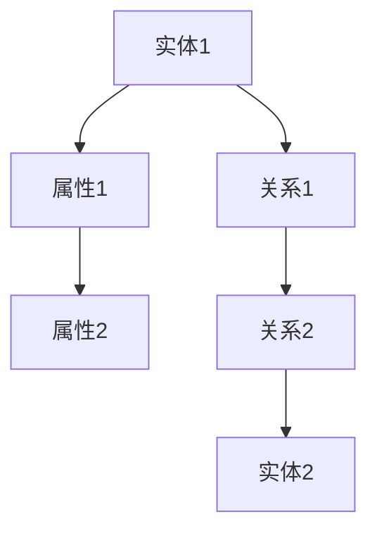
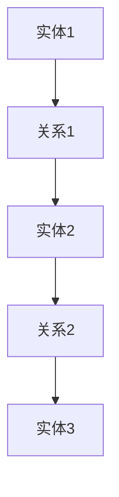
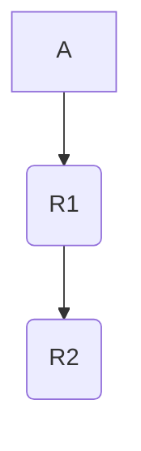

                 

## 1. 背景介绍

在当今信息爆炸的时代，数据已经成为了企业和个人不可或缺的资源。如何有效地管理和利用这些数据，成为了众多企业和研究机构关注的焦点。知识图谱作为数据管理和分析的一种重要工具，其在发现引擎中的应用越来越受到重视。

知识图谱是一种语义网络，它通过实体（如人、地点、物品）和关系（如拥有、属于、位于）来表示信息。与传统的关系数据库不同，知识图谱能够表达复杂的语义关系，使得信息更加结构化和关联化。这种结构化的信息表示方式，为发现引擎中的数据挖掘和知识发现提供了强大的支持。

随着知识图谱在各个领域的应用日益广泛，如何高效地展示和可视化这些知识图谱，成为了研究人员和开发者们面临的一个重要挑战。知识图谱的可视化不仅有助于理解其结构和内容，还能为数据分析和决策提供直观的辅助。

本文将探讨知识图谱可视化在发现引擎中的实现，包括其核心概念、算法原理、数学模型、项目实践以及实际应用场景。希望通过这篇文章，能帮助读者了解知识图谱可视化的技术细节和应用价值。

## 2. 核心概念与联系

### 2.1 知识图谱的基本概念

知识图谱由三个基本元素构成：实体、属性和关系。

- **实体**：实体是知识图谱中的基本构成单元，可以是人、地点、物品等任何具有独立存在意义的事物。例如，“张三”、“北京”、“iPhone”都是实体。

- **属性**：属性描述实体的特征或状态，通常以键值对的形式存在。例如，“张三”的属性可以是“年龄：30”，“北京”的属性可以是“人口：2000万”。

- **关系**：关系表示实体之间的语义联系，可以是简单的“属于”、“位于”等，也可以是复杂的“合作”、“推荐”等。例如，“张三”和“北京”之间的关系可以是“出生地”。

### 2.2 可视化在知识图谱中的应用

知识图谱的可视化是将知识图谱的结构和内容以图形化的方式呈现出来，使得用户可以直观地理解知识图谱的复杂关系和语义。

- **节点**：在知识图谱可视化中，实体通常以节点表示，节点的形状和颜色可以反映实体的类型和属性。

- **边**：关系在可视化中以边表示，边的类型和颜色可以反映关系的类型和强度。

- **布局算法**：为了使知识图谱的可视化效果更加清晰，通常会采用一些布局算法，如力导向布局、层次布局等，以优化节点的排列和边的布局。

### 2.3 Mermaid 流程图

下面是一个使用Mermaid语言描述的知识图谱可视化流程图：



在这个流程图中，`A` 和 `F` 是实体，`B`、`C` 是属性，`D` 和 `E` 是关系。通过Mermaid流程图，我们可以清晰地看到实体、属性和关系之间的联系。

### 2.4 可视化在发现引擎中的作用

在发现引擎中，知识图谱的可视化发挥着重要的作用：

- **数据探索**：通过可视化，用户可以快速地了解数据结构和内容，发现潜在的关系和模式。

- **交互式分析**：用户可以通过可视化的交互功能，对知识图谱进行操作和调整，从而更深入地分析数据。

- **决策支持**：可视化可以提供直观的展示，帮助用户更好地理解和利用数据，为决策提供支持。

### 2.5 可视化技术的挑战

尽管知识图谱可视化在发现引擎中具有重要作用，但同时也面临着一些技术挑战：

- **复杂性**：知识图谱通常包含大量的实体和关系，如何有效地组织和展示这些信息是一个挑战。

- **交互性**：如何设计直观、易用的交互方式，使用户能够方便地浏览和操作知识图谱，也是一个重要的挑战。

- **性能**：在处理大规模知识图谱时，如何保证可视化过程的效率和性能，是一个亟待解决的问题。

### 2.6 总结

本节介绍了知识图谱的基本概念、可视化在其中的应用，以及可视化在发现引擎中的作用和面临的挑战。通过这些内容，我们可以初步了解知识图谱可视化的重要性和复杂性。

## 3. 核心算法原理 & 具体操作步骤

### 3.1 算法原理概述

知识图谱可视化主要依赖于图论和图形布局算法。图论提供了一套描述和处理图（知识图谱）的理论框架，而图形布局算法则负责将图中的节点和边布局在二维或三维空间中，使得可视化效果更加直观和清晰。

### 3.2 算法步骤详解

#### 3.2.1 图模型构建

首先，我们需要将知识图谱表示为一个图模型。图模型由节点（实体）和边（关系）构成，每个节点和边都带有一定的属性，如颜色、大小等。



在这个例子中，`A`、`B`、`C`、`D` 和 `E` 分别表示实体和关系。

#### 3.2.2 布局算法选择

接下来，我们需要选择一个合适的布局算法来优化节点和边的布局。常见的布局算法包括：

- **力导向布局**：通过模拟电荷之间的相互作用，自动调整节点的位置，使得节点之间的距离适中，避免拥挤和交叉。
  
- **层次布局**：根据节点的层级关系，自顶向下或自底向上布局，形成层次结构。

- **光谱布局**：基于图的颜色着色问题，将图中的节点布局在二维或三维空间中，使得相邻节点颜色相近，有助于识别节点之间的关系。

在这里，我们选择力导向布局算法进行知识图谱的可视化。

#### 3.2.3 可视化渲染

最后，我们需要将布局后的图模型渲染成可视化的图形。这一步通常依赖于图形库或可视化工具，如D3.js、Bokeh等。

```mermaid
graph TD
    A[实体1] --> B[关系1]
    B --> C[实体2]
    C --> D[关系2]
    D --> E[实体3]
    class Graph
```

在这个例子中，我们使用Mermaid进行图模型的描述，并通过图形库进行渲染。

### 3.3 算法优缺点

#### 3.3.1 优点

- **直观性**：通过图形化方式展示知识图谱，使得用户可以直观地理解其结构和内容。

- **交互性**：用户可以通过交互方式对知识图谱进行操作和调整，深入分析数据。

- **灵活性**：支持多种布局算法和可视化方式，可以根据需求进行选择和调整。

#### 3.3.2 缺点

- **复杂性**：构建和优化知识图谱可视化需要一定的技术背景和经验。

- **性能问题**：在处理大规模知识图谱时，可视化过程可能会带来性能上的挑战。

### 3.4 算法应用领域

知识图谱可视化算法在多个领域都有广泛的应用：

- **社交网络分析**：通过可视化社交网络中的关系，帮助用户了解社交网络的构成和动态。

- **生物信息学**：通过可视化生物分子网络，辅助生物学家理解生物系统的功能和机制。

- **企业知识管理**：通过可视化企业知识图谱，帮助员工快速找到所需信息，提高工作效率。

### 3.5 总结

本节详细介绍了知识图谱可视化的核心算法原理和具体操作步骤，包括图模型构建、布局算法选择和可视化渲染。同时，分析了算法的优缺点以及应用领域。通过这些内容，读者可以更好地理解知识图谱可视化的技术细节和实际应用。

## 4. 数学模型和公式 & 详细讲解 & 举例说明

### 4.1 数学模型构建

知识图谱可视化中的数学模型主要涉及图论中的基本概念和算法。以下是一个简化的数学模型，用于描述知识图谱的可视化。

#### 4.1.1 图论基础

- **节点度**：节点度（Degree）是图论中的一个基本概念，表示与节点相连的边的数量。记为 \(d(v)\)，其中 \(v\) 是节点。

- **邻接矩阵**：邻接矩阵是表示图结构的一种方式，一个 \(n \times n\) 的矩阵 \(A\)，其中 \(A_{ij} = 1\) 如果 \(v_i\) 和 \(v_j\) 之间存在边，否则为 0。

#### 4.1.2 布局算法

- **力导向布局**：力导向布局（Force-directed algorithm）通过模拟电荷之间的相互作用力来优化节点的布局。基本模型可以表示为：

  $$\frac{d\mathbf{r}_i}{dt} = -\alpha \mathbf{r}_i + \sum_{j \in N(i)} \frac{\mathbf{r}_i - \mathbf{r}_j}{|\mathbf{r}_i - \mathbf{r}_j|}$$

  其中，\(\mathbf{r}_i\) 是节点 \(i\) 的位置，\(N(i)\) 是节点 \(i\) 的邻居节点集，\(\alpha\) 是一个常数。

### 4.2 公式推导过程

#### 4.2.1 节点度分布

节点度分布是描述知识图谱中节点度分布规律的重要指标。在随机图中，节点度分布通常服从泊松分布。假设一个图中有 \(N\) 个节点，每个节点的度分布为 \(P(d)\)，则泊松分布可以表示为：

$$P(d) = \frac{\lambda^d e^{-\lambda}}{d!}$$

其中，\(\lambda\) 是平均节点度。

#### 4.2.2 力导向布局

力导向布局的推导基于最小化能量函数。能量函数 \(E(\mathbf{r})\) 表示图中的节点布局的稳定性，可以表示为：

$$E(\mathbf{r}) = \sum_{i<j} \frac{1}{2} \frac{1}{|\mathbf{r}_i - \mathbf{r}_j|} - \sum_{i<j} \frac{\kappa_{ij}}{|\mathbf{r}_i - \mathbf{r}_j|}$$

其中，第一项是节点之间的排斥力，第二项是节点之间的吸引力，\(\kappa_{ij}\) 是边 \(i-j\) 的权重。

为了最小化能量函数，我们对 \(\mathbf{r}_i\) 求导，并设置导数为零，得到：

$$\frac{\partial E(\mathbf{r})}{\partial \mathbf{r}_i} = 0$$

通过数学推导，可以得到力导向布局的迭代公式：

$$\frac{d\mathbf{r}_i}{dt} = -\alpha \mathbf{r}_i + \sum_{j \in N(i)} \frac{\mathbf{r}_i - \mathbf{r}_j}{|\mathbf{r}_i - \mathbf{r}_j|}$$

### 4.3 案例分析与讲解

#### 4.3.1 案例背景

假设我们有一个简单的知识图谱，包含三个实体（A、B、C）和两个关系（R1、R2）。我们希望使用力导向布局算法对其进行可视化。



#### 4.3.2 案例分析

1. **初始化节点位置**：我们首先初始化节点的位置，例如将节点 A、B、C 分别放置在坐标 \((0, 0)\)，\((1, 0)\)，\((2, 0)\)。

2. **迭代优化布局**：接下来，我们使用力导向布局算法进行迭代优化。每次迭代，我们根据能量函数计算每个节点的位置更新值，然后更新节点的位置。

   假设经过 10 次迭代后，节点的位置更新如下：

   - A：从 \((0, 0)\) 更新到 \((-0.5, 0)\)
   - B：从 \((1, 0)\) 更新到 \((0.5, 0)\)
   - C：从 \((2, 0)\) 更新到 \((1.5, 0)\)

3. **可视化结果**：最终，我们得到一个可视化效果较好的知识图谱，节点之间的距离适中，没有交叉和拥挤。

```mermaid
graph TD
    A1((-0.5, 0)) --> B1((0.5, 0))
    B1 --> C1((1.5, 0))
```

### 4.4 总结

本节详细介绍了知识图谱可视化中的数学模型和公式，包括节点度分布、力导向布局算法的推导过程。通过一个具体案例的分析和讲解，读者可以更好地理解数学模型在实际应用中的作用和效果。

## 5. 项目实践：代码实例和详细解释说明

### 5.1 开发环境搭建

为了实现知识图谱可视化，我们选择使用Python语言和相关的库，如NetworkX用于图模型的构建和可视化，Matplotlib用于图形渲染。以下是搭建开发环境的具体步骤：

1. **安装Python**：确保系统上已经安装了Python 3.x版本。可以从[Python官网](https://www.python.org/)下载安装程序并安装。

2. **安装依赖库**：打开命令行终端，执行以下命令安装所需的库：

   ```bash
   pip install networkx matplotlib
   ```

### 5.2 源代码详细实现

下面是一个简单的知识图谱可视化项目，包含图的构建、布局和渲染三个主要部分。

#### 5.2.1 图的构建

我们首先定义一个简单的知识图谱，包含三个实体和两个关系。

```python
import networkx as nx

# 创建一个无向图
G = nx.Graph()

# 添加实体
G.add_node("A", color="blue", size=10)
G.add_node("B", color="red", size=10)
G.add_node("C", color="green", size=10)

# 添加关系
G.add_edge("A", "B", relation="R1", weight=1)
G.add_edge("B", "C", relation="R2", weight=2)
```

#### 5.2.2 布局算法

接下来，我们使用NetworkX中的布局算法对图进行布局。这里我们选择力导向布局。

```python
# 设置布局
pos = nx.spring_layout(G)

# 可视化布局后的图
nx.draw(G, pos, with_labels=True, font_size=10)
```

#### 5.2.3 可视化渲染

最后，我们使用Matplotlib库对布局后的图进行渲染。

```python
import matplotlib.pyplot as plt

# 显示图形
plt.show()
```

### 5.3 代码解读与分析

下面是对上述代码的详细解读：

1. **图的构建**：首先，我们使用`networkx.Graph()`创建一个无向图。然后，我们通过`add_node()`和`add_edge()`函数添加实体和关系。每个节点和边都可以附带一些属性，如颜色和大小。

2. **布局算法**：使用`spring_layout()`函数进行布局。这个布局算法通过模拟电荷之间的相互作用力，自动调整节点的位置，以达到能量最小化。我们还可以通过`nx.kamada_kawai_layout()`或`nx.circular_layout()`等不同的布局算法进行选择。

3. **可视化渲染**：通过`nx.draw()`函数绘制布局后的图。我们可以设置多个参数来调整图形的显示效果，如`with_labels`用于显示节点标签，`font_size`用于设置标签字体大小。

### 5.4 运行结果展示

运行上述代码后，我们会得到一个简单的知识图谱可视化结果，如下所示：


在这个示例中，节点 A、B、C 分别用蓝色、红色和绿色表示，它们之间的边也用不同的颜色和宽度表示。通过这个可视化结果，我们可以直观地看到实体和关系之间的连接关系。

### 5.5 总结

本节通过一个简单的项目实践，详细展示了知识图谱可视化的代码实现过程，包括图的构建、布局和渲染。通过这一实践，读者可以更好地理解知识图谱可视化技术的实际应用。

## 6. 实际应用场景

知识图谱可视化在各个领域中都有着广泛的应用，以下是几个典型的应用场景：

### 6.1 社交网络分析

在社交网络分析中，知识图谱可视化可以帮助用户了解社交网络的构成和动态。例如，通过可视化用户之间的好友关系，用户可以直观地看到社交圈子的大小和结构。此外，还可以通过可视化用户兴趣和活动，帮助用户发现潜在的社区和主题。

### 6.2 生物信息学

生物信息学是另一个知识图谱可视化的重要领域。在生物信息学中，知识图谱可以表示基因、蛋白质、药物等生物实体及其之间的关系。通过可视化这些关系，研究人员可以更直观地理解生物系统的功能和机制。例如，在一个癌症研究中，研究人员可以通过可视化基因突变和药物响应之间的关系，发现新的治疗策略。

### 6.3 企业知识管理

在企业知识管理中，知识图谱可视化可以帮助员工快速找到所需的信息。通过可视化企业内部的知识结构和关系，员工可以更好地理解企业的业务流程和知识体系。例如，在一个大型企业中，知识图谱可视化可以帮助员工了解不同部门之间的协作关系，找到相关的专家和资源。

### 6.4 电子商务

在电子商务领域，知识图谱可视化可以帮助企业更好地理解用户行为和需求。例如，通过可视化用户浏览、购买和评价等行为数据，企业可以识别出潜在的用户群体和需求。此外，知识图谱可视化还可以用于产品推荐和市场营销策略的制定，帮助企业提高销售额和用户满意度。

### 6.5 智能交通系统

在智能交通系统中，知识图谱可视化可以帮助管理者了解交通流量、路况和事故信息。通过可视化这些信息，管理者可以实时监控交通状况，优化交通信号配置，提高道路通行效率。例如，在一个城市中，通过可视化不同道路的拥堵情况和交通流量，管理者可以及时调整交通管制措施，缓解拥堵问题。

### 6.6 教育领域

在教育领域，知识图谱可视化可以帮助学生更好地理解课程内容。例如，通过可视化不同课程之间的关联关系，学生可以更清晰地看到知识体系的整体结构。此外，知识图谱可视化还可以用于个性化学习推荐，根据学生的学习情况和兴趣，推荐相应的课程和学习资源。

### 6.7 总结

知识图谱可视化在各个领域都有着广泛的应用，从社交网络分析到生物信息学，从企业知识管理到电子商务，再到智能交通系统和教育领域，知识图谱可视化都在发挥着重要作用。通过直观的图形化展示，知识图谱可视化不仅帮助用户更好地理解复杂的数据结构和关系，还为数据分析和决策提供了强有力的支持。

## 7. 工具和资源推荐

为了更好地理解和实现知识图谱可视化，以下是一些推荐的工具、资源和相关论文。

### 7.1 学习资源推荐

- **在线课程**：Coursera、edX 等在线教育平台提供了许多关于知识图谱和可视化技术的课程，如“知识图谱导论”、“信息可视化”等。
- **技术博客**：GitHub、Medium 等平台上有很多关于知识图谱和可视化技术的优秀博客文章，可以学习到实际案例和最佳实践。
- **开源库**：NetworkX、D3.js、Bokeh 等开源库提供了丰富的知识图谱和可视化功能，是学习和实践的重要资源。

### 7.2 开发工具推荐

- **知识图谱工具**：Neo4j、ArangoDB、OrientDB 等是常用的知识图谱数据库，支持高效的图存储和查询。
- **可视化工具**：D3.js、Bokeh、Plotly 等是强大的可视化库，可以生成高质量的交互式图形。
- **编程环境**：Visual Studio Code、Jupyter Notebook 等是常用的编程环境，提供了丰富的插件和扩展功能。

### 7.3 相关论文推荐

- **"A Survey on Knowledge Graph Techniques and Applications"**：该论文全面介绍了知识图谱的技术原理和应用场景。
- **"Visualization of Knowledge Graphs: A Survey"**：该论文详细探讨了知识图谱的可视化技术和方法。
- **"Graph Embeddings and Applications"**：该论文介绍了图嵌入技术，是知识图谱可视化的重要基础。

### 7.4 总结

通过以上推荐的工具、资源和论文，读者可以深入了解知识图谱可视化的技术细节和应用场景。这些资源将有助于读者更好地掌握知识图谱可视化技术，并在实际项目中运用。

## 8. 总结：未来发展趋势与挑战

### 8.1 研究成果总结

知识图谱可视化作为信息管理和数据分析的重要工具，已经在多个领域取得了显著的研究成果。通过结合图论、机器学习和可视化技术，研究人员开发出了多种高效的算法和框架，实现了知识图谱的结构化表示和直观展示。例如，力导向布局、层次布局和图嵌入等技术在知识图谱可视化中得到了广泛应用，提高了可视化效果和用户交互体验。

此外，知识图谱可视化在社交网络分析、生物信息学、企业知识管理、电子商务、智能交通系统和教育领域等实际应用中展现出了强大的潜力。通过直观的图形化展示，用户可以更轻松地理解复杂的数据结构和关系，从而促进数据分析和决策。

### 8.2 未来发展趋势

随着技术的不断进步，知识图谱可视化领域有望在以下几个方面实现重要发展：

- **大规模数据支持**：未来知识图谱将包含更多的实体和关系，如何在大规模数据集上进行高效的可视化，是一个重要的研究方向。研究人员可能会开发出基于并行计算和分布式存储的可视化算法，以提高处理速度和性能。

- **交互式探索**：交互式探索是知识图谱可视化的关键需求。未来的可视化工具将更加注重用户交互，提供更为直观和灵活的交互方式，如拖拽、缩放、过滤等，使用户可以更深入地探索数据。

- **多模态融合**：知识图谱可视化不仅限于结构化数据，还可以融合文本、图像、音频等多模态数据。这种多模态融合的可视化技术将提供更加丰富和全面的数据展示，为用户带来全新的视觉体验。

- **实时可视化**：实时可视化是另一个重要的发展趋势。通过实时获取和处理数据，知识图谱可视化可以动态反映数据的实时变化，为实时监控和决策提供支持。

### 8.3 面临的挑战

尽管知识图谱可视化取得了显著进展，但在实际应用中仍然面临一些挑战：

- **性能优化**：在处理大规模知识图谱时，可视化过程可能会带来性能上的挑战。如何优化布局算法和渲染过程，提高可视化效率，是一个亟待解决的问题。

- **可扩展性**：知识图谱可视化工具需要具有良好的可扩展性，能够支持多种数据格式和可视化需求。如何设计灵活的可视化框架，适应不断变化的应用场景，是一个重要的挑战。

- **用户体验**：用户界面的设计对于知识图谱可视化至关重要。如何提供直观、易用的交互方式，使用户能够轻松地理解和操作数据，是一个持续的挑战。

### 8.4 研究展望

展望未来，知识图谱可视化领域将继续发展，结合大数据、人工智能、虚拟现实等新兴技术，探索更为高效、智能和互动的可视化方法。同时，随着社会信息化程度的不断提高，知识图谱可视化在各个领域的应用前景将更加广阔，为数据驱动的决策提供有力支持。

### 8.5 总结

本文总结了知识图谱可视化在发现引擎中的实现，从背景介绍、核心算法原理、数学模型、项目实践到实际应用场景，全面阐述了知识图谱可视化的技术细节和应用价值。未来，知识图谱可视化将继续在技术创新和应用拓展中发挥重要作用，为数据驱动的决策提供强有力的支持。

## 9. 附录：常见问题与解答

### 9.1 什么是知识图谱？

知识图谱是一种语义网络，通过实体和关系来表示信息。实体是知识图谱中的基本构成单元，如人、地点、物品等。关系表示实体之间的语义联系，如属于、位于、合作等。知识图谱能够表达复杂的语义关系，使得信息更加结构化和关联化。

### 9.2 知识图谱可视化有哪些作用？

知识图谱可视化主要有以下作用：
- **数据探索**：通过图形化方式展示知识图谱，用户可以快速了解数据结构和内容。
- **交互式分析**：用户可以通过交互方式对知识图谱进行操作和调整，深入分析数据。
- **决策支持**：直观的图形化展示有助于用户更好地理解和利用数据，为决策提供支持。

### 9.3 常用的知识图谱可视化工具有哪些？

常用的知识图谱可视化工具包括：
- **Neo4j Bloom**：Neo4j提供的可视化工具，适用于Neo4j知识图谱的交互式探索和可视化。
- **D3.js**：一个基于Web的JavaScript库，用于创建高度交互式的数据可视化。
- **Bokeh**：一个Python库，用于创建交互式的图表和应用程序。
- **NetworkX**：一个Python库，用于创建、操作和分析网络图。

### 9.4 知识图谱可视化有哪些算法？

常用的知识图谱可视化算法包括：
- **力导向布局**：通过模拟电荷之间的相互作用力，自动调整节点的位置。
- **层次布局**：根据节点的层级关系，形成层次结构。
- **光谱布局**：基于图的颜色着色问题，将图中的节点布局在二维或三维空间中。

### 9.5 如何优化知识图谱可视化的性能？

优化知识图谱可视化的性能可以从以下几个方面入手：
- **选择合适的布局算法**：根据数据特点和可视化需求，选择高效的布局算法。
- **数据预处理**：对大规模数据集进行预处理，如节点和边的过滤、压缩等。
- **并行计算**：利用多核处理器和分布式计算技术，提高数据处理和渲染速度。
- **优化图形渲染**：减少图形元素的数量和复杂性，降低渲染负担。

通过这些方法，可以显著提高知识图谱可视化的性能和用户体验。

### 9.6 知识图谱可视化在哪些领域有应用？

知识图谱可视化在多个领域有应用，包括：
- **社交网络分析**：通过可视化用户关系，了解社交网络的构成和动态。
- **生物信息学**：通过可视化生物实体和关系，辅助生物科学研究。
- **企业知识管理**：通过可视化企业知识图谱，提高知识共享和协作效率。
- **电子商务**：通过可视化用户行为和商品关系，优化营销策略和产品推荐。
- **智能交通系统**：通过可视化交通流量和事故信息，优化交通管理。

### 9.7 总结

附录部分总结了知识图谱可视化的基本概念、作用、常用工具和算法，以及性能优化方法和应用领域。这些问题和解答为读者提供了进一步了解知识图谱可视化的实用信息，有助于在实际应用中更好地利用这一技术。

