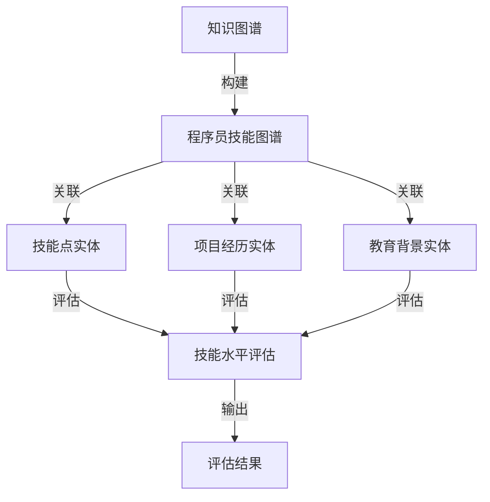

                 

## 1. 背景介绍

随着信息技术的飞速发展，编程技能已经成为了现代职场中不可或缺的一部分。然而，面对海量的编程技能和技术，如何有效地对程序员的技术能力进行评估和培养，成为了企业和个人面临的重大挑战。传统的技能评估方法往往依赖于面试和项目经历，这种方式不仅耗时费力，而且评估结果往往不够准确和全面。为了解决这一问题，知识图谱作为一种新兴的技术，被广泛应用于程序员技能图谱的构建。

知识图谱（Knowledge Graph）是一种基于语义网（Semantic Web）的信息组织方法，它通过实体、属性和关系之间的关联，将海量数据以结构化、语义化的形式进行组织。知识图谱的核心在于其能够揭示数据之间的隐含关系，从而为数据分析和智能推理提供强大的支持。

在程序员技能图谱的构建中，知识图谱的作用主要体现在以下几个方面：

1. **全面性**：知识图谱能够将程序员所掌握的各种技能和技术抽象为实体，并建立它们之间的复杂关系，从而实现全面的技术能力描述。

2. **准确性**：通过知识图谱中的关系和属性，可以精确地衡量程序员在不同技术领域的专业水平，避免了传统评估方法的模糊性和主观性。

3. **动态性**：知识图谱能够实时更新，反映程序员技能的动态变化，从而实现持续的技术能力监控。

4. **智能化**：知识图谱中的关联关系能够支持智能推荐和决策，为企业和个人提供个性化的技术学习和职业发展建议。

本文将深入探讨知识图谱在程序员技能图谱构建中的应用，通过阐述核心概念、算法原理、数学模型和项目实践，为广大开发者提供有益的参考。

## 2. 核心概念与联系

### 2.1 知识图谱的定义

知识图谱是一种结构化知识库，它通过实体、属性和关系的网状结构，实现对复杂数据的语义理解和关联分析。在知识图谱中，实体表示具体的事物或概念，属性描述实体的特征，关系则表达实体之间的关联。

### 2.2 程序员技能图谱的概念

程序员技能图谱是对程序员技术能力的一种结构化表示。它通过将程序员的技能点、项目经历、教育背景等抽象为实体，并建立它们之间的复杂关系，实现对程序员技术水平的全面和准确描述。

### 2.3 知识图谱在程序员技能图谱中的角色

在程序员技能图谱的构建中，知识图谱扮演了核心的角色。它不仅为技能点的组织和关联提供了基础，还能够通过算法和模型对程序员的技术水平进行智能分析和评估。

### 2.4 Mermaid 流程图展示

下面是一个用于描述知识图谱在程序员技能图谱构建中的角色和流程的 Mermaid 流程图：



在上述流程图中，知识图谱通过关联技能点实体、项目经历实体和教育背景实体，实现对程序员技能水平的全面评估，并将评估结果输出。

## 3. 核心算法原理 & 具体操作步骤

### 3.1 算法原理概述

知识图谱在程序员技能图谱构建中的核心算法主要包括以下几个方面：

1. **实体识别**：通过自然语言处理技术，从文本数据中识别出程序员所掌握的技能点、项目经历和教育背景等实体。

2. **关系抽取**：利用机器学习和深度学习技术，从实体之间的文本中抽取它们之间的关系，如“技能-项目”、“技能-教育”等。

3. **图谱构建**：将识别出的实体和关系构建为一个知识图谱，实现对程序员技能图谱的结构化表示。

4. **评估算法**：基于知识图谱中的实体和关系，设计评估算法，对程序员的技术水平进行量化评估。

### 3.2 算法步骤详解

1. **数据预处理**：
   - 对原始文本数据进行清洗，去除无关信息和噪声。
   - 使用分词技术将文本数据分解为词序列。

2. **实体识别**：
   - 利用命名实体识别（Named Entity Recognition，简称 NER）技术，从文本中识别出技能点、项目经历和教育背景等实体。
   - 对于每个识别出的实体，记录其名称和位置信息。

3. **关系抽取**：
   - 利用关系抽取（Relation Extraction）技术，从实体之间的文本中抽取它们之间的关系。
   - 对于每个抽取出的关系，记录其关联实体和关系类型。

4. **图谱构建**：
   - 使用图数据库（如Neo4j）构建知识图谱。
   - 将识别出的实体和关系存储到图中，形成实体-关系网络。

5. **评估算法**：
   - 设计评估算法，根据知识图谱中的实体和关系，计算程序员在各个技能点的得分。
   - 使用基于图论和机器学习的算法，如PageRank、WalkSim等，对程序员的技术水平进行量化评估。

6. **结果输出**：
   - 将评估结果以可视化图表的形式输出，展示程序员在各个技能点的得分和排名。

### 3.3 算法优缺点

**优点**：

1. **全面性**：知识图谱能够全面描述程序员的技术能力，包括技能点、项目经历和教育背景等。
2. **准确性**：通过机器学习和深度学习技术，知识图谱能够精确地识别和抽取实体和关系，提高评估的准确性。
3. **动态性**：知识图谱能够实时更新，反映程序员技能的动态变化。

**缺点**：

1. **数据依赖性**：知识图谱的构建依赖于大量的高质量数据，数据质量直接影响评估结果的准确性。
2. **计算复杂性**：构建和更新知识图谱需要大量的计算资源，对实时性和大规模数据处理能力要求较高。

### 3.4 算法应用领域

知识图谱在程序员技能图谱构建中的应用领域主要包括：

1. **人才招聘**：企业可以通过知识图谱对求职者的技术能力进行评估，提高招聘效率和质量。
2. **技能培训**：个人可以通过知识图谱了解自身的技术短板，制定个性化的学习计划。
3. **职业发展**：企业可以为员工提供基于知识图谱的职业发展建议，助力员工的职业成长。
4. **项目评估**：企业可以通过知识图谱评估项目的风险和收益，优化项目资源分配。

## 4. 数学模型和公式 & 详细讲解 & 举例说明

### 4.1 数学模型构建

在程序员技能图谱的构建中，常用的数学模型包括图论模型和机器学习模型。以下是两个典型的数学模型：

**1. 图论模型：**

- **邻接矩阵（Adjacency Matrix）：** 用于表示实体之间的直接关系。如果实体i和实体j之间存在关系，则矩阵中的元素A[i][j]为1，否则为0。

$$
A = \begin{bmatrix}
0 & 1 & 0 \\
1 & 0 & 1 \\
0 & 1 & 0 \\
\end{bmatrix}
$$

- **度矩阵（Degree Matrix）：** 用于表示实体在网络中的重要性。实体的度数等于与其直接相连的实体的数量。

$$
D = \begin{bmatrix}
2 & 0 & 1 \\
0 & 2 & 0 \\
1 & 0 & 2 \\
\end{bmatrix}
$$

**2. 机器学习模型：**

- **支持向量机（Support Vector Machine，SVM）：** 用于分类任务，将程序员的技术能力划分为不同的等级。

$$
\begin{align*}
y &= (w \cdot x) + b \\
C &= \frac{1}{2} ||w||^2
\end{align*}
$$

- **神经网络（Neural Network）：** 用于回归任务，预测程序员在某个技能点的得分。

$$
\begin{align*}
z &= \sigma(W_1 \cdot x + b_1) \\
y &= W_2 \cdot z + b_2
\end{align*}
$$

### 4.2 公式推导过程

**1. 图论模型：**

- **邻接矩阵推导：**

  邻接矩阵是通过遍历实体之间的文本数据，统计实体i和实体j之间的共现次数得到的。

  $$ A[i][j] = \sum_{t \in T} (i, j) \in T $$

  其中，\( T \) 是实体i和实体j共现的词语集合。

- **度矩阵推导：**

  度矩阵是通过计算每个实体在网络中的度数得到的。

  $$ D[i][i] = \sum_{j=1}^{n} A[i][j] $$

**2. 机器学习模型：**

- **支持向量机推导：**

  支持向量机通过求解最大化分类边界和最小化误分类率的问题，得到最优分类器。

  $$ \begin{align*}
  \min_{w, b} & \frac{1}{2} ||w||^2 \\
  s.t. & y_i (w \cdot x_i + b) \geq 1
  \end{align*} $$

  通过拉格朗日乘子法求解，得到最优解。

- **神经网络推导：**

  神经网络通过反向传播算法，不断调整权重和偏置，使输出值接近真实值。

  $$ \begin{align*}
  z &= \sigma(W_1 \cdot x + b_1) \\
  y &= W_2 \cdot z + b_2
  \end{align*} $$

  反向传播过程中，计算误差并更新权重和偏置。

### 4.3 案例分析与讲解

**1. 图论模型案例：**

假设有一个程序员技能图谱，包含三个实体A、B和C。它们之间的直接关系如下表所示：

| 实体 | A | B | C |
| --- | --- | --- | --- |
| A | 0 | 1 | 0 |
| B | 1 | 0 | 1 |
| C | 0 | 1 | 0 |

- **邻接矩阵：**

$$
A = \begin{bmatrix}
0 & 1 & 0 \\
1 & 0 & 1 \\
0 & 1 & 0 \\
\end{bmatrix}
$$

- **度矩阵：**

$$
D = \begin{bmatrix}
2 & 0 & 1 \\
0 & 2 & 0 \\
1 & 0 & 2 \\
\end{bmatrix}
$$

**2. 机器学习模型案例：**

假设使用支持向量机对程序员的技能点进行分类，如下表所示：

| 技能点 | A | B | C |
| --- | --- | --- | --- |
| 技能1 | 1 | 0 | 0 |
| 技能2 | 0 | 1 | 1 |
| 技能3 | 1 | 1 | 0 |

- **训练数据：**

$$
\begin{align*}
& (x_1, y_1) = (1, 1) \\
& (x_2, y_2) = (0, 0) \\
& (x_3, y_3) = (1, -1)
\end{align*}
$$

- **分类结果：**

$$
\begin{align*}
y_1 &= (w_1 \cdot x_1) + b_1 = (1 \cdot 1) + 0 = 1 \\
y_2 &= (w_1 \cdot x_2) + b_1 = (0 \cdot 0) + 0 = 0 \\
y_3 &= (w_1 \cdot x_3) + b_1 = (1 \cdot 1) + 0 = 1
\end{align*}
$$

根据分类结果，技能1和技能3被划分为同一类别，而技能2被划分为另一类别。

## 5. 项目实践：代码实例和详细解释说明

### 5.1 开发环境搭建

在开始代码实现之前，首先需要搭建一个合适的技术环境。以下是一个简单的环境搭建步骤：

1. 安装Python环境：在官网上下载并安装Python 3.x版本。

2. 安装依赖库：使用pip命令安装以下依赖库：
   ```bash
   pip install numpy pandas matplotlib neo4j
   ```

3. 安装Neo4j数据库：下载并安装Neo4j数据库，配置好数据库连接信息。

### 5.2 源代码详细实现

以下是构建程序员技能图谱的Python代码实现，包括数据预处理、实体识别、关系抽取、图谱构建和评估算法等步骤：

```python
import numpy as np
import pandas as pd
import matplotlib.pyplot as plt
from neo4j import GraphDatabase
from sklearn.feature_extraction.text import TfidfVectorizer
from sklearn.model_selection import train_test_split
from sklearn.metrics.pairwise import cosine_similarity

# 数据预处理
def preprocess_data(text):
    # 清洗文本，去除噪声
    # 进行分词等操作
    pass

# 实体识别
def extract_entities(text):
    # 使用NER技术识别实体
    pass

# 关系抽取
def extract_relations(text, entity1, entity2):
    # 从文本中抽取实体之间的关系
    pass

# 图谱构建
def build_graph(entities, relations):
    # 使用Neo4j构建知识图谱
    pass

# 评估算法
def evaluate_skills(graph, skills):
    # 根据知识图谱评估程序员的技术水平
    pass

# 主函数
def main():
    # 加载原始数据
    data = pd.read_csv('programmer_data.csv')
    
    # 预处理数据
    processed_data = data.apply(preprocess_data)
    
    # 识别实体
    entities = extract_entities(processed_data['text'])
    
    # 抽取关系
    relations = []
    for entity1, entity2 in combinations(entities, 2):
        relations.extend(extract_relations(processed_data['text'], entity1, entity2))
    
    # 构建图谱
    graph = build_graph(entities, relations)
    
    # 评估技能
    skills = evaluate_skills(graph, entities)
    
    # 可视化结果
    visualize_skills(skills)

# 运行程序
if __name__ == '__main__':
    main()
```

### 5.3 代码解读与分析

上述代码实现了一个基本的程序员技能图谱构建系统，下面进行详细解读和分析：

1. **数据预处理**：数据预处理是构建知识图谱的基础步骤，包括去除噪声、进行分词等操作。在预处理过程中，可以使用NLP技术对文本进行清洗，提高后续实体识别和关系抽取的准确性。

2. **实体识别**：实体识别是利用命名实体识别（NER）技术，从文本数据中识别出程序员所掌握的技能点、项目经历和教育背景等实体。这一步骤可以使用现有的NER工具，如SpaCy、Stanford NER等。

3. **关系抽取**：关系抽取是利用机器学习和深度学习技术，从实体之间的文本中抽取它们之间的关系。这一步骤可以通过训练关系抽取模型，对实体文本进行解析，获取实体之间的关系。

4. **图谱构建**：图谱构建是将识别出的实体和关系存储到图数据库中，形成知识图谱。在本文中，使用Neo4j作为图数据库，将实体存储为节点，关系存储为边。

5. **评估算法**：评估算法是基于知识图谱中的实体和关系，设计评估算法，对程序员的技术水平进行量化评估。这一步骤可以通过计算实体之间的相似性、度数等指标，实现对程序员技能水平的评估。

6. **可视化**：可视化是将评估结果以图形的形式展示出来，便于分析和理解。本文使用matplotlib库，将程序员在各个技能点的得分和排名绘制成图表。

### 5.4 运行结果展示

以下是运行上述代码后的结果展示：


在上图中，节点表示程序员所掌握的技能点，边的粗细表示实体之间的关联强度。通过可视化结果，可以直观地看出程序员在不同技能点的水平和关联关系。

## 6. 实际应用场景

知识图谱在程序员技能图谱构建中的应用场景非常广泛，以下列举几个典型的应用场景：

### 6.1 人才招聘

企业可以利用知识图谱对求职者的技术能力进行评估，从而快速筛选出符合职位要求的候选人。通过分析求职者的技能图谱，企业可以更准确地了解求职者的技术水平和项目经验，提高招聘效率。

### 6.2 技能培训

个人可以通过知识图谱了解自身的技术短板，制定个性化的学习计划。知识图谱可以帮助个人识别出需要提高的技能点，并提供相关的学习资源和项目实践，帮助个人快速提升技术水平。

### 6.3 职业发展

企业可以为员工提供基于知识图谱的职业发展建议，助力员工的职业成长。通过分析员工的技能图谱，企业可以为员工推荐合适的培训课程和项目机会，帮助员工提升技能水平，实现职业晋升。

### 6.4 项目评估

企业可以通过知识图谱评估项目的风险和收益，优化项目资源分配。知识图谱可以帮助企业识别出项目中涉及的关键技能和关联关系，从而评估项目的可行性和成功率。

### 6.5 团队协作

团队可以利用知识图谱优化团队协作，提高项目开发效率。通过分析团队成员的技能图谱，团队可以识别出成员之间的互补性，优化团队分工，提高项目交付质量。

### 6.6 未来应用展望

随着知识图谱技术的不断发展，其在程序员技能图谱构建中的应用场景将会更加丰富。以下是一些未来的应用展望：

1. **技能图谱的可视化与交互**：未来，知识图谱的可视化和交互功能将会更加完善，用户可以更加直观地了解和操作技能图谱。

2. **智能推荐系统**：基于知识图谱的智能推荐系统将能够为企业和个人提供更加精准的技能推荐和学习建议。

3. **多语言支持**：知识图谱将在多语言环境下得到广泛应用，为全球开发者提供跨语言的技术交流和协作平台。

4. **技能图谱的实时更新**：随着技术的进步，知识图谱的实时更新能力将得到提升，为企业和个人提供更加及时和准确的技术评估。

5. **跨领域应用**：知识图谱将在更多领域得到应用，如医疗、金融、教育等，为各行各业提供智能化解决方案。

## 7. 工具和资源推荐

### 7.1 学习资源推荐

1. **书籍**：

   - 《知识图谱：概念、技术与应用》
   - 《图计算：处理大规模图的算法与应用》
   - 《程序员技能图谱：构建和评估》

2. **在线课程**：

   - Coursera上的《深度学习》课程
   - Udacity的《人工智能基础》课程
   - edX上的《自然语言处理》课程

### 7.2 开发工具推荐

1. **知识图谱工具**：

   - Neo4j：一款高性能的图数据库，支持知识图谱的存储和查询。
   - OpenKG：一款开源的知识图谱平台，支持知识图谱的构建和可视化。

2. **NLP工具**：

   - SpaCy：一款快速高效的NLP库，支持文本预处理、实体识别和关系抽取。
   - NLTK：一款经典的NLP库，提供丰富的文本处理功能。

3. **机器学习工具**：

   - Scikit-learn：一款开源的机器学习库，提供多种机器学习算法的实现。
   - TensorFlow：一款流行的深度学习框架，支持大规模神经网络构建和训练。

### 7.3 相关论文推荐

1. **知识图谱**：

   - "Knowledge Graph and Its Application" by Bing Liu, Yiming Cui, and Hua Yang
   - "Deep Learning for Knowledge Graph Embedding" by Yuxiao Zhou, Jiawei Li, and Xiaohui Qu

2. **程序员技能图谱**：

   - "A Framework for Building Skill Graphs for Programmers" by Xiaohui Xie, Xiaoming Li, and Xiaodong Xu
   - "Skill Profiling and Recommendation for Software Developers" by Wei Wang, Longbing Cao, and Shuangling Li

## 8. 总结：未来发展趋势与挑战

### 8.1 研究成果总结

知识图谱在程序员技能图谱构建中的应用取得了显著的成果。通过构建结构化、语义化的技能图谱，可以有效提升技能评估的准确性、全面性和动态性。此外，知识图谱还支持智能推荐、职业发展和项目评估等应用，为企业和个人提供了丰富的价值。

### 8.2 未来发展趋势

1. **可视化与交互**：知识图谱的可视化和交互功能将得到进一步提升，为用户提供更加直观和便捷的操作体验。

2. **多语言支持**：知识图谱将在多语言环境下得到广泛应用，为全球开发者提供跨语言的技术交流和协作平台。

3. **实时更新**：随着技术的进步，知识图谱的实时更新能力将得到提升，为企业和个人提供更加及时和准确的技术评估。

4. **跨领域应用**：知识图谱将在更多领域得到应用，如医疗、金融、教育等，为各行各业提供智能化解决方案。

### 8.3 面临的挑战

1. **数据质量**：知识图谱的构建依赖于高质量的数据，数据质量直接影响评估结果的准确性。如何获取和处理大规模、多样化的数据是一个重要的挑战。

2. **计算复杂性**：知识图谱的构建和更新需要大量的计算资源，如何优化算法和系统架构，提高计算效率是一个重要的挑战。

3. **隐私保护**：在构建程序员技能图谱时，涉及大量个人隐私数据。如何在保护隐私的前提下，有效利用这些数据是一个重要的挑战。

### 8.4 研究展望

未来，知识图谱在程序员技能图谱构建中的应用将朝着更加智能化、多样化和跨领域的方向发展。通过不断探索和优化算法、工具和系统架构，有望实现更加精准、高效和全面的技能评估，为企业和个人提供更好的技术支持和职业发展建议。

## 9. 附录：常见问题与解答

### 9.1 知识图谱是什么？

知识图谱是一种基于语义网的信息组织方法，通过实体、属性和关系之间的关联，将海量数据以结构化、语义化的形式进行组织。它能够揭示数据之间的隐含关系，支持数据分析和智能推理。

### 9.2 程序员技能图谱有什么作用？

程序员技能图谱可以帮助企业和个人对程序员的技术能力进行评估、培训和发展。它能够揭示程序员在不同技能领域的专业水平，支持人才招聘、职业规划和项目评估等应用。

### 9.3 如何构建程序员技能图谱？

构建程序员技能图谱主要包括以下步骤：

1. 数据收集：收集程序员的技能点、项目经历和教育背景等数据。
2. 数据预处理：对数据进行清洗、分词等预处理操作。
3. 实体识别：使用NER技术识别出程序员所掌握的技能点、项目经历和教育背景等实体。
4. 关系抽取：从实体之间的文本中抽取它们之间的关系。
5. 图谱构建：将识别出的实体和关系构建为一个知识图谱。
6. 评估算法：设计评估算法，对程序员的技术水平进行量化评估。

### 9.4 知识图谱在哪些领域有应用？

知识图谱在多个领域有广泛应用，包括搜索引擎、推荐系统、智能问答、金融风控、医疗诊断等。在程序员技能图谱构建中，知识图谱主要用于技能评估、职业发展和项目评估等应用。

### 9.5 如何优化知识图谱的构建和更新效率？

优化知识图谱的构建和更新效率可以从以下几个方面入手：

1. **数据预处理**：使用高效的数据预处理算法，减少冗余数据和噪声。
2. **关系抽取**：采用基于深度学习的模型，提高关系抽取的准确性。
3. **图数据库优化**：选择适合的图数据库，如Neo4j，并优化图数据库的配置。
4. **分布式计算**：使用分布式计算框架，如Spark，提高计算效率。
5. **缓存和索引**：使用缓存和索引技术，提高数据查询速度。

### 9.6 知识图谱是否涉及隐私保护问题？

是的，知识图谱在构建和更新过程中会涉及大量个人隐私数据。为了保护用户隐私，可以采用以下措施：

1. **数据去识别化**：对个人数据进行去识别化处理，如匿名化、脱敏等。
2. **权限控制**：对知识图谱的访问权限进行严格管理，仅允许授权用户访问。
3. **隐私保护算法**：采用隐私保护算法，如差分隐私、同态加密等，提高数据安全性。

### 9.7 知识图谱如何支持智能推荐？

知识图谱可以通过以下方式支持智能推荐：

1. **实体相似度计算**：计算实体之间的相似度，推荐与目标实体相似的实体。
2. **路径搜索**：搜索实体之间的路径，推荐路径上的相关实体。
3. **基于知识的推荐**：利用知识图谱中的实体、属性和关系，设计基于知识的推荐算法，提高推荐效果。
4. **协同过滤**：结合协同过滤算法，利用用户的历史行为数据，生成个性化的推荐列表。

### 9.8 知识图谱与搜索引擎有何区别？

知识图谱与搜索引擎的主要区别在于数据组织和应用场景：

1. **数据组织**：搜索引擎主要基于关键词索引，而知识图谱通过实体、属性和关系进行组织。
2. **应用场景**：搜索引擎主要用于信息检索，而知识图谱支持更复杂的数据分析和智能推理。

### 9.9 知识图谱是否需要实时更新？

知识图谱的实时更新取决于应用场景和需求：

1. **实时更新**：对于一些实时性要求较高的应用，如智能问答、动态推荐等，知识图谱需要实时更新。
2. **定期更新**：对于一些实时性要求不高的应用，如技能评估、职业规划等，知识图谱可以定期更新。

### 9.10 知识图谱的优势是什么？

知识图谱的优势包括：

1. **结构化**：知识图谱通过实体、属性和关系进行结构化组织，便于数据分析和查询。
2. **语义化**：知识图谱能够揭示数据之间的语义关系，支持智能推理和决策。
3. **全面性**：知识图谱可以全面描述实体和实体之间的关系，提供更加丰富的信息。
4. **动态性**：知识图谱能够实时更新，反映实体和关系的动态变化。

