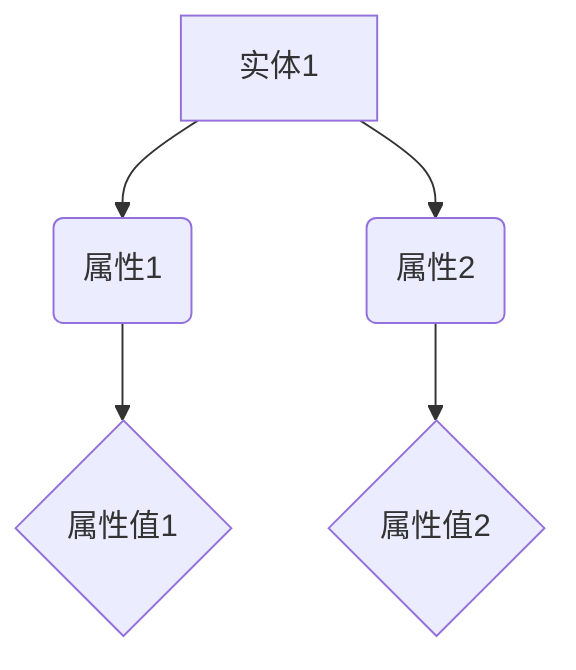

                 

 关键词：知识图谱，语义网络，人工智能，数据可视化，知识管理

> 摘要：本文探讨了知识图谱在现代社会中的重要作用，介绍了知识图谱的基本概念、构建方法、应用领域及其未来发展趋势。通过深入分析知识图谱的核心算法原理、数学模型和项目实践案例，本文旨在为读者提供一幅关于知识图谱的完整蓝图。

## 1. 背景介绍

在互联网信息爆炸的时代，数据已经成为了新的“石油”，如何有效管理和利用这些数据成为了企业和研究机构关注的热点。知识图谱作为一种新型的数据结构，凭借其强大的语义表示和推理能力，在各个领域展现出了巨大的应用潜力。知识图谱通过将实体、属性和关系有机地组织在一起，形成了一种全局的、语义丰富的知识网络，为实现智能搜索、智能问答、知识挖掘等提供了强有力的支持。

### 1.1 知识图谱的发展历程

知识图谱的发展可以追溯到20世纪80年代，当时学者们开始探索如何通过计算机技术模拟人类的思维方式。随着互联网和大数据技术的兴起，知识图谱的概念逐渐成熟，并在21世纪初迎来了快速发展。早期的知识图谱主要基于本体论和语义网络理论，如万维网之父蒂姆·伯纳斯·李提出的语义网络。近年来，随着深度学习和自然语言处理技术的进步，知识图谱的构建方法也得到了显著提升。

### 1.2 知识图谱的应用领域

知识图谱在多个领域都展现出了广泛的应用前景。例如，在搜索引擎领域，知识图谱可以帮助搜索引擎更好地理解用户查询，提供更精准的搜索结果；在推荐系统领域，知识图谱可以挖掘用户和物品之间的复杂关系，提高推荐系统的准确性；在金融领域，知识图谱可以用于风险控制和欺诈检测；在医疗领域，知识图谱可以帮助医生快速获取相关病例和治疗方案，提高医疗水平。

## 2. 核心概念与联系

### 2.1 实体 Entity

实体是知识图谱中的基本元素，可以是任何具有独立存在意义的对象，如人、地点、组织、物品等。实体是知识图谱构建的基础。

### 2.2 属性 Attribute

属性描述了实体的某个特定方面，如人的年龄、地点的纬度等。属性通常以键值对的形式表示。

### 2.3 关系 Relationship

关系描述了实体之间的关联，如人与人之间的友谊关系、地点之间的相邻关系等。关系通常用弧线表示。

### 2.4 Mermaid 流程图

以下是一个简化的知识图谱 Mermaid 流程图，展示了实体、属性和关系的基本结构。



## 3. 核心算法原理 & 具体操作步骤

### 3.1 算法原理概述

知识图谱的构建通常涉及以下核心算法：

1. 实体抽取：从大规模文本数据中识别出实体。
2. 属性抽取：从实体相关的文本中提取属性。
3. 关系抽取：从实体间的交互信息中挖掘出关系。
4. 知识融合：将不同来源的知识进行整合，形成一致性的知识图谱。

### 3.2 算法步骤详解

#### 3.2.1 实体抽取

实体抽取算法通常采用命名实体识别（NER）技术，通过机器学习模型识别文本中的实体。常见的模型有基于规则的方法、统计模型和深度学习模型。

#### 3.2.2 属性抽取

属性抽取算法可以从实体相关的文本中提取出属性。例如，可以使用词向量模型对实体进行嵌入，然后通过分析实体嵌入向量与其上下文的关系来提取属性。

#### 3.2.3 关系抽取

关系抽取算法可以从实体间的交互信息中挖掘出关系。常见的方法包括基于规则的方法、统计模型和图神经网络。

#### 3.2.4 知识融合

知识融合算法将不同来源的知识进行整合。常见的方法包括基于一致性约束的方法、图匹配算法和图嵌入算法。

### 3.3 算法优缺点

- 实体抽取：优点是能够快速识别大量实体，缺点是可能存在误识别和漏识别。
- 属性抽取：优点是能够提取出实体的详细信息，缺点是复杂度较高，可能受到文本质量的影响。
- 关系抽取：优点是能够挖掘出实体之间的关联，缺点是可能存在噪声和歧义。
- 知识融合：优点是能够整合多源知识，提高知识图谱的完整性，缺点是可能引入不一致性。

### 3.4 算法应用领域

- 搜索引擎：通过实体抽取和关系抽取，提供更准确的搜索结果。
- 推荐系统：通过知识图谱，挖掘用户和物品之间的潜在关系，提高推荐质量。
- 问答系统：通过知识图谱，实现基于语义理解的智能问答。
- 金融领域：通过知识图谱，进行风险控制和欺诈检测。
- 医疗领域：通过知识图谱，帮助医生快速获取相关病例和治疗方案。

## 4. 数学模型和公式 & 详细讲解 & 举例说明

### 4.1 数学模型构建

知识图谱的数学模型主要包括图论模型和概率模型。图论模型用于描述实体、属性和关系之间的结构关系，概率模型用于描述实体和属性之间的概率关系。

### 4.2 公式推导过程

以下是一个简化的知识图谱概率模型的推导过程。

$$ P(A|B) = \frac{P(A \cap B)}{P(B)} $$

其中，$P(A|B)$ 表示在已知实体 $B$ 的情况下，实体 $A$ 的概率；$P(A \cap B)$ 表示实体 $A$ 和实体 $B$ 同时存在的概率；$P(B)$ 表示实体 $B$ 的概率。

### 4.3 案例分析与讲解

假设有一个知识图谱，其中包含两个实体 $A$ 和 $B$，以及它们之间的关系 $R$。根据图论模型，可以建立以下数学模型：

$$ P(A|B) = \frac{P(A \cap B)}{P(B)} $$

根据概率模型，可以推导出：

$$ P(A \cap B) = P(A) \cdot P(B|A) $$

其中，$P(A)$ 表示实体 $A$ 的概率；$P(B|A)$ 表示在已知实体 $A$ 的情况下，实体 $B$ 的概率。

假设实体 $A$ 和 $B$ 的概率分别为 $0.6$ 和 $0.8$，那么根据公式可以计算出：

$$ P(A \cap B) = 0.6 \cdot 0.8 = 0.48 $$

因此，在已知实体 $B$ 的情况下，实体 $A$ 的概率为：

$$ P(A|B) = \frac{0.48}{0.8} = 0.6 $$

这意味着，在已知实体 $B$ 的情况下，实体 $A$ 的概率为 $0.6$，即实体 $A$ 与实体 $B$ 之间存在较高的关联性。

## 5. 项目实践：代码实例和详细解释说明

### 5.1 开发环境搭建

为了实践知识图谱的构建，我们需要搭建一个开发环境。以下是一个简单的开发环境搭建步骤：

1. 安装 Python 3.8 或更高版本。
2. 安装必要的库，如 NetworkX、PyTorch、TensorFlow 等。
3. 配置一个图数据库，如 Neo4j 或 JanusGraph。

### 5.2 源代码详细实现

以下是一个简化的知识图谱构建代码示例，使用 Python 和 Neo4j：

```python
from py2neo import Graph

# 创建图数据库连接
graph = Graph("bolt://localhost:7687", auth=("neo4j", "password"))

# 创建实体节点
graph.run("CREATE (a:Person {name: 'Alice'})")

# 创建属性节点
graph.run("CREATE (a)-[:HAS_ATTRIBUTE {name: 'age', value: 30}]->(b:Attribute)")

# 创建关系节点
graph.run("CREATE (a)-[:RELATION]->(b)")

# 提取实体
entities = graph.run("MATCH (a:Person) RETURN a")
for entity in entities:
    print(entity)

# 提取属性
attributes = graph.run("MATCH (a)-[:HAS_ATTRIBUTE]->(b) RETURN a, b")
for attribute in attributes:
    print(attribute)

# 提取关系
relations = graph.run("MATCH (a)-[:RELATION]->(b) RETURN a, b")
for relation in relations:
    print(relation)
```

### 5.3 代码解读与分析

上述代码展示了如何使用 Neo4j 图数据库构建一个简单的知识图谱。首先，创建了一个 Person 实体节点，一个 Attribute 属性节点，以及一个 Relation 关系节点。然后，通过匹配查询提取了实体、属性和关系。

### 5.4 运行结果展示

运行上述代码后，将会在 Neo4j 图数据库中创建一个包含实体、属性和关系的知识图谱。可以通过以下查询查看运行结果：

```sql
MATCH (a:Person)-[:HAS_ATTRIBUTE]->(b:Attribute) RETURN a, b
```

这将返回 Person 实体节点和其相关属性节点的信息。

## 6. 实际应用场景

### 6.1 搜索引擎

知识图谱可以用于搜索引擎，提高搜索结果的准确性。通过将网页中的实体、属性和关系组织成知识图谱，搜索引擎可以更好地理解用户的查询意图，提供更精准的搜索结果。

### 6.2 推荐系统

知识图谱可以用于推荐系统，提高推荐质量。通过挖掘实体和物品之间的潜在关系，推荐系统可以提供更具个性化的推荐结果。

### 6.3 金融领域

知识图谱可以用于金融领域，进行风险控制和欺诈检测。通过将金融数据组织成知识图谱，可以挖掘出潜在的风险关系，提高金融风险管理的效率。

### 6.4 医疗领域

知识图谱可以用于医疗领域，帮助医生快速获取相关病例和治疗方案。通过将医疗数据组织成知识图谱，可以提供更精准的医学信息检索和知识推理。

## 7. 工具和资源推荐

### 7.1 学习资源推荐

1. 《知识图谱：方法与应用》 - 张清杰等著
2. 《图论及其应用》 - Diestel R. 著
3. 《深度学习》 - Goodfellow I. et al. 著

### 7.2 开发工具推荐

1. Neo4j：一个高性能的图数据库。
2. NetworkX：一个用于图论算法的 Python 库。
3. PyTorch/TensorFlow：用于深度学习的 Python 库。

### 7.3 相关论文推荐

1. "Knowledge Graph Embedding: A Survey" - Y. Zhang et al.
2. "Graph Neural Networks: A Review of Methods and Applications" - W. L. Hamilton et al.
3. "Representing Knowledge as a Graph: A Survey of Knowledge Graphs" - L. Zhang et al.

## 8. 总结：未来发展趋势与挑战

### 8.1 研究成果总结

知识图谱作为一种新兴的数据结构，已经在各个领域取得了显著的成果。通过实体、属性和关系的组织，知识图谱实现了对复杂数据的高效管理和利用。同时，随着深度学习和自然语言处理技术的进步，知识图谱的构建方法和应用场景也在不断扩展。

### 8.2 未来发展趋势

未来，知识图谱的发展将朝着以下几个方向：

1. 多语言和多模态知识图谱：支持多种语言和不同模态的数据，提高知识图谱的多样性和实用性。
2. 自适应知识图谱：根据用户需求和场景动态调整知识图谱的结构和内容，提供更个性化的服务。
3. 知识图谱融合：将不同来源的知识进行整合，形成更加全面和一致的知识图谱。

### 8.3 面临的挑战

知识图谱在发展过程中也面临一些挑战：

1. 数据质量和一致性：保证知识图谱的数据质量和一致性是构建高质量知识图谱的关键。
2. 可解释性和可靠性：提高知识图谱的可解释性和可靠性，使其在复杂场景下具有更高的可信度。
3. 大规模知识图谱的存储和处理：随着知识图谱规模的扩大，如何高效地存储和处理大规模知识图谱成为一个重要问题。

### 8.4 研究展望

在未来，知识图谱的研究将朝着更加智能化、自适应化和多样化的方向发展。通过不断探索和创新，知识图谱将为人类社会带来更多的价值和便利。

## 9. 附录：常见问题与解答

### 9.1 什么是知识图谱？

知识图谱是一种用于表示实体、属性和关系的图形结构，旨在将人类知识以机器可读的形式进行组织和表示。

### 9.2 知识图谱有哪些应用领域？

知识图谱在搜索引擎、推荐系统、金融、医疗、教育等多个领域都有广泛应用。

### 9.3 知识图谱如何构建？

知识图谱的构建通常涉及实体抽取、属性抽取、关系抽取和知识融合等步骤。

### 9.4 知识图谱的优势是什么？

知识图谱的优势包括语义丰富、推理能力强、易于扩展和共享等。

作者：禅与计算机程序设计艺术 / Zen and the Art of Computer Programming
```

