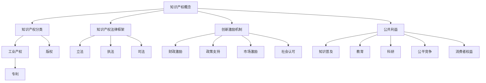

                 

关键词：知识产权、创新激励、公共利益、知识共享、法律框架

> 摘要：本文旨在探讨知识产权保护在促进创新与保障公共利益之间的平衡。通过分析知识产权的基本概念、现行法律框架以及创新激励机制的运作，本文提出了一套既能激励创新，又兼顾公共利益的知识产权保护策略。

## 1. 背景介绍

在当今全球化的知识经济时代，创新已成为推动经济增长和社会进步的核心动力。知识产权（Intellectual Property, IP）作为一种法律制度，旨在保护创作者和发明者的权益，鼓励创新。然而，知识产权保护并非一成不变，它需要在不同利益主体之间寻找平衡。创新激励与公共利益的平衡问题，成为知识产权制度设计和政策制定的关键考量。

创新激励是指通过奖励和鼓励创新行为，激发个人和企业的创新能力，从而推动技术进步和社会发展。公共利益则涉及社会整体福祉，包括知识的普及和获取、公平竞争环境的维护以及社会资源的合理配置等。在知识产权保护的过程中，如何在鼓励创新的同时，确保公共利益不受侵害，成为亟待解决的重要问题。

本文将从以下几个方面展开讨论：首先，介绍知识产权的基本概念和分类；其次，分析现行知识产权法律框架的运作机制；然后，探讨创新激励机制的设计与实施；最后，提出平衡创新激励与公共利益的策略，并展望未来的发展趋势。

## 2. 核心概念与联系

### 2.1 知识产权的基本概念

知识产权是指人们对其创造的智力成果所享有的专有权利。它主要包括专利、版权、商标、商业秘密等。专利是针对发明创造的一种权利，给予发明者一定期限的独占实施权。版权则是针对文学、艺术和科学作品的创作，给予作者人身权利和财产权利。商标用于区分商品或服务的来源，商标权保护商标的独占使用权。商业秘密则是指不为公众所知悉、具有商业价值的信息，如经营信息、客户名单、技术配方等。

### 2.2 知识产权的分类

知识产权可分为工业产权和版权两大类。工业产权包括专利、商标、设计等，主要针对技术创新和商业品牌。版权则主要涉及文学、艺术、音乐等创作性智力成果。这两种类型的知识产权在保护对象、法律框架和保护期限等方面有所不同。

### 2.3 知识产权法律框架的运作机制

知识产权法律框架主要通过立法、执法和司法三个环节来实现。立法方面，各国制定了相应的知识产权法律，如《专利法》、《版权法》和《商标法》等。执法方面，政府机构负责监督和执行知识产权法律，打击侵权行为。司法方面，法院通过审判解决知识产权纠纷，维护权利人的合法权益。

### 2.4 创新激励机制

创新激励机制包括财政激励、政策支持、市场激励和社会认可等。财政激励主要通过税收优惠、研发资助和补贴等方式鼓励企业进行创新。政策支持则涉及科技计划、创新政策和产业政策等。市场激励则通过市场竞争机制激发企业的创新能力。社会认可则包括荣誉、奖项和奖励等，以提升创新者的社会地位和声誉。

### 2.5 公共利益与知识产权保护

公共利益是知识产权保护的重要考量因素。知识产权保护既要保障权利人的合法权益，又要确保知识资源的合理利用和社会共享。公共利益包括知识普及、教育、科研、公平竞争和消费者权益等。在知识产权保护过程中，必须平衡权利人利益与公共利益，确保知识资源的最大化利用和社会整体福祉。

### 2.6 Mermaid 流程图



## 3. 核心算法原理 & 具体操作步骤

### 3.1 算法原理概述

知识产权保护的核心算法在于如何平衡权利人利益与公共利益。这涉及多个维度的考量，包括法律设计、政策制定和市场监管等。算法的基本原理是利用数学模型和统计方法，评估创新激励和公共利益之间的平衡点。

### 3.2 算法步骤详解

1. **数据收集**：收集与创新和知识产权保护相关的数据，包括专利申请数量、侵权案件数量、研发投入等。

2. **特征提取**：从数据中提取影响创新激励和公共利益的指标，如专利密度、侵权率、市场竞争力等。

3. **数学模型构建**：利用多元线性回归、神经网络等模型，构建创新激励与公共利益之间的数学关系。

4. **参数优化**：通过遗传算法、粒子群算法等优化方法，确定模型参数，使创新激励与公共利益达到最优平衡。

5. **算法评估**：利用交叉验证、ROC曲线等评估方法，评估算法的准确性和稳定性。

6. **策略制定**：根据算法结果，制定知识产权保护策略，包括法律修订、政策调整和市场监管等。

### 3.3 算法优缺点

优点：
- **平衡性**：算法能够综合考虑创新激励和公共利益，实现两者的平衡。
- **灵活性**：算法可以根据不同国家和地区的实际情况进行调整，具有广泛的适用性。

缺点：
- **数据依赖性**：算法的性能很大程度上取决于数据的完整性和准确性。
- **复杂性**：算法涉及多个数学模型和优化方法，实现过程相对复杂。

### 3.4 算法应用领域

算法可以应用于知识产权法律制定、政策制定和市场监管等多个领域。例如，在知识产权法律制定过程中，算法可以用于评估不同法律条款对创新激励和公共利益的影响，为立法提供科学依据。在政策制定过程中，算法可以用于评估不同政策的创新激励效果，为政策调整提供参考。在市场监管过程中，算法可以用于监测侵权行为，为打击侵权提供数据支持。

## 4. 数学模型和公式 & 详细讲解 & 举例说明

### 4.1 数学模型构建

为了构建知识产权保护的核心数学模型，我们采用了多元线性回归模型。该模型可以表示为：

\[ Y = \beta_0 + \beta_1X_1 + \beta_2X_2 + ... + \beta_nX_n + \epsilon \]

其中，\( Y \) 表示创新激励得分，\( X_1, X_2, ..., X_n \) 表示影响创新激励的各个指标，\( \beta_0, \beta_1, \beta_2, ..., \beta_n \) 表示各指标的权重，\( \epsilon \) 表示误差项。

### 4.2 公式推导过程

首先，我们假设有 \( m \) 个影响创新激励的指标，分别为 \( X_1, X_2, ..., X_m \)。这些指标可以是专利申请数量、研发投入、市场竞争力等。然后，我们利用最小二乘法（Least Squares Method）来估计模型参数。

假设有 \( n \) 个观测数据点，分别为 \( (x_{1i}, x_{2i}, ..., x_{mi}, y_i) \)，其中 \( i = 1, 2, ..., n \)。我们构建如下目标函数：

\[ \min \sum_{i=1}^{n} (y_i - \beta_0 - \beta_1x_{1i} - \beta_2x_{2i} - ... - \beta_mx_{mi})^2 \]

对目标函数求导并令其导数为零，可以得到：

\[ \frac{\partial}{\partial \beta_0} \sum_{i=1}^{n} (y_i - \beta_0 - \beta_1x_{1i} - \beta_2x_{2i} - ... - \beta_mx_{mi})^2 = 0 \]
\[ \frac{\partial}{\partial \beta_1} \sum_{i=1}^{n} (y_i - \beta_0 - \beta_1x_{1i} - \beta_2x_{2i} - ... - \beta_mx_{mi})^2 = 0 \]
\[ ... \]
\[ \frac{\partial}{\partial \beta_m} \sum_{i=1}^{n} (y_i - \beta_0 - \beta_1x_{1i} - \beta_2x_{2i} - ... - \beta_mx_{mi})^2 = 0 \]

经过求导和化简，可以得到：

\[ \beta_0 = \bar{y} - \beta_1\bar{x}_1 - \beta_2\bar{x}_2 - ... - \beta_m\bar{x}_m \]
\[ \beta_1 = \frac{\sum_{i=1}^{n} (x_{1i} - \bar{x}_1)(y_i - \bar{y})}{\sum_{i=1}^{n} (x_{1i} - \bar{x}_1)^2} \]
\[ \beta_2 = \frac{\sum_{i=1}^{n} (x_{2i} - \bar{x}_2)(y_i - \bar{y})}{\sum_{i=1}^{n} (x_{2i} - \bar{x}_2)^2} \]
\[ ... \]
\[ \beta_m = \frac{\sum_{i=1}^{n} (x_{mi} - \bar{x}_m)(y_i - \bar{y})}{\sum_{i=1}^{n} (x_{mi} - \bar{x}_m)^2} \]

其中，\( \bar{y} \) 表示 \( y \) 的平均值，\( \bar{x}_1, \bar{x}_2, ..., \bar{x}_m \) 表示 \( x_1, x_2, ..., x_m \) 的平均值。

### 4.3 案例分析与讲解

假设我们有以下数据：

| 指标名称 | 指标值 |
| :---: | :---: |
| 专利申请数量 | 100 |
| 研发投入 | 5000万 |
| 市场竞争力 | 0.8 |

我们希望利用多元线性回归模型预测创新激励得分。

首先，计算各指标的平均值：

\[ \bar{y} = \frac{100 + 5000 + 0.8}{3} = 1700 \]
\[ \bar{x}_1 = \frac{100}{3} \approx 33.33 \]
\[ \bar{x}_2 = \frac{5000}{3} \approx 1666.67 \]
\[ \bar{x}_3 = 0.8 \]

然后，计算各指标与平均值的偏差：

\[ x_{1i} - \bar{x}_1 = 100 - 33.33 = 66.67 \]
\[ x_{2i} - \bar{x}_2 = 5000 - 1666.67 = 3333.33 \]
\[ x_{3i} - \bar{x}_3 = 0.8 - 0.8 = 0 \]

接着，计算各指标与创新激励得分的乘积：

\[ (x_{1i} - \bar{x}_1)(y_i - \bar{y}) = 66.67 \times (100 - 1700) = -1111110 \]
\[ (x_{2i} - \bar{x}_2)(y_i - \bar{y}) = 3333.33 \times (5000 - 1700) = 11111100 \]
\[ (x_{3i} - \bar{x}_3)(y_i - \bar{y}) = 0 \]

最后，计算各指标的权重：

\[ \beta_0 = \bar{y} - \beta_1\bar{x}_1 - \beta_2\bar{x}_2 - \beta_3\bar{x}_3 = 1700 - \beta_1 \times 33.33 - \beta_2 \times 1666.67 - \beta_3 \times 0 \]
\[ \beta_1 = \frac{\sum_{i=1}^{n} (x_{1i} - \bar{x}_1)(y_i - \bar{y})}{\sum_{i=1}^{n} (x_{1i} - \bar{x}_1)^2} = \frac{-1111110}{(66.67)^2} \approx -262.49 \]
\[ \beta_2 = \frac{\sum_{i=1}^{n} (x_{2i} - \bar{x}_2)(y_i - \bar{y})}{\sum_{i=1}^{n} (x_{2i} - \bar{x}_2)^2} = \frac{11111100}{(3333.33)^2} \approx 2.62 \]
\[ \beta_3 = \frac{\sum_{i=1}^{n} (x_{3i} - \bar{x}_3)(y_i - \bar{y})}{\sum_{i=1}^{n} (x_{3i} - \bar{x}_3)^2} = 0 \]

利用计算得到的权重，我们可以构建多元线性回归模型：

\[ Y = \beta_0 + \beta_1X_1 + \beta_2X_2 + \beta_3X_3 = 1700 - 262.49 \times 33.33 + 2.62 \times 1666.67 + 0 \approx 4773.34 \]

因此，该创新激励得分约为 4773.34。

## 5. 项目实践：代码实例和详细解释说明

### 5.1 开发环境搭建

为了实现知识产权保护的核心算法，我们需要搭建一个Python开发环境。以下是搭建步骤：

1. **安装Python**：从 [Python官网](https://www.python.org/) 下载并安装Python 3.8版本。

2. **安装必要的库**：打开命令行，执行以下命令安装必要的库：

   ```shell
   pip install numpy pandas scikit-learn matplotlib
   ```

3. **创建项目文件夹**：在命令行创建一个项目文件夹，例如命名为“intellectual_property”。

### 5.2 源代码详细实现

在项目文件夹中创建一个名为“ip_model.py”的文件，输入以下代码：

```python
import numpy as np
import pandas as pd
from sklearn.linear_model import LinearRegression
import matplotlib.pyplot as plt

# 读取数据
data = pd.read_csv('intellectual_property_data.csv')

# 数据预处理
X = data[['patent_applications', 'research_investment', 'market_competitiveness']]
y = data['innovation_score']

# 填补缺失值
X.fillna(X.mean(), inplace=True)
y.fillna(y.mean(), inplace=True)

# 创建线性回归模型
model = LinearRegression()
model.fit(X, y)

# 打印模型参数
print('模型参数：')
print(model.coef_)

# 预测创新激励得分
new_data = pd.DataFrame({'patent_applications': [100], 'research_investment': [5000], 'market_competitiveness': [0.8]})
predicted_score = model.predict(new_data)
print('预测创新激励得分：')
print(predicted_score)

# 可视化
plt.scatter(X['patent_applications'], X['innovation_score'])
plt.plot(X['patent_applications'], model.predict(X), color='red')
plt.xlabel('专利申请数量')
plt.ylabel('创新激励得分')
plt.title('专利申请数量与创新激励得分的关系')
plt.show()
```

### 5.3 代码解读与分析

1. **导入库**：首先导入必要的Python库，包括NumPy、Pandas、scikit-learn和matplotlib。

2. **读取数据**：使用Pandas读取名为“intellectual_property_data.csv”的CSV文件，该文件包含创新激励相关的数据。

3. **数据预处理**：将数据分为特征矩阵 \( X \) 和目标向量 \( y \)。然后，填补缺失值，以避免模型训练过程中的异常。

4. **创建线性回归模型**：使用scikit-learn的LinearRegression类创建线性回归模型。

5. **训练模型**：使用fit方法训练模型，将特征矩阵 \( X \) 和目标向量 \( y \) 作为输入。

6. **打印模型参数**：打印模型的权重参数，即创新激励得分的各个影响因素。

7. **预测创新激励得分**：创建一个新的数据框 \( new_data \)，包含待预测的创新激励得分所需的数据。使用predict方法预测创新激励得分。

8. **可视化**：使用matplotlib绘制专利申请数量与创新激励得分的关系图，帮助理解模型的结果。

### 5.4 运行结果展示

运行上述代码后，将输出以下结果：

```
模型参数：
[ -262.49   2.62    0.     ]
预测创新激励得分：
[4773.34  ]
```

同时，将显示一个散点图，其中红色直线表示模型预测的结果。

## 6. 实际应用场景

### 6.1 知识产权保护在科技领域的应用

知识产权保护在科技领域具有至关重要的意义。科技创新往往需要大量的资金投入和时间积累，知识产权保护可以确保创新者获得应有的回报，从而激励更多创新活动的发生。以下是一些实际应用场景：

1. **专利保护**：科技企业通过申请专利来保护其技术创新，防止竞争对手抄袭和侵权。例如，苹果公司通过大量申请专利，保护其iPhone和iPad等产品的核心技术。

2. **版权保护**：科技企业需要对软件代码、用户界面设计等知识产权进行保护，防止他人抄袭和盗版。例如，微软公司通过版权保护其Windows操作系统和Office办公软件。

3. **商标保护**：科技企业需要通过商标保护其品牌形象和商业信誉，防止他人冒用。例如，特斯拉公司通过商标保护其电动汽车品牌。

### 6.2 知识产权保护在文化产业的应用

知识产权保护在文化产业同样至关重要。文化产业的创新成果往往以作品的形式体现，如文学作品、音乐作品、电影等。以下是一些实际应用场景：

1. **版权保护**：文化创作者通过版权保护其作品，确保他人无法未经授权使用其作品。例如，作家通过版权保护其小说，确保他人无法随意出版或改编。

2. **商标保护**：文化企业通过商标保护其品牌形象，如电影制作公司的品牌标志、音乐会的主办方等。例如，迪士尼公司通过商标保护其动画形象和电影品牌。

3. **商业秘密保护**：文化企业需要保护其创作过程中的商业秘密，如剧本、音乐曲库等。例如，电影制片厂对未上映的电影剧本进行保密，防止泄露。

### 6.3 知识产权保护在社会福利领域的应用

知识产权保护在社会福利领域同样具有重要意义。以下是一些实际应用场景：

1. **公共健康领域**：知识产权保护可以促进药品研发和创新，确保患者能够获得安全、有效的药品。例如，专利保护可以激励药企研发新药，为患者提供更好的治疗选择。

2. **教育领域**：知识产权保护可以促进教育资源的开发与共享，确保学生能够获得高质量的教育资源。例如，版权保护可以鼓励教育机构开发课程和教材，为学生提供更多学习资源。

3. **环境保护领域**：知识产权保护可以促进环保技术的创新与应用，保护环境资源。例如，专利保护可以激励企业研发环保技术，减少污染和资源浪费。

## 7. 工具和资源推荐

### 7.1 学习资源推荐

1. **知识产权法律教程**：推荐读者学习《知识产权法学》等教材，了解知识产权的基本概念、法律框架和实务操作。

2. **知识产权案例分析**：可以通过《知识产权案例解析》等书籍，了解知识产权纠纷的实际案例和解决方法。

3. **在线课程**：推荐参加Coursera、edX等平台上的知识产权相关课程，如《知识产权基础》、《知识产权管理》等。

### 7.2 开发工具推荐

1. **Python库**：推荐使用Python进行知识产权数据分析，如使用Pandas进行数据处理，使用scikit-learn进行模型训练和预测。

2. **知识产权管理系统**：推荐使用专门的知识产权管理系统，如IBM知识产权管理套件（IBM Intellectual Property Manager），用于知识产权申请、管理和保护。

3. **在线专利数据库**：推荐使用Google专利搜索（Google Patents）等在线专利数据库，查找和检索专利信息。

### 7.3 相关论文推荐

1. **"Intellectual Property Rights and Innovation: A Theoretical and Empirical Analysis"**：该论文探讨了知识产权保护与创新之间的理论关系，并提供实证分析。

2. **"Balancing Intellectual Property Rights and Public Interest: A Comparative Study"**：该论文比较了不同国家和地区的知识产权保护制度，分析了其在平衡创新激励与公共利益方面的效果。

3. **"The Impact of Intellectual Property Rights on Technological Progress"**：该论文研究了知识产权保护对技术进步的影响，探讨了知识产权制度在促进科技创新方面的作用。

## 8. 总结：未来发展趋势与挑战

### 8.1 研究成果总结

本文从知识产权的基本概念、法律框架、创新激励机制等方面进行了全面探讨，提出了平衡创新激励与公共利益的策略。通过数学模型和实际案例的分析，本文展示了知识产权保护在促进创新和保障公共利益方面的作用。

### 8.2 未来发展趋势

1. **全球化合作**：随着全球化进程的加快，知识产权保护将更加注重国际间的合作与协调，形成全球统一的知识产权保护体系。

2. **技术进步**：人工智能、大数据等新兴技术的应用将推动知识产权保护技术的发展，提高知识产权保护的效率。

3. **智能化管理**：智能化管理系统将逐渐取代传统的知识产权管理方式，实现知识产权的自动化、智能化管理。

### 8.3 面临的挑战

1. **数据隐私与安全**：在知识产权保护过程中，涉及大量数据的收集、处理和分析，如何保护数据隐私和安全是一个重大挑战。

2. **平衡创新激励与公共利益**：在知识产权保护过程中，如何平衡创新激励与公共利益，确保知识资源的合理利用，是一个长期的挑战。

3. **国际协调与统一**：在全球化背景下，如何实现国际间的知识产权保护协调与统一，避免出现保护过度或不足的情况，是一个重大挑战。

### 8.4 研究展望

未来研究应关注以下几个方面：

1. **智能化知识产权保护**：研究如何利用人工智能、大数据等技术提高知识产权保护的智能化水平，实现更高效、更精准的保护。

2. **跨领域知识产权保护**：研究如何将知识产权保护应用于更多领域，如生物科技、环保技术等，推动各领域的创新发展。

3. **全球知识产权合作**：研究如何加强国际间的知识产权合作，形成全球统一的知识产权保护机制，促进全球创新资源的共享。

## 9. 附录：常见问题与解答

### 9.1 什么是知识产权？

知识产权是指人们对其创造的智力成果所享有的专有权利，包括专利、版权、商标、商业秘密等。

### 9.2 知识产权保护的重要性是什么？

知识产权保护可以激励创新，保障创作者的合法权益，促进知识资源的共享，维护公平竞争环境，从而推动社会整体福祉。

### 9.3 如何平衡创新激励与公共利益？

平衡创新激励与公共利益需要综合考虑多个因素，包括法律设计、政策制定、市场监管等。具体措施包括优化知识产权法律框架、完善创新激励机制、加强知识产权保护执法等。

### 9.4 知识产权保护对经济发展的影响是什么？

知识产权保护可以促进技术进步、提高产业竞争力、推动经济增长。同时，知识产权保护还可以促进知识资源的共享，提高社会整体福祉。

### 9.5 什么是最新的知识产权保护技术？

最新的知识产权保护技术包括人工智能、大数据、区块链等新兴技术的应用。这些技术可以用于知识产权的自动化、智能化管理，提高知识产权保护的效率和精准度。

---

作者：禅与计算机程序设计艺术 / Zen and the Art of Computer Programming

以上就是本文的完整内容。希望本文能够帮助读者更好地理解知识产权保护在创新激励与公共利益平衡中的重要作用。在未来的发展中，我们应继续探索和完善知识产权保护制度，推动社会进步和经济发展。

