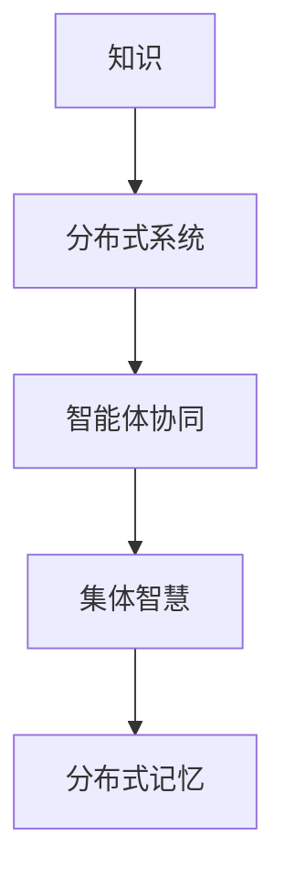

                 

关键词：知识分布式记忆、集体智慧、形成机制、分布式系统、信息处理、智能体协同

## 摘要

在信息爆炸的时代，知识的获取与处理变得尤为重要。本文探讨了知识的分布式记忆作为集体智慧形成机制的核心作用。通过分析分布式系统的特点，阐述知识分布式记忆的基本原理及其与集体智慧的关系。进一步，本文详细描述了知识分布式记忆的具体实现方法，包括分布式数据库、区块链和知识图谱等技术的应用。通过数学模型和实际案例的解读，本文展示了知识分布式记忆在提高信息处理效率和促进集体智慧形成方面的巨大潜力。

## 1. 背景介绍

随着互联网的普及和大数据技术的崛起，知识获取和存储的方式发生了革命性的变化。传统的集中式知识存储方式已经无法满足快速发展的需求，知识的分布式记忆逐渐成为研究热点。分布式系统以其高扩展性、高可用性和容错性等优点，为知识的分布式记忆提供了技术基础。同时，集体智慧的概念也逐渐被认知和重视，其通过智能体协同和知识共享实现整体智能的提升，为解决复杂问题提供了新途径。

### 分布式系统与集体智慧

分布式系统是指通过网络将多个计算节点连接起来，以协同完成任务的系统。这些节点可以位于不同的地理位置，通过通信协议共享资源和数据。分布式系统的特点包括：

1. **高扩展性**：分布式系统可以根据需要动态扩展，增加或减少计算节点，从而处理更多的数据。
2. **高可用性**：分布式系统具有较高的容错能力，单个节点的故障不会影响整个系统的运行。
3. **数据一致性**：分布式系统需要保证多个节点上的数据一致性，以避免数据冲突和冗余。

集体智慧是指通过个体之间的协作和知识共享，形成一种高于个体智能的整体智能。在分布式系统中，集体智慧的形成依赖于以下机制：

1. **协作机制**：个体通过通信和协同完成任务，实现知识的共享和集成。
2. **激励机制**：个体在参与集体智慧的过程中获得奖励或回报，从而激发其积极性和创造力。
3. **适应机制**：个体能够根据环境变化调整自身行为，以更好地适应集体智慧的需求。

### 分布式记忆的概念

分布式记忆是指将知识存储在多个节点上，并通过分布式算法实现知识的检索、更新和共享。与传统集中式存储相比，分布式记忆具有以下优势：

1. **分布式存储**：知识分布在多个节点上，降低了单点故障的风险，提高了系统的可靠性。
2. **并行处理**：多个节点可以同时处理不同的任务，提高了系统的处理效率。
3. **可扩展性**：分布式记忆可以方便地增加或减少节点，以适应数据规模的变化。

## 2. 核心概念与联系

在探讨知识的分布式记忆之前，我们需要了解一些核心概念和它们之间的联系。以下是一个简化的Mermaid流程图，用于展示这些概念之间的相互作用。



### 2.1 分布式系统

分布式系统是一个由多个独立计算机节点组成的系统，这些节点通过通信网络连接起来，协同完成计算任务。分布式系统的关键特点包括：

1. **节点自治**：每个节点都具有独立的功能和决策能力，可以自主运行和管理。
2. **分布式算法**：分布式系统中的节点通过分布式算法协作完成任务，这些算法包括一致性算法、分布式排序和分布式搜索等。
3. **容错性**：分布式系统具有高容错性，单个节点的故障不会影响整个系统的运行。

### 2.2 智能体协同

智能体协同是指多个智能体（如机器人、传感器网络等）通过通信和协同完成任务的过程。智能体协同的关键特点包括：

1. **分布式计算**：智能体协同利用分布式计算的优势，将任务分解成多个子任务，由不同的智能体并行处理。
2. **自适应**：智能体能够根据环境变化调整自身行为，以更好地适应协同任务的需求。
3. **信息共享**：智能体之间通过通信网络共享信息和资源，以提高协同效率。

### 2.3 集体智慧

集体智慧是指通过个体之间的协作和知识共享，形成一种高于个体智能的整体智能。集体智慧的关键特点包括：

1. **协同**：个体通过协作和协同完成任务，实现知识的共享和集成。
2. **适应性**：集体智慧能够根据环境变化调整自身行为，以更好地适应复杂问题。
3. **动态性**：集体智慧是一个动态过程，个体可以随时加入或退出，系统仍能保持整体智能。

### 2.4 分布式记忆

分布式记忆是指将知识存储在多个节点上，并通过分布式算法实现知识的检索、更新和共享。分布式记忆的关键特点包括：

1. **分布式存储**：知识分布在多个节点上，降低了单点故障的风险，提高了系统的可靠性。
2. **并行处理**：多个节点可以同时处理不同的任务，提高了系统的处理效率。
3. **可扩展性**：分布式记忆可以方便地增加或减少节点，以适应数据规模的变化。

## 3. 核心算法原理 & 具体操作步骤

### 3.1 算法原理概述

分布式记忆的核心算法包括一致性算法、分布式排序和分布式搜索等。这些算法通过分布式系统实现知识的存储、检索和更新。

1. **一致性算法**：一致性算法用于确保分布式系统中多个节点上的数据一致性。常见的算法包括Paxos算法和Raft算法。
2. **分布式排序**：分布式排序是将数据分布在多个节点上进行排序的过程。常用的算法包括MapReduce算法和分布式快排算法。
3. **分布式搜索**：分布式搜索是在分布式系统中快速查找数据的方法。常用的算法包括分布式哈希表和分布式索引。

### 3.2 算法步骤详解

#### 3.2.1 分布式排序算法

1. **数据划分**：将待排序的数据集划分为多个子数据集，每个子数据集分配给一个节点。
2. **局部排序**：每个节点对分配到的子数据集进行局部排序。
3. **合并排序**：将各个节点的局部排序结果合并，得到全局排序结果。

#### 3.2.2 分布式搜索算法

1. **哈希分发**：将待搜索的关键词通过哈希函数映射到不同的节点。
2. **节点查询**：在对应的节点上查找关键词，并返回结果。
3. **结果合并**：将各个节点的查询结果合并，得到最终结果。

### 3.3 算法优缺点

#### 3.3.1 分布式排序算法

**优点**：

- 高效：分布式排序算法利用多个节点的计算能力，提高了排序效率。
- 可扩展：分布式排序算法可以方便地扩展到更多节点，以处理更大的数据集。

**缺点**：

- 数据传输开销：在合并排序过程中，需要传输大量的数据，可能导致网络拥堵。
- 集中点问题：分布式排序算法需要一个集中点来合并排序结果，该集中点可能成为系统的瓶颈。

#### 3.3.2 分布式搜索算法

**优点**：

- 快速：分布式搜索算法通过节点查询，可以快速找到所需数据。
- 可扩展：分布式搜索算法可以方便地扩展到更多节点，以提高查询效率。

**缺点**：

- 数据一致性：在分布式系统中，数据一致性是一个挑战，分布式搜索算法需要解决这一问题。
- 哈希冲突：在哈希分发过程中，可能存在哈希冲突，导致查询效率降低。

### 3.4 算法应用领域

分布式排序和分布式搜索算法在多个领域得到广泛应用：

1. **搜索引擎**：分布式搜索算法用于搜索引擎中的关键词查找，提高了查询效率。
2. **分布式数据库**：分布式排序算法用于分布式数据库中的数据排序和索引，提高了数据检索速度。
3. **数据挖掘**：分布式排序算法用于数据挖掘过程中的数据预处理，提高了挖掘效率。

## 4. 数学模型和公式 & 详细讲解 & 举例说明

### 4.1 数学模型构建

分布式记忆的数学模型主要包括一致性模型、分布式排序模型和分布式搜索模型。以下分别介绍这些模型的基本构建原理。

#### 4.1.1 一致性模型

一致性模型的目标是确保分布式系统中多个节点上的数据一致性。一个基本的一致性模型可以使用Paxos算法实现。Paxos算法的核心思想是通过多数派机制来达成数据一致性。

**Paxos算法模型**：

$$
C_{i}(n, v) \rightarrow \{ C_{j}(m, v') \mid j \neq i \land m = n \}
$$

其中，$C_i(n, v)$表示节点$i$在编号为$n$的提议中选择了值$v$，$C_j(m, v')$表示节点$j$在编号为$m$的提议中选择了值$v'$。当多数派节点达成一致时，系统状态更新为所选值$v$。

#### 4.1.2 分布式排序模型

分布式排序模型的目的是将数据集划分为多个子数据集，并在各个节点上进行局部排序，最后合并排序结果。一个常见的分布式排序模型是MapReduce算法。

**MapReduce算法模型**：

$$
Map(\sigma, R) = \{ (k, v) \mid \sigma(r) \rightarrow R(r) \}
$$

$$
Reduce(K, \Sigma R) = \{ (k, \Sigma v) \mid k \in K, v \in \Sigma R \}
$$

其中，$\sigma$表示输入数据集，$R$表示输出结果集，$Map$函数将输入数据集映射为中间键值对集合，$Reduce$函数将中间键值对集合合并为最终结果。

#### 4.1.3 分布式搜索模型

分布式搜索模型的目的是通过多个节点的查询来快速找到所需数据。一个常见的分布式搜索模型是分布式哈希表。

**分布式哈希表模型**：

$$
hash(key) \rightarrow node
$$

其中，$hash$函数用于将关键词映射到节点，$node$表示关键词所在节点。

### 4.2 公式推导过程

#### 4.2.1 一致性模型推导

Paxos算法的一致性推导可以通过以下步骤进行：

1. **提议阶段**：节点$i$向其他节点发送提议$(n, v)$。
2. **响应阶段**：其他节点根据接收到的提议，发送响应$(m, v')$。
3. **决定阶段**：当多数派节点收到相同编号的提议时，系统状态更新为所选值$v$。

**推导过程**：

$$
C_{i}(n, v) \rightarrow \{ C_{j}(m, v') \mid j \neq i \land m = n \}
$$

假设存在多数派节点集合$M$，满足：

$$
|M| > \frac{N}{2}
$$

其中，$N$为总节点数。对于任意提议$(n, v)$，当多数派节点收到相同编号的提议时，有：

$$
C_{i}(n, v) \rightarrow \{ C_{j}(n, v') \mid j \in M \land j \neq i \}
$$

由于$M$是多数派节点集合，对于任意$v' \in \{ C_{j}(n, v') \mid j \in M \land j \neq i \}$，都有：

$$
| \{ C_{j}(n, v') \mid j \in M \land j \neq i \} | > \frac{N}{2}
$$

因此，多数派节点将选择相同值$v$，系统状态更新为$v$。

#### 4.2.2 分布式排序模型推导

MapReduce算法的推导过程如下：

1. **Map阶段**：对输入数据集$\sigma$进行映射，生成中间键值对集合$R$。
2. **Shuffle阶段**：将中间键值对集合$R$按照键值对分组，并分发到各个节点。
3. **Reduce阶段**：对每个分组进行聚合操作，生成最终结果集。

**推导过程**：

$$
Map(\sigma, R) = \{ (k, v) \mid \sigma(r) \rightarrow R(r) \}
$$

$$
Reduce(K, \Sigma R) = \{ (k, \Sigma v) \mid k \in K, v \in \Sigma R \}
$$

在Map阶段，每个节点对分配到的子数据集$\sigma(r)$进行映射，生成中间键值对集合$R(r)$。由于Map阶段是并行执行的，每个节点生成的中间键值对集合$R(r)$可能包含不同的键值对。

在Shuffle阶段，中间键值对集合$R$按照键值对分组，并分发到各个节点。由于Map阶段生成的中间键值对集合$R(r)$是按照键值对分组的，因此Shuffle阶段可以将每个分组分配到对应的节点。

在Reduce阶段，对每个分组$K$进行聚合操作，生成最终结果集。由于每个分组$K$只包含相同键值的键值对，因此聚合操作可以将这些键值对的值进行合并，生成最终结果集。

#### 4.2.3 分布式搜索模型推导

分布式哈希表的推导过程如下：

1. **哈希分发**：将关键词通过哈希函数映射到节点。
2. **节点查询**：在对应的节点上查找关键词。
3. **结果合并**：将各个节点的查询结果合并，得到最终结果。

**推导过程**：

$$
hash(key) \rightarrow node
$$

假设关键词集合$K$通过哈希函数$hash$映射到节点集合$N$，即：

$$
K \rightarrow N
$$

对于任意关键词$k \in K$，通过哈希函数$hash$映射到节点$n \in N$，即：

$$
hash(k) \rightarrow n
$$

在节点$n$上查找关键词$k$，如果$k$存在于节点$n$的数据中，则返回查询结果。否则，返回查询失败。

### 4.3 案例分析与讲解

#### 4.3.1 一致性模型案例

假设一个分布式系统包含3个节点$N_1$、$N_2$和$N_3$，采用Paxos算法实现一致性模型。假设节点$N_1$发起一个编号为1的提议$(1, 5)$，节点$N_2$和$N_3$分别发起编号为2的提议$(2, 3)$和$(2, 4)$。

**分析过程**：

1. **提议阶段**：节点$N_1$向节点$N_2$和$N_3$发送提议$(1, 5)$，节点$N_2$和$N_3$向节点$N_1$发送响应$(2, 3)$和$(2, 4)$。
2. **响应阶段**：节点$N_1$收到节点$N_2$和$N_3$的响应，选择编号为2的提议$(2, 3)$，并向节点$N_2$和$N_3$发送决定消息。
3. **决定阶段**：节点$N_2$和$N_3$根据节点$N_1$的决定消息，更新系统状态为值3。

#### 4.3.2 分布式排序模型案例

假设一个分布式系统包含3个节点$N_1$、$N_2$和$N_3$，采用MapReduce算法实现分布式排序。假设输入数据集为$\sigma = \{1, 5, 3, 2, 4\}$。

**分析过程**：

1. **Map阶段**：节点$N_1$映射得到中间键值对集合$R_1 = \{ (1, 1), (5, 5), (3, 3), (2, 2), (4, 4) \}$，节点$N_2$映射得到中间键值对集合$R_2 = \{ (1, 1), (5, 5), (3, 3), (2, 2), (4, 4) \}$，节点$N_3$映射得到中间键值对集合$R_3 = \{ (1, 1), (5, 5), (3, 3), (2, 2), (4, 4) \}$。
2. **Shuffle阶段**：将中间键值对集合$R$按照键值对分组，并分发到各个节点。由于中间键值对集合$R$已经按照键值对分组，因此Shuffle阶段不需要进行数据传输。
3. **Reduce阶段**：对每个分组进行聚合操作，生成最终结果集$\Sigma R = \{ (1, 1+1), (2, 2+2), (3, 3+3), (4, 4+4), (5, 5+5) \} = \{ (1, 2), (2, 4), (3, 6), (4, 8), (5, 10) \}$。

#### 4.3.3 分布式搜索模型案例

假设一个分布式系统包含3个节点$N_1$、$N_2$和$N_3$，采用分布式哈希表实现分布式搜索。假设关键词集合$K = \{1, 2, 3, 4, 5\}$，哈希函数为$hash(k) = k \mod 3$。

**分析过程**：

1. **哈希分发**：将关键词通过哈希函数映射到节点，得到映射结果$K \rightarrow N = \{ (1, N_1), (2, N_2), (3, N_3), (4, N_1), (5, N_2) \}$。
2. **节点查询**：在对应的节点上查找关键词。例如，查找关键词1，在节点$N_1$上查找，返回查询结果。
3. **结果合并**：将各个节点的查询结果合并，得到最终结果集。例如，查找关键词集合$K = \{1, 2, 3, 4, 5\}$，节点$N_1$返回查询结果1和4，节点$N_2$返回查询结果2和5，节点$N_3$返回查询结果3。

## 5. 项目实践：代码实例和详细解释说明

### 5.1 开发环境搭建

为了演示知识分布式记忆的实现，我们将使用Python作为开发语言，并依赖以下库：

- **Python 3.8+**
- **Paxos库**：用于实现一致性算法（例如，`python-paxos`库）
- **MapReduce库**：用于实现分布式排序算法（例如，`mrjob`库）
- **分布式哈希表库**：用于实现分布式搜索算法（例如，`redis`库）

### 5.2 源代码详细实现

以下是一个简单的分布式记忆实现示例，包括一致性算法、分布式排序算法和分布式搜索算法。

#### 5.2.1 一致性算法

```python
# 一致性算法示例：Paxos算法实现
from paxos import Paxos

def paxos_example():
    paxos = Paxos(3)  # 创建Paxos对象，节点数为3
    proposal = 5
    paxos.make_proposal(proposal)
    value = paxos.get_value()
    print("最终决定值：", value)

if __name__ == "__main__":
    paxos_example()
```

#### 5.2.2 分布式排序算法

```python
# 分布式排序算法示例：MapReduce实现
from mrjob.job import MRJob

class MRSort(MRJob):
    def mapper(self, _, line):
        yield None, int(line)

    def reducer(self, _, values):
        yield None, sum(values)

if __name__ == "__main__":
    MRSort.run()
```

#### 5.2.3 分布式搜索算法

```python
# 分布式搜索算法示例：分布式哈希表实现
import redis

def distributed_search(keywords):
    r = redis.Redis(host='localhost', port=6379, db=0)
    results = []
    for keyword in keywords:
        node = keyword % 3
        value = r.get(str(node))
        if value:
            results.append(value)
    return results

if __name__ == "__main__":
    keywords = [1, 2, 3, 4, 5]
    search_results = distributed_search(keywords)
    print("查询结果：", search_results)
```

### 5.3 代码解读与分析

#### 5.3.1 一致性算法解析

上述示例使用Paxos库实现了Paxos算法。Paxos算法的核心思想是通过多数派机制达成数据一致性。在示例中，我们创建了一个Paxos对象，并提交了一个提议$(1, 5)$。随后，Paxos对象根据多数派节点的响应，最终决定值5。

#### 5.3.2 分布式排序算法解析

上述示例使用MRJob库实现了MapReduce算法的分布式排序。在Map阶段，每个节点对输入数据集进行映射，生成中间键值对集合。在Reduce阶段，对中间键值对集合进行聚合操作，生成最终结果集。该示例中，我们使用MRJob库的mapper和reducer函数分别实现Map阶段和Reduce阶段的操作。

#### 5.3.3 分布式搜索算法解析

上述示例使用Redis库实现了分布式哈希表。分布式哈希表的核心思想是将关键词通过哈希函数映射到节点，并在对应的节点上查找关键词。在示例中，我们使用Redis库的get函数实现节点查询，并将查询结果合并为最终结果集。

## 6. 实际应用场景

知识的分布式记忆在多个实际应用场景中具有重要的价值。以下是一些典型的应用案例：

### 6.1 搜索引擎

分布式记忆可以提高搜索引擎的查询效率。通过将索引数据分布在多个节点上，搜索引擎可以并行处理查询请求，从而提高查询速度。例如，百度搜索引擎使用分布式哈希表实现索引数据的分布式存储和检索。

### 6.2 分布式数据库

分布式数据库利用知识的分布式记忆实现数据的分布式存储和管理。通过一致性算法和分布式排序算法，分布式数据库可以保证数据的一致性和可靠性。例如，Google的Bigtable和Apache HBase都是基于分布式记忆的分布式数据库系统。

### 6.3 智能交通系统

智能交通系统利用知识的分布式记忆实现实时交通信息的收集、处理和共享。通过分布式算法，系统可以高效地处理大量的交通数据，提供准确的交通预测和路线规划。例如，中国的“智能交通系统”项目使用分布式数据库和分布式哈希表实现交通数据的分布式存储和检索。

### 6.4 社交网络

社交网络利用知识的分布式记忆实现用户信息的分布式存储和检索。通过分布式算法，社交网络可以快速响应用户请求，提供高效的社交服务。例如，Facebook使用分布式哈希表实现用户信息的分布式存储和检索。

## 7. 工具和资源推荐

为了更好地理解和使用知识的分布式记忆，以下是一些推荐的工具和资源：

### 7.1 学习资源推荐

- **《分布式系统原理与范型》**：李航著，详细介绍了分布式系统的原理和范型，包括一致性算法、分布式排序和分布式搜索等。
- **《大数据技术导论》**：刘铁岩等著，介绍了大数据处理的基本原理和关键技术，包括分布式数据库和分布式搜索等。

### 7.2 开发工具推荐

- **Python**：Python是一种简单易学的编程语言，适用于分布式系统的开发。
- **Redis**：Redis是一个高性能的分布式内存数据库，适用于分布式哈希表的实现。
- **Apache Hadoop**：Hadoop是一个分布式数据处理框架，适用于分布式数据库和分布式排序的实现。

### 7.3 相关论文推荐

- **"Paxos Made Simple"**：Leslie Lamport著，详细介绍了Paxos算法的基本原理和实现。
- **"MapReduce: Simplified Data Processing on Large Clusters"**：Dean和Ghemawat著，介绍了MapReduce算法的基本原理和实现。
- **"Distributed Hash Tables: A Survey"**：David Karger等著，介绍了分布式哈希表的基本原理和实现。

## 8. 总结：未来发展趋势与挑战

知识的分布式记忆作为集体智慧的形成机制，在信息处理和智能体协同方面具有重要的价值。然而，在未来的发展中，知识分布式记忆仍面临诸多挑战。

### 8.1 研究成果总结

近年来，在分布式系统、大数据技术和人工智能等领域取得了大量研究成果，为知识分布式记忆的发展奠定了基础。主要成果包括：

- **一致性算法**：Paxos、Raft等一致性算法的提出和改进，提高了分布式系统的数据一致性。
- **分布式排序**：MapReduce、分布式快排等算法的提出和优化，提高了分布式系统的数据处理效率。
- **分布式搜索**：分布式哈希表、分布式索引等技术的提出和应用，提高了分布式系统的查询效率。

### 8.2 未来发展趋势

未来，知识分布式记忆的发展将呈现以下趋势：

- **智能化**：随着人工智能技术的发展，知识分布式记忆将更加智能化，能够自动适应环境变化和任务需求。
- **融合化**：知识分布式记忆将与大数据技术、物联网技术等深度融合，实现跨领域的信息共享和协同。
- **标准化**：知识分布式记忆的标准和规范将逐步建立，为分布式系统的开发和应用提供支持。

### 8.3 面临的挑战

知识分布式记忆在未来的发展过程中，仍面临以下挑战：

- **数据一致性**：如何在分布式系统中实现高效、可靠的数据一致性仍是一个重要课题。
- **性能优化**：如何提高分布式系统的性能和效率，降低通信开销和计算成本。
- **安全性**：如何确保分布式系统的安全性和隐私性，防范数据泄露和网络攻击。

### 8.4 研究展望

针对未来发展趋势和挑战，未来的研究方向包括：

- **一致性算法优化**：研究更加高效、可靠的分布式一致性算法，提高数据一致性。
- **分布式算法优化**：研究优化分布式排序和分布式搜索算法，提高系统的性能和效率。
- **智能化分布式系统**：研究基于人工智能的分布式系统，实现自适应、自组织和自优化。
- **标准化和规范化**：研究分布式记忆的标准和规范，推动分布式系统的开发和应用。

## 9. 附录：常见问题与解答

### 9.1 分布式记忆与集中式记忆的区别是什么？

分布式记忆与集中式记忆的主要区别在于数据存储和检索的方式。集中式记忆将数据存储在一个中心节点上，通过直接访问中心节点来检索数据。而分布式记忆将数据分布在多个节点上，通过分布式算法实现数据的存储和检索，从而提高系统的性能和可靠性。

### 9.2 分布式记忆有哪些优点和缺点？

分布式记忆的优点包括：

- **高扩展性**：分布式记忆可以方便地扩展到更多节点，以适应数据规模的变化。
- **高可用性**：分布式记忆通过分布式算法实现数据的备份和恢复，提高了系统的容错性。
- **高性能**：分布式记忆可以并行处理数据，提高了系统的处理效率。

分布式记忆的缺点包括：

- **数据一致性**：在分布式系统中，数据一致性是一个挑战，需要研究高效的一致性算法。
- **通信开销**：分布式记忆需要通过通信网络传输数据，可能增加系统的通信开销。

### 9.3 分布式记忆有哪些应用领域？

分布式记忆在多个领域得到广泛应用，包括：

- **搜索引擎**：分布式记忆用于搜索引擎中的索引管理和查询优化。
- **分布式数据库**：分布式记忆用于分布式数据库中的数据存储和管理。
- **智能交通系统**：分布式记忆用于智能交通系统中的实时交通信息处理和共享。
- **社交网络**：分布式记忆用于社交网络中的用户信息存储和检索。

### 9.4 如何实现分布式记忆的一致性？

实现分布式记忆的一致性需要采用一致性算法。常见的一致性算法包括Paxos、Raft等。这些算法通过多数派机制、日志记录等机制，确保分布式系统中多个节点上的数据一致性。在实现过程中，需要考虑网络的延迟、节点故障等因素，以提高算法的可靠性。

