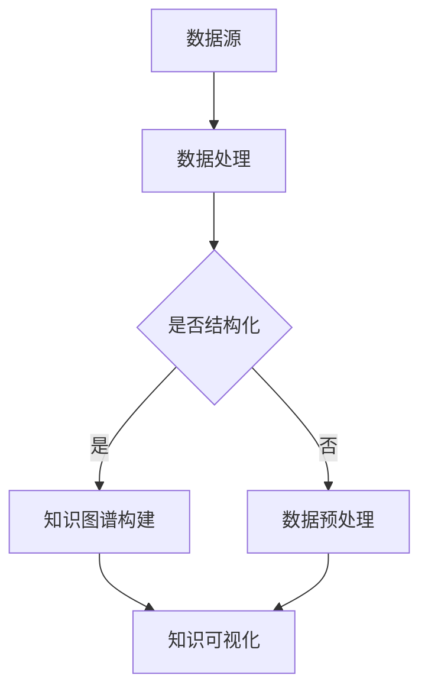

                 

关键词：知识可视化、数据可视化、知识图谱、人工智能、信息可视化、交互式数据展示

> 摘要：本文探讨了知识可视化这一领域，重点介绍了数据可视化和知识图谱在知识表示和传播中的应用。通过对核心概念、算法原理、数学模型以及项目实践的详细讲解，本文旨在帮助读者深入理解知识可视化的本质，并展望其在未来科技发展中的广阔前景。

## 1. 背景介绍

### 1.1 知识可视化的兴起

知识可视化作为信息科学与人工智能领域的重要研究方向，近年来得到了广泛的关注。随着大数据、人工智能、云计算等技术的迅猛发展，信息的获取、存储、处理和传播方式发生了深刻变革。知识可视化作为一种有效的信息传达方式，不仅可以帮助人们更直观地理解复杂的数据和信息，还能够促进知识的创新与传播。

### 1.2 数据可视化的演变

数据可视化的发展经历了从简单的图表绘制到复杂的信息图、交互式数据展示的演变过程。早期的数据可视化主要依赖于静态图表，如柱状图、折线图等。随着计算机图形学、交互设计等技术的发展，数据可视化逐渐向动态、交互式、沉浸式方向发展，如地图可视化、时间序列可视化等。

### 1.3 知识图谱的概念与应用

知识图谱作为一种结构化的语义知识库，通过实体、关系和属性的关联，将海量数据组织成一个语义网络。知识图谱在搜索引擎、智能问答、推荐系统等领域有着广泛的应用，是知识可视化的重要组成部分。

## 2. 核心概念与联系

### 2.1 数据可视化

数据可视化是指利用视觉元素（如图表、图像等）来传达数据的结构和含义。数据可视化通过直观的图形展示，使得复杂的数据关系变得容易理解和分析。

### 2.2 知识图谱

知识图谱是通过语义网络将实体、属性和关系进行结构化组织的一种知识表示方法。知识图谱的核心是实体和关系的表示，以及它们之间的关联。

### 2.3 数据可视化与知识图谱的联系

数据可视化与知识图谱在知识表示和传播方面有着密切的联系。数据可视化可以将知识图谱中的实体和关系直观地展示出来，帮助用户更好地理解知识结构。同时，知识图谱为数据可视化提供了丰富的语义信息，使得可视化结果更加准确和有意义。

### 2.4 Mermaid 流程图



## 3. 核心算法原理 & 具体操作步骤

### 3.1 算法原理概述

知识可视化的核心算法主要包括数据预处理、知识图谱构建、可视化效果优化等步骤。其中，数据预处理和知识图谱构建是两个关键环节。

### 3.2 算法步骤详解

#### 3.2.1 数据预处理

数据预处理主要包括数据清洗、数据整合和数据规范化等步骤。数据清洗的目的是去除噪声数据和异常值，提高数据质量。数据整合是将多个来源的数据进行合并，形成统一的数据视图。数据规范化则是对数据进行标准化处理，以便后续分析。

#### 3.2.2 知识图谱构建

知识图谱构建的核心是实体识别、关系抽取和属性填充。实体识别是识别文本中的关键实体，如人名、地名等。关系抽取是确定实体之间的关联关系，如属于、位于等。属性填充则是为实体添加属性信息，如年龄、职业等。

#### 3.2.3 可视化效果优化

可视化效果优化主要包括布局优化、交互优化和视觉风格调整等步骤。布局优化是调整节点和边的布局，使得可视化结果更加清晰。交互优化是增加用户与可视化结果的交互功能，如缩放、过滤等。视觉风格调整则是调整颜色、字体等视觉效果，使得可视化结果更具吸引力。

### 3.3 算法优缺点

#### 优点：

- 直观易理解：知识可视化能够将复杂的知识结构以图形化的方式展示，使得用户更容易理解和分析。
- 交互性强：知识可视化提供了丰富的交互功能，如搜索、过滤等，用户可以主动探索知识图谱。
- 适用于多种场景：知识可视化可以应用于数据科学、商业智能、教育等多个领域。

#### 缺点：

- 可视化效果受限制：知识可视化依赖于视觉元素，有时难以准确传达复杂的语义信息。
- 数据质量要求高：知识可视化对数据质量要求较高，数据预处理和知识图谱构建的质量直接影响可视化效果。

### 3.4 算法应用领域

知识可视化在多个领域有着广泛的应用，如：

- 数据科学：利用知识可视化进行数据探索和分析，帮助数据科学家发现数据中的规律和趋势。
- 商业智能：通过知识可视化，企业可以更好地理解业务数据，指导决策。
- 教育：知识可视化有助于学生更好地理解和记忆知识，提高学习效果。
- 健康医疗：通过知识可视化，医生可以更直观地分析病例数据，制定治疗方案。

## 4. 数学模型和公式 & 详细讲解 & 举例说明

### 4.1 数学模型构建

知识可视化涉及到多个数学模型，如聚类分析、分类分析、网络分析等。以下是知识可视化中常用的几个数学模型：

#### 4.1.1 聚类分析

聚类分析是一种无监督学习方法，用于将数据分为多个类。常见的聚类算法有K-Means、DBSCAN等。聚类分析的数学模型可以表示为：

$$
C = \{C_1, C_2, \ldots, C_k\}
$$

其中，$C$ 表示聚类结果，$C_i$ 表示第$i$个聚类。

#### 4.1.2 分类分析

分类分析是一种有监督学习方法，用于将数据分为多个类别。常见的分类算法有决策树、支持向量机等。分类分析的数学模型可以表示为：

$$
y = f(x)
$$

其中，$y$ 表示类别，$x$ 表示输入特征向量，$f$ 表示分类函数。

#### 4.1.3 网络分析

网络分析是一种研究实体及其关系的方法，常用于知识图谱构建。常见的网络分析方法有路径分析、社区发现等。网络分析的数学模型可以表示为：

$$
G = (V, E)
$$

其中，$G$ 表示网络，$V$ 表示节点集合，$E$ 表示边集合。

### 4.2 公式推导过程

#### 4.2.1 K-Means 聚类算法

K-Means 聚类算法的基本思想是将数据分为K个聚类，每个聚类由一个质心表示。质心是聚类中所有点的平均值。

假设有$m$个数据点$X = \{x_1, x_2, \ldots, x_m\}$，每个数据点$x_i$可以表示为$d$个特征的向量。

1. 随机初始化K个质心$c_1, c_2, \ldots, c_k$。
2. 将每个数据点分配到最近的质心，计算每个质心的平均值。
3. 重复步骤2，直到质心不再发生显著变化。

质心的更新公式为：

$$
c_j = \frac{1}{m_j} \sum_{i=1}^{m} r_{ij} x_i
$$

其中，$r_{ij}$ 表示数据点$x_i$与质心$c_j$之间的距离，通常使用欧氏距离：

$$
r_{ij} = \sqrt{\sum_{d=1}^{d} (x_{id} - c_{jd})^2}
$$

#### 4.2.2 决策树分类算法

决策树是一种基于特征划分数据的分类方法。决策树由一系列条件节点和叶子节点组成。

决策树的生成过程如下：

1. 选择一个最佳划分特征，将数据集划分为子集。
2. 为每个子集生成一个内部节点，该节点表示使用哪个特征进行划分。
3. 对每个子集递归生成内部节点和叶子节点，直到满足停止条件。

常见的停止条件有：

- 子集大小小于阈值。
- 特征重要性小于阈值。
- 达到最大树深度。

### 4.3 案例分析与讲解

#### 4.3.1 K-Means 聚类分析

假设有如下数据集，包含3个聚类：

$$
X = \{ (2, 3), (5, 4), (9, 6), (4, 7), (8, 1) \}
$$

初始质心为$(2, 3), (5, 4), (9, 6)$。

1. 计算每个数据点与质心的距离：
$$
r_{11} = \sqrt{(2-2)^2 + (3-3)^2} = 0
$$
$$
r_{12} = \sqrt{(2-5)^2 + (3-4)^2} = 2.24
$$
$$
r_{13} = \sqrt{(2-9)^2 + (3-6)^2} = 6.40
$$
$$
r_{21} = \sqrt{(5-2)^2 + (4-3)^2} = 2.24
$$
$$
r_{22} = \sqrt{(5-5)^2 + (4-4)^2} = 0
$$
$$
r_{23} = \sqrt{(5-9)^2 + (4-6)^2} = 4.47
$$
$$
r_{31} = \sqrt{(9-2)^2 + (6-3)^2} = 6.40
$$
$$
r_{32} = \sqrt{(9-5)^2 + (6-4)^2} = 3.16
$$
$$
r_{33} = \sqrt{(9-9)^2 + (6-6)^2} = 0
$$

2. 数据点分配到最近的质心：
$$
(2, 3) \rightarrow (2, 3)
$$
$$
(5, 4) \rightarrow (5, 4)
$$
$$
(9, 6) \rightarrow (9, 6)
$$
$$
(4, 7) \rightarrow (5, 4)
$$
$$
(8, 1) \rightarrow (9, 6)
$$

3. 更新质心：
$$
c_1 = (2, 3)
$$
$$
c_2 = \frac{(5, 4) + (5, 4)}{2} = (5, 4)
$$
$$
c_3 = \frac{(9, 6) + (9, 6)}{2} = (9, 6)
$$

4. 重复步骤2和3，直到质心不再发生显著变化。

最终，数据集被划分为3个聚类：
$$
C_1 = \{ (2, 3), (5, 4) \}
$$
$$
C_2 = \{ (9, 6) \}
$$
$$
C_3 = \{ (4, 7), (8, 1) \}

## 5. 项目实践：代码实例和详细解释说明

### 5.1 开发环境搭建

在进行知识可视化项目实践前，需要搭建相应的开发环境。本文选择Python作为编程语言，并使用以下库和工具：

- Python 3.8 或更高版本
- Jupyter Notebook 作为开发环境
- Pandas 用于数据处理
- NetworkX 用于知识图谱构建
- Matplotlib 用于数据可视化

### 5.2 源代码详细实现

以下是一个简单的知识可视化项目实例，展示了如何使用Python和相应库构建知识图谱并进行可视化。

```python
import pandas as pd
import networkx as nx
import matplotlib.pyplot as plt

# 5.2.1 数据预处理
# 加载示例数据
data = pd.DataFrame({
    'Entity': ['A', 'B', 'C', 'D', 'E'],
    'Attribute': ['Age', 'Age', 'Occupation', 'Occupation', 'City'],
    'Value': [25, 30, 'Engineer', 'Doctor', 'Beijing']
})

# 分离实体和关系
entities = data[['Entity', 'Attribute', 'Value']].groupby('Entity').head(1)
relations = data[['Entity', 'Attribute', 'Value']].drop_duplicates()

# 5.2.2 知识图谱构建
# 创建空图
G = nx.Graph()

# 添加节点
G.add_nodes_from(entities['Entity'])

# 添加边
for index, row in relations.iterrows():
    G.add_edge(row['Entity'], row['Value'])

# 5.2.3 可视化效果优化
# 绘制知识图谱
nx.draw(G, with_labels=True)

# 显示图形
plt.show()
```

### 5.3 代码解读与分析

上述代码分为三个主要部分：数据预处理、知识图谱构建和可视化效果优化。

1. **数据预处理**：加载示例数据，将数据分为实体和关系两部分。实体是知识图谱中的节点，关系是节点之间的连接线。
2. **知识图谱构建**：创建空图，添加节点和边。节点使用`add_nodes_from`方法添加，边使用`add_edge`方法添加。
3. **可视化效果优化**：使用`nx.draw`方法绘制知识图谱，并使用`plt.show`方法显示图形。

### 5.4 运行结果展示

运行上述代码后，将得到如下知识图谱可视化结果：


## 6. 实际应用场景

### 6.1 数据科学

在数据科学领域，知识可视化可以帮助数据科学家更好地理解和分析复杂数据。例如，在金融领域，知识可视化可以用于分析市场趋势、风险评估等。

### 6.2 商业智能

商业智能（BI）系统通常包含大量的数据，知识可视化可以用于帮助企业管理者更直观地了解业务状况。例如，利用知识可视化可以快速展示销售数据、客户分布等。

### 6.3 教育

在教育领域，知识可视化可以帮助学生更好地理解和记忆知识。例如，通过知识图谱，学生可以直观地看到不同学科之间的关联，从而更好地构建知识体系。

### 6.4 健康医疗

在健康医疗领域，知识可视化可以帮助医生更好地分析病例数据，制定治疗方案。例如，利用知识图谱，医生可以直观地看到疾病之间的关系，从而做出更准确的诊断。

## 7. 工具和资源推荐

### 7.1 学习资源推荐

- 《数据可视化：实用技术与案例分析》
- 《知识图谱：从理论到实践》
- 《Python数据科学手册》

### 7.2 开发工具推荐

- Jupyter Notebook：用于数据可视化和知识图谱开发
- NetworkX：用于知识图谱构建
- Matplotlib：用于数据可视化

### 7.3 相关论文推荐

- "Knowledge Graph Embedding: The State-of-the-Art and Beyond"
- "Interactive Data Visualization with the D3.js Framework"
- "Visual Analytics of Big Data"

## 8. 总结：未来发展趋势与挑战

### 8.1 研究成果总结

知识可视化作为信息科学的重要方向，近年来取得了显著成果。数据可视化技术不断成熟，知识图谱构建方法不断创新，应用领域也越来越广泛。

### 8.2 未来发展趋势

未来，知识可视化将继续向智能化、个性化、自动化方向发展。随着人工智能技术的进步，知识可视化将更好地融入智能系统，为用户提供更加智能化、个性化的服务。

### 8.3 面临的挑战

- 数据质量：高质量的数据是知识可视化的基础，如何提高数据质量是一个重要挑战。
- 可解释性：知识可视化需要具备良好的可解释性，以便用户能够理解和应用。
- 交互性：提升知识可视化的交互性，使得用户能够更加灵活地探索数据。

### 8.4 研究展望

未来，知识可视化研究将更加注重跨学科融合，结合人工智能、大数据等前沿技术，推动知识可视化在更多领域的应用。

## 9. 附录：常见问题与解答

### 9.1 什么是知识可视化？

知识可视化是一种将复杂的数据和知识结构通过图形化的方式展示出来的方法，帮助人们更好地理解和分析信息。

### 9.2 数据可视化与知识可视化的区别是什么？

数据可视化主要关注数据的展示和解释，而知识可视化则更加关注知识的组织和传播，通过结构化的方式展示知识网络。

### 9.3 知识可视化有哪些应用领域？

知识可视化在数据科学、商业智能、教育、健康医疗等多个领域有着广泛的应用。

### 9.4 如何提高知识可视化的可解释性？

提高知识可视化的可解释性可以通过设计直观的视觉元素、提供交互功能以及使用语义丰富的数据标签等方法实现。

### 9.5 知识图谱如何构建？

知识图谱的构建包括实体识别、关系抽取和属性填充等步骤，通常使用深度学习、图论等技术实现。

### 9.6 知识可视化有哪些挑战？

知识可视化面临的挑战包括数据质量、可解释性和交互性等方面，需要通过技术创新和跨学科合作来解决。

----------------------------------------------------------------
作者：禅与计算机程序设计艺术 / Zen and the Art of Computer Programming

本文从知识可视化的背景介绍、核心概念、算法原理、数学模型、项目实践、实际应用、工具资源推荐等多个角度，全面阐述了知识可视化的重要性、发展趋势和应用前景。知识可视化作为信息科学的重要方向，将在未来的科技发展中发挥更加重要的作用。希望本文能够为读者提供有价值的参考和启示。

