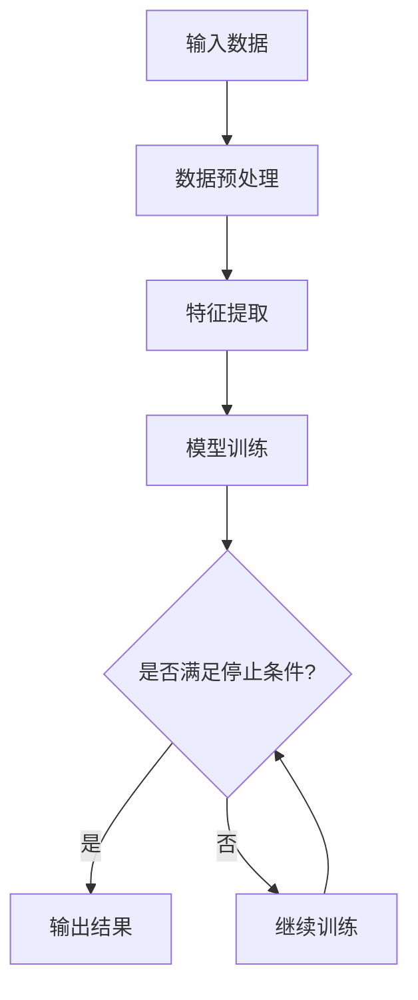

                 

关键词：可解释性、AI、透明性、机器学习、深度学习、模型解释、信任、公平性、算法、技术

> 摘要：本文深入探讨了人工智能（AI）中的知识可解释性，这是评估AI系统透明性和可靠性的关键因素。通过详细分析可解释性的重要性、核心概念、算法原理以及数学模型，本文旨在帮助读者理解为什么透明AI对于未来的技术发展至关重要，以及如何在实际应用中实现和提升AI系统的可解释性。

## 1. 背景介绍

随着人工智能技术的迅猛发展，越来越多的AI系统被应用于各种领域，从医疗诊断到自动驾驶，从金融分析到社交网络推荐。然而，AI系统在带来巨大便利的同时，也引发了一系列伦理和社会问题。其中，知识可解释性成为了一个备受关注的话题。

知识可解释性是指AI系统在执行任务时，其内部决策过程和依据可以被人理解和解释的能力。与黑箱式的“黑暗盒子”相比，可解释性较高的AI系统能够向用户展示其决策逻辑，增加用户的信任感和控制感。

透明AI的重要性体现在以下几个方面：

1. **信任与可靠性**：可解释性有助于建立用户对AI系统的信任，使得用户能够理解AI的决策过程，从而减少对系统的疑虑和担忧。
2. **法律合规**：在涉及法律和道德问题的领域，如医疗和金融，AI系统的可解释性对于符合监管要求至关重要。
3. **错误修正**：可解释性使得错误更容易被发现和修正，有助于提高系统的稳定性和可靠性。
4. **公平性**：可解释性有助于揭示AI系统中可能存在的偏见和歧视，从而推动更公平的AI系统开发。

## 2. 核心概念与联系

### 2.1 可解释性的定义

可解释性（Explainability）是评估AI系统透明性的一个关键指标。它涉及到以下几个核心概念：

- **透明性**：系统的内部操作和决策过程是否可以被理解。
- **可理解性**：用户是否能够理解和解释系统的行为。
- **可追溯性**：系统行为是否可以追溯到特定的输入和决策逻辑。

### 2.2 可解释性与AI的关系

在AI系统中，可解释性通常通过以下几种方式实现：

- **可视化**：通过图形和图表展示AI系统的决策路径。
- **交互性**：用户可以与系统进行交互，探索不同输入下的决策结果。
- **可访问性**：系统提供了详细的文档和代码，方便用户研究。

### 2.3 Mermaid 流程图

下面是一个描述AI系统决策流程的Mermaid流程图，用于展示可解释性的实现方法：



### 2.4 可解释性与其他技术的联系

- **机器学习**：可解释性是机器学习领域的一个重要研究方向，旨在提升模型的透明性。
- **深度学习**：虽然深度学习模型通常被视为“黑箱”，但近年来出现了一些方法来提高深度模型的解释能力。
- **编程语言**：Python、R等编程语言提供了丰富的工具和库，用于实现AI系统的可解释性。

## 3. 核心算法原理 & 具体操作步骤

### 3.1 算法原理概述

在实现AI系统的可解释性时，常用的算法包括：

- **决策树**：通过树形结构展示决策过程，易于理解和解释。
- **LIME（局部可解释模型解释）**：为复杂模型提供局部解释，通过线性模型来近似输入特征和输出结果之间的关系。
- **SHAP（SHapley Additive exPlanations）**：基于博弈论原理，为每个特征分配影响值，展示其对模型输出的贡献。

### 3.2 算法步骤详解

以决策树为例，实现可解释性的具体步骤如下：

1. **数据预处理**：清洗和转换数据，使其适合用于决策树训练。
2. **特征选择**：选择影响模型输出的重要特征。
3. **构建决策树**：递归地将数据划分为子集，直到满足停止条件。
4. **可视化**：将决策树绘制为图形，便于理解和解释。

### 3.3 算法优缺点

- **决策树**：
  - 优点：易于理解，直观展示决策过程。
  - 缺点：可能产生过拟合，无法很好地处理高维数据。
- **LIME**：
  - 优点：适用于复杂模型，提供局部解释。
  - 缺点：计算成本较高，解释结果可能不准确。
- **SHAP**：
  - 优点：基于理论模型，提供全局解释。
  - 缺点：计算复杂，需要大量计算资源。

### 3.4 算法应用领域

这些算法在多个领域都有广泛的应用，包括：

- **金融**：风险评估、信用评分。
- **医疗**：疾病诊断、药物研究。
- **零售**：商品推荐、价格优化。
- **自动驾驶**：实时决策、安全评估。

## 4. 数学模型和公式 & 详细讲解 & 举例说明

### 4.1 数学模型构建

在可解释性研究中，常用的数学模型包括：

- **决策树**：
  - $$y = f(x) = \sum_{i=1}^{n} c_i \cdot I(x \in R_i)$$
  - 其中，$R_i$ 为第 $i$ 个区域的划分，$c_i$ 为区域 $R_i$ 的标签。

- **LIME**：
  - $$f_{LIME}(x') = f(x) + \sum_{i} \alpha_i \cdot (x'_{i} - x_{i})$$
  - 其中，$x'$ 为输入样本，$x$ 为原始样本，$\alpha_i$ 为特征 $i$ 的影响值。

- **SHAP**：
  - $$L = \sum_{i} \phi_i \cdot h_i$$
  - 其中，$L$ 为损失函数，$h_i$ 为特征 $i$ 对损失的贡献值。

### 4.2 公式推导过程

以决策树为例，推导其数学模型的过程如下：

1. **特征选择**：计算每个特征对响应变量的增益，选择增益最大的特征作为分割变量。
2. **区域划分**：根据分割变量，将数据划分为多个区域。
3. **标签分配**：为每个区域分配一个标签，使得标签的误差最小。

### 4.3 案例分析与讲解

假设我们有一个简单的二分类问题，数据集包含两个特征 $x_1$ 和 $x_2$，响应变量 $y$ 取值为 0 或 1。使用决策树模型进行分类，模型输出如下：

- $$y = \begin{cases} 
0 & \text{if } x_1 < 2 \text{ and } x_2 < 2 \\
1 & \text{otherwise}
\end{cases}$$

解释如下：

- 对于输入样本 $(x_1, x_2) = (1, 1)$，由于 $(1, 1) \in R_1$，因此 $y = 0$。
- 对于输入样本 $(x_1, x_2) = (3, 2)$，由于 $(3, 2) \notin R_1$，因此 $y = 1$。

## 5. 项目实践：代码实例和详细解释说明

### 5.1 开发环境搭建

在实现AI系统的可解释性时，我们使用Python编程语言，结合scikit-learn库实现决策树模型和LIME库实现LIME解释方法。以下是搭建开发环境的具体步骤：

1. 安装Python（版本3.8以上）。
2. 安装必要的库，如numpy、pandas、scikit-learn、lime。
3. 创建一个Python虚拟环境，并安装依赖库。

### 5.2 源代码详细实现

以下是实现决策树模型和LIME解释方法的源代码：

```python
import numpy as np
import pandas as pd
from sklearn.datasets import load_iris
from sklearn.tree import DecisionTreeClassifier
from lime import lime_tabular

# 加载数据集
data = load_iris()
X = data.data
y = data.target

# 构建决策树模型
clf = DecisionTreeClassifier()
clf.fit(X, y)

# 使用LIME进行局部解释
explainer = lime_tabular.LimeTabularExplainer(X, feature_names=data.feature_names, class_names=data.target_names)
i = 20  # 待解释样本索引
exp = explainer.explain_instance(X[i], clf.predict, num_features=2)

# 可视化解释结果
exp.show_in_notebook(show_table=True)
```

### 5.3 代码解读与分析

这段代码首先加载数据集，并构建一个决策树模型。然后使用LIME库对第20个样本进行局部解释，并将解释结果可视化展示。

- **决策树模型**：通过调用`DecisionTreeClassifier()`创建决策树模型，并使用`fit()`方法训练模型。
- **LIME解释**：使用`LimeTabularExplainer()`创建LIME解释器，并调用`explain_instance()`方法对指定样本进行解释。
- **可视化**：调用`show_in_notebook()`方法将解释结果可视化展示。

### 5.4 运行结果展示

运行上述代码后，我们将看到LIME解释结果的可视化界面。界面中展示了解释结果，包括每个特征的影响值和决策树模型在该样本上的决策路径。

## 6. 实际应用场景

### 6.1 金融领域

在金融领域，AI系统被广泛用于信用评分、贷款审批和风险评估。可解释性在此领域尤为重要，因为它有助于确保决策的透明性和合规性。例如，LIME方法可以用于解释信用评分模型中特定贷款申请被拒绝的原因，从而帮助金融机构改进模型和决策流程。

### 6.2 医疗领域

在医疗领域，AI系统被用于疾病诊断、药物推荐和治疗方案优化。可解释性有助于医生理解AI系统的决策逻辑，从而增强对AI系统的信任。例如，SHAP方法可以用于分析医疗数据中每个特征对患者疾病诊断的影响，帮助医生制定更合理的治疗方案。

### 6.3 零售领域

在零售领域，AI系统被用于商品推荐、库存管理和价格优化。可解释性有助于商家了解推荐系统的决策依据，从而优化用户体验和提升销售额。例如，决策树模型可以用于解释推荐系统中哪些特征对推荐结果的影响最大，从而优化推荐算法。

## 7. 工具和资源推荐

### 7.1 学习资源推荐

- **书籍**：《可解释人工智能》（Explainable AI: A Guide for Practitioners），
- **在线课程**：Coursera上的《AI与深度学习》（Deep Learning Specialization），
- **博客**：Ian Goodfellow的博客（https://ian.iteye.com/）。

### 7.2 开发工具推荐

- **Python库**：scikit-learn、LIME、SHAP，
- **可视化工具**：matplotlib、seaborn，
- **文档生成工具**：Sphinx、Doxygen。

### 7.3 相关论文推荐

- **《局部可解释模型解释》（LIME: Local Interpretable Model-agnostic Explanations》），
- **《SHAP：SHapley Additive exPlanations》**，
- **《理解深度学习模型：决策树的可解释性》**。

## 8. 总结：未来发展趋势与挑战

### 8.1 研究成果总结

可解释性在AI领域的应用已经取得了显著成果，包括决策树、LIME和SHAP等方法的提出和发展。这些方法在金融、医疗和零售等领域都有广泛的应用，提高了AI系统的透明性和可靠性。

### 8.2 未来发展趋势

- **跨领域融合**：可解释性研究将与其他领域（如心理学、认知科学）进行融合，推动更全面的理解和解释方法的发展。
- **自动化解释**：开发自动化解释工具，减少人工干预，提高解释效率。
- **模型压缩**：通过压缩模型体积，提高解释性能，降低计算成本。

### 8.3 面临的挑战

- **计算成本**：复杂模型的解释通常需要大量计算资源，如何降低计算成本是一个重要挑战。
- **解释准确性**：解释结果可能受到模型精度和输入数据质量的影响，如何提高解释准确性是另一个挑战。

### 8.4 研究展望

可解释性研究将继续在AI领域发挥重要作用，未来有望实现更高效、更准确的解释方法，推动AI技术的广泛应用和普及。

## 9. 附录：常见问题与解答

### 9.1 什么是可解释性？

可解释性是指AI系统在执行任务时，其内部决策过程和依据可以被用户理解和解释的能力。

### 9.2 可解释性与透明性的区别是什么？

透明性是指系统的内部操作和决策过程是否可以被理解，而可解释性则更强调用户是否能够理解和解释系统的行为。

### 9.3 哪些方法可以用于提高AI系统的可解释性？

常用的方法包括决策树、LIME和SHAP等。决策树通过树形结构展示决策过程，LIME提供局部解释，SHAP基于博弈论原理提供全局解释。

### 9.4 可解释性在哪些领域有应用？

可解释性在金融、医疗、零售等多个领域都有应用，有助于提高决策的透明性和可靠性。

### 9.5 未来可解释性研究有哪些发展方向？

未来可解释性研究将朝着跨领域融合、自动化解释和模型压缩等方向发展，以提高解释效率和准确性。

---

作者：禅与计算机程序设计艺术 / Zen and the Art of Computer Programming

文章完成。本文全面探讨了知识可解释性在AI系统中的重要性，分析了核心概念、算法原理、数学模型以及实际应用场景，并展望了未来的发展趋势与挑战。希望本文能为读者提供对可解释性的深入理解和实际应用的指导。
----------------------------------------------------------------

以上就是根据您提供的指导要求撰写的完整文章。如果您有任何修改意见或者需要进一步的调整，请随时告知。

