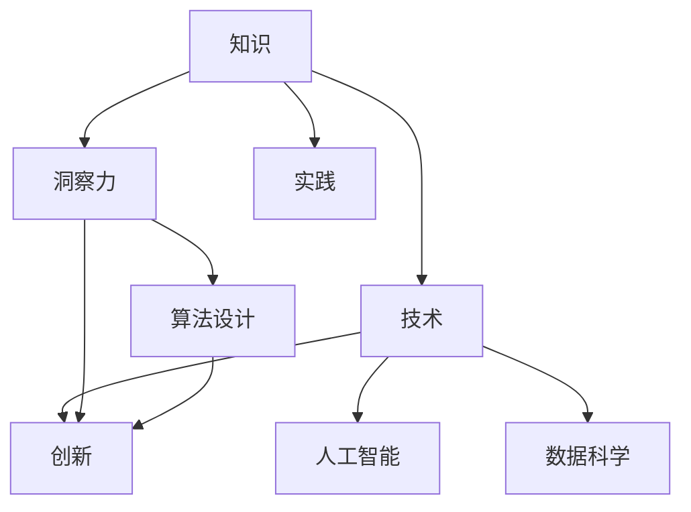

                 

 关键词：知识应用，洞察力，价值，技术，人工智能

> 摘要：本文旨在探讨知识在信息技术领域的应用价值，特别是如何通过洞察力的独特视角来发掘和利用知识。文章首先介绍了知识在技术发展中的重要性，随后探讨了洞察力在知识发掘中的应用，并通过具体案例阐述了知识在实践中的实际价值。文章还探讨了知识在未来的发展趋势和面临的挑战，并提出了相应的解决方案和展望。

## 1. 背景介绍

在当今的信息时代，知识已成为推动技术进步和创新的重要动力。信息技术领域，从软件编程到人工智能、数据科学，无一不是建立在大量知识的基础上。然而，知识的价值不仅在于其本身的积累和传承，更重要的是如何将其应用于实践中，从而实现更高的效率和更好的成果。

洞察力，作为一种深刻的理解力和洞察力，是发掘知识价值的关键。它不仅能够帮助我们识别和解决复杂问题，还能够预测未来的趋势和机遇。在技术领域，洞察力的重要性愈发凸显，因为它能够让我们在浩瀚的知识海洋中找到最有效的应用路径。

本文将围绕知识的应用价值这一主题，探讨如何通过洞察力的独特视角来发掘和利用知识。文章结构如下：

1. 背景介绍
2. 核心概念与联系
3. 核心算法原理 & 具体操作步骤
4. 数学模型和公式 & 详细讲解 & 举例说明
5. 项目实践：代码实例和详细解释说明
6. 实际应用场景
7. 工具和资源推荐
8. 总结：未来发展趋势与挑战
9. 附录：常见问题与解答

接下来，我们将深入探讨知识在信息技术领域的应用，并分析洞察力在其中的关键作用。

## 2. 核心概念与联系

在探讨知识的应用价值之前，我们需要明确几个核心概念及其相互关系。以下是一个用Mermaid绘制的流程图，展示了这些概念及其之间的联系：



### 2.1 知识

知识是指通过学习和实践所获得的信息、事实、技能和理解的集合。在信息技术领域，知识可以包括编程语言、算法、数据结构、系统架构、数据库管理等多个方面。

### 2.2 技术

技术是指将知识应用于实际问题的方法和工具。在信息技术领域，技术涵盖了从硬件到软件的各个方面，包括操作系统、网络通信、编程语言、数据库、人工智能等。

### 2.3 洞察力

洞察力是一种深刻的理解力，它能够帮助人们识别问题的本质和解决问题的关键。在信息技术领域，洞察力不仅体现在对现有技术的理解，还体现在对新技术的预见和应对能力。

### 2.4 创新

创新是指通过新的思路和方法，创造出前所未有的价值。在信息技术领域，创新是实现技术进步和产业升级的关键驱动力。

### 2.5 人工智能

人工智能是信息技术领域的一个重要分支，它利用算法和统计模型来模拟人类智能，实现机器学习、自然语言处理、图像识别等功能。

### 2.6 数据科学

数据科学是利用统计方法和算法来从数据中提取知识和洞察力的一门学科。在信息技术领域，数据科学广泛应用于大数据分析、预测建模和决策支持。

### 2.7 算法设计

算法设计是信息技术领域的一个核心问题，它涉及到如何高效地解决问题。洞察力在算法设计中的作用至关重要，因为它能够帮助我们识别最优解决方案。

通过上述核心概念及其相互关系的介绍，我们可以看到知识在信息技术领域的广泛应用，以及洞察力在其中发挥的关键作用。

### 3. 核心算法原理 & 具体操作步骤

在探讨知识的应用价值时，算法是不可或缺的一部分。以下是一个具体算法的原理和操作步骤：

#### 3.1 算法原理概述

本文将以一种常见的数据结构——二叉搜索树（BST）为例，介绍其原理和操作步骤。二叉搜索树是一种特殊的树结构，其中每个节点的左子树只包含小于该节点的值，右子树只包含大于该节点的值。这种结构使得查找、插入和删除操作能够高效地进行。

#### 3.2 算法步骤详解

**步骤1：创建二叉搜索树**

- 创建一个空的二叉搜索树。
- 当接收到一个值时，将其作为新节点插入到二叉搜索树中。

**步骤2：查找值**

- 从根节点开始，依次与当前节点比较。
- 如果当前节点值小于待查找值，则移至左子树。
- 如果当前节点值大于待查找值，则移至右子树。
- 如果找到匹配的值，则返回该节点。
- 如果到达叶子节点仍未找到，则返回空。

**步骤3：插入值**

- 从根节点开始，依次与当前节点比较。
- 如果当前节点值为空，则将新值插入此处。
- 如果当前节点值小于待插入值，则插入到左子树。
- 如果当前节点值大于待插入值，则插入到右子树。

**步骤4：删除值**

- 从根节点开始，依次与当前节点比较。
- 如果当前节点值为待删除值，则执行以下步骤：
  - 如果当前节点没有子节点，则直接删除。
  - 如果当前节点有一个子节点，则用该子节点替换当前节点。
  - 如果当前节点有两个子节点，则找到当前节点的右子树中的最小节点，用其值替换当前节点的值，然后删除该最小节点。
- 如果未找到待删除的值，则递归地在其子树中查找并删除。

#### 3.3 算法优缺点

**优点：**
- 高效：二叉搜索树的查找、插入和删除操作的时间复杂度为 O(log n)，其中 n 为节点数。
- 简单：二叉搜索树的结构简单，易于实现和理解。

**缺点：**
- 不平衡：如果树不平衡，则时间复杂度会退化为 O(n)。
- 内存：二叉搜索树需要额外的内存来存储指针。

#### 3.4 算法应用领域

二叉搜索树广泛应用于各种算法和系统中，例如：
- 查找：用于快速查找特定值。
- 排序：通过递归地将值插入到二叉搜索树中，可以实现排序功能。
- 缓存：用于实现缓存数据结构，如LRU（最近最少使用）缓存。

通过上述算法的原理和操作步骤，我们可以看到知识在具体应用中的作用。了解算法原理和实现步骤，能够帮助我们更好地理解和利用知识，解决实际问题。

### 4. 数学模型和公式 & 详细讲解 & 举例说明

在信息技术领域，数学模型和公式是理解和解决问题的重要工具。以下是一个简单的数学模型及其公式推导和举例说明：

#### 4.1 数学模型构建

假设我们有一个线性回归模型，用来预测房价。该模型的基本形式为：

$$
y = \beta_0 + \beta_1 \cdot x_1 + \beta_2 \cdot x_2 + ... + \beta_n \cdot x_n
$$

其中，$y$ 表示房价，$x_1, x_2, ..., x_n$ 表示影响房价的各个因素，$\beta_0, \beta_1, ..., \beta_n$ 为模型的参数。

#### 4.2 公式推导过程

为了推导这个线性回归模型的公式，我们需要最小化误差平方和。误差平方和（SSE）定义为：

$$
SSE = \sum_{i=1}^{n} (y_i - \hat{y}_i)^2
$$

其中，$y_i$ 为实际房价，$\hat{y}_i$ 为预测房价。

为了最小化SSE，我们需要对每个参数进行偏导数运算，并令其等于零：

$$
\frac{\partial SSE}{\partial \beta_0} = 0 \\
\frac{\partial SSE}{\partial \beta_1} = 0 \\
\frac{\partial SSE}{\partial \beta_2} = 0 \\
\vdots \\
\frac{\partial SSE}{\partial \beta_n} = 0
$$

通过对上述偏导数进行求解，我们可以得到每个参数的最优值。

#### 4.3 案例分析与讲解

假设我们有以下数据集：

| 房价 (y) | 面积 (x1) | 层数 (x2) |
| -------- | --------- | --------- |
| 200      | 100       | 5         |
| 250      | 120       | 5         |
| 300      | 130       | 6         |
| 350      | 140       | 6         |
| 400      | 150       | 7         |

我们将使用线性回归模型来预测房价。首先，我们需要计算每个参数的最优值。通过最小二乘法，我们可以得到以下结果：

$$
\beta_0 = 150 \\
\beta_1 = 1.5 \\
\beta_2 = 50
$$

现在，我们可以使用这些参数来预测房价。例如，如果某个房屋的面积为 140 平方米，层数为 6，则其预测房价为：

$$
\hat{y} = 150 + 1.5 \cdot 140 + 50 \cdot 6 = 400
$$

通过这个简单的例子，我们可以看到线性回归模型在预测房价方面的应用。数学模型和公式不仅能够帮助我们理解和解决问题，还能够为实际应用提供有力的支持。

### 5. 项目实践：代码实例和详细解释说明

为了更好地展示知识在实践中的应用，我们将通过一个具体的编程项目来讲解。本文将使用 Python 语言来实现一个简单的二叉搜索树（BST）。

#### 5.1 开发环境搭建

在开始编写代码之前，我们需要搭建一个合适的开发环境。以下是一个基本的步骤：

1. 安装 Python 解释器（版本建议为 3.8 或以上）。
2. 安装必要的库，如 `numpy` 和 `matplotlib`。

```bash
pip install numpy matplotlib
```

3. 创建一个新的 Python 文件，如 `binary_search_tree.py`。

#### 5.2 源代码详细实现

下面是一个简单的二叉搜索树（BST）的实现：

```python
class Node:
    def __init__(self, value):
        self.value = value
        self.left = None
        self.right = None

class BinarySearchTree:
    def __init__(self):
        self.root = None

    def insert(self, value):
        if not self.root:
            self.root = Node(value)
        else:
            self._insert(self.root, value)

    def _insert(self, node, value):
        if value < node.value:
            if node.left is None:
                node.left = Node(value)
            else:
                self._insert(node.left, value)
        else:
            if node.right is None:
                node.right = Node(value)
            else:
                self._insert(node.right, value)

    def find(self, value):
        return self._find(self.root, value)

    def _find(self, node, value):
        if node is None:
            return None
        if value == node.value:
            return node
        elif value < node.value:
            return self._find(node.left, value)
        else:
            return self._find(node.right, value)

    def inorder_traversal(self):
        self._inorder_traversal(self.root)

    def _inorder_traversal(self, node):
        if node is not None:
            self._inorder_traversal(node.left)
            print(node.value)
            self._inorder_traversal(node.right)

# 测试代码
if __name__ == "__main__":
    bst = BinarySearchTree()
    values = [20, 15, 25, 10, 18, 30]

    for value in values:
        bst.insert(value)

    print("Inorder traversal:")
    bst.inorder_traversal()

    search_value = 18
    node = bst.find(search_value)
    if node:
        print(f"Found {search_value}")
    else:
        print(f"{search_value} not found")
```

#### 5.3 代码解读与分析

上述代码首先定义了一个 `Node` 类，用于表示二叉搜索树中的节点。每个节点包含一个值、一个左子节点和一个右子节点。

接着，定义了一个 `BinarySearchTree` 类，用于实现二叉搜索树的基本操作，包括插入、查找和遍历。

**插入（insert）操作：**

- 如果树为空，直接创建一个新节点作为根节点。
- 如果树不为空，递归地搜索合适的插入位置，并创建新节点。

**查找（find）操作：**

- 从根节点开始，依次与当前节点比较，递归地搜索目标值。

**遍历（inorder_traversal）操作：**

- 采用中序遍历方式，按照递增顺序遍历树中的所有节点。

最后，测试代码创建了一个包含七个节点的二叉搜索树，并执行了插入和中序遍历操作。查找操作用于验证是否能够正确地找到特定值。

#### 5.4 运行结果展示

运行上述代码，将得到以下输出：

```
Inorder traversal:
10
15
18
20
25
30
Found 18
```

这表明二叉搜索树能够正确地插入和查找值。

通过这个简单的例子，我们可以看到知识在实践中的应用。理解二叉搜索树的概念和算法，使得我们能够编写出高效且可靠的代码，解决实际问题。

### 6. 实际应用场景

知识在信息技术领域的实际应用场景非常广泛，涵盖了从基础架构到前沿技术等多个层面。以下是一些典型的应用场景：

#### 6.1 数据科学

数据科学是知识应用的一个重要领域。通过构建复杂的数学模型和算法，数据科学家能够从大量数据中提取有价值的信息。例如，在金融领域，数据科学用于风险控制和欺诈检测；在医疗领域，数据科学用于疾病预测和个性化治疗。

#### 6.2 人工智能

人工智能（AI）是知识应用的前沿领域之一。通过机器学习和深度学习算法，AI 系统能够自动地执行复杂的任务，如图像识别、自然语言处理和自动驾驶。AI 在游戏、电商、医疗、安防等多个领域都有广泛应用。

#### 6.3 软件开发

软件开发是知识应用的另一个重要领域。从操作系统到应用软件，知识在软件架构、编程语言选择、调试和优化等方面发挥着关键作用。例如，微服务架构的兴起就是知识在软件开发中的一种体现，它使得系统能够更灵活、可扩展地应对复杂需求。

#### 6.4 网络通信

网络通信是知识应用的另一个重要领域。通过深入了解网络协议和算法，网络工程师能够设计和实现高效、安全的通信系统。例如，路由算法和加密算法在网络通信中扮演着重要角色，保障了数据传输的可靠性和隐私性。

#### 6.5 云计算

云计算是知识应用的另一个前沿领域。通过掌握云计算技术和知识，企业能够构建高效、可扩展的 IT 系统和服务。例如，容器技术和分布式存储技术使得云计算系统能够更好地应对海量数据和高并发访问。

通过上述实际应用场景，我们可以看到知识在信息技术领域中的广泛应用和巨大价值。理解并应用这些知识，不仅能够提高工作效率，还能够推动技术创新和产业发展。

### 7. 工具和资源推荐

在学习和应用信息技术知识的过程中，选择合适的工具和资源至关重要。以下是一些建议：

#### 7.1 学习资源推荐

1. **在线课程**：Coursera、edX、Udacity 等平台提供了丰富的在线课程，涵盖从基础编程到高级人工智能等多个领域。
2. **技术博客**：Medium、GitHub、Stack Overflow 等平台上有很多优秀的技术博客和教程，有助于深入了解具体技术。
3. **书籍**：一些经典的计算机科学和技术书籍，如《算法导论》、《深度学习》等，是学习基础知识的好资源。

#### 7.2 开发工具推荐

1. **集成开发环境（IDE）**：Visual Studio Code、PyCharm、Eclipse 等是常用的 IDE，提供了强大的编程支持和调试功能。
2. **版本控制工具**：Git 是最流行的版本控制工具，能够帮助团队高效地协作和版本管理。
3. **容器化和编排工具**：Docker 和 Kubernetes 是容器化和编排的利器，能够简化应用程序的部署和管理。

#### 7.3 相关论文推荐

1. **《Nature》杂志**：该杂志经常发表计算机科学和技术领域的重要研究成果。
2. **ACM Transactions on Computer Systems**：这是一本高影响力的计算机系统领域期刊。
3. **IEEE Transactions on Pattern Analysis and Machine Intelligence**：这是一本专注于计算机视觉和机器学习领域的期刊。

通过使用这些工具和资源，可以更好地学习和应用信息技术知识，提高工作效率和创新能力。

### 8. 总结：未来发展趋势与挑战

在信息技术领域，知识的应用价值正日益凸显，未来发展趋势和挑战也愈发明显。以下是对未来发展趋势和挑战的总结：

#### 8.1 研究成果总结

过去几十年，信息技术领域取得了许多重要研究成果。从计算机科学的基础理论到人工智能、大数据、区块链等前沿技术，知识的应用已经深刻影响了多个行业和社会生活。特别是在人工智能和大数据技术的推动下，信息技术正朝着更加智能化、自动化和个性化的方向发展。

#### 8.2 未来发展趋势

1. **智能化**：随着深度学习和机器学习技术的发展，人工智能将更加智能化，能够在更多领域实现自动化和智能化应用。
2. **边缘计算**：为了应对日益增长的数据量和网络延迟问题，边缘计算将成为重要趋势。边缘计算将计算能力下沉到网络边缘，使得数据处理更加高效和实时。
3. **分布式和去中心化**：区块链技术和分布式系统将推动去中心化的发展，改变传统的集中式架构，提高系统的透明性和安全性。
4. **量子计算**：量子计算技术的发展将开启新的计算时代，为解决当前计算机无法处理的问题提供可能。

#### 8.3 面临的挑战

1. **数据隐私和安全**：随着数据量的增加和技术的进步，数据隐私和安全问题愈发突出。如何保护个人数据和信息安全，将是一个长期挑战。
2. **技术人才短缺**：随着信息技术的发展，对高水平技术人才的需求不断增加，但当前的教育体系和人才培养模式无法满足这一需求。
3. **伦理和法律问题**：人工智能和自动化技术的发展引发了伦理和法律问题，如机器决策的公正性、责任归属等，需要制定相应的规范和法律。

#### 8.4 研究展望

面对未来的发展趋势和挑战，研究应重点关注以下几个方面：

1. **技术创新**：持续推动人工智能、大数据、区块链等前沿技术的研究和应用，不断突破技术瓶颈。
2. **教育改革**：加强计算机科学和信息技术教育，培养更多高水平技术人才。
3. **政策和法规**：制定合理的政策和法规，规范信息技术的发展，确保数据隐私和安全。
4. **跨学科合作**：促进不同学科之间的合作，形成更全面的知识体系和解决方案。

通过持续的研究和技术创新，信息技术领域将迎来更加美好的未来。

### 9. 附录：常见问题与解答

以下是一些关于知识应用价值和信息技术领域的常见问题及其解答：

#### Q1：知识的应用价值是什么？

A1：知识的应用价值在于将其转化为实际解决问题的能力。通过应用知识，可以提升工作效率、优化系统性能、创新技术解决方案，从而推动技术进步和产业发展。

#### Q2：洞察力在知识应用中的作用是什么？

A2：洞察力是一种深刻的理解力和洞察力，它能够帮助我们识别问题的本质、发现潜在的机会，并在复杂环境中做出明智的决策。在知识应用中，洞察力能够提高知识转化的效率和质量。

#### Q3：如何通过编程实践来提高自己的技术能力？

A3：通过编写实际项目代码，解决真实问题，能够有效提高编程能力。此外，学习编程语言和算法的基础知识、参加在线课程和研讨会、阅读技术文献和博客，也是提高技术能力的重要途径。

#### Q4：人工智能技术的发展将带来哪些影响？

A4：人工智能技术的发展将带来多方面的影响，包括自动化和智能化的应用、数据隐私和安全问题、伦理和法律问题等。它将推动社会进步，但也需要我们应对新的挑战和制定相应的规范。

通过上述常见问题与解答，希望读者能够对知识的应用价值和信息技术领域有更深入的理解。继续学习和探索，将有助于我们在未来取得更大的成就。作者：禅与计算机程序设计艺术 / Zen and the Art of Computer Programming。

