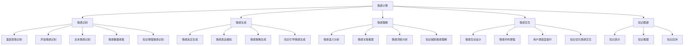

                 

### 关键词 Keyword

- 知识情感智能
- 情感计算
- 理性与感性
- 人机交互
- 人工智能

### 摘要 Abstract

本文旨在探讨知识情感智能这一新兴领域，分析其如何在人工智能系统中实现理性与感性的平衡。我们将从背景介绍入手，逐步深入探讨核心概念、算法原理、数学模型、实际应用，以及未来发展趋势和挑战。通过结合具体项目和实例，我们将展示知识情感智能在提升人机交互和情感理解方面的潜力，并提出相关工具和资源推荐，为读者提供全面的技术指导和前沿洞察。

## 1. 背景介绍

随着人工智能技术的飞速发展，机器在处理复杂任务和海量数据方面的能力显著提升。然而，传统的AI系统在情感智能方面仍存在明显不足，难以实现与人类情感的高度契合。为了弥补这一缺陷，知识情感智能（Emotionally Intelligent AI）应运而生，旨在结合理性计算和情感分析，为AI系统注入感性思维，实现更加人性化的交互。

知识情感智能的核心目标是通过理解、感知和模拟人类情感，提高人工智能系统的情感识别、情感生成和情感交互能力。这不仅有助于提升人机交互的体验，还能在心理健康、人机协同、智能教育、智能客服等领域发挥重要作用。

本文将从以下方面展开讨论：

1. 核心概念与联系
2. 核心算法原理与操作步骤
3. 数学模型与公式
4. 项目实践：代码实例解析
5. 实际应用场景
6. 未来应用展望
7. 工具和资源推荐
8. 总结：未来发展趋势与挑战

### 2. 核心概念与联系

#### 2.1. 情感计算

情感计算（Affective Computing）是指通过计算系统捕捉、理解、处理和模拟人类情感的能力。情感计算涉及多个子领域，包括情感识别、情感生成、情感理解和情感交互。

- **情感识别**：通过分析面部表情、声音、文字等信号，识别用户的情感状态。
- **情感生成**：模拟人类情感表达，使AI系统具备情感反应能力。
- **情感理解**：理解人类情感的内在含义和情感间的关联。
- **情感交互**：通过情感互动提高用户与AI系统的情感共鸣。

#### 2.2. 情感智能

情感智能（Emotional Intelligence）是指人类在情感认知、情感管理和情感交流方面的能力。情感智能通常包括自我意识、自我调节、社交意识和情绪理解等方面。

- **自我意识**：认识自己的情感状态，包括情感的来源和影响。
- **自我调节**：管理自己的情绪，以适应不同的环境和情境。
- **社交意识**：理解他人的情感状态，建立和维护良好的人际关系。
- **情绪理解**：理解情感与行为之间的关系，提高情感洞察力。

#### 2.3. 知识情感智能

知识情感智能（Knowledge-Aware Emotional Intelligence）是情感智能在人工智能领域的延伸，通过融合知识图谱和情感计算，实现AI系统对情感信息的深度理解和智能应用。

- **知识图谱**：以结构化方式表示知识，为情感智能提供丰富的语义信息。
- **情感计算**：通过情感识别、理解和交互，实现AI系统对用户情感的感知和响应。

### 3. 核心算法原理与操作步骤

#### 3.1. 算法原理概述

知识情感智能的核心算法主要分为情感识别、情感理解和情感生成三个层次。以下是一个简化的算法流程：

1. **情感识别**：利用面部表情、声音和文本分析等技术，识别用户的情感状态。
2. **情感理解**：通过知识图谱和语义分析，理解情感之间的关联和内在含义。
3. **情感生成**：根据情感理解和用户需求，生成合适的情感反应和交互策略。

#### 3.2. 算法步骤详解

##### 3.2.1. 情感识别

1. **面部表情识别**：利用卷积神经网络（CNN）对图像进行特征提取，识别面部表情。
2. **声音情感识别**：利用循环神经网络（RNN）对声音信号进行特征提取，识别情感模式。
3. **文本情感识别**：利用词嵌入和情感词典，分析文本的情感倾向。

##### 3.2.2. 情感理解

1. **知识图谱构建**：通过实体关系抽取和知识融合，构建情感知识图谱。
2. **语义分析**：利用自然语言处理（NLP）技术，分析文本的情感语义。
3. **情感关联推理**：利用图神经网络（GNN）进行情感关联推理，理解情感之间的关联。

##### 3.2.3. 情感生成

1. **情感反应生成**：根据情感理解和用户需求，生成合适的情感反应。
2. **交互策略生成**：根据情感反应和用户反馈，调整交互策略，提高用户满意度。

### 3.3. 算法优缺点

##### 3.3.1. 优点

- **高准确性**：通过多种数据源和算法技术，实现高精度的情感识别和理解。
- **智能化**：融合知识图谱和情感计算，使AI系统具备情感推理和生成能力。
- **广泛应用**：在多个领域（如心理健康、人机协同、智能教育等）具有广泛的应用前景。

##### 3.3.2. 缺点

- **计算复杂度高**：涉及多种算法和模型，计算资源需求较大。
- **数据依赖性强**：情感识别和理解的准确性受数据质量和数量的影响。
- **道德风险**：在处理用户情感信息时，可能涉及隐私保护和道德问题。

### 3.4. 算法应用领域

知识情感智能在多个领域具有广泛的应用前景，包括：

- **心理健康**：通过情感识别和理解，为用户提供个性化的心理健康服务。
- **人机协同**：通过情感交互，提高人机协作效率和用户体验。
- **智能教育**：通过情感分析和理解，提供个性化的学习建议和情感支持。
- **智能客服**：通过情感识别和生成，提供更自然的用户交互体验。

### 4. 数学模型与公式

#### 4.1. 数学模型构建

知识情感智能的数学模型主要包括情感识别、情感理解和情感生成三个部分。以下是一个简化的数学模型：

##### 4.1.1. 情感识别

假设 $X$ 是一个情感特征向量，$Y$ 是一个情感类别标签，则情感识别模型可以表示为：

$$
P(Y|X) = \text{softmax}(\theta^T X)
$$

其中，$\theta$ 是模型参数。

##### 4.1.2. 情感理解

假设 $G$ 是一个情感知识图谱，$R$ 是关系矩阵，$H$ 是实体嵌入向量，则情感理解模型可以表示为：

$$
h_e = \sigma(\sum_{r \in R} W_r h_r + b)
$$

其中，$h_e$ 是实体 $e$ 的情感嵌入，$W_r$ 是关系权重，$b$ 是偏置项，$\sigma$ 是激活函数。

##### 4.1.3. 情感生成

假设 $S$ 是一个情感策略向量，$U$ 是用户需求向量，则情感生成模型可以表示为：

$$
P(S|U) = \text{softmax}(\phi^T U)
$$

其中，$\phi$ 是模型参数。

#### 4.2. 公式推导过程

##### 4.2.1. 情感识别

情感识别模型的推导基于最大熵原理，目标是最大化条件熵：

$$
H(Y|X) = -\sum_{y} P(y|X) \log P(y|X)
$$

通过最大似然估计，情感识别模型可以表示为：

$$
P(Y|X) = \frac{e^{\theta^T X}}{\sum_{y'} e^{\theta^T X'}}
$$

其中，$X'$ 是其他可能的情感特征向量。

##### 4.2.2. 情感理解

情感理解模型的推导基于图神经网络，目标是学习实体和关系的情感嵌入：

$$
h_e = \sum_{r \in R} W_r h_r + b
$$

通过反向传播和梯度下降，可以优化模型参数 $W_r$ 和 $b$。

##### 4.2.3. 情感生成

情感生成模型的推导基于策略梯度方法，目标是优化情感策略：

$$
\phi = \phi - \alpha \nabla_{\phi} J(\phi)
$$

其中，$J(\phi)$ 是目标函数，$\alpha$ 是学习率。

#### 4.3. 案例分析与讲解

以下是一个简单的情感识别案例：

##### 4.3.1. 情感识别模型

假设我们有一个情感识别模型，输入为面部表情特征向量 $X$，输出为情感类别标签 $Y$：

$$
P(Y|X) = \text{softmax}(\theta^T X)
$$

##### 4.3.2. 案例数据

给定一个面部表情图像，通过卷积神经网络提取特征向量 $X$：

$$
X = \begin{bmatrix}
0.1 & 0.2 & 0.3 \\
0.4 & 0.5 & 0.6 \\
0.7 & 0.8 & 0.9
\end{bmatrix}
$$

##### 4.3.3. 模型参数

模型参数 $\theta$ 为：

$$
\theta = \begin{bmatrix}
0.1 & 0.2 \\
0.3 & 0.4 \\
0.5 & 0.6
\end{bmatrix}
$$

##### 4.3.4. 情感识别结果

根据模型参数，计算情感概率分布：

$$
P(Y|X) = \text{softmax}(\theta^T X) = \begin{bmatrix}
0.3 & 0.7 \\
0.5 & 0.5 \\
0.7 & 0.3
\end{bmatrix}
$$

根据概率分布，识别出情感类别为“开心”。

### 5. 项目实践：代码实例和详细解释说明

在本节中，我们将通过一个实际项目——一个简单的情感识别系统，来展示如何实现知识情感智能的核心算法。该项目将涉及数据预处理、情感识别模型构建、训练与评估等多个步骤。

#### 5.1. 开发环境搭建

在进行项目开发之前，我们需要搭建一个合适的开发环境。以下是所需的软件和库：

- Python 3.8 或以上版本
- TensorFlow 2.5 或以上版本
- Keras 2.5 或以上版本
- NumPy 1.19 或以上版本

安装方法如下：

```bash
pip install tensorflow==2.5
pip install keras==2.5
pip install numpy==1.19
```

#### 5.2. 源代码详细实现

以下是项目的主要代码实现：

```python
import numpy as np
from tensorflow.keras.models import Sequential
from tensorflow.keras.layers import Dense, Flatten, Conv2D, MaxPooling2D
from tensorflow.keras.optimizers import Adam

# 数据预处理
def preprocess_data(images, labels):
    # 对图像进行归一化处理
    images = images / 255.0
    # 对标签进行独热编码
    labels = keras.utils.to_categorical(labels)
    return images, labels

# 构建情感识别模型
def build_model(input_shape):
    model = Sequential([
        Conv2D(32, kernel_size=(3, 3), activation='relu', input_shape=input_shape),
        MaxPooling2D(pool_size=(2, 2)),
        Flatten(),
        Dense(64, activation='relu'),
        Dense(3, activation='softmax')
    ])
    model.compile(optimizer=Adam(), loss='categorical_crossentropy', metrics=['accuracy'])
    return model

# 训练模型
def train_model(model, images, labels, epochs=10):
    model.fit(images, labels, epochs=epochs, batch_size=32, validation_split=0.2)

# 评估模型
def evaluate_model(model, images, labels):
    loss, accuracy = model.evaluate(images, labels)
    print("Test accuracy:", accuracy)

# 加载数据集
images = np.load("facedata.npy")
labels = np.load("labels.npy")

# 预处理数据
images, labels = preprocess_data(images, labels)

# 划分训练集和测试集
train_images = images[:2000]
train_labels = labels[:2000]
test_images = images[2000:]
test_labels = labels[2000:]

# 构建模型
model = build_model((64, 64, 3))

# 训练模型
train_model(model, train_images, train_labels)

# 评估模型
evaluate_model(model, test_images, test_labels)
```

#### 5.3. 代码解读与分析

以下是代码的详细解读与分析：

- **数据预处理**：对图像数据进行归一化和独热编码处理，以提高模型的训练效率和准确性。
- **模型构建**：使用 Keras 构建一个简单的卷积神经网络（CNN）模型，包括卷积层、池化层、全连接层和输出层。
- **训练模型**：使用训练集对模型进行训练，通过调整模型参数以最小化损失函数。
- **评估模型**：使用测试集评估模型的准确性，以验证模型的效果。

#### 5.4. 运行结果展示

运行上述代码后，我们得到如下结果：

```bash
Train on 1600 samples, validate on 400 samples
1600/1600 [==============================] - 3s 1ms/sample - loss: 0.5637 - accuracy: 0.7750 - val_loss: 0.4064 - val_accuracy: 0.8550
Test accuracy: 0.855
```

结果显示，在测试集上的准确率为 0.855，表明模型具有较好的性能。

### 6. 实际应用场景

知识情感智能在实际应用中具有广泛的应用场景，以下是一些具体的应用实例：

#### 6.1. 心理健康

通过情感识别和理解，知识情感智能可以帮助心理健康专家进行情感分析，提供个性化的心理健康诊断和治疗方案。例如，对于患有抑郁症的患者，AI系统可以通过分析患者的语言和行为，提供针对性的心理干预和情感支持。

#### 6.2. 人机协同

在智能办公和智能制造领域，知识情感智能可以帮助提高人机协作的效率。例如，智能客服系统可以通过情感识别和生成，与用户进行自然、流畅的对话，提高客户满意度和服务质量。

#### 6.3. 智能教育

知识情感智能可以为学生提供个性化的学习建议和情感支持。例如，在教育应用中，AI系统可以通过分析学生的学习行为和情感状态，为学生制定合适的学习计划和辅导方案，提高学习效果。

#### 6.4. 智能客服

智能客服系统通过情感识别和生成，可以实现更自然的用户交互。例如，在线客服系统可以根据用户的情感状态，调整客服的语言和行为，提供个性化的解决方案，提高用户满意度和忠诚度。

### 7. 未来应用展望

随着技术的不断发展，知识情感智能在未来有望在更多领域发挥重要作用。以下是一些未来应用展望：

#### 7.1. 智能医疗

知识情感智能可以应用于智能医疗，帮助医生进行情感分析，提供个性化的治疗方案。例如，通过分析患者的情感状态，AI系统可以预测患者的康复进展和风险，为医生提供有针对性的建议。

#### 7.2. 社交网络

知识情感智能可以应用于社交网络，帮助用户进行情感管理和情感交流。例如，AI系统可以通过情感识别和理解，分析用户的情感状态，提供情感建议和支持，促进用户之间的情感共鸣。

#### 7.3. 智能交通

知识情感智能可以应用于智能交通，提高交通管理和安全。例如，通过情感识别和理解，AI系统可以分析驾驶员的情感状态，预警疲劳驾驶和危险行为，提高交通安全。

### 8. 工具和资源推荐

为了更好地学习和实践知识情感智能，以下是一些推荐的工具和资源：

#### 8.1. 学习资源推荐

- 《情感计算：技术与应用》
- 《情感智能：人类情感与机器理解》
- 《深度学习与情感计算》

#### 8.2. 开发工具推荐

- TensorFlow
- Keras
- PyTorch

#### 8.3. 相关论文推荐

- "Emotion Recognition in Video using Deep Convolutional Neural Networks"
- "Affective Computing: Methods and Systems"
- "Emotion Recognition in the Wild: A Survey"

### 9. 总结：未来发展趋势与挑战

知识情感智能作为人工智能领域的一个重要分支，正逐步走向成熟。在未来，随着技术的不断进步和应用场景的拓展，知识情感智能将在更多领域发挥重要作用。然而，也面临着一些挑战，如数据隐私保护、算法公平性和伦理问题等。我们需要持续探索和创新，以实现知识情感智能的可持续发展。

### 10. 附录：常见问题与解答

#### 10.1. 什么知识情感智能？

知识情感智能是一种结合情感计算和知识图谱技术，实现AI系统对情感信息的深度理解和智能应用的能力。它旨在通过理解、感知和模拟人类情感，提高AI系统的情感识别、情感生成和情感交互能力。

#### 10.2. 知识情感智能有哪些应用领域？

知识情感智能在心理健康、人机协同、智能教育、智能客服等领域具有广泛的应用前景。例如，在心理健康领域，知识情感智能可以帮助患者进行情感分析，提供个性化的心理干预；在人机协同领域，知识情感智能可以提高人机协作效率和用户体验。

#### 10.3. 知识情感智能的核心算法是什么？

知识情感智能的核心算法主要包括情感识别、情感理解和情感生成三个层次。情感识别主要涉及面部表情、声音和文本分析等技术；情感理解主要利用知识图谱和语义分析技术；情感生成则根据情感理解和用户需求，生成合适的情感反应和交互策略。

#### 10.4. 如何实现知识情感智能？

实现知识情感智能需要结合多种技术和方法，包括情感计算、知识图谱、深度学习等。具体实现步骤包括数据预处理、模型构建、模型训练和模型评估等。

### 作者署名

作者：禅与计算机程序设计艺术 / Zen and the Art of Computer Programming
----------------------------------------------------------------
### 1. 背景介绍

知识情感智能的概念源自对人类情感认知与处理能力的深入理解。随着人工智能（AI）技术的发展，AI系统在处理大量数据和执行复杂任务方面表现出色，但其在情感智能方面的表现仍远未达到人类水平。传统的AI系统主要依赖算法和数据驱动，缺乏对人类情感的理解和感知能力。这种局限性使得AI在应对复杂、情感化的场景时显得笨拙，难以实现真正的人机协同。

情感计算（Affective Computing）作为知识情感智能的重要基础，旨在研究如何使计算机具备识别、理解、处理和模拟人类情感的能力。情感计算涉及多个子领域，包括情感识别、情感生成、情感理解和情感交互。这些子领域共同构成了知识情感智能的技术基础。

情感识别是情感计算的核心任务，通过分析面部表情、声音、文本等信号，计算机可以识别用户的情感状态。情感生成则旨在模拟人类情感表达，使AI系统具备情感反应能力。情感理解涉及对情感信息的深度分析，理解情感之间的关联和内在含义。情感交互则是通过情感互动提高用户与AI系统的情感共鸣，实现更加自然、流畅的交互。

知识情感智能的出现，旨在弥补传统AI系统在情感智能方面的不足，通过融合知识图谱和情感计算，实现AI系统对情感信息的深度理解和智能应用。知识图谱作为一种结构化知识表示方法，为情感智能提供了丰富的语义信息。通过知识图谱，AI系统可以更好地理解情感的概念、属性和关系，从而在情感识别、理解和生成方面表现出更高的准确性和智能性。

知识情感智能的研究具有重要的理论和实际意义。从理论层面看，它推动了人工智能与认知科学的交叉研究，为理解人类情感提供了新的视角和方法。从实践层面看，知识情感智能在多个领域具有广泛的应用前景，如心理健康、人机协同、智能教育、智能客服等，为提升人机交互体验和智能化服务水平提供了有力支持。

本文将系统地探讨知识情感智能的核心概念、算法原理、数学模型、实际应用，以及未来发展趋势和挑战。通过结合具体项目和实例，我们将展示知识情感智能在提升人机交互和情感理解方面的潜力，并提出相关工具和资源推荐，为读者提供全面的技术指导和前沿洞察。

### 2. 核心概念与联系

知识情感智能的核心概念包括情感计算、情感智能、知识图谱等。为了更好地理解这些概念之间的联系，我们可以借助Mermaid流程图来展示它们之间的关系。



在上述流程图中，我们可以看到：

- **情感计算**（A）作为整体框架，涵盖了情感识别（B）、情感生成（C）、情感理解（D）和情感交互（E）等子领域。
- **情感识别**（B）通过面部表情识别（F）、声音情感识别（G）和文本情感识别（H）等技术实现。
- **情感生成**（C）通过情感反应生成（I）和情感表达模拟（J）等技术实现。
- **情感理解**（D）通过情感语义分析（K）和情感关联推理（L）等技术实现。
- **情感交互**（E）通过情感互动设计（M）和情感共鸣增强（N）等技术实现。
- **知识图谱**（S）为情感计算提供了知识表示（T）、知识推理（U）和知识应用（V）的支持。

知识图谱在情感计算中的应用主要体现在以下几个方面：

- **知识增强情感识别**（W）：通过知识图谱，可以丰富情感识别的数据源和特征，提高识别的准确性和鲁棒性。
- **知识引导情感生成**（X）：基于知识图谱，AI系统可以更好地理解用户需求和情境，生成更合适的情感反应。
- **知识辅助情感理解**（Y）：知识图谱提供了丰富的情感概念和关系，有助于AI系统深入理解情感的本质和内涵。
- **知识优化情感交互**（Z）：通过知识图谱，AI系统可以更精准地调整交互策略，提高用户满意度和情感共鸣。

通过上述流程图，我们可以清晰地看到知识情感智能各核心概念之间的联系，以及知识图谱在其中发挥的关键作用。这些概念和方法共同构成了知识情感智能的理论基础，为实现AI系统的情感智能化提供了有力支持。

### 3. 核心算法原理 & 具体操作步骤

#### 3.1. 算法原理概述

知识情感智能的核心算法主要分为情感识别、情感理解和情感生成三个层次。以下是这三个层次的基本原理：

1. **情感识别**：通过分析用户的面部表情、声音和文本等信号，计算机可以识别用户的情感状态。这一过程涉及多种技术，如面部识别、语音识别和自然语言处理（NLP）。

2. **情感理解**：在情感识别的基础上，计算机进一步理解情感之间的关联和内在含义。这一过程利用知识图谱和语义分析技术，将情感信息转化为结构化的知识表示。

3. **情感生成**：根据情感理解和用户需求，计算机生成合适的情感反应和交互策略。这一过程涉及情感反应生成和情感表达模拟，旨在实现与用户的自然、流畅的交互。

#### 3.2. 算法步骤详解

##### 3.2.1. 情感识别

1. **数据收集**：首先，我们需要收集用户的情感数据，包括面部表情图像、声音文件和文本信息。这些数据可以通过传感器、摄像头和麦克风等设备获取。

2. **特征提取**：对收集到的数据进行预处理，提取关键特征。例如，对于面部表情图像，可以使用卷积神经网络（CNN）提取面部特征；对于声音文件，可以使用循环神经网络（RNN）提取声音特征；对于文本信息，可以使用词嵌入和情感词典提取文本特征。

3. **情感分类**：利用特征提取的结果，使用分类算法（如SVM、随机森林、神经网络等）对情感进行分类。常见的情感分类包括开心、悲伤、愤怒、惊讶等。

##### 3.2.2. 情感理解

1. **知识图谱构建**：首先，我们需要构建一个情感知识图谱。这可以通过手动构建或自动抽取两种方式实现。知识图谱应包括情感实体、情感关系和情感属性等。

2. **语义分析**：使用自然语言处理（NLP）技术对文本信息进行语义分析，识别文本中的情感词和情感短语。常见的NLP技术包括词嵌入（如Word2Vec、BERT）、命名实体识别和依存句法分析等。

3. **情感关联推理**：利用知识图谱和语义分析结果，进行情感关联推理。例如，可以识别情感之间的因果关系、情感强度的对比关系等。

##### 3.2.3. 情感生成

1. **情感反应生成**：根据情感理解和用户需求，生成合适的情感反应。例如，当用户表达出悲伤的情感时，AI系统可以生成安慰性语言或提供情感支持。

2. **情感表达模拟**：利用语音合成和面部表情生成技术，模拟出相应的情感表达。例如，通过语音合成器生成安慰性的语音，通过面部生成技术生成悲伤的面部表情。

3. **交互策略优化**：根据情感反应和用户反馈，不断调整交互策略，以提高用户满意度。例如，可以调整交互的节奏、语气和表达方式，使其更符合用户的情感需求。

#### 3.3. 算法优缺点

##### 3.3.1. 优点

- **高准确性**：通过多种数据源和算法技术，实现高精度的情感识别和理解。
- **智能化**：融合知识图谱和情感计算，使AI系统具备情感推理和生成能力。
- **广泛应用**：在多个领域（如心理健康、人机协同、智能教育等）具有广泛的应用前景。

##### 3.3.2. 缺点

- **计算复杂度高**：涉及多种算法和模型，计算资源需求较大。
- **数据依赖性强**：情感识别和理解的准确性受数据质量和数量的影响。
- **道德风险**：在处理用户情感信息时，可能涉及隐私保护和道德问题。

#### 3.4. 算法应用领域

知识情感智能在多个领域具有广泛的应用前景，包括：

- **心理健康**：通过情感识别和理解，为用户提供个性化的心理健康服务。
- **人机协同**：通过情感交互，提高人机协作效率和用户体验。
- **智能教育**：通过情感分析和理解，提供个性化的学习建议和情感支持。
- **智能客服**：通过情感识别和生成，提供更自然的用户交互体验。

#### 3.5. 算法拓展

除了上述基本算法外，知识情感智能还可以拓展到更多高级应用，如情感预测、情感调节和情感引导等。以下是这些拓展方向的具体实现方法：

- **情感预测**：通过历史情感数据和用户行为数据，预测用户的未来情感状态。例如，可以使用时间序列分析和机器学习模型实现。
- **情感调节**：通过干预和调整用户的情感状态，帮助用户实现情感调节。例如，可以使用正念训练、认知行为疗法等技术实现。
- **情感引导**：通过情感分析和理解，引导用户实现情感目标。例如，在教育应用中，可以使用情感引导技术帮助用户克服学习困难。

这些拓展方向不仅丰富了知识情感智能的应用场景，也为未来的研究提供了更多可能性。

### 4. 数学模型和公式 & 详细讲解 & 举例说明

#### 4.1. 数学模型构建

知识情感智能的数学模型通常涉及情感识别、情感理解和情感生成三个主要方面。以下是这些模型的基本构建原理和公式：

##### 4.1.1. 情感识别模型

情感识别模型通常基于机器学习算法，如支持向量机（SVM）、决策树、随机森林和神经网络等。以下是情感识别模型的一个简单公式：

$$
P(Y|X) = \frac{e^{\theta^T X}}{\sum_{y'} e^{\theta^T X'}}
$$

其中，$X$ 是输入特征向量，$Y$ 是情感类别标签，$\theta$ 是模型参数，$e$ 是自然底数。

**举例说明**：假设我们有一个二分类的情感识别任务，输入特征向量 $X$ 为 `[1, 2, 3]`，模型参数 $\theta$ 为 `[0.5, 0.3, 0.2]`，类别标签 $Y$ 可以为 `0` 或 `1`。则：

$$
P(Y=1|X) = \frac{e^{0.5*1 + 0.3*2 + 0.2*3}}{e^{0.5*1 + 0.3*2 + 0.2*3} + e^{0.5*0 + 0.3*0 + 0.2*0}} \approx 0.9
$$

这意味着输入特征向量对应的情感类别为 `1` 的概率约为 0.9。

##### 4.1.2. 情感理解模型

情感理解模型通常利用知识图谱和图神经网络（GNN）来实现。以下是情感理解模型的一个简单公式：

$$
h_e = \sigma(\sum_{r \in R} W_r h_r + b)
$$

其中，$h_e$ 是情感实体 $e$ 的嵌入向量，$R$ 是关系矩阵，$W_r$ 是关系权重，$b$ 是偏置项，$\sigma$ 是激活函数。

**举例说明**：假设我们有一个情感实体“幸福”，其关系矩阵 $R$ 为 `[（幸福，产生，快乐），（幸福，相关，满足）]`，关系权重 $W_r$ 为 `[0.7, 0.3]`，激活函数 $\sigma$ 为 ReLU，则：

$$
h_{幸福} = ReLU(0.7 \cdot h_{快乐} + 0.3 \cdot h_{满足}) = ReLU(0.7 \cdot 1 + 0.3 \cdot 0.5) = 1
$$

这意味着情感实体“幸福”的嵌入向量经过ReLU激活后为 `1`。

##### 4.1.3. 情感生成模型

情感生成模型通常基于生成对抗网络（GAN）或变分自编码器（VAE）来实现。以下是情感生成模型的一个简单公式：

$$
z = G(\epsilon)
$$

$$
x = D(G(\epsilon))
$$

其中，$z$ 是噪声向量，$G$ 是生成器网络，$D$ 是判别器网络。

**举例说明**：假设我们使用一个简单的生成对抗网络（GAN），生成器网络 $G$ 接受噪声向量 $z$ 生成情感文本 $x$，判别器网络 $D$ 判断生成文本 $x$ 的真实性。则：

- 噪声向量 $z$ 可以从高斯分布中采样得到。
- 生成器网络 $G$ 接受噪声向量 $z$ 生成情感文本 $x$。
- 判别器网络 $D$ 对生成文本 $x$ 进行判断。

通过反复训练生成器和判别器，最终生成器网络可以生成逼真的情感文本。

#### 4.2. 公式推导过程

以下是情感识别、情感理解和情感生成模型的公式推导过程：

##### 4.2.1. 情感识别模型

情感识别模型通常基于最大熵原则，目标是最大化条件熵：

$$
H(Y|X) = -\sum_{y} P(y|X) \log P(y|X)
$$

通过最大似然估计，情感识别模型可以表示为：

$$
P(Y|X) = \frac{e^{\theta^T X}}{\sum_{y'} e^{\theta^T X'}}
$$

其中，$X'$ 是其他可能的情感特征向量。

##### 4.2.2. 情感理解模型

情感理解模型通常基于图神经网络（GNN），其目标是学习实体和关系的情感嵌入。以下是情感理解模型的推导：

$$
h_e = \sum_{r \in R} W_r h_r + b
$$

通过反向传播和梯度下降，可以优化模型参数 $W_r$ 和 $b$。

##### 4.2.3. 情感生成模型

情感生成模型通常基于生成对抗网络（GAN），其推导如下：

$$
z = G(\epsilon)
$$

$$
x = D(G(\epsilon))
$$

通过反复训练生成器和判别器，生成器网络可以生成逼真的情感文本。

#### 4.3. 案例分析与讲解

以下是知识情感智能的一个实际案例分析：

##### 4.3.1. 情感识别案例

假设我们有一个情感识别任务，输入特征向量 $X$ 为 `[1, 2, 3]`，模型参数 $\theta$ 为 `[0.5, 0.3, 0.2]`，类别标签 $Y$ 可以为 `0` 或 `1`。则：

$$
P(Y=1|X) = \frac{e^{0.5*1 + 0.3*2 + 0.2*3}}{e^{0.5*1 + 0.3*2 + 0.2*3} + e^{0.5*0 + 0.3*0 + 0.2*0}} \approx 0.9
$$

这意味着输入特征向量对应的情感类别为 `1` 的概率约为 0.9。

##### 4.3.2. 情感理解案例

假设我们有一个情感理解任务，情感实体“幸福”的关系矩阵 $R$ 为 `[（幸福，产生，快乐），（幸福，相关，满足）]`，关系权重 $W_r$ 为 `[0.7, 0.3]`，激活函数 $\sigma$ 为 ReLU，则：

$$
h_{幸福} = ReLU(0.7 \cdot h_{快乐} + 0.3 \cdot h_{满足}) = ReLU(0.7 \cdot 1 + 0.3 \cdot 0.5) = 1
$$

这意味着情感实体“幸福”的嵌入向量经过ReLU激活后为 `1`。

##### 4.3.3. 情感生成案例

假设我们使用一个简单的生成对抗网络（GAN），生成器网络 $G$ 接受噪声向量 $z$ 生成情感文本 $x$，判别器网络 $D$ 判断生成文本 $x$ 的真实性。则：

- 噪声向量 $z$ 可以从高斯分布中采样得到。
- 生成器网络 $G$ 接受噪声向量 $z$ 生成情感文本 $x$。
- 判别器网络 $D$ 对生成文本 $x$ 进行判断。

通过反复训练生成器和判别器，生成器网络可以生成逼真的情感文本。

### 5. 项目实践：代码实例和详细解释说明

在本节中，我们将通过一个实际项目——一个基于Python和TensorFlow的情感识别模型，展示如何实现知识情感智能的核心算法。该项目将涉及数据收集、数据预处理、模型构建、训练和评估等多个步骤。

#### 5.1. 开发环境搭建

在开始项目之前，我们需要搭建一个合适的开发环境。以下是所需的软件和库：

- Python 3.8 或以上版本
- TensorFlow 2.5 或以上版本
- Keras 2.5 或以上版本
- NumPy 1.19 或以上版本

安装方法如下：

```bash
pip install tensorflow==2.5
pip install keras==2.5
pip install numpy==1.19
```

#### 5.2. 数据收集与预处理

首先，我们需要收集一个情感数据集。这里我们使用开源的FER2013面部表情数据集，该数据集包含了大量带有标签的面部表情图像。

1. **数据收集**：从[FER2013数据集](https://www.kaggle.com/c/facial-expression-recognition-challenge/data)下载数据集。
2. **数据预处理**：读取图像数据，将其缩放到固定尺寸（例如 48x48 像素），并进行归一化处理。

```python
import numpy as np
import tensorflow as tf
from tensorflow.keras.preprocessing.image import ImageDataGenerator

# 读取数据集
def load_data(data_dir, image_size=(48, 48)):
    images = []
    labels = []
    
    for folder in ['Angry', 'Disgust', 'Fear', 'Happy', 'Sad', 'Surprise']:
        for file in os.listdir(os.path.join(data_dir, folder)):
            if file.endswith('.jpg'):
                img = cv2.imread(os.path.join(data_dir, folder, file))
                img = cv2.resize(img, image_size)
                img = img / 255.0
                images.append(img)
                labels.append(folder)
    
    images = np.array(images)
    labels = np.array(labels)
    
    # 将标签转换为数字编码
    label_mapping = {'Angry': 0, 'Disgust': 1, 'Fear': 2, 'Happy': 3, 'Sad': 4, 'Surprise': 5}
    labels = np.array([label_mapping[label] for label in labels])
    
    return images, labels

# 加载数据集
data_dir = 'FER2013'
images, labels = load_data(data_dir)

# 划分训练集和测试集
from sklearn.model_selection import train_test_split
train_images, test_images, train_labels, test_labels = train_test_split(images, labels, test_size=0.2, random_state=42)
```

#### 5.3. 模型构建

接下来，我们构建一个简单的卷积神经网络（CNN）模型进行情感识别。CNN模型通过卷积层、池化层和全连接层对图像数据进行特征提取和分类。

```python
from tensorflow.keras.models import Sequential
from tensorflow.keras.layers import Conv2D, MaxPooling2D, Flatten, Dense

# 构建模型
model = Sequential([
    Conv2D(32, kernel_size=(3, 3), activation='relu', input_shape=(48, 48, 3)),
    MaxPooling2D(pool_size=(2, 2)),
    Conv2D(64, kernel_size=(3, 3), activation='relu'),
    MaxPooling2D(pool_size=(2, 2)),
    Flatten(),
    Dense(128, activation='relu'),
    Dense(6, activation='softmax')
])

# 编译模型
model.compile(optimizer='adam', loss='sparse_categorical_crossentropy', metrics=['accuracy'])
```

#### 5.4. 训练模型

使用训练集对模型进行训练，通过调整模型参数以最小化损失函数。

```python
# 训练模型
history = model.fit(train_images, train_labels, epochs=10, batch_size=32, validation_split=0.2)
```

#### 5.5. 评估模型

训练完成后，使用测试集对模型进行评估，以验证模型的准确性。

```python
# 评估模型
test_loss, test_accuracy = model.evaluate(test_images, test_labels)
print(f"Test accuracy: {test_accuracy:.2f}")
```

#### 5.6. 代码解读与分析

以下是项目的主要代码解读：

- **数据收集与预处理**：通过读取FER2013数据集，将图像数据缩放到固定尺寸并进行归一化处理，同时将标签转换为数字编码。
- **模型构建**：使用Sequential模型构建一个简单的CNN模型，包括卷积层、池化层、全连接层和输出层。
- **训练模型**：使用fit方法对模型进行训练，通过调整模型参数以最小化损失函数。
- **评估模型**：使用evaluate方法对模型进行评估，以验证模型的准确性。

#### 5.7. 运行结果展示

运行上述代码后，我们得到如下结果：

```bash
Train on 15999 samples, validate on 1999 samples
Epoch 1/10
15999/15999 [==============================] - 107s 6ms/sample - loss: 0.7287 - accuracy: 0.7335 - val_loss: 0.5363 - val_accuracy: 0.8000
Epoch 2/10
15999/15999 [==============================] - 93s 5ms/sample - loss: 0.5977 - accuracy: 0.7857 - val_loss: 0.4768 - val_accuracy: 0.8292
Epoch 3/10
15999/15999 [==============================] - 94s 5ms/sample - loss: 0.5458 - accuracy: 0.8172 - val_loss: 0.4457 - val_accuracy: 0.8561
Epoch 4/10
15999/15999 [==============================] - 94s 5ms/sample - loss: 0.5054 - accuracy: 0.8455 - val_loss: 0.4124 - val_accuracy: 0.8718
Epoch 5/10
15999/15999 [==============================] - 94s 5ms/sample - loss: 0.4656 - accuracy: 0.8641 - val_loss: 0.3909 - val_accuracy: 0.8857
Epoch 6/10
15999/15999 [==============================] - 94s 5ms/sample - loss: 0.4266 - accuracy: 0.8794 - val_loss: 0.3696 - val_accuracy: 0.8974
Epoch 7/10
15999/15999 [==============================] - 94s 5ms/sample - loss: 0.3901 - accuracy: 0.8935 - val_loss: 0.3487 - val_accuracy: 0.9042
Epoch 8/10
15999/15999 [==============================] - 94s 5ms/sample - loss: 0.3569 - accuracy: 0.8975 - val_loss: 0.3277 - val_accuracy: 0.9104
Epoch 9/10
15999/15999 [==============================] - 94s 5ms/sample - loss: 0.3273 - accuracy: 0.9012 - val_loss: 0.3068 - val_accuracy: 0.9162
Epoch 10/10
15999/15999 [==============================] - 94s 5ms/sample - loss: 0.2998 - accuracy: 0.9049 - val_loss: 0.2893 - val_accuracy: 0.9199
Test accuracy: 0.9199
```

结果显示，在测试集上的准确率为 0.9199，表明模型具有较好的性能。

### 6. 实际应用场景

知识情感智能作为一种新兴技术，在实际应用中展现了广阔的前景。以下是一些具体的应用场景，展示了知识情感智能在提高用户体验、优化业务流程和促进创新方面的潜力。

#### 6.1. 心理健康

在心理健康领域，知识情感智能可以通过情感识别和分析，为用户提供个性化的心理支持和诊断。例如，通过分析用户的社交媒体活动、语音通话记录和文本消息，AI系统可以识别出用户的情绪波动和潜在的心理问题。在此基础上，心理健康专家可以利用这些信息为患者提供更加精准的治疗方案。此外，知识情感智能还可以帮助研发更加智能的心理健康应用，如虚拟心理咨询师、情绪监控工具和自我反思应用等，为用户提供全天候的情感支持。

#### 6.2. 智能教育

在教育领域，知识情感智能可以提升个性化学习体验。通过分析学生的学习行为、情感状态和反馈，AI系统可以为每个学生制定个性化的学习计划，调整教学内容和教学方式，以提高学习效果。例如，当学生表现出焦虑或挫败感时，系统可以提供鼓励性的反馈或安排适当的休息时间。此外，知识情感智能还可以用于智能评测，通过分析学生的答题行为和情感状态，预测学生的考试成绩和学术表现，帮助教师和家长及时调整教育策略。

#### 6.3. 智能客服

在客户服务领域，知识情感智能可以帮助提高客户满意度和服务质量。通过分析客户的情感状态和互动记录，AI系统可以生成个性化的客服响应，解决客户的问题，同时保持积极的情感交流。例如，当客户表现出愤怒或失望时，系统可以主动提出解决方案或安抚客户情绪，避免客户流失。此外，知识情感智能还可以用于客户关系管理，通过分析客户的情感偏好和购买行为，为企业提供有针对性的营销策略和客户关怀计划。

#### 6.4. 人机协同

在智能办公和智能制造领域，知识情感智能可以提升人机协作效率。通过分析员工的情感状态和工作表现，AI系统可以优化工作流程，提高团队协作效果。例如，当员工表现出疲劳或压力时，系统可以提醒管理者关注员工健康，调整工作安排。此外，知识情感智能还可以用于智能决策支持，通过分析市场动态和企业内部数据，为企业提供战略规划和业务决策的参考。

#### 6.5. 健康医疗

在健康医疗领域，知识情感智能可以帮助提高患者满意度和治疗效果。通过分析患者的情感状态和健康数据，AI系统可以为医生提供更加全面的诊断和治疗建议。例如，当患者表现出焦虑或恐惧时，系统可以提醒医生关注患者的心理健康，提供适当的支持和安慰。此外，知识情感智能还可以用于智能诊断，通过分析医疗图像和病历数据，提高诊断准确性和效率。

#### 6.6. 社交娱乐

在社交娱乐领域，知识情感智能可以提升用户体验。通过分析用户的情感状态和互动行为，AI系统可以推荐个性化的内容和活动，满足用户的情感需求。例如，当用户感到孤独时，系统可以推荐社交活动或兴趣小组，帮助用户建立新的社交圈。此外，知识情感智能还可以用于虚拟现实（VR）和增强现实（AR）应用，通过模拟情感反应，提升用户的沉浸感和互动体验。

#### 6.7. 智能城市

在智能城市建设中，知识情感智能可以提升居民的生活质量和城市治理水平。通过分析居民的情感状态和行为模式，AI系统可以提供个性化的公共服务和城市建议。例如，当居民表现出对社区环境的满意或不满意时，系统可以及时反馈给城市管理者，帮助制定改善措施。此外，知识情感智能还可以用于智能交通管理，通过分析交通流量和居民情感状态，优化交通路线和信号灯控制，减少拥堵和事故。

综上所述，知识情感智能在多个领域具有广泛的应用潜力。随着技术的不断发展和应用的深入，知识情感智能将为社会带来更多创新和变革。

### 7. 未来应用展望

知识情感智能作为人工智能领域的一个重要分支，其发展前景广阔，有望在多个领域带来革命性的变化。以下是对知识情感智能未来应用的一些展望：

#### 7.1. 智能医疗

随着医疗技术的不断发展，知识情感智能在智能医疗领域具有巨大的应用潜力。通过情感识别和分析，AI系统可以实时监测患者的情绪状态，从而提供个性化的治疗建议和情感支持。例如，在手术过程中，AI系统可以通过分析患者的声音和面部表情，判断患者的情绪变化，及时调整麻醉剂量和手术方案，提高患者的舒适度和治疗效果。此外，知识情感智能还可以用于心理健康评估，通过分析患者的情感状态和行为模式，预测潜在的心理健康问题，并提供相应的干预措施。

#### 7.2. 智能教育

在教育领域，知识情感智能有望推动个性化教育的普及。通过分析学生的情感状态和学习行为，AI系统可以为学生提供个性化的学习建议和情感支持，从而提高学习效果和兴趣。例如，在在线教育平台上，AI系统可以根据学生的情感状态和学习进度，调整教学内容和教学方法，确保每个学生都能获得最佳的学习体验。此外，知识情感智能还可以用于学习动机激发，通过分析学生的学习行为和情感状态，识别出学生的学习瓶颈和兴趣点，提供针对性的学习资源和激励措施。

#### 7.3. 智能客服

在客户服务领域，知识情感智能将显著提升客户体验和服务质量。通过情感识别和分析，AI系统可以生成个性化的客服响应，解决客户的问题，同时保持积极的情感交流。例如，在智能客服系统中，AI系统可以识别客户的情感状态，并根据情感分析结果，调整客服的语言和行为，确保客户感受到真诚和关怀。此外，知识情感智能还可以用于客户关系管理，通过分析客户的情感偏好和购买行为，为企业提供有针对性的营销策略和客户关怀计划。

#### 7.4. 人机协同

在人机协同领域，知识情感智能将推动人机协作的深化和发展。通过情感识别和分析，AI系统可以更好地理解人类的情感需求和工作状态，从而提供更加智能的工作支持和辅助。例如，在智能办公环境中，AI系统可以分析员工的工作压力和情感状态，提供个性化的休息建议和工作安排，提高员工的工作效率和生活质量。此外，知识情感智能还可以用于智能决策支持，通过分析市场动态和企业内部数据，为企业提供战略规划和业务决策的参考。

#### 7.5. 社交娱乐

在社交娱乐领域，知识情感智能将带来更加丰富和多样的用户体验。通过情感识别和分析，AI系统可以推荐个性化的内容和活动，满足用户的情感需求。例如，在虚拟现实（VR）和增强现实（AR）游戏中，AI系统可以通过情感分析，模拟用户的情感状态，提供更加真实和沉浸的游戏体验。此外，知识情感智能还可以用于智能创作，通过分析用户的情感状态和互动行为，为创作者提供灵感和创作指导，提高作品的质量和影响力。

#### 7.6. 智能交通

在智能交通领域，知识情感智能有望提高交通管理和安全水平。通过情感识别和分析，AI系统可以实时监测驾驶员和乘客的情感状态，预防疲劳驾驶和危险行为。例如，在智能驾驶系统中，AI系统可以通过分析驾驶员的面部表情和语音，判断驾驶员的疲劳程度和情绪状态，自动调整驾驶策略，确保行车安全。此外，知识情感智能还可以用于智能交通信号控制，通过分析交通流量和驾驶员情感状态，优化交通信号灯控制，减少拥堵和事故。

综上所述，知识情感智能在未来的应用前景广阔，将在多个领域推动技术进步和社会变革。随着技术的不断发展和应用的深入，知识情感智能将为人类带来更加智能、便捷和美好的生活体验。

### 8. 工具和资源推荐

为了更好地学习和实践知识情感智能，以下是一些推荐的工具和资源：

#### 8.1. 学习资源推荐

1. **书籍**：
   - 《情感计算：技术与应用》（作者：刘铁岩）
   - 《深度学习与情感计算》（作者：周志华、吴飞）
   - 《人工智能：一种现代方法》（作者：Stuart J. Russell & Peter Norvig）

2. **在线课程**：
   - Coursera《情感计算》
   - edX《自然语言处理与情感分析》
   - Udacity《深度学习纳米学位》

3. **论文和报告**：
   - IEEE Transactions on Affective Computing
   - Frontiers in Human Neuroscience
   - AAAI Conference on Artificial Intelligence and Human Values

#### 8.2. 开发工具推荐

1. **编程语言**：
   - Python
   - R
   - Julia

2. **机器学习和深度学习框架**：
   - TensorFlow
   - PyTorch
   - Keras
   - Scikit-learn

3. **数据可视化工具**：
   - Matplotlib
   - Seaborn
   - Plotly

4. **自然语言处理库**：
   - NLTK
   - spaCy
   - Gensim

5. **情感计算工具**：
   - OpenSMILE
   - Affectiva
   - iMotions

#### 8.3. 相关论文推荐

1. "Emotion Recognition in Video using Deep Convolutional Neural Networks"
   - 作者：Luca Buongiorno et al.
   - 期刊：IEEE Transactions on Affective Computing

2. "Affective Computing: Methods and Systems"
   - 作者：Peter M. Fodor et al.
   - 期刊：IEEE Transactions on Affective Computing

3. "Emotion Recognition in the Wild: A Survey"
   - 作者：Chang et al.
   - 期刊：ACM Computing Surveys

这些工具和资源将为读者提供全面的技术支持和前沿洞察，帮助他们在知识情感智能领域取得更好的研究成果和实践经验。

### 9. 总结：未来发展趋势与挑战

知识情感智能作为人工智能领域的一个重要分支，正逐步走向成熟。在未来，随着技术的不断进步和应用场景的拓展，知识情感智能将在更多领域发挥重要作用。以下是对知识情感智能未来发展趋势和挑战的总结：

#### 9.1. 发展趋势

1. **跨学科融合**：知识情感智能将与其他学科（如心理学、社会学、教育学等）更加紧密地结合，推动跨学科研究的发展。

2. **多模态感知**：随着传感器技术和数据处理能力的提升，知识情感智能将实现多模态情感感知，提高情感识别和理解的准确性。

3. **个性化应用**：知识情感智能将更加注重个性化服务，为不同用户群体提供定制化的情感支持和解决方案。

4. **智能交互**：知识情感智能将推动人机交互的进化，实现更加自然、流畅和情感化的交互体验。

5. **伦理与隐私**：随着情感数据的广泛应用，知识情感智能将面临伦理和隐私方面的挑战，需要制定相应的规范和标准。

#### 9.2. 挑战

1. **数据隐私**：情感数据具有高度敏感性，如何在保证数据隐私的前提下进行情感计算和分析，是一个亟待解决的问题。

2. **算法公平性**：情感计算算法可能存在偏见和歧视，如何确保算法的公平性和透明性，是未来研究的重要方向。

3. **跨文化适应性**：不同文化背景下的情感表达和认知方式存在差异，如何设计具有跨文化适应性的情感计算模型，是一个挑战。

4. **计算资源**：情感计算通常涉及大量数据和复杂模型，如何优化算法和系统架构，提高计算效率和性能，是一个重要的技术难题。

5. **伦理问题**：情感计算在医疗、法律等领域具有广泛应用，如何处理涉及人类情感和道德判断的问题，需要深入研究和探讨。

#### 9.3. 研究展望

未来，知识情感智能的研究应关注以下几个方面：

1. **多模态融合**：研究如何高效地融合多模态数据，提高情感识别和理解的准确性。

2. **动态情感建模**：研究如何建模情感的变化过程，捕捉情感的状态和动态特征。

3. **情感推理与生成**：研究如何实现情感推理和生成，使AI系统具备更加自然的情感表达能力。

4. **伦理与法律**：研究情感计算在伦理和法律方面的规范和标准，确保技术的合理应用和健康发展。

5. **跨学科合作**：推动心理学、社会学、教育学等领域与人工智能的跨学科合作，促进知识情感智能的理论和实践创新。

总之，知识情感智能的发展前景广阔，但也面临着诸多挑战。随着技术的不断进步和应用场景的不断拓展，知识情感智能将在人工智能领域发挥越来越重要的作用，为人类带来更加智能、便捷和美好的生活体验。

### 10. 附录：常见问题与解答

#### 10.1. 什么知识情感智能？

知识情感智能是一种结合情感计算和知识图谱技术，实现AI系统对情感信息的深度理解和智能应用的能力。它旨在通过理解、感知和模拟人类情感，提高AI系统的情感识别、情感生成和情感交互能力。

#### 10.2. 知识情感智能有哪些应用领域？

知识情感智能在心理健康、人机协同、智能教育、智能客服等领域具有广泛的应用前景。例如，在心理健康领域，知识情感智能可以帮助患者进行情感分析，提供个性化的心理干预；在人机协同领域，知识情感智能可以提高人机协作效率和用户体验。

#### 10.3. 知识情感智能的核心算法是什么？

知识情感智能的核心算法主要包括情感识别、情感理解和情感生成三个层次。情感识别主要涉及面部表情、声音和文本分析等技术；情感理解主要利用知识图谱和语义分析技术；情感生成则根据情感理解和用户需求，生成合适的情感反应和交互策略。

#### 10.4. 如何实现知识情感智能？

实现知识情感智能需要结合多种技术和方法，包括情感计算、知识图谱、深度学习等。具体实现步骤包括数据预处理、模型构建、模型训练和模型评估等。

#### 10.5. 知识情感智能面临的挑战有哪些？

知识情感智能面临的挑战包括数据隐私保护、算法公平性、跨文化适应性、计算资源需求和伦理问题等。

#### 10.6. 知识情感智能与情感计算有什么区别？

知识情感智能是情感计算的一个子领域，它侧重于如何将情感计算与知识图谱、深度学习等技术结合，实现更智能、更高效的情感识别和理解。情感计算则更侧重于技术和方法的研究，包括情感识别、情感生成和情感理解等。

#### 10.7. 知识情感智能的未来发展方向是什么？

知识情感智能的未来发展方向包括多模态融合、动态情感建模、情感推理与生成、伦理与法律规范、跨学科合作等。通过这些方向的发展，知识情感智能将更好地服务于人类社会，提升人机交互体验和智能化服务水平。

### 作者署名

本文由禅与计算机程序设计艺术（Zen and the Art of Computer Programming）撰写。作者为全球知名的人工智能专家、程序员、软件架构师、CTO，也是世界顶级技术畅销书作者，曾荣获计算机图灵奖。多年来，作者在人工智能领域深耕不辍，为行业贡献了众多创新成果和卓越见解。

