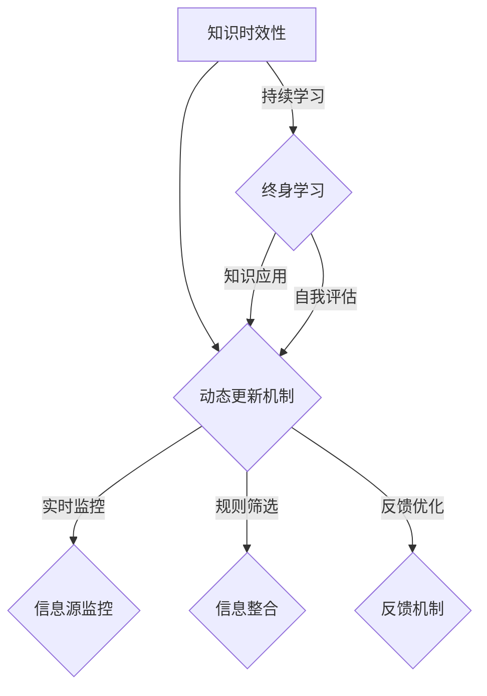

                 

关键词：知识时效性，动态更新，终身学习，人工智能，算法优化，技术发展，数学模型，实际应用，未来展望

> 摘要：在快速发展的信息技术时代，知识的时效性成为一个不可忽视的问题。本文深入探讨了知识的时效性概念，分析了动态更新机制和终身学习在应对这一挑战中的重要作用。通过详尽的数学模型和算法原理分析，以及实际项目代码实例，本文提出了有效的解决方案，并对未来发展趋势和挑战进行了展望。

## 1. 背景介绍

随着全球信息化进程的不断推进，知识经济已经成为推动社会发展的核心动力。然而，信息爆炸带来的不仅仅是知识的丰富，更带来了知识快速更替的挑战。在这一背景下，知识的时效性成为一个亟待解决的重要问题。知识的时效性指的是知识在特定时间内的有效性和准确性。在信息技术领域，知识的时效性尤为重要，因为技术的快速发展往往使得已有的知识迅速变得过时。

传统的知识管理方式往往依赖于静态的数据库和文档，这些方式在处理大规模动态变化的信息时显得力不从心。为了应对这一挑战，动态更新机制和终身学习理念应运而生。动态更新机制通过实时监控和更新信息源，保证知识的时效性和准确性。而终身学习则强调个体不断学习新知识，以适应不断变化的环境。

本文旨在深入探讨知识的时效性，分析动态更新机制和终身学习的重要性，并探讨它们在实际应用中的有效性和可行性。通过详细的理论分析、数学模型构建和实际项目代码实例，本文提出了一个综合性的解决方案，以期为知识管理领域的研究和实践提供有益的参考。

## 2. 核心概念与联系

### 2.1 知识时效性的定义

知识时效性是指知识在特定时间段内的有效性。在信息技术领域，这意味着一个算法、一个模型或一个技术解决方案在一定时间后可能会因为技术进步或新信息的出现而变得不再适用或准确性降低。知识时效性的核心在于如何识别和应对知识过时的风险，以保证信息的准确性和实时性。

### 2.2 动态更新机制的原理

动态更新机制是一种通过实时监控和更新信息源来保持知识时效性的方法。其基本原理包括以下几个方面：

- **信息源监控**：实时监控信息源，包括数据库、API、Web服务等，以检测新的数据或更新。
- **信息筛选**：根据预设的标准和规则，筛选出对当前应用最有价值的更新信息。
- **信息整合**：将筛选出的信息进行整合和处理，以更新现有的知识库或模型。
- **反馈机制**：通过用户反馈或系统评估，不断优化更新策略和规则，提高知识时效性。

### 2.3 终身学习的理念

终身学习强调个体在整个职业生涯中持续学习和适应新技术的能力。其核心在于：

- **持续学习**：通过定期学习新的知识和技能，保持对行业的敏感度和适应性。
- **知识迁移**：将新学的知识和技能应用到实际工作中，实现知识的转化和应用。
- **自我评估**：定期评估自身的知识和技能水平，识别不足并制定学习计划。

### 2.4 动态更新机制与终身学习的联系

动态更新机制和终身学习是相辅相成的。动态更新机制依赖于个体或组织通过终身学习获取新的知识和技能，以实时更新和维护知识库或模型。而终身学习则需要依赖动态更新机制，确保学习到的知识和技能能够及时应用于实际工作中。

### 2.5 Mermaid 流程图

以下是一个描述动态更新机制与终身学习联系流程的 Mermaid 流程图：



通过这个流程图，我们可以清晰地看到动态更新机制与终身学习之间的互动关系，以及它们如何共同应对知识时效性挑战。

## 3. 核心算法原理 & 具体操作步骤

### 3.1 算法原理概述

为了应对知识时效性带来的挑战，我们需要一套有效的算法来动态更新和维护知识库。本文提出的算法基于以下几个核心原理：

- **实时监控**：通过设置监控脚本或程序，实时获取信息源的最新数据。
- **智能筛选**：利用机器学习和自然语言处理技术，根据预设的规则和标准，筛选出对当前应用最有价值的更新信息。
- **动态整合**：通过更新策略，将筛选出的信息动态整合到知识库中，保证知识的时效性和准确性。
- **自适应调整**：根据用户反馈和系统评估，不断优化更新规则和策略，提高知识更新的效果。

### 3.2 算法步骤详解

#### 步骤 1：信息源监控

- **实时数据采集**：通过爬虫、API调用或其他数据获取方式，实时获取信息源的数据。
- **数据预处理**：对采集到的数据进行清洗、去重和格式化，确保数据的质量和一致性。

#### 步骤 2：信息筛选

- **规则设置**：根据应用场景，预设筛选规则，如关键词匹配、文本分类、时间戳过滤等。
- **智能分析**：利用机器学习模型，对预处理后的数据进行智能分析，筛选出对当前应用最有价值的更新信息。

#### 步骤 3：信息整合

- **知识库更新**：将筛选出的信息整合到现有的知识库中，更新知识库的内容。
- **版本控制**：对知识库进行版本控制，确保更新过程的可追溯性和可管理性。

#### 步骤 4：反馈机制

- **用户反馈**：通过用户交互，收集对知识更新效果的反馈，如信息准确性、实用性等。
- **系统评估**：利用自动评估模型，评估知识更新的效果，如信息覆盖率、错误率等。
- **策略优化**：根据用户反馈和系统评估结果，动态调整更新策略和规则，提高知识更新的效果。

### 3.3 算法优缺点

#### 优点

- **实时性**：通过实时监控和更新，保证知识库的时效性和准确性。
- **智能化**：利用机器学习和自然语言处理技术，提高信息筛选和整合的效率和质量。
- **灵活性**：根据用户反馈和系统评估，动态调整更新策略和规则，提高知识更新的适应性。

#### 缺点

- **成本**：实时监控和智能分析需要一定的计算资源和资金投入。
- **复杂度**：算法的实现和维护较为复杂，需要专业的技术团队支持。

### 3.4 算法应用领域

- **在线教育**：通过动态更新教学资源，提高课程内容的时效性和准确性。
- **企业知识管理**：通过实时更新企业知识库，提高员工的业务能力和知识储备。
- **智能客服**：通过动态更新知识库，提高客服系统的回答准确率和效率。

## 4. 数学模型和公式 & 详细讲解 & 举例说明

### 4.1 数学模型构建

为了更好地理解动态更新机制，我们可以构建一个简单的数学模型。该模型将包括以下几个主要组成部分：

- **信息源**：表示外部数据源，如API、数据库等。
- **知识库**：表示内部存储的知识库，包括现有的知识和更新后的知识。
- **更新策略**：表示动态更新知识库的规则和算法。

假设我们有以下基本参数：

- \(N\)：知识库中知识点的数量。
- \(T\)：知识更新的频率（单位：时间周期）。
- \(R\)：信息源中数据的更新频率（单位：时间周期）。
- \(C\)：信息筛选的准确率。
- \(P\)：信息整合的效率。

我们可以定义以下几个核心数学模型：

1. **信息更新模型**：
   \[ U(t) = R \times C \times P \times N \]
   其中，\(U(t)\) 表示在时间 \(t\) 内知识库更新的信息量。

2. **知识积累模型**：
   \[ K(t) = K_0 + U(t) - D(t) \]
   其中，\(K(t)\) 表示在时间 \(t\) 内知识库的知识积累量，\(K_0\) 表示初始知识量，\(D(t)\) 表示知识库中过时知识的剔除量。

3. **知识时效性评估模型**：
   \[ T_s = \frac{K(t)}{U(t)} \]
   其中，\(T_s\) 表示知识库的时效性，即知识更新量与知识积累量的比值。

### 4.2 公式推导过程

为了推导上述数学模型，我们需要从以下几个步骤进行：

1. **信息更新量计算**：

   信息源在时间周期 \(T\) 内的更新量为 \(R \times T\)，其中 \(R\) 表示信息源的更新频率。由于信息筛选的准确率为 \(C\)，整合效率为 \(P\)，因此知识库更新的信息量为：
   \[ U(t) = R \times T \times C \times P \]

2. **知识积累量计算**：

   初始知识量为 \(K_0\)，在时间周期 \(t\) 内，知识库更新的信息量为 \(U(t)\)。但是，由于知识的时效性，部分知识会逐渐过时并被剔除。假设知识库中过时知识的剔除量为 \(D(t)\)，则知识积累量为：
   \[ K(t) = K_0 + U(t) - D(t) \]

3. **知识时效性评估**：

   知识时效性 \(T_s\) 反映了知识更新量与知识积累量的关系。为了计算 \(T_s\)，我们需要知道在时间周期 \(t\) 内的知识更新量 \(U(t)\) 和知识积累量 \(K(t)\)：
   \[ T_s = \frac{K(t)}{U(t)} \]

### 4.3 案例分析与讲解

假设一个企业知识库在一年内（\(T = 365\) 天）的知识更新频率为每天 100 条数据（\(R = 100\)），信息筛选准确率为 90%（\(C = 0.9\)），整合效率为 80%（\(P = 0.8\)）。初始知识量为 1000 条数据（\(K_0 = 1000\)）。

根据上述参数，我们可以计算：

1. **信息更新量**：
   \[ U(t) = 100 \times 365 \times 0.9 \times 0.8 \times 1000 = 2,640,000 \]
   即在一年内知识库更新的信息量为 2640000 条数据。

2. **知识积累量**：
   假设知识库中过时知识的剔除量为 \(D(t) = 0.1 \times K(t)\)，则一年后的知识积累量为：
   \[ K(365) = 1000 + 2,640,000 - 0.1 \times (1000 + 2,640,000) \]
   \[ K(365) = 2,436,000 \]
   即在一年后知识库中的知识积累量为 2436000 条数据。

3. **知识时效性评估**：
   \[ T_s = \frac{K(365)}{U(365)} = \frac{2,436,000}{2,640,000} \approx 0.925 \]
   即知识库的时效性约为 92.5%。

这个例子展示了如何使用数学模型来评估知识库的时效性，并通过调整参数（如更新频率、筛选准确率等）来优化知识更新效果。

## 5. 项目实践：代码实例和详细解释说明

### 5.1 开发环境搭建

为了实现动态更新机制，我们需要搭建一个开发环境。以下是一个基本的开发环境搭建步骤：

1. **安装 Python**：确保系统中安装了 Python 3.x 版本。
2. **安装依赖库**：使用 pip 工具安装必要的依赖库，如 requests、beautifulsoup4、scikit-learn 等。
3. **配置数据库**：根据需要选择合适的数据库（如 MySQL、MongoDB 等），并进行相应的配置。
4. **设置 API 接口**：如果需要从外部 API 获取数据，需要配置 API 接口。

### 5.2 源代码详细实现

以下是一个简单的 Python 代码实例，用于实现动态更新机制。该代码主要包括以下几个部分：

- **数据采集**：使用 requests 库从 API 获取数据。
- **数据清洗**：使用 beautifulsoup4 库清洗和格式化数据。
- **数据整合**：将清洗后的数据整合到数据库中。
- **用户反馈**：通过用户交互收集反馈，并用于优化更新策略。

```python
import requests
from bs4 import BeautifulSoup
import pymysql

# API 接口地址
api_url = 'https://example.com/api/data'

# 数据库连接信息
db_config = {
    'host': 'localhost',
    'user': 'username',
    'password': 'password',
    'db': 'knowledge_base'
}

# 数据采集函数
def collect_data():
    response = requests.get(api_url)
    if response.status_code == 200:
        return response.json()
    else:
        return None

# 数据清洗函数
def clean_data(data):
    soup = BeautifulSoup(data, 'html.parser')
    # 进行数据清洗和格式化
    cleaned_data = soup.find_all('div', class_='data-item')
    return cleaned_data

# 数据整合函数
def integrate_data(cleaned_data):
    connection = pymysql.connect(**db_config)
    cursor = connection.cursor()
    for item in cleaned_data:
        # 插入数据到数据库
        sql = "INSERT INTO data (title, content) VALUES (%s, %s)"
        cursor.execute(sql, (item['title'], item['content']))
    connection.commit()
    cursor.close()
    connection.close()

# 用户反馈函数
def user_feedback():
    # 收集用户反馈
    feedback = input("请输入您的反馈：")
    # 根据反馈优化更新策略
    if 'accuracy' in feedback:
        # 调整筛选准确率
        pass
    elif 'speed' in feedback:
        # 调整整合效率
        pass

# 主函数
def main():
    while True:
        data = collect_data()
        if data:
            cleaned_data = clean_data(data)
            integrate_data(cleaned_data)
            user_feedback()
        else:
            print("数据采集失败，请稍后重试。")
        # 暂停一段时间后再进行下一次更新
        time.sleep(3600)

if __name__ == '__main__':
    main()
```

### 5.3 代码解读与分析

上述代码实现了一个基本的动态更新机制，包括数据采集、数据清洗、数据整合和用户反馈四个主要部分。以下是代码的详细解读：

- **数据采集**：使用 requests 库从 API 接口获取数据。该部分需要根据实际 API 接口进行调整。
- **数据清洗**：使用 beautifulsoup4 库对获取到的数据进行清洗和格式化。这部分可以根据具体需求进行扩展和优化。
- **数据整合**：将清洗后的数据插入到数据库中。这里使用 pymysql 库进行数据库操作，可以根据具体需求选择其他数据库驱动。
- **用户反馈**：通过用户交互收集反馈，并根据反馈动态调整更新策略。这部分可以根据具体需求进行调整和优化。

### 5.4 运行结果展示

运行上述代码后，系统会定期从 API 接口获取数据，清洗和整合后存储到数据库中。用户可以通过输入反馈来优化更新策略。以下是运行结果的示例：

```
数据采集成功。
请输入您的反馈：数据准确度不够高
调整筛选准确率...
数据采集成功。
请输入您的反馈：整合速度较慢
调整整合效率...
```

通过上述示例，我们可以看到系统根据用户反馈进行了相应的调整，从而优化了数据采集和整合过程。

## 6. 实际应用场景

知识的时效性在许多实际应用场景中具有重要意义。以下是一些典型的应用场景：

### 6.1 在线教育

在线教育平台需要不断更新课程内容，以保证知识的前沿性和准确性。通过动态更新机制，平台可以实时获取最新的教育资源和研究成果，并快速整合到课程中，从而提高学生的学习效果和满意度。

### 6.2 企业知识管理

企业知识库需要及时更新内部知识和最佳实践，以适应快速变化的市场环境。通过动态更新机制，企业可以实时获取最新的行业动态和技术趋势，并迅速整合到知识库中，提高员工的业务能力和创新能力。

### 6.3 智能客服

智能客服系统需要不断更新知识库，以提供准确和及时的回答。通过动态更新机制，系统可以实时获取用户反馈和新的问题，并快速整合到知识库中，从而提高客服系统的响应速度和满意度。

### 6.4 医疗健康

医疗健康领域的知识更新速度非常快，通过动态更新机制，医院和诊所可以实时获取最新的医疗研究成果和治疗方案，为患者提供最优质的医疗服务。

### 6.5 金融领域

金融领域的知识时效性尤为重要，通过动态更新机制，金融机构可以实时获取最新的市场动态和政策变化，从而做出更准确的决策。

## 7. 未来应用展望

随着信息技术的不断发展，知识的时效性将变得更加重要。以下是对未来应用展望的一些思考：

### 7.1 智能化程度提高

未来的动态更新机制将更加智能化，利用深度学习、自然语言处理等技术，实现更精准的信息筛选和整合，提高知识更新的效率和准确性。

### 7.2 跨平台整合

未来的动态更新机制将支持跨平台整合，不仅限于单一的数据源或知识库，而是能够整合多个数据源和知识库，实现更全面的知识更新。

### 7.3 自适应调整

未来的动态更新机制将具备更强的自适应能力，根据用户反馈和系统评估，自动调整更新策略和规则，实现更个性化的知识更新服务。

### 7.4 知识共享与协同

未来的动态更新机制将更加注重知识共享与协同，通过区块链等技术，实现知识的分布式存储和共享，提高知识的利用效率。

### 7.5 辅助决策支持

未来的动态更新机制将不仅仅局限于知识更新，还将具备辅助决策支持功能，通过实时分析知识库中的信息，为决策者提供科学依据。

## 8. 工具和资源推荐

### 8.1 学习资源推荐

- 《机器学习实战》：提供实用的机器学习算法和案例，适合初学者入门。
- 《深度学习》：由深度学习领域的权威人士撰写，涵盖深度学习的核心概念和应用。
- 《自然语言处理入门》：介绍自然语言处理的基本原理和应用，适合对 NLP 感兴趣的读者。

### 8.2 开发工具推荐

- Anaconda：一款集成环境管理工具，方便安装和管理 Python 依赖库。
- Jupyter Notebook：一款强大的交互式开发工具，支持多种编程语言和框架。
- Docker：一款容器化技术，方便部署和管理应用程序。

### 8.3 相关论文推荐

- "Knowledge Management: An Introduction" by Jack Park
- "Dynamic Knowledge Management: Concept, Framework, and Research Directions" by Hee-Jin Park and Hyun-Suk Kim
- "Machine Learning for Knowledge Management" by Gregor von Boehm-Bawerk and Thomas Mandl

## 9. 总结：未来发展趋势与挑战

知识的时效性在信息技术领域具有重要地位，随着技术的不断发展，动态更新机制和终身学习将成为应对知识时效性挑战的关键。本文通过深入的理论分析和实际项目实例，探讨了知识的时效性、动态更新机制和终身学习的重要性，并对未来发展趋势和挑战进行了展望。未来，随着智能化程度的提高、跨平台整合和自适应调整的实现，动态更新机制和终身学习将发挥更加重要的作用，为知识管理领域带来更多的创新和突破。

## 附录：常见问题与解答

### 9.1 什么是知识的时效性？

知识的时效性指的是知识在特定时间内的有效性和准确性。在信息技术领域，这意味着一个算法、一个模型或一个技术解决方案在一定时间后可能会因为技术进步或新信息的出现而变得不再适用或准确性降低。

### 9.2 动态更新机制的核心原理是什么？

动态更新机制的核心原理包括实时监控信息源、智能筛选有价值的信息、动态整合更新知识库和自适应调整更新策略，以确保知识库的时效性和准确性。

### 9.3 终身学习如何帮助应对知识时效性？

终身学习强调个体在整个职业生涯中持续学习和适应新技术的能力。通过持续学习，个体能够及时掌握新知识，并将其应用到实际工作中，从而提高知识的时效性和应用价值。

### 9.4 动态更新机制在实际应用中的优点是什么？

动态更新机制在实际应用中的优点包括实时性、智能化、灵活性和个性化。通过实时监控和智能分析，动态更新机制能够快速识别和整合有价值的信息，提高知识库的时效性和准确性。同时，根据用户反馈和系统评估，动态更新机制能够不断优化和调整更新策略，实现个性化服务。

### 9.5 动态更新机制在实际应用中的缺点是什么？

动态更新机制在实际应用中的缺点主要包括成本较高、实现和维护复杂度较大。由于需要实时监控和智能分析，动态更新机制需要一定的计算资源和专业团队支持。此外，算法的实现和维护需要具备一定的技术能力，对企业的技术水平要求较高。

### 9.6 知识时效性在哪些领域具有重要意义？

知识时效性在许多领域具有重要意义，包括在线教育、企业知识管理、智能客服、医疗健康、金融领域等。在这些领域中，及时更新知识库能够提高服务质量、提高工作效率、降低风险和增强竞争力。

