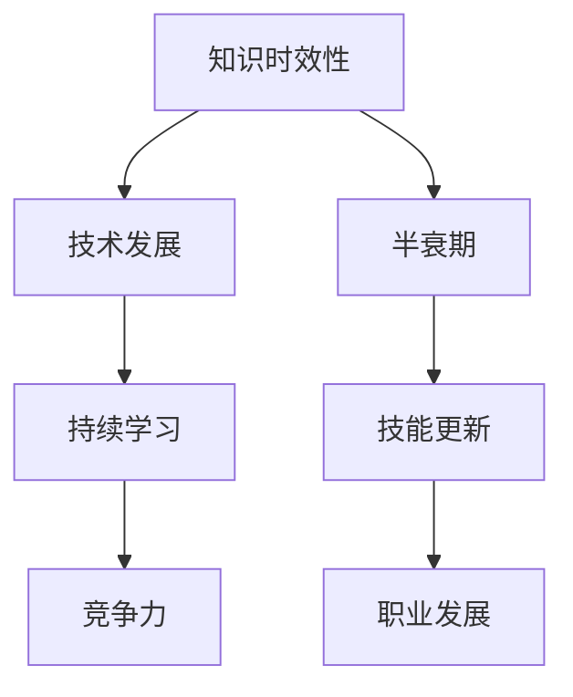

                 

在这个快速发展的数字化时代，知识更新的速度前所未有。作为IT领域的技术专家，我们不仅需要掌握当前的最新技术，还需要了解未来的发展方向，以确保我们的知识和技能始终处于前沿。本文将探讨知识的时效性，分析如何保持与时俱进，以及这对我们个人和职业发展的重要性。

> 关键词：知识的时效性，持续学习，技能更新，未来展望

> 摘要：本文首先介绍了知识时效性的概念和背景，随后探讨了技术发展的趋势和挑战。通过分析核心算法、数学模型、实际应用以及工具和资源，文章提出了保持知识与时俱进的策略和建议，并展望了未来的发展前景。

## 1. 背景介绍

### 1.1 知识时效性的概念

知识的时效性指的是知识在特定时间内的有效性。在IT领域，技术的快速迭代使得很多知识在短时间内就可能过时。例如，曾经主流的编程语言和框架，可能几年后就被新的技术取代。因此，了解知识的时效性对于技术专家来说至关重要。

### 1.2 知识时效性的背景

随着互联网和移动设备的普及，数据的产生和传输速度越来越快，新技术、新平台、新应用层出不穷。据研究，技术领域的知识半衰期（即知识过时的时间）已降至约5年左右。这意味着，我们必须不断学习新的知识和技能，以保持竞争力。

## 2. 核心概念与联系

为了更好地理解知识的时效性，我们可以借助Mermaid流程图来展示相关概念和联系。



### 2.1 核心概念

- **知识时效性**：知识在一定时间内的有效性。
- **技术发展**：新技术的出现和旧技术的淘汰。
- **半衰期**：知识过时的时间。
- **持续学习**：通过不断学习来更新知识和技能。
- **技能更新**：掌握新的技能以应对技术变化。
- **竞争力**：在职业市场中保持竞争力。
- **职业发展**：个人职业的持续进步和成长。

## 3. 核心算法原理 & 具体操作步骤

### 3.1 算法原理概述

在IT领域，算法是解决特定问题的方法。随着技术的进步，新的算法不断涌现。以下是一些核心算法的原理概述：

- **深度学习**：基于神经网络的一种算法，能够通过大量的数据学习和预测。
- **分布式计算**：通过将计算任务分布在多个节点上，提高处理速度和效率。
- **区块链**：一种去中心化的数据库技术，用于存储和验证数据。

### 3.2 算法步骤详解

以下是几个核心算法的具体步骤：

#### 3.2.1 深度学习

1. 数据预处理：清洗和格式化输入数据。
2. 神经网络构建：设计神经网络的结构。
3. 训练模型：使用输入数据训练模型。
4. 预测和评估：使用测试数据评估模型性能。

#### 3.2.2 分布式计算

1. 任务划分：将大任务划分为小任务。
2. 数据分发：将数据分发给不同的计算节点。
3. 并行处理：各个节点同时处理数据。
4. 结果汇总：将各个节点的结果汇总。

#### 3.2.3 区块链

1. 数据加密：使用加密算法保护数据。
2. 数据验证：通过分布式网络验证数据的正确性。
3. 数据存储：将数据存储在区块链中。
4. 节点通信：各个节点通过P2P网络进行通信。

### 3.3 算法优缺点

- **深度学习**：优点是强大的模型能力和高度自动化，缺点是需要大量数据和计算资源。
- **分布式计算**：优点是提高效率和可靠性，缺点是系统复杂性和维护成本较高。
- **区块链**：优点是去中心化和数据安全，缺点是交易速度较慢和存储容量有限。

### 3.4 算法应用领域

- **深度学习**：广泛应用于图像识别、语音识别和自然语言处理等领域。
- **分布式计算**：用于大数据处理、云计算和分布式数据库等。
- **区块链**：应用于数字货币、智能合约和供应链管理等领域。

## 4. 数学模型和公式 & 详细讲解 & 举例说明

### 4.1 数学模型构建

在深度学习中，常用的数学模型包括神经网络、卷积神经网络（CNN）和循环神经网络（RNN）等。以下是一个简单的神经网络模型：

$$
\sigma(z) = \frac{1}{1 + e^{-z}}
$$

其中，$\sigma$是激活函数，$z$是神经元的输入。

### 4.2 公式推导过程

以神经网络为例，我们可以推导出前向传播和反向传播的过程：

#### 前向传播

$$
z_l = \sum_{i=1}^{n} w_{li}x_i + b_l
$$

$$
a_l = \sigma(z_l)
$$

其中，$z_l$是第$l$层的输入，$w_{li}$是权重，$b_l$是偏置，$a_l$是激活值。

#### 反向传播

$$
\delta_l = \frac{\partial L}{\partial z_l} \cdot \frac{\partial \sigma}{\partial a_l}
$$

$$
\delta_{l-1} = \sum_{i=1}^{m} w_{li}\delta_l
$$

其中，$L$是损失函数，$\delta_l$是梯度。

### 4.3 案例分析与讲解

假设我们有一个分类问题，需要将图像分类为猫或狗。我们可以使用卷积神经网络（CNN）来解决这个问题。

#### 数据预处理

1. 数据清洗：去除噪声和异常值。
2. 数据增强：通过旋转、翻转和缩放等方式增加数据多样性。

#### 网络构建

1. 输入层：接受图像数据。
2. 卷积层：提取图像特征。
3. 池化层：减小数据维度。
4. 全连接层：分类。

#### 模型训练

1. 训练集：使用训练集训练模型。
2. 验证集：使用验证集评估模型性能。
3. 测试集：使用测试集测试模型。

#### 结果评估

1. 准确率：分类正确的比例。
2. 精确率：正类预测中正确的比例。
3. 召回率：正类实际为正类且被预测为正类的比例。

## 5. 项目实践：代码实例和详细解释说明

### 5.1 开发环境搭建

1. 安装Python环境。
2. 安装深度学习库，如TensorFlow或PyTorch。

### 5.2 源代码详细实现

```python
import tensorflow as tf
from tensorflow.keras import layers

# 数据预处理
(x_train, y_train), (x_test, y_test) = tf.keras.datasets.cifar10.load_data()

# 网络构建
model = tf.keras.Sequential([
    layers.Conv2D(32, (3, 3), activation='relu', input_shape=(32, 32, 3)),
    layers.MaxPooling2D((2, 2)),
    layers.Flatten(),
    layers.Dense(128, activation='relu'),
    layers.Dense(10, activation='softmax')
])

# 模型编译
model.compile(optimizer='adam',
              loss=tf.keras.losses.SparseCategoricalCrossentropy(from_logits=True),
              metrics=['accuracy'])

# 模型训练
model.fit(x_train, y_train, epochs=10)

# 模型评估
test_loss, test_acc = model.evaluate(x_test,  y_test, verbose=2)
print('\nTest accuracy:', test_acc)
```

### 5.3 代码解读与分析

1. **数据预处理**：从CIFAR-10数据集中加载训练集和测试集，并进行预处理。
2. **网络构建**：使用卷积神经网络（CNN）进行模型构建。
3. **模型编译**：设置优化器和损失函数。
4. **模型训练**：使用训练集训练模型。
5. **模型评估**：使用测试集评估模型性能。

## 6. 实际应用场景

### 6.1 工业应用

深度学习在工业领域有广泛的应用，如图像识别、故障检测、预测维护等。通过深度学习技术，可以提高生产效率，降低成本。

### 6.2 医疗领域

在医疗领域，深度学习可以用于医学图像分析、疾病预测和个性化治疗。例如，通过深度学习技术，可以自动识别和诊断肿瘤，提高诊断准确率。

### 6.3 金融科技

在金融领域，深度学习可以用于风险控制、欺诈检测、信用评估等。通过深度学习技术，可以提高金融服务的安全性和效率。

## 7. 工具和资源推荐

### 7.1 学习资源推荐

- 《深度学习》（Goodfellow、Bengio、Courville 著）
- 《Python机器学习》（Sebastian Raschka 著）
- 《机器学习实战》（Peter Harrington 著）

### 7.2 开发工具推荐

- TensorFlow：用于构建和训练深度学习模型。
- PyTorch：用于研究和开发深度学习算法。
- Keras：用于快速构建和实验深度学习模型。

### 7.3 相关论文推荐

- “Deep Learning”（Ian Goodfellow、Yoshua Bengio、Aaron Courville 著）
- “A Theoretical Framework for Large-scale Machine Learning”（Jianbing Li、Wei-Ying Ma、Xiaohui Xie 著）
- “The Unreasonable Effectiveness of Deep Learning”（Yoshua Bengio 著）

## 8. 总结：未来发展趋势与挑战

### 8.1 研究成果总结

在过去的几年中，深度学习、分布式计算和区块链等技术取得了显著的进展。这些技术不仅提高了计算效率和数据处理能力，还带来了新的应用场景。

### 8.2 未来发展趋势

未来，随着计算能力的提升和数据的爆发增长，深度学习、分布式计算和区块链等领域将继续发展。同时，跨学科融合将成为新的趋势，如深度学习与生物信息学、经济学、社会科学等领域的结合。

### 8.3 面临的挑战

尽管取得了显著进展，但IT领域仍面临一些挑战。例如，算法的透明性和可解释性、数据的隐私保护、系统的安全性和可靠性等。

### 8.4 研究展望

未来，我们需要关注以下几个方向：

1. **算法的优化与改进**：通过改进算法结构和参数，提高计算效率和性能。
2. **跨学科研究**：将深度学习与其他领域相结合，解决实际问题。
3. **数据隐私保护**：研究新的数据隐私保护技术，确保数据的安全和隐私。
4. **系统的可靠性和安全性**：提高系统的稳定性和安全性，确保技术的可靠应用。

## 9. 附录：常见问题与解答

### 9.1 什么是深度学习？

深度学习是一种基于人工神经网络的学习方法，通过模拟人脑神经网络的结构和功能，实现数据的自动学习和预测。

### 9.2 分布式计算和并行计算有什么区别？

分布式计算是指将任务分布在多个节点上同时执行，以提高处理速度和效率。而并行计算是指在同一时间执行多个任务，但不一定分布在不同节点上。

### 9.3 区块链如何保障数据安全？

区块链通过加密算法和分布式网络结构，确保数据的不可篡改性和安全性。同时，区块链的智能合约功能可以自动执行预定的合同条款，提高交易的透明度和可靠性。

作者：禅与计算机程序设计艺术 / Zen and the Art of Computer Programming

---

本文从知识的时效性出发，探讨了如何在快速发展的技术环境中保持与时俱进。通过分析核心算法、数学模型和实际应用，文章提出了保持知识更新的策略和建议。未来，随着技术的不断进步，我们将面临更多的挑战和机遇。保持持续学习和跨学科融合，将是我们应对未来发展的关键。

