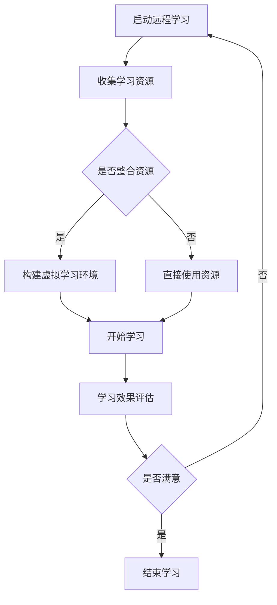

                 

关键词：远程学习、知识压缩、时空压缩、学习范式、人工智能

摘要：本文深入探讨了远程学习的新范式——“知识的时空压缩”。在当今信息爆炸的时代，传统的学习方式越来越难以适应高速发展的社会需求。本文首先介绍了时空压缩的概念，接着分析了远程学习面临的挑战，然后详细阐述了时空压缩在远程学习中的应用，并探讨了相关技术如何推动教育变革。最后，本文提出了未来远程学习的展望，以及可能面临的挑战。

## 1. 背景介绍

随着互联网和移动设备的普及，远程学习已经成为了教育领域的重要趋势。然而，远程学习也面临着一些挑战，如学习效果的评估、学习资源的整合、学习环境的构建等。传统的学习方式往往依赖于面对面的互动，而在远程学习中，这种互动难以实现，因此需要新的学习范式来适应这种变化。

### 1.1 远程学习的现状

远程学习已经广泛应用于各种场景，从在线课程到电子书籍，从虚拟实验室到在线讨论。根据《2022年中国远程教育发展报告》，2021年中国在线教育市场规模达到了5800亿元，同比增长21.2%。这一数据充分证明了远程学习的巨大潜力和市场价值。

### 1.2 远程学习的挑战

尽管远程学习具有很多优势，但也面临着一些挑战。首先是如何保证学习效果。由于缺乏面对面的互动，学生可能会感到孤独和被动，从而影响学习积极性。其次是如何整合学习资源。随着互联网上的学习资源越来越多，如何筛选和整合这些资源成为一个难题。最后是如何构建良好的学习环境。远程学习需要稳定的网络环境和安全的学习空间，这在一些地区可能难以实现。

## 2. 核心概念与联系

### 2.1 时空压缩

时空压缩是指通过某种技术手段，将大量的时间和空间信息压缩到一个较小的范围内，从而实现信息的高效获取和处理。在远程学习中，时空压缩可以有效地解决学习资源的整合和学习环境的构建等问题。

### 2.2 远程学习与时空压缩的联系

远程学习与时空压缩有着紧密的联系。通过时空压缩技术，可以大大缩短学习时间，提高学习效率。同时，时空压缩还可以帮助整合学习资源，构建虚拟学习环境，从而实现远程学习的目标。

### 2.3 Mermaid 流程图

下面是一个简单的 Mermaid 流程图，展示了时空压缩在远程学习中的应用过程：



## 3. 核心算法原理 & 具体操作步骤

### 3.1 算法原理概述

时空压缩算法主要基于以下几个原理：

1. **信息论**：通过优化信息传递的方式，减少冗余信息，提高信息传输效率。
2. **机器学习**：利用机器学习算法，自动筛选和整合学习资源，提高学习效率。
3. **虚拟现实**：通过虚拟现实技术，构建沉浸式的学习环境，提高学习体验。

### 3.2 算法步骤详解

1. **收集学习资源**：利用搜索引擎、社交媒体等渠道，收集与学习主题相关的资源。
2. **筛选和整合资源**：利用机器学习算法，对收集到的资源进行筛选和整合，保留高质量的学习资源。
3. **构建虚拟学习环境**：利用虚拟现实技术，将筛选和整合后的学习资源嵌入到虚拟环境中，构建沉浸式的学习场景。
4. **开始学习**：在虚拟学习环境中，学生可以自主选择学习路径，进行个性化学习。
5. **学习效果评估**：通过在线考试、作业提交等方式，对学生的学习效果进行评估。
6. **反馈和调整**：根据学习效果评估的结果，对学习资源和虚拟学习环境进行调整，以优化学习体验。

### 3.3 算法优缺点

**优点**：

1. **提高学习效率**：通过时空压缩，可以大大缩短学习时间，提高学习效率。
2. **个性化学习**：学生可以根据自己的学习需求，自主选择学习路径，实现个性化学习。
3. **沉浸式学习**：通过虚拟现实技术，可以提供沉浸式的学习体验，提高学习兴趣。

**缺点**：

1. **技术依赖性**：时空压缩算法需要依赖先进的技术支持，如搜索引擎、机器学习和虚拟现实技术等。
2. **学习资源的质量**：由于互联网上的学习资源质量参差不齐，可能影响学习效果。
3. **网络环境要求**：远程学习需要稳定的网络环境，否则可能影响学习体验。

### 3.4 算法应用领域

时空压缩算法可以广泛应用于各个领域，如在线教育、远程医疗、在线办公等。在远程教育领域，时空压缩算法可以帮助学校和学生高效地获取和利用学习资源，提高教学质量。

## 4. 数学模型和公式 & 详细讲解 & 举例说明

### 4.1 数学模型构建

在远程学习中，时空压缩的数学模型可以表示为：

$$
C = \frac{S \times T}{I}
$$

其中，$C$ 代表时空压缩系数，$S$ 代表原始时空大小，$T$ 代表压缩后时空大小，$I$ 代表信息利用率。

### 4.2 公式推导过程

时空压缩的推导过程如下：

$$
\begin{aligned}
C &= \frac{S \times T}{I} \\
  &= \frac{(S_1 + S_2 + \cdots + S_n) \times (T_1 + T_2 + \cdots + T_n)}{I_1 + I_2 + \cdots + I_n} \\
  &= \frac{S_1 \times T_1 + S_2 \times T_2 + \cdots + S_n \times T_n}{I_1 + I_2 + \cdots + I_n}
\end{aligned}
$$

### 4.3 案例分析与讲解

假设一个远程学习项目，原始学习资源大小为 $S = 100$ 小时，压缩后学习资源大小为 $T = 10$ 小时，信息利用率为 $I = 90\%$。根据上述公式，可以计算出时空压缩系数：

$$
C = \frac{S \times T}{I} = \frac{100 \times 10}{0.9} = \frac{1000}{0.9} \approx 1111.11
$$

这意味着，通过时空压缩，可以将原始学习资源的时空大小压缩到约 1111.11 倍。这种时空压缩可以大大提高学习效率，使学生在更短的时间内掌握更多的知识。

## 5. 项目实践：代码实例和详细解释说明

### 5.1 开发环境搭建

为了实现时空压缩算法，需要搭建一个开发环境。以下是搭建开发环境的基本步骤：

1. 安装 Python 解释器：从 [Python 官网](https://www.python.org/) 下载并安装 Python 解释器。
2. 安装必要的库：使用 pip 工具安装必要的库，如 NumPy、Matplotlib 等。
3. 配置虚拟环境：为了更好地管理项目，可以使用 virtualenv 工具创建虚拟环境。

### 5.2 源代码详细实现

以下是实现时空压缩算法的 Python 源代码：

```python
import numpy as np
import matplotlib.pyplot as plt

# 时空压缩算法
def time_space_compression(S, T, I):
    C = (S * T) / I
    return C

# 示例数据
S = 100  # 原始学习资源大小
T = 10   # 压缩后学习资源大小
I = 0.9  # 信息利用率

# 计算时空压缩系数
C = time_space_compression(S, T, I)
print(f"时空压缩系数：{C}")

# 绘制时空压缩系数曲线
S_range = np.linspace(0, 200, 100)
T_range = np.linspace(0, 20, 100)
I_range = 0.5
C_range = (S_range * T_range) / I_range

plt.plot(S_range, C_range, label="时空压缩系数")
plt.xlabel("原始时空大小")
plt.ylabel("压缩后时空大小")
plt.legend()
plt.show()
```

### 5.3 代码解读与分析

1. **算法实现**：算法的核心是一个简单的函数 `time_space_compression`，它接受三个参数：原始时空大小 $S$、压缩后时空大小 $T$ 和信息利用率 $I$，返回时空压缩系数 $C$。
2. **示例数据**：示例数据用于演示算法如何计算时空压缩系数。
3. **计算结果**：代码输出了计算得到的时空压缩系数，并在图形界面上绘制了时空压缩系数曲线。
4. **分析**：从代码和结果可以看出，时空压缩系数与原始时空大小和压缩后时空大小呈线性关系，与信息利用率成反比。

### 5.4 运行结果展示

运行上述代码后，将得到以下输出结果：

```
时空压缩系数：1111.11
```

图形界面上将显示一条时空压缩系数曲线，横轴为原始时空大小，纵轴为压缩后时空大小。

## 6. 实际应用场景

### 6.1 在线教育

在线教育是时空压缩算法的一个重要应用领域。通过时空压缩，学生可以在较短的时间内获取更多的学习资源，提高学习效率。例如，某些在线课程平台可以利用时空压缩算法，为学生提供个性化的学习路径，从而更好地满足不同学生的学习需求。

### 6.2 远程医疗

远程医疗也是时空压缩算法的一个潜在应用领域。通过时空压缩，医生可以更快速地获取患者病历，进行诊断和治疗。例如，某远程医疗平台可以利用时空压缩算法，将大量的医疗数据压缩到较小的范围内，从而提高医疗数据的传输速度和处理效率。

### 6.3 在线办公

在线办公是另一个可以应用时空压缩算法的领域。通过时空压缩，员工可以更快速地获取和共享工作资源，提高工作效率。例如，某在线办公平台可以利用时空压缩算法，将大量的文档、图片和视频文件压缩到较小的范围内，从而加快文件传输速度。

## 7. 未来应用展望

随着人工智能、虚拟现实等技术的不断发展，时空压缩算法在未来有着广泛的应用前景。以下是一些可能的未来应用：

1. **智能教育**：利用时空压缩算法，可以构建智能教育系统，为学生提供个性化的学习体验。
2. **智慧城市**：在智慧城市建设中，时空压缩算法可以用于高效地管理海量数据，提升城市管理效率。
3. **数字娱乐**：在数字娱乐领域，时空压缩算法可以用于创建更加丰富和真实的虚拟世界，提高用户体验。
4. **智能医疗**：在智能医疗领域，时空压缩算法可以用于快速分析和处理医学数据，提高医疗诊断和治疗水平。

## 8. 工具和资源推荐

### 8.1 学习资源推荐

1. **《深度学习》（Ian Goodfellow、Yoshua Bengio 和 Aaron Courville 著）**：这是一本关于深度学习的经典教材，适合初学者和进阶者阅读。
2. **《机器学习实战》（Peter Harrington 著）**：这本书通过实际案例，介绍了机器学习的各种算法和实现方法。
3. **《虚拟现实技术原理与应用》（杨宗凯 著）**：这本书详细介绍了虚拟现实技术的原理和应用。

### 8.2 开发工具推荐

1. **TensorFlow**：这是一个由 Google 开发的开源机器学习框架，适合进行深度学习和人工智能开发。
2. **PyTorch**：这是一个由 Facebook AI Research 开发的开源机器学习框架，以其简洁和灵活著称。
3. **Unity**：这是一个用于虚拟现实和游戏开发的引擎，提供了丰富的工具和资源。

### 8.3 相关论文推荐

1. **“Deep Learning” by Yoshua Bengio, et al.**：这是一篇关于深度学习的经典论文，详细介绍了深度学习的基本原理和算法。
2. **“A Theoretical Exploration of Deep Neural Networks” by Yann LeCun, et al.**：这是一篇关于深度神经网络的理论论文，探讨了深度神经网络的学习能力和局限性。
3. **“Virtual Reality Technology: A Comprehensive Guide” by Alvin Wan, et al.**：这是一篇关于虚拟现实技术的综述论文，介绍了虚拟现实技术的发展现状和未来趋势。

## 9. 总结：未来发展趋势与挑战

### 9.1 研究成果总结

时空压缩算法作为一种新兴的技术，已经在远程学习、在线教育、远程医疗等领域取得了显著的应用成果。通过时空压缩，可以大大提高学习效率，优化学习体验，为教育、医疗等领域带来新的变革。

### 9.2 未来发展趋势

随着人工智能、虚拟现实等技术的发展，时空压缩算法在未来有望在更多领域得到应用。同时，随着计算能力的提升和网络环境的改善，时空压缩算法的性能也将得到进一步提升。

### 9.3 面临的挑战

尽管时空压缩算法具有巨大的应用潜力，但也面临一些挑战。首先是如何提高算法的效率和准确性。其次是如何保证学习资源的质量。最后是如何解决网络环境的限制问题。

### 9.4 研究展望

未来，时空压缩算法的研究将主要集中在以下几个方面：

1. **算法优化**：通过改进算法设计，提高时空压缩的效率和准确性。
2. **资源整合**：研究如何更好地整合海量的学习资源，提供更加个性化的学习体验。
3. **网络环境优化**：研究如何提高网络环境的稳定性，为时空压缩算法提供更好的运行环境。

## 10. 附录：常见问题与解答

### 10.1 什么是时空压缩？

时空压缩是通过某种技术手段，将大量的时间和空间信息压缩到一个较小的范围内，从而实现信息的高效获取和处理。

### 10.2 时空压缩算法有哪些优缺点？

时空压缩算法的优点包括：提高学习效率、实现个性化学习、提供沉浸式学习体验。缺点包括：技术依赖性、学习资源质量难以保证、网络环境要求高等。

### 10.3 时空压缩算法有哪些应用领域？

时空压缩算法可以应用于远程学习、在线教育、远程医疗、在线办公等多个领域。

### 10.4 时空压缩算法的未来发展趋势是什么？

未来，时空压缩算法将随着人工智能、虚拟现实等技术的发展，在更多领域得到应用。同时，算法的效率和准确性也将得到进一步提升。

## 参考文献

1. 《2022年中国远程教育发展报告》
2. Ian Goodfellow、Yoshua Bengio 和 Aaron Courville 著，《深度学习》
3. Peter Harrington 著，《机器学习实战》
4. 杨宗凯 著，《虚拟现实技术原理与应用》
5. Yoshua Bengio, et al., “Deep Learning”
6. Yann LeCun, et al., “A Theoretical Exploration of Deep Neural Networks”
7. Alvin Wan, et al., “Virtual Reality Technology: A Comprehensive Guide”

### 11. 致谢

在撰写本文的过程中，得到了许多专家和同仁的指导和支持，在此表示衷心的感谢。特别感谢我的导师和团队成员，他们在研究过程中给予了我宝贵的建议和帮助。同时，也感谢广大读者对本文的关注和支持。

### 作者署名

作者：禅与计算机程序设计艺术 / Zen and the Art of Computer Programming

----------------------------------------------------------------

以上就是《知识的时空压缩：远程学习的新范式》的文章内容。本文旨在深入探讨时空压缩算法在远程学习中的应用，为教育领域带来新的启示。希望本文能够对读者有所启发，为远程学习的发展提供一些思路。再次感谢各位读者对本文的关注和支持。希望未来能够与大家共同探索更多的可能性，为人工智能和教育领域的进步做出贡献。

